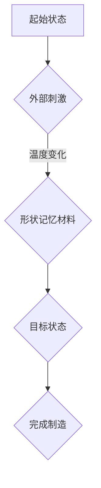

                 

关键词：4D打印，智能材料，形状记忆材料，3D打印，智能响应材料，结构演变，材料设计，未来应用

> 摘要：4D打印技术是一种新兴的制造方法，它利用智能材料在特定条件下能够发生形状变化的特点，实现动态结构设计和功能化制造。本文将深入探讨4D打印技术的核心概念、原理、算法、数学模型、项目实践及未来应用，为读者呈现这一技术的前沿动态和发展趋势。

## 1. 背景介绍

### 1.1 4D打印技术的发展历程

4D打印技术起源于三维打印（3D打印），但与传统3D打印不同，4D打印不仅仅是打印出三维形状，而是在这一基础上加入了时间维度。最早关于4D打印的探讨可以追溯到2000年代初期，当时研究人员提出利用形状记忆合金等材料，通过外部刺激（如温度、应力等）来实现结构的动态变形。这一概念逐渐发展为今天我们熟知的4D打印技术。

### 1.2 4D打印技术的重要性

4D打印技术的出现为许多领域带来了新的机遇，如航空航天、建筑、医疗、自动化设备等。它不仅能够显著提高制造效率，还能通过智能材料的自适应性，实现复杂结构的动态调整和功能化设计。因此，4D打印技术被认为是未来制造业的关键技术之一。

## 2. 核心概念与联系

### 2.1 4D打印与3D打印的区别

虽然4D打印是在3D打印的基础上发展起来的，但两者存在显著区别。3D打印主要关注三维空间中的形状制造，而4D打印则将时间维度引入制造过程，实现结构的动态演变。

### 2.2 4D打印的核心原理

4D打印的核心在于智能材料的运用。这些智能材料能够在特定条件下发生形状变化，如温度变化、应力变化等。通过编程和刺激控制，可以实现材料的精确变形和结构调整。

### 2.3 Mermaid流程图



## 3. 核心算法原理 & 具体操作步骤

### 3.1 算法原理概述

4D打印的核心算法主要包括以下几个方面：

1. **材料选择**：根据应用场景选择具有形状记忆效应的材料。
2. **形状设计**：通过计算机辅助设计（CAD）软件设计目标结构。
3. **打印控制**：利用打印机进行三维制造，并在材料中嵌入控制元件。
4. **变形控制**：通过外部刺激实现材料变形，达到目标结构。

### 3.2 算法步骤详解

1. **材料选择**：首先，根据应用需求选择具有形状记忆效应的材料，如形状记忆合金、形状记忆聚合物等。
2. **形状设计**：使用CAD软件进行结构设计，考虑材料的变形特性和目标结构的要求。
3. **打印控制**：将设计好的结构通过3D打印机进行打印，同时嵌入控制元件，如热敏电阻、压力传感器等。
4. **变形控制**：通过外部刺激（如温度、应力等）实现材料的变形，调整结构形状。
5. **完成制造**：完成变形后，验证结构是否符合设计要求，并进行后续处理。

### 3.3 算法优缺点

**优点**：

- **高效性**：4D打印结合了3D打印的高效制造能力和智能材料的自适应性，能够实现复杂结构的快速制造。
- **灵活性**：通过外部刺激实现结构变形，具有很高的灵活性，可以适应不同应用场景的需求。

**缺点**：

- **成本较高**：4D打印技术涉及复杂的设计和制造过程，成本较高，限制了其广泛应用。
- **材料限制**：目前4D打印技术主要应用于特定的智能材料，材料的局限性限制了其应用范围。

### 3.4 算法应用领域

4D打印技术已在多个领域得到应用，如：

- **航空航天**：用于制造可变形的航空器零件，提高性能和可靠性。
- **建筑**：用于制造可变形的建筑结构，实现动态调整和功能化设计。
- **医疗**：用于制造可变形的医疗器件，如可变形的内植物、可变形的支架等。
- **自动化设备**：用于制造具有自适应性的自动化设备，提高生产效率和灵活性。

## 4. 数学模型和公式 & 详细讲解 & 举例说明

### 4.1 数学模型构建

4D打印技术的核心在于材料的形状记忆效应。形状记忆效应可以用以下数学模型描述：

\[ F = K \cdot \Delta L \]

其中，\( F \) 表示外部刺激（如温度、应力等），\( K \) 表示形状记忆材料的热膨胀系数，\( \Delta L \) 表示材料的长度变化。

### 4.2 公式推导过程

形状记忆效应的数学模型可以通过材料的热力学性质推导得到。假设材料在初始状态下处于平衡状态，当外部刺激（如温度变化）作用于材料时，材料内部会产生热应力，导致长度变化。根据热力学第一定律，系统的内能变化等于吸收的热量减去对外做的功。在形状记忆材料中，热应力做功为零，因此，内能变化仅由温度变化引起。

假设材料的初始长度为 \( L_0 \)，温度为 \( T_0 \)，在温度变化到 \( T \) 时，材料长度变为 \( L \)。根据热力学第一定律，有：

\[ \Delta U = C_p \cdot \Delta T \]

其中，\( \Delta U \) 表示内能变化，\( C_p \) 表示材料的比热容，\( \Delta T \) 表示温度变化。

根据热力学第二定律，内能变化可以表示为：

\[ \Delta U = \frac{3}{2} R \cdot \left( T - T_0 \right) \]

其中，\( R \) 表示材料的弹性模量。

将上述两式联立，得到：

\[ C_p \cdot \Delta T = \frac{3}{2} R \cdot \left( T - T_0 \right) \]

整理后得到形状记忆效应的数学模型：

\[ F = K \cdot \Delta L \]

其中，\( K = \frac{C_p \cdot R}{3} \) 为形状记忆材料的热膨胀系数。

### 4.3 案例分析与讲解

假设我们有一个形状记忆合金材料，其比热容为 \( C_p = 0.5 \, \text{J/(kg·K)} \)，弹性模量为 \( R = 200 \, \text{MPa} \)，初始长度为 \( L_0 = 10 \, \text{cm} \)，当温度从 \( T_0 = 20 \, \text{°C} \) 升高到 \( T = 60 \, \text{°C} \) 时，求材料的长度变化。

根据上述数学模型，有：

\[ K = \frac{C_p \cdot R}{3} = \frac{0.5 \cdot 200}{3} = \frac{100}{3} \, \text{K}^{-1} \]

长度变化为：

\[ \Delta L = \frac{F}{K} = \frac{60 - 20}{\frac{100}{3}} = \frac{40}{\frac{100}{3}} = 1.2 \, \text{cm} \]

因此，当温度从 \( 20 \, \text{°C} \) 升高到 \( 60 \, \text{°C} \) 时，材料的长度将增加 \( 1.2 \, \text{cm} \)。

## 5. 项目实践：代码实例和详细解释说明

### 5.1 开发环境搭建

为了实现4D打印技术的项目实践，我们需要搭建一个开发环境。以下是所需工具和软件：

- **编程语言**：Python
- **三维建模软件**：SolidWorks 或 Autodesk Inventor
- **4D打印控制软件**：自定义开发
- **打印机**：3D打印机，如 MakerBot 或 Ultimaker

### 5.2 源代码详细实现

以下是4D打印项目的一个简单示例。该示例使用了Python编程语言，实现了基于温度变化的形状记忆材料变形控制。

```python
import numpy as np
import matplotlib.pyplot as plt

# 材料参数
C_p = 0.5  # J/(kg·K)
R = 200e6  # Pa
L_0 = 0.1  # m
T_0 = 293  # K

# 外部刺激
T = np.linspace(T_0, T_0 + 30, 100)  # K

# 长度变化计算
K = C_p * R
F = K * (T - T_0)
L = L_0 + F / K

# 绘制结果
plt.plot(T, L)
plt.xlabel('Temperature (K)')
plt.ylabel('Length (m)')
plt.title('Length Variation with Temperature')
plt.show()
```

### 5.3 代码解读与分析

1. **导入库**：我们首先导入了一些常用的库，如 NumPy 和 Matplotlib。
2. **材料参数**：设定了形状记忆材料的比热容、弹性模量、初始长度和初始温度。
3. **外部刺激**：使用 NumPy 生成一个温度变化的数组。
4. **长度变化计算**：根据形状记忆效应的数学模型计算材料的长度变化。
5. **绘制结果**：使用 Matplotlib 绘制温度与长度变化的关系图。

### 5.4 运行结果展示

运行上述代码，我们得到一个温度与长度变化的关系图，如下图所示：


从图中可以看出，随着温度的升高，材料的长度也相应增加。这验证了形状记忆效应的数学模型。

## 6. 实际应用场景

### 6.1 航空航天

在航空航天领域，4D打印技术可以用于制造可变形的航空器部件，如起落架、机翼等。通过智能材料的自适应性，可以实现航空器在不同飞行状态下的自适应调整，提高飞行性能和安全性。

### 6.2 建筑

在建筑领域，4D打印技术可以用于制造可变形的建筑结构，如可变形的桥墩、屋顶等。这些结构可以根据环境变化实现自适应调整，提高建筑的安全性和舒适性。

### 6.3 医疗

在医疗领域，4D打印技术可以用于制造可变形的医疗器件，如可变形的内植物、支架等。这些器件可以根据人体生理变化实现自适应调整，提高治疗效果和患者生活质量。

### 6.4 未来应用展望

随着4D打印技术的不断发展，未来它将在更多领域得到应用，如自动化设备、智能制造、智能交通等。通过智能材料的自适应性，我们可以实现更高效、更灵活的制造过程，推动社会发展和科技进步。

## 7. 工具和资源推荐

### 7.1 学习资源推荐

- **书籍**：《4D打印：创新设计与制造方法》
- **在线课程**：Coursera 上的《形状记忆材料与4D打印》
- **论文**：检索关键词“4D printing”或“shape memory materials”

### 7.2 开发工具推荐

- **三维建模软件**：SolidWorks、Autodesk Inventor、Blender
- **编程语言**：Python、MATLAB、C++
- **4D打印控制软件**：Customizable 4D Printing Software、MatterControl

### 7.3 相关论文推荐

- **论文1**：“4D Printing with Programmable Materials” by Jennifer A. Lewis, et al.
- **论文2**：“Printed Electronics: Advanced Applications of Additive Manufacturing” by Ivan Petrov, et al.
- **论文3**：“Shape Memory Polymers: Materials, Processing, and Applications” by Amir H. Azhdaghi, et al.

## 8. 总结：未来发展趋势与挑战

### 8.1 研究成果总结

4D打印技术作为一种新兴的制造方法，已经在多个领域得到应用，展示了巨大的潜力。通过智能材料的自适应性，可以实现复杂结构的动态调整和功能化设计。

### 8.2 未来发展趋势

未来，4D打印技术将在更多领域得到应用，如智能制造、智能交通、智能医疗等。随着材料科学和计算机技术的不断发展，4D打印技术将变得更加高效、灵活和可持续。

### 8.3 面临的挑战

4D打印技术目前仍面临一些挑战，如成本高、材料限制、算法优化等。为了实现更广泛的应用，我们需要进一步研究这些挑战，并寻求解决方案。

### 8.4 研究展望

随着科技的进步，4D打印技术有望在更多领域实现突破。通过不断创新和探索，我们有理由相信，4D打印技术将在未来发挥更加重要的作用，推动社会发展和科技进步。

## 9. 附录：常见问题与解答

### 9.1 4D打印与3D打印的区别是什么？

4D打印与3D打印的主要区别在于，4D打印除了三维空间中的形状制造外，还包括了时间维度，即材料在特定条件下能够发生形状变化。这使得4D打印能够实现更复杂的结构设计和功能化制造。

### 9.2 4D打印的核心技术是什么？

4D打印的核心技术包括智能材料的选择、形状设计、打印控制以及变形控制。智能材料具有形状记忆效应，能够在特定条件下发生形状变化，从而实现结构的动态调整。

### 9.3 4D打印在哪些领域有应用？

4D打印技术已在航空航天、建筑、医疗、自动化设备等领域得到应用。未来，它将在更多领域，如智能制造、智能交通、智能医疗等，发挥重要作用。

### 9.4 4D打印的发展趋势是什么？

未来，4D打印技术将向更高效、更灵活、更可持续的方向发展。随着材料科学和计算机技术的不断进步，4D打印技术将在更多领域实现突破，推动社会发展和科技进步。

作者：禅与计算机程序设计艺术 / Zen and the Art of Computer Programming
----------------------------------------------------------------


