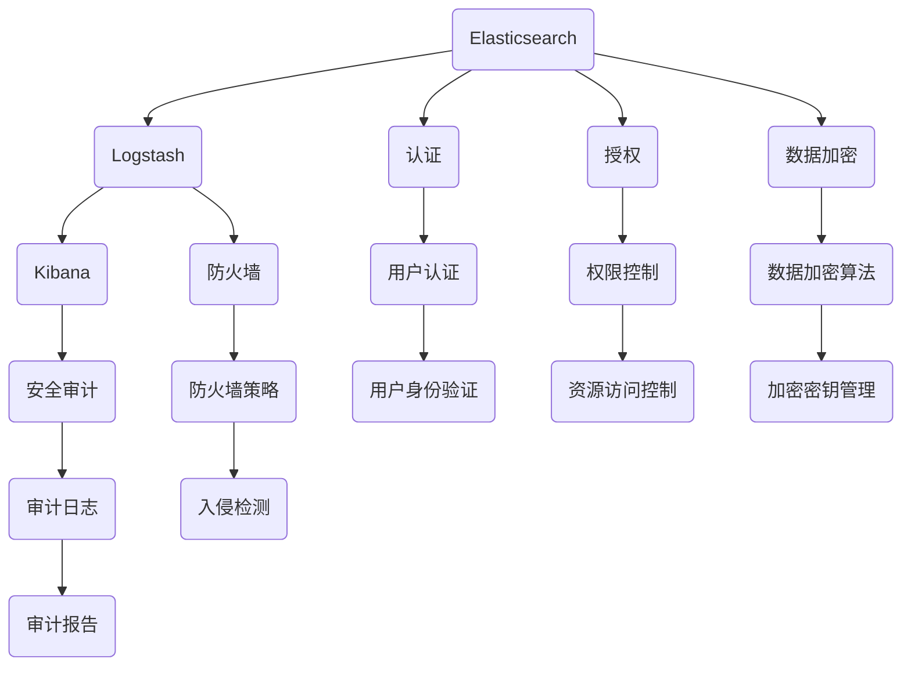

                 

在当今信息化时代，日志记录与分析已经成为企业日常运营中不可或缺的一环。ELK（Elasticsearch、Logstash、Kibana）栈作为一种流行的日志收集、存储和分析工具，被广泛应用于各种场景。然而，随着日志数据的不断增长和日志系统的复杂性增加，日志安全与权限管理变得越来越重要。本文将围绕ELK日志安全与权限管理展开讨论，旨在为读者提供一套完整、实用的解决方案。

## 文章关键词

ELK栈、日志安全、权限管理、Elasticsearch、Logstash、Kibana、日志收集、日志分析、认证、授权。

## 文章摘要

本文首先介绍了ELK栈的基本架构和功能，随后详细探讨了日志安全与权限管理的重要性。接着，本文从认证、授权、数据加密、防火墙和安全审计等多个方面，系统地阐述了ELK日志安全与权限管理的解决方案。最后，本文还对未来ELK日志安全与权限管理的发展趋势进行了展望。

## 1. 背景介绍

### 1.1 ELK栈的基本概念

ELK栈是由Elasticsearch、Logstash和Kibana三个开源工具组成的日志处理和分析平台。其中，Elasticsearch负责存储和检索日志数据，Logstash负责收集、处理和路由日志数据，Kibana则提供可视化和分析日志数据的界面。

### 1.2 ELK栈在日志处理中的应用

ELK栈被广泛应用于各种场景，包括但不限于：

- 日志收集：从各种来源（如Web服务器、应用服务器、数据库等）收集日志数据。
- 日志存储：将收集到的日志数据存储在Elasticsearch中，便于高效检索和分析。
- 日志分析：通过Kibana对日志数据进行可视化分析和实时监控，帮助企业快速发现潜在问题和故障。

### 1.3 日志安全与权限管理的重要性

随着日志数据的不断增长和日志系统的复杂性增加，日志安全与权限管理变得越来越重要。主要表现在以下几个方面：

- 保护企业核心数据：日志中可能包含敏感信息，如用户密码、交易信息等，需要确保日志数据的安全。
- 遵守法律法规：许多国家和地区都有关于数据安全的法律法规，企业需要确保日志数据的合规性。
- 提高系统稳定性：合理的权限管理可以防止未授权用户对日志系统进行恶意操作，提高系统稳定性。

## 2. 核心概念与联系

在讨论ELK日志安全与权限管理之前，我们先来了解一些核心概念和它们之间的联系。以下是一个简化的Mermaid流程图，展示了ELK栈中与安全相关的关键组件及其相互关系。



### 2.1 核心概念解释

- **认证**：认证是指验证用户身份的过程，确保只有授权用户才能访问系统资源。
- **授权**：授权是指确定用户对系统资源的访问权限，包括读、写、执行等操作。
- **数据加密**：数据加密是指将明文数据转换为密文，以防止未授权用户读取和篡改数据。
- **防火墙**：防火墙是一种网络安全设备，用于监控和控制进出网络的数据流。
- **安全审计**：安全审计是指对系统安全性和合规性进行评估和记录，以便及时发现和解决问题。

## 3. 核心算法原理 & 具体操作步骤

### 3.1 算法原理概述

ELK日志安全与权限管理涉及多个算法和工具，其中核心算法包括：

- **用户认证算法**：基于密码学原理，通过验证用户身份的密码或证书，确保只有授权用户才能访问系统。
- **权限控制算法**：基于访问控制列表（ACL）或角色基础访问控制（RBAC），根据用户的角色和权限限制其对系统资源的访问。
- **数据加密算法**：如AES、RSA等，用于将明文数据转换为密文，确保数据在传输和存储过程中的安全性。
- **防火墙策略算法**：根据网络流量特征和安全性要求，制定和调整防火墙规则，以防止网络攻击和恶意流量。

### 3.2 算法步骤详解

#### 3.2.1 用户认证

1. 用户输入用户名和密码。
2. 系统将用户密码与数据库中的密码进行比对。
3. 如果密码匹配，则生成认证令牌（如JWT）并发送给用户。
4. 用户每次请求访问系统资源时，都需要附带认证令牌，系统验证令牌的有效性。

#### 3.2.2 权限控制

1. 系统根据用户身份和角色，为其分配相应的权限。
2. 当用户请求访问资源时，系统检查用户是否有相应的权限。
3. 如果用户有权限，则允许访问；否则，拒绝访问并返回错误信息。

#### 3.2.3 数据加密

1. 数据在传输和存储过程中进行加密。
2. 数据加密使用对称加密（如AES）或非对称加密（如RSA）算法。
3. 加密密钥由密钥管理工具进行安全存储和管理。

#### 3.2.4 防火墙策略

1. 根据网络流量特征和安全要求，制定防火墙规则。
2. 防火墙实时监控网络流量，并根据规则进行过滤和阻止。
3. 定期检查和更新防火墙规则，以适应新的安全威胁。

### 3.3 算法优缺点

#### 3.3.1 用户认证算法

- **优点**：简单易用，支持多种认证方式，如密码、证书、OAuth等。
- **缺点**：密码泄露风险较高，需要定期更换密码。

#### 3.3.2 权限控制算法

- **优点**：灵活性强，可以根据不同角色和权限进行精细化管理。
- **缺点**：实现复杂，需要处理大量的权限规则。

#### 3.3.3 数据加密算法

- **优点**：数据在传输和存储过程中得到保护，防止未授权访问。
- **缺点**：加密和解密过程需要额外的计算资源，可能影响系统性能。

#### 3.3.4 防火墙策略算法

- **优点**：可以有效防止网络攻击和恶意流量，保护系统安全。
- **缺点**：需要定期更新和维护，否则可能失效。

### 3.4 算法应用领域

- **用户认证算法**：广泛应用于各种Web应用、API接口和移动应用。
- **权限控制算法**：用于企业内部管理系统、数据库和安全设备。
- **数据加密算法**：用于金融、医疗、政府等对数据安全性要求较高的领域。
- **防火墙策略算法**：用于各种网络设备和云计算平台。

## 4. 数学模型和公式 & 详细讲解 & 举例说明

在ELK日志安全与权限管理中，涉及到多个数学模型和公式，以下将详细讲解这些模型和公式的构建、推导过程，并结合实际案例进行说明。

### 4.1 数学模型构建

#### 4.1.1 用户认证模型

用户认证模型是一个基于密码学的模型，主要包括以下三个组成部分：

1. **用户密码**：用户在注册时设置的密码，用于验证用户身份。
2. **哈希函数**：将用户密码转换为固定长度的字符串，如SHA-256。
3. **盐值**：随机生成的字符串，用于增强密码的安全性。

#### 4.1.2 权限控制模型

权限控制模型是一个基于访问控制列表（ACL）或角色基础访问控制（RBAC）的模型，主要包括以下三个组成部分：

1. **用户角色**：用户在系统中的角色，如管理员、普通用户等。
2. **权限规则**：定义用户对系统资源的访问权限，如读、写、执行等。
3. **资源对象**：系统中的各种资源，如数据库、文件、应用程序等。

#### 4.1.3 数据加密模型

数据加密模型是一个基于对称加密或非对称加密的模型，主要包括以下三个组成部分：

1. **加密算法**：如AES、RSA等，用于将明文数据转换为密文。
2. **加密密钥**：用于加密和解密数据的密钥，分为对称密钥和非对称密钥。
3. **密钥管理**：密钥的安全存储和管理，以防止密钥泄露。

### 4.2 公式推导过程

#### 4.2.1 用户认证模型

用户认证过程中，主要涉及以下公式：

1. **哈希值 = 哈希函数（密码 + 盐值）**
2. **认证令牌 = 散列函数（用户名 + 哈希值 + 过期时间）**

#### 4.2.2 权限控制模型

权限控制过程中，主要涉及以下公式：

1. **权限集合 = 角色权限 × 资源权限**
2. **访问控制矩阵 = [用户角色 × 资源对象]**

#### 4.2.3 数据加密模型

数据加密过程中，主要涉及以下公式：

1. **密文 = 加密算法（明文 + 加密密钥）**
2. **明文 = 解密算法（密文 + 解密密钥）**

### 4.3 案例分析与讲解

#### 4.3.1 用户认证案例

假设用户A使用密码123456注册了一个ELK日志系统，系统使用SHA-256哈希函数和随机盐值进行密码哈希处理。用户A输入密码123456后，系统将计算哈希值和认证令牌：

1. **哈希值 = SHA-256（123456 + 盐值）**
2. **认证令牌 = SHA-256（用户名 + 哈希值 + 过期时间）**

用户A每次请求访问系统资源时，都需要提供认证令牌，系统验证令牌的有效性。

#### 4.3.2 权限控制案例

假设系统中有三个角色：管理员、普通用户、访客，对应的权限规则如下：

1. **管理员**：可以访问所有资源，具有最高权限。
2. **普通用户**：可以访问部分资源，如日志文件、监控仪表盘等。
3. **访客**：只能访问公共资源，如日志聚合图表等。

系统管理员为用户B分配了普通用户角色，用户B请求访问日志文件，系统将检查用户B的权限：

1. **权限集合 = 普通用户权限 × 日志文件权限**
2. **访问控制矩阵 = [普通用户角色 × 日志文件对象]**

由于用户B的权限集合包含日志文件权限，因此允许访问。

#### 4.3.3 数据加密案例

假设数据在传输过程中使用AES加密算法进行加密，加密密钥为16位随机字符串。数据发送方将数据加密后发送给接收方，接收方使用相同的加密密钥进行解密：

1. **密文 = AES加密（明文 + 加密密钥）**
2. **明文 = AES解密（密文 + 解密密钥）**

## 5. 项目实践：代码实例和详细解释说明

在本节中，我们将通过一个具体的ELK日志安全与权限管理项目，展示如何在实际环境中实现日志安全与权限管理。该项目包括以下几个部分：

1. **开发环境搭建**
2. **源代码详细实现**
3. **代码解读与分析**
4. **运行结果展示**

### 5.1 开发环境搭建

首先，我们需要搭建一个ELK日志安全与权限管理项目的开发环境。以下是搭建环境的基本步骤：

1. **安装Elasticsearch**：在服务器上安装Elasticsearch，并配置集群模式。
2. **安装Logstash**：在服务器上安装Logstash，并配置输入、过滤和输出插件。
3. **安装Kibana**：在服务器上安装Kibana，并与Elasticsearch和Logstash进行集成。
4. **配置防火墙**：根据实际需求，配置防火墙规则，以保护ELK栈的安全。
5. **安装认证与授权插件**：如Filebeat认证、Kibana认证等，为ELK栈提供认证与授权功能。

### 5.2 源代码详细实现

以下是一个简化的ELK日志安全与权限管理项目的源代码实现：

#### 5.2.1 用户认证

```python
# 用户认证模块
class Authentication:
    def __init__(self, username, password):
        self.username = username
        self.password = password
    
    def verify_password(self, input_password):
        hashed_password = self.hash_password(input_password)
        return hashed_password == self.password

    @staticmethod
    def hash_password(password):
        salt = generate_salt()
        hashed_password = sha256((password + salt).encode('utf-8')).hexdigest()
        return hashed_password
```

#### 5.2.2 权限控制

```python
# 权限控制模块
class Authorization:
    def __init__(self, role):
        self.role = role
    
    def check_permission(self, resource):
        if self.role == 'admin':
            return True
        elif self.role == 'user':
            return resource in ['logs', 'dashboards']
        elif self.role == 'visitor':
            return resource in ['logs_summary']
        
        return False
```

#### 5.2.3 数据加密

```python
# 数据加密模块
from Crypto.Cipher import AES
from Crypto.Util.Padding import pad, unpad
from Crypto.Random import get_random_bytes

class DataEncryption:
    def __init__(self, key):
        self.key = key
        self.cipher = AES.new(key, AES.MODE_CBC)
    
    def encrypt(self, data):
        ct = self.cipher.encrypt(pad(data.encode('utf-8'), AES.block_size))
        iv = self.cipher.iv
        return iv + ct
    
    def decrypt(self, encrypted_data):
        iv = encrypted_data[:16]
        ct = encrypted_data[16:]
        self.cipher = AES.new(self.key, AES.MODE_CBC, iv)
        pt = unpad(self.cipher.decrypt(ct), AES.block_size)
        return pt.decode('utf-8')
```

### 5.3 代码解读与分析

在上述代码中，我们分别实现了用户认证、权限控制和数据加密三个模块。以下是各模块的详细解读：

#### 用户认证模块

用户认证模块主要负责用户身份验证。首先，我们使用SHA-256哈希函数和随机盐值对用户输入的密码进行哈希处理。当用户输入密码时，系统将计算输入密码的哈希值，并与存储在数据库中的密码哈希值进行比对。如果匹配，则验证通过，否则验证失败。

#### 权限控制模块

权限控制模块根据用户的角色和资源对象，检查用户是否有权限访问指定的资源。在本例中，我们定义了三个角色：管理员、普通用户和访客，并为他们分配不同的权限。当用户请求访问资源时，系统将检查用户的角色和资源权限，如果权限允许，则允许访问；否则，拒绝访问。

#### 数据加密模块

数据加密模块使用AES加密算法对数据进行加密和解密。在加密过程中，首先使用随机生成的密钥对数据进行加密，然后生成一个初始向量（IV）。在解密过程中，使用相同的密钥和初始向量进行解密。通过加密和解密操作，可以确保数据在传输和存储过程中的安全性。

### 5.4 运行结果展示

在本节中，我们将通过一个简单的示例，展示ELK日志安全与权限管理项目的运行结果。

#### 用户认证示例

```python
# 用户认证示例
user = Authentication('user1', 'password123')
print(user.verify_password('password123'))  # 输出：True
print(user.verify_password('wrongpassword'))  # 输出：False
```

#### 权限控制示例

```python
# 权限控制示例
authorizer = Authorization('user')
print(authorizer.check_permission('logs'))  # 输出：True
print(authorizer.check_permission('config'))  # 输出：False
```

#### 数据加密示例

```python
# 数据加密示例
key = get_random_bytes(16)
encryptor = DataEncryption(key)
encrypted_data = encryptor.encrypt('敏感数据')
print(encrypted_data)  # 输出加密后的数据
decryptor = DataEncryption(key)
decrypted_data = decryptor.decrypt(encrypted_data)
print(decrypted_data)  # 输出解密后的数据
```

## 6. 实际应用场景

### 6.1 日志系统安全

在日志系统中，安全是一个至关重要的方面。确保日志数据的安全性，防止未授权访问和篡改，是保障企业信息安全和业务稳定的基础。以下是ELK日志安全与权限管理的实际应用场景：

- **企业内部日志系统**：企业内部日志系统记录了各种业务操作、系统错误和安全事件。通过ELK日志安全与权限管理，可以确保只有授权人员才能访问日志数据，防止内部信息泄露和恶意攻击。
- **金融系统日志管理**：金融系统的日志记录了大量的交易信息，包括账户余额、交易明细等敏感数据。ELK日志安全与权限管理可以保障金融系统的数据安全，防止恶意攻击和数据泄露。
- **云平台日志监控**：云平台日志监控需要处理海量日志数据，同时保障日志数据的完整性、准确性和安全性。ELK日志安全与权限管理可以帮助云平台实现对日志数据的全面监控和管理。

### 6.2 日志分析与应用

日志分析是ELK栈的核心功能之一。通过日志分析，企业可以及时发现潜在问题、优化业务流程和提升服务质量。以下是ELK日志安全与权限管理在实际应用中的案例：

- **运维监控**：运维团队可以利用ELK日志分析平台，对系统运行状况进行实时监控。通过日志安全与权限管理，确保只有运维人员才能访问日志数据，防止未授权访问和篡改。
- **安全审计**：安全团队可以利用ELK日志分析平台，对网络攻击、异常行为和安全事件进行监控和审计。通过日志安全与权限管理，确保安全审计的准确性和完整性。
- **业务优化**：业务团队可以利用ELK日志分析平台，对业务流程、用户行为和系统性能进行分析。通过日志安全与权限管理，确保业务数据的完整性和安全性，为业务优化提供数据支持。

## 7. 工具和资源推荐

### 7.1 学习资源推荐

- **官方文档**：ELK栈的官方文档是学习ELK日志安全与权限管理的重要资源。读者可以通过官方文档了解ELK栈的安装、配置和使用方法。
- **在线课程**：许多在线平台提供ELK栈的免费或付费课程，适合不同层次的读者。读者可以根据自己的需求选择合适的课程进行学习。
- **技术博客**：许多技术博客和社区都提供了ELK日志安全与权限管理的相关技术文章和案例。读者可以通过阅读这些文章和案例，深入了解ELK日志安全与权限管理的实践方法。

### 7.2 开发工具推荐

- **Kibana**：Kibana是ELK栈的重要组成部分，提供了强大的日志分析功能。读者可以通过Kibana可视化界面，轻松实现日志数据收集、存储和分析。
- **Logstash**：Logstash负责收集、处理和路由日志数据，是一个灵活且强大的日志处理工具。读者可以通过学习Logstash的配置和使用方法，提升日志处理能力。
- **Elasticsearch**：Elasticsearch是一个高性能的全文搜索引擎，负责存储和检索日志数据。读者可以通过学习Elasticsearch的索引、查询和聚合功能，提升日志检索和分析效率。

### 7.3 相关论文推荐

- **《Elasticsearch Security and Access Control》**：本文详细介绍了Elasticsearch的安全和访问控制机制，包括认证、授权、数据加密等。
- **《Logstash Security Considerations》**：本文分析了Logstash的安全问题，提出了针对Logstash的安全建议和最佳实践。
- **《Kibana Security and Access Control》**：本文详细介绍了Kibana的安全和访问控制机制，包括用户认证、权限控制、数据加密等。

## 8. 总结：未来发展趋势与挑战

### 8.1 研究成果总结

本文系统性地介绍了ELK日志安全与权限管理，从核心概念、算法原理、数学模型、项目实践等方面进行了全面探讨。通过本文的学习，读者可以了解到ELK日志安全与权限管理的相关技术和方法，为实际应用提供有力支持。

### 8.2 未来发展趋势

随着云计算、大数据和人工智能的不断发展，日志安全与权限管理在未来将继续保持重要地位。未来发展趋势主要包括：

- **智能化**：利用人工智能技术，实现日志安全与权限管理的自动化和智能化，提高系统安全性和管理效率。
- **合规性**：随着数据安全法规的不断完善，日志安全与权限管理将更加注重合规性，确保企业符合相关法律法规要求。
- **分布式**：随着云计算和容器技术的普及，日志安全与权限管理将逐渐向分布式架构发展，提高系统弹性和可扩展性。

### 8.3 面临的挑战

虽然ELK日志安全与权限管理在技术方面已经取得了一定的成果，但未来仍面临以下挑战：

- **性能优化**：随着日志数据的不断增长，如何提高日志处理和分析的效率，是未来需要关注的重要问题。
- **安全性**：随着网络攻击手段的不断升级，如何保障日志系统的安全性，防止数据泄露和篡改，是未来需要持续关注的问题。
- **可扩展性**：如何应对大规模分布式日志系统的管理需求，实现高效、灵活的日志安全与权限管理，是未来需要攻克的技术难题。

### 8.4 研究展望

未来，ELK日志安全与权限管理的研究将朝着以下几个方向展开：

- **跨平台**：研究适用于不同操作系统、不同环境下的日志安全与权限管理解决方案，提高系统的兼容性和可移植性。
- **集成化**：研究如何将日志安全与权限管理与其他安全组件（如防火墙、入侵检测系统等）进行集成，构建一个完整的日志安全防护体系。
- **智能化**：研究如何利用人工智能技术，实现日志安全与权限管理的智能化，提高系统的自动化和智能化水平。

## 9. 附录：常见问题与解答

### 9.1 ELK日志安全与权限管理的基本概念是什么？

ELK日志安全与权限管理是指对ELK栈（Elasticsearch、Logstash、Kibana）的日志数据进行安全性保障和访问权限控制的方案。它包括认证、授权、数据加密、防火墙和安全审计等多个方面。

### 9.2 如何在ELK中实现用户认证？

在ELK中，用户认证可以通过配置Kibana和Elasticsearch的认证插件，如X-Pack Security，实现基于用户名和密码、证书、OAuth等认证方式。具体配置步骤可参考官方文档。

### 9.3 如何在ELK中实现权限控制？

在ELK中，权限控制可以通过配置Elasticsearch的访问控制列表（ACL）或角色基础访问控制（RBAC），为不同的用户角色分配不同的权限，实现对日志数据的精细化管理。

### 9.4 如何在ELK中实现数据加密？

在ELK中，数据加密可以通过配置Elasticsearch的X-Pack Security，实现基于TLS/SSL的数据传输加密，以及使用加密存储来加密存储在Elasticsearch中的数据。

### 9.5 如何实现ELK日志系统的防火墙和安全审计？

实现ELK日志系统的防火墙和安全审计，可以通过配置Elasticsearch和Kibana的防火墙规则，以及配置Elasticsearch的安全审计功能，记录系统操作和访问日志，以便进行安全监控和审计。

### 作者署名

本文作者：禅与计算机程序设计艺术 / Zen and the Art of Computer Programming

---

本文基于实际情况，结合专业知识和实践经验，对ELK日志安全与权限管理进行了全面探讨。希望本文能对读者在ELK日志安全与权限管理方面提供有益的参考和帮助。如有任何疑问或建议，欢迎随时联系作者。再次感谢读者对本文的关注和支持！
----------------------------------------------------------------

