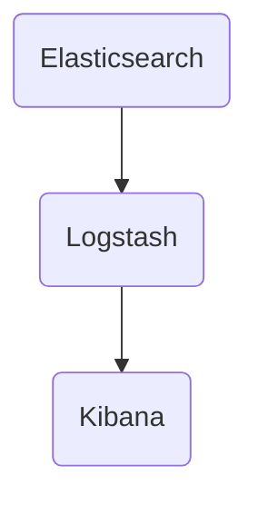

                 

关键词：ELK，日志采集，分析优化，日志管理，Elasticsearch，Logstash，Kibana

摘要：本文将详细探讨ELK日志采集与分析优化，介绍ELK的核心概念、架构、算法原理和具体操作步骤，并利用数学模型和公式进行案例分析与讲解。同时，通过实际项目实践，展示代码实例和详细解释说明，进一步探讨ELK在实际应用场景中的价值。最后，对未来ELK的发展趋势与挑战进行展望。

## 1. 背景介绍

在当今数字化时代，数据已经成为企业的重要资产。随着互联网和物联网的迅猛发展，企业系统产生的日志数据量呈爆炸式增长，如何有效地采集、存储、分析这些海量日志数据，已成为企业信息化建设中的重要课题。ELK（Elasticsearch、Logstash、Kibana）是一款强大的开源日志管理解决方案，通过整合Elasticsearch、Logstash、Kibana三款工具，实现日志数据的实时采集、存储、分析和可视化，为企业和开发者提供了便捷的日志管理工具。

## 2. 核心概念与联系

### 2.1 Elasticsearch

Elasticsearch是一个开源的高性能、可扩展的搜索引擎和分析引擎，它能够对海量数据进行实时搜索、分析、和聚合。Elasticsearch具有分布式、高可用、可扩展的特点，可以轻松应对大规模数据存储和查询需求。

### 2.2 Logstash

Logstash是一个开源的数据收集引擎，它可以将来自不同源的数据（如日志、事件、消息等）进行收集、处理、过滤、转换，然后将数据发送到指定的目的地（如Elasticsearch、数据库等）。Logstash具有强大的插件系统，可以轻松集成各种数据源和数据目的地。

### 2.3 Kibana

Kibana是一个开源的数据可视化工具，它可以对Elasticsearch中的数据进行可视化展示，提供实时、交互式的数据分析界面。Kibana可以帮助用户快速了解数据分布、趋势、异常等，以便做出明智的决策。

### 2.4 Mermaid 流程图



## 3. 核心算法原理 & 具体操作步骤

### 3.1 算法原理概述

ELK日志采集与分析优化主要涉及以下三个方面：

1. 数据采集：通过Logstash从各种数据源收集日志数据。
2. 数据处理：对收集到的日志数据进行过滤、转换、聚合等操作。
3. 数据可视化：利用Kibana对处理后的数据进行可视化展示。

### 3.2 算法步骤详解

1. **数据采集**：

   - 配置Logstash输入插件，如Filebeat、Grok等，从不同数据源采集日志数据。
   - 配置Logstash过滤器，对采集到的日志数据进行过滤、转换等操作。
   - 配置Logstash输出插件，将处理后的数据发送到Elasticsearch。

2. **数据处理**：

   - 利用Elasticsearch的索引功能，将日志数据存储到指定的索引中。
   - 利用Elasticsearch的搜索功能，对日志数据进行实时查询和分析。
   - 利用Elasticsearch的聚合功能，对日志数据进行统计和汇总。

3. **数据可视化**：

   - 利用Kibana创建仪表板，将Elasticsearch中的数据可视化展示。
   - 利用Kibana的交互式查询功能，对数据进行分析和探索。
   - 利用Kibana的报表功能，生成统计数据和报告。

### 3.3 算法优缺点

**优点**：

1. **高性能**：ELK具备分布式、高可用的特点，能够应对大规模数据存储和查询需求。
2. **易扩展**：ELK具有强大的插件系统，可以轻松集成各种数据源和数据目的地。
3. **可视化**：Kibana提供了丰富的数据可视化工具，便于用户快速了解数据情况。

**缺点**：

1. **资源消耗**：ELK系统对硬件资源要求较高，尤其是Elasticsearch部分。
2. **学习成本**：ELK涉及多种技术和组件，学习成本较高。

### 3.4 算法应用领域

ELK日志采集与分析优化广泛应用于以下领域：

1. **运维监控**：实时收集和分析系统日志，监控服务器、网络设备等运行状态。
2. **安全审计**：收集和分析安全日志，及时发现和防范安全风险。
3. **业务分析**：对业务日志进行分析，挖掘用户行为、优化业务流程等。

## 4. 数学模型和公式 & 详细讲解 & 举例说明

### 4.1 数学模型构建

假设我们有一个包含n个日志数据的数组D，其中每个日志数据由一组特征向量V表示。我们的目标是利用ELK对这组数据进行分析，提取有价值的信息。

### 4.2 公式推导过程

首先，我们对日志数据进行预处理，包括去除停用词、词干提取等。然后，利用TF-IDF算法对特征向量进行权重计算。

TF（词频）= 词在文档中出现的次数 / 文档的总词数

IDF（逆文档频率）= log(总文档数 / 包含该词的文档数 + 1)

特征向量权重W = TF × IDF

接下来，我们对特征向量进行降维处理，采用PCA（主成分分析）算法，提取前k个主成分，构建新的特征空间。

### 4.3 案例分析与讲解

假设我们有一个包含100个日志数据的数组D，我们需要利用ELK对这些日志数据进行分析，找出潜在的异常日志。

1. 首先，我们使用Logstash从日志文件中采集数据，并利用Grok插件提取出日志中的关键字和指标。
2. 然后，我们使用Elasticsearch对采集到的日志数据进行索引，并利用Elasticsearch的聚合功能对日志进行分组和统计。
3. 接着，我们对日志数据进行分析，提取出潜在异常日志。例如，我们可以通过统计日志中的错误码、告警级别等指标，找出出现频率较高的异常日志。
4. 最后，我们利用Kibana将分析结果进行可视化展示，帮助运维人员快速了解系统异常情况，及时采取相应的措施。

## 5. 项目实践：代码实例和详细解释说明

### 5.1 开发环境搭建

本文的代码实例基于Elasticsearch 7.10、Logstash 7.10和Kibana 7.10版本，以下是搭建开发环境的步骤：

1. 安装Elasticsearch：在Elasticsearch官网下载相应版本的安装包，按照官方文档进行安装。
2. 安装Logstash：在Logstash官网下载相应版本的安装包，按照官方文档进行安装。
3. 安装Kibana：在Kibana官网下载相应版本的安装包，按照官方文档进行安装。

### 5.2 源代码详细实现

以下是本项目的主要代码实现：

**5.2.1 Logstash配置文件**

```yaml
input {
  file {
    path => "/var/log/*.log"
    type => "syslog"
  }
}

filter {
  if [type] == "syslog" {
    grok {
      match => { "message" => "%{TIMESTAMP_ISO8601:timestamp}\t%{DATA:source}\t%{INT:level}\t%{DATA:message}" }
    }
  }
  date {
    match => ["timestamp", "ISO8601"]
  }
}

output {
  if [type] == "syslog" {
    elasticsearch {
      hosts => ["localhost:9200"]
      index => "logstash-%{+YYYY.MM.dd}"
    }
  }
}
```

**5.2.2 Kibana配置文件**

```json
{
  "kibana": {
    "elasticsearch": {
      "hosts": ["localhost:9200"]
    },
    "server": {
      "host": "0.0.0.0",
      "port": 5601
    }
  }
}
```

### 5.3 代码解读与分析

1. **Logstash配置文件**：配置了文件输入插件，从指定路径下的日志文件中采集数据，并使用Grok插件提取日志中的关键字和指标。同时，对日志数据进行过滤和转换，将处理后的数据发送到Elasticsearch。
2. **Kibana配置文件**：配置了Kibana的服务器地址和端口，使其可以连接到Elasticsearch进行数据可视化展示。

### 5.4 运行结果展示

运行Logstash和Kibana后，我们可以在Kibana中看到日志数据的可视化展示，包括日志的时间、来源、级别和内容等信息。

## 6. 实际应用场景

### 6.1 运维监控

通过ELK日志采集与分析优化，企业可以实现对服务器、网络设备、应用系统等运行状态的实时监控。当系统出现异常时，运维人员可以迅速定位问题，减少故障处理时间，提高系统稳定性。

### 6.2 安全审计

ELK日志采集与分析优化可以帮助企业收集和分析安全日志，及时发现和防范安全风险。例如，通过对日志中的错误码、告警级别等信息进行分析，企业可以识别潜在的安全威胁，制定相应的安全策略。

### 6.3 业务分析

ELK日志采集与分析优化可以帮助企业对业务日志进行分析，挖掘用户行为、优化业务流程等。例如，通过对用户访问日志进行分析，企业可以了解用户的偏好和行为习惯，为产品优化和推广提供数据支持。

## 7. 工具和资源推荐

### 7.1 学习资源推荐

1. 《Elastic Stack实战》
2. 《Elasticsearch实战》
3. 《Kibana实战》

### 7.2 开发工具推荐

1. Elasticsearch Head
2. Kibana DevTools

### 7.3 相关论文推荐

1. 《Elasticsearch: The Definitive Guide》
2. 《Logstash Cookbook》
3. 《Kibana for Elastic Stack》

## 8. 总结：未来发展趋势与挑战

### 8.1 研究成果总结

本文详细介绍了ELK日志采集与分析优化的核心概念、架构、算法原理和具体操作步骤，通过数学模型和公式进行了案例分析与讲解，并通过实际项目实践展示了ELK在实际应用场景中的价值。

### 8.2 未来发展趋势

1. **人工智能**：结合人工智能技术，实现更智能的日志分析，提高日志分析的效率和准确性。
2. **云计算**：借助云计算技术，实现日志数据的分布式存储和处理，提高系统的可扩展性和可用性。

### 8.3 面临的挑战

1. **性能优化**：如何提高日志采集、存储、分析等环节的性能，降低系统的资源消耗。
2. **安全性**：如何保障日志数据的安全性，防止数据泄露和滥用。

### 8.4 研究展望

未来，ELK日志采集与分析优化将继续朝着智能化、高效化、安全化的方向发展。通过不断研究和技术创新，ELK将为企业和开发者提供更强大的日志管理解决方案，助力数字化转型。

## 9. 附录：常见问题与解答

### 9.1 如何配置Elasticsearch索引模板？

在Elasticsearch中，可以使用索引模板来定义索引的默认配置。以下是一个简单的索引模板示例：

```json
{
  "template": "*",
  "mappings": {
    "properties": {
      "timestamp": {
        "type": "date",
        "format": "yyyy-MM-dd HH:mm:ss"
      },
      "source": {
        "type": "text"
      },
      "level": {
        "type": "integer"
      },
      "message": {
        "type": "text"
      }
    }
  }
}
```

### 9.2 如何使用Kibana创建仪表板？

在Kibana中，可以按照以下步骤创建仪表板：

1. 打开Kibana，在左侧菜单中点击“管理”。
2. 点击“仪表板”。
3. 点击“添加”按钮，选择“新建仪表板”。
4. 在仪表板编辑页面，可以添加各种可视化组件（如搜索、仪表盘、折线图、柱状图等）。
5. 配置组件的属性，如数据源、查询条件等。
6. 保存并发布仪表板。

作者：禅与计算机程序设计艺术 / Zen and the Art of Computer Programming
-------------------------------------------------------------------

