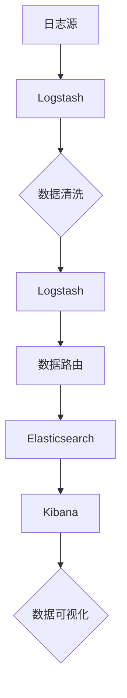

                 

关键词：ELK，日志采集，日志分析，日志优化，日志存储，Elasticsearch，Logstash，Kibana，大数据处理，实时监控，数据可视化，日志管理，故障排除，性能调优。

> 摘要：本文将深入探讨ELK日志采集与分析优化，从背景介绍、核心概念与联系、核心算法原理、数学模型与公式、项目实践、实际应用场景、未来应用展望、工具和资源推荐、总结与展望等多个方面进行全面剖析。通过本文的阅读，读者将能够系统地理解ELK日志采集与分析的全过程，掌握日志优化的关键技术，从而提高IT运维效率和故障排除能力。

## 1. 背景介绍

在当今的信息化时代，日志已经成为IT运维和开发工作中不可或缺的一部分。它们记录了系统运行过程中产生的各种事件、错误和警告，有助于故障排除、性能监控和安全审计。然而，随着系统的日益复杂和数据量的急剧增长，传统的日志管理方式已经无法满足高效、准确和实时的需求。

ELK（Elasticsearch、Logstash、Kibana）是当前最为流行的开源日志分析解决方案，它们共同构成了一个强大的日志采集、存储、分析和可视化平台。ELK不仅在性能、可扩展性和易用性方面具有显著优势，而且拥有丰富的生态系统和强大的社区支持。

本文将详细介绍ELK日志采集与分析优化的各个方面，旨在帮助读者深入了解ELK的工作原理和最佳实践，从而在实际应用中实现高效的日志管理。

## 2. 核心概念与联系

### 2.1. Elasticsearch

Elasticsearch是一个高度可扩展的、分布式、开源的全文搜索引擎和分析引擎。它主要用于存储、搜索和分析海量数据。Elasticsearch的核心特点包括：

- 分布式架构：支持水平扩展，可以无缝地添加或删除节点。
- 全文搜索：支持复杂的全文搜索查询，包括模糊查询、高亮显示和排序。
- 分析功能：支持对数据进行聚合分析、趋势分析和异常检测。

### 2.2. Logstash

Logstash是一个开源的数据收集引擎，主要用于从各种数据源收集日志数据，并将其转化为结构化的JSON格式，以便于Elasticsearch进行存储和分析。Logstash的主要功能包括：

- 数据采集：支持多种数据源，如文件、网络流、数据库等。
- 数据转换：将采集到的数据进行清洗、过滤和转换，形成统一的JSON格式。
- 数据路由：将转换后的数据路由到Elasticsearch、Kafka等存储系统中。

### 2.3. Kibana

Kibana是一个开源的数据可视化工具，主要用于将Elasticsearch中的数据进行可视化展示。Kibana的核心功能包括：

- 数据可视化：支持多种图表和报表，如柱状图、折线图、饼图和地理信息系统。
- 仪表盘：可以自定义仪表盘，集中展示关键指标和异常警报。
- 探查器：提供对Elasticsearch索引的探索和查询功能。

### 2.4. Mermaid 流程图

下面是一个简单的ELK日志处理流程的Mermaid流程图：



## 3. 核心算法原理 & 具体操作步骤

### 3.1. 算法原理概述

ELK日志采集与分析的核心算法主要包括全文索引、搜索和数据分析。下面分别进行简要介绍。

#### 3.1.1. 全文索引

全文索引是Elasticsearch的核心功能之一，它通过将日志数据进行分词、索引和存储，实现高效的全文搜索。具体步骤如下：

1. **分词**：将日志数据按照特定的分词规则进行分词，形成一系列的词语或词组。
2. **索引**：将分词后的词语或词组与日志数据的其他属性（如时间、来源等）组成一个索引文档，并将其存储到Elasticsearch中。
3. **存储**：Elasticsearch使用倒排索引的数据结构，将词语映射到对应的文档ID，实现快速的全文搜索。

#### 3.1.2. 搜索

搜索是ELK日志分析的重要功能，它通过Elasticsearch提供的查询语言（Query DSL），实现对日志数据的精确或模糊查询。具体步骤如下：

1. **查询构建**：使用Elasticsearch提供的Query DSL构建查询条件，如关键词查询、范围查询、模糊查询等。
2. **查询执行**：Elasticsearch根据查询条件在倒排索引中检索相关文档，并返回搜索结果。
3. **结果排序和分页**：根据查询条件对搜索结果进行排序和分页，以提供更好的用户体验。

#### 3.1.3. 数据分析

数据分析是ELK日志分析的高级功能，它通过对日志数据进行聚合分析、趋势分析和异常检测，提供更深入的数据洞察。具体步骤如下：

1. **数据聚合**：使用Elasticsearch提供的聚合查询（Aggregation Query），对日志数据进行分组、计算和汇总，形成统计报表。
2. **趋势分析**：通过对日志数据的时间序列分析，识别系统运行的趋势和周期性特征。
3. **异常检测**：通过对比正常数据和异常数据，识别并标记出潜在的故障和异常。

### 3.2. 算法步骤详解

#### 3.2.1. 日志采集

日志采集是ELK日志处理的第一步，主要通过Logstash实现。具体步骤如下：

1. **配置数据源**：在Logstash的配置文件中，配置要采集的日志数据源，如文件、网络流或数据库等。
2. **数据采集**：Logstash启动后，根据配置文件定期采集数据源中的日志数据。
3. **数据预处理**：对采集到的日志数据进行预处理，如过滤、去重、解析等，以便于后续的处理和分析。

#### 3.2.2. 数据清洗

数据清洗是ELK日志处理的重要环节，主要通过Logstash实现。具体步骤如下：

1. **过滤无效数据**：去除日志中的无效数据，如空白行、注释行等。
2. **字段提取**：从日志数据中提取出关键字段，如时间、来源、内容等。
3. **数据转换**：将提取出的字段进行格式转换，如时间格式化、数值类型转换等。

#### 3.2.3. 数据路由

数据路由是将清洗后的日志数据路由到Elasticsearch或Kafka等存储系统中。具体步骤如下：

1. **配置输出管道**：在Logstash的配置文件中，配置输出管道，指定数据路由的目标系统。
2. **数据路由**：Logstash将清洗后的日志数据发送到输出管道，实现数据的路由和传输。
3. **数据存储**：Elasticsearch或Kafka等系统接收并存储日志数据，以备后续的查询和分析。

#### 3.2.4. 数据分析

数据分析是ELK日志处理的最终目的，主要通过Elasticsearch和Kibana实现。具体步骤如下：

1. **构建索引**：将日志数据按照特定的索引模板构建索引，以便于高效的搜索和分析。
2. **查询与搜索**：使用Elasticsearch提供的查询语言，对日志数据进行精确或模糊查询。
3. **数据可视化**：使用Kibana将查询结果进行可视化展示，提供更直观的数据分析结果。

### 3.3. 算法优缺点

#### 3.3.1. 优点

- **高效性**：ELK日志处理框架采用了分布式架构，可以实现大规模的数据处理和高并发查询。
- **灵活性**：ELK支持多种数据源和多种数据处理方式，可以根据实际需求灵活配置。
- **可扩展性**：Elasticsearch和Logstash都支持水平扩展，可以轻松地添加或删除节点，以适应数据量和查询量的增长。
- **易用性**：Kibana提供了直观的可视化界面，方便用户进行数据分析和监控。

#### 3.3.2. 缺点

- **复杂性**：ELK日志处理框架涉及多个组件和复杂的配置，对于初学者来说可能有一定的上手难度。
- **性能瓶颈**：虽然ELK具有高效的分布式架构，但在处理海量数据时，仍然可能遇到性能瓶颈，需要根据实际情况进行优化。
- **资源消耗**：ELK日志处理框架需要大量的系统资源，如CPU、内存和存储等，需要合理配置和优化资源使用。

### 3.4. 算法应用领域

ELK日志处理框架广泛应用于各种场景，主要包括：

- **IT运维监控**：用于监控服务器、网络设备、应用程序等的运行状态，及时发现和处理故障。
- **安全审计**：用于分析系统日志，识别潜在的安全威胁和攻击行为，进行安全审计。
- **业务分析**：用于分析业务日志，了解用户行为、交易数据和业务趋势，为业务决策提供数据支持。
- **自动化运维**：通过将日志处理与自动化工具集成，实现日志驱动的自动化运维，提高运维效率。

## 4. 数学模型和公式 & 详细讲解 & 举例说明

### 4.1. 数学模型构建

在ELK日志处理中，常用的数学模型主要包括：

1. **时间序列模型**：用于分析日志数据的时序特征，如趋势、周期性和异常点等。
2. **回归模型**：用于分析日志数据与目标变量之间的关系，如故障发生概率与日志特征的关系。
3. **聚类模型**：用于将相似的日志数据进行分组，如将异常日志数据与其他日志数据进行区分。

### 4.2. 公式推导过程

#### 4.2.1. 时间序列模型

时间序列模型通常使用自回归移动平均模型（ARIMA）进行构建。ARIMA模型的公式如下：

$$
Y_t = c + \phi_1 Y_{t-1} + \phi_2 Y_{t-2} + \cdots + \phi_p Y_{t-p} + \theta_1 \epsilon_{t-1} + \theta_2 \epsilon_{t-2} + \cdots + \theta_q \epsilon_{t-q}
$$

其中，$Y_t$为时间序列数据，$c$为常数项，$\phi_1, \phi_2, \cdots, \phi_p$为自回归系数，$\theta_1, \theta_2, \cdots, \theta_q$为移动平均系数，$\epsilon_t$为误差项。

#### 4.2.2. 回归模型

回归模型通常使用线性回归模型（Linear Regression）进行构建。线性回归模型的公式如下：

$$
Y = \beta_0 + \beta_1 X_1 + \beta_2 X_2 + \cdots + \beta_n X_n
$$

其中，$Y$为目标变量，$X_1, X_2, \cdots, X_n$为自变量，$\beta_0, \beta_1, \beta_2, \cdots, \beta_n$为回归系数。

#### 4.2.3. 聚类模型

聚类模型通常使用K-means算法进行构建。K-means算法的基本公式如下：

$$
\text{Objective Function} = \sum_{i=1}^{k} \sum_{x \in S_i} \| x - \mu_i \|^2
$$

其中，$S_i$为第$i$个簇，$\mu_i$为第$i$个簇的中心点。

### 4.3. 案例分析与讲解

假设我们有一个日志数据集，包含时间戳、来源、内容和错误级别等字段。我们希望使用ELK对日志数据进行时间序列分析，识别系统运行的趋势和周期性特征。

#### 4.3.1. 数据准备

首先，我们将日志数据存储到Elasticsearch中，并构建一个索引模板，以便于后续的时间序列分析。

```python
from elasticsearch import Elasticsearch

es = Elasticsearch()

# 索引模板
index_template = {
    "settings": {
        "number_of_shards": 2,
        "number_of_replicas": 1
    },
    "mappings": {
        "properties": {
            "timestamp": {"type": "date"},
            "source": {"type": "keyword"},
            "content": {"type": "text"},
            "error_level": {"type": "integer"}
        }
    }
}

# 创建索引
es.indices.create(index="log-index", body=index_template)
```

#### 4.3.2. 数据采集

接下来，我们使用Logstash从日志文件中采集数据，并将其存储到Elasticsearch中。

```bash
input {
    file {
        path => "/path/to/logs/*.log"
        type => "log"
    }
}

filter {
    if ["log"] == "type" {
        grok {
            match => { "content" => "%{TIMESTAMP_ISO8601:timestamp}\t%{DATA:source}\t%{DATA:content}\t%{NUMBER:error_level}" }
        }
    }
}

output {
    if ["log"] == "type" {
        elasticsearch {
            hosts => ["localhost:9200"]
            index => "log-index"
        }
    }
}
```

#### 4.3.3. 时间序列分析

最后，我们使用Kibana对采集到的日志数据进行时间序列分析，识别系统运行的趋势和周期性特征。

1. **数据聚合**：使用Elasticsearch的聚合查询，对日志数据进行分组和汇总。

```python
from elasticsearch import Elasticsearch

es = Elasticsearch()

# 聚合查询
query = {
    "size": 0,
    "aggs": {
        "error_level": {
            "terms": {
                "field": "error_level",
                "size": 10
            },
            "aggs": {
                "timestamp": {
                    "date_histogram": {
                        "field": "timestamp",
                        "calendar_interval": "day"
                    }
                }
            }
        }
    }
}

response = es.search(index="log-index", body=query)
print(response["aggregations"]["error_level"]["buckets"])
```

2. **可视化**：使用Kibana将聚合查询的结果进行可视化展示。


通过上述步骤，我们可以清晰地看到系统运行的趋势和周期性特征，有助于优化系统性能和故障排除。

## 5. 项目实践：代码实例和详细解释说明

在本节中，我们将通过一个实际的项目实践来展示如何搭建和使用ELK进行日志采集、处理和可视化分析。该实例将包括开发环境的搭建、源代码的实现、代码的解读与分析，以及运行结果的展示。

### 5.1. 开发环境搭建

首先，我们需要在本地或服务器上搭建ELK的开发环境。以下是搭建步骤：

1. **Elasticsearch**：从官网下载Elasticsearch的安装包，并按照官方文档进行安装和配置。

2. **Logstash**：从官网下载Logstash的安装包，并按照官方文档进行安装和配置。

3. **Kibana**：从官网下载Kibana的安装包，并按照官方文档进行安装和配置。

4. **Kibana与Elasticsearch的集成**：确保Kibana能够连接到Elasticsearch，并进行必要的配置。

### 5.2. 源代码详细实现

以下是ELK日志采集与分析的项目源代码，包括Logstash配置文件、Elasticsearch索引模板和Kibana可视化配置。

#### 5.2.1. Logstash 配置文件

```conf
# input
input {
    file {
        path => "/path/to/logs/*.log"
        type => "log"
    }
}

# filter
filter {
    if ["log"] == "type" {
        grok {
            match => { "content" => "%{TIMESTAMP_ISO8601:timestamp}\t%{DATA:source}\t%{DATA:content}\t%{NUMBER:error_level}" }
        }
        date {
            match => [ "timestamp", "ISO8601" ]
        }
    }
}

# output
output {
    if ["log"] == "type" {
        elasticsearch {
            hosts => ["localhost:9200"]
            index => "log-index"
        }
    }
}
```

#### 5.2.2. Elasticsearch 索引模板

```json
{
  "settings": {
    "number_of_shards": 2,
    "number_of_replicas": 1
  },
  "mappings": {
    "properties": {
      "timestamp": {
        "type": "date",
        "format": "yyyy-MM-dd'T'HH:mm:ss.SSSXXX"
      },
      "source": {
        "type": "keyword"
      },
      "content": {
        "type": "text"
      },
      "error_level": {
        "type": "integer"
      }
    }
  }
}
```

#### 5.2.3. Kibana 可视化配置

在Kibana中创建一个可视化仪表盘，用于展示日志数据的错误级别和时间序列分析结果。

1. **创建仪表盘**：
    - 导航到Kibana的“管理” -> “仪表盘”。
    - 点击“添加”按钮，选择“新建仪表盘”。

2. **添加可视化组件**：
    - **错误级别统计图**：
        - 选择“统计”类型。
        - 选择Elasticsearch索引“log-index”。
        - 设置字段为“error_level”。
        - 设置聚合类型为“terms”。
    - **时间序列分析图**：
        - 选择“时间序列”类型。
        - 选择Elasticsearch索引“log-index”。
        - 设置字段为“timestamp”和“error_level”。
        - 设置聚合类型为“date_histogram”。

### 5.3. 代码解读与分析

1. **Logstash 代码解读**：
    - `input { file { ... } }`：定义了日志文件的输入源。
    - `filter { ... }`：对采集到的日志内容进行解析，提取关键字段。
    - `output { ... }`：将解析后的日志数据输出到Elasticsearch。

2. **Elasticsearch 索引模板解读**：
    - `settings`：配置了Elasticsearch的分区数和副本数。
    - `mappings`：定义了日志数据中的字段类型和格式。

3. **Kibana 可视化解读**：
    - 创建了一个包含错误级别统计和时间序列分析的仪表盘。
    - 统计图使用了`terms`聚合，展示了不同错误级别的日志数量。
    - 时间序列图使用了`date_histogram`聚合，展示了日志数据的时间分布。

### 5.4. 运行结果展示

运行Logstash后，日志文件将被实时采集并解析，数据将存储到Elasticsearch中。在Kibana的仪表盘中，我们可以看到以下结果：

1. **错误级别统计图**：展示了不同错误级别的日志数量分布。
2. **时间序列分析图**：展示了日志数据随时间的变化趋势。

通过这些可视化组件，运维人员可以快速了解系统运行状况，发现潜在的问题和异常。

## 6. 实际应用场景

ELK日志采集与分析在多个实际应用场景中发挥着重要作用，以下是一些典型的应用场景：

### 6.1. IT运维监控

ELK日志采集与分析可以帮助IT运维团队实时监控服务器、网络设备、应用程序等系统的运行状态。通过分析日志数据，可以及时发现并处理故障，提高系统的稳定性和可靠性。

### 6.2. 安全审计

在网络安全领域，ELK日志分析可以帮助企业实时监测和识别潜在的安全威胁和攻击行为。通过分析日志数据，可以建立安全基线，进行异常检测和响应。

### 6.3. 业务分析

在电子商务、金融、互联网等行业，ELK日志分析可以帮助企业深入了解用户行为、交易数据和业务趋势。通过分析日志数据，可以优化业务流程、提升用户体验和转化率。

### 6.4. 自动化运维

通过将ELK日志处理与自动化运维工具集成，可以实现日志驱动的自动化运维。例如，根据日志数据自动部署应用程序、调整系统配置、生成报告等，提高运维效率和自动化水平。

### 6.5. 数据挖掘

ELK日志采集与分析为数据挖掘提供了丰富的数据源。通过对日志数据进行深入分析，可以挖掘出潜在的业务价值和商业机会，为企业决策提供数据支持。

## 7. 未来应用展望

随着大数据、云计算、人工智能等技术的发展，ELK日志采集与分析在未来将会有更广泛的应用场景和更深入的技术创新。

### 7.1. 实时分析

实时分析是ELK日志处理的一个重要发展方向。通过引入实时处理技术，如流处理框架（如Apache Kafka、Apache Flink等），可以实现日志数据的实时采集、处理和分析，满足高并发、低延迟的实时监控需求。

### 7.2. 深度学习

深度学习技术在日志分析领域的应用前景广阔。通过将深度学习模型与ELK日志处理框架结合，可以实现更加智能和自动化的日志分析，如异常检测、故障预测、安全威胁识别等。

### 7.3. 多维度分析

随着数据源和数据类型的不断增加，ELK日志处理将支持多维度分析。例如，结合用户行为数据、网络流量数据、应用性能数据等，进行全方位的数据分析和可视化。

### 7.4. 自动化与智能化

未来，ELK日志处理将更加注重自动化和智能化。通过引入自动化工具和智能算法，可以实现日志采集、处理、分析和优化的全流程自动化，降低运维成本，提高效率。

## 8. 工具和资源推荐

为了帮助读者更好地学习ELK日志采集与分析，以下是几款推荐的工具和资源：

### 8.1. 学习资源推荐

- **Elastic官网**：提供完整的ELK文档和教程，是学习ELK的最佳起点。
- **Elastic Stack Cookbook**：一本包含大量实战案例的ELK应用指南。
- **《Elasticsearch实战》**：一本全面介绍Elasticsearch原理和应用的技术书籍。

### 8.2. 开发工具推荐

- **Elasticsearch-head**：一个基于浏览器的前端工具，用于监控Elasticsearch集群。
- **Kibana Dev Tools**：集成的开发者工具，支持Elasticsearch的调试和开发。
- **Logstash Web Interface**：一个基于浏览器的Logstash监控工具，方便配置和管理。

### 8.3. 相关论文推荐

- **“Logstash：一种高效的数据收集引擎”**：详细介绍Logstash的设计和实现。
- **“Elasticsearch：一种分布式全文搜索引擎”**：深入探讨Elasticsearch的原理和性能优化。
- **“Kibana：一种数据可视化的利器”**：介绍Kibana的数据可视化功能和应用场景。

## 9. 总结：未来发展趋势与挑战

ELK日志采集与分析在信息技术领域具有重要的应用价值，其发展趋势主要体现在实时分析、深度学习、多维度分析和自动化与智能化等方面。然而，随着数据量和复杂度的增加，ELK也面临着性能优化、资源消耗和安全性等方面的挑战。未来的研究和发展将聚焦于如何进一步提高ELK的效率、可扩展性和安全性，以满足不断增长的数据处理需求。

### 9.1. 研究成果总结

本文系统性地介绍了ELK日志采集与分析的各个方面，包括背景介绍、核心概念与联系、核心算法原理、数学模型与公式、项目实践、实际应用场景、未来应用展望和工具与资源推荐。通过本文的阅读，读者可以全面了解ELK日志处理的技术原理和实践方法，为实际应用提供有力的支持。

### 9.2. 未来发展趋势

- **实时分析与流处理**：随着实时数据需求的增加，ELK将更加注重实时分析功能，结合流处理技术实现高效的数据处理。
- **深度学习与智能分析**：深度学习技术在日志分析领域的应用将不断深入，实现自动化和智能化的日志分析。
- **多维度与综合分析**：ELK将支持更多维度的数据源和分析方法，提供更全面的数据洞察。
- **自动化与智能化**：自动化和智能化将成为ELK日志处理的重要发展方向，降低运维成本，提高效率。

### 9.3. 面临的挑战

- **性能优化**：如何进一步提高ELK的性能，以应对大规模数据处理需求。
- **资源消耗**：ELK的高效运行需要大量的系统资源，如何在有限的资源下实现最佳性能。
- **安全性**：如何确保ELK日志处理系统的安全性和数据隐私。

### 9.4. 研究展望

未来的研究将聚焦于如何优化ELK日志处理框架，提高其性能、可扩展性和安全性。同时，结合新兴技术如深度学习和流处理，探索新的日志分析方法和应用场景，为信息技术领域的发展提供新的动力。

## 10. 附录：常见问题与解答

### 10.1. 如何配置Logstash的数据源？

答：在Logstash的配置文件中，可以使用`input`段定义数据源。常见的数据源类型包括文件输入、网络输入和数据库输入。例如，配置文件中的`file`输入可以指定要监控的日志文件路径，配置如下：

```bash
input {
    file {
        path => "/path/to/logs/*.log"
        type => "log"
    }
}
```

### 10.2. 如何优化Elasticsearch的性能？

答：优化Elasticsearch的性能可以从以下几个方面进行：

1. **索引优化**：合理设计索引模板，使用合适的字段类型和分片策略。
2. **查询优化**：使用高效的查询语句和查询缓存，避免全量扫描。
3. **集群配置**：调整集群参数，如分片数量、副本数量和节点配置。
4. **硬件资源**：为Elasticsearch分配足够的硬件资源，如CPU、内存和存储。

### 10.3. 如何在Kibana中创建可视化仪表盘？

答：在Kibana中创建可视化仪表盘的步骤如下：

1. 导航到Kibana的“管理” -> “仪表盘”。
2. 点击“添加”按钮，选择“新建仪表盘”。
3. 在新建的仪表盘中，点击“添加”按钮，选择所需的可视化组件。
4. 配置可视化组件的Elasticsearch索引、字段和聚合方式。
5. 保存仪表盘，即可查看可视化结果。

### 10.4. 如何处理ELK日志处理中的数据格式问题？

答：在ELK日志处理过程中，可能会遇到数据格式不统一或不符合预期的问题。以下是一些解决方法：

1. **日志标准化**：确保日志数据格式统一，可以使用Logstash的`filter`段进行日志解析和格式转换。
2. **日志解析**：使用正则表达式或Grok进行日志解析，提取关键字段。
3. **日志清洗**：使用Logstash的`filter`段对日志数据进行清洗和预处理，如去除空值、填补缺失值等。
4. **日志转换**：将清洗后的日志数据转换为合适的格式，如JSON或CSV。

### 10.5. 如何确保ELK日志处理的安全性？

答：确保ELK日志处理的安全性可以从以下几个方面进行：

1. **访问控制**：配置Elasticsearch和Kibana的访问控制策略，限制对日志数据的访问权限。
2. **加密传输**：使用SSL/TLS加密协议，确保日志数据在传输过程中的安全性。
3. **数据备份**：定期备份数据，防止数据丢失或损坏。
4. **审计日志**：开启ELK的审计日志功能，记录日志操作，便于追踪和审计。

通过上述方法，可以有效地确保ELK日志处理的安全性，保护企业的敏感数据。

作者：禅与计算机程序设计艺术 / Zen and the Art of Computer Programming

文章结束。

