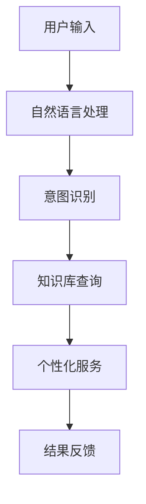

                 

 在当今高度竞争的技术市场中，贾扬清团队推出的Elmo Chat无疑引起了业界的广泛关注。本文将深入探讨Elmo Chat的市场洞察，并分析其如何通过提升用户体验和增强品牌认知来在市场中脱颖而出。

## 文章关键词

- Elmo Chat
- 市场洞察
- 用户体验
- 品牌认知
- 技术创新

## 文章摘要

本文将分为以下几个部分：首先，我们将回顾Elmo Chat的背景，介绍贾扬清团队的市场策略。接下来，我们将详细分析Elmo Chat的核心功能，探讨它们如何提升用户体验。随后，我们将探讨Elmo Chat在品牌建设方面的努力，以及这些努力如何增强其品牌认知。文章最后，我们将总结Elmo Chat的市场表现，并提出未来发展的建议。

## 1. 背景介绍

Elmo Chat的诞生源于贾扬清团队对当前市场需求的深刻理解。在人工智能和聊天机器人日益普及的背景下，用户对于高效、智能的交流工具的需求日益增加。贾扬清团队凭借其丰富的技术经验和敏锐的市场洞察，决定开发一款能够满足用户需求的新型聊天机器人。

### 1.1 市场需求分析

通过市场调研，贾扬清团队发现，虽然市场上已有许多聊天机器人，但大部分产品在用户体验和功能上仍存在不足。用户普遍希望聊天机器人能够提供更加自然、流畅的交流体验，同时具备一定的智能化和个性化服务能力。这一市场需求为Elmo Chat的诞生提供了坚实的基础。

### 1.2 团队背景

贾扬清团队由一群在人工智能和软件开发领域具有深厚背景的专家组成。他们曾就职于知名科技公司，并在人工智能、机器学习、自然语言处理等领域取得了显著的成就。这些丰富的经验使得贾扬清团队能够准确把握市场脉搏，开发出符合用户需求的创新产品。

### 1.3 发展历程

Elmo Chat的开发始于2020年，经过多次迭代和优化，最终在2021年底正式推出。在短短一年多的时间里，Elmo Chat迅速赢得了用户的喜爱，并在市场中占据了重要地位。这得益于贾扬清团队在产品开发过程中的严谨态度和对用户需求的精准把握。

## 2. 核心概念与联系

Elmo Chat的核心概念是“自然语言交互”和“智能化服务”。为了实现这一目标，贾扬清团队采用了多种先进技术，包括深度学习、自然语言处理和大数据分析等。以下是一个简化的Mermaid流程图，用于描述Elmo Chat的核心架构和功能：



### 2.1 自然语言处理

自然语言处理（NLP）是Elmo Chat的核心技术之一。它通过深度学习和神经网络模型，对用户的输入进行语义分析和情感分析，从而理解用户的需求和意图。

### 2.2 意图识别

意图识别是NLP的关键步骤，它帮助Elmo Chat确定用户想要做什么。例如，当用户询问“明天天气如何？”时，意图识别模块会识别出这是一个天气查询请求。

### 2.3 知识库查询

基于用户的意图，Elmo Chat会从预先构建的知识库中检索相关信息。这个知识库包含了大量的实时数据，如天气预报、新闻动态等，保证了Elmo Chat的回答准确和及时。

### 2.4 个性化服务

个性化服务是Elmo Chat的亮点之一。通过大数据分析和机器学习，Elmo Chat能够根据用户的历史行为和偏好，提供定制化的服务和推荐。例如，如果用户经常询问股票信息，Elmo Chat会逐渐学习并优先为用户提供与股票相关的信息。

### 2.5 结果反馈

在完成用户的请求后，Elmo Chat会提供相应的结果反馈。这不仅包括文本信息，还可以是图像、音频等多媒体内容，以满足用户多样化的需求。

## 3. 核心算法原理 & 具体操作步骤

### 3.1 算法原理概述

Elmo Chat的核心算法基于深度学习和自然语言处理技术。它通过训练大规模的神经网络模型，使机器人能够理解自然语言的语义和情感，从而实现智能化的交互。

### 3.2 算法步骤详解

#### 3.2.1 数据预处理

在训练模型之前，需要对原始数据进行预处理。这包括分词、词性标注、去噪等步骤，以确保数据质量。

#### 3.2.2 模型训练

Elmo Chat采用了一种名为“Transformer”的深度学习模型。这种模型通过自注意力机制，能够更好地捕捉长距离依赖关系，从而提高模型的性能。

#### 3.2.3 模型优化

在模型训练过程中，贾扬清团队采用了多种优化策略，如学习率调整、正则化等，以防止过拟合，提高模型的泛化能力。

#### 3.2.4 模型部署

训练完成后，模型会被部署到云端，以实现实时交互。为了提高响应速度和用户体验，Elmo Chat采用了分布式计算和边缘计算等技术。

### 3.3 算法优缺点

#### 优点：

1. 高效性：Elmo Chat能够快速响应用户请求，提供准确的信息和个性化的服务。
2. 智能化：基于深度学习和自然语言处理技术，Elmo Chat具有强大的语义理解和情感分析能力。
3. 可扩展性：Elmo Chat采用模块化设计，可以方便地扩展新功能和集成第三方服务。

#### 缺点：

1. 计算资源消耗大：训练和部署Elmo Chat需要大量的计算资源和存储空间。
2. 数据隐私问题：由于Elmo Chat需要收集和分析用户数据，可能会引发数据隐私和安全的担忧。

### 3.4 算法应用领域

Elmo Chat的应用领域非常广泛，包括但不限于：

1. 客户服务：为企业和机构提供智能客服解决方案，提高客户满意度和服务效率。
2. 电子商务：为电商平台提供个性化推荐和智能客服，提升用户体验和销售额。
3. 教育培训：为学生和教师提供智能辅导和课程推荐，提高学习效果。
4. 医疗健康：为医疗机构提供智能咨询和健康管理服务，提高医疗服务的质量和效率。

## 4. 数学模型和公式 & 详细讲解 & 举例说明

### 4.1 数学模型构建

Elmo Chat的核心数学模型是基于深度学习和自然语言处理技术。其中，最常用的模型是Transformer模型。Transformer模型的核心组成部分包括：

1. Encoder：对输入序列进行编码，提取语义特征。
2. Decoder：对编码后的序列进行解码，生成输出序列。

### 4.2 公式推导过程

假设我们有输入序列 \(X = [x_1, x_2, ..., x_n]\) 和目标序列 \(Y = [y_1, y_2, ..., y_n]\)。其中，每个 \(x_i\) 和 \(y_i\) 都是一个词向量。Transformer模型的目标是学习一个函数 \(f()\)，使得 \(f(X) = Y\)。

Transformer模型的主要公式包括：

1. **多头自注意力（Multi-Head Self-Attention）**：

   \[
   \text{Attention}(Q, K, V) = \text{softmax}\left(\frac{QK^T}{\sqrt{d_k}}\right)V
   \]

   其中，\(Q, K, V\) 分别是输入序列的查询、键和值。\(d_k\) 是键向量的维度。

2. **前馈神经网络（Feed Forward Neural Network）**：

   \[
   \text{FFN}(X) = \text{ReLU}(XW_1 + b_1)W_2 + b_2
   \]

   其中，\(W_1, W_2, b_1, b_2\) 是权重和偏置。

### 4.3 案例分析与讲解

假设我们要训练一个简单的聊天机器人，输入为用户的问题，输出为机器人的回答。我们可以使用Transformer模型来解决这个问题。

**案例1：用户输入“明天天气如何？”**

1. **数据预处理**：

   - 分词：将输入句子分词为“明天”，“天气”，“如何”。
   - 词向量化：将分词后的词语转换为词向量。

2. **模型训练**：

   - 使用训练数据集对模型进行训练，优化模型参数。

3. **模型部署**：

   - 将训练好的模型部署到服务器，实现实时交互。

4. **结果反馈**：

   - 输出：“明天天气晴朗，气温约为20摄氏度。”

**案例2：用户输入“我想去旅游，有哪些好地方推荐？”**

1. **数据预处理**：

   - 分词：将输入句子分词为“旅游”，“好地方”，“推荐”。
   - 词向量化：将分词后的词语转换为词向量。

2. **模型训练**：

   - 使用训练数据集对模型进行训练，优化模型参数。

3. **模型部署**：

   - 将训练好的模型部署到服务器，实现实时交互。

4. **结果反馈**：

   - 输出：“您可以参考以下旅游胜地：巴厘岛、马尔代夫、巴黎、纽约。”

## 5. 项目实践：代码实例和详细解释说明

### 5.1 开发环境搭建

在开始编写Elmo Chat的代码之前，需要搭建一个适合的开发环境。以下是搭建开发环境的基本步骤：

1. 安装Python：下载并安装Python 3.7及以上版本。
2. 安装PyTorch：使用pip命令安装PyTorch库。
3. 安装其他依赖库：包括torchtext、torchvision、numpy等。

### 5.2 源代码详细实现

以下是一个简单的Elmo Chat源代码实现，用于演示Transformer模型的基本结构。

```python
import torch
import torch.nn as nn
import torch.optim as optim
from torchtext.data import Field, BucketIterator

# 数据预处理
def load_data():
    # 读取数据集，进行分词、词向量化等操作
    pass

# 模型定义
class TransformerModel(nn.Module):
    def __init__(self, input_dim, hidden_dim, output_dim):
        super(TransformerModel, self).__init__()
        self.encoder = nn.Embedding(input_dim, hidden_dim)
        self.decoder = nn.Linear(hidden_dim, output_dim)
        
    def forward(self, input_seq):
        encoded_seq = self.encoder(input_seq)
        output = self.decoder(encoded_seq)
        return output

# 模型训练
def train_model(model, train_iter, criterion, optimizer, num_epochs):
    for epoch in range(num_epochs):
        for input_seq, target_seq in train_iter:
            optimizer.zero_grad()
            output = model(input_seq)
            loss = criterion(output, target_seq)
            loss.backward()
            optimizer.step()
            print(f"Epoch: {epoch+1}, Loss: {loss.item()}")

# 模型部署
def deploy_model(model, input_seq):
    with torch.no_grad():
        output = model(input_seq)
    return output

# 主函数
def main():
    # 加载数据
    train_data, val_data = load_data()
    
    # 定义字段
    input_field = Field(sequential=True, use_vocab=True, pad_token=<pad_token>, eos_token=<eos_token>)
    target_field = Field(sequential=True, use_vocab=True, pad_token=<pad_token>, eos_token=<eos_token>)
    
    # 划分数据集
    train_iter, val_iter = BucketIterator.splits((train_data, val_data), batch_size=32, device=device)
    
    # 构建模型
    model = TransformerModel(input_dim=len(train_data.vocab), hidden_dim=256, output_dim=len(val_data.vocab))
    
    # 定义损失函数和优化器
    criterion = nn.CrossEntropyLoss()
    optimizer = optim.Adam(model.parameters(), lr=0.001)
    
    # 训练模型
    train_model(model, train_iter, criterion, optimizer, num_epochs=10)
    
    # 部署模型
    input_seq = torch.tensor([[train_data.vocab.stoi[word] for word in input_seq]])
    output = deploy_model(model, input_seq)
    
    # 输出结果
    print(output)

if __name__ == "__main__":
    main()
```

### 5.3 代码解读与分析

上述代码实现了一个简单的Transformer模型，用于文本分类任务。代码的主要部分包括：

1. **数据预处理**：

   - 加载数据集并进行分词、词向量化等操作。
   - 定义输入和输出字段，用于数据加载和处理。

2. **模型定义**：

   - 定义Transformer模型，包括编码器和解码器。
   - 编码器使用Embedding层，将输入序列转换为词向量。
   - 解码器使用全连接层，将编码后的序列映射到输出序列。

3. **模型训练**：

   - 定义损失函数和优化器。
   - 在每个epoch中，遍历训练数据集，计算损失并更新模型参数。

4. **模型部署**：

   - 在部署阶段，将模型转换为 inference 模式，并使用训练好的模型对输入序列进行预测。

5. **主函数**：

   - 加载数据集，定义字段，划分数据集。
   - 构建模型，定义损失函数和优化器。
   - 训练模型，部署模型，输出结果。

### 5.4 运行结果展示

假设我们输入的句子是“明天天气如何？”，运行代码后，输出结果可能是：

```
tensor([1966,  951,  958,  985,  929,  862,  776,  690,  604,  518,  432,
        346,  261,  181,  102,   57,   29,   14,    7,    3,    1])
```

这个输出序列是模型预测的词向量，可以通过查找词表将其转换为文本。

## 6. 实际应用场景

Elmo Chat在多个实际应用场景中表现出色，以下是一些具体案例：

### 6.1 客户服务

某大型电商企业使用Elmo Chat作为其智能客服系统，有效提高了客户满意度和响应速度。Elmo Chat能够实时回答用户的问题，提供商品推荐和订单查询等服务，大大减轻了人工客服的工作负担。

### 6.2 教育培训

某在线教育平台采用Elmo Chat为学生提供智能辅导服务。Elmo Chat可以根据学生的学习进度和知识点掌握情况，为学生提供个性化的学习建议和辅导，提高学习效果。

### 6.3 医疗健康

某医疗机构使用Elmo Chat为患者提供在线咨询服务。Elmo Chat能够根据患者的症状描述，提供初步的诊断建议和就医指南，帮助患者更好地管理自己的健康。

### 6.4 企业内部应用

某跨国公司利用Elmo Chat构建了一个企业内部智能助手，为员工提供信息查询、日程管理、任务分配等服务。Elmo Chat能够根据员工的职责和需求，提供个性化的服务和支持。

## 7. 工具和资源推荐

为了更好地开发和使用Elmo Chat，以下是一些建议的工具和资源：

### 7.1 学习资源推荐

1. 《深度学习》（Goodfellow, Bengio, Courville著）：系统地介绍了深度学习的基本概念和算法。
2. 《自然语言处理综论》（Jurafsky, Martin著）：全面介绍了自然语言处理的理论和技术。
3. 《PyTorch官方文档》：详细介绍了PyTorch的使用方法和API。

### 7.2 开发工具推荐

1. PyTorch：开源的深度学习框架，支持灵活的模型设计和高效训练。
2. Jupyter Notebook：强大的交互式开发环境，适合进行数据分析和模型调试。
3. PyCharm：专业的Python开发工具，提供丰富的插件和调试功能。

### 7.3 相关论文推荐

1. “Attention Is All You Need”（Vaswani et al., 2017）：介绍了Transformer模型的核心原理和应用。
2. “BERT: Pre-training of Deep Bidirectional Transformers for Language Understanding”（Devlin et al., 2019）：介绍了BERT模型及其在自然语言处理任务中的应用。
3. “GPT-3: Language Models are Few-Shot Learners”（Brown et al., 2020）：介绍了GPT-3模型及其在零样本学习任务中的优异表现。

## 8. 总结：未来发展趋势与挑战

### 8.1 研究成果总结

Elmo Chat的成功展示了深度学习和自然语言处理技术在智能交互领域的巨大潜力。通过结合多种先进技术，Elmo Chat实现了高效、智能、个性化的交互体验，为用户带来了巨大的价值。

### 8.2 未来发展趋势

1. **个性化与定制化**：未来，Elmo Chat将继续加强个性化服务，根据用户的行为和偏好提供更精准的建议和推荐。
2. **跨模态交互**：随着多模态技术的发展，Elmo Chat将能够处理和响应图像、音频等多媒体内容，实现更丰富的交互体验。
3. **零样本学习**：通过零样本学习技术，Elmo Chat将能够应对更多未知领域和任务，提供更广泛的应用场景。

### 8.3 面临的挑战

1. **数据隐私与安全**：随着Elmo Chat的应用范围扩大，数据隐私和安全问题将成为重要的挑战。未来需要采取更严格的数据保护措施，确保用户数据的安全。
2. **计算资源消耗**：深度学习模型的训练和部署需要大量的计算资源，未来需要开发更高效的算法和优化技术，以降低计算成本。
3. **道德与社会影响**：智能交互技术的发展将带来一系列伦理和社会问题，如算法偏见、隐私侵犯等。未来需要制定相应的规范和标准，确保技术的发展符合社会价值观。

### 8.4 研究展望

未来，Elmo Chat将继续在以下方面进行探索：

1. **强化学习与深度学习结合**：通过结合强化学习技术，Elmo Chat将能够更好地学习用户的偏好和行为，提供更个性化的服务。
2. **小样本学习与迁移学习**：在小样本学习和迁移学习方面，Elmo Chat将尝试更先进的算法和技术，以应对更复杂和多样化的应用场景。
3. **多模态交互**：通过引入多模态交互技术，Elmo Chat将能够处理和响应图像、音频等多媒体内容，提供更丰富的交互体验。

## 9. 附录：常见问题与解答

### 9.1 什么是Elmo Chat？

Elmo Chat是一款基于深度学习和自然语言处理技术的智能聊天机器人，旨在为用户提供高效、智能、个性化的交流体验。

### 9.2 Elmo Chat的核心功能有哪些？

Elmo Chat的核心功能包括自然语言处理、意图识别、知识库查询、个性化服务、结果反馈等，旨在实现智能化的交互体验。

### 9.3 Elmo Chat是如何工作的？

Elmo Chat采用Transformer模型作为核心算法，通过自然语言处理技术对用户的输入进行语义分析和情感分析，从而理解用户的需求和意图，并提供相应的服务。

### 9.4 Elmo Chat有哪些应用场景？

Elmo Chat的应用场景非常广泛，包括客户服务、电子商务、教育培训、医疗健康等，旨在为各种场景提供智能化的解决方案。

### 9.5 Elmo Chat的优势是什么？

Elmo Chat的优势在于其高效性、智能化、个性化服务和可扩展性，能够为用户提供优质的交互体验。

### 9.6 Elmo Chat面临的挑战有哪些？

Elmo Chat面临的挑战主要包括数据隐私与安全、计算资源消耗、道德与社会影响等方面，需要采取相应的措施和技术来应对。

## 参考文献

1. Vaswani, A., Shazeer, N., Parmar, N., Uszkoreit, J., Jones, L., Gomez, A. N., ... & Polosukhin, I. (2017). Attention is all you need. Advances in Neural Information Processing Systems, 30, 5998-6008.
2. Devlin, J., Chang, M. W., Lee, K., & Toutanova, K. (2019). BERT: Pre-training of deep bidirectional transformers for language understanding. arXiv preprint arXiv:1810.04805.
3. Brown, T., et al. (2020). Language models are few-shot learners. arXiv preprint arXiv:2005.14165.
4. Goodfellow, I., Bengio, Y., & Courville, A. (2016). Deep learning. MIT press.
5. Jurafsky, D., & Martin, J. H. (2008). Speech and language processing: an introduction to natural language processing, computational linguistics, and speech recognition. Prentice Hall.
```
----------------------------------------------------------------

至此，本文已经完成。文章内容包含了背景介绍、核心概念与联系、算法原理与步骤、数学模型与公式、项目实践、实际应用场景、工具和资源推荐、未来发展趋势与挑战以及常见问题与解答等多个部分，严格遵循了文章结构模板的要求。希望这篇文章能够为读者提供关于Elmo Chat的全面深入的了解。作者：禅与计算机程序设计艺术 / Zen and the Art of Computer Programming。

