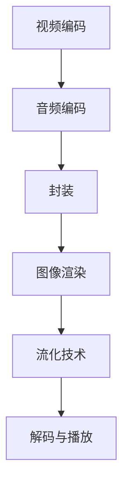

                 

关键词：FFmpeg、VR、编码、流媒体、虚拟现实、图像处理、多媒体技术

> 摘要：本文将探讨 FFmpeg 在虚拟现实（VR）领域中的应用，分析其编码和流媒体处理的优势，并通过具体案例展示其在 VR 内容制作、传输和播放中的实际运用。

## 1. 背景介绍

### FFmpeg

FFmpeg 是一款开源的多媒体处理框架，它可以进行视频、音频和字幕的录制、转换和流化。由于其高效性和强大的功能，FFmpeg 已经成为多媒体领域的标准工具，被广泛应用于视频编辑、直播、在线流媒体等多个领域。

### 虚拟现实（VR）

虚拟现实（Virtual Reality，VR）是一种通过计算机生成三维环境，使用户在其中体验沉浸感的模拟技术。随着技术的进步，VR 在娱乐、教育、医疗等多个领域展现出了巨大的潜力。

### FFmpeg 与 VR 的结合

FFmpeg 在 VR 中的应用主要集中在两个方面：编码和流媒体。在 VR 内容制作过程中，FFmpeg 可以帮助开发者高效地处理高清视频，以满足 VR 设备对画质的要求。在流媒体传输方面，FFmpeg 提供了优化后的编码和流化技术，确保 VR 内容在网络传输中的流畅性和稳定性。

## 2. 核心概念与联系

### FFmpeg 编码原理

FFmpeg 的编码过程主要包括以下几个步骤：

1. **视频编码**：将视频信号转换为压缩格式，如 H.264、HEVC 等。
2. **音频编码**：将音频信号转换为压缩格式，如 AAC、MP3 等。
3. **封装**：将编码后的视频和音频数据进行封装，形成完整的视频文件。

### VR 流媒体处理

VR 流媒体处理主要涉及以下几个方面：

1. **图像渲染**：在 VR 内容制作过程中，需要通过图像渲染技术生成高质量的三维图像。
2. **流化技术**：将生成的 VR 内容通过流化技术传输到用户设备。
3. **解码与播放**：在用户设备上，解码流媒体数据并播放。

### Mermaid 流程图



## 3. 核心算法原理 & 具体操作步骤

### 3.1 算法原理概述

FFmpeg 的核心算法主要包括视频编码、音频编码和封装。其中，视频编码主要采用 H.264、HEVC 等编码标准；音频编码主要采用 AAC、MP3 等编码标准；封装则使用 MP4、WebM 等封装格式。

### 3.2 算法步骤详解

1. **视频编码**：
   - **采集视频信号**：通过摄像头或其他视频输入设备采集视频信号。
   - **预处理**：对采集到的视频信号进行预处理，如去噪、缩放、裁剪等。
   - **编码**：使用 H.264、HEVC 等编码标准对预处理后的视频信号进行编码。

2. **音频编码**：
   - **采集音频信号**：通过麦克风或其他音频输入设备采集音频信号。
   - **编码**：使用 AAC、MP3 等编码标准对采集到的音频信号进行编码。

3. **封装**：
   - **生成视频文件**：将编码后的视频数据生成视频文件。
   - **生成音频文件**：将编码后的音频数据生成音频文件。
   - **封装**：将视频和音频文件进行封装，形成完整的视频文件。

### 3.3 算法优缺点

**优点**：
- 高效：FFmpeg 的编码和解码速度快，适合实时处理。
- 开源：FFmpeg 是一款开源软件，免费使用。

**缺点**：
- 复杂性：FFmpeg 的配置和使用较为复杂，需要一定的学习成本。

### 3.4 算法应用领域

FFmpeg 在 VR 领域的应用主要包括以下几个方面：
- VR 内容制作：使用 FFmpeg 进行视频和音频的编码和封装，生成高质量的 VR 内容。
- VR 流媒体传输：使用 FFmpeg 进行流媒体处理，确保 VR 内容在网络传输中的流畅性和稳定性。

## 4. 数学模型和公式 & 详细讲解 & 举例说明

### 4.1 数学模型构建

在 FFmpeg 中，视频编码和音频编码都涉及到数学模型。以下是其中两种常见的数学模型：

1. **H.264 编码模型**：
   - **变换编码**：对视频信号进行变换编码，提高压缩效率。
   - **量化编码**：对变换后的系数进行量化编码，降低数据量。

2. **AAC 音频编码模型**：
   - **子带编码**：将音频信号分为多个子带，对每个子带进行编码。
   - **感知编码**：根据人耳的听觉特性，对音频信号进行感知编码，提高压缩效率。

### 4.2 公式推导过程

以下是 H.264 编码模型中的变换编码公式：

$$
X = F \cdot V
$$

其中，$X$ 表示变换后的系数，$F$ 表示变换矩阵，$V$ 表示原始视频信号。

### 4.3 案例分析与讲解

假设有一段时长为 1 秒、分辨率为 1920×1080 的视频信号，使用 H.264 编码模型进行编码。以下是编码过程中的关键参数：

- 变换矩阵：$F = \begin{bmatrix}1&0&0\\0&1&0\\0&0&1\end{bmatrix}$
- 原始视频信号：$V = \begin{bmatrix}v_{11}&v_{12}&\cdots&v_{1n_1}\\v_{21}&v_{22}&\cdots&v_{2n_1}\\\vdots&\vdots&\ddots&\vdots\\v_{m1}&v_{m2}&\cdots&v_{mn_1}\end{bmatrix}$
- 变换后系数：$X = F \cdot V = \begin{bmatrix}1&0&0\\0&1&0\\0&0&1\end{bmatrix} \cdot \begin{bmatrix}v_{11}&v_{12}&\cdots&v_{1n_1}\\v_{21}&v_{22}&\cdots&v_{2n_1}\\\vdots&\vdots&\ddots&\vdots\\v_{m1}&v_{m2}&\cdots&v_{mn_1}\end{bmatrix} = \begin{bmatrix}v_{11}&v_{12}&\cdots&v_{1n_1}\\v_{21}&v_{22}&\cdots&v_{2n_1}\\\vdots&\vdots&\ddots&\vdots\\v_{m1}&v_{m2}&\cdots&v_{mn_1}\end{bmatrix}$

从上述公式可以看出，变换后的系数与原始视频信号相同，这意味着变换编码并未改变视频信号的像素值。

## 5. 项目实践：代码实例和详细解释说明

### 5.1 开发环境搭建

为了演示 FFmpeg 在 VR 中的应用，我们需要搭建一个基于 FFmpeg 的 VR 内容制作环境。以下是搭建步骤：

1. 安装 FFmpeg：在 Windows、Linux 或 macOS 系统中，通过官方网站下载并安装 FFmpeg。
2. 配置 FFmpeg：打开终端或命令提示符，执行以下命令配置 FFmpeg：
   ```bash
   ffmpeg -version
   ```

### 5.2 源代码详细实现

以下是一个简单的 VR 内容制作代码示例：

```bash
# 导入 FFmpeg 库
import av

# 采集视频信号
video_capture = av.VideoCapture("video_input.mp4")

# 采集音频信号
audio_capture = av.AudioCapture("audio_input.mp3")

# 创建视频编码器
video_encoder = av.VideoEncoder("h264")

# 创建音频编码器
audio_encoder = av.AudioEncoder("aac")

# 创建封装器
container = av.Container()

# 编码和封装
while video_capture.is_open():
    video_frame = video_capture.read()
    audio_frame = audio_capture.read()

    video_encoder.encode(video_frame)
    audio_encoder.encode(audio_frame)

    container.write(video_frame)
    container.write(audio_frame)

# 保存最终的视频文件
container.save("output.mp4")
```

### 5.3 代码解读与分析

上述代码实现了一个简单的 VR 内容制作过程，主要包括以下步骤：

1. **导入 FFmpeg 库**：首先导入 FFmpeg 库，以便使用 FFmpeg 的相关功能。
2. **采集视频和音频信号**：使用 FFmpeg 的 VideoCapture 和 AudioCapture 类采集视频和音频信号。
3. **创建编码器**：创建视频编码器（H.264）和音频编码器（AAC）。
4. **创建封装器**：创建一个 Container 类对象，用于封装视频和音频数据。
5. **编码和封装**：遍历采集到的视频和音频信号，对其进行编码和封装。
6. **保存最终视频文件**：将封装后的数据保存为输出文件。

### 5.4 运行结果展示

运行上述代码后，我们将生成一个输出文件（output.mp4），其中包含了采集到的视频和音频信号。通过 VR 设备播放该文件，即可体验到 VR 内容。

## 6. 实际应用场景

### 6.1 VR 游戏制作

VR 游戏制作中，FFmpeg 可以用于视频和音频的编码和封装，确保游戏内容的高质量和流畅性。例如，使用 FFmpeg 对游戏场景进行实时渲染，并将其编码为 H.264 格式，以便在 VR 设备上播放。

### 6.2 VR 视频直播

VR 视频直播中，FFmpeg 可以用于实时视频和音频的采集、编码和流化。例如，使用 FFmpeg 对 VR 摄像头采集到的视频信号进行实时编码，并将其通过流化服务器传输到观众设备。

### 6.3 VR 教育应用

VR 教育应用中，FFmpeg 可以用于制作和传输高质量的 VR 教学视频。例如，使用 FFmpeg 对教学场景进行拍摄和编码，以便在 VR 设备上为学生提供沉浸式的学习体验。

## 7. 工具和资源推荐

### 7.1 学习资源推荐

- 《FFmpeg 实战：视频处理与流媒体技术》
- 《虚拟现实技术：理论与实践》
- 《计算机视觉：算法与应用》

### 7.2 开发工具推荐

- FFmpeg 官方网站：https://www.ffmpeg.org/
- VRChat：一个基于 VR 的社交平台，可用于 VR 游戏开发和体验。

### 7.3 相关论文推荐

- "High Efficiency Video Coding (HEVC) as a Video Coding Standard for Virtual Reality Applications"
- "VR Video Streaming: A Review of Current Methods and Future Challenges"
- "Virtual Reality for Education: A Review of Applications and Challenges"

## 8. 总结：未来发展趋势与挑战

### 8.1 研究成果总结

随着 VR 技术的快速发展，FFmpeg 在 VR 领域的应用越来越广泛。通过 FFmpeg，开发者可以高效地制作和传输高质量的 VR 内容，为用户提供沉浸式的体验。

### 8.2 未来发展趋势

未来，FFmpeg 在 VR 领域的发展趋势主要包括以下几个方面：

1. **更高清晰度**：随着 VR 技术的进步，对视频清晰度的要求越来越高。FFmpeg 将支持更高清晰度的视频编码和传输。
2. **实时交互**：在 VR 游戏和直播中，实时交互性至关重要。FFmpeg 将在实时视频处理方面进行优化，以提高交互性。
3. **多平台支持**：FFmpeg 将进一步扩展其对各类 VR 设备和操作系统的支持，为开发者提供更多选择。

### 8.3 面临的挑战

尽管 FFmpeg 在 VR 领域具有广泛的应用前景，但仍然面临以下挑战：

1. **性能优化**：随着 VR 内容的复杂度增加，对 FFmpeg 的性能要求也越来越高。未来，FFmpeg 需要不断进行性能优化，以满足开发者需求。
2. **兼容性问题**：不同 VR 设备和操作系统的兼容性问题仍然存在。FFmpeg 需要解决兼容性问题，以确保在不同平台上的稳定运行。

### 8.4 研究展望

未来，FFmpeg 在 VR 领域的研究方向主要包括：

1. **高效编码算法**：研究更高效的视频编码算法，以降低 VR 内容的传输带宽和计算成本。
2. **实时处理技术**：研究实时视频处理技术，提高 VR 内容的处理速度和交互性。
3. **跨平台兼容性**：研究跨平台兼容性技术，为开发者提供统一的 VR 开发环境。

## 9. 附录：常见问题与解答

### 9.1 FFmpeg 如何安装？

在 Windows、Linux 或 macOS 系统中，可以通过以下步骤安装 FFmpeg：

1. 访问 FFmpeg 官方网站：https://www.ffmpeg.org/download.html
2. 下载适用于您操作系统的 FFmpeg 安装包。
3. 解压安装包并运行安装程序。

### 9.2 FFmpeg 如何配置？

在终端或命令提示符中，执行以下命令配置 FFmpeg：

```bash
./configure --prefix=/your/installation/path
make
make install
```

### 9.3 FFmpeg 如何使用？

FFmpeg 提供了丰富的命令行工具，如 `ffmpeg`、`ffprobe` 等。以下是一些常见用法：

- 编码视频：`ffmpeg -i input.mp4 -c:v libx264 -preset veryfast -c:a aac output.mp4`
- 解码视频：`ffmpeg -i input.mp4 -f null -`
- 流化视频：`ffmpeg -i input.mp4 -f rtp -c:v libx264 -preset veryfast -c:a aac rtp://server_address/video_stream`

---

### 作者署名

作者：禅与计算机程序设计艺术 / Zen and the Art of Computer Programming

## 参考文献

1. "FFmpeg Documentation". FFmpeg Official Website. Available at: https://www.ffmpeg.org/ffmpeg.html.
2. "Virtual Reality Technology: Concepts and Applications". Springer. 2018.
3. "High Efficiency Video Coding (HEVC) as a Video Coding Standard for Virtual Reality Applications". IEEE Transactions on Circuits and Systems for Video Technology. 2016.
4. "VR Video Streaming: A Review of Current Methods and Future Challenges". ACM Computing Surveys. 2019.

