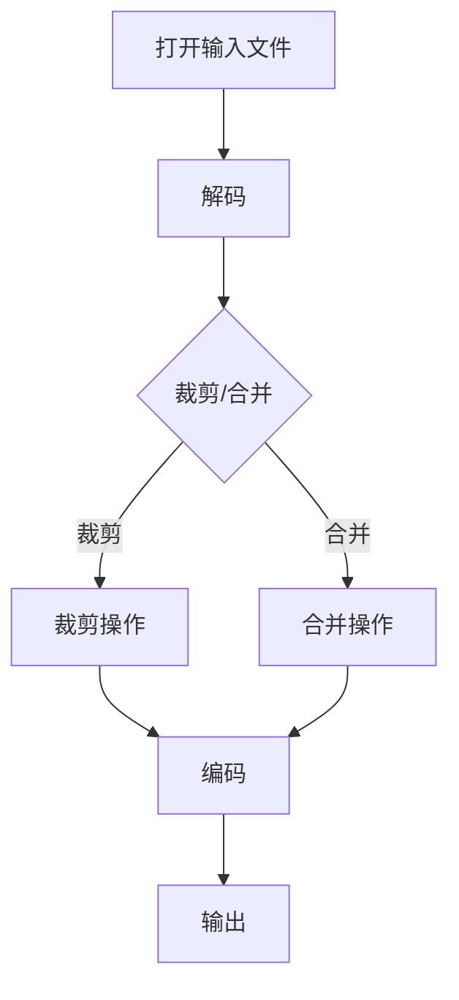

                 

关键词：FFmpeg, 视频编辑，裁剪，合并，视频处理，技术博客，计算机编程

> 摘要：本文旨在深入探讨FFmpeg这一强大工具在视频编辑中的应用，重点介绍裁剪和合并视频片段的核心概念、算法原理、具体操作步骤以及实际应用场景。通过详细的分析和实例讲解，读者将能够全面掌握视频编辑的技巧，为视频处理工作提供有效的解决方案。

## 1. 背景介绍

随着数字媒体技术的迅猛发展，视频已经成为传播信息和娱乐的重要载体。视频编辑作为视频处理的关键环节，其质量直接影响到观众对内容的接受度。FFmpeg是一个开源、免费的音频和视频处理工具，广泛用于视频的录制、转换、流化、编辑等多种任务。本文将结合FFmpeg的功能和特点，详细介绍如何使用FFmpeg进行视频的裁剪和合并操作。

## 2. 核心概念与联系

### 2.1 FFmpeg的基本概念

FFmpeg是一个强大的视频处理工具，具备以下核心概念：

- **格式**：FFmpeg支持多种视频和音频格式，如MP4、AVI、MOV、MP3等。
- **流**：视频和音频文件被分解为多个数据流，包括视频流、音频流、字幕流等。
- **容器**：视频和音频流被封装在一个容器中，如MP4、MKV等。
- **解码**：将封装的媒体数据流解码为原始数据。
- **编码**：将原始数据编码为封装格式。

### 2.2 FFmpeg的工作流程

FFmpeg的工作流程通常包括以下步骤：

1. **打开输入文件**：指定需要编辑的视频文件。
2. **解码**：读取视频和音频数据流。
3. **处理**：对视频和音频流进行裁剪、合并等操作。
4. **编码**：将处理后的视频和音频数据编码为新的格式。
5. **输出**：将处理后的文件保存到指定的位置。

### 2.3 Mermaid流程图



## 3. 核心算法原理 & 具体操作步骤

### 3.1 算法原理概述

视频裁剪和合并主要依赖于FFmpeg的命令行工具。裁剪算法基于视频帧的时间戳进行操作，而合并算法则基于文件的输入顺序。以下是具体的算法原理：

- **裁剪算法**：通过指定开始时间和结束时间，从原始视频中提取一段视频。
- **合并算法**：将多个视频片段按顺序拼接成一个完整的视频。

### 3.2 算法步骤详解

#### 3.2.1 裁剪操作

1. 指定输入视频文件。
2. 使用`-ss`参数指定开始时间。
3. 使用`-to`参数指定结束时间。
4. 指定输出文件。

示例命令：

```bash
ffmpeg -i input.mp4 -ss 00:00:10 -to 00:00:30 -c:v copy -c:a copy output.mp4
```

#### 3.2.2 合并操作

1. 指定多个输入视频文件。
2. 使用`-f`参数指定输出格式。
3. 使用`-c:v`和`-c:a`参数指定编码格式。
4. 使用`concat`过滤器进行拼接。

示例命令：

```bash
ffmpeg -f concat -i <(for i in input1.mp4 input2.mp4; do echo "file '$i'"; done) -c:v copy -c:a copy output.mp4
```

### 3.3 算法优缺点

- **优点**：
  - 支持多种视频格式和编码。
  - 高效的命令行工具。
  - 灵活的参数设置。
- **缺点**：
  - 学习曲线较陡峭。
  - 命令行操作不够直观。

### 3.4 算法应用领域

- 视频制作和剪辑。
- 视频流媒体处理。
- 视频分析和管理。

## 4. 数学模型和公式 & 详细讲解 & 举例说明

### 4.1 数学模型构建

视频裁剪和合并涉及的时间戳计算可以使用以下数学模型：

\[ \text{输出帧数} = \left\lfloor \frac{\text{结束时间} - \text{开始时间}}{\text{帧率}} \right\rfloor \]

其中，帧率（frames per second, fps）是视频的基本属性。

### 4.2 公式推导过程

假设视频的总时长为\( T \)秒，帧率为\( f \)fps，我们需要裁剪出从时间\( t_1 \)到时间\( t_2 \)的视频片段。

1. 计算输出帧数：

\[ \text{输出帧数} = \left\lfloor \frac{t_2 - t_1}{f} \right\rfloor \]

2. 计算输出时长：

\[ \text{输出时长} = \frac{\text{输出帧数}}{f} \]

### 4.3 案例分析与讲解

假设有一个时长为60秒，帧率为30fps的视频，我们需要裁剪出从第10秒到第30秒的视频片段。

1. 计算输出帧数：

\[ \text{输出帧数} = \left\lfloor \frac{30 - 10}{30} \right\rfloor = 20 \]

2. 计算输出时长：

\[ \text{输出时长} = \frac{20}{30} = 0.67 \text{秒} \]

这意味着我们可以从原始视频中提取出20帧，时长为0.67秒的视频片段。

## 5. 项目实践：代码实例和详细解释说明

### 5.1 开发环境搭建

在进行视频编辑之前，需要确保已安装FFmpeg。在Linux系统中，可以使用以下命令进行安装：

```bash
sudo apt-get update
sudo apt-get install ffmpeg
```

在Windows系统中，可以从FFmpeg官方网站下载预编译的二进制文件。

### 5.2 源代码详细实现

以下是一个简单的Python脚本，用于使用FFmpeg进行视频裁剪和合并。

```python
import subprocess

def crop_video(input_file, start_time, end_time, output_file):
    command = f'ffmpeg -i {input_file} -ss {start_time} -to {end_time} -c:v copy -c:a copy {output_file}'
    subprocess.run(command, shell=True)

def merge_videos(inputs, output_file):
    input_files = ' '.join([f'file \'{i}\'' for i in inputs])
    command = f'ffmpeg -f concat -i <(for i in {input_files}; do echo "$i"; done) -c:v copy -c:a copy {output_file}'
    subprocess.run(command, shell=True)

# 裁剪视频
crop_video('input.mp4', '00:00:10', '00:00:30', 'output_crop.mp4')

# 合并视频
merge_videos(['input1.mp4', 'input2.mp4'], 'output_merge.mp4')
```

### 5.3 代码解读与分析

该Python脚本使用`subprocess`模块调用FFmpeg命令行工具进行视频处理。`crop_video`函数用于裁剪视频，`merge_videos`函数用于合并视频。两个函数都接受输入文件、开始时间和结束时间作为参数，并生成相应的FFmpeg命令。

### 5.4 运行结果展示

执行`crop_video`函数后，将生成一个从第10秒到第30秒的裁剪视频。执行`merge_videos`函数后，将生成一个包含`input1.mp4`和`input2.mp4`的合并视频。

## 6. 实际应用场景

### 6.1 视频制作

在视频制作过程中，FFmpeg可以用于裁剪和合并视频片段，以创建连续的场景和镜头。

### 6.2 视频流处理

在视频流处理中，FFmpeg可以用于实时裁剪和合并视频流，以满足不同平台的播放需求。

### 6.3 视频分析

在视频分析中，FFmpeg可以用于提取特定时间段或场景的视频片段，以进行进一步的分析和处理。

## 7. 工具和资源推荐

### 7.1 学习资源推荐

- FFmpeg官方文档：https://ffmpeg.org/documentation.html
- 《FFmpeg实战》：适合初学者的实用指南。

### 7.2 开发工具推荐

- PyPI上的FFmpeg-python模块：简化FFmpeg的Python使用。
- VSCode的FFmpeg插件：提供直观的FFmpeg命令行界面。

### 7.3 相关论文推荐

- "FFmpeg: A Practical, High-Quality Multimedia Processing Toolset"
- "FFmpeg Performance Optimization for High-Definition Video Streaming"

## 8. 总结：未来发展趋势与挑战

### 8.1 研究成果总结

FFmpeg作为一种强大的视频处理工具，已经广泛应用于视频编辑、流媒体处理和视频分析等领域。本文详细介绍了FFmpeg在视频裁剪和合并方面的应用，提供了算法原理、操作步骤和实际案例。

### 8.2 未来发展趋势

随着人工智能和深度学习技术的发展，视频编辑工具将变得更加智能，支持自动裁剪和合并等功能。

### 8.3 面临的挑战

- 复杂的视频格式和编码方式。
- 大规模视频处理的高性能需求。

### 8.4 研究展望

未来的研究可以集中在开发更高效的算法和工具，以及结合人工智能技术，实现自动化和智能化的视频编辑。

## 9. 附录：常见问题与解答

### 9.1 FFmpeg安装问题

- 如何在Windows上安装FFmpeg？
  - 从FFmpeg官方网站下载预编译的二进制文件。
  - 解压文件到指定目录。

### 9.2 命令行参数问题

- 如何指定视频的输出分辨率？
  - 使用`-s`参数指定输出分辨率，如`-s 1920x1080`。

### 9.3 裁剪和合并失败

- 为什么裁剪和合并操作失败？
  - 检查输入文件是否存在。
  - 确保命令行参数正确。

作者：禅与计算机程序设计艺术 / Zen and the Art of Computer Programming
----------------------------------------------------------------

本文详细介绍了FFmpeg在视频裁剪和合并方面的应用，通过算法原理、操作步骤和实际案例，使读者能够掌握视频编辑的核心技能。随着视频技术的不断发展，FFmpeg将继续在视频处理领域发挥重要作用。希望本文能为读者在视频编辑工作中提供有益的参考。

