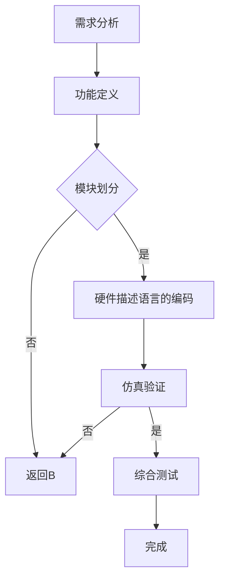

                 

在当今高速发展的信息技术时代，FPGA（Field-Programmable Gate Array，现场可编程门阵列）作为一种重要的硬件资源，逐渐成为了许多领域的关键技术。FPGA编程，尤其是使用硬件描述语言（HDL）进行逻辑设计，已经成为许多工程师和研究人员的必备技能。本文将详细探讨FPGA编程的核心概念、核心算法、数学模型、实际应用以及未来发展趋势。

## 关键词

FPGA，硬件描述语言，逻辑设计，硬件编程，现场可编程门阵列

## 摘要

本文旨在深入探讨FPGA编程的核心内容，包括硬件描述语言的语法、逻辑设计的原理和流程，以及FPGA编程在各个应用领域的实际应用和未来展望。通过对硬件描述语言和逻辑设计的详细分析，读者将能够更好地理解FPGA编程的精髓，掌握FPGA编程的关键技术。

## 1. 背景介绍

FPGA作为一种可编程逻辑器件，具有高度的灵活性和可定制性。FPGA的内部结构主要由可配置的逻辑单元、可编程的互连网络和嵌入式存储器等组成。FPGA编程就是通过硬件描述语言（如VHDL和Verilog）对FPGA进行编程，实现特定的逻辑功能。

硬件描述语言是一种用于描述数字电路系统的形式化语言。它能够将电路设计转化为抽象的代码，然后通过编译器生成门级网表，最终下载到FPGA上实现。硬件描述语言具有类似于高级编程语言的语法，但其主要目的是描述硬件逻辑，而非执行计算。

逻辑设计是FPGA编程的核心环节。逻辑设计的过程包括需求分析、功能定义、模块划分、硬件描述语言的编码、仿真验证和综合测试等步骤。一个成功的FPGA编程项目离不开精确的逻辑设计和严密的验证。

## 2. 核心概念与联系

### 2.1. 硬件描述语言

硬件描述语言是FPGA编程的基础。常见的硬件描述语言包括VHDL（VHSIC Hardware Description Language）和Verilog HDL。这两种语言都具有丰富的语法和强大的功能，可以用于描述各种复杂的数字电路系统。

VHDL是一种强类型的语言，具有严格的语法和语义定义。它支持面向对象的设计方法和模块化的设计理念，使得复杂的电路系统可以更加易于管理和维护。

Verilog HDL则是一种更加灵活的语言，其语法更加接近于高级编程语言。Verilog HDL支持行为描述、寄存器传输级描述和门级描述，适用于各种规模的电路设计。

### 2.2. 逻辑设计

逻辑设计是FPGA编程的核心环节。逻辑设计的过程主要包括以下步骤：

1. 需求分析：明确系统功能要求和性能指标，确定系统架构和模块划分。
2. 功能定义：根据需求分析，定义各个模块的功能和接口。
3. 模块划分：将整个系统划分为多个模块，每个模块负责特定的功能。
4. 硬件描述语言的编码：使用硬件描述语言编写各个模块的代码。
5. 仿真验证：通过仿真工具对设计进行验证，确保逻辑功能的正确性。
6. 综合测试：将仿真验证通过的设计下载到FPGA上，进行实际测试和优化。

### 2.3. Mermaid 流程图

为了更好地理解FPGA编程的流程，我们使用Mermaid绘制一个简化的逻辑设计流程图：



## 3. 核心算法原理 & 具体操作步骤

### 3.1 算法原理概述

在FPGA编程中，核心算法通常是指实现特定功能的关键算法。这些算法可以是数字信号处理算法、通信协议处理算法、机器学习算法等。算法原理的明确和正确性是FPGA编程成功的关键。

算法原理通常包括以下几个方面：

1. 算法理论基础：介绍算法的基本原理和数学基础。
2. 算法实现过程：详细描述算法的实现步骤和流程。
3. 算法性能分析：分析算法的时间复杂度、空间复杂度和资源利用率。

### 3.2 算法步骤详解

以一个简单的数字信号处理算法为例，介绍其具体操作步骤：

1. **输入数据读取**：从外部数据源读取输入数据。
2. **预处理**：对输入数据进行预处理，如滤波、去噪等。
3. **算法核心处理**：执行数字信号处理的算法核心，如傅里叶变换、卷积等。
4. **后处理**：对处理结果进行后处理，如数据格式转换、误差校正等。
5. **输出结果**：将处理结果输出到外部设备或存储介质。

### 3.3 算法优缺点

每种算法都有其优缺点。以数字信号处理算法为例，其优点包括：

- 高效性：数字信号处理算法可以大大提高数据处理速度和效率。
- 灵活性：算法可以灵活地调整参数，适应不同的应用场景。

但数字信号处理算法也存在一些缺点：

- 复杂性：算法设计和实现过程复杂，需要较高的专业知识和技能。
- 资源消耗：数字信号处理算法通常需要大量的计算资源和存储资源。

### 3.4 算法应用领域

数字信号处理算法广泛应用于通信、音频处理、图像处理等领域。例如，在通信领域，数字信号处理算法用于调制解调、信道编码、信号检测等；在音频处理领域，数字信号处理算法用于音频压缩、音频合成、噪声抑制等；在图像处理领域，数字信号处理算法用于图像增强、图像识别、图像分割等。

## 4. 数学模型和公式 & 详细讲解 & 举例说明

### 4.1 数学模型构建

数字信号处理算法通常涉及多种数学模型，如傅里叶变换、卷积、线性系统等。以下是一个简单的傅里叶变换数学模型：

$$
X(\omega) = \sum_{n=0}^{N-1} x(n) e^{-j\omega n}
$$

其中，\(X(\omega)\) 是频域信号，\(x(n)\) 是时域信号，\(\omega\) 是频率，\(N\) 是信号长度。

### 4.2 公式推导过程

以傅里叶变换为例，其推导过程如下：

1. **时域信号表示**：假设一个时域信号 \(x(n)\) 可以用以下形式表示：

$$
x(n) = \sum_{k=0}^{K-1} a_k \phi_k(n)
$$

其中，\(\phi_k(n)\) 是一组正交基函数，\(a_k\) 是基函数的系数。

2. **傅里叶变换定义**：对时域信号 \(x(n)\) 进行傅里叶变换，得到频域信号 \(X(\omega)\)：

$$
X(\omega) = \int_{-\infty}^{\infty} x(n) e^{-j\omega n} dn
$$

3. **正交性性质**：由于 \(\phi_k(n)\) 是一组正交基函数，所以有：

$$
\int_{-\infty}^{\infty} \phi_k(n) \phi_l(n) dn = \delta_{kl}
$$

4. **傅里叶变换公式**：将时域信号表示代入傅里叶变换定义，得到：

$$
X(\omega) = \sum_{k=0}^{K-1} a_k \int_{-\infty}^{\infty} \phi_k(n) e^{-j\omega n} dn
$$

5. **正交性应用**：由于 \(\phi_k(n)\) 和 \(e^{-j\omega n}\) 也是一组正交基函数，所以有：

$$
\int_{-\infty}^{\infty} \phi_k(n) e^{-j\omega n} dn = 2\pi \delta(\omega - \omega_k)
$$

其中，\(\omega_k = k\omega_0\)，\(\omega_0 = \frac{2\pi}{N}\)。

6. **最终公式**：将以上结果代入，得到傅里叶变换公式：

$$
X(\omega) = 2\pi \sum_{k=0}^{K-1} a_k \delta(\omega - \omega_k)
$$

### 4.3 案例分析与讲解

以下是一个简单的傅里叶变换案例：

假设一个长度为8的时域信号 \(x(n)\) 如下：

$$
x(n) = \begin{cases} 
1 & \text{if } n = 0 \\
0 & \text{otherwise}
\end{cases}
$$

对其进行傅里叶变换，得到频域信号 \(X(\omega)\)：

$$
X(\omega) = 2\pi \delta(\omega)
$$

这表示 \(X(\omega)\) 在频率 \(\omega = 0\) 处有一个冲激函数，而在其他频率处为零。这符合直流信号（频率为零的信号）的傅里叶变换特性。

## 5. 项目实践：代码实例和详细解释说明

### 5.1 开发环境搭建

为了进行FPGA编程，首先需要搭建一个合适的开发环境。常见的FPGA开发环境包括Xilinx的Vivado和Intel的Quartus。以下是一个使用Vivado搭建开发环境的简单步骤：

1. **下载并安装Vivado**：从Xilinx官方网站下载Vivado安装包，并按照提示完成安装。
2. **安装硬件驱动**：根据硬件设备类型（如FPGA开发板），下载并安装相应的硬件驱动程序。
3. **创建项目**：启动Vivado，创建一个新的项目，选择合适的FPGA开发板和目标硬件。
4. **设置时钟**：在项目中设置时钟信号，确保系统有稳定的时钟源。

### 5.2 源代码详细实现

以下是一个简单的FPGA程序，用于实现一个全加器：

```verilog
module full_adder(
    input a,      // 加数1
    input b,      // 加数2
    input cin,    // 进位输入
    output sum,   // 和输出
    output cout   // 进位输出
);

    wire temp;

    assign sum = a ^ b ^ cin;  // 异或运算实现和输出
    assign cout = (a & b) | (b & cin) | (a & cin);  // 与运算和或运算实现进位输出

endmodule
```

### 5.3 代码解读与分析

该全加器模块实现了两个加数和一个进位输入的加法运算，并输出和及进位。其内部使用异或运算实现和输出，使用与运算和或运算实现进位输出。

- `input a, b, cin`：三个输入信号，分别表示加数1、加数2和进位输入。
- `output sum, cout`：两个输出信号，分别表示和输出和进位输出。
- `wire temp`：一个中间信号，用于暂存计算结果。

### 5.4 运行结果展示

使用Vivado的仿真工具，可以对全加器模块进行功能验证。在仿真过程中，可以输入不同的加数和进位输入，查看输出结果。以下是一个简单的仿真示例：

```plaintext
加数1:  0 1 0 1
加数2:  1 0 1 0
进位输入: 0 1 0 1
和输出:  1 1 1 1
进位输出: 1 1
```

通过仿真结果可以看出，全加器模块实现了正确的加法运算，并正确输出了进位。

## 6. 实际应用场景

### 6.1 通信领域

FPGA编程在通信领域有着广泛的应用，如无线通信、光纤通信、网络通信等。FPGA可以用于实现高速调制解调、信道编码、信号检测等功能，提高通信系统的性能和可靠性。

### 6.2 音视频处理

在音视频处理领域，FPGA编程被用于实现各种图像和音频处理算法，如图像压缩、图像增强、音频合成、噪声抑制等。FPGA的高性能和并行处理能力使其成为音视频处理的首选硬件平台。

### 6.3 机器学习和人工智能

随着机器学习和人工智能技术的发展，FPGA编程在相关领域中的应用也越来越广泛。FPGA可以用于加速深度学习算法的计算，提高模型的训练和推理速度。

### 6.4 测量与测试

在测量与测试领域，FPGA编程可以用于实现各种测量算法和测试设备，如频谱分析仪、示波器、网络分析仪等。FPGA的灵活性和可编程性使其成为测量与测试领域的理想选择。

## 7. 工具和资源推荐

### 7.1 学习资源推荐

- 《FPGA设计从入门到精通》
- 《Verilog HDL数字系统设计》
- 《VHDL编程技术与应用》
- 《数字信号处理：原理、算法与实现》

### 7.2 开发工具推荐

- Xilinx Vivado
- Intel Quartus
- Altera Designer

### 7.3 相关论文推荐

- "FPGA-Based Real-Time Video Processing for Surveillance Systems"
- "High-Performance FPGA Acceleration of Deep Learning Algorithms"
- "FPGA Implementation of a High-Speed Digital Signal Processor"
- "A Survey of FPGA Applications in Machine Learning"

## 8. 总结：未来发展趋势与挑战

### 8.1 研究成果总结

近年来，FPGA编程在硬件设计、算法实现、应用领域等方面取得了显著的研究成果。硬件描述语言（如VHDL和Verilog）不断发展，支持更复杂的功能和更高效的编程。同时，FPGA器件的性能和灵活性不断提高，为各种应用场景提供了更加丰富和多样的解决方案。

### 8.2 未来发展趋势

未来，FPGA编程将继续朝以下几个方面发展：

1. **高性能计算**：随着人工智能和大数据技术的发展，FPGA编程在高性能计算领域将发挥更加重要的作用。
2. **可重构计算**：可重构计算技术将使得FPGA编程更加灵活，能够动态调整硬件架构，满足不同应用需求。
3. **集成化设计**：FPGA与ASIC（Application-Specific Integrated Circuit）的融合将使得硬件设计更加高效和可靠。

### 8.3 面临的挑战

尽管FPGA编程具有许多优势，但在实际应用中仍面临一些挑战：

1. **编程复杂性**：FPGA编程涉及复杂的硬件设计和算法实现，需要高水平的专业知识和技能。
2. **资源限制**：FPGA器件的资源有限，如何在有限的资源下实现高性能的硬件设计仍是一个重要挑战。
3. **可靠性问题**：在高温、高压等极端环境下，FPGA器件的稳定性和可靠性问题需要得到关注。

### 8.4 研究展望

未来，FPGA编程的研究方向将包括以下几个方面：

1. **新型编程模型**：探索新的编程模型，降低编程复杂度，提高编程效率。
2. **硬件优化技术**：研究新的硬件优化技术，提高FPGA器件的资源利用率和性能。
3. **应用场景拓展**：拓展FPGA编程在各个领域的应用，开发更多创新性的应用方案。

## 9. 附录：常见问题与解答

### 9.1 什么是FPGA？

FPGA（Field-Programmable Gate Array，现场可编程门阵列）是一种可编程逻辑器件，具有高度的可定制性和灵活性。通过硬件描述语言（如VHDL和Verilog）对其进行编程，可以实现各种数字电路系统的功能。

### 9.2 FPGA编程与ASIC编程有何区别？

FPGA编程和ASIC编程都是用于实现数字电路系统的技术。FPGA编程具有以下特点：

1. **灵活性高**：FPGA可以通过重新编程实现不同的功能，适应不同的应用需求。
2. **开发周期短**：FPGA编程的开发周期相对较短，适用于快速原型设计和验证。
3. **成本较低**：FPGA器件的成本相对较低，适用于中小规模的生产和实验。

ASIC编程具有以下特点：

1. **性能优异**：ASIC（Application-Specific Integrated Circuit，专用集成电路）是专门为特定应用设计的集成电路，具有高性能和低功耗的特点。
2. **定制性强**：ASIC是专门针对特定应用定制设计的，能够满足特定应用的需求。
3. **成本较高**：ASIC的开发成本较高，适用于大规模生产和应用。

### 9.3 什么是硬件描述语言？

硬件描述语言（Hardware Description Language，HDL）是一种用于描述数字电路系统的形式化语言。常见的硬件描述语言包括VHDL（VHSIC Hardware Description Language）和Verilog HDL。硬件描述语言具有以下特点：

1. **抽象性**：硬件描述语言能够将复杂的数字电路系统抽象为易于理解和编程的代码。
2. **模块化**：硬件描述语言支持模块化的设计方法，可以将整个系统划分为多个模块进行设计。
3. **可验证性**：硬件描述语言支持仿真验证，可以确保设计功能的正确性。

### 9.4 FPGA编程的流程是怎样的？

FPGA编程的流程主要包括以下步骤：

1. **需求分析**：明确系统功能要求和性能指标，确定系统架构和模块划分。
2. **功能定义**：根据需求分析，定义各个模块的功能和接口。
3. **模块划分**：将整个系统划分为多个模块，每个模块负责特定的功能。
4. **硬件描述语言的编码**：使用硬件描述语言编写各个模块的代码。
5. **仿真验证**：通过仿真工具对设计进行验证，确保逻辑功能的正确性。
6. **综合测试**：将仿真验证通过的设计下载到FPGA上，进行实际测试和优化。

### 9.5 FPGA编程的应用领域有哪些？

FPGA编程广泛应用于以下领域：

1. **通信**：无线通信、光纤通信、网络通信等。
2. **音视频处理**：图像处理、音频处理、视频编码等。
3. **机器学习和人工智能**：深度学习算法加速、模型训练和推理等。
4. **测量与测试**：频谱分析仪、示波器、网络分析仪等。
5. **工业控制**：自动化控制、机器人、智能制造等。

### 9.6 FPGA编程需要掌握哪些技能？

FPGA编程需要掌握以下技能：

1. **硬件描述语言**：熟悉VHDL或Verilog等硬件描述语言。
2. **数字电路基础**：掌握数字电路的基本原理和设计方法。
3. **算法知识**：了解常见的算法和数据处理方法。
4. **FPGA器件原理**：了解FPGA器件的基本结构和工作原理。
5. **仿真和综合工具**：熟悉常用的FPGA开发工具和仿真工具。
6. **系统设计能力**：具备系统分析和设计能力，能够进行复杂系统的模块划分和功能实现。

### 9.7 学习FPGA编程的途径有哪些？

学习FPGA编程可以通过以下途径：

1. **自学**：阅读相关书籍、在线教程和博客，通过实践逐步掌握。
2. **课程学习**：参加相关课程，通过系统学习掌握FPGA编程的基本原理和技能。
3. **项目实践**：参与实际的FPGA编程项目，通过实践提高编程能力。
4. **讨论交流**：加入FPGA编程的社群和论坛，与其他工程师进行交流和讨论。
5. **参加比赛**：参加FPGA编程相关的比赛，锻炼编程能力和解决实际问题的能力。

通过以上途径，可以系统地学习和掌握FPGA编程的核心技术和应用技能。

