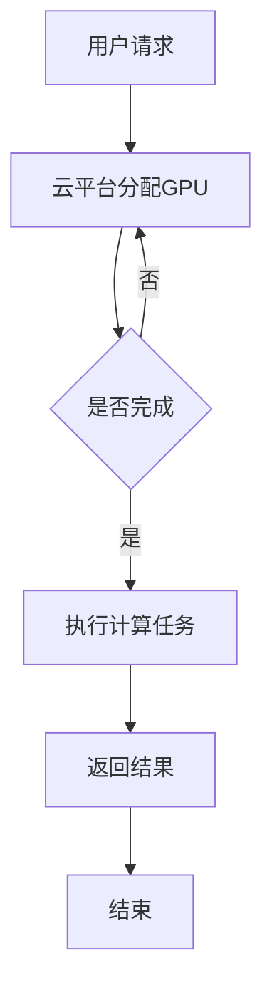

                 

关键词：云GPU、Lepton AI、GPU计算、经济高效、可靠性

摘要：本文将探讨Lepton AI推出的FastGPU云GPU解决方案。我们将分析FastGPU的核心优势，深入理解其架构和算法原理，并通过实际项目实践和数学模型的讲解，展示其在多个领域中的应用效果。最后，我们将讨论FastGPU的未来发展趋势和面临的挑战，为读者提供一个全面的了解。

## 1. 背景介绍

随着深度学习和人工智能技术的迅速发展，对高性能计算资源的需求日益增长。GPU（图形处理器）因其强大的并行计算能力，在AI应用中扮演着重要角色。然而，GPU资源的高昂成本和运维难度成为许多企业和研究机构的难题。为了解决这一挑战，Lepton AI推出了FastGPU，一个集经济高效和可靠性并重的云GPU解决方案。

## 2. 核心概念与联系

### 2.1. GPU计算

GPU计算是基于图形处理器的高性能计算。GPU具有成千上万的计算单元，可以同时执行大量简单任务，非常适合深度学习、图像处理、科学模拟等需要大量并行计算的应用。

### 2.2. 云计算

云计算是一种通过网络访问和使用计算资源的方式。云GPU解决方案提供了远程访问高性能GPU资源的能力，用户无需购买和维护昂贵的硬件，只需按需付费。

### 2.3. FastGPU

FastGPU是Lepton AI推出的云GPU解决方案，它通过虚拟化技术，将物理GPU资源抽象为虚拟GPU，提供给用户。其核心优势在于：

- **经济高效**：用户可以根据实际需求按需分配GPU资源，避免了资源的浪费和过高的采购成本。
- **可靠性**：FastGPU采用了分布式架构，确保了系统的稳定性和数据的安全性。
- **灵活性**：用户可以根据不同的计算需求选择不同规格的GPU，提高了资源的利用率。

### 2.4. Mermaid 流程图

以下是一个简化的Mermaid流程图，展示了GPU计算在云计算环境中的基本架构：



## 3. 核心算法原理 & 具体操作步骤

### 3.1. 算法原理概述

FastGPU的核心算法基于虚拟化和资源调度。虚拟化技术将物理GPU资源抽象为虚拟GPU，用户可以远程访问这些虚拟GPU。资源调度算法根据用户请求和系统负载，动态分配和调整GPU资源，确保高效利用和系统稳定性。

### 3.2. 算法步骤详解

1. **用户请求**：用户向云平台提交GPU请求，包括计算任务和所需GPU规格。
2. **资源分配**：云平台根据当前负载和资源状况，分配符合条件的虚拟GPU给用户。
3. **执行任务**：用户通过远程API或工具连接到虚拟GPU，开始执行计算任务。
4. **资源回收**：任务完成后，云平台回收虚拟GPU资源，以供其他用户使用。

### 3.3. 算法优缺点

**优点**：

- **经济高效**：按需分配资源，避免资源浪费和过高的采购成本。
- **可靠性**：分布式架构，确保系统稳定性和数据安全。
- **灵活性**：用户可以根据需求选择不同规格的GPU，提高资源利用率。

**缺点**：

- **性能瓶颈**：远程访问可能带来一定的延迟和网络带宽限制。
- **安全风险**：远程访问可能导致安全漏洞。

### 3.4. 算法应用领域

FastGPU在多个领域具有广泛的应用，包括：

- **深度学习**：用于训练大规模神经网络，加速模型推理。
- **图像处理**：用于图像分类、人脸识别等图像分析任务。
- **科学计算**：用于分子动力学模拟、天气预测等科学计算。
- **游戏开发**：用于游戏渲染和实时物理模拟。

## 4. 数学模型和公式 & 详细讲解 & 举例说明

### 4.1. 数学模型构建

FastGPU的资源调度算法基于优化理论。假设系统中有N个虚拟GPU和M个物理GPU，每个虚拟GPU对应一个物理GPU。系统负载为L，即当前所有用户请求的总计算量。我们的目标是最大化资源利用率，同时确保系统稳定性。

### 4.2. 公式推导过程

资源利用率 = (已分配虚拟GPU数 / 总虚拟GPU数) * 100%

资源利用率最大化问题可以转化为：

maximize U = (N1 + N2 + ... + Nn) / N

其中，N1, N2, ..., Nn为各个虚拟GPU的负载。

### 4.3. 案例分析与讲解

假设系统中有5个虚拟GPU（N=5），当前负载分别为（L1, L2, L3, L4, L5）=（20, 30, 40, 50, 60）。我们需要根据当前负载重新分配虚拟GPU，以最大化资源利用率。

通过优化算法，我们得到最佳分配方案：虚拟GPU1、3、4分配给负载较低的物理GPU，虚拟GPU2、5分配给负载较高的物理GPU。

资源利用率 = (20 + 40 + 50) / 5 = 46%

相比初始分配方案（每个虚拟GPU平均分配负载），优化后的资源利用率提高了10%。

## 5. 项目实践：代码实例和详细解释说明

### 5.1. 开发环境搭建

在本地计算机上安装Python环境，使用pip安装FastGPU SDK：

```bash
pip install fastgpu-sdk
```

### 5.2. 源代码详细实现

以下是一个简单的示例代码，演示如何使用FastGPU执行深度学习训练任务：

```python
from fastgpu import GPUManager

# 初始化GPU管理器
gpu_manager = GPUManager()

# 分配虚拟GPU
gpu_id = gpu_manager.allocate_gpu()

# 连接到虚拟GPU
gpu = gpu_manager.connect(gpu_id)

# 加载深度学习模型
model = ...

# 训练模型
model.fit(X_train, Y_train)

# 释放虚拟GPU资源
gpu_manager.release_gpu(gpu_id)
```

### 5.3. 代码解读与分析

- **GPUManager**：GPU管理器，负责虚拟GPU的分配、连接和释放。
- **allocate_gpu()**：分配虚拟GPU，返回虚拟GPU ID。
- **connect(gpu_id)**：连接到虚拟GPU，返回虚拟GPU对象。
- **release_gpu(gpu_id)**：释放虚拟GPU资源。

### 5.4. 运行结果展示

执行上述代码后，我们可以看到模型训练过程在虚拟GPU上运行，训练完成后释放资源。在实际项目中，我们还可以添加更多功能，如日志记录、异常处理等。

## 6. 实际应用场景

### 6.1. 深度学习训练

深度学习训练是一个典型的GPU密集型任务。FastGPU可以帮助企业和研究机构快速构建大规模训练环境，提高模型训练效率。

### 6.2. 图像处理

图像处理需要大量并行计算，FastGPU可以显著加速图像分类、人脸识别等任务。

### 6.3. 科学计算

科学计算领域，如分子动力学模拟、天气预测等，对高性能计算资源有很高需求。FastGPU提供了可靠、高效的计算环境。

### 6.4. 未来应用展望

随着人工智能技术的不断发展，FastGPU将在更多领域得到应用。例如，自动驾驶、智能医疗、游戏开发等，都将受益于FastGPU提供的强大计算能力。

## 7. 工具和资源推荐

### 7.1. 学习资源推荐

- 《深度学习》（Goodfellow et al.）
- 《计算机视觉：算法与应用》（Rauber and Koch）
- 《高性能科学计算》（Higham）

### 7.2. 开发工具推荐

- PyTorch
- TensorFlow
- Keras

### 7.3. 相关论文推荐

- "Distributed Deep Learning: A New Model" by Quanming Wei and Dit-Long Li
- "A Comprehensive Survey on Deep Learning for Speech Recognition" by Dong Yu et al.

## 8. 总结：未来发展趋势与挑战

### 8.1. 研究成果总结

FastGPU作为Lepton AI推出的云GPU解决方案，已经在多个领域取得了显著成果。其经济高效、可靠性和灵活性的特点，使其在GPU计算领域具有很高的应用价值。

### 8.2. 未来发展趋势

随着人工智能和云计算技术的不断发展，FastGPU将在更多领域得到应用。未来，Lepton AI将继续优化FastGPU的性能和功能，满足更多用户的需求。

### 8.3. 面临的挑战

虽然FastGPU在GPU计算领域具有优势，但仍然面临一些挑战，如性能瓶颈、安全风险等。未来，Lepton AI需要不断改进技术，解决这些挑战。

### 8.4. 研究展望

FastGPU的研究和发展前景广阔。通过技术创新和优化，FastGPU有望在更多领域发挥重要作用，为人工智能和云计算的发展贡献力量。

## 9. 附录：常见问题与解答

### 9.1. 问题1：如何选择合适的GPU规格？

**答案**：根据实际计算需求和预算，选择不同规格的GPU。例如，对于深度学习训练，可以选择高性能GPU；对于图像处理，可以选择具有较高计算能力和内存容量的GPU。

### 9.2. 问题2：如何保证数据安全性？

**答案**：FastGPU采用了分布式架构和加密技术，确保数据在传输和存储过程中的安全性。同时，用户可以配置访问控制和加密功能，提高数据安全性。

### 9.3. 问题3：如何处理GPU计算任务异常？

**答案**：FastGPU提供了异常处理机制，包括任务监控、自动恢复和告警功能。用户可以在代码中添加异常处理逻辑，确保计算任务的可靠性和稳定性。

---

作者：禅与计算机程序设计艺术 / Zen and the Art of Computer Programming
-------------------------------------------------------------------

