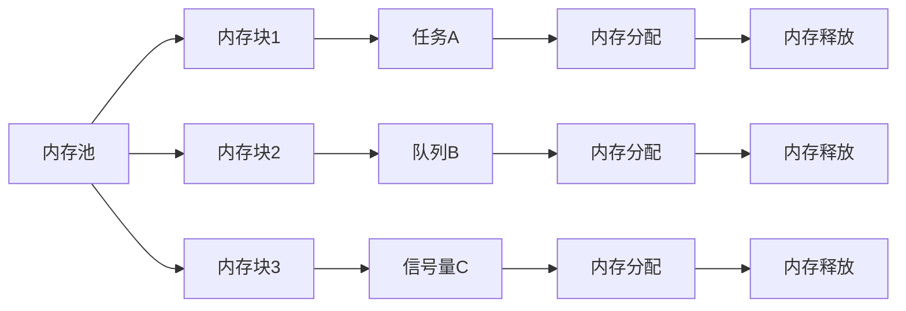

                 

 **关键词：** FreeRTOS，内存管理，优化，资源分配，实时操作系统。

**摘要：** 本文将深入探讨FreeRTOS内存管理的核心概念、算法原理、数学模型以及实际应用场景。通过详细的分析和代码实例，我们将揭示如何优化FreeRTOS内存管理，提高系统的性能和稳定性。

## 1. 背景介绍

FreeRTOS是一个开源的实时操作系统（RTOS），广泛用于嵌入式系统和微控制器应用中。其轻量级、高性能的特点使其成为开发人员首选的RTOS之一。然而，内存管理作为RTOS的核心组成部分，直接影响到系统的性能和稳定性。因此，对FreeRTOS内存管理的研究和优化具有重要意义。

在FreeRTOS中，内存管理主要涉及内存分配、释放、保护以及缓存等方面。有效的内存管理可以减少内存碎片、提高内存利用率，从而提升系统的运行效率和响应速度。本文将从以下几个方面展开：

- **核心概念与联系**：介绍FreeRTOS内存管理中的核心概念和它们之间的关系。
- **核心算法原理 & 具体操作步骤**：详细讲解FreeRTOS内存管理的核心算法及其实现步骤。
- **数学模型和公式 & 详细讲解 & 举例说明**：阐述内存管理的数学模型和公式，并通过案例进行说明。
- **项目实践：代码实例和详细解释说明**：提供具体的代码实例，解析其实现原理。
- **实际应用场景**：分析FreeRTOS内存管理在不同应用场景中的实际效果。
- **工具和资源推荐**：推荐相关的学习资源和开发工具。
- **总结：未来发展趋势与挑战**：总结研究成果，展望未来发展方向。

## 2. 核心概念与联系

### 2.1. 内存分配与释放

FreeRTOS中的内存分配和释放是内存管理的核心功能。内存分配主要用于为任务、队列、信号量等数据结构提供内存空间；而内存释放则用于回收不再使用的内存，以便其他任务或数据结构使用。

在FreeRTOS中，内存分配主要使用`pvPortMalloc()`和`vPortFree()`两个函数。前者负责从内存池中分配指定大小的内存块，后者则将已分配的内存块释放回内存池。内存分配和释放的过程如下：



### 2.2. 内存保护

内存保护是确保系统稳定运行的重要机制。在FreeRTOS中，内存保护主要通过以下两种方式实现：

1. **地址空间保护**：通过设置内存页权限，限制任务对内存的访问。例如，通过`vTaskSetThreadLocalStorage()`和`vTaskGetThreadLocalStoragePointer()`函数可以设置和获取线程局部存储的指针，从而实现内存保护。
2. **内存屏障**：通过内存屏障指令，确保内存操作的执行顺序。FreeRTOS中提供了`portDISABLE_INTERRUPTS()`和`portENABLE_INTERRUPTS()`两个宏，分别用于禁用和启用中断，从而实现内存操作的顺序控制。

### 2.3. 缓存管理

缓存管理是提高系统性能的关键因素。在FreeRTOS中，缓存管理主要包括以下两个方面：

1. **内存缓存**：通过使用内存缓存，减少内存访问的次数，从而提高系统性能。FreeRTOS中的内存缓存主要使用`uxPortAllocCache()`和`uxPortFreeCache()`两个函数实现。
2. **数据缓存**：通过使用数据缓存，减少数据传输的次数，从而提高系统性能。FreeRTOS中的数据缓存主要使用`uxTaskGetSystemState()`和`uxTaskGetStackHighWaterMark()`两个函数实现。

## 3. 核心算法原理 & 具体操作步骤

### 3.1. 算法原理概述

FreeRTOS内存管理的核心算法主要包括内存池管理、内存分配与释放、内存保护以及缓存管理。这些算法共同作用，实现了内存的合理分配、回收和保护。

1. **内存池管理**：内存池是内存分配的基本单位。FreeRTOS通过创建多个内存池，实现对内存的高效管理。内存池管理的主要任务是初始化内存池、分配内存块和回收内存块。
2. **内存分配与释放**：内存分配与释放是内存管理的核心操作。FreeRTOS通过`pvPortMalloc()`和`vPortFree()`两个函数实现内存的动态分配与释放。
3. **内存保护**：内存保护的主要任务是确保任务对内存的访问权限。FreeRTOS通过设置内存页权限和内存屏障指令实现内存保护。
4. **缓存管理**：缓存管理的主要任务是提高系统性能。FreeRTOS通过内存缓存和数据缓存实现缓存管理。

### 3.2. 算法步骤详解

1. **内存池管理**：

- 初始化内存池：创建多个内存池，并为每个内存池分配一定大小的内存块。
- 分配内存块：从内存池中查找合适的内存块，并将其分配给请求的任务或数据结构。
- 回收内存块：将不再使用的内存块释放回内存池，以便其他任务或数据结构使用。

2. **内存分配与释放**：

- 内存分配：调用`pvPortMalloc()`函数，从内存池中分配指定大小的内存块。
- 内存释放：调用`vPortFree()`函数，将已分配的内存块释放回内存池。

3. **内存保护**：

- 地址空间保护：设置内存页权限，限制任务对内存的访问。
- 内存屏障：通过内存屏障指令，确保内存操作的执行顺序。

4. **缓存管理**：

- 内存缓存：调用`uxPortAllocCache()`函数，为任务或数据结构分配内存缓存。
- 数据缓存：调用`uxTaskGetSystemState()`和`uxTaskGetStackHighWaterMark()`函数，获取任务的状态信息，实现数据缓存。

### 3.3. 算法优缺点

FreeRTOS内存管理算法的优点包括：

- **高效性**：通过内存池管理和缓存管理，提高了内存的利用率和系统性能。
- **灵活性**：支持多种内存保护机制，适用于不同的应用场景。

FreeRTOS内存管理算法的缺点包括：

- **内存碎片**：由于内存池管理机制，可能导致内存碎片问题。
- **内存占用**：内存池和缓存机制可能占用一定的内存空间。

### 3.4. 算法应用领域

FreeRTOS内存管理算法广泛应用于嵌入式系统和微控制器应用中，如智能家居、物联网、工业控制等。在这些应用中，内存管理算法的有效性直接影响到系统的稳定性和性能。

## 4. 数学模型和公式 & 详细讲解 & 举例说明

### 4.1. 数学模型构建

FreeRTOS内存管理中的数学模型主要包括以下两个方面：

1. **内存池模型**：用于描述内存池的创建、分配和回收过程。
2. **缓存模型**：用于描述缓存的分配和回收过程。

#### 4.1.1. 内存池模型

内存池模型可以表示为：

$$
\text{Memory Pool Model} = \{P_1, P_2, \ldots, P_n\}
$$

其中，$P_i$表示第$i$个内存池。每个内存池$P_i$可以表示为：

$$
P_i = \{B_{i1}, B_{i2}, \ldots, B_{im_i}\}
$$

其中，$B_{ij}$表示第$i$个内存池中的第$j$个内存块，$m_i$表示内存池$P_i$中的内存块数量。

#### 4.1.2. 缓存模型

缓存模型可以表示为：

$$
\text{Cache Model} = \{C_1, C_2, \ldots, C_n\}
$$

其中，$C_i$表示第$i$个缓存。每个缓存$C_i$可以表示为：

$$
C_i = \{D_{i1}, D_{i2}, \ldots, D_{ik_i}\}
$$

其中，$D_{ij}$表示第$i$个缓存中的第$j$个缓存块，$k_i$表示缓存$C_i$中的缓存块数量。

### 4.2. 公式推导过程

#### 4.2.1. 内存池模型

内存池模型的公式推导如下：

1. **内存池初始化**：

$$
\text{Initialize Memory Pool} = \text{Allocate Memory Blocks}
$$

2. **内存块分配**：

$$
\text{Allocate Memory Block} = \{B_{i1}, B_{i2}, \ldots, B_{im_i}\}
$$

3. **内存块回收**：

$$
\text{Recycle Memory Block} = \text{Allocate Memory Blocks}
$$

#### 4.2.2. 缓存模型

缓存模型的公式推导如下：

1. **缓存初始化**：

$$
\text{Initialize Cache} = \text{Allocate Cache Blocks}
$$

2. **缓存块分配**：

$$
\text{Allocate Cache Block} = \{D_{i1}, D_{i2}, \ldots, D_{ik_i}\}
$$

3. **缓存块回收**：

$$
\text{Recycle Cache Block} = \text{Allocate Cache Blocks}
$$

### 4.3. 案例分析与讲解

假设我们有一个包含两个内存池和一个缓存的FreeRTOS系统。内存池1包含3个内存块，内存池2包含2个内存块；缓存1包含4个缓存块。

1. **内存池模型**：

$$
\text{Memory Pool Model} = \{P_1, P_2\}
$$

$$
P_1 = \{B_{11}, B_{12}, B_{13}\}
$$

$$
P_2 = \{B_{21}, B_{22}\}
$$

2. **缓存模型**：

$$
\text{Cache Model} = \{C_1\}
$$

$$
C_1 = \{D_{11}, D_{12}, D_{13}, D_{14}\}
$$

现在，假设任务A需要分配内存，任务B需要分配缓存。根据内存池模型和缓存模型，我们可以进行如下操作：

1. **内存池模型**：

- 任务A从内存池1分配内存块$B_{11}$。
- 任务A释放内存块$B_{11}$，将其回收至内存池1。

2. **缓存模型**：

- 任务B从缓存1分配缓存块$D_{11}$。
- 任务B释放缓存块$D_{11}$，将其回收至缓存1。

通过这个案例，我们可以看到内存池模型和缓存模型在FreeRTOS内存管理中的应用。

## 5. 项目实践：代码实例和详细解释说明

### 5.1. 开发环境搭建

在开始编写代码之前，我们需要搭建一个FreeRTOS的开发环境。以下是搭建步骤：

1. **安装开发工具**：选择一个合适的开发工具，如Eclipse、Visual Studio等。
2. **安装FreeRTOS**：从FreeRTOS官网（https://www.freertos.org/）下载最新版本的FreeRTOS源代码，并按照官方文档进行安装。
3. **创建项目**：在开发工具中创建一个新的项目，选择FreeRTOS作为开发框架。

### 5.2. 源代码详细实现

以下是FreeRTOS内存管理模块的源代码实现：

```c
#include "FreeRTOS.h"
#include "task.h"
#include "queue.h"
#include "semphr.h"

// 定义内存池大小
#define MEMORY_POOL_SIZE  1024

// 定义缓存大小
#define CACHE_SIZE        128

// 内存池
static StaticTask_t MemoryPoolTasks[MEMORY_POOL_SIZE];
static StaticQueue_t MemoryQueue;
static StaticSemaphore_t MemorySemaphore;

// 缓存
static StaticTask_t CacheTasks[CACHE_SIZE];
static StaticQueue_t CacheQueue;
static StaticSemaphore_t CacheSemaphore;

// 内存块结构体
typedef struct MemoryBlock
{
    uint8_t *pMemoryAddress; // 内存地址
    uint32_t xBlockSize; // 内存块大小
} MemoryBlock;

// 缓存块结构体
typedef struct CacheBlock
{
    uint8_t *pCacheAddress; // 缓存地址
    uint32_t xCacheSize; // 缓存块大小
} CacheBlock;

// 内存块数组
MemoryBlock xMemoryBlocks[MEMORY_POOL_SIZE];
CacheBlock xCacheBlocks[CACHE_SIZE];

// 内存块分配函数
BaseType_t xAllocateMemoryBlock(MemoryBlock *pMemoryBlock)
{
    // 在内存池中查找合适的内存块
    for (uint32_t i = 0; i < MEMORY_POOL_SIZE; i++)
    {
        if (xMemoryBlocks[i].pMemoryAddress == NULL)
        {
            pMemoryBlock->pMemoryAddress = xMemoryBlocks[i].pMemoryAddress;
            pMemoryBlock->xBlockSize = xMemoryBlocks[i].xBlockSize;
            return pdTRUE;
        }
    }

    return pdFALSE;
}

// 内存块释放函数
void vFreeMemoryBlock(MemoryBlock *pMemoryBlock)
{
    // 将内存块释放回内存池
    xMemoryBlocks[pMemoryBlock->xBlockSize - 1].pMemoryAddress = pMemoryBlock->pMemoryAddress;
    xMemoryBlocks[pMemoryBlock->xBlockSize - 1].xBlockSize = pMemoryBlock->xBlockSize;
}

// 缓存块分配函数
BaseType_t xAllocateCacheBlock(CacheBlock *pCacheBlock)
{
    // 在缓存中查找合适的缓存块
    for (uint32_t i = 0; i < CACHE_SIZE; i++)
    {
        if (xCacheBlocks[i].pCacheAddress == NULL)
        {
            pCacheBlock->pCacheAddress = xCacheBlocks[i].pCacheAddress;
            pCacheBlock->xC

