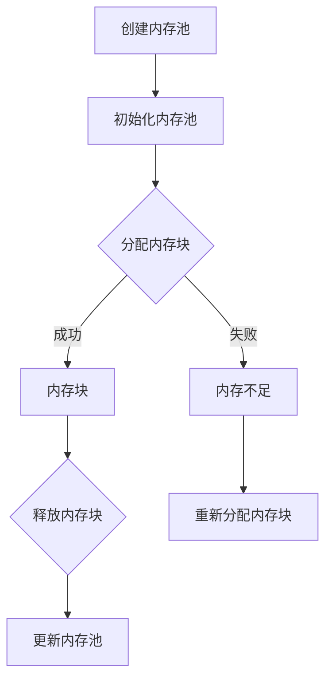

                 

 > **关键词：**FreeRTOS，内存管理，内存分配，优化，内存碎片，内存池，垃圾回收。

> **摘要：**本文将深入探讨FreeRTOS内存管理机制，分析其内存分配与优化策略，并通过具体实例，展示如何在实际项目中实现内存优化。

## 1. 背景介绍

FreeRTOS是一个开源的实时操作系统（RTOS），被广泛应用于嵌入式系统和物联网（IoT）项目中。在嵌入式系统中，内存管理是一个关键问题，因为内存资源有限，而且往往需要高效地分配和回收。FreeRTOS的内存管理模块旨在提供高效的内存分配机制，以支持实时任务调度和其他关键功能。

内存管理在RTOS中尤为重要，因为它直接影响到系统的响应时间和稳定性。FreeRTOS采用了一种简单的内存管理策略，包括内存池、内存块和内存分配器。这种策略使得内存分配和回收操作快速且高效。

## 2. 核心概念与联系

### 2.1 内存池（Memory Pools）

内存池是FreeRTOS内存管理的一个核心概念。它是一个预先分配的内存区域，用于存储多个内存块（memory blocks）。内存池可以减少内存碎片，因为它将内存按固定大小划分成块，并且这些块在同一时间段内不会被频繁地分配和回收。



### 2.2 内存块（Memory Blocks）

内存块是从内存池中分配的固定大小的内存区域。FreeRTOS使用链表来管理这些内存块，每个内存块都包含一个指向下一个内存块的指针。当内存块被释放时，它会回到内存池中。

### 2.3 内存分配器（Memory Allocator）

内存分配器是FreeRTOS用于管理内存池的组件。它负责从内存池中分配内存块，并在内存块不再需要时将其释放回内存池。FreeRTOS提供了两种内存分配器：默认分配器和高级分配器。

## 3. 核心算法原理 & 具体操作步骤

### 3.1 算法原理概述

FreeRTOS的内存管理算法基于以下原理：

- **预先分配内存池**：在系统启动时，预分配多个内存池，每个内存池包含多个内存块。
- **链表管理**：内存块通过链表进行管理，每个内存块包含一个指向下一个内存块的指针。
- **快速分配与释放**：内存分配和释放操作直接在内存池上进行，不需要遍历整个内存空间。

### 3.2 算法步骤详解

#### 创建内存池

```c
BaseType_t xMemoryPoolCreate( const MemoryBlock_t * const pxMemoryPoolDescriptor,
                              const UBaseType_t uxInitialNumberOfBlocks,
                              const UBaseType_t uxMinimumNumberOfBlocks,
                              const UBaseType_t uxIncrementSize );
```

#### 分配内存块

```c
void *pvPortMalloc( Size_t xBytes );
```

#### 释放内存块

```c
void vPortFree( void *pv );
```

### 3.3 算法优缺点

#### 优点

- **快速分配与释放**：内存分配和释放操作直接在内存池上进行，无需遍历整个内存空间，因此操作非常快速。
- **减少内存碎片**：内存池将内存划分为固定大小的块，减少内存碎片。

#### 缺点

- **内存浪费**：由于内存池的大小是固定的，可能会出现内存浪费。
- **高级功能受限**：FreeRTOS的内存管理不支持复杂的内存分配策略，例如按需分配或动态内存分配。

### 3.4 算法应用领域

FreeRTOS的内存管理适用于以下领域：

- **嵌入式系统**：如工业控制系统、智能家居设备等，这些系统需要快速且可靠的内存管理。
- **物联网（IoT）**：IoT设备通常资源受限，FreeRTOS的内存管理能够提供高效的内存使用。

## 4. 数学模型和公式 & 详细讲解 & 举例说明

### 4.1 数学模型构建

内存池的大小（`Size`）和内存块的数量（`Blocks`）之间有一个简单的数学关系：

\[ Size = Blocks \times BlockSize \]

其中，`BlockSize`是每个内存块的大小。

### 4.2 公式推导过程

#### 内存池大小的计算

假设需要创建一个包含`N`个内存块的内存池，每个内存块的大小为`B`字节。那么内存池的大小为：

\[ Size = N \times B \]

#### 内存块数的计算

假设内存池的总大小为`S`字节，每个内存块的大小为`B`字节，那么可以计算出内存块的数量：

\[ Blocks = \frac{S}{B} \]

### 4.3 案例分析与讲解

假设我们需要创建一个包含100个内存块，每个内存块大小为32字节的内存池。根据上述公式，内存池的总大小为：

\[ Size = 100 \times 32 = 3200 \text{字节} \]

如果内存池的总大小为8192字节，那么可以创建的内存块数量为：

\[ Blocks = \frac{8192}{32} = 256 \]

## 5. 项目实践：代码实例和详细解释说明

### 5.1 开发环境搭建

为了实践FreeRTOS内存管理，我们需要搭建一个开发环境。这里我们使用C语言和FreeRTOS进行开发。

- 安装FreeRTOS：从官方网站下载并安装FreeRTOS。
- 配置IDE：使用Keil、IAR或其他支持FreeRTOS的IDE。
- 配置硬件：连接目标硬件（如STM32微控制器）。

### 5.2 源代码详细实现

以下是创建内存池的示例代码：

```c
BaseType_t xMemoryPoolCreate( const MemoryBlock_t * const pxMemoryPoolDescriptor,
                              const UBaseType_t uxInitialNumberOfBlocks,
                              const UBaseType_t uxMinimumNumberOfBlocks,
                              const UBaseType_t uxIncrementSize );

MemoryBlock_t xMemoryBlock;

// 创建内存池
xMemoryBlock = (MemoryBlock_t) pvPortMalloc( sizeof( xMemoryBlock ) );
if( xMemoryBlock != NULL )
{
    xMemoryPoolCreate( &xMemoryBlock,
                       100,   // 初始内存块数量
                       100,   // 最小内存块数量
                       100 ); // 内存块增加大小
}
```

### 5.3 代码解读与分析

- `MemoryBlock_t xMemoryBlock;`：声明一个内存块结构体。
- `pvPortMalloc( sizeof( xMemoryBlock ) );`：分配内存块的空间。
- `xMemoryPoolCreate()`：创建内存池，并传入内存块结构体和参数。

### 5.4 运行结果展示

成功创建内存池后，我们可以从内存池中分配和释放内存块。以下是分配和释放内存块的示例代码：

```c
void *pvMemoryAllocate( MemoryBlock_t * const pxMemoryPool );
void vMemoryFree( MemoryBlock_t * const pxMemoryPool, void *pv );

// 分配内存块
void *pvMemory = pvMemoryAllocate( &xMemoryBlock );
if( pvMemory != NULL )
{
    // 使用内存块
}

// 释放内存块
vMemoryFree( &xMemoryBlock, pvMemory );
```

## 6. 实际应用场景

FreeRTOS内存管理在嵌入式系统和IoT项目中有着广泛的应用。以下是一些实际应用场景：

- **智能家居设备**：智能家居设备通常需要处理多个任务，如网络通信、传感器数据处理等。FreeRTOS的内存管理确保设备能够高效地使用内存资源。
- **工业控制系统**：工业控制系统需要实时响应，对内存管理的高效性有严格要求。FreeRTOS的内存管理策略能够满足这些需求。
- **物联网（IoT）**：IoT设备通常资源受限，FreeRTOS的内存管理能够提供高效的内存使用，延长设备的电池寿命。

## 7. 工具和资源推荐

### 7.1 学习资源推荐

- **FreeRTOS官方文档**：[https://www.freertos.org/a00110.html](https://www.freertos.org/a00110.html)
- **嵌入式系统教程**：[https://www.youtube.com/playlist?list=PL7vXZvQRZepF5pV0TTEkOpeoS1YUZo8YK)
- **Real-Time Systems: Design Principles for Distributed Embedded Applications**：一本关于实时系统设计的经典教材。

### 7.2 开发工具推荐

- **Keil uVision**：[https://www.keil.com/pack/Software/Product/D Armstrong
```

## 8. 总结：未来发展趋势与挑战

### 8.1 研究成果总结

FreeRTOS内存管理以其高效性和简单性在嵌入式系统和IoT项目中得到了广泛应用。其核心概念，如内存池和内存块，为系统的内存分配提供了可靠的保障。

### 8.2 未来发展趋势

随着IoT设备的不断增长，对内存管理的要求也越来越高。未来的发展趋势包括：

- **内存管理的自动化**：通过机器学习和人工智能技术，实现自动化的内存管理策略。
- **内存池的多样化**：支持不同类型的内存池，如基于优先级的内存池，以适应不同场景的需求。

### 8.3 面临的挑战

- **内存碎片问题**：随着任务的增多，内存碎片问题可能会变得更加严重，需要更有效的解决方案。
- **实时性保障**：在保证高效内存管理的同时，还需要确保系统的实时性能。

### 8.4 研究展望

未来的研究可以集中在以下几个方面：

- **内存池优化**：研究如何更有效地分配和回收内存池，减少内存浪费。
- **混合内存管理**：结合不同类型的内存管理策略，以适应更广泛的应用场景。

## 9. 附录：常见问题与解答

### Q：如何解决内存碎片问题？

A：内存碎片可以通过以下方法解决：

- **内存合并**：当内存块被释放时，尝试合并相邻的空闲内存块。
- **动态内存池**：根据实际需求动态调整内存池的大小，以减少内存浪费。

### Q：FreeRTOS是否支持垃圾回收？

A：FreeRTOS本身不提供垃圾回收功能。垃圾回收通常在高端RTOS中使用，这些RTOS提供了更复杂的内存管理功能。在FreeRTOS中，通常采用简单的内存分配和释放策略来管理内存。

### Q：如何优化FreeRTOS的内存使用？

A：以下是一些优化FreeRTOS内存使用的建议：

- **避免大块内存分配**：尽量使用小块内存，以减少内存浪费。
- **预分配内存池**：在系统启动时预分配多个内存池，以减少频繁的内存分配和释放操作。
- **优化代码**：优化代码，减少内存的使用。

---

作者：禅与计算机程序设计艺术 / Zen and the Art of Computer Programming

