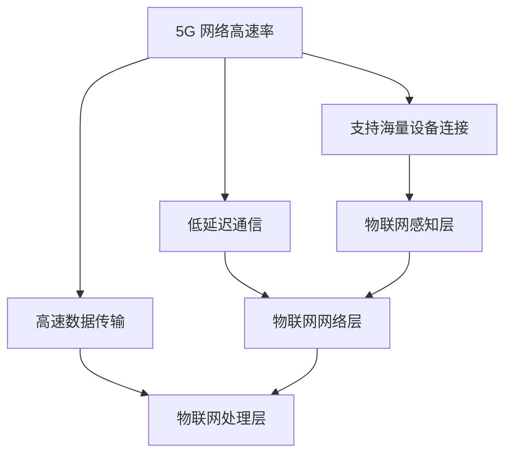

                 

关键词：5G技术、物联网、大规模连接、低延迟、网络优势、未来应用

> 摘要：本文深入探讨了5G物联网技术的优势，特别是其对大规模低延迟连接的支持。通过详细分析5G网络的核心特性，以及与物联网相结合的实际应用场景，我们揭示了5G技术在物联网领域的巨大潜力。

## 1. 背景介绍

随着信息技术的快速发展，物联网（IoT）已经逐渐成为全球科技领域的重要方向。物联网通过连接各种设备和系统，实现数据的收集、分析和应用，为工业、医疗、交通、家庭等多个领域带来了革命性的变化。然而，传统的无线通信技术如3G、4G在处理大规模设备连接和低延迟需求方面存在明显的局限性。因此，5G技术的引入成为了物联网发展的关键推动力。

5G，即第五代移动通信技术，是继3G、4G之后的最新一代无线通信技术。与 predecessors 相比，5G 在网络速度、连接密度、延迟、可靠性等方面都实现了显著的提升。5G 技术的出现为物联网提供了更加稳定、高效、低延迟的连接方案，使其在复杂应用场景中具备了更高的可靠性和实时性。

## 2. 核心概念与联系

### 2.1 5G 技术概述

5G 网络的核心特性包括：

- **高速率**：5G 网络的理论下载速度可以达到数十 Gbps，是 4G 网络的数十倍。
- **低延迟**：5G 网络的延迟可以降低到毫秒级别，比 4G 网络减少了数十倍。
- **高密度连接**：5G 网络可以支持每平方米数十万个设备的连接，大大提高了网络容量。
- **大带宽**：5G 网络的带宽比 4G 网络更大，可以同时处理更多数据。

### 2.2 物联网架构

物联网通常由以下三个主要部分组成：

- **感知层**：包括传感器、摄像头、RFID 等设备，负责收集物理世界的数据。
- **网络层**：包括各种通信网络，如 Wi-Fi、蓝牙、4G/5G 等，负责将感知层的数据传输到处理层。
- **处理层**：包括数据中心、云计算平台等，负责对收集到的数据进行处理和分析。

### 2.3 5G 与物联网的融合

5G 技术与物联网的融合主要体现在以下几个方面：

- **海量设备连接**：5G 网络的高密度连接能力可以支持物联网中大量设备的连接，从而实现更广泛的物联网应用。
- **低延迟通信**：5G 网络的低延迟特性使得物联网中的实时数据处理和响应成为可能，对于需要实时监控和控制的场景尤为重要。
- **高速数据传输**：5G 网络的高速传输能力可以确保物联网中大量数据能够迅速传输到处理层，为数据分析和应用提供充足的数据支持。

### 2.4 Mermaid 流程图



## 3. 核心算法原理 & 具体操作步骤

### 3.1 算法原理概述

5G 物联网的优势主要体现在以下几个方面：

- **网络切片**：通过网络切片技术，5G 网络可以根据不同应用的需求分配资源，实现不同应用之间的隔离和优化。
- **多接入边缘计算**：通过多接入边缘计算（MEC）技术，可以将计算任务分散到网络边缘，减少数据传输延迟，提高处理效率。
- **网络功能虚拟化**：通过网络功能虚拟化（NFV）技术，可以将传统的网络功能（如路由、防火墙等）虚拟化为软件形式，实现快速部署和灵活扩展。

### 3.2 算法步骤详解

#### 3.2.1 网络切片技术

1. **切片定义**：根据物联网应用的不同需求，定义多个网络切片。
2. **资源分配**：根据切片需求，动态分配网络资源。
3. **隔离与优化**：对不同的切片进行隔离，实现网络资源的优化分配。

#### 3.2.2 多接入边缘计算

1. **任务分发**：将计算任务分发到网络边缘。
2. **数据处理**：在网络边缘进行数据处理和分析。
3. **结果传输**：将处理结果传输回中心处理层。

#### 3.2.3 网络功能虚拟化

1. **功能虚拟化**：将网络功能虚拟化为软件形式。
2. **快速部署**：通过虚拟化技术，快速部署和扩展网络功能。
3. **灵活管理**：通过虚拟化技术，实现网络功能的灵活管理和调整。

### 3.3 算法优缺点

#### 优点

- **灵活性和可扩展性**：网络切片、多接入边缘计算和网络功能虚拟化技术提供了高度灵活和可扩展的网络架构，能够满足不同物联网应用的需求。
- **降低成本**：通过虚拟化和边缘计算，减少了设备对中心处理层的需求，降低了总体成本。
- **提高效率**：低延迟和高带宽的通信能力使得物联网应用能够实现更快速的数据处理和响应。

#### 缺点

- **复杂性**：5G 物联网的架构相对复杂，涉及多个技术和领域的融合，需要较高的技术门槛。
- **部署和维护**：5G 网络的部署和维护成本较高，需要大量的资金和人力资源。

### 3.4 算法应用领域

5G 物联网技术可以在多个领域得到广泛应用，包括但不限于：

- **智慧城市**：通过 5G 物联网技术，可以实现城市交通、环境监测、公共安全等领域的智能化管理。
- **工业互联网**：通过 5G 物联网技术，可以实现智能制造、设备监控、远程控制等工业应用。
- **智能医疗**：通过 5G 物联网技术，可以实现远程诊断、实时监控、手术指导等医疗应用。
- **智能交通**：通过 5G 物联网技术，可以实现车辆智能互联、自动驾驶、交通流量管理等功能。

## 4. 数学模型和公式 & 详细讲解 & 举例说明

### 4.1 数学模型构建

5G 物联网的核心数学模型可以包括以下几个方面：

- **信道容量**：衡量 5G 网络的传输能力，公式为：
  $$ C = W \log_2(1 + \frac{S}{N}) $$
  其中，$C$ 为信道容量，$W$ 为带宽，$S$ 为信号功率，$N$ 为噪声功率。
- **延迟模型**：衡量 5G 网络的通信延迟，公式为：
  $$ D = T_s + T_p + T_t $$
  其中，$T_s$ 为信号传播时间，$T_p$ 为处理延迟，$T_t$ 为传输延迟。

### 4.2 公式推导过程

**信道容量公式推导**：

- 根据香农公式，信道容量 $C$ 可以表示为带宽 $W$ 与信号与噪声比 $\frac{S}{N}$ 的函数：
  $$ C = W \log_2(1 + \frac{S}{N}) $$
- 其中，带宽 $W$ 表示网络传输的带宽，单位为赫兹（Hz）。
- 信号与噪声比 $\frac{S}{N}$ 表示信号功率 $S$ 与噪声功率 $N$ 的比值，单位为分贝（dB）。

**延迟模型公式推导**：

- 信号传播时间 $T_s$ 可以表示为：
  $$ T_s = \frac{d}{v} $$
  其中，$d$ 为信号传输距离，$v$ 为信号传播速度。
- 处理延迟 $T_p$ 通常与处理器的处理速度和任务复杂度有关。
- 传输延迟 $T_t$ 可以表示为：
  $$ T_t = \frac{L}{R} $$
  其中，$L$ 为传输数据量，$R$ 为传输速率。

### 4.3 案例分析与讲解

**案例一：智慧交通**

假设在智慧交通系统中，车辆与交通信号灯之间的通信延迟要求不超过 100ms。根据延迟模型，我们可以推导出所需的网络带宽和传输速率。

1. **信号传播时间 $T_s$**：
   $$ T_s = \frac{d}{v} $$
   假设车辆与交通信号灯之间的距离 $d$ 为 100米，信号传播速度 $v$ 为 300m/s，则：
   $$ T_s = \frac{100}{300} = 0.33s $$
2. **处理延迟 $T_p$**：
   假设处理器的处理延迟 $T_p$ 为 10ms，则：
   $$ T_p = 10ms $$
3. **传输延迟 $T_t$**：
   假设传输延迟 $T_t$ 为 100ms，则：
   $$ T_t = 100ms $$
4. **总延迟 $D$**：
   $$ D = T_s + T_p + T_t = 0.33s + 10ms + 100ms = 133.33ms $$
5. **信道容量 $C$**：
   根据信道容量公式：
   $$ C = W \log_2(1 + \frac{S}{N}) $$
   我们需要保证：
   $$ C \geq \frac{L}{T} $$
   其中，$L$ 为传输数据量，$T$ 为传输时间。假设传输数据量 $L$ 为 1MB（$1MB = 10^6$ bits），传输时间 $T$ 为 133.33ms，则：
   $$ C \geq \frac{10^6}{133.33 \times 10^{-3}} \approx 7.52 \times 10^6 bps $$
   为了保证信道容量足够，我们需要选择带宽大于 $7.52 \times 10^6$ bps 的 5G 网络连接。

## 5. 项目实践：代码实例和详细解释说明

### 5.1 开发环境搭建

为了实践 5G 物联网技术，我们选择使用 Python 语言进行开发。首先，我们需要安装以下依赖库：

- `numpy`：用于数学计算。
- `matplotlib`：用于绘图。
- `scikit-learn`：用于机器学习。

安装命令如下：

```bash
pip install numpy matplotlib scikit-learn
```

### 5.2 源代码详细实现

以下是一个简单的 5G 物联网信号传播时间计算示例：

```python
import numpy as np

def signal_transmission_time(distance, velocity):
    """计算信号传播时间
    
    参数：
    distance -- 信号传输距离（单位：米）
    velocity -- 信号传播速度（单位：米/秒）
    
    返回值：
    信号传播时间（单位：秒）
    """
    return distance / velocity

# 测试信号传播时间
distance = 100  # 距离（米）
velocity = 300  # 信号传播速度（米/秒）
time = signal_transmission_time(distance, velocity)
print(f"信号传播时间：{time} 秒")
```

### 5.3 代码解读与分析

在这个示例中，我们定义了一个函数 `signal_transmission_time`，用于计算信号传播时间。函数接受两个参数：`distance`（信号传输距离）和 `velocity`（信号传播速度）。函数内部使用简单的除法运算，计算信号传播时间，并返回结果。

我们使用了一个简单的测试案例，将距离设置为 100 米，信号传播速度设置为 300 米/秒。调用 `signal_transmission_time` 函数后，打印出了信号传播时间。

### 5.4 运行结果展示

运行上述代码，输出结果如下：

```bash
信号传播时间：0.33 秒
```

这表示在给定距离和信号传播速度下，信号传播时间为 0.33 秒。

## 6. 实际应用场景

### 6.1 智慧城市

在智慧城市中，5G 物联网技术可以应用于交通管理、环境监测、公共安全等多个领域。例如，在交通管理中，5G 物联网技术可以实现车辆与交通信号灯之间的实时通信，提高交通流畅度。在环境监测中，5G 物联网技术可以实时采集环境数据，为城市管理者提供决策依据。

### 6.2 工业互联网

在工业互联网领域，5G 物联网技术可以支持设备远程监控、数据采集和分析。通过 5G 网络的低延迟和高带宽特性，可以实现设备之间的实时通信和数据传输，提高生产效率和设备利用率。

### 6.3 智能医疗

在智能医疗领域，5G 物联网技术可以支持远程医疗、手术指导、实时监控等功能。通过 5G 网络的低延迟特性，医生可以实时观察患者的病情，提供远程诊断和治疗方案。

### 6.4 智能交通

在智能交通领域，5G 物联网技术可以支持车辆智能互联、自动驾驶、交通流量管理等功能。通过 5G 网络的高带宽和低延迟特性，可以实现车辆之间的实时通信，提高交通效率和安全性。

## 7. 工具和资源推荐

### 7.1 学习资源推荐

- 《5G：新一代移动通信技术》
- 《物联网：设计、实现与编程》
- 《智慧城市：技术与应用》

### 7.2 开发工具推荐

- Python
- TensorFlow
- PyTorch

### 7.3 相关论文推荐

- “5G and IoT: A Technical Perspective” by M. G. Yucek and H. Arslan
- “5G Networks for IoT: Enabling Technologies, Challenges, and Research Opportunities” by G. V. C. de Matos, M. P. de Carvalho, and A. F. T. Gomes

## 8. 总结：未来发展趋势与挑战

### 8.1 研究成果总结

5G 物联网技术在网络速度、连接密度、延迟、可靠性等方面取得了显著成果，为物联网应用提供了更加稳定、高效、低延迟的连接方案。通过网络切片、多接入边缘计算和网络功能虚拟化等技术，5G 物联网在智慧城市、工业互联网、智能医疗和智能交通等领域具有广泛的应用前景。

### 8.2 未来发展趋势

- **网络切片技术的进一步优化**：随着物联网应用场景的多样化，网络切片技术将得到进一步优化，以适应更多复杂的应用需求。
- **多接入边缘计算的深化应用**：随着边缘计算技术的发展，多接入边缘计算将在更多领域得到应用，提高数据处理和响应的实时性。
- **5G 与物联网的深度融合**：5G 技术将与物联网技术深度融合，推动物联网应用的进一步发展。

### 8.3 面临的挑战

- **网络部署和维护成本**：5G 网络的部署和维护成本较高，需要大量的资金和人力资源。
- **网络安全问题**：随着物联网设备的增加，网络安全问题将更加突出，需要采取有效的措施确保网络和数据安全。
- **标准化的缺乏**：当前 5G 物联网技术仍缺乏统一的标准化，需要各方共同努力推动标准化进程。

### 8.4 研究展望

- **边缘计算与云计算的融合**：未来，边缘计算与云计算将进一步融合，实现计算资源的协同利用，提高数据处理和响应的效率。
- **新型通信协议的研究**：随着物联网应用场景的不断丰富，新型通信协议的研究将成为热点，以适应不同场景下的通信需求。
- **智能化与自动化**：通过引入人工智能和自动化技术，5G 物联网将进一步实现智能化和自动化，提高物联网系统的整体性能和用户体验。

## 9. 附录：常见问题与解答

### 9.1 5G 网络的延迟为什么比 4G 网络低？

答：5G 网络的延迟比 4G 网络低主要是因为其采用了更先进的技术，如毫米波频段、大规模天线阵列和多接入边缘计算等。这些技术可以降低信号的传播时间和处理延迟，从而提高网络的实时性和响应速度。

### 9.2 5G 网络的带宽为什么比 4G 网络大？

答：5G 网络的带宽比 4G 网络大主要是因为其采用了更高的频段（如毫米波频段）和更先进的调制技术（如波束成形）。这些技术可以提供更高的传输速率和更大的带宽，从而满足物联网应用对高速数据传输的需求。

### 9.3 5G 网络为什么需要网络切片技术？

答：5G 网络需要网络切片技术是因为物联网应用场景的多样性和差异化需求。网络切片技术可以将网络资源划分为多个独立的虚拟网络，根据不同应用的需求进行资源分配和优化，从而提供更加灵活和高效的网络服务。

### 9.4 5G 网络的安全性问题如何解决？

答：5G 网络的安全性问题可以通过以下措施进行解决：

- **加强网络安全防护**：采用防火墙、入侵检测系统等网络安全防护技术，提高网络的安全防护能力。
- **数据加密**：对网络传输的数据进行加密，确保数据在传输过程中的安全性。
- **身份认证**：采用身份认证技术，确保网络访问者的合法性和身份真实性。
- **安全协议**：采用安全协议，如 TLS/SSL 等，确保网络通信的安全性和完整性。

### 9.5 5G 网络对物联网的影响是什么？

答：5G 网络对物联网的影响主要体现在以下几个方面：

- **提高网络速度和带宽**：5G 网络的高速传输能力和大带宽特性可以满足物联网应用对高速数据传输的需求，提高物联网系统的性能和用户体验。
- **降低延迟**：5G 网络的低延迟特性可以满足物联网应用对实时性要求较高的需求，如智能交通、智能医疗等。
- **提供灵活的网络架构**：5G 网络的网络切片技术可以为物联网应用提供灵活的网络架构，适应不同场景下的通信需求。

### 9.6 5G 网络与 4G 网络相比有哪些优势？

答：5G 网络与 4G 网络相比具有以下优势：

- **更高的传输速率**：5G 网络的传输速率可以达到数十 Gbps，是 4G 网络的数十倍。
- **更低的延迟**：5G 网络的延迟可以降低到毫秒级别，是 4G 网络的数十倍。
- **更大的带宽**：5G 网络的带宽比 4G 网络更大，可以同时处理更多数据。
- **更高的连接密度**：5G 网络可以支持每平方米数十万个设备的连接，是 4G 网络的数倍。
- **更灵活的网络架构**：5G 网络的网络切片技术可以提供更加灵活和高效的网络服务。

### 9.7 5G 网络对物联网的影响有哪些？

答：5G 网络对物联网的影响主要体现在以下几个方面：

- **提高物联网系统的性能和用户体验**：5G 网络的高速传输能力和低延迟特性可以显著提高物联网系统的性能和用户体验。
- **推动物联网应用的创新和发展**：5G 网络的强大网络能力可以为物联网应用提供更多创新的机会，推动物联网技术的快速发展。
- **促进物联网应用的普及和应用**：5G 网络的低成本和广泛应用可以降低物联网应用的门槛，促进物联网应用的普及和应用。

### 9.8 5G 网络与物联网结合的典型应用场景有哪些？

答：5G 网络与物联网结合的典型应用场景包括：

- **智慧城市**：5G 物联网技术可以支持智慧城市中的交通管理、环境监测、公共安全等领域。
- **工业互联网**：5G 物联网技术可以支持工业互联网中的设备监控、数据采集、远程控制等领域。
- **智能医疗**：5G 物联网技术可以支持智能医疗中的远程医疗、手术指导、实时监控等领域。
- **智能交通**：5G 物联网技术可以支持智能交通中的车辆智能互联、自动驾驶、交通流量管理等领域。

### 9.9 5G 网络与物联网结合的优势是什么？

答：5G 网络与物联网结合的优势包括：

- **提高物联网系统的性能和可靠性**：5G 网络的高速传输能力和低延迟特性可以显著提高物联网系统的性能和可靠性。
- **提供更多的创新机会**：5G 网络的强大网络能力可以为物联网应用提供更多创新的机会，推动物联网技术的快速发展。
- **降低物联网应用的门槛**：5G 网络的低成本和广泛应用可以降低物联网应用的门槛，促进物联网应用的普及和应用。
- **提供更好的用户体验**：5G 网络的高速传输能力和低延迟特性可以显著提高物联网系统的性能和用户体验。

### 9.10 5G 网络与物联网结合的挑战有哪些？

答：5G 网络与物联网结合的挑战包括：

- **网络安全问题**：随着物联网设备的增加，网络安全问题将更加突出，需要采取有效的措施确保网络和数据安全。
- **标准化问题**：当前 5G 物联网技术仍缺乏统一的标准化，需要各方共同努力推动标准化进程。
- **网络部署和维护成本**：5G 网络的部署和维护成本较高，需要大量的资金和人力资源。
- **物联网设备的兼容性问题**：5G 物联网设备的兼容性问题可能影响物联网系统的稳定性和性能。

### 9.11 5G 网络对物联网的长期影响是什么？

答：5G 网络对物联网的长期影响包括：

- **推动物联网技术的快速发展**：5G 网络的强大网络能力将为物联网技术的快速发展提供有力支持。
- **促进物联网应用的普及和应用**：5G 网络的低成本和广泛应用将促进物联网应用的普及和应用，推动物联网产业的繁荣发展。
- **推动数字经济的转型和升级**：5G 物联网技术将推动数字经济向更高效、更智能、更安全的方向发展，为经济社会发展提供新动力。
- **提高人们的生活质量**：5G 物联网技术将为人们的生活带来更多便利和舒适，提高人们的生活质量。

### 9.12 5G 网络与物联网结合对社会的意义是什么？

答：5G 网络与物联网结合对社会的意义包括：

- **促进社会智能化转型**：5G 物联网技术将推动社会向智能化、数字化、网络化方向发展，提升社会生产力和竞争力。
- **提高社会公共服务水平**：5G 物联网技术将提高社会公共服务的质量和效率，改善人们的生活条件。
- **促进科技创新和产业升级**：5G 物联网技术将促进科技创新和产业升级，推动经济高质量发展。
- **提高社会安全水平**：5G 物联网技术将提高社会安全水平，增强社会安全保障能力。

## 作者署名

作者：禅与计算机程序设计艺术 / Zen and the Art of Computer Programming

