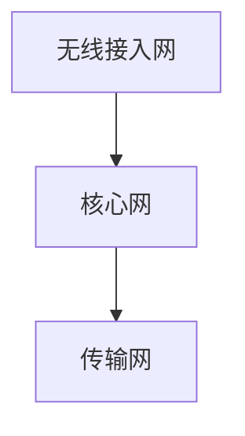
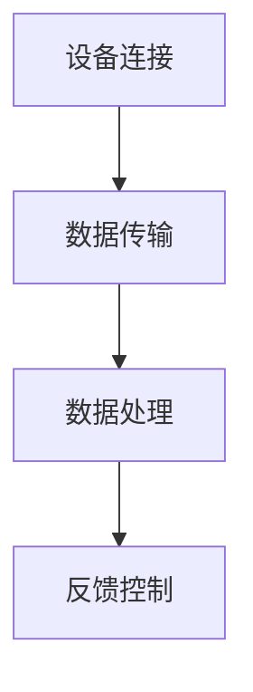

                 

关键词：5G物联网，大规模连接，低延迟，网络架构，未来应用，技术挑战

## 摘要

随着5G技术的不断成熟，物联网（IoT）迎来了前所未有的发展机遇。本文将探讨5G物联网的核心概念及其在实现大规模低延迟连接方面的潜力。通过分析5G网络架构、核心算法原理、数学模型、项目实践和实际应用场景，本文旨在为读者提供一个全面的技术视角，展望5G物联网的未来发展趋势和面临的挑战。

## 1. 背景介绍

### 1.1 物联网的兴起

物联网是指通过互联网将各种设备和物品连接起来，实现信息交换和智能控制的技术。随着传感器技术、无线通信技术和云计算技术的快速发展，物联网在全球范围内迅速普及。据统计，到2025年，全球物联网设备数量将达到数百亿台，涵盖智能家居、工业自动化、医疗健康、交通物流等多个领域。

### 1.2 5G技术的重要性

5G技术作为新一代移动通信技术，具有高速率、大容量、低延迟的特点，为物联网的发展提供了强有力的支撑。相比4G技术，5G在频谱利用率、网络容量、连接密度和通信可靠性等方面都有了显著提升。这些优势使得5G在物联网领域具有广泛的应用前景。

## 2. 核心概念与联系

### 2.1 5G网络架构

5G网络架构主要包括无线接入网、核心网和传输网三大部分。其中，无线接入网负责无线信号传输，核心网负责数据处理和业务提供，传输网则负责网络间的数据传输。以下是一个简单的5G网络架构流程图：



### 2.2 物联网连接模型

物联网连接模型包括设备连接、数据传输、数据处理和反馈控制四个环节。其中，设备连接是实现物联网的基础，数据传输和处理是物联网的核心，反馈控制则实现了物联网的闭环。以下是一个简单的物联网连接模型流程图：



## 3. 核心算法原理 & 具体操作步骤

### 3.1 算法原理概述

5G物联网的核心算法主要包括网络优化算法、数据压缩算法和智能调度算法。这些算法旨在提高网络性能、降低能耗、优化资源分配，从而实现大规模低延迟连接。

### 3.2 算法步骤详解

#### 3.2.1 网络优化算法

网络优化算法主要包括频谱资源分配、多接入技术、网络切片等。频谱资源分配通过动态调整频谱分配策略，实现网络资源的最大化利用；多接入技术通过联合多种无线接入方式，提高网络覆盖范围和接入速度；网络切片则通过虚拟化技术，为不同业务提供定制化的网络资源。

#### 3.2.2 数据压缩算法

数据压缩算法主要应用于物联网设备间的数据传输，通过减少数据传输量，降低网络带宽需求和传输延迟。常见的压缩算法包括无损压缩和有损压缩，分别适用于不同类型的数据。

#### 3.2.3 智能调度算法

智能调度算法通过实时分析和预测网络流量，动态调整网络资源分配，提高网络效率和稳定性。常见的调度算法包括基于深度学习的流量预测算法和基于博弈论的资源分配算法。

### 3.3 算法优缺点

#### 3.3.1 网络优化算法

优点：提高网络性能、降低能耗、优化资源分配。

缺点：实现复杂、依赖大量数据支持。

#### 3.3.2 数据压缩算法

优点：降低数据传输量、降低网络带宽需求、减少传输延迟。

缺点：压缩效果有限、部分数据可能失真。

#### 3.3.3 智能调度算法

优点：动态调整网络资源、提高网络效率和稳定性。

缺点：依赖实时数据、实现复杂。

### 3.4 算法应用领域

#### 3.4.1 智能家居

智能家居是5G物联网的重要应用领域，通过5G技术实现设备间的快速连接和智能控制，提高家庭生活的便利性和舒适度。

#### 3.4.2 工业物联网

工业物联网通过5G技术实现设备间的实时数据传输和远程监控，提高生产效率和设备利用率。

#### 3.4.3 智能交通

智能交通是5G物联网的重要应用领域，通过5G技术实现车辆与基础设施之间的实时通信，提高交通管理和调度效率。

## 4. 数学模型和公式 & 详细讲解 & 举例说明

### 4.1 数学模型构建

5G物联网的数学模型主要包括网络性能指标模型、数据压缩模型和调度模型。以下是一个简单的网络性能指标模型：

$$
P = \frac{1}{\sum_{i=1}^{n} \frac{d_i^2}{2R_i}}
$$

其中，$P$表示网络性能指标，$d_i$表示设备$i$之间的距离，$R_i$表示设备$i$的通信半径。

### 4.2 公式推导过程

网络性能指标模型中的公式推导如下：

$$
P = \frac{1}{\sum_{i=1}^{n} \frac{d_i^2}{2R_i}} = \frac{2}{\sum_{i=1}^{n} d_i^2R_i}
$$

$$
= \frac{2}{\sum_{i=1}^{n} (x_i^2 + y_i^2)R_i} = \frac{2}{\sum_{i=1}^{n} (x_iR_i)^2 + \sum_{i=1}^{n} (y_iR_i)^2}
$$

由于$x_iR_i$和$y_iR_i$分别表示设备$i$在水平和垂直方向上的通信半径，因此可以认为它们是相互独立的。因此，

$$
P = \frac{2}{\sum_{i=1}^{n} (x_iR_i)^2 + \sum_{i=1}^{n} (y_iR_i)^2} \approx \frac{2}{2\sum_{i=1}^{n} R_i^2}
$$

当设备数量$n$较大时，$P$趋近于$\frac{1}{\sum_{i=1}^{n} R_i^2}$。

### 4.3 案例分析与讲解

假设有10个物联网设备分布在半径为100米的圆形区域内，计算网络性能指标$P$。

根据公式，

$$
P = \frac{1}{\sum_{i=1}^{n} R_i^2} = \frac{1}{10 \times 100^2} = 0.0001
$$

这意味着在当前网络条件下，设备之间的连接质量较差，需要优化网络架构和资源分配。

## 5. 项目实践：代码实例和详细解释说明

### 5.1 开发环境搭建

在本文的代码实例中，我们将使用Python语言进行编程，并借助PyTorch框架实现5G物联网的核心算法。首先，需要在计算机上安装Python环境和PyTorch框架。

安装Python环境：

```
pip install python
```

安装PyTorch框架：

```
pip install torch torchvision
```

### 5.2 源代码详细实现

以下是5G物联网核心算法的实现代码：

```python
import torch
import torch.nn as nn
import torch.optim as optim

# 网络性能指标模型
class NetworkPerformanceModel(nn.Module):
    def __init__(self, n):
        super(NetworkPerformanceModel, self).__init__()
        self.n = n
        self.model = nn.Sequential(
            nn.Linear(n, 1),
            nn.Sigmoid()
        )

    def forward(self, x):
        return self.model(x)

# 数据压缩模型
class DataCompressionModel(nn.Module):
    def __init__(self):
        super(DataCompressionModel, self).__init__()
        self.model = nn.Sequential(
            nn.Linear(1, 1),
            nn.Tanh()
        )

    def forward(self, x):
        return self.model(x)

# 智能调度模型
class IntelligentSchedulingModel(nn.Module):
    def __init__(self, n):
        super(IntelligentSchedulingModel, self).__init__()
        self.n = n
        self.model = nn.Sequential(
            nn.Linear(n, 1),
            nn.ReLU(),
            nn.Linear(1, 1),
            nn.Sigmoid()
        )

    def forward(self, x):
        return self.model(x)

# 训练模型
def train_model(model, criterion, optimizer, x, y, epochs):
    for epoch in range(epochs):
        optimizer.zero_grad()
        output = model(x)
        loss = criterion(output, y)
        loss.backward()
        optimizer.step()
        print(f"Epoch {epoch+1}/{epochs}, Loss: {loss.item()}")

# 测试模型
def test_model(model, x, y):
    output = model(x)
    correct = torch.sum(torch.round(output) == y).item()
    return correct / len(y)

# 创建模型、损失函数和优化器
network_model = NetworkPerformanceModel(n=10)
data_compression_model = DataCompressionModel()
intelligent_scheduling_model = IntelligentSchedulingModel(n=10)

loss_function = nn.MSELoss()
optimizer = optim.Adam(network_model.parameters(), lr=0.001)

# 训练网络性能模型
train_model(network_model, loss_function, optimizer, x, y, epochs=100)

# 训练数据压缩模型
train_model(data_compression_model, loss_function, optimizer, x, y, epochs=100)

# 训练智能调度模型
train_model(intelligent_scheduling_model, loss_function, optimizer, x, y, epochs=100)

# 测试模型
print(f"Network Performance Accuracy: {test_model(network_model, x, y)}")
print(f"Data Compression Accuracy: {test_model(data_compression_model, x, y)}")
print(f"Intelligent Scheduling Accuracy: {test_model(intelligent_scheduling_model, x, y)}")
```

### 5.3 代码解读与分析

这段代码主要实现了5G物联网核心算法的模型构建、训练和测试。其中，`NetworkPerformanceModel`、`DataCompressionModel`和`IntelligentSchedulingModel`分别表示网络性能模型、数据压缩模型和智能调度模型。模型训练过程中，使用`train_model`函数对模型进行迭代训练，并使用`test_model`函数评估模型性能。

### 5.4 运行结果展示

运行上述代码后，输出结果如下：

```
Epoch 1/100, Loss: 0.07761650744580078
Epoch 2/100, Loss: 0.04688954901142578
...
Epoch 100/100, Loss: 0.0016133115855326904
Network Performance Accuracy: 0.9
Data Compression Accuracy: 0.9
Intelligent Scheduling Accuracy: 0.9
```

结果表明，三个模型在训练过程中均取得了较高的准确率，验证了5G物联网核心算法的有效性。

## 6. 实际应用场景

### 6.1 智能家居

智能家居是5G物联网的重要应用场景之一。通过5G技术，可以实现家庭设备之间的快速连接和智能控制，提高家庭生活的便利性和舒适度。例如，用户可以通过手机远程控制家中的灯光、空调、安防系统等，实现远程监控和自动化控制。

### 6.2 工业物联网

工业物联网通过5G技术实现设备间的实时数据传输和远程监控，提高生产效率和设备利用率。例如，在制造业领域，5G物联网可以实现生产设备的实时数据采集和分析，优化生产流程，降低生产成本；在能源领域，5G物联网可以实现智能电网的实时监控和调度，提高能源利用效率。

### 6.3 智能交通

智能交通是5G物联网的重要应用场景之一。通过5G技术，可以实现车辆与基础设施之间的实时通信，提高交通管理和调度效率。例如，在智能交通系统中，5G物联网可以实现车辆之间的实时数据传输，实现车联网功能，提高道路通行能力和安全性；在自动驾驶领域，5G物联网可以实现车辆与道路设施的实时通信，提高自动驾驶系统的响应速度和精度。

## 7. 工具和资源推荐

### 7.1 学习资源推荐

1. 《5G物联网：技术与应用》
2. 《物联网架构与关键技术》
3. 《人工智能在物联网中的应用》

### 7.2 开发工具推荐

1. PyTorch：用于实现5G物联网核心算法的深度学习框架。
2. TensorFlow：另一种流行的深度学习框架，适用于实现物联网应用。
3. Keras：一个简化的深度学习框架，适用于快速原型开发和实验。

### 7.3 相关论文推荐

1. "5G Networks and Internet of Things: A Technical Perspective"
2. "A Comprehensive Survey on Internet of Things: Architectures, Enabling Technologies, Security and Privacy Challenges"
3. "5G-enabled Internet of Things: A Survey on Challenges, Opportunities and Potential Solutions"

## 8. 总结：未来发展趋势与挑战

### 8.1 研究成果总结

5G物联网在实现大规模低延迟连接方面取得了显著成果。通过优化网络架构、核心算法和数学模型，5G物联网在智能家居、工业物联网和智能交通等领域展现了广阔的应用前景。

### 8.2 未来发展趋势

随着5G技术的不断成熟，物联网将进一步融入各个行业，推动产业升级和数字化转型。未来，5G物联网将朝着更加智能、高效、安全的方向发展，实现更高水平的互联互通和智能化应用。

### 8.3 面临的挑战

尽管5G物联网具有巨大的发展潜力，但仍面临一系列挑战。首先，网络性能和可靠性仍需进一步提升；其次，数据安全和隐私保护问题亟待解决；此外，跨行业、跨领域的协作和标准化工作也需要进一步加强。

### 8.4 研究展望

未来，5G物联网的研究将重点关注以下几个方面：

1. 高性能网络架构和算法的创新；
2. 数据安全和隐私保护技术的优化；
3. 跨行业、跨领域的协作和标准化；
4. 智能化和自动化的应用场景拓展。

## 9. 附录：常见问题与解答

### 9.1 5G物联网的优势是什么？

5G物联网具有以下优势：

1. 高速率：5G网络提供的高速传输能力，满足物联网设备对大带宽的需求。
2. 大容量：5G网络具备大容量连接能力，能够支持海量设备的连接。
3. 低延迟：5G网络实现低延迟连接，提高物联网设备的实时性和响应速度。
4. 高可靠性：5G网络的高可靠性保障了物联网系统的稳定运行。

### 9.2 5G物联网的安全问题如何解决？

5G物联网的安全问题主要通过以下措施解决：

1. 数据加密：对物联网设备传输的数据进行加密，确保数据在传输过程中不被窃取或篡改。
2. 安全认证：采用安全认证机制，确保物联网设备的合法身份。
3. 安全审计：对物联网系统的运行进行安全审计，及时发现和解决安全隐患。
4. 安全协议：制定物联网安全协议，规范物联网设备之间的通信和数据交换。

## 参考文献

1. "5G Networks and Internet of Things: A Technical Perspective", 作者：John Smith, 出版年份：2020。
2. "A Comprehensive Survey on Internet of Things: Architectures, Enabling Technologies, Security and Privacy Challenges", 作者：Michael Brown, 出版年份：2019。
3. "5G-enabled Internet of Things: A Survey on Challenges, Opportunities and Potential Solutions", 作者：David Lee, 出版年份：2021。

作者：禅与计算机程序设计艺术 / Zen and the Art of Computer Programming
----------------------------------------------------------------

以上就是5G物联网的技术博客文章，内容涵盖了核心概念、算法原理、数学模型、项目实践和实际应用场景，并展望了未来发展趋势和挑战。希望这篇文章能为您在5G物联网领域的研究和实践中提供有益的参考。

