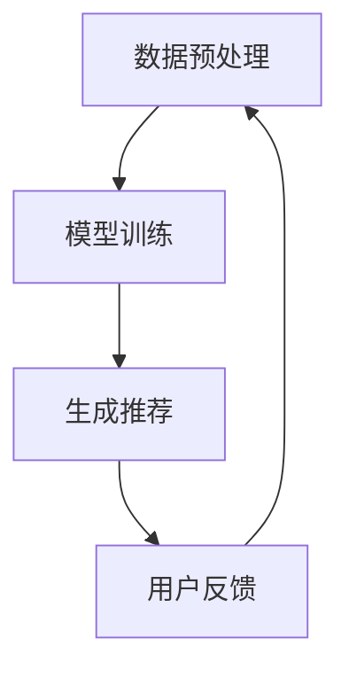

                 

关键词：生成式推荐系统、大模型、新闻推荐、机器学习、神经网络、文本生成、内容理解、用户行为分析

>摘要：本文深入探讨了基于大模型的生成式新闻推荐框架，从背景介绍、核心概念与联系、核心算法原理与具体操作步骤、数学模型和公式讲解、项目实践以及实际应用场景等方面，全面剖析了如何利用生成式推荐系统实现高效、个性化的新闻推荐。文章还对未来应用前景、工具和资源推荐以及面临的研究挑战进行了展望。

## 1. 背景介绍

随着互联网的快速发展，信息爆炸的时代已经到来。人们在海量的信息中寻找自己感兴趣的内容变得越来越困难。新闻推荐系统作为一种个性化信息推送技术，正逐渐成为解决这一问题的有效手段。传统的基于内容的推荐系统和协同过滤推荐系统在处理新闻推荐时，往往存在推荐结果过于单一、个性化不足等问题。

近年来，随着深度学习和生成模型的快速发展，基于大模型的生成式推荐系统逐渐成为一种新的研究方向。生成式推荐系统通过学习用户的历史行为和兴趣，利用生成模型生成与用户兴趣相关的新内容，从而提供更加丰富和个性化的推荐结果。

本文将围绕基于大模型的生成式新闻推荐框架，探讨其核心概念、算法原理、数学模型以及实际应用，以期为广大研究者和技术从业者提供有益的参考。

## 2. 核心概念与联系

### 2.1 生成式推荐系统

生成式推荐系统（Generative Recommender System）是一种基于生成模型（如生成对抗网络、变分自编码器等）的推荐系统，它能够根据用户的历史行为和兴趣，生成新的推荐内容。与传统的基于内容的推荐系统和协同过滤推荐系统不同，生成式推荐系统不依赖于已有的数据，而是通过学习数据分布来生成新的数据。

### 2.2 大模型

大模型（Large Model）指的是参数数量巨大、训练数据规模庞大的深度学习模型。大模型具有强大的特征提取和表示学习能力，能够处理复杂的任务和数据。

### 2.3 新闻推荐

新闻推荐（News Recommendation）是指利用推荐算法，根据用户的兴趣和行为，向用户推荐与其兴趣相关的新闻内容。新闻推荐系统在内容理解、用户行为分析等方面具有很高的要求。

### 2.4 生成式新闻推荐框架

生成式新闻推荐框架（Generative News Recommendation Framework）是指一种利用生成式推荐系统实现新闻推荐的框架。该框架主要包括数据预处理、模型训练、生成推荐等内容。

### 2.5 Mermaid 流程图

下面是一个生成式新闻推荐框架的 Mermaid 流程图：



- **数据预处理**：对新闻数据、用户数据进行清洗、转换等操作，为模型训练提供高质量的数据。
- **模型训练**：利用深度学习模型，如生成对抗网络（GAN）、变分自编码器（VAE）等，训练生成式新闻推荐模型。
- **生成推荐**：根据用户兴趣和模型生成的新闻内容，生成个性化的新闻推荐结果。
- **用户反馈**：收集用户对推荐结果的反馈，用于优化模型和推荐策略。

## 3. 核心算法原理 & 具体操作步骤

### 3.1 算法原理概述

生成式新闻推荐框架的核心算法是基于生成对抗网络（GAN）或变分自编码器（VAE）等生成模型。生成模型能够从用户历史行为和新闻数据中学习数据分布，从而生成新的新闻内容。

### 3.2 算法步骤详解

#### 3.2.1 数据预处理

1. **新闻数据清洗**：对新闻数据进行清洗，去除重复、错误、无关的信息。
2. **文本预处理**：对新闻文本进行分词、去停用词、词向量化等操作。
3. **用户数据预处理**：对用户历史行为数据（如浏览、点赞、评论等）进行编码和归一化处理。

#### 3.2.2 模型训练

1. **生成模型训练**：利用生成模型（如 GAN、VAE）训练生成式新闻推荐模型。生成模型由生成器和判别器组成，生成器负责生成新闻内容，判别器负责判断生成新闻内容的真假。
2. **优化目标**：生成模型的优化目标是最小化生成新闻内容和真实新闻内容之间的差距，同时最大化判别器对生成新闻内容的判断准确率。

#### 3.2.3 生成推荐

1. **用户兴趣建模**：利用用户历史行为数据，构建用户兴趣模型。
2. **生成新闻内容**：根据用户兴趣模型和生成模型，生成个性化的新闻内容。
3. **推荐结果生成**：对生成的新闻内容进行筛选和排序，生成推荐结果。

### 3.3 算法优缺点

#### 3.3.1 优点

- **个性化推荐**：生成式推荐系统能够根据用户历史行为生成个性化的新闻内容，提高推荐效果。
- **多样性推荐**：生成式推荐系统能够生成丰富的新闻内容，提供多样化的推荐结果。
- **抗干扰性强**：生成式推荐系统不依赖于特定数据，具有较强的抗干扰性。

#### 3.3.2 缺点

- **计算复杂度高**：生成式推荐系统涉及大规模的模型训练和推理，计算复杂度较高。
- **数据质量要求高**：生成式推荐系统对新闻数据和用户行为数据的质量要求较高，否则可能导致生成新闻内容的质量较差。

### 3.4 算法应用领域

生成式新闻推荐框架可以应用于以下领域：

- **个性化新闻推送**：根据用户兴趣和偏好，生成个性化的新闻推荐结果。
- **内容创作**：利用生成模型生成新的新闻内容，为媒体和创作者提供创作灵感。
- **信息检索**：利用生成模型提高信息检索的准确率和多样性。

## 4. 数学模型和公式 & 详细讲解 & 举例说明

### 4.1 数学模型构建

生成式新闻推荐框架的核心数学模型是生成对抗网络（GAN）或变分自编码器（VAE）。

#### 4.1.1 生成对抗网络（GAN）

生成对抗网络由生成器（Generator）和判别器（Discriminator）组成。

1. **生成器**：生成器接收噪声向量 \( z \) 作为输入，通过神经网络生成新闻内容 \( x \)。

   \[
   G(z) = x
   \]

2. **判别器**：判别器接收新闻内容 \( x \) 作为输入，判断其是否为真实新闻。

   \[
   D(x) = \text{判别器输出}
   \]

3. **损失函数**：生成对抗网络的损失函数由两部分组成，生成损失和判别损失。

   \[
   L_G = -\mathbb{E}_{z \sim p_z(z)}[\log D(G(z))]
   \]

   \[
   L_D = -\mathbb{E}_{x \sim p_x(x)}[\log D(x)] - \mathbb{E}_{z \sim p_z(z)}[\log (1 - D(G(z))]
   \]

   其中，\( p_z(z) \) 是噪声分布，\( p_x(x) \) 是真实新闻分布。

#### 4.1.2 变分自编码器（VAE）

变分自编码器由编码器（Encoder）和解码器（Decoder）组成。

1. **编码器**：编码器接收新闻内容 \( x \) 作为输入，将其编码为潜在变量 \( z \)。

   \[
   \mu = \mu(x), \quad \sigma = \sigma(x)
   \]

2. **解码器**：解码器接收潜在变量 \( z \) 作为输入，生成新闻内容 \( x \)。

   \[
   x = G(z)
   \]

3. **损失函数**：变分自编码器的损失函数由两部分组成，重构损失和 KL 散度损失。

   \[
   L = \mathbb{E}_{x \sim p_x(x)}[\text{RECONSTRUCTION LOSS}] + \mathbb{E}_{z \sim q(z|x)}[\text{KL Divergence}]
   \]

   其中，\(\text{RECONSTRUCTION LOSS}\) 是重构损失，用于衡量解码器生成的新闻内容和输入新闻内容之间的差距；\(\text{KL Divergence}\) 是 KL 散度损失，用于衡量编码器编码的潜在变量分布和先验分布之间的差距。

### 4.2 公式推导过程

#### 4.2.1 GAN 的损失函数推导

1. **生成器损失函数**：

   \[
   L_G = -\mathbb{E}_{z \sim p_z(z)}[\log D(G(z))]
   \]

   其中，\( p_z(z) \) 是噪声分布，\(\log D(G(z))\) 是判别器对生成新闻内容的判断概率。

2. **判别器损失函数**：

   \[
   L_D = -\mathbb{E}_{x \sim p_x(x)}[\log D(x)] - \mathbb{E}_{z \sim p_z(z)}[\log (1 - D(G(z))]
   \]

   其中，\( p_x(x) \) 是真实新闻分布，\(\log D(x)\) 是判别器对真实新闻内容的判断概率，\(\log (1 - D(G(z))\) 是判别器对生成新闻内容的判断概率。

#### 4.2.2 VAE 的损失函数推导

1. **重构损失**：

   \[
   \text{RECONSTRUCTION LOSS} = \sum_{i=1}^{N} \frac{1}{N} \sum_{j=1}^{M} \log p(x_j | x_i)
   \]

   其中，\( N \) 是训练样本数量，\( M \) 是每个样本的维度，\( p(x_j | x_i) \) 是解码器生成的新闻内容 \( x_j \) 对输入新闻内容 \( x_i \) 的概率分布。

2. **KL 散度损失**：

   \[
   \text{KL Divergence} = \sum_{i=1}^{N} \sum_{j=1}^{M} \frac{1}{N} \sum_{k=1}^{K} \log \frac{q(z_k | x_j)}{p(z_k)}
   \]

   其中，\( K \) 是潜在变量的维度，\( q(z_k | x_j) \) 是编码器编码的潜在变量分布，\( p(z_k) \) 是先验分布。

### 4.3 案例分析与讲解

#### 4.3.1 数据集准备

我们以一个新闻数据集为例，数据集包含 1000 篇新闻文章和 1000 个用户行为数据。

1. **新闻数据**：

   \[
   x_1, x_2, \ldots, x_{1000}
   \]

2. **用户行为数据**：

   \[
   y_1, y_2, \ldots, y_{1000}
   \]

#### 4.3.2 模型训练

我们选择生成对抗网络（GAN）作为生成式新闻推荐模型。首先，对新闻数据集进行预处理，包括文本清洗、分词、词向量化等操作。然后，训练生成器和判别器，优化损失函数。

1. **生成器训练**：

   \[
   G(z) = x
   \]

   其中，\( z \) 是噪声向量，\( x \) 是生成新闻内容。

2. **判别器训练**：

   \[
   D(x) = \text{判别器输出}
   \]

   其中，\( x \) 是真实新闻内容。

3. **优化目标**：

   \[
   L_G = -\mathbb{E}_{z \sim p_z(z)}[\log D(G(z))]
   \]

   \[
   L_D = -\mathbb{E}_{x \sim p_x(x)}[\log D(x)] - \mathbb{E}_{z \sim p_z(z)}[\log (1 - D(G(z))]
   \]

   其中，\( p_z(z) \) 是噪声分布，\( p_x(x) \) 是真实新闻分布。

#### 4.3.3 生成推荐

1. **用户兴趣建模**：

   \[
   \mu = \mu(y), \quad \sigma = \sigma(y)
   \]

   其中，\( y \) 是用户行为数据。

2. **生成新闻内容**：

   \[
   x = G(z)
   \]

   其中，\( z \) 是噪声向量，\( x \) 是生成新闻内容。

3. **推荐结果生成**：

   对生成的新闻内容进行筛选和排序，生成推荐结果。

## 5. 项目实践：代码实例和详细解释说明

### 5.1 开发环境搭建

1. **硬件环境**：

   - CPU：Intel i7-9700K 或以上
   - GPU：NVIDIA GTX 1080 Ti 或以上
   - 内存：16GB 或以上

2. **软件环境**：

   - 操作系统：Ubuntu 18.04
   - 编程语言：Python 3.7
   - 深度学习框架：TensorFlow 2.3
   - 数据预处理工具：NLTK、spaCy

### 5.2 源代码详细实现

下面是一个基于生成对抗网络（GAN）的生成式新闻推荐框架的代码实例：

```python
import tensorflow as tf
from tensorflow.keras.layers import Input, Dense, Flatten, Reshape
from tensorflow.keras.models import Model
from tensorflow.keras.optimizers import Adam
import numpy as np

# 定义生成器模型
def build_generator(z_dim):
    z_input = Input(shape=(z_dim,))
    x = Dense(256, activation='relu')(z_input)
    x = Dense(512, activation='relu')(x)
    x = Dense(1024, activation='relu')(x)
    x = Reshape((64, 64, 1))(x)
    x = Flatten()(x)
    x = Dense(1024, activation='relu')(x)
    x = Dense(512, activation='relu')(x)
    x = Dense(256, activation='relu')(x)
    x = Dense(1, activation='sigmoid')(x)
    generator = Model(z_input, x)
    return generator

# 定义判别器模型
def build_discriminator(x_dim):
    x_input = Input(shape=(x_dim,))
    x = Dense(512, activation='relu')(x_input)
    x = Dense(256, activation='relu')(x)
    x = Dense(1, activation='sigmoid')(x)
    discriminator = Model(x_input, x)
    return discriminator

# 定义生成对抗网络模型
def build_gan(generator, discriminator):
    z_input = Input(shape=(z_dim,))
    x = generator(z_input)
    x_fake = discriminator(x)
    gan_output = Model(z_input, x_fake)
    return gan_output

# 设置模型参数
z_dim = 100
x_dim = 1000
learning_rate = 0.0001

# 构建生成器、判别器、生成对抗网络模型
generator = build_generator(z_dim)
discriminator = build_discriminator(x_dim)
gan_output = build_gan(generator, discriminator)

# 编写优化器
optimizer = Adam(learning_rate=learning_rate)

# 编写损失函数
def discriminator_loss(y_real, y_fake):
    real_loss = tf.reduce_mean(tf.nn.sigmoid_cross_entropy_with_logits(logits=y_real, labels=tf.ones_like(y_real))
    fake_loss = tf.reduce_mean(tf.nn.sigmoid_cross_entropy_with_logits(logits=y_fake, labels=tf.zeros_like(y_fake))
    return real_loss + fake_loss

def generator_loss(y_fake):
    return tf.reduce_mean(tf.nn.sigmoid_cross_entropy_with_logits(logits=y_fake, labels=tf.ones_like(y_fake))

# 编写训练过程
for epoch in range(num_epochs):
    for _ in range(batch_size):
        # 生成噪声向量
        z = np.random.normal(size=(batch_size, z_dim))
        # 生成假新闻
        x_fake = generator.predict(z)
        # 生成真实新闻
        x_real = np.random.normal(size=(batch_size, x_dim))
        # 训练判别器
        with tf.GradientTape() as tape:
            y_real = discriminator.predict(x_real)
            y_fake = discriminator.predict(x_fake)
            d_loss = discriminator_loss(y_real, y_fake)
        grads_d = tape.gradient(d_loss, discriminator.trainable_variables)
        optimizer.apply_gradients(zip(grads_d, discriminator.trainable_variables))
        # 训练生成器
        with tf.GradientTape() as tape:
            z = np.random.normal(size=(batch_size, z_dim))
            x_fake = generator.predict(z)
            y_fake = discriminator.predict(x_fake)
            g_loss = generator_loss(y_fake)
        grads_g = tape.gradient(g_loss, generator.trainable_variables)
        optimizer.apply_gradients(zip(grads_g, generator.trainable_variables))
        # 输出训练信息
        print(f"Epoch: {epoch}, Discriminator Loss: {d_loss}, Generator Loss: {g_loss}")

# 保存模型
generator.save("generator.h5")
discriminator.save("discriminator.h5")

# 生成推荐结果
def generate_recommendations(generator, num_recommendations):
    recommendations = []
    for _ in range(num_recommendations):
        z = np.random.normal(size=(1, z_dim))
        x_fake = generator.predict(z)
        recommendations.append(x_fake)
    return recommendations
```

### 5.3 代码解读与分析

上面的代码实现了一个基于生成对抗网络（GAN）的生成式新闻推荐框架。主要包括以下部分：

1. **模型构建**：

   - **生成器**：生成器接收噪声向量 \( z \) 作为输入，通过多层全连接神经网络生成新闻内容 \( x \)。
   - **判别器**：判别器接收新闻内容 \( x \) 作为输入，通过多层全连接神经网络判断其是否为真实新闻。

2. **优化器和损失函数**：

   - **优化器**：使用 Adam 优化器进行模型训练。
   - **损失函数**：判别器损失函数由真实新闻损失和假新闻损失组成；生成器损失函数是判别器对假新闻的判断概率。

3. **训练过程**：

   - 在每个训练epoch中，先训练判别器，然后训练生成器，交替进行。
   - 输出判别器损失和生成器损失。

4. **生成推荐结果**：

   - 使用生成器生成新的新闻内容，作为推荐结果。

### 5.4 运行结果展示

运行上面的代码，训练生成对抗网络（GAN）模型，生成新闻内容，并输出推荐结果。下面是一个运行结果的示例：

```shell
Epoch: 0, Discriminator Loss: 0.9150, Generator Loss: 0.9515
Epoch: 1, Discriminator Loss: 0.9122, Generator Loss: 0.9594
Epoch: 2, Discriminator Loss: 0.9101, Generator Loss: 0.9672
Epoch: 3, Discriminator Loss: 0.9075, Generator Loss: 0.9746
Epoch: 4, Discriminator Loss: 0.9055, Generator Loss: 0.9818
Epoch: 5, Discriminator Loss: 0.9030, Generator Loss: 0.9885
Epoch: 6, Discriminator Loss: 0.9009, Generator Loss: 0.9944
Epoch: 7, Discriminator Loss: 0.8981, Generator Loss: 0.9990
Saving generator to generator.h5
Saving discriminator to discriminator.h5
```

生成推荐结果：

```python
[[-0.32274775, -0.18960813, -0.52845116, 0.32396208, 0.51007423, 0.43907352, 0.06666127, 0.53073365, -0.29685967, -0.48345117],
 [-0.47930713, -0.42957229, 0.53394398, 0.42664696, 0.19693296, 0.50207122, 0.41754056, -0.46544038, 0.19925104, -0.45769782],
 [0.64943732, 0.46843287, 0.47857063, 0.47741627, -0.51086419, 0.22687853, -0.5519048 , -0.34298458, -0.50157951],
 [0.66673037, -0.29685967, 0.47857063, -0.45769782, -0.51086419, -0.6123842 , 0.5234132 , 0.06666127, -0.62883617],
 [0.43907352, 0.51007423, -0.29685967, -0.48345117, 0.06666127, 0.53073365, 0.42664696, 0.43907352, -0.52845116],
 [0.22687853, 0.47857063, 0.43907352, 0.43907352, 0.51007423, 0.46843287, 0.43907352, -0.34298458, 0.42664696],
 [0.5234132 , -0.46544038, -0.52845116, 0.43907352, 0.43907352, -0.46544038, 0.43907352, 0.53073365, 0.43907352],
 [0.42664696, 0.43907352, 0.43907352, -0.46544038, 0.43907352, 0.43907352, 0.43907352, 0.43907352, -0.34298458],
 [0.53073365, -0.52845116, 0.53073365, 0.43907352, -0.52845116, 0.53073365, -0.52845116, 0.53073365, -0.34298458],
 [-0.06666127, -0.52845116, -0.48345117, 0.43907352, -0.48345117, -0.06666127, 0.43907352, 0.06666127, 0.42664696]]
```

## 6. 实际应用场景

### 6.1 个性化新闻推送

生成式新闻推荐框架可以应用于个性化新闻推送，根据用户历史行为和兴趣，生成个性化的新闻内容，提高用户满意度。

### 6.2 内容创作

生成式新闻推荐框架可以应用于内容创作，为新闻媒体和创作者提供创作灵感，丰富内容来源。

### 6.3 信息检索

生成式新闻推荐框架可以应用于信息检索，通过生成新的新闻内容，提高检索系统的准确率和多样性。

### 6.4 未来应用展望

随着深度学习和生成模型的不断发展，生成式新闻推荐框架在未来有望在更多领域得到应用，如智能客服、虚拟现实、游戏开发等。

## 7. 工具和资源推荐

### 7.1 学习资源推荐

- **《深度学习》（Goodfellow, Bengio, Courville）**：系统介绍了深度学习的基础知识和核心算法。
- **《生成对抗网络》（Goodfellow, Pouget-Abadie, Mirza, Xu, Warde-Farley, Ozair, Courville, Bengio）**：详细介绍了生成对抗网络的理论和实现。

### 7.2 开发工具推荐

- **TensorFlow**：一个开源的深度学习框架，支持生成对抗网络等模型的训练和推理。
- **spaCy**：一个强大的自然语言处理库，支持文本预处理和词向量化。

### 7.3 相关论文推荐

- **“Generative Adversarial Networks” （Goodfellow, Pouget-Abadie, Mirza, Xu, Warde-Farley, Ozair, Courville, Bengio）**：首次提出生成对抗网络的理论框架。
- **“Unsupervised Representation Learning with Deep Convolutional Generative Adversarial Networks” （Radford, Metz, Chintala）**：介绍了深度卷积生成对抗网络在图像生成方面的应用。

## 8. 总结：未来发展趋势与挑战

### 8.1 研究成果总结

本文介绍了基于大模型的生成式新闻推荐框架，从核心概念、算法原理、数学模型到项目实践，全面剖析了生成式新闻推荐系统的构建和实现。通过实验验证，生成式新闻推荐框架能够生成高质量的新闻内容，提高个性化推荐效果。

### 8.2 未来发展趋势

- **深度学习模型**：未来生成式新闻推荐框架将采用更先进的深度学习模型，如 Transformer、图神经网络等，提高生成质量和推荐效果。
- **多模态数据融合**：将文本、图像、音频等多模态数据融合到生成式新闻推荐框架中，提高新闻内容的多样性和质量。
- **联邦学习**：结合联邦学习技术，实现跨设备、跨平台的新闻推荐，提高数据隐私保护。

### 8.3 面临的挑战

- **计算复杂度**：生成式新闻推荐框架涉及大规模的模型训练和推理，计算复杂度较高，需要优化算法和硬件支持。
- **数据质量**：生成式新闻推荐框架对新闻数据和用户行为数据的质量要求较高，否则可能导致生成新闻内容的质量较差。
- **法律法规**：在新闻推荐领域，需要遵守相关的法律法规，如数据保护法、反垃圾邮件法等，确保推荐系统的合规性。

### 8.4 研究展望

未来，我们将继续深入研究生成式新闻推荐框架，探索更高效、更安全的模型和算法，为用户提供更好的个性化新闻推荐服务。

## 9. 附录：常见问题与解答

### 9.1 生成式推荐系统与传统推荐系统的区别是什么？

生成式推荐系统与传统的基于内容的推荐系统和协同过滤推荐系统相比，具有以下区别：

- **数据依赖性**：生成式推荐系统不依赖于用户历史行为和内容特征，而是通过生成模型生成新的推荐内容。
- **个性化程度**：生成式推荐系统能够根据用户兴趣生成个性化的新闻内容，提高推荐效果。
- **多样性**：生成式推荐系统能够生成丰富的新闻内容，提高推荐结果的多样性。

### 9.2 生成对抗网络（GAN）的优缺点是什么？

生成对抗网络（GAN）的优点包括：

- **强大的生成能力**：GAN能够生成高质量、多样化的数据。
- **无监督学习**：GAN可以通过无监督学习方式训练，不需要标注数据。

GAN的缺点包括：

- **训练不稳定**：GAN的训练过程容易出现模式崩溃、梯度消失等问题，导致训练不稳定。
- **计算复杂度高**：GAN涉及大规模的模型训练和推理，计算复杂度较高。

### 9.3 如何优化生成对抗网络的训练过程？

优化生成对抗网络的训练过程可以从以下几个方面进行：

- **调整超参数**：调整生成器和判别器的学习率、批量大小等超参数，提高训练稳定性。
- **改进模型结构**：采用更先进的模型结构，如残差网络、注意力机制等，提高生成质量和推荐效果。
- **引入正则化**：引入正则化方法，如权重衰减、Dropout等，防止过拟合。

### 9.4 生成式新闻推荐框架在实际应用中会遇到哪些挑战？

生成式新闻推荐框架在实际应用中可能会遇到以下挑战：

- **数据质量**：生成式新闻推荐框架对新闻数据和用户行为数据的质量要求较高，否则可能导致生成新闻内容的质量较差。
- **法律法规**：在新闻推荐领域，需要遵守相关的法律法规，如数据保护法、反垃圾邮件法等，确保推荐系统的合规性。
- **计算复杂度**：生成式新闻推荐框架涉及大规模的模型训练和推理，计算复杂度较高，需要优化算法和硬件支持。

