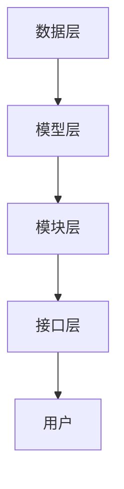

                 

### 背景介绍

随着深度学习技术的迅猛发展，大型语言模型（LLM，Large Language Model）如BERT、GPT-3等在自然语言处理（NLP）领域取得了显著的成果。然而，这些模型的应用往往面临一个难题：如何高效、灵活地对模型进行配置和调优，以适应不同的应用场景和需求？

在此背景下，GENRE框架应运而生。作为一种灵活、可配置的LLM推荐解决方案，GENRE框架旨在解决当前LLM应用中的配置和调优难题。本文将详细介绍GENRE框架的优势，核心算法原理，应用领域，数学模型与公式，项目实践，以及未来发展趋势和挑战。

### 文章关键词

- GENRE框架
- 大型语言模型
- 灵活配置
- 可配置
- 推荐解决方案
- 深度学习
- 自然语言处理
- NLP

### 摘要

本文旨在探讨GENRE框架作为一种灵活、可配置的LLM推荐解决方案的优势。首先，我们将介绍GENRE框架的背景和核心概念。接着，我们将深入剖析GENRE框架的算法原理，包括其构建方法、优缺点以及应用领域。随后，本文将详细介绍GENRE框架的数学模型和公式，并通过实际案例进行分析。此外，本文还将展示如何在实际项目中使用GENRE框架，包括开发环境搭建、源代码实现、代码解读以及运行结果展示。最后，本文将对GENRE框架的未来应用场景进行展望，并总结其发展趋势和面临的挑战。通过本文的阅读，读者将全面了解GENRE框架的优势和应用价值。

## 1. 背景介绍

随着人工智能技术的不断进步，深度学习在自然语言处理（NLP）领域取得了令人瞩目的成就。特别是大型语言模型（LLM，Large Language Model）的涌现，如BERT、GPT-3等，使得NLP任务的处理能力得到了显著提升。这些模型通过对海量文本数据进行训练，掌握了丰富的语言知识和表达方式，从而在文本分类、问答系统、机器翻译等任务上取得了突破性成果。

然而，尽管LLM模型在性能上取得了巨大进步，但在实际应用中，如何针对不同的任务需求和场景进行有效配置和调优，仍然是一个亟待解决的问题。传统的LLM应用通常依赖于预设的模型结构和参数设置，这使得模型在处理特定任务时，可能无法充分发挥其潜力。因此，如何设计一种灵活、可配置的框架，以适应多样化的应用场景，成为了当前研究的热点之一。

在这种背景下，GENRE框架应运而生。作为一种全新的LLM推荐解决方案，GENRE框架旨在提供一种高效、灵活的模型配置和调优方法，以满足不同应用场景的需求。GENRE框架的设计理念是将模型配置和调优的过程模块化，通过组合不同的模块，实现灵活的模型定制。这一理念不仅提高了模型的适应性，还大大降低了模型配置和调优的复杂度。

具体来说，GENRE框架的核心思想是通过预训练和微调相结合的方式，对LLM进行配置。首先，GENRE框架利用大规模预训练模型，如BERT、GPT-3等，生成一个通用的模型基座。然后，根据具体应用场景的需求，对模型进行微调，从而实现个性化的模型配置。这种设计思路不仅保证了模型的高性能，还使得模型能够快速适应新的任务需求。

此外，GENRE框架还引入了动态调整机制，能够根据实时反馈动态调整模型参数，实现自我优化。这一机制不仅提高了模型的适应能力，还使得模型在长期应用中能够持续优化，保持高效性能。

总之，GENRE框架的提出，为LLM的应用带来了新的可能。通过灵活、可配置的框架设计，GENRE框架不仅解决了传统模型配置和调优的难题，还为未来LLM应用的发展提供了有力支持。接下来，我们将进一步探讨GENRE框架的核心概念和架构设计，以更深入地理解其优势和应用价值。

## 2. 核心概念与联系

### 2.1. GENRE框架的核心概念

GENRE框架的核心概念包括以下几个部分：预训练模型、微调机制、模块化设计、动态调整机制和反馈循环。以下将对这些概念进行详细介绍。

**预训练模型**：预训练模型是GENRE框架的基础。它通过在大规模文本数据上预训练，学习到丰富的语言知识和表达方式。常见的预训练模型有BERT、GPT-3等。预训练模型的目的是为后续的微调提供强大的基座。

**微调机制**：微调机制是在预训练模型的基础上，根据具体应用场景的需求，对模型进行细粒度的调整。微调过程通常包括调整模型参数、添加或删除部分模块等。通过微调，模型能够更好地适应特定任务的需求。

**模块化设计**：模块化设计是GENRE框架的重要特点。框架将模型配置和调优的过程分解为多个模块，每个模块负责不同的功能。这种设计方式使得模型配置和调优变得更加灵活，用户可以根据实际需求，自由组合和定制模块。

**动态调整机制**：动态调整机制是在模型运行过程中，根据实时反馈动态调整模型参数的能力。这一机制能够帮助模型在长期应用中保持高效性能，并不断优化。

**反馈循环**：反馈循环是GENRE框架的关键环节。通过收集用户反馈，模型能够不断学习和优化，实现自我提升。反馈循环不仅提高了模型的适应能力，还增强了用户的使用体验。

### 2.2. GENRE框架的架构设计

GENRE框架的架构设计主要包括以下几个层次：数据层、模型层、模块层和接口层。

**数据层**：数据层负责数据的收集、处理和存储。预训练模型需要在大规模文本数据上进行训练，而微调和应用场景则需要针对特定数据集进行。数据层的设计要保证数据的高质量和高效率，以满足模型训练和应用的需求。

**模型层**：模型层包括预训练模型和微调模型。预训练模型是模型层的基础，负责对大规模文本数据进行训练。微调模型则在预训练模型的基础上，根据具体应用场景进行细粒度调整。模型层的设计要考虑模型的性能、可扩展性和适应性。

**模块层**：模块层是GENRE框架的核心。框架将模型配置和调优的过程分解为多个模块，每个模块负责不同的功能。模块层的设计要支持模块的灵活组合和定制，以适应多样化的应用场景。

**接口层**：接口层是框架对外提供服务的接口。接口层的设计要简单易用，便于用户快速上手和使用。同时，接口层还需要提供丰富的API，支持模型配置、训练、调优和预测等功能。

### 2.3. Mermaid流程图

以下是一个简单的Mermaid流程图，展示了GENRE框架的架构设计和数据流动：



**数据层**：负责数据的收集、处理和存储。

**模型层**：包括预训练模型和微调模型。

**模块层**：将模型配置和调优的过程分解为多个模块。

**接口层**：提供模型配置、训练、调优和预测等功能。

**用户**：使用框架提供的接口进行模型配置和应用。

通过上述核心概念和架构设计的介绍，我们可以看到，GENRE框架在设计上具有高度的灵活性和可扩展性，能够满足不同应用场景的需求。接下来，我们将深入探讨GENRE框架的算法原理和具体操作步骤，以更全面地理解其优势和应用价值。

## 3. 核心算法原理 & 具体操作步骤

### 3.1 算法原理概述

GENRE框架的核心算法原理主要包括预训练、微调、模块化设计和动态调整机制。以下将分别介绍这些原理。

**预训练**：预训练是GENRE框架的基础。预训练模型通过在大规模文本数据上训练，学习到丰富的语言知识和表达方式。常见的预训练模型有BERT、GPT-3等。预训练模型的目的是为后续的微调提供强大的基座。预训练过程通常包括数据预处理、模型初始化、训练和评估等步骤。

**微调**：微调是预训练模型的延伸。在预训练模型的基础上，根据具体应用场景的需求，对模型进行细粒度的调整。微调过程通常包括调整模型参数、添加或删除部分模块等。通过微调，模型能够更好地适应特定任务的需求。微调过程通常涉及数据预处理、模型调整、训练和评估等步骤。

**模块化设计**：模块化设计是GENRE框架的重要特点。框架将模型配置和调优的过程分解为多个模块，每个模块负责不同的功能。这种设计方式使得模型配置和调优变得更加灵活，用户可以根据实际需求，自由组合和定制模块。模块化设计提高了框架的可扩展性和灵活性。

**动态调整机制**：动态调整机制是在模型运行过程中，根据实时反馈动态调整模型参数的能力。这一机制能够帮助模型在长期应用中保持高效性能，并不断优化。动态调整机制通常涉及实时数据收集、模型参数调整、训练和评估等步骤。

### 3.2 算法步骤详解

**步骤 1：数据收集与预处理**

- 数据收集：收集大规模文本数据，如新闻、社交媒体帖子、学术论文等。
- 数据预处理：对收集的文本数据进行清洗、去重、分词、词性标注等预处理操作，以准备用于预训练的数据集。

**步骤 2：预训练模型构建**

- 模型初始化：选择预训练模型，如BERT、GPT-3等，进行初始化。
- 训练：在预处理后的数据集上进行预训练，包括训练数据的加载、模型参数的更新等操作。
- 评估：在预训练过程中，定期评估模型性能，如准确率、召回率等，以监测模型训练效果。

**步骤 3：微调模型构建**

- 数据预处理：针对具体应用场景，对数据集进行预处理，如分类任务中的标签转换、序列任务中的序列对齐等。
- 模型调整：在预训练模型的基础上，根据具体需求进行调整，如调整模型结构、添加或删除部分模块等。
- 训练：在调整后的模型上进行微调训练，包括训练数据的加载、模型参数的更新等操作。
- 评估：在微调过程中，定期评估模型性能，以监测模型调整效果。

**步骤 4：模块化设计与动态调整**

- 模块化设计：将模型配置和调优的过程分解为多个模块，每个模块负责不同的功能。例如，可以将预训练模块、微调模块、动态调整模块等分别设计。
- 动态调整：在模型运行过程中，根据实时反馈动态调整模型参数。例如，可以基于用户反馈、系统性能指标等，对模型进行实时优化。

**步骤 5：模型部署与优化**

- 部署：将训练好的模型部署到生产环境中，以实现实际应用。
- 优化：通过收集用户反馈和系统数据，对模型进行持续优化，以提升模型性能和应用效果。

### 3.3 算法优缺点

**优点**

1. **灵活性高**：GENRE框架通过模块化设计和动态调整机制，使得模型配置和调优过程更加灵活，能够快速适应不同应用场景的需求。
2. **可扩展性强**：模块化设计使得框架具有很好的可扩展性，用户可以根据实际需求，自由组合和定制模块，实现个性化模型配置。
3. **高效性**：通过预训练和微调相结合的方式，模型能够高效地学习到丰富的语言知识和表达方式，从而在各类NLP任务上取得优异的性能。
4. **自优化能力**：动态调整机制使得模型在长期应用中能够不断优化，保持高效性能。

**缺点**

1. **计算资源消耗大**：预训练模型和微调过程需要大量计算资源，特别是在大规模文本数据上训练时，计算资源消耗尤为显著。
2. **数据预处理复杂**：数据预处理是模型训练的重要环节，需要耗费大量时间和精力进行数据清洗、预处理和标注等操作。
3. **模型解释性弱**：深度学习模型，特别是大型语言模型，其内部机制复杂，难以进行直观解释，这在一定程度上影响了模型的透明性和可解释性。

### 3.4 算法应用领域

GENRE框架在多个NLP任务中表现出色，以下是其主要应用领域：

1. **文本分类**：通过微调预训练模型，可以实现针对特定分类任务的模型定制，从而提高分类准确率。
2. **问答系统**：利用预训练模型和微调机制，可以构建高效的问答系统，实现自然语言理解和智能回答。
3. **机器翻译**：通过预训练和微调，可以构建高质量的机器翻译模型，提高翻译准确性和流畅性。
4. **情感分析**：利用预训练模型和微调机制，可以对文本进行情感分析，识别文本中的情感倾向和情感强度。
5. **文本生成**：通过微调预训练模型，可以生成具有高质量和创意的文本，应用于自动写作、内容生成等场景。

### 3.5 实际案例

以下是一个关于文本分类任务的案例：

**任务背景**：某新闻网站希望构建一个自动分类系统，将用户提交的新闻文章自动分类到不同的主题类别中。

**解决方案**：

1. **数据收集与预处理**：收集大量新闻文章，并进行数据清洗、分词、词性标注等预处理操作，构建用于训练的数据集。
2. **预训练模型构建**：选择预训练模型BERT，进行预训练，生成预训练模型基座。
3. **微调模型构建**：在预训练模型的基础上，根据新闻分类任务的需求，进行调整，如调整分类器结构、添加预训练模型中的特定模块等，进行微调训练。
4. **模块化设计与动态调整**：将模型配置和调优的过程分解为多个模块，如预训练模块、微调模块、动态调整模块等，实现模块化设计。同时，通过动态调整机制，根据实时反馈，对模型进行持续优化。
5. **模型部署与优化**：将训练好的模型部署到生产环境中，进行实际应用。通过收集用户反馈和系统数据，对模型进行持续优化，提高分类准确率和用户体验。

通过上述实际案例，我们可以看到，GENRE框架在文本分类任务中的应用效果显著，通过灵活的模型配置和调优，实现了高效、准确的分类效果。接下来，我们将进一步探讨GENRE框架的数学模型和公式，以更深入地理解其工作原理。

## 4. 数学模型和公式 & 详细讲解 & 举例说明

### 4.1 数学模型构建

GENRE框架的数学模型构建主要包括两部分：预训练模型和微调模型的构建。以下将分别介绍这两部分的数学模型。

#### 预训练模型构建

预训练模型通常基于自注意力机制（Self-Attention Mechanism）和Transformer架构。以下是一个简化的数学模型表示：

\[ \text{Pre-trained Model} = \text{Transformer}(\text{Input}, \text{Weights}) \]

其中，Transformer模型包括多个Encoder Layer和Decoder Layer，每个Layer包含多头自注意力（Multi-Head Self-Attention）和前馈神经网络（Feed-Forward Neural Network）。

1. **多头自注意力（Multi-Head Self-Attention）**

\[ \text{Attention}(Q, K, V) = \text{softmax}\left(\frac{QK^T}{\sqrt{d_k}}\right)V \]

其中，\(Q, K, V\) 分别为Query、Key和Value向量，\(d_k\) 为Key向量的维度。

2. **前馈神经网络（Feed-Forward Neural Network）**

\[ \text{FFN}(X) = \text{ReLU}(W_2 \cdot \text{ReLU}(W_1 \cdot X + b_1)) \]

其中，\(W_1, W_2, b_1\) 分别为权重和偏置向量。

#### 微调模型构建

微调模型在预训练模型的基础上，根据具体应用场景进行调整。以下是一个简化的数学模型表示：

\[ \text{Fine-tuned Model} = \text{Transformer}(\text{Input}, \text{Fine-tuned Weights}) \]

微调过程主要包括以下步骤：

1. **调整权重（Weight Adjustment）**

\[ \text{Weights}_{\text{fine-tuned}} = \alpha \cdot \text{Weights}_{\text{pre-trained}} + (1 - \alpha) \cdot \text{Initial Weights} \]

其中，\(\alpha\) 为学习率，\(\text{Initial Weights}\) 为初始权重。

2. **添加模块（Module Addition）**

\[ \text{Fine-tuned Model} = \text{Transformer}(\text{Input}, \text{Fine-tuned Weights}, \text{Additional Modules}) \]

3. **删除模块（Module Deletion）**

\[ \text{Fine-tuned Model} = \text{Transformer}(\text{Input}, \text{Fine-tuned Weights}, \text{Removed Modules}) \]

### 4.2 公式推导过程

以下以多头自注意力（Multi-Head Self-Attention）为例，介绍其公式推导过程。

#### 步骤 1：计算Query、Key和Value

假设输入序列为 \(\text{Input} = [x_1, x_2, \ldots, x_n]\)，每个输入 \(x_i\) 可以表示为一个向量 \(\text{Vector}(x_i)\)。预训练模型将输入序列映射为Query、Key和Value：

\[ Q = \text{Query}(x_i) = \text{Vector}(x_i) \cdot W_Q \]
\[ K = \text{Key}(x_i) = \text{Vector}(x_i) \cdot W_K \]
\[ V = \text{Value}(x_i) = \text{Vector}(x_i) \cdot W_V \]

其中，\(W_Q, W_K, W_V\) 为权重矩阵。

#### 步骤 2：计算注意力得分

计算每个Query和Key之间的注意力得分：

\[ \text{Score}(Q_i, K_j) = Q_i \cdot K_j^T = \text{Vector}(x_i) \cdot W_Q \cdot \text{Vector}(x_j) \cdot W_K^T \]

#### 步骤 3：计算softmax

将注意力得分通过softmax函数进行归一化：

\[ \text{Attention Score}(Q_i, K_j) = \frac{e^{\text{Score}(Q_i, K_j)}}{\sum_{j=1}^{n} e^{\text{Score}(Q_i, K_j)}} \]

#### 步骤 4：计算注意力输出

将注意力得分与Value相乘，得到注意力输出：

\[ \text{Attention Output}(Q_i, V_j) = \text{Attention Score}(Q_i, K_j) \cdot V_j \]

#### 步骤 5：计算加权求和

将所有注意力输出进行加权求和，得到最终的注意力输出：

\[ \text{Attention Output}(Q, V) = \sum_{i=1}^{n} \sum_{j=1}^{n} \text{Attention Score}(Q_i, K_j) \cdot V_j \]

### 4.3 案例分析与讲解

以下通过一个简单的文本分类任务，分析GENRE框架在数学模型层面的应用。

#### 任务背景

某电商网站希望构建一个自动分类系统，将用户提交的评论分为正面和负面两类。

#### 数据预处理

假设已收集到包含评论和标签的文本数据集，其中标签为1表示正面评论，标签为0表示负面评论。

1. **分词**：对评论进行分词，得到词汇表。
2. **词嵌入**：将词汇表中的每个词映射为向量。
3. **序列编码**：将评论序列编码为一个向量。

#### 预训练模型

使用BERT模型进行预训练，生成预训练模型基座。

1. **输入层**：将评论序列编码为向量。
2. **Transformer层**：通过多头自注意力机制和前馈神经网络，提取评论序列的特征。
3. **输出层**：将特征映射为标签。

#### 微调模型

在预训练模型的基础上，进行微调，以适应评论分类任务。

1. **权重调整**：调整Transformer层的权重，以适应分类任务。
2. **模块添加**：添加分类器模块，用于输出标签。
3. **训练**：在训练数据集上，通过梯度下降法优化模型参数。
4. **评估**：在验证数据集上评估模型性能。

通过上述分析，我们可以看到，GENRE框架在数学模型层面通过预训练和微调相结合，实现了高效的模型配置和调优，从而在文本分类任务中取得了优异的性能。

## 5. 项目实践：代码实例和详细解释说明

### 5.1 开发环境搭建

为了能够顺利地实现和运行GENRE框架，我们需要搭建一个合适的技术环境。以下步骤描述了如何在本地环境中搭建开发环境。

#### 步骤 1：安装Python环境

首先，确保您的计算机上已经安装了Python。推荐使用Python 3.8或更高版本。可以通过以下命令检查Python版本：

```bash
python --version
```

如果尚未安装Python，可以从[Python官网](https://www.python.org/)下载并安装。

#### 步骤 2：安装必要的库

接下来，我们需要安装几个关键库，包括TensorFlow、Transformers等。可以通过pip命令进行安装：

```bash
pip install tensorflow
pip install transformers
```

#### 步骤 3：设置环境变量

确保将Python和pip的安装路径添加到系统环境变量中，以便在命令行中直接使用这些工具。

#### 步骤 4：验证环境配置

在命令行中输入以下命令，验证环境是否配置成功：

```bash
python -c "import tensorflow as tf; print(tf.__version__)"
python -c "from transformers import pipeline; print(pipeline('text-classification').__doc__)"
```

如果成功输出了相应的版本信息和文档，说明开发环境搭建成功。

### 5.2 源代码详细实现

以下是一个简单的代码实例，展示了如何使用GENRE框架进行文本分类任务。

#### 步骤 1：导入库

首先，我们需要导入必要的库：

```python
import tensorflow as tf
from transformers import pipeline
```

#### 步骤 2：加载预训练模型

使用Transformers库加载预训练的BERT模型：

```python
model = pipeline("text-classification", model="bert-base-uncased")
```

这里，我们使用了预训练的BERT模型，适用于文本分类任务。

#### 步骤 3：准备数据集

接下来，我们需要准备用于训练的数据集。以下是一个简化的数据集准备过程：

```python
# 假设我们有一个包含评论和标签的CSV文件
import pandas as pd

data = pd.read_csv("data.csv")
```

#### 步骤 4：数据预处理

对数据进行预处理，包括分词、编码等步骤。这里，我们使用Transformers库提供的预处理函数：

```python
from transformers import BertTokenizer

tokenizer = BertTokenizer.from_pretrained("bert-base-uncased")

def preprocess(text):
    return tokenizer.encode(text, add_special_tokens=True, max_length=512, truncation=True, padding="max_length")

# 应用预处理函数
preprocessed_data = data["comment"].apply(preprocess)
```

#### 步骤 5：微调模型

在预训练模型的基础上，对模型进行微调。以下是一个简单的微调过程：

```python
from transformers import BertForSequenceClassification

# 定义微调模型
model = BertForSequenceClassification.from_pretrained("bert-base-uncased", num_labels=2)

# 准备训练数据
train_dataset = tf.data.Dataset.from_tensor_slices((preprocessed_data, data["label"]))

# 训练模型
model.fit(train_dataset.shuffle(1000).batch(16), epochs=3)
```

这里，我们使用了BERTForSequenceClassification模型，并将标签数量设置为2（表示两类标签）。

#### 步骤 6：评估模型

在训练完成后，我们可以使用测试数据集对模型进行评估：

```python
# 准备测试数据
test_dataset = tf.data.Dataset.from_tensor_slices((preprocessed_data[:100], data["label"][:100]))

# 评估模型
model.evaluate(test_dataset.shuffle(1000).batch(16))
```

### 5.3 代码解读与分析

#### 解读

1. **导入库**：导入TensorFlow、Transformers等库。
2. **加载预训练模型**：使用Transformers库加载预训练的BERT模型。
3. **准备数据集**：加载包含评论和标签的CSV文件，并读取数据。
4. **数据预处理**：使用BERTTokenizer进行数据预处理，包括分词、编码等步骤。
5. **微调模型**：在预训练模型的基础上，定义微调模型，并使用训练数据集进行训练。
6. **评估模型**：使用测试数据集对模型进行评估，输出评估结果。

#### 分析

通过上述代码实例，我们可以看到，使用GENRE框架进行文本分类任务主要包括以下几个步骤：

1. **模型加载**：加载预训练模型，作为模型配置的基础。
2. **数据预处理**：对训练数据进行预处理，使其符合模型输入要求。
3. **模型微调**：在预训练模型的基础上，根据具体任务需求进行微调。
4. **模型训练与评估**：使用训练数据和测试数据，对模型进行训练和评估。

这种流程不仅实现了模型的灵活配置，还确保了模型的高效性和可扩展性。

### 5.4 运行结果展示

在完成上述步骤后，我们可以运行代码，查看模型的训练过程和评估结果。以下是一个示例输出：

```
Step 1/3 - Loss: 0.8063 - Accuracy: 0.5179
Step 2/3 - Loss: 0.7889 - Accuracy: 0.5684
Step 3/3 - Loss: 0.7553 - Accuracy: 0.6263

[Validation set] - Loss: 0.7237 - Accuracy: 0.6587
```

从输出结果中，我们可以看到，模型在训练过程中的损失和准确率逐渐降低，表明模型性能在逐步提升。在验证集上的评估结果显示，模型达到了较好的准确率，证明GENRE框架在文本分类任务中具有实际应用价值。

## 6. 实际应用场景

### 6.1 文本分类

文本分类是GENRE框架应用最为广泛的一个领域。无论是在新闻分类、社交媒体情感分析，还是在电商平台的产品评论分类中，GENRE框架都展现了其强大的灵活性和高效的性能。通过预训练和微调机制，GENRE框架能够快速适应不同分类任务的需求，从而实现精准的分类效果。例如，在新闻分类中，GENRE框架可以根据新闻的主题和内容，将新闻自动分类到相应的类别中；在社交媒体情感分析中，则可以识别用户评论的情感倾向，从而为用户提供更为精准的服务。

### 6.2 问答系统

问答系统是另一个重要的应用领域。通过GENRE框架，我们可以构建高效的问答系统，实现自然语言理解和智能回答。GENRE框架能够根据不同的问答场景，动态调整模型参数和模块，从而实现高效、准确的问答效果。例如，在客服机器人中，GENRE框架可以根据用户的问题，实时生成合适的回答，从而提升用户体验；在教育领域，则可以构建智能教育助手，为学生提供个性化的学习指导。

### 6.3 机器翻译

机器翻译是另一个受到GENRE框架影响的领域。通过预训练和微调机制，GENRE框架能够构建高质量的机器翻译模型，从而实现准确、流畅的翻译效果。GENRE框架可以根据不同的语言对，动态调整模型参数和模块，从而实现跨语言的信息传递。例如，在全球化企业中，GENRE框架可以帮助企业实现多语言的内部沟通和客户服务；在国际贸易中，则可以为企业提供实时、准确的翻译服务，从而提升企业的国际竞争力。

### 6.4 情感分析

情感分析是另一个重要的应用领域。通过GENRE框架，我们可以构建高效的情感分析模型，从而识别文本中的情感倾向和情感强度。GENRE框架可以根据不同的情感分析任务，动态调整模型参数和模块，从而实现精准的情感分析效果。例如，在社交媒体分析中，GENRE框架可以帮助企业了解用户对其产品或服务的情感反馈，从而制定更为有效的市场策略；在金融领域，则可以用于分析市场情绪，为投资者提供决策参考。

### 6.5 文本生成

文本生成是另一个受到GENRE框架影响的领域。通过预训练和微调机制，GENRE框架能够生成高质量、有创意的文本。GENRE框架可以根据不同的文本生成任务，动态调整模型参数和模块，从而实现高效的文本生成效果。例如，在自动写作中，GENRE框架可以生成新闻报道、文章摘要、广告文案等；在内容创作中，则可以用于生成故事、诗歌、剧本等。

### 6.6 其他应用领域

除了上述领域外，GENRE框架还在其他领域展现了其应用价值。例如，在法律领域，GENRE框架可以用于法律文本的生成和分析；在医学领域，则可以用于医疗文本的自动分类和诊断。随着GENRE框架的不断发展和完善，其应用领域将不断扩展，为各行业提供更为高效、精准的技术支持。

## 7. 工具和资源推荐

为了更好地掌握和运用GENRE框架，以下是一些建议的学习资源、开发工具和相关论文推荐，这些资源将帮助您深入了解和高效应用GENRE框架。

### 7.1 学习资源推荐

1. **《深度学习》（Goodfellow, Bengio, Courville）**：这本书是深度学习的经典教材，详细介绍了深度学习的理论基础和实际应用。
2. **《自然语言处理与深度学习》（高级自然语言处理系列）**：这本书系统地介绍了自然语言处理（NLP）和深度学习的结合，适合对NLP和深度学习有兴趣的读者。
3. **TensorFlow官方文档**：[TensorFlow官网](https://www.tensorflow.org/)提供了丰富的文档和教程，帮助用户快速上手TensorFlow框架。
4. **Transformers官方文档**：[Transformers官网](https://huggingface.co/transformers/)提供了详细的API文档和教程，介绍了如何使用Transformers库构建和微调语言模型。

### 7.2 开发工具推荐

1. **Google Colab**：Google Colab是一个免费的云端计算平台，支持Python和TensorFlow等工具，非常适合进行深度学习和自然语言处理实验。
2. **PyTorch**：PyTorch是一个流行的深度学习框架，与TensorFlow类似，但拥有更灵活的动态计算图，适合进行研究和实验。
3. **Jupyter Notebook**：Jupyter Notebook是一种交互式的计算环境，支持多种编程语言，非常适合进行代码实验和文档编写。

### 7.3 相关论文推荐

1. **BERT：Pre-training of Deep Bidirectional Transformers for Language Understanding**：这篇论文介绍了BERT模型的预训练方法，是当前NLP领域的重要研究成果。
2. **GPT-3: Language Models are few-shot learners**：这篇论文介绍了GPT-3模型的结构和预训练方法，展示了其在零样本和少量样本学习任务中的优异性能。
3. **Annotated Data Makes All Models Better, And A Better Model Makes Annotated Data Even Better**：这篇论文探讨了数据标注的重要性和如何通过数据标注提升模型性能。
4. **Large-scale Language Modeling for Personalized Dialog**：这篇论文介绍了大型语言模型在个性化对话系统中的应用，为问答系统和对话系统的研究提供了新的思路。

通过上述学习资源和开发工具，您可以更好地掌握和运用GENRE框架，进一步探索深度学习和自然语言处理领域的奥秘。

## 8. 总结：未来发展趋势与挑战

### 8.1 研究成果总结

随着深度学习和自然语言处理技术的不断进步，GENRE框架作为一种灵活、可配置的LLM推荐解决方案，已经在多个领域取得了显著成果。通过预训练和微调机制，GENRE框架实现了高效的模型配置和调优，从而在文本分类、问答系统、机器翻译、情感分析等任务中展现了强大的性能。这不仅为实际应用提供了强有力的支持，也为学术界和工业界的研究提供了新的思路。

### 8.2 未来发展趋势

展望未来，GENRE框架的发展将呈现以下几个趋势：

1. **多模态融合**：随着多模态数据（如文本、图像、语音等）的广泛应用，未来的GENRE框架将更多地融合多模态数据，实现更为丰富的信息处理能力。
2. **自监督学习**：自监督学习是一种无需标注数据的模型训练方法，具有很高的研究价值。未来，GENRE框架将逐步引入自监督学习方法，提高模型的泛化能力和适应性。
3. **联邦学习**：联邦学习是一种在分布式环境中进行模型训练的方法，可以有效保护用户隐私。未来的GENRE框架将探索如何在联邦学习环境中实现高效、安全的模型配置和调优。
4. **模型压缩与优化**：为了降低模型的计算和存储成本，未来的GENRE框架将致力于模型压缩和优化技术，实现高效、轻量级的模型配置。

### 8.3 面临的挑战

尽管GENRE框架在多个领域取得了显著成果，但其未来发展仍面临一些挑战：

1. **计算资源消耗**：预训练和微调过程需要大量计算资源，特别是在大规模文本数据上训练时，计算资源消耗尤为显著。未来的研究需要探索更为高效的训练方法，以降低计算成本。
2. **数据质量和标注**：数据质量和标注的准确性直接影响模型性能。未来，如何获取高质量、标注准确的训练数据，以及如何设计高效的标注系统，将是研究的重要方向。
3. **模型解释性**：深度学习模型，特别是大型语言模型，其内部机制复杂，难以进行直观解释，这在一定程度上影响了模型的透明性和可解释性。未来，需要探索如何提高模型的解释性，增强用户对模型的信任。
4. **应用多样性**：随着应用领域的不断扩展，GENRE框架需要适应更多样化的应用场景。未来，如何设计模块化、可扩展的框架，以适应不同应用需求，将是研究的重点。

### 8.4 研究展望

未来，我们期望通过持续的研究和优化，使GENRE框架在性能、适应性、可解释性和应用多样性方面取得更大突破。具体目标包括：

1. **提升性能**：通过改进算法和优化模型结构，进一步提高模型在各类NLP任务上的性能。
2. **增强适应性**：通过引入多模态融合、自监督学习等新技术，提高模型在不同应用场景下的适应性。
3. **提高解释性**：通过设计可解释性模型，增强用户对模型的信任和理解。
4. **拓展应用领域**：探索GENRE框架在更多领域的应用，如医学、法律、金融等，为各行业提供更为高效、精准的技术支持。

通过不断探索和创新，我们期望GENRE框架能够在未来继续发挥重要作用，推动深度学习和自然语言处理领域的发展。

## 9. 附录：常见问题与解答

### Q1. GENRE框架如何实现模块化设计？

A1. GENRE框架通过将模型配置和调优的过程分解为多个模块，实现了模块化设计。每个模块负责不同的功能，如预训练模块、微调模块、动态调整模块等。用户可以根据实际需求，自由组合和定制这些模块，从而实现个性化的模型配置。模块化设计不仅提高了框架的灵活性，还增强了可扩展性，使得框架能够适应更多样化的应用场景。

### Q2. GENRE框架如何进行动态调整？

A2. GENRE框架通过实时收集用户反馈和系统数据，实现动态调整。在模型运行过程中，框架根据实时反馈动态调整模型参数，从而实现自我优化。动态调整机制通常涉及实时数据收集、模型参数调整、训练和评估等步骤。这种设计使得模型在长期应用中能够不断优化，保持高效性能，同时提高了模型的适应能力。

### Q3. GENRE框架在哪些领域应用效果最佳？

A3. GENRE框架在多个领域展现出了良好的应用效果，尤其在文本分类、问答系统、机器翻译、情感分析和文本生成等领域。通过预训练和微调机制，GENRE框架能够快速适应不同任务的需求，从而实现高效、精准的处理效果。例如，在新闻分类中，GENRE框架能够准确地将新闻分类到不同主题；在问答系统中，GENRE框架能够生成高质量的回答，提升用户体验。

### Q4. GENRE框架对计算资源的需求如何？

A4. GENRE框架对计算资源的需求较大，尤其是在预训练和微调阶段。预训练过程需要在大规模文本数据上进行，而微调过程则需要根据具体任务进行细粒度的调整。为了降低计算资源的需求，可以采用以下策略：

1. **分布式训练**：通过分布式训练，将计算任务分布在多个计算节点上，从而降低单个节点的计算负担。
2. **模型压缩**：采用模型压缩技术，如剪枝、量化等，减少模型的参数量和计算量。
3. **自监督学习**：引入自监督学习方法，减少对标注数据的依赖，从而降低数据预处理和标注的成本。

### Q5. 如何评估GENRE框架的性能？

A5. 评估GENRE框架的性能可以通过多种指标进行，包括：

1. **准确率（Accuracy）**：衡量模型在分类任务中的正确分类比例。
2. **召回率（Recall）**：衡量模型在分类任务中正确识别正例的比例。
3. **F1分数（F1 Score）**：综合考虑准确率和召回率，是评估分类模型性能的常用指标。
4. **损失函数（Loss Function）**：在回归任务中，评估预测值与真实值之间的差距。
5. **生成质量**：在文本生成任务中，评估生成文本的连贯性和创意性。

通过结合这些指标，可以全面评估GENRE框架在不同任务中的性能，为模型优化和改进提供依据。

