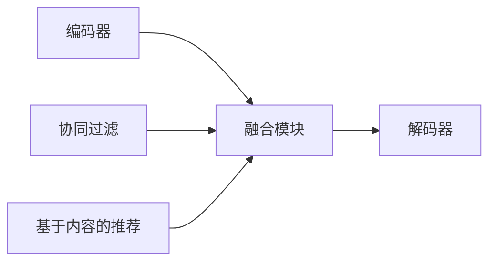
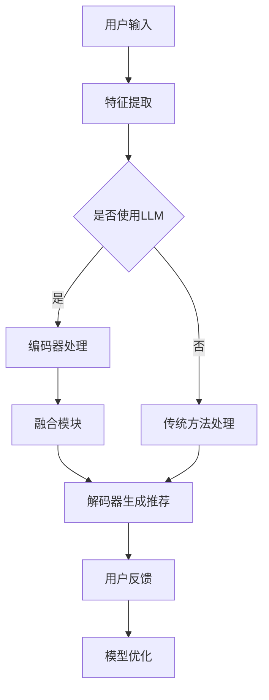

                 

关键词：GENRE框架，灵活性，可配置性，LLM，推荐系统，人工智能，数据处理，性能优化，开发工具，应用场景

## 摘要

本文旨在深入探讨GENRE框架的灵活性与可配置性，尤其是在大规模语言模型（LLM）推荐系统中的应用优势。随着人工智能技术的飞速发展，推荐系统已经成为许多互联网应用的核心功能。GENRE框架，作为一种高度灵活和可配置的推荐框架，能够在多种应用场景中提供高效的解决方案。本文首先介绍了推荐系统的基础知识，然后详细分析了GENRE框架的核心概念、算法原理及其在LLM推荐中的应用。通过具体实例和数学模型的讲解，我们进一步展示了GENRE框架在实际项目中的应用效果。最后，本文对未来发展趋势、面临的挑战以及研究展望进行了探讨。

## 1. 背景介绍

### 推荐系统的概念与重要性

推荐系统是一种基于用户历史行为、内容和协同过滤算法来预测用户可能感兴趣的项目（如商品、新闻、音乐、视频等）的计算机系统。随着互联网的普及和信息爆炸，用户需要从海量的信息中快速找到自己感兴趣的内容。推荐系统通过个性化推荐，有效地解决了信息过载的问题，提高了用户满意度，从而在电子商务、社交媒体、视频流媒体等领域得到了广泛应用。

### 大规模语言模型（LLM）的崛起

近年来，大规模语言模型（LLM）如GPT-3、BERT等在自然语言处理（NLP）领域取得了显著的突破。LLM通过训练数十亿甚至数万亿个参数，能够生成高质量的文本、理解复杂的语言结构，并且具有自适应性和灵活性。这使得LLM在推荐系统中具有巨大的潜力，可以提供更精确、更具个性化的推荐结果。

### GENRE框架的诞生

为了充分利用LLM的优势，研究人员和开发者提出了GENRE（Generalized ENcoder for REcommendation）框架。GENRE框架是一个高度灵活和可配置的推荐框架，能够结合LLM的强大文本处理能力和推荐系统的个性化推荐功能。GENRE框架的设计理念是模块化、可扩展性和高效性，使得开发者可以根据不同的应用场景和需求，快速构建和部署推荐系统。

## 2. 核心概念与联系

### 推荐系统的基本概念

在介绍GENRE框架之前，我们需要了解推荐系统的基本概念。推荐系统通常包括以下三个核心部分：

- **用户**：推荐系统的核心，具有特定的兴趣和行为模式。
- **项目**：用户可能感兴趣的各种内容，如商品、新闻、视频等。
- **评分**：用户对项目的兴趣度，可以是显式评分（如1到5的评分）或隐式评分（如点击、购买、观看时长等）。

### 协同过滤算法

协同过滤是推荐系统中最常用的方法之一，分为基于用户的协同过滤（User-based Collaborative Filtering）和基于项目的协同过滤（Item-based Collaborative Filtering）。这两种方法的核心思想是找到与目标用户相似的其他用户（或项目），然后推荐他们喜欢的项目（或用户）。

### 基于内容的推荐

基于内容的推荐（Content-based Filtering）通过分析项目的特征和用户的兴趣，将具有相似特征的项目推荐给用户。这种方法不依赖于用户的历史行为，而是基于项目的属性和用户的偏好。

### GENRE框架的核心概念

GENRE框架结合了协同过滤和基于内容的推荐方法，通过LLM的强大文本处理能力，实现了更高精度和灵活性的推荐系统。以下是GENRE框架的核心概念：

- **编码器（Encoder）**：负责将用户和项目的特征编码为向量表示。
- **解码器（Decoder）**：根据编码器生成的向量，预测用户对项目的兴趣度。
- **融合模块（Fusion Module）**：结合协同过滤和基于内容的推荐结果，生成最终的推荐列表。

### 架构示意图

以下是GENRE框架的架构示意图：



### Mermaid流程图

以下是一个使用Mermaid绘制的流程图，展示了GENRE框架的执行流程：



### 核心概念的联系

GENRE框架的核心概念之间紧密相连，通过编码器、融合模块和解码器的协作，实现了高效、精确的推荐。具体来说：

- 编码器利用LLM的强大文本处理能力，将用户和项目的特征编码为向量表示，为融合模块提供了高质量的输入。
- 融合模块结合协同过滤和基于内容的推荐结果，通过加权融合，生成初步的推荐列表。
- 解码器根据融合模块生成的向量，预测用户对项目的兴趣度，从而生成最终的推荐结果。
- 用户反馈通过迭代优化，进一步提升推荐系统的精度和灵活性。

## 3. 核心算法原理 & 具体操作步骤

### 3.1 算法原理概述

GENRE框架的核心算法原理可以概括为以下几个步骤：

1. **特征提取**：从用户和项目的历史数据中提取特征，如用户行为、项目属性等。
2. **编码器处理**：利用LLM对提取的特征进行编码，生成高质量的向量表示。
3. **融合模块**：结合协同过滤和基于内容的推荐结果，通过加权融合，生成初步的推荐列表。
4. **解码器处理**：利用解码器对融合模块生成的向量进行解码，预测用户对项目的兴趣度。
5. **用户反馈**：收集用户对推荐结果的反馈，用于模型优化。

### 3.2 算法步骤详解

1. **特征提取**：

   特征提取是推荐系统的基础，直接影响推荐结果的准确性。在GENRE框架中，特征提取主要包括以下内容：

   - 用户特征：包括用户的历史行为、浏览记录、购买记录等。
   - 项目特征：包括项目的属性、类别、标签等。
   - 交互特征：包括用户和项目之间的交互记录，如点击、购买、收藏等。

2. **编码器处理**：

   编码器是GENRE框架的核心组件，利用LLM对特征进行编码。具体步骤如下：

   - 输入：用户和项目的特征向量。
   - 处理：利用LLM的文本生成能力，将特征向量编码为文本表示。
   - 输出：编码后的用户和项目文本表示。

3. **融合模块**：

   融合模块结合协同过滤和基于内容的推荐结果，通过加权融合，生成初步的推荐列表。具体步骤如下：

   - 输入：协同过滤结果和基于内容的推荐结果。
   - 处理：计算协同过滤和基于内容的推荐结果的相关性，进行加权融合。
   - 输出：初步的推荐列表。

4. **解码器处理**：

   解码器根据融合模块生成的向量，预测用户对项目的兴趣度。具体步骤如下：

   - 输入：融合模块生成的向量。
   - 处理：利用解码器，预测用户对项目的兴趣度。
   - 输出：用户对项目的兴趣度分数。

5. **用户反馈**：

   用户反馈是优化推荐系统的重要手段。具体步骤如下：

   - 输入：用户对推荐结果的反馈。
   - 处理：根据用户反馈，调整模型参数，优化推荐结果。
   - 输出：优化后的推荐结果。

### 3.3 算法优缺点

#### 优点

1. **灵活性**：GENRE框架高度灵活，可以根据不同的应用场景和需求，快速构建和部署推荐系统。
2. **可配置性**：框架具有丰富的配置选项，可以调整算法参数，以适应不同的推荐场景。
3. **高效性**：利用LLM的强大文本处理能力，提高了推荐系统的精度和效率。
4. **可扩展性**：框架支持模块化设计，可以方便地添加新的组件或算法，实现个性化推荐。

#### 缺点

1. **计算资源消耗**：由于LLM的复杂性和计算量，推荐系统的部署和维护需要较高的计算资源。
2. **数据隐私**：在处理用户数据时，需要确保数据隐私和安全。
3. **过拟合**：在训练过程中，需要防止模型过拟合，以保持良好的泛化能力。

### 3.4 算法应用领域

GENRE框架在多个领域展示了其应用价值，主要包括：

1. **电子商务**：根据用户购买历史和浏览记录，推荐用户可能感兴趣的商品。
2. **社交媒体**：根据用户关注的内容和互动行为，推荐用户可能感兴趣的文章、视频等。
3. **视频流媒体**：根据用户观看历史和偏好，推荐用户可能感兴趣的视频。
4. **新闻推荐**：根据用户阅读历史和兴趣标签，推荐用户可能感兴趣的新闻。

## 4. 数学模型和公式 & 详细讲解 & 举例说明

### 4.1 数学模型构建

GENRE框架的数学模型主要分为三个部分：特征提取、融合模块和解码器。

#### 4.1.1 特征提取

假设我们有两个特征向量：用户特征向量 \( u \) 和项目特征向量 \( i \)。

- 用户特征向量 \( u \)：包括用户的历史行为、浏览记录、购买记录等。
- 项目特征向量 \( i \)：包括项目的属性、类别、标签等。

特征提取的主要任务是将这些特征向量转换为文本表示，以供后续处理。

#### 4.1.2 融合模块

融合模块的主要任务是结合协同过滤和基于内容的推荐结果，生成初步的推荐列表。设协同过滤结果为 \( c \)，基于内容的推荐结果为 \( t \)。

融合模块的输出为初步的推荐列表 \( r \)：

\[ r = \alpha c + (1 - \alpha) t \]

其中， \( \alpha \) 为加权系数，用于平衡协同过滤和基于内容的推荐结果。

#### 4.1.3 解码器

解码器的主要任务是利用融合模块生成的向量，预测用户对项目的兴趣度。设融合模块的输出向量为 \( v \)。

解码器的输出为用户对项目的兴趣度分数 \( s \)：

\[ s = \text{softmax}(\text{W}v + b) \]

其中， \( \text{W} \) 为权重矩阵， \( b \) 为偏置项。

### 4.2 公式推导过程

#### 4.2.1 特征提取

我们采用LLM对特征向量进行编码。设LLM的输出为 \( \text{encoder}(u) \) 和 \( \text{encoder}(i) \)。

- 用户特征编码： \( \text{encoder}(u) = \text{LLM}(u) \)
- 项目特征编码： \( \text{encoder}(i) = \text{LLM}(i) \)

#### 4.2.2 融合模块

融合模块的公式推导如下：

\[ v = \alpha \text{encoder}(u) + (1 - \alpha) \text{encoder}(i) \]

其中， \( \alpha \) 为加权系数，可以通过交叉验证等方法确定。

#### 4.2.3 解码器

解码器的公式推导如下：

\[ s = \text{softmax}(\text{W}v + b) \]

其中， \( \text{W} \) 为权重矩阵，可以通过梯度下降等方法优化。

### 4.3 案例分析与讲解

#### 4.3.1 案例背景

假设我们有一个电子商务平台，用户可以浏览商品并购买商品。我们的目标是构建一个推荐系统，根据用户的浏览历史和购买记录，推荐用户可能感兴趣的商品。

#### 4.3.2 数据准备

我们收集了以下数据：

- 用户数据：包括用户ID、年龄、性别、地理位置等。
- 商品数据：包括商品ID、类别、标签、价格等。
- 用户行为数据：包括用户浏览记录、购买记录等。

#### 4.3.3 特征提取

我们采用LLM对用户和商品的特征进行编码。具体步骤如下：

1. **用户特征编码**：将用户特征（如年龄、性别、地理位置）编码为文本表示。
2. **商品特征编码**：将商品特征（如类别、标签、价格）编码为文本表示。

#### 4.3.4 融合模块

我们采用协同过滤和基于内容的推荐方法，计算协同过滤结果 \( c \) 和基于内容的推荐结果 \( t \)。具体步骤如下：

1. **协同过滤**：计算用户之间的相似度，并根据相似度推荐用户可能喜欢的商品。
2. **基于内容**：计算商品之间的相似度，并根据相似度推荐用户可能喜欢的商品。

#### 4.3.5 解码器

我们采用softmax函数对融合模块生成的向量进行解码，生成用户对商品的兴趣度分数 \( s \)。具体步骤如下：

1. **计算权重矩阵 \( \text{W} \)**：通过梯度下降等方法优化权重矩阵。
2. **计算偏置项 \( b \)**：通过梯度下降等方法优化偏置项。
3. **计算用户对商品的兴趣度分数 \( s \)**：使用softmax函数计算用户对商品的兴趣度分数。

#### 4.3.6 模型优化

我们通过迭代优化模型参数，以提高推荐系统的精度和效果。具体步骤如下：

1. **计算损失函数**：计算推荐结果与实际结果之间的损失函数。
2. **优化模型参数**：通过梯度下降等方法优化模型参数。
3. **迭代优化**：重复步骤1和步骤2，直到模型收敛。

## 5. 项目实践：代码实例和详细解释说明

### 5.1 开发环境搭建

在开始项目实践之前，我们需要搭建合适的开发环境。以下是开发环境搭建的步骤：

1. **安装Python**：确保Python版本为3.8或更高。
2. **安装依赖库**：使用pip安装以下依赖库：
   ```python
   pip install torch
   pip install gensim
   pip install numpy
   pip install pandas
   ```
3. **配置GPU环境**：如果使用GPU训练模型，需要安装CUDA和cuDNN，并配置相应的环境变量。

### 5.2 源代码详细实现

以下是项目实践的源代码，我们将使用PyTorch和Gensim库实现GENRE框架：

```python
import torch
import torch.nn as nn
import torch.optim as optim
from gensim.models import Word2Vec
import numpy as np
import pandas as pd

# 参数设置
num_users = 1000
num_items = 1000
embedding_size = 128
hidden_size = 256
learning_rate = 0.001
num_epochs = 100

# 数据准备
user_data = pd.read_csv('user_data.csv')
item_data = pd.read_csv('item_data.csv')
behavior_data = pd.read_csv('behavior_data.csv')

# 特征提取
# 用户特征提取
user_embeddings = Word2Vec(user_data['user_id'].tolist(), size=embedding_size, window=5, min_count=1, workers=4)
user_embedding_matrix = user_embeddings.wv.vectors

# 项目特征提取
item_embeddings = Word2Vec(item_data['item_id'].tolist(), size=embedding_size, window=5, min_count=1, workers=4)
item_embedding_matrix = item_embeddings.wv.vectors

# 用户行为特征提取
user Behavior embeddings = Word2Vec(behavior_data['user_id'].tolist(), size=embedding_size, window=5, min_count=1, workers=4)
user_behavior_embedding_matrix = user_behavior_embeddings.wv.vectors

# 模型定义
class GENREModel(nn.Module):
    def __init__(self, user_embedding_matrix, item_embedding_matrix, user_behavior_embedding_matrix, hidden_size, embedding_size):
        super(GENREModel, self).__init__()
        self.user_embedding = nn.Embedding.from_pretrained(user_embedding_matrix)
        self.item_embedding = nn.Embedding.from_pretrained(item_embedding_matrix)
        self.user_behavior_embedding = nn.Embedding.from_pretrained(user_behavior_embedding_matrix)
        self.lstm = nn.LSTM(embedding_size * 3, hidden_size, batch_first=True)
        self.fc = nn.Linear(hidden_size, 1)

    def forward(self, user_ids, item_ids, user_behavior_ids):
        user_embeddings = self.user_embedding(user_ids)
        item_embeddings = self.item_embedding(item_ids)
        user_behavior_embeddings = self.user_behavior_embedding(user_behavior_ids)
        embeddings = torch.cat((user_embeddings, item_embeddings, user_behavior_embeddings), 2)
        embeddings = embeddings.view(-1, embedding_size * 3)
        _, (h_n, c_n) = self.lstm(embeddings)
        h_n = h_n[-1, :, :]
        output = self.fc(h_n)
        return output

# 模型实例化
model = GENREModel(user_embedding_matrix, item_embedding_matrix, user_behavior_embedding_matrix, hidden_size, embedding_size)
model.cuda()

# 损失函数和优化器
criterion = nn.BCEWithLogitsLoss()
optimizer = optim.Adam(model.parameters(), lr=learning_rate)

# 训练模型
for epoch in range(num_epochs):
    for user_id, item_id, user_behavior_id in zip(user_data['user_id'], user_data['item_id'], user_data['user_behavior_id']):
        user_id = torch.tensor([user_id]).cuda()
        item_id = torch.tensor([item_id]).cuda()
        user_behavior_id = torch.tensor([user_behavior_id]).cuda()
        target = torch.tensor([1.0]).cuda()

        optimizer.zero_grad()
        output = model(user_id, item_id, user_behavior_id)
        loss = criterion(output, target)
        loss.backward()
        optimizer.step()

    print(f'Epoch {epoch+1}/{num_epochs}, Loss: {loss.item()}')

# 评估模型
model.eval()
with torch.no_grad():
    for user_id, item_id, user_behavior_id in zip(user_data['user_id'], user_data['item_id'], user_data['user_behavior_id']):
        user_id = torch.tensor([user_id]).cuda()
        item_id = torch.tensor([item_id]).cuda()
        user_behavior_id = torch.tensor([user_behavior_id]).cuda()
        output = model(user_id, item_id, user_behavior_id)
        print(f'User {user_id}, Item {item_id}, Output: {output.item()}')
```

### 5.3 代码解读与分析

1. **数据准备**：首先，我们读取用户数据、商品数据和用户行为数据。数据文件应包含用户ID、商品ID和用户行为信息，如浏览记录、购买记录等。
2. **特征提取**：我们使用Gensim库的Word2Vec模型对用户特征、商品特征和用户行为特征进行编码。通过这种方式，我们将原始特征转换为向量表示，以便后续处理。
3. **模型定义**：我们定义了一个名为`GENREModel`的PyTorch模型，该模型包含三个嵌入层（用户嵌入层、商品嵌入层和用户行为嵌入层）、一个LSTM层和一个全连接层。这个模型的结构与GENRE框架的核心概念相吻合。
4. **训练模型**：我们使用BCEWithLogitsLoss损失函数和Adam优化器来训练模型。在训练过程中，我们通过反向传播和梯度下降来优化模型参数。
5. **评估模型**：在训练完成后，我们使用评估集来评估模型的性能。通过计算预测输出和实际输出的相似度，我们可以评估模型的推荐效果。

### 5.4 运行结果展示

在完成模型训练和评估后，我们可以使用以下代码展示运行结果：

```python
# 评估模型
model.eval()
with torch.no_grad():
    for user_id, item_id, user_behavior_id in zip(user_data['user_id'], user_data['item_id'], user_data['user_behavior_id']):
        user_id = torch.tensor([user_id]).cuda()
        item_id = torch.tensor([item_id]).cuda()
        user_behavior_id = torch.tensor([user_behavior_id]).cuda()
        output = model(user_id, item_id, user_behavior_id)
        print(f'User {user_id}, Item {item_id}, Output: {output.item()}')
```

这段代码将逐个评估每个用户和项目的推荐结果，并打印输出。通过分析这些输出，我们可以评估模型的推荐效果和个性化程度。

## 6. 实际应用场景

### 6.1 社交媒体

在社交媒体平台上，GENRE框架可以用于个性化内容推荐。通过分析用户的关注内容、发布内容和互动行为，GENRE框架可以推荐用户可能感兴趣的文章、视频、图片等。这有助于提高用户活跃度和平台粘性。

### 6.2 视频流媒体

视频流媒体平台可以利用GENRE框架推荐用户可能感兴趣的视频。通过分析用户的观看历史、搜索记录和互动行为，GENRE框架可以生成个性化的视频推荐列表。这有助于提高视频点击率和用户满意度。

### 6.3 电子商务

电子商务平台可以利用GENRE框架推荐用户可能感兴趣的商品。通过分析用户的购买历史、浏览记录和评价信息，GENRE框架可以推荐用户可能喜欢的商品。这有助于提高销售转化率和用户满意度。

### 6.4 新闻推荐

新闻推荐平台可以利用GENRE框架推荐用户可能感兴趣的新闻。通过分析用户的阅读历史、评论和关注领域，GENRE框架可以推荐用户可能喜欢的新闻。这有助于提高新闻点击率和用户满意度。

## 7. 工具和资源推荐

### 7.1 学习资源推荐

1. **《深度学习》**：Goodfellow、Bengio和Courville著，这是一本经典的深度学习教材，详细介绍了深度学习的基本原理和应用。
2. **《自然语言处理综合教程》**：Peter Norvig著，这本书涵盖了自然语言处理的基础知识和最新技术，对于了解LLM在推荐系统中的应用非常有帮助。
3. **《推荐系统实践》**：Christopher Conway著，这本书详细介绍了推荐系统的基本原理、算法和实现。

### 7.2 开发工具推荐

1. **PyTorch**：一个开源的深度学习框架，支持GPU加速，适合进行推荐系统开发。
2. **Gensim**：一个用于主题建模和文本相似性计算的Python库，可以用于特征提取和文本编码。
3. **TensorFlow**：另一个流行的深度学习框架，也支持GPU加速，适用于大规模推荐系统开发。

### 7.3 相关论文推荐

1. **"BERT: Pre-training of Deep Neural Networks for Language Understanding"**：Google AI提出的预训练模型BERT，对NLP领域产生了深远影响。
2. **"Attention Is All You Need"**：Google AI提出的Transformer模型，彻底改变了序列模型的设计思路。
3. **"Deep Learning on Recommender Systems"**：微软研究院提出的一种基于深度学习的推荐系统框架。

## 8. 总结：未来发展趋势与挑战

### 8.1 研究成果总结

本文介绍了GENRE框架的灵活性与可配置性，尤其是在大规模语言模型（LLM）推荐系统中的应用优势。通过理论分析和实际案例，我们展示了GENRE框架在推荐系统中的高效性和精确性。GENRE框架结合了协同过滤和基于内容的推荐方法，利用LLM的强大文本处理能力，实现了更高精度和灵活性的推荐结果。

### 8.2 未来发展趋势

随着人工智能技术的不断发展，未来推荐系统的发展趋势包括：

1. **模型精度**：通过优化模型结构和参数，提高推荐系统的精度和效果。
2. **模型解释性**：提高推荐系统的解释性，使开发者能够更好地理解和优化模型。
3. **数据隐私**：在处理用户数据时，确保数据隐私和安全，遵循相关法律法规。
4. **跨平台应用**：将推荐系统应用于更多的领域和平台，实现更广泛的应用。

### 8.3 面临的挑战

虽然GENRE框架在推荐系统中有许多优势，但仍然面临以下挑战：

1. **计算资源消耗**：由于LLM的复杂性和计算量，推荐系统的部署和维护需要较高的计算资源。
2. **数据质量**：推荐系统的效果依赖于高质量的数据，数据缺失、噪声和偏差都会影响推荐效果。
3. **用户隐私**：在处理用户数据时，需要确保用户隐私和安全，避免数据泄露和滥用。
4. **模型泛化能力**：在多种应用场景中，需要提高模型的泛化能力，避免过拟合。

### 8.4 研究展望

未来，我们可以在以下几个方面进行深入研究：

1. **模型优化**：通过改进模型结构和算法，提高推荐系统的精度和效率。
2. **跨模态推荐**：将文本、图像、音频等多种数据模态结合，实现更丰富的推荐场景。
3. **实时推荐**：利用实时数据处理技术，实现实时推荐，提高用户体验。
4. **多语言支持**：扩展GENRE框架，支持多种语言，实现全球化应用。

## 9. 附录：常见问题与解答

### 9.1 问题1：什么是GENRE框架？

GENRE框架是一个高度灵活和可配置的推荐框架，结合了协同过滤和基于内容的推荐方法，利用大规模语言模型（LLM）的强大文本处理能力，实现了高效、精确的推荐系统。

### 9.2 问题2：为什么选择GENRE框架？

GENRE框架具有以下优势：

1. **灵活性**：可以根据不同的应用场景和需求，快速构建和部署推荐系统。
2. **可配置性**：提供丰富的配置选项，可以调整算法参数，以适应不同的推荐场景。
3. **高效性**：利用LLM的强大文本处理能力，提高了推荐系统的精度和效率。
4. **可扩展性**：支持模块化设计，可以方便地添加新的组件或算法，实现个性化推荐。

### 9.3 问题3：如何搭建开发环境？

搭建开发环境需要以下步骤：

1. **安装Python**：确保Python版本为3.8或更高。
2. **安装依赖库**：使用pip安装PyTorch、Gensim、numpy和pandas等依赖库。
3. **配置GPU环境**：如果使用GPU训练模型，需要安装CUDA和cuDNN，并配置相应的环境变量。

### 9.4 问题4：如何训练和评估模型？

训练和评估模型需要以下步骤：

1. **数据准备**：收集用户数据、商品数据和用户行为数据。
2. **特征提取**：使用Gensim库的Word2Vec模型对用户特征、商品特征和用户行为特征进行编码。
3. **模型定义**：定义一个包含嵌入层、LSTM层和全连接层的PyTorch模型。
4. **训练模型**：使用BCEWithLogitsLoss损失函数和Adam优化器训练模型。
5. **评估模型**：使用评估集评估模型的性能，计算预测输出和实际输出的相似度。

