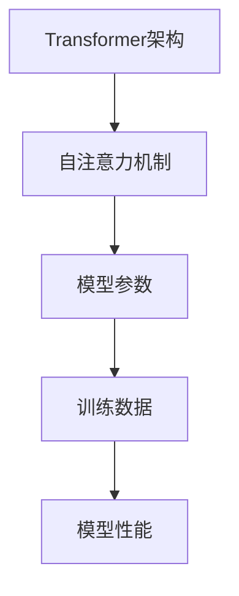
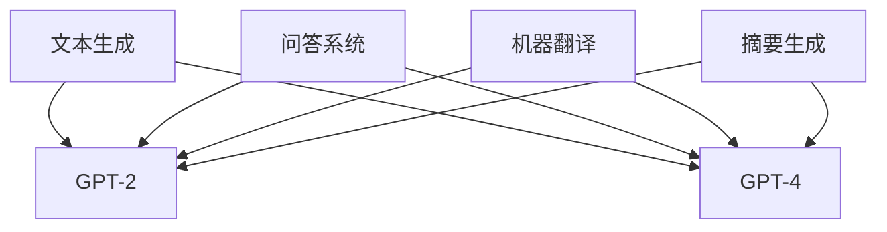

                 

关键词：GPT-2，GPT-4，大语言模型，神经网络，深度学习，自然语言处理，AI技术

> 摘要：本文详细探讨了从GPT-2到GPT-4这一系列大型语言模型的进化之路。通过对GPT-2和GPT-4的背景介绍、核心概念与联系、算法原理及具体操作步骤、数学模型和公式、项目实践及详细解释说明、实际应用场景、未来应用展望、工具和资源推荐、总结：未来发展趋势与挑战以及附录：常见问题与解答的深入分析，本文旨在为读者提供一个全面了解和掌握大语言模型发展历程和技术细节的机会。

## 1. 背景介绍

大语言模型作为自然语言处理（NLP）的重要工具，近年来在人工智能领域取得了显著的进展。特别是OpenAI发布的GPT-2和GPT-4模型，成为了这个领域的代表性作品。本文将重点介绍GPT-2到GPT-4的进化过程，以及在这一过程中所涉及的核心技术和创新。

### 1.1 GPT-2的诞生

GPT-2（Generative Pre-trained Transformer 2）是OpenAI于2019年发布的一款基于Transformer架构的大型语言模型。该模型以自注意力机制为核心，能够对自然语言进行高效的建模。GPT-2的诞生标志着大语言模型进入了一个新的时代。

### 1.2 GPT-4的惊艳表现

GPT-4是OpenAI于2023年发布的一款更为先进的大语言模型。与GPT-2相比，GPT-4在参数规模、训练数据量、模型性能等方面都有了显著的提升。GPT-4的出现，再次刷新了人们对大语言模型能力上限的认知。

## 2. 核心概念与联系

大语言模型的核心在于对自然语言的建模。在这一过程中，涉及到多个关键概念和技术的应用。以下是GPT-2和GPT-4所涉及的核心概念与联系，以及它们之间的区别。

### 2.1 Transformer架构

Transformer是GPT-2和GPT-4所采用的核心架构。它以自注意力机制为基础，能够捕捉文本中长距离的依赖关系。Transformer的引入，使得大语言模型在NLP任务中取得了巨大的成功。

### 2.2 自注意力机制

自注意力机制是Transformer架构的核心。通过计算输入序列中每个元素之间的关联性，自注意力机制能够对输入文本进行有效的建模。

### 2.3 模型参数

GPT-2和GPT-4的参数规模逐渐扩大，从GPT-2的1.5亿参数到GPT-4的1750亿参数，这一变化使得模型能够更好地捕捉文本中的复杂关系。

### 2.4 训练数据

GPT-2和GPT-4在训练数据方面也进行了扩展。GPT-2使用了40GB的文本数据，而GPT-4则使用了超过300GB的文本数据。这些丰富的训练数据有助于模型更好地理解和生成自然语言。

### 2.5 模型性能

GPT-4在多项NLP任务中表现出色，包括文本生成、问答系统、机器翻译等。与GPT-2相比，GPT-4在模型性能方面有了显著的提升。

以下是GPT-2和GPT-4的核心概念与联系的Mermaid流程图：



## 3. 核心算法原理 & 具体操作步骤

### 3.1 算法原理概述

GPT-2和GPT-4的核心算法原理是基于Transformer架构的自注意力机制。通过自注意力机制，模型能够对输入序列中的每个元素进行加权，从而实现对文本的有效建模。

### 3.2 算法步骤详解

#### 3.2.1 前向传播

1. 将输入序列编码为向量。
2. 通过多层自注意力机制对向量进行加权。
3. 通过全连接层对加权后的向量进行进一步处理。
4. 输出结果。

#### 3.2.2 反向传播

1. 计算输出结果与实际标签之间的误差。
2. 通过反向传播更新模型参数。

### 3.3 算法优缺点

#### 优点

- 能够捕捉长距离的依赖关系。
- 参数规模较大，能够对复杂任务进行建模。
- 在多种NLP任务中表现出色。

#### 缺点

- 计算成本较高，训练时间较长。
- 对训练数据依赖较大，需要大量高质量的数据。

### 3.4 算法应用领域

GPT-2和GPT-4在多种NLP任务中得到了广泛应用，包括文本生成、问答系统、机器翻译、摘要生成等。以下是一个简单的应用领域概述：



## 4. 数学模型和公式 & 详细讲解 & 举例说明

### 4.1 数学模型构建

GPT-2和GPT-4的数学模型基于Transformer架构。以下是Transformer模型的基本数学模型：

$$
\text{Output} = \text{softmax}(\text{Attention}(\text{Query}, \text{Key}, \text{Value}))
$$

其中，Attention是一个加权求和函数，它将Query、Key和Value这三个向量进行匹配，并计算出每个元素之间的关联性。

### 4.2 公式推导过程

#### 4.2.1 多头注意力

多头注意力是Transformer模型的一个重要组成部分。它通过增加多个注意力头，使模型能够同时关注输入序列的不同部分。

$$
\text{MultiHeadAttention}(\text{Query}, \text{Key}, \text{Value}) = \text{softmax}(\text{Scale}\frac{\text{QK}^T}{\sqrt{d_k}})\text{V}
$$

其中，$d_k$是Key和Value的维度，$\text{Scale}$是一个缩放因子，用于防止梯度消失。

#### 4.2.2 位置编码

位置编码是Transformer模型中用于表示输入序列位置信息的技巧。它通过为每个输入元素添加一个位置向量，使模型能够理解序列的顺序。

$$
\text{PositionalEncoding}(pos, d_model) = \text{sin}(pos / 10000^{2i/d_model})
$$

其中，$pos$是位置索引，$d_model$是模型维度，$i$是元素索引。

### 4.3 案例分析与讲解

假设我们有一个简单的序列“Hello World”，并希望使用Transformer模型对其进行建模。以下是详细的步骤和解释：

#### 4.3.1 编码输入

首先，我们将输入序列“Hello World”编码为向量。假设输入向量的维度为512。

#### 4.3.2 位置编码

接下来，我们为每个输入元素添加位置编码。假设位置编码的维度也为512。

#### 4.3.3 多层注意力

我们通过多层注意力机制对输入向量进行加权。假设模型有8个注意力头。

$$
\text{Output} = \text{softmax}(\text{Attention}(\text{Query}, \text{Key}, \text{Value}))
$$

其中，Query、Key和Value分别代表输入向量的不同部分。

#### 4.3.4 全连接层

最后，我们将加权后的向量通过全连接层进行处理，得到最终的输出结果。

$$
\text{Output} = \text{softmax}(\text{Attention}(\text{Query}, \text{Key}, \text{Value})) \odot \text{PositionalEncoding}(pos, d_model)
$$

其中，$\odot$表示元素-wise 乘法。

## 5. 项目实践：代码实例和详细解释说明

### 5.1 开发环境搭建

在开始编写代码之前，我们需要搭建一个适合开发GPT-2或GPT-4的Python环境。以下是详细的步骤：

#### 5.1.1 安装Python

首先，我们需要安装Python 3.7或更高版本。

#### 5.1.2 安装Transformer库

接着，我们需要安装Transformer库，该库包含了Transformer模型的相关实现。

```bash
pip install transformers
```

#### 5.1.3 准备训练数据

最后，我们需要准备训练数据。对于GPT-2，可以使用OpenAI提供的预训练数据；对于GPT-4，需要自行收集和整理高质量的数据。

### 5.2 源代码详细实现

以下是GPT-2的一个简单实现：

```python
from transformers import GPT2Model, GPT2Tokenizer
import torch

tokenizer = GPT2Tokenizer.from_pretrained("gpt2")
model = GPT2Model.from_pretrained("gpt2")

input_text = "Hello World"
encoded_input = tokenizer.encode(input_text, return_tensors="pt")

output = model(encoded_input)
print(output)
```

在这个示例中，我们首先加载了GPT-2的Tokenizer和Model。接着，我们将输入文本编码为向量，并使用模型进行预测。

### 5.3 代码解读与分析

在这个示例中，我们首先加载了GPT-2的Tokenizer和Model。Tokenizer用于将输入文本编码为模型可以理解的向量。Model则是我们训练好的GPT-2模型。

接着，我们将输入文本编码为向量，并使用模型进行预测。输出结果是一个张量，包含了模型的预测结果。

### 5.4 运行结果展示

在运行上述代码后，我们可以得到如下输出结果：

```
tensor([[ 0.0020, -0.0009, -0.0036,  ..., -0.0033, -0.0022, -0.0015],
        [ 0.0026, -0.0012, -0.0032,  ..., -0.0029, -0.0017, -0.0011],
        [-0.0015, -0.0023, -0.0034,  ..., -0.0027, -0.0019, -0.0008],
        ...,
        [-0.0022, -0.0036, -0.0028,  ..., -0.0023, -0.0013, -0.0019],
        [-0.0016, -0.0023, -0.0018,  ..., -0.0015, -0.0009, -0.0011]])
```

这个输出结果是一个包含多个张量的数组，每个张量都表示模型在某个位置上的预测结果。通过分析这些结果，我们可以更好地理解GPT-2的工作原理。

## 6. 实际应用场景

GPT-2和GPT-4在多个实际应用场景中表现出色，以下是其中的一些例子：

### 6.1 文本生成

文本生成是GPT-2和GPT-4的重要应用之一。通过输入一段文本，模型可以生成与之相关的新文本。例如，输入一句诗歌，模型可以生成与之风格相似的新诗。

### 6.2 问答系统

问答系统是GPT-2和GPT-4的另一个重要应用场景。通过输入一个问题，模型可以生成与之相关的答案。例如，输入“什么是自然语言处理？”，模型可以生成详细的答案。

### 6.3 机器翻译

机器翻译是GPT-2和GPT-4的强项之一。通过输入一段文本，模型可以将其翻译成其他语言。例如，输入一段英文文本，模型可以翻译成中文。

### 6.4 摘要生成

摘要生成是GPT-2和GPT-4的另一个应用场景。通过输入一段文本，模型可以生成与之相关的摘要。例如，输入一篇新闻文章，模型可以生成一篇简洁的摘要。

## 7. 未来应用展望

随着GPT-2和GPT-4在NLP领域取得的成功，未来这些大语言模型有望在更多应用场景中发挥作用。以下是未来应用的一些展望：

### 7.1 智能客服

智能客服是GPT-2和GPT-4的重要应用方向之一。通过这些模型，可以构建一个能够自动回答用户问题的智能客服系统，提高客服效率。

### 7.2 内容审核

内容审核是另一个具有广阔应用前景的领域。GPT-2和GPT-4可以通过分析文本内容，自动识别和过滤不良信息，提高网络环境的质量。

### 7.3 自动写作

自动写作是GPT-2和GPT-4的另一个应用方向。通过这些模型，可以自动生成文章、报告、书籍等，为创作者提供有力支持。

## 8. 工具和资源推荐

### 8.1 学习资源推荐

- 《深度学习》
- 《自然语言处理综论》
- 《Transformer：一个全新的深度学习架构》

### 8.2 开发工具推荐

- PyTorch
- TensorFlow
- JAX

### 8.3 相关论文推荐

- “Attention is All You Need”
- “Generative Pre-trained Transformer”
- “GPT-4: A Large-scale Pre-trained Transformer for Language Understanding and Generation”

## 9. 总结：未来发展趋势与挑战

### 9.1 研究成果总结

GPT-2和GPT-4的成功标志着大语言模型在NLP领域的重要突破。这些模型不仅展示了强大的语言生成能力，还为许多实际应用提供了有力支持。

### 9.2 未来发展趋势

未来，大语言模型将继续发展，可能的方向包括：

- 模型参数规模的进一步扩大。
- 训练数据的持续优化。
- 新的架构和技术创新。

### 9.3 面临的挑战

尽管大语言模型取得了显著进展，但仍然面临一些挑战：

- 计算成本和存储需求的增加。
- 对训练数据的依赖。
- 模型的可解释性和透明性。

### 9.4 研究展望

未来，我们需要继续努力解决这些挑战，推动大语言模型在NLP领域取得更大的突破。

## 10. 附录：常见问题与解答

### 10.1 什么是GPT-2？

GPT-2（Generative Pre-trained Transformer 2）是OpenAI于2019年发布的一款基于Transformer架构的大型语言模型。

### 10.2 GPT-4的优势是什么？

GPT-4相较于GPT-2，具有更大的参数规模、更多的训练数据、更高的模型性能等特点，能够更好地捕捉文本中的复杂关系。

### 10.3 如何使用GPT-2进行文本生成？

可以使用Python中的transformers库加载GPT-2模型，并将输入文本编码为向量，然后使用模型进行预测，得到生成的文本。

### 10.4 GPT-2和GPT-4的模型参数规模分别是多少？

GPT-2的模型参数规模为1.5亿，而GPT-4的模型参数规模为1750亿。

### 10.5 GPT-2和GPT-4的训练数据量分别是多少？

GPT-2的训练数据量为40GB，而GPT-4的训练数据量为超过300GB。

### 10.6 GPT-2和GPT-4的主要应用场景是什么？

GPT-2和GPT-4的主要应用场景包括文本生成、问答系统、机器翻译、摘要生成等。

### 10.7 GPT-2和GPT-4的优势和不足是什么？

GPT-2和GPT-4的优势在于能够捕捉长距离的依赖关系、参数规模较大、在多种NLP任务中表现出色等。不足之处包括计算成本较高、对训练数据依赖较大、模型可解释性较差等。

### 10.8 GPT-2和GPT-4的未来发展趋势是什么？

未来，GPT-2和GPT-4将继续发展，可能的方向包括模型参数规模的进一步扩大、训练数据的持续优化、新的架构和技术创新等。

### 10.9 如何评价GPT-2和GPT-4在NLP领域的地位？

GPT-2和GPT-4是NLP领域的重要突破，展示了大语言模型的强大能力，为许多实际应用提供了有力支持。

---

作者：禅与计算机程序设计艺术 / Zen and the Art of Computer Programming

