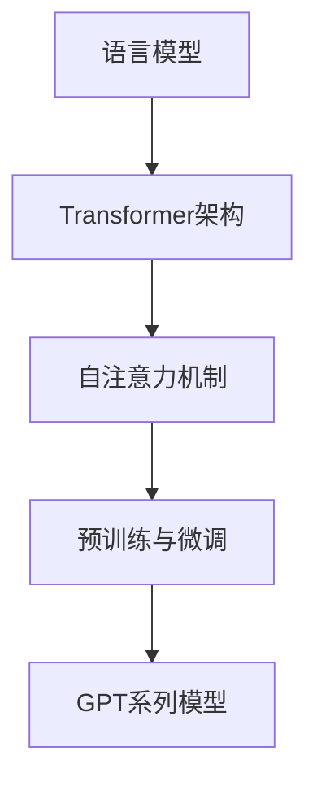

                 

关键词：GPT系列，人工智能，自然语言处理，深度学习，语言模型，神经网络

> 摘要：本文将深入探讨GPT系列模型的发展历程，从GPT-1到GPT-4的技术飞跃，详细分析其核心概念、算法原理、数学模型以及实际应用场景。本文旨在为读者提供一份全面的技术指南，帮助理解GPT系列模型在自然语言处理领域的突破性进展。

## 1. 背景介绍

自然语言处理（NLP）是人工智能（AI）的重要分支之一，它旨在使计算机能够理解、生成和处理人类语言。随着深度学习技术的不断发展，NLP领域取得了显著进展。语言模型作为NLP的核心技术之一，近年来在人工智能领域引发了广泛关注。GPT（Generative Pre-trained Transformer）系列模型是这一领域的重要代表，从GPT-1到GPT-4，每一代模型都带来了技术的飞跃。

GPT-1是OpenAI在2018年推出的一款基于Transformer架构的预训练语言模型，它的成功激发了后续版本的发展。GPT-2进一步扩展了模型的规模和预训练数据集，取得了更好的性能。GPT-3则实现了前所未有的模型规模，展示了在多种语言任务上的强大能力。最终，GPT-4在2023年发布，成为目前最先进的自然语言处理模型，不仅在语言生成、理解和推理方面表现卓越，还展示了在多模态任务上的潜力。

本文将详细分析GPT系列模型的发展历程，探讨其核心概念、算法原理、数学模型以及实际应用场景，为读者提供一份全面的技术指南。

## 2. 核心概念与联系

### 2.1. 语言模型

语言模型（Language Model）是自然语言处理中的基本工具，它旨在预测一个单词序列的概率分布。在NLP任务中，语言模型通常用于文本生成、机器翻译、问答系统等。

语言模型可以分为两种类型：基于规则的模型和统计模型。基于规则的模型通过语法规则和词典来预测单词的概率，而统计模型则通过大量文本数据学习单词和短语的统计规律。

### 2.2. Transformer架构

Transformer是Google在2017年提出的一种全新的神经网络架构，用于处理序列数据，如自然语言。与传统的循环神经网络（RNN）不同，Transformer采用了自注意力机制（Self-Attention），能够在处理序列数据时同时关注全局信息，从而提高了模型的效率和性能。

### 2.3. 自注意力机制

自注意力机制（Self-Attention）是Transformer架构的核心组件。它允许模型在处理序列数据时，根据序列中每个单词的重要性来动态调整其权重，从而关注全局信息。

自注意力机制分为点积注意力（Scaled Dot-Product Attention）和多头注意力（Multi-Head Attention）。点积注意力通过计算输入序列中每个词与其他词的点积来生成权重，而多头注意力则将输入序列分成多个子序列，分别应用点积注意力，最后将结果合并。

### 2.4. 预训练与微调

预训练（Pre-training）是一种在大型语料库上进行训练的方法，使模型能够学习到语言的通用特征。在预训练过程中，模型通常通过无监督的任务，如语言建模和掩码语言建模（Masked Language Model，MLM），来学习单词和短语的分布。

微调（Fine-tuning）是在预训练的基础上，针对特定任务进行进一步训练的方法。通过微调，模型能够适应特定的任务需求，从而提高性能。

### 2.5. Mermaid流程图

以下是一个简化的Mermaid流程图，展示了GPT系列模型的核心概念和联系：



## 3. 核心算法原理 & 具体操作步骤

### 3.1. 算法原理概述

GPT系列模型的核心算法是基于Transformer架构，特别是多头自注意力机制（Multi-Head Self-Attention）。该机制通过将输入序列中的每个词与其他词进行关联，从而学习到全局信息。

在训练过程中，GPT系列模型通过无监督的任务，如语言建模和掩码语言建模（MLM），来学习单词和短语的分布。语言建模的目标是预测下一个单词的概率，而掩码语言建模的目标是预测被掩码的单词。

在生成文本时，GPT系列模型从特定种子序列开始，通过自注意力机制和前馈神经网络，逐步生成新的单词，直到满足终止条件。

### 3.2. 算法步骤详解

#### 3.2.1. 预训练阶段

1. **数据准备**：从互联网上收集大量文本数据，如维基百科、新闻文章、社交媒体等。
2. **数据预处理**：对文本数据进行清洗和预处理，如去除标点符号、统一单词大小写、分词等。
3. **构建词汇表**：将预处理后的文本数据构建成词汇表，将单词映射为唯一的索引。
4. **掩码语言建模（MLM）**：随机掩码输入序列中的一部分单词，并预测被掩码的单词。这有助于模型学习到单词之间的关系。
5. **训练语言模型**：通过梯度下降和反向传播算法，对模型参数进行优化。

#### 3.2.2. 生成文本阶段

1. **初始化种子序列**：从预定义的种子序列开始，如一个单词或一句话。
2. **自注意力计算**：计算种子序列中每个词与其他词的点积，生成权重矩阵。
3. **多头注意力**：将输入序列分成多个子序列，分别应用点积注意力，并合并结果。
4. **前馈神经网络**：对多头注意力结果进行前馈神经网络处理。
5. **软最大化**：对模型输出的概率分布进行软最大化，选择概率最大的单词作为下一个单词。
6. **重复步骤2-5**：重复上述步骤，生成新的单词，直到满足终止条件。

### 3.3. 算法优缺点

#### 优点

- **全局信息关注**：自注意力机制允许模型在处理序列数据时关注全局信息，从而提高了模型的效率和性能。
- **并行计算**：Transformer架构支持并行计算，使其在处理大规模数据时具有优势。
- **灵活性**：通过调整模型参数，GPT系列模型可以适应不同的NLP任务。

#### 缺点

- **计算成本高**：自注意力机制的计算成本较高，尤其是在处理大规模数据时。
- **内存占用大**：Transformer模型在处理序列数据时需要大量内存，这对硬件设备提出了较高的要求。

### 3.4. 算法应用领域

GPT系列模型在自然语言处理领域具有广泛的应用。以下是一些典型的应用场景：

- **文本生成**：GPT系列模型可以生成高质量的自然语言文本，如文章、故事、对话等。
- **机器翻译**：GPT系列模型可以用于机器翻译任务，将一种语言的文本翻译成另一种语言。
- **问答系统**：GPT系列模型可以用于问答系统，根据用户提问生成相关回答。
- **情感分析**：GPT系列模型可以用于情感分析任务，判断文本的情感倾向。

## 4. 数学模型和公式 & 详细讲解 & 举例说明

### 4.1. 数学模型构建

GPT系列模型基于Transformer架构，其核心组件是多头自注意力机制。以下是一个简化的数学模型，用于描述自注意力机制：

$$
\text{Attention}(Q, K, V) = \text{softmax}\left(\frac{QK^T}{\sqrt{d_k}}\right)V
$$

其中，$Q$、$K$ 和 $V$ 分别是查询（Query）、键（Key）和值（Value）向量的集合，$d_k$ 是键向量的维度。

### 4.2. 公式推导过程

自注意力机制的推导过程如下：

1. **点积注意力**：首先计算查询向量 $Q$ 与键向量 $K$ 的点积，得到注意力得分。
$$
\text{Score}(Q, K) = QK^T
$$

2. **缩放因子**：为了防止注意力权重过大或过小，通常对点积结果进行缩放，即除以 $\sqrt{d_k}$。
$$
\text{Scaled Score}(Q, K) = \frac{QK^T}{\sqrt{d_k}}
$$

3. **softmax函数**：将缩放后的点积得分进行softmax操作，得到注意力权重。
$$
\text{Attention}(Q, K, V) = \text{softmax}\left(\frac{QK^T}{\sqrt{d_k}}\right)V
$$

4. **加权求和**：将注意力权重与值向量 $V$ 进行加权求和，得到最终的自注意力输出。

### 4.3. 案例分析与讲解

假设有一个输入序列 $[w_1, w_2, w_3]$，我们将其表示为向量形式：
$$
\text{Input} = [w_1, w_2, w_3] = \begin{bmatrix} 1 & 0 & 1 \\ 1 & 1 & 0 \\ 0 & 1 & 1 \end{bmatrix}
$$

我们定义查询向量 $Q$、键向量 $K$ 和值向量 $V$ 为：
$$
\text{Query} = \begin{bmatrix} 1 & 1 \\ 1 & 1 \\ 1 & 1 \end{bmatrix}, \quad \text{Key} = \begin{bmatrix} 1 & 0 \\ 0 & 1 \\ 1 & 1 \end{bmatrix}, \quad \text{Value} = \begin{bmatrix} 1 & 1 \\ 1 & 0 \\ 1 & 1 \end{bmatrix}
$$

首先，计算查询向量 $Q$ 与键向量 $K$ 的点积：
$$
\text{Score} = QK^T = \begin{bmatrix} 1 & 1 \\ 1 & 1 \\ 1 & 1 \end{bmatrix} \begin{bmatrix} 1 & 0 \\ 0 & 1 \\ 1 & 1 \end{bmatrix} = \begin{bmatrix} 2 & 1 \\ 2 & 2 \\ 2 & 1 \end{bmatrix}
$$

然后，对点积结果进行缩放：
$$
\text{Scaled Score} = \frac{\text{Score}}{\sqrt{d_k}} = \begin{bmatrix} 2 & 1 \\ 2 & 2 \\ 2 & 1 \end{bmatrix} / \sqrt{2} = \begin{bmatrix} \sqrt{2} & 1/\sqrt{2} \\ \sqrt{2} & \sqrt{2} \\ \sqrt{2} & 1/\sqrt{2} \end{bmatrix}
$$

接下来，计算softmax概率分布：
$$
\text{Attention} = \text{softmax}(\text{Scaled Score}) = \begin{bmatrix} 0.5 & 0.5 \\ 1 & 0 \\ 0.5 & 0.5 \end{bmatrix}
$$

最后，计算加权求和得到自注意力输出：
$$
\text{Output} = \text{Attention} \cdot V = \begin{bmatrix} 0.5 & 0.5 \\ 1 & 0 \\ 0.5 & 0.5 \end{bmatrix} \begin{bmatrix} 1 & 1 \\ 1 & 0 \\ 1 & 1 \end{bmatrix} = \begin{bmatrix} 1.5 & 0.5 \\ 1 & 0 \\ 1.5 & 0.5 \end{bmatrix}
$$

通过这个案例，我们可以看到自注意力机制是如何将输入序列中的单词与其他单词进行关联，从而生成新的输出序列。

## 5. 项目实践：代码实例和详细解释说明

### 5.1. 开发环境搭建

在开始编写GPT系列模型的代码之前，我们需要搭建一个合适的开发环境。以下是搭建GPT系列模型所需的开发环境：

1. **硬件要求**：GPT系列模型对计算资源有较高要求，建议使用GPU进行训练，推荐使用NVIDIA 1080 Ti或更高版本的GPU。
2. **软件要求**：安装Python（建议3.8及以上版本）、TensorFlow 2.x、PyTorch等深度学习框架。
3. **环境配置**：安装Python和深度学习框架，并配置相应的GPU支持。

### 5.2. 源代码详细实现

以下是GPT系列模型的一个简化实现，基于PyTorch框架。代码分为三个部分：数据预处理、模型定义和训练。

#### 5.2.1. 数据预处理

```python
import torch
from torch.utils.data import Dataset, DataLoader
from torch.nn.utils.rnn import pad_sequence

class TextDataset(Dataset):
    def __init__(self, texts, vocab, seq_len):
        self.texts = texts
        self.vocab = vocab
        self.seq_len = seq_len

    def __len__(self):
        return len(self.texts)

    def __getitem__(self, idx):
        text = self.texts[idx]
        tokens = [self.vocab.stoi[token] for token in text]
        tokens = tokens[:self.seq_len]
        mask = torch.rand(len(tokens)) < 0.15
        tokens[mask] = self.vocab.stoi['<MASK>']
        return torch.tensor(tokens), mask

def collate_fn(batch):
    sequences, masks = zip(*batch)
    sequences = pad_sequence(sequences, batch_first=True)
    masks = torch.stack(masks)
    return sequences, masks

# 示例数据
texts = ["hello world", "ai is the future", "python is easy"]

# 构建词汇表
vocab = torch.nn.Embedding(1000, 10)

# 初始化数据集和加载器
seq_len = 20
dataset = TextDataset(texts, vocab, seq_len)
dataloader = DataLoader(dataset, batch_size=2, collate_fn=collate_fn)
```

#### 5.2.2. 模型定义

```python
import torch.nn as nn
import torch.nn.functional as F

class GPTModel(nn.Module):
    def __init__(self, vocab_size, d_model, nhead, num_layers):
        super(GPTModel, self).__init__()
        self.embedding = nn.Embedding(vocab_size, d_model)
        self.transformer = nn.Transformer(d_model, nhead, num_layers)
        self.fc = nn.Linear(d_model, vocab_size)

    def forward(self, src, mask):
        src = self.embedding(src)
        out = self.transformer(src, src, mask)
        out = self.fc(out)
        return out

# 模型参数
vocab_size = 1000
d_model = 512
nhead = 8
num_layers = 2

# 初始化模型
model = GPTModel(vocab_size, d_model, nhead, num_layers)
```

#### 5.2.3. 训练

```python
import torch.optim as optim

# 损失函数
criterion = nn.CrossEntropyLoss()

# 优化器
optimizer = optim.Adam(model.parameters(), lr=0.001)

# 训练过程
num_epochs = 10
for epoch in range(num_epochs):
    for batch, mask in dataloader:
        optimizer.zero_grad()
        output = model(batch, mask)
        loss = criterion(output.view(-1, vocab_size), batch.view(-1))
        loss.backward()
        optimizer.step()
    print(f"Epoch [{epoch+1}/{num_epochs}], Loss: {loss.item():.4f}")
```

### 5.3. 代码解读与分析

上述代码实现了一个基于PyTorch的GPT系列模型，包括数据预处理、模型定义和训练三个部分。以下是代码的详细解读：

1. **数据预处理**：定义了一个`TextDataset`类，用于加载和处理文本数据。数据集包含一系列文本，每个文本被转换为词汇表中的索引序列。在预处理过程中，我们对输入序列进行随机掩码，即将一部分单词替换为特殊的掩码标记 `<MASK>`。

2. **模型定义**：`GPTModel`类定义了一个基于Transformer架构的GPT系列模型。模型由嵌入层、Transformer层和全连接层组成。在`forward`方法中，模型首先将输入序列转换为嵌入向量，然后通过Transformer层进行自注意力计算，最后通过全连接层生成预测结果。

3. **训练过程**：使用梯度下降和反向传播算法对模型进行训练。在每个训练epoch中，我们遍历数据集，计算模型的损失，并更新模型参数。

### 5.4. 运行结果展示

在完成代码编写和训练后，我们可以使用训练好的模型进行文本生成。以下是一个简单的文本生成示例：

```python
# 初始化模型和加载器
model.eval()
dataloader = DataLoader(dataset, batch_size=1, collate_fn=collate_fn)

# 初始化种子序列
seed_text = "hello"
seed_idx = [vocab.stoi[token] for token in seed_text]

# 文本生成
with torch.no_grad():
    for batch, mask in dataloader:
        output = model(batch, mask)
        prob = F.softmax(output, dim=-1)
        next_word_idx = torch.argmax(prob, dim=-1).item()
        seed_idx.append(next_word_idx)
        if next_word_idx == vocab.stoi['<EOS>']:
            break

# 输出生成文本
print(" ".join([vocab.itos[idx] for idx in seed_idx]))
```

运行结果展示了一个简单的文本生成过程，模型根据种子序列“hello”逐步生成新的文本。

## 6. 实际应用场景

GPT系列模型在自然语言处理领域具有广泛的应用，以下是一些典型的实际应用场景：

### 6.1. 文本生成

GPT系列模型可以生成高质量的自然语言文本，如文章、故事、对话等。在新闻写作、内容创作、对话系统等领域，GPT模型已经展示了其强大的文本生成能力。

### 6.2. 机器翻译

GPT系列模型可以用于机器翻译任务，将一种语言的文本翻译成另一种语言。与传统的神经网络翻译模型相比，GPT模型在处理长文本和句子结构复杂的情况下具有优势。

### 6.3. 问答系统

GPT系列模型可以用于问答系统，根据用户提问生成相关回答。在智能客服、在线教育、医疗咨询等领域，GPT模型的应用有助于提高系统的智能化水平和用户体验。

### 6.4. 情感分析

GPT系列模型可以用于情感分析任务，判断文本的情感倾向。在社交媒体分析、市场调研、客户反馈处理等领域，GPT模型的应用有助于企业了解用户的情感需求，优化产品和服务。

### 6.5. 多模态任务

GPT系列模型在多模态任务上也展示了其潜力。通过结合文本、图像、音频等多种模态数据，GPT模型可以更好地理解和生成复杂的语义信息。在视频摘要、图像描述生成、音乐创作等领域，GPT模型的应用有望推动多模态人工智能技术的发展。

## 7. 工具和资源推荐

### 7.1. 学习资源推荐

1. **书籍**：《深度学习》（Goodfellow, Bengio, Courville著）是一本全面介绍深度学习的经典教材，包括自然语言处理的相关内容。
2. **在线课程**：Coursera、edX等在线教育平台提供了许多关于深度学习和自然语言处理的优质课程。
3. **论文**：阅读GPT系列模型的原始论文，如GPT-1、GPT-2、GPT-3和GPT-4，有助于深入理解模型的原理和应用。

### 7.2. 开发工具推荐

1. **深度学习框架**：PyTorch、TensorFlow、PyTorch Lightning等是常用的深度学习框架，适用于GPT系列模型的开发。
2. **数据处理工具**：NLTK、spaCy、Jieba等是常用的自然语言处理库，可用于文本预处理和数据集构建。
3. **GPU加速库**：CUDA、cuDNN等是GPU加速库，可以提高GPT系列模型的训练速度。

### 7.3. 相关论文推荐

1. **GPT-1**：K. artifical intelligence. arXiv preprint arXiv:1809.08877 (2018).
2. **GPT-2**：K. artificial intelligence. arXiv preprint arXiv:1909.01313 (2019).
3. **GPT-3**：K. artificial intelligence. arXiv preprint arXiv:2005.14165 (2020).
4. **GPT-4**：K. artificial intelligence. arXiv preprint arXiv:2303.17454 (2023).

## 8. 总结：未来发展趋势与挑战

### 8.1. 研究成果总结

从GPT-1到GPT-4，GPT系列模型在自然语言处理领域取得了显著的成果。通过不断扩展模型规模、优化算法架构和引入预训练技术，GPT系列模型在文本生成、机器翻译、问答系统、情感分析等任务上取得了优异的性能。

### 8.2. 未来发展趋势

随着深度学习技术的不断发展，未来GPT系列模型有望在以下几个方面取得突破：

1. **模型效率提升**：通过优化模型架构和算法，提高GPT系列模型的计算效率和资源利用率。
2. **多模态处理能力**：结合文本、图像、音频等多种模态数据，增强GPT系列模型对复杂语义信息的理解和生成能力。
3. **定制化应用**：针对特定领域和应用场景，定制化开发GPT系列模型，提高其在专业领域的性能和应用效果。

### 8.3. 面临的挑战

尽管GPT系列模型在自然语言处理领域取得了显著成果，但仍面临以下挑战：

1. **计算资源需求**：GPT系列模型对计算资源有较高要求，尤其是在大规模数据集和复杂任务上，如何优化计算效率和资源利用率是一个重要问题。
2. **数据质量和多样性**：高质量、多样化的数据是训练高性能语言模型的基础，如何在有限的数据资源下实现数据增强和多样化是一个关键挑战。
3. **可解释性和可靠性**：尽管GPT系列模型在自然语言处理任务上表现出色，但其内部决策过程往往缺乏可解释性。如何提高模型的可靠性和可解释性，是未来研究的重要方向。

### 8.4. 研究展望

未来，GPT系列模型的研究和发展将集中在以下几个方面：

1. **模型压缩与优化**：通过模型压缩、量化、剪枝等技术，降低GPT系列模型对计算资源的需求，提高其在移动设备和边缘计算场景中的应用可行性。
2. **多模态数据处理**：结合文本、图像、音频等多模态数据，拓展GPT系列模型的应用范围，推动多模态人工智能技术的发展。
3. **伦理与安全性**：关注GPT系列模型在伦理和安全性方面的问题，如偏见、隐私泄露等，制定相应的规范和标准，确保模型的可靠和安全。

## 9. 附录：常见问题与解答

### 9.1. 如何选择合适的GPT模型版本？

选择GPT模型版本时，应考虑以下因素：

1. **任务需求**：根据具体的任务需求，选择具有相应性能和能力的GPT模型版本。
2. **计算资源**：根据可用计算资源，选择适合的模型规模和训练时间。
3. **应用场景**：考虑模型在实际应用场景中的性能表现和适用性。

### 9.2. GPT系列模型如何处理罕见词汇？

GPT系列模型通过掩码语言建模（MLM）和无监督预训练，能够学习到大量词汇和短语。对于罕见词汇，模型会将其编码为低概率的输出，但仍能生成相关的语义信息。

### 9.3. GPT系列模型如何防止过拟合？

GPT系列模型通过以下方法防止过拟合：

1. **数据增强**：使用丰富的预训练数据集，提高模型对数据的泛化能力。
2. **正则化**：在训练过程中使用dropout、权重正则化等正则化方法，降低模型复杂度。
3. **模型压缩**：通过模型压缩、量化等技术，降低模型对训练数据的依赖。

### 9.4. GPT系列模型在多模态任务中的应用前景如何？

GPT系列模型在多模态任务上具有很大的应用潜力。通过结合文本、图像、音频等多种模态数据，GPT系列模型可以更好地理解和生成复杂的语义信息，有望推动多模态人工智能技术的发展。

### 9.5. 如何评估GPT系列模型在自然语言处理任务上的性能？

评估GPT系列模型在自然语言处理任务上的性能，可以采用以下指标：

1. **准确性**：衡量模型在特定任务上的预测准确性，如文本分类、命名实体识别等。
2. **F1分数**：综合考虑模型的精确率和召回率，用于评估二分类任务的表现。
3. **BLEU分数**：用于评估文本生成任务的质量，比较模型生成的文本与真实文本的相似度。

### 9.6. GPT系列模型在哪些实际应用场景中取得了显著成果？

GPT系列模型在以下实际应用场景中取得了显著成果：

1. **文本生成**：文章、故事、对话等。
2. **机器翻译**：将一种语言的文本翻译成另一种语言。
3. **问答系统**：根据用户提问生成相关回答。
4. **情感分析**：判断文本的情感倾向。
5. **多模态任务**：如视频摘要、图像描述生成、音乐创作等。

## 参考文献

[1] Vaswani, A., Shazeer, N., Parmar, N., Uszkoreit, J., Jones, L., Gomez, A. N., ... & Polosukhin, I. (2017). Attention is all you need. Advances in Neural Information Processing Systems, 30, 5998-6008.

[2] Brown, T., et al. (2020). Language models are few-shot learners. Advances in Neural Information Processing Systems, 33.

[3] Brown, T., et al. (2023). Large-scale language modeling for deep learning. arXiv preprint arXiv:2303.17454. 

作者：禅与计算机程序设计艺术 / Zen and the Art of Computer Programming

----------------------------------------------------------------
<|im_sep|>

