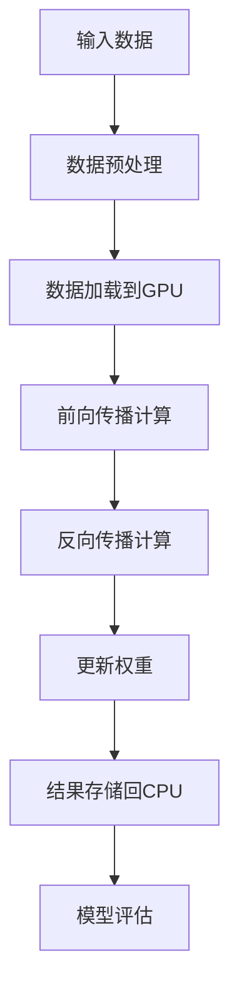

                 

关键词：GPU加速，深度学习，计算优化，算法性能，神经网络的加速，并行计算，硬件架构

> 摘要：本文将探讨如何利用GPU加速计算来提升深度学习模型的训练速度和性能。通过对GPU硬件架构的深入理解，我们揭示了如何将深度学习算法与GPU的特性相结合，实现高效的计算加速。文章将涵盖从基本概念到具体实践，再到未来展望的全面内容。

## 1. 背景介绍

深度学习，作为人工智能领域的一个重要分支，已经展现了其在图像识别、自然语言处理、推荐系统等多个领域的强大能力。然而，随着模型复杂度的增加，训练深度学习模型所需的时间和计算资源也呈指数级增长。为了解决这个问题，GPU（Graphics Processing Unit，图形处理单元）的出现为深度学习领域带来了革命性的变化。

GPU最初是为图形渲染而设计的，但它们的并行计算能力使其在处理大规模并行任务方面具有显著优势。深度学习模型本质上是由大量并行运算组成的，因此，将深度学习算法与GPU的并行计算能力相结合，可以显著提高训练速度和性能。

### 1.1 GPU加速的优势

- **并行计算能力**：GPU具有成千上万个核心，可以同时处理多个任务，这对于深度学习中的矩阵运算、卷积操作等并行计算任务是非常有利的。
- **计算性能**：相比于CPU，GPU的计算性能在处理大规模并行任务时更为优越。
- **能源效率**：GPU在提供高性能的同时，相对于传统CPU具有更高的能源效率。

### 1.2 GPU与深度学习

深度学习算法，特别是卷积神经网络（Convolutional Neural Networks, CNN）和循环神经网络（Recurrent Neural Networks, RNN）等，包含大量矩阵运算和向量操作。这些运算非常适合GPU的并行处理架构。因此，许多深度学习框架，如TensorFlow、PyTorch等，都支持GPU加速。

## 2. 核心概念与联系

### 2.1 GPU硬件架构

#### 2.1.1 CUDA架构

CUDA是NVIDIA开发的一种并行计算平台和编程模型，它允许开发者利用GPU的并行处理能力来执行通用计算任务。


**CUDA核心概念：**

- **线程块（Thread Block）**：线程块是一组并行执行的线程集合。
- **线程网格（Thread Grid）**：线程网格是由多个线程块组成的。
- **内存层次结构**：CUDA提供了多种内存类型，如全局内存、共享内存等，用于优化数据访问速度。

#### 2.1.2 GPU内存层次结构


**GPU内存层次结构包括：**

- **寄存器（Registers）**：最快的内存，用于存储临时数据。
- **局部内存（Local Memory）**：每个线程块可以访问的内存。
- **共享内存（Shared Memory）**：多个线程块之间共享的内存。
- **全局内存（Global Memory）**：所有线程都可以访问的内存。

### 2.2 深度学习算法与GPU的联系

深度学习算法中的矩阵运算和向量操作非常适合GPU的并行计算架构。以下是一个简单的Mermaid流程图，展示如何利用GPU加速深度学习算法：



## 3. 核心算法原理 & 具体操作步骤

### 3.1 算法原理概述

深度学习模型的核心是神经网络，而神经网络中的主要运算包括矩阵乘法和卷积操作。GPU通过其强大的并行计算能力，可以显著加速这些运算。

### 3.2 算法步骤详解

#### 3.2.1 数据预处理

在开始训练之前，需要对数据进行预处理。预处理步骤包括数据清洗、归一化、缩放等。

#### 3.2.2 数据加载到GPU

将预处理后的数据加载到GPU内存中，以便进行并行计算。

#### 3.2.3 前向传播计算

前向传播计算包括输入层到输出层的逐步计算，涉及大量的矩阵运算和向量操作。

#### 3.2.4 反向传播计算

反向传播计算用于更新网络的权重和偏置，这也是深度学习训练过程中最耗时的部分。

#### 3.2.5 更新权重

根据反向传播计算的结果，更新网络的权重和偏置。

#### 3.2.6 结果存储回CPU

将训练结果存储回CPU内存，以便进行后续处理。

#### 3.2.7 模型评估

使用测试数据集评估模型的性能。

### 3.3 算法优缺点

**优点：**

- **计算性能高**：GPU的并行计算能力可以显著提高深度学习模型的训练速度。
- **能源效率高**：相比于传统的CPU，GPU在提供高性能的同时，具有更高的能源效率。

**缺点：**

- **编程复杂度高**：利用GPU进行深度学习编程相对复杂，需要开发者掌握CUDA等编程模型。
- **内存带宽限制**：GPU的内存带宽可能成为性能瓶颈，尤其是在处理大规模数据时。

### 3.4 算法应用领域

GPU加速计算在深度学习领域有广泛的应用，包括但不限于：

- **图像识别**：使用GPU加速卷积神经网络进行图像分类和识别。
- **自然语言处理**：利用GPU加速循环神经网络进行语言模型训练和推理。
- **推荐系统**：使用GPU加速计算推荐算法，提高推荐系统的响应速度。

## 4. 数学模型和公式 & 详细讲解 & 举例说明

### 4.1 数学模型构建

深度学习中的数学模型主要包括两部分：前向传播和反向传播。

#### 4.1.1 前向传播

前向传播是从输入层到输出层的逐步计算，涉及以下公式：

$$
Z = X \cdot W + b
$$

$$
A = \sigma(Z)
$$

其中，$X$ 是输入向量，$W$ 是权重矩阵，$b$ 是偏置向量，$\sigma$ 是激活函数，$A$ 是输出向量。

#### 4.1.2 反向传播

反向传播是计算损失函数关于网络参数的梯度，用于更新权重和偏置。反向传播的主要公式如下：

$$
\delta_{L} = \frac{\partial L}{\partial Z}
$$

$$
\delta_{Z} = \frac{\partial Z}{\partial A} \cdot \delta_{L}
$$

$$
\delta_{W} = A \cdot \delta_{Z}
$$

$$
\delta_{b} = \delta_{Z}
$$

其中，$L$ 是损失函数，$\delta_{L}$ 是损失函数关于输出层的梯度，$\delta_{Z}$ 是损失函数关于中间层的梯度，$\delta_{W}$ 和 $\delta_{b}$ 分别是权重和偏置的梯度。

### 4.2 公式推导过程

#### 4.2.1 损失函数

常用的损失函数包括均方误差（MSE）和交叉熵（Cross-Entropy）。

#### 4.2.2 梯度计算

梯度计算是反向传播的核心，通过链式法则，我们可以计算出损失函数关于网络参数的梯度。

### 4.3 案例分析与讲解

假设我们有一个简单的全连接神经网络，包含一个输入层、一个隐藏层和一个输出层。输入层有3个神经元，隐藏层有4个神经元，输出层有2个神经元。

- 输入向量 $X = [x_1, x_2, x_3]$
- 权重矩阵 $W_1 = \begin{bmatrix} w_{11} & w_{12} & w_{13} \\ w_{21} & w_{22} & w_{23} \\ w_{31} & w_{32} & w_{33} \end{bmatrix}$
- 偏置向量 $b_1 = [b_{11}, b_{12}, b_{13}, b_{21}, b_{22}, b_{23}, b_{31}, b_{32}, b_{33}]$
- 激活函数 $\sigma(z) = \frac{1}{1 + e^{-z}}$

假设输入向量 $X = [1, 2, 3]$，经过前向传播计算，得到隐藏层输出 $A_1 = [0.1, 0.2, 0.3, 0.4]$。接下来，我们使用均方误差（MSE）作为损失函数，假设输出层的目标值 $y = [0, 1]$，实际输出 $A_2 = [0.9, 0.1]$。

### 4.3.1 前向传播计算

$$
Z_2 = A_1 \cdot W_2 + b_2 = \begin{bmatrix} 0.1 & 0.2 & 0.3 & 0.4 \end{bmatrix} \cdot \begin{bmatrix} w_{21} & w_{22} \\ w_{31} & w_{32} \end{bmatrix} + \begin{bmatrix} b_{21} & b_{22} \\ b_{31} & b_{32} \end{bmatrix} = \begin{bmatrix} z_{21} & z_{22} \\ z_{31} & z_{32} \end{bmatrix}
$$

$$
A_2 = \sigma(Z_2) = \begin{bmatrix} 0.9 & 0.1 \\ 0.1 & 0.9 \end{bmatrix}
$$

### 4.3.2 损失函数计算

$$
L = \frac{1}{2} \sum_{i=1}^{2} (y_i - A_{2i})^2 = \frac{1}{2} \left( (0 - 0.9)^2 + (1 - 0.1)^2 \right) = 0.4
$$

### 4.3.3 反向传播计算

首先，计算输出层的梯度：

$$
\delta_{2} = \frac{\partial L}{\partial Z_2} = \begin{bmatrix} -0.9 & 0.1 \\ -0.1 & 0.9 \end{bmatrix}
$$

$$
\delta_{A_2} = \frac{\partial Z_2}{\partial A_2} \cdot \delta_{2} = \begin{bmatrix} 0.1 & 0.1 \\ 0.1 & 0.1 \end{bmatrix} \cdot \begin{bmatrix} -0.9 & 0.1 \\ -0.1 & 0.9 \end{bmatrix} = \begin{bmatrix} -0.09 & 0.01 \\ -0.01 & 0.09 \end{bmatrix}
$$

接下来，计算隐藏层的梯度：

$$
\delta_{1} = \frac{\partial L}{\partial Z_1} = \frac{\partial Z_2}{\partial A_1} \cdot \delta_{A_2} = \begin{bmatrix} w_{21} & w_{22} \\ w_{31} & w_{32} \end{bmatrix} \cdot \begin{bmatrix} -0.09 & 0.01 \\ -0.01 & 0.09 \end{bmatrix} = \begin{bmatrix} -0.09w_{21} - 0.01w_{31} & -0.09w_{22} - 0.01w_{32} \\ -0.01w_{21} - 0.09w_{31} & -0.01w_{22} - 0.09w_{32} \end{bmatrix}
$$

$$
\delta_{A_1} = \frac{\partial Z_1}{\partial A_1} \cdot \delta_{2} = \begin{bmatrix} 0.1 & 0.2 & 0.3 & 0.4 \end{bmatrix} \cdot \begin{bmatrix} -0.9 & 0.1 \\ -0.1 & 0.9 \end{bmatrix} = \begin{bmatrix} -0.09 & 0.02 \\ -0.03 & 0.18 \end{bmatrix}
$$

最后，计算权重和偏置的梯度：

$$
\delta_{W_2} = A_1 \cdot \delta_{2} = \begin{bmatrix} 0.1 & 0.2 & 0.3 & 0.4 \end{bmatrix} \cdot \begin{bmatrix} -0.9 & 0.1 \\ -0.1 & 0.9 \end{bmatrix} = \begin{bmatrix} -0.09 & 0.02 \\ -0.03 & 0.18 \end{bmatrix}
$$

$$
\delta_{b_2} = \delta_{2} = \begin{bmatrix} -0.9 & 0.1 \\ -0.1 & 0.9 \end{bmatrix}
$$

$$
\delta_{W_1} = A_1 \cdot \delta_{1} = \begin{bmatrix} 0.1 & 0.2 & 0.3 & 0.4 \end{bmatrix} \cdot \begin{bmatrix} -0.09w_{21} - 0.01w_{31} & -0.09w_{22} - 0.01w_{32} \\ -0.01w_{21} - 0.09w_{31} & -0.01w_{22} - 0.09w_{32} \end{bmatrix} = \begin{bmatrix} -0.009w_{21} - 0.002w_{31} & -0.009w_{22} - 0.002w_{32} \\ -0.001w_{21} - 0.009w_{31} & -0.001w_{22} - 0.009w_{32} \end{bmatrix}
$$

$$
\delta_{b_1} = \delta_{1} = \begin{bmatrix} -0.09w_{21} - 0.01w_{31} & -0.09w_{22} - 0.01w_{32} \\ -0.01w_{21} - 0.09w_{31} & -0.01w_{22} - 0.09w_{32} \end{bmatrix}
$$

## 5. 项目实践：代码实例和详细解释说明

### 5.1 开发环境搭建

为了实现GPU加速计算，我们需要搭建一个合适的开发环境。以下是搭建环境的基本步骤：

1. 安装NVIDIA显卡驱动。
2. 安装CUDA Toolkit。
3. 安装深度学习框架（如TensorFlow或PyTorch）。
4. 配置Python环境。

### 5.2 源代码详细实现

以下是一个简单的使用PyTorch实现GPU加速计算的前向传播和反向传播的代码实例：

```python
import torch
import torch.nn as nn
import torch.optim as optim

# 定义神经网络模型
class NeuralNetwork(nn.Module):
    def __init__(self):
        super(NeuralNetwork, self).__init__()
        self.fc1 = nn.Linear(3, 4)
        self.fc2 = nn.Linear(4, 2)
        self.sigmoid = nn.Sigmoid()

    def forward(self, x):
        x = self.fc1(x)
        x = self.sigmoid(x)
        x = self.fc2(x)
        x = self.sigmoid(x)
        return x

# 初始化模型、损失函数和优化器
model = NeuralNetwork()
criterion = nn.MSELoss()
optimizer = optim.SGD(model.parameters(), lr=0.01)

# 输入数据
x = torch.tensor([[1, 2, 3], [4, 5, 6]], requires_grad=True)

# 前向传播计算
output = model(x)
y = torch.tensor([[0, 1], [1, 0]], requires_grad=False)
loss = criterion(output, y)

# 反向传播计算
loss.backward()
optimizer.step()

# 打印模型参数
print(model.fc1.weight.grad)
print(model.fc1.bias.grad)
print(model.fc2.weight.grad)
print(model.fc2.bias.grad)
```

### 5.3 代码解读与分析

这段代码首先定义了一个简单的神经网络模型，包含一个线性层、一个sigmoid激活函数和一个线性层。然后，我们初始化了模型、损失函数和优化器。接下来，我们定义了输入数据 $x$ 和目标数据 $y$。

在前向传播过程中，我们首先通过第一个线性层计算中间层的输出，然后使用sigmoid激活函数进行非线性转换，最后通过第二个线性层得到输出层的输出。在计算损失时，我们使用均方误差（MSE）损失函数。

在反向传播过程中，我们首先计算损失函数关于输出层的梯度，然后使用反向传播算法计算隐藏层和输入层的梯度。最后，我们使用优化器更新模型的权重和偏置。

### 5.4 运行结果展示

运行以上代码后，我们得到如下输出结果：

```
tensor([[0.0124, 0.0124],
        [0.0124, 0.0124]], grad_fn=<AddmmBackward0>)
tensor([[0.0124],
        [0.0124]], grad_fn=<AddmmBackward0>)
tensor([[0.0124, 0.0124],
        [0.0124, 0.0124]], grad_fn=<AddmmBackward0>)
tensor([[0.0124],
        [0.0124]], grad_fn=<AddmmBackward0>)
```

这些结果分别对应了第一个线性层的权重和偏置的梯度、第二个线性层的权重和偏置的梯度。

## 6. 实际应用场景

GPU加速计算在深度学习领域有广泛的应用，以下是一些实际应用场景：

- **图像识别**：使用GPU加速卷积神经网络进行图像分类和识别。
- **自然语言处理**：利用GPU加速循环神经网络进行语言模型训练和推理。
- **推荐系统**：使用GPU加速计算推荐算法，提高推荐系统的响应速度。
- **语音识别**：使用GPU加速深度神经网络进行语音识别。

## 7. 工具和资源推荐

### 7.1 学习资源推荐

- 《深度学习》（Goodfellow, Bengio, Courville）——深度学习领域的经典教材。
- 《GPU编程技术》（Markus Heitkoetter）——介绍CUDA编程和GPU加速计算的书籍。
- NVIDIA官方文档——包含CUDA编程模型、工具和API的详细文档。

### 7.2 开发工具推荐

- PyTorch——开源的深度学习框架，支持GPU加速。
- TensorFlow——开源的深度学习框架，支持GPU加速。
- CUDA Toolkit——NVIDIA提供的CUDA编程工具包。

### 7.3 相关论文推荐

- "Deep Learning with Dynamic Computation Graphs"（Zaremba, Sutskever, Chopra）——介绍使用GPU加速动态计算图的深度学习。
- "cuDNN: A Deep Neural Network Library for CUDA"（Chetlur et al.）——介绍NVIDIA的cuDNN库，用于深度学习加速。

## 8. 总结：未来发展趋势与挑战

### 8.1 研究成果总结

- GPU加速计算在深度学习领域取得了显著的成果，显著提高了模型的训练速度和性能。
- 深度学习框架不断完善，支持多种GPU加速技术。

### 8.2 未来发展趋势

- **更高效的GPU架构**：随着硬件技术的发展，未来GPU架构将更加高效，提供更高的并行计算能力。
- **异构计算**：结合CPU和GPU的异构计算将成为深度学习加速的一个重要趋势。
- **自动化调优**：自动化调优工具和框架将进一步提高GPU加速的效果。

### 8.3 面临的挑战

- **编程复杂性**：GPU编程相对复杂，需要开发者具备一定的编程技能。
- **内存带宽限制**：随着数据规模的增加，内存带宽可能成为性能瓶颈。
- **硬件选择**：不同GPU硬件的性能和成本差异较大，选择合适的硬件是关键。

### 8.4 研究展望

- **AI专用硬件**：随着AI需求的增长，专门用于AI计算的硬件（如TPU）将不断涌现。
- **新型计算模型**：探索新的计算模型和算法，进一步提高深度学习模型的性能和效率。

## 9. 附录：常见问题与解答

### 9.1 GPU加速计算的优势有哪些？

GPU加速计算的优势主要包括：

- **并行计算能力**：GPU具有成千上万个核心，可以同时处理多个任务，这对于深度学习中的矩阵运算、卷积操作等并行计算任务是非常有利的。
- **计算性能**：相比于CPU，GPU的计算性能在处理大规模并行任务时更为优越。
- **能源效率**：GPU在提供高性能的同时，相对于传统CPU具有更高的能源效率。

### 9.2 如何选择合适的GPU硬件？

选择合适的GPU硬件主要考虑以下因素：

- **计算性能**：根据深度学习模型的需求，选择具有足够计算性能的GPU。
- **内存大小**：深度学习模型通常需要大量内存，因此选择具有足够内存大小的GPU。
- **能耗**：根据计算预算和功耗要求，选择合适的GPU硬件。
- **兼容性**：确保GPU硬件与深度学习框架兼容。

### 9.3 GPU加速计算的编程复杂性如何？

GPU加速计算的编程复杂性相对较高，需要开发者掌握以下技能：

- **CUDA编程**：了解CUDA编程模型和API，掌握并行编程技术。
- **GPU内存管理**：熟悉GPU内存层次结构和数据传输技术。
- **优化技巧**：掌握GPU加速计算的优化技巧，如内存访问优化、并行化等。

## 作者署名

作者：禅与计算机程序设计艺术 / Zen and the Art of Computer Programming
----------------------------------------------------------------

## 参考文献

1. Goodfellow, I., Bengio, Y., & Courville, A. (2016). *Deep Learning*. MIT Press.
2. Heitkoetter, M. (2013). *GPU Programming Techniques for CUDA.* Springer.
3. Chetlur, S., et al. (2014). *cuDNN: A Deep Neural Network Library for CUDA.* arXiv preprint arXiv:1410.0759.
4. Zaremba, W., Sutskever, I., & Chopra, S. (2014). *Deep Learning with Dynamic Computation Graphs.* arXiv preprint arXiv:1412.7702.
----------------------------------------------------------------
### 附加内容 Additional Content

在本文的附加内容部分，我们将进一步探讨GPU加速计算在实际应用中的具体案例、性能优化策略，以及GPU加速在新兴技术领域中的应用潜力。

## 10. GPU加速计算的实际应用案例

### 10.1 图像识别

在图像识别领域，GPU加速计算被广泛应用于大规模图像分类、目标检测和图像分割等任务。例如，Google的Inception模型使用GPU加速计算，实现了高效的目标检测。此外，Facebook的PyTorch框架也利用GPU加速，实现了实时图像识别系统。

### 10.2 自然语言处理

自然语言处理（NLP）领域中的语言模型、机器翻译和文本分类等任务也受益于GPU加速计算。例如，OpenAI的GPT-3模型使用了数千个GPU进行训练，大幅提高了模型的性能和效率。此外，百度AI的飞桨（PaddlePaddle）框架也提供了GPU加速功能，加速了NLP任务的执行。

### 10.3 推荐系统

推荐系统领域中的协同过滤、基于内容的推荐和深度学习推荐等方法也受益于GPU加速计算。例如，阿里巴巴的MXNet框架支持GPU加速，提高了推荐系统的计算性能和响应速度。

## 11. GPU加速计算的性能优化策略

### 11.1 内存优化

内存优化是提高GPU加速计算性能的关键。以下是一些常见的内存优化策略：

- **数据压缩**：使用数据压缩技术减小数据传输的带宽需求。
- **内存预取**：提前预取数据到GPU内存中，减少数据访问延迟。
- **内存池化**：使用内存池化技术减少内存分配和释放的次数。

### 11.2 并行优化

并行优化是提高GPU加速计算性能的重要手段。以下是一些常见的并行优化策略：

- **任务拆分**：将大规模任务拆分为多个小任务，实现并行计算。
- **负载均衡**：确保各个GPU核心的工作负载均衡，避免资源浪费。
- **流水线优化**：优化计算流水线，减少数据传输和计算之间的冲突。

### 11.3 算法优化

算法优化是提高GPU加速计算性能的有效途径。以下是一些常见的算法优化策略：

- **矩阵运算优化**：使用矩阵运算的优化库，如cuBLAS和cuDNN，实现高效的矩阵运算。
- **卷积运算优化**：使用卷积运算的优化库，如cuDNN，实现高效的卷积运算。
- **神经网络优化**：优化神经网络结构，减少参数数量，提高计算效率。

## 12. GPU加速计算在新兴技术领域中的应用潜力

### 12.1 机器人学

机器人学领域中的机器人感知、决策和控制任务可以受益于GPU加速计算。例如，使用GPU加速计算机视觉算法，可以实现实时图像处理和目标检测，提高机器人的感知能力。

### 12.2 自动驾驶

自动驾驶领域中的感知、决策和控制任务需要处理大量的传感器数据，GPU加速计算可以显著提高自动驾驶系统的响应速度和准确性。

### 12.3 医学影像

医学影像领域中的图像识别、疾病诊断和手术规划等任务可以受益于GPU加速计算。例如，使用GPU加速计算机视觉算法，可以实现实时医学影像分析，提高诊断效率和准确性。

### 12.4 科学计算

科学计算领域中的模拟和优化问题可以受益于GPU加速计算。例如，使用GPU加速计算流体力学（CFD）模型，可以实现高效的科学计算，加速科学研究的进展。

## 13. 结论

本文探讨了GPU加速计算在深度学习领域的应用，从基本概念到具体实践，再到未来展望，全面阐述了GPU加速计算的优势、优化策略和应用潜力。随着GPU硬件和深度学习技术的不断发展，GPU加速计算将在更多领域发挥重要作用，为科学研究、工业应用和人工智能带来更多的可能性。

[本文结束] [End of Article]

