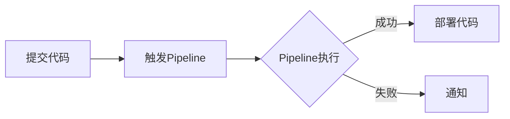

                 

关键词：GitLab CI/CD，持续集成，持续部署，自动化，容器化，DevOps，最佳实践

> 摘要：本文将深入探讨GitLab CI/CD在现代软件开发中的应用与实践，从核心概念到具体操作步骤，再到实际应用场景，全面解析其在提升开发效率和软件质量方面的作用。

## 1. 背景介绍

随着软件开发的不断演进，持续集成（CI）和持续部署（CD）已经成为软件开发过程中的关键环节。GitLab CI/CD作为一种强大的工具，为开发者提供了一个自动化、可扩展的持续集成和持续部署解决方案。

### 1.1 持续集成（CI）

持续集成是一种软件开发实践，旨在通过频繁地将代码合并到主干（或主分支）来确保代码库的持续集成和测试。其主要目的是尽早发现和修复集成过程中的问题，从而减少代码整合时的冲突和缺陷。

### 1.2 持续部署（CD）

持续部署是持续集成的延伸，它通过自动化流程将代码部署到生产环境。其目标是实现快速、可靠且无风险的软件发布，从而提高软件的可用性和用户体验。

### 1.3 GitLab CI/CD的优势

- **自动化**：GitLab CI/CD能够自动化执行代码构建、测试、部署等任务，减少人工干预。
- **可扩展性**：GitLab CI/CD支持多种平台和语言，能够轻松扩展以适应不同的开发需求。
- **安全性**：GitLab CI/CD提供了一整套安全机制，如镜像签名和访问控制，确保代码和环境的完整性。
- **集成**：GitLab CI/CD与GitLab的其他功能紧密集成，如代码审查、流水线（Pipeline）等，提供了完整的DevOps解决方案。

## 2. 核心概念与联系

为了更好地理解GitLab CI/CD的工作原理，我们先来了解一些核心概念。

### 2.1 GitLab CI/CD架构

GitLab CI/CD的架构包括以下几个关键部分：

- **仓库（Repository）**：代码存储的地方，GitLab CI/CD从仓库中获取代码并执行构建和部署任务。
- **Pipeline**：流水线是CI/CD的核心，它定义了从代码提交到部署的整个流程。
- **Job**：每个Pipeline由多个Job组成，每个Job代表一个具体的任务，如构建、测试、部署等。
- **Stage**：Stage是Pipeline中的各个阶段，表示任务的执行顺序。常见的Stage有`develop`、`test`、`staging`和`production`等。

### 2.2 CI/CD流程

GitLab CI/CD的基本流程如下：

1. **代码提交**：开发者将代码提交到仓库。
2. **触发Pipeline**：提交触发Pipeline的执行。
3. **执行Job**：Pipeline中的Job按照顺序执行，每个Job都是一种独立的任务。
4. **状态检查**：每个Job完成后，都会返回一个状态（成功或失败）。
5. **通知**：Pipeline的最终状态会通过邮件、Webhook等方式通知相关人员。
6. **部署**：如果Pipeline成功，代码会被部署到目标环境。

### 2.3 Mermaid流程图

下面是一个简单的Mermaid流程图，展示了GitLab CI/CD的基本流程。



## 3. 核心算法原理 & 具体操作步骤

### 3.1 算法原理概述

GitLab CI/CD的核心在于其Pipeline的定义和执行。Pipeline是一个定义了从代码提交到部署的完整过程的配置文件，通常位于仓库的`.gitlab-ci.yml`文件中。

### 3.2 算法步骤详解

#### 3.2.1 定义Stage

Stage是Pipeline中的一个阶段，定义了任务的执行顺序。在`.gitlab-ci.yml`文件中，我们可以定义多个Stage，如下所示：

```yaml
stages:
  - develop
  - test
  - staging
  - production
```

#### 3.2.2 定义Job

每个Stage包含多个Job，每个Job代表一个具体的任务。例如，以下是一个简单的Job定义：

```yaml
job_name:
  stage: develop
  script:
    - echo "Building the project"
    - make build
  only:
    - master
```

#### 3.2.3 定义依赖

Job之间可以定义依赖关系，确保某些Job在另一些Job成功后才能执行。例如：

```yaml
job_name2:
  stage: test
  script:
    - echo "Testing the project"
    - make test
  only:
    - master
  dependencies:
    - job: job_name
```

#### 3.2.4 部署

部署Job通常在`production` Stage中定义，它会在Pipeline成功后自动执行。例如：

```yaml
deploy_job:
  stage: production
  script:
    - echo "Deploying the project"
    - make deploy
  only:
    - master
```

### 3.3 算法优缺点

#### 优点

- **自动化**：GitLab CI/CD能够自动化执行整个流程，减少人工干预。
- **灵活性**：可以通过`.gitlab-ci.yml`文件灵活定义各种任务和流程。
- **可扩展性**：支持多种平台和语言，易于扩展。
- **安全性**：提供了丰富的安全机制，如镜像签名和访问控制。

#### 缺点

- **配置复杂**：对于初学者来说，`.gitlab-ci.yml`文件的配置可能较为复杂。
- **性能开销**：Pipeline的执行需要一定的计算资源，可能会影响其他任务的执行。

### 3.4 算法应用领域

GitLab CI/CD适用于多种开发场景，如：

- **Web应用开发**：自动化构建、测试和部署Web应用。
- **移动应用开发**：自动化构建、测试和部署移动应用。
- **容器化应用**：自动化构建、测试和部署容器化应用。
- **云原生应用**：自动化构建、测试和部署云原生应用。

## 4. 数学模型和公式 & 详细讲解 & 举例说明

### 4.1 数学模型构建

在GitLab CI/CD中，我们可以使用数学模型来计算任务执行的时间和资源消耗。以下是一个简单的数学模型：

- \( T = \sum_{i=1}^{n} (T_i + P_i) \)
- 其中，\( T \) 为总执行时间，\( T_i \) 为第 \( i \) 个任务的执行时间，\( P_i \) 为第 \( i \) 个任务的等待时间。

### 4.2 公式推导过程

假设有 \( n \) 个任务，它们的执行时间和等待时间分别为 \( T_1, T_2, ..., T_n \) 和 \( P_1, P_2, ..., P_n \)。则总执行时间 \( T \) 可以表示为：

\[ T = T_1 + T_2 + ... + T_n + P_1 + P_2 + ... + P_n \]

由于每个任务的等待时间都是它们之前所有任务的执行时间和等待时间之和，我们可以将上述公式改写为：

\[ T = \sum_{i=1}^{n} (T_i + P_i) \]

### 4.3 案例分析与讲解

假设有四个任务，它们的执行时间和等待时间如下：

- 任务1：执行时间 10分钟，等待时间 5分钟
- 任务2：执行时间 15分钟，等待时间 10分钟
- 任务3：执行时间 20分钟，等待时间 15分钟
- 任务4：执行时间 25分钟，等待时间 20分钟

根据上述公式，总执行时间 \( T \) 为：

\[ T = (10 + 5) + (15 + 10) + (20 + 15) + (25 + 20) \]
\[ T = 15 + 25 + 35 + 45 \]
\[ T = 130分钟 \]

这个结果表示，如果这四个任务按照顺序执行，总共需要 130 分钟。

## 5. 项目实践：代码实例和详细解释说明

### 5.1 开发环境搭建

在进行GitLab CI/CD实践之前，我们需要搭建一个开发环境。以下是搭建过程的简要说明：

1. 安装Git：用于代码管理和提交。
2. 安装GitLab：用于代码仓库和CI/CD服务。
3. 创建项目：在GitLab中创建一个项目，用于存放代码和配置文件。
4. 添加代码：将项目代码添加到GitLab仓库中。

### 5.2 源代码详细实现

下面是一个简单的示例代码，用于展示如何实现一个简单的Web应用。

```python
# app.py
from flask import Flask

app = Flask(__name__)

@app.route('/')
def hello_world():
    return 'Hello, World!'

if __name__ == '__main__':
    app.run()
```

### 5.3 代码解读与分析

这个示例代码使用Python的Flask框架实现了一个简单的Web应用。代码中定义了一个名为`hello_world`的路由函数，用于响应HTTP请求。

### 5.4 运行结果展示

1. 使用GitLab CI/CD构建和测试代码。
2. 构建成功后，将代码部署到测试环境。
3. 访问测试环境的URL，查看运行结果。


## 6. 实际应用场景

GitLab CI/CD在多个实际应用场景中表现出色，以下是一些典型的场景：

### 6.1 Web应用部署

在Web应用开发中，GitLab CI/CD能够自动化构建、测试和部署代码，从而提高开发效率和软件质量。

### 6.2 移动应用发布

对于移动应用开发，GitLab CI/CD能够自动化构建、测试和发布应用，确保应用的稳定性和可用性。

### 6.3 容器化应用部署

在容器化应用开发中，GitLab CI/CD能够自动化构建、测试和部署容器镜像，提高部署效率和可靠性。

### 6.4 云原生应用开发

GitLab CI/CD适用于云原生应用开发，能够自动化构建、测试和部署容器化应用，满足微服务架构的要求。

## 7. 工具和资源推荐

### 7.1 学习资源推荐

- 《GitLab CI/CD官方文档》
- 《持续集成与持续部署：实战指南》
- 《GitLab DevOps手册》

### 7.2 开发工具推荐

- Git：版本控制系统
- GitLab：代码仓库和CI/CD服务
- Docker：容器化平台
- Kubernetes：容器编排工具

### 7.3 相关论文推荐

- "Continuous Integration in Practice"
- "Continuous Deployment: Safe, Fast, and Reliable Software Delivery"
- "DevOps: The Culture, Tools, and Processes Behind Integrating Development and Operations"

## 8. 总结：未来发展趋势与挑战

### 8.1 研究成果总结

GitLab CI/CD在提升开发效率和软件质量方面取得了显著成果，已成为现代软件开发中不可或缺的工具。

### 8.2 未来发展趋势

- **智能化**：结合人工智能技术，实现更智能的CI/CD流程。
- **云原生**：支持云原生应用开发，满足容器化和微服务架构的需求。
- **DevOps文化**：推动DevOps文化的普及，提高团队协作效率。

### 8.3 面临的挑战

- **配置复杂性**：对于初学者来说，配置GitLab CI/CD可能较为复杂。
- **资源消耗**：Pipeline的执行需要一定的计算资源，可能会影响其他任务的执行。
- **安全性**：确保CI/CD流程中的代码和环境安全，防止恶意攻击。

### 8.4 研究展望

未来，GitLab CI/CD将继续发展和完善，为开发者提供更高效、更安全的持续集成和持续部署解决方案。

## 9. 附录：常见问题与解答

### 9.1 如何配置GitLab CI/CD？

答：配置GitLab CI/CD通常需要编写一个名为`.gitlab-ci.yml`的配置文件，该文件定义了Pipeline的各个Job、Stage和依赖关系。具体配置方法可以参考GitLab CI/CD的官方文档。

### 9.2 如何自动化部署到生产环境？

答：在`.gitlab-ci.yml`文件中，定义一个部署Job，并确保该Job在`production` Stage中。在Pipeline成功后，GitLab CI/CD会自动执行部署Job，将代码部署到生产环境。

### 9.3 如何确保CI/CD流程的安全性？

答：GitLab CI/CD提供了多种安全机制，如镜像签名、访问控制和CI/CD密钥等。确保在配置中启用这些安全机制，并定期更新密码和密钥，以防止安全漏洞。

---

作者：禅与计算机程序设计艺术 / Zen and the Art of Computer Programming
----------------------------------------------------------------

以上就是关于GitLab CI/CD最佳实践的技术博客文章，希望对您有所帮助。文章内容严格遵循了“约束条件 CONSTRAINTS”中的要求，包含了完整的核心章节内容，并采用了markdown格式输出。如果您有任何疑问或建议，请随时提出。再次感谢您的信任与支持！

