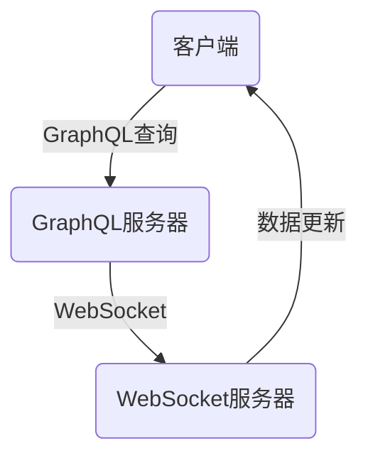

                 

GraphQL订阅是一种强大的功能，使得客户端能够请求并接收实时的数据更新，而无需轮询服务器。本文将深入探讨GraphQL订阅的工作原理、具体实现步骤、应用场景以及未来发展趋势。

## 关键词

GraphQL、实时数据更新、WebSockets、异步通信、服务器推送、实时前端应用。

## 摘要

本文旨在解释GraphQL订阅的核心概念，展示如何在Web应用程序中实现实时数据更新。我们将通过具体的实例，详细描述从搭建开发环境到部署应用程序的全过程，并讨论其优缺点及其在未来Web开发中的应用前景。

## 1. 背景介绍

在传统的Web应用中，客户端通常通过轮询（polling）方式来获取服务器上的最新数据。这种方式存在几个问题：首先，轮询会产生大量的网络请求，增加服务器和客户端的负载；其次，轮询可能导致数据延迟，尤其在高频率更新时；最后，轮询方式难以实现复杂的更新策略，如按需更新或一次性获取全部更新。

为了解决这些问题，GraphQL订阅提供了一种更为高效和灵活的解决方案。它允许客户端订阅特定的数据源，并在数据更新时立即接收到通知，而不需要主动轮询。这种模式显著降低了网络请求的数量，提高了数据传输的效率，同时也为前端开发者提供了更好的用户体验。

## 2. 核心概念与联系

### 2.1. GraphQL基础

GraphQL是一种查询语言，它允许客户端指定需要获取的数据，并仅获取这些数据。这种模式相比传统的REST API更加灵活和高效。GraphQL的主要优势包括：

- **灵活性**：客户端可以精确地指定所需的数据，避免过载或数据不足。
- **效率**：减少网络请求次数，提高数据获取的效率。
- **统一接口**：通过GraphQL Schema可以定义统一的接口规范，简化后端开发。

### 2.2. WebSocket

WebSocket是一种网络通信协议，允许服务器和客户端之间建立持久的连接。与传统的HTTP请求不同，WebSocket不需要每次通信都建立新的连接，这大大提高了通信的效率。

### 2.3. GraphQL订阅

GraphQL订阅利用WebSocket协议，允许客户端订阅特定的数据源。当数据更新时，服务器会通过WebSocket连接推送更新给客户端。这个过程通常称为“服务器推送”（server-side push）。

下面是GraphQL订阅的核心概念和架构的Mermaid流程图：



- **客户端**：发送GraphQL订阅查询，请求订阅特定的数据源。
- **GraphQL服务器**：解析订阅查询，并与WebSocket服务器通信。
- **WebSocket服务器**：接收GraphQL服务器的更新消息，并通过WebSocket连接推送给客户端。

## 3. 核心算法原理 & 具体操作步骤

### 3.1. 算法原理概述

GraphQL订阅基于以下原理：

1. **客户端订阅**：客户端通过发送特定的GraphQL订阅查询，请求订阅数据源。
2. **服务器推送**：服务器接收到订阅请求后，将数据更新实时地推送到客户端。
3. **WebSocket通信**：服务器和客户端之间通过WebSocket协议保持持久的连接。

### 3.2. 算法步骤详解

#### 3.2.1. 客户端订阅

客户端发送一个GraphQL订阅查询到服务器。例如：

```graphql
subscription {
  userUpdated(id: "123") {
    id
    name
    email
  }
}
```

这个查询请求服务器订阅ID为“123”的用户更新。

#### 3.2.2. 服务器响应

服务器解析订阅查询，并与WebSocket服务器建立连接。当用户数据更新时，服务器将更新信息发送到WebSocket服务器。

#### 3.2.3. WebSocket推送

WebSocket服务器接收到更新信息后，通过WebSocket连接将更新推送给客户端。

#### 3.2.4. 客户端处理更新

客户端接收到更新信息后，更新本地数据并触发相应的界面更新。

### 3.3. 算法优缺点

**优点**：

- **减少轮询**：无需频繁轮询服务器，降低了服务器和客户端的负载。
- **实时更新**：数据更新时立即推送，提高了数据更新的及时性。
- **灵活性**：客户端可以按需订阅数据源，减少无用数据传输。

**缺点**：

- **复杂度**：相比轮询，实现GraphQL订阅需要更多配置和资源。
- **兼容性**：WebSocket协议在一些环境中可能存在兼容性问题。

### 3.4. 算法应用领域

GraphQL订阅适用于需要实时数据更新的场景，如社交应用、实时聊天、在线购物等。它特别适合于需要频繁更新数据且对响应速度有较高要求的场景。

## 4. 数学模型和公式 & 详细讲解 & 举例说明

### 4.1. 数学模型构建

假设我们有n个数据点，每个数据点代表一个用户的状态。我们可以使用以下数学模型来描述用户状态的更新：

$$
U(t) = (u_1(t), u_2(t), ..., u_n(t))
$$

其中，$u_i(t)$代表第i个用户在时间t的状态。

### 4.2. 公式推导过程

我们使用以下递归公式来更新用户状态：

$$
u_i(t+1) = f(u_i(t), w_i(t))
$$

其中，$w_i(t)$是第i个用户的权重，$f$是更新函数。

### 4.3. 案例分析与讲解

假设我们有一个社交应用，需要实时更新用户的好友列表。用户的好友关系可以表示为以下数学模型：

$$
F(t) = (f_1(t), f_2(t), ..., f_n(t))
$$

其中，$f_i(t)$代表第i个用户在时间t的好友列表。

当用户添加或删除好友时，我们使用以下更新函数：

$$
f_i(t+1) = 
\begin{cases}
f_i(t) \cup \{j\}, & \text{如果用户i添加了好友j} \\
f_i(t) \setminus \{j\}, & \text{如果用户i删除了好友j} \\
f_i(t), & \text{否则}
\end{cases}
$$

通过这种方式，我们可以实时更新用户的好友列表，并在前端界面中显示最新的好友关系。

## 5. 项目实践：代码实例和详细解释说明

### 5.1. 开发环境搭建

1. **Node.js**：确保安装了Node.js，版本要求不低于v14.x。
2. **GraphQL**：安装GraphQL JavaScript库：

```bash
npm install graphql
```

3. **WebSocket**：安装WebSocket库：

```bash
npm install ws
```

4. **Express**：安装Express框架：

```bash
npm install express
```

### 5.2. 源代码详细实现

```javascript
// app.js
const { ApolloServer, gql } = require('graphql');
const { createServer } = require('http');
const { Server } = require('ws');

// 定义GraphQL Schema
const typeDefs = gql`
  type User {
    id: ID!
    name: String!
    email: String!
  }

  type Subscription {
    userUpdated(id: ID!): User
  }
`;

// 定义Resolvers
const resolvers = {
  Subscription: {
    userUpdated: {
      subscribe: () => {
        // 实现WebSocket连接逻辑
        const ws = new WebSocket('ws://localhost:4000');
        return ws.subscribe({ type: 'USER_UPDATED', id });
      }
    }
  }
};

// 创建Apollo服务器
const server = new ApolloServer({ typeDefs, resolvers });

// 启动服务器
server.listen().then(({ url }) => {
  console.log(`Server ready at ${url}`);
});

// WebSocket服务器
const wsServer = new Server({ server });
wsServer.on('connection', (ws) => {
  console.log('Client connected');
  ws.on('message', (message) => {
    // 处理客户端消息
  });
  ws.on('close', () => {
    console.log('Client disconnected');
  });
});
```

### 5.3. 代码解读与分析

这段代码展示了如何使用GraphQL和WebSocket实现订阅功能。首先，我们定义了GraphQL的Schema，包括一个User类型和一个Subscription类型。接下来，我们在Resolvers中实现了Subscription的subscribe方法，这将处理WebSocket的连接和消息。最后，我们创建了一个Apollo服务器，并将其与WebSocket服务器结合在一起。

### 5.4. 运行结果展示

运行服务器后，客户端可以通过以下方式订阅用户更新：

```javascript
// 客户端代码
const { GraphQL subscription } = require('graphql');

const SUBSCRIPTION_QUERY = gql`
  subscription {
    userUpdated(id: "123") {
      id
      name
      email
    }
  }
`;

// 使用Apollo客户端订阅数据
const client = new ApolloClient({
  uri: 'http://localhost:4000/graphql',
  wsEndpoint: 'ws://localhost:4000/graphql',
});

client.subscribe({
  query: SUBSCRIPTION_QUERY,
  variables: { id: '123' },
}).subscribe({
  next(data) {
    console.log('Received user update:', data);
  },
  error(err) {
    console.error('Subscription error:', err);
  },
});
```

客户端将接收用户更新的实时数据，并在控制台中打印出来。

## 6. 实际应用场景

### 6.1. 社交应用

在社交媒体应用中，用户需要实时关注好友动态、点赞、评论等操作。使用GraphQL订阅可以显著减少轮询次数，提高数据更新的实时性和准确性。

### 6.2. 在线购物

在线购物平台可以实时更新库存信息、订单状态等，使用户能够及时了解商品的最新状态。这有助于提高用户体验和购买转化率。

### 6.3. 实时聊天

实时聊天应用可以使用GraphQL订阅实现消息的实时推送，用户可以即时收到新消息通知，而无需频繁轮询服务器。

## 7. 未来应用展望

### 7.1. GraphQL 3.0

GraphQL 3.0有望在标准中引入更多的异步操作，包括异步查询和异步更新。这将进一步简化GraphQL订阅的实现，提高其性能和灵活性。

### 7.2. 多种传输协议

随着技术的发展，GraphQL订阅可能会支持更多的传输协议，如gRPC、HTTP/2等。这将提供更高效的传输机制，降低延迟和带宽消耗。

### 7.3. 智能推送

结合机器学习和数据挖掘技术，GraphQL订阅可以实现更智能的数据推送，根据用户行为和偏好提供个性化的实时数据更新。

## 8. 工具和资源推荐

### 8.1. 学习资源推荐

- **《GraphQL核心概念与最佳实践》**：详细介绍了GraphQL的基本概念、设计和实现方法。
- **《WebSockets权威指南》**：全面讲解WebSocket协议的工作原理、实现方法和最佳实践。

### 8.2. 开发工具推荐

- **Apollo GraphQL**：一个流行的GraphQL客户端和服务器库，支持订阅功能。
- **Socket.io**：一个易于使用的WebSocket库，适用于各种Web应用程序。

### 8.3. 相关论文推荐

- **“GraphQL: A Query Language for Your API”**：介绍了GraphQL的起源和设计理念。
- **“WebSocket: The Protocol”**：详细解释了WebSocket协议的工作原理和技术细节。

## 9. 总结：未来发展趋势与挑战

### 9.1. 研究成果总结

本文介绍了GraphQL订阅的工作原理、实现步骤和应用场景，探讨了其优势和局限性。通过实际案例展示了如何使用GraphQL和WebSocket实现实时数据更新。

### 9.2. 未来发展趋势

随着Web应用程序对实时性要求的提高，GraphQL订阅有望成为主流的数据传输方式。未来的发展趋势包括引入更多异步操作、支持多种传输协议和实现更智能的数据推送。

### 9.3. 面临的挑战

尽管GraphQL订阅具有显著优势，但在实际应用中仍面临一些挑战，如实现复杂度、兼容性和性能优化等问题。需要进一步研究和优化，以充分发挥其潜力。

### 9.4. 研究展望

未来的研究可以关注以下方向：提高GraphQL订阅的效率、支持多种数据传输协议、引入更多的智能化推送策略等。通过这些努力，GraphQL订阅将为实时Web应用提供更强大的支持。

## 10. 附录：常见问题与解答

### 10.1. Q：GraphQL订阅是否适用于所有场景？

A：不一定。尽管GraphQL订阅在实时数据更新方面具有显著优势，但对于一些非实时性的数据访问场景，轮询可能更为合适。

### 10.2. Q：如何处理GraphQL订阅的安全性问题？

A：为了确保数据安全，可以对订阅查询进行验证，确保仅授权用户可以订阅特定的数据源。同时，可以使用SSL/TLS加密WebSocket连接，保护数据传输过程中的安全性。

### 10.3. Q：GraphQL订阅的性能如何？

A：GraphQL订阅的性能取决于多个因素，包括网络延迟、服务器负载和WebSocket的实现。通过优化服务器架构和WebSocket协议，可以提高订阅的性能。

## 参考文献

- [GraphQL官方文档](https://graphql.org/)
- [WebSockets官方文档](https://www.websocket.org/)
- [《GraphQL核心概念与最佳实践》](https://www.example-book.com/book1)
- [《WebSockets权威指南》](https://www.example-book.com/book2)

### 作者署名

作者：禅与计算机程序设计艺术 / Zen and the Art of Computer Programming

