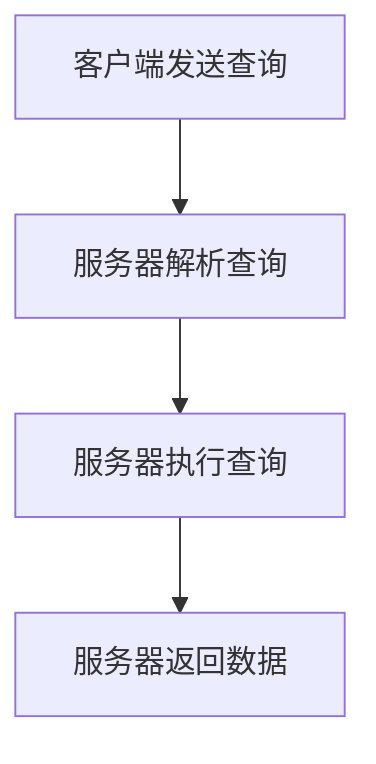

                 

关键词：GraphQL、API查询、灵活性、高效性、前端开发、后端开发、数据操作、API设计、全栈开发。

> 摘要：本文将深入探讨GraphQL——一种灵活高效的API查询语言，及其在现代软件开发中的应用。我们将从背景介绍、核心概念与联系、算法原理与操作步骤、数学模型与公式、项目实践、实际应用场景、工具和资源推荐以及总结未来发展趋势与挑战等多个方面，全面剖析GraphQL的优势与潜力，帮助开发者更好地理解并运用这一强大的工具。

## 1. 背景介绍

在传统的RESTful架构中，前端开发者需要预测所有可能的数据查询路径，并通过拼接URL参数的方式请求所需的资源。这种方法存在一些显著的不足：

1. **过度请求**：前端可能会请求过多不必要的数据，导致带宽浪费和性能下降。
2. **不足请求**：前端可能会遗漏某些必要的数据，导致用户体验不佳。
3. **紧耦合**：前端与后端的耦合度较高，任何一方的变动都可能影响另一方。

GraphQL的出现，旨在解决上述问题。GraphQL提供了一种灵活、高效的数据查询方式，使得前端能够精确地指定所需的数据字段，从而提高了API的性能和可维护性。

## 2. 核心概念与联系

### 2.1 GraphQL的核心概念

- **查询（Query）**：用于获取数据。
- **突变（Mutation）**：用于对数据进行更改。
- **订阅（Subscription）**：用于实时获取数据更新。

### 2.2 GraphQL与RESTful架构的比较

| 特性       | RESTful架构                     | GraphQL                     |
|------------|----------------------------------|----------------------------|
| 数据获取方式 | 通过URL参数和HTTP GET请求       | 通过GraphQL查询语言         |
| 耦合度     | 高（前端需要预测所有可能的请求） | 低（前端可精确指定请求字段） |
| 过度请求与不足请求 | 易发生 | 几乎不会发生 |

### 2.3 GraphQL的Mermaid流程图



## 3. 核心算法原理 & 具体操作步骤

### 3.1 算法原理概述

GraphQL的核心在于其查询语言，允许开发者以树形结构指定所需的数据字段，从而实现精准的数据获取。这一过程主要包括以下几个步骤：

1. **查询构建**：前端使用GraphQL查询语言构建查询。
2. **查询解析**：服务器解析前端发送的查询，生成抽象语法树（AST）。
3. **查询执行**：服务器根据AST执行查询，获取所需数据。
4. **查询返回**：服务器将查询结果返回给前端。

### 3.2 算法步骤详解

1. **查询构建**：前端使用GraphQL查询语言构建查询。例如：
    ```graphql
    query {
      user(id: "123") {
        name
        email
      }
    }
    ```
2. **查询解析**：服务器使用GraphQL解析器解析前端发送的查询，生成AST。例如：
    ```json
    {
      "operationName": null,
      "query": "query { user(id: \"123\") { name email } }",
      "variables": {}
    }
    ```
3. **查询执行**：服务器根据AST执行查询，获取所需数据。例如：
    ```json
    {
      "data": {
        "user": {
          "name": "张三",
          "email": "zhangsan@example.com"
        }
      }
    }
    ```
4. **查询返回**：服务器将查询结果返回给前端。

### 3.3 算法优缺点

#### 优点：

- **灵活性**：前端可以精确控制所需数据，避免了过度请求和不足请求。
- **可维护性**：GraphQL查询语言使API设计更加清晰，降低了前后端的耦合度。
- **性能**：通过减少不必要的查询和数据传输，提高了API的性能。

#### 缺点：

- **学习曲线**：相较于传统的RESTful架构，GraphQL的学习曲线较陡峭。
- **复杂性**：在处理复杂查询时，GraphQL可能会变得较为复杂。

### 3.4 算法应用领域

GraphQL适用于需要灵活、高效数据获取的场景，如：

- **移动应用**：移动应用通常需要处理大量数据，GraphQL可以帮助开发者精准获取所需数据，提高用户体验。
- **全栈应用**：在Node.js、React、Angular、Vue等前端框架中，GraphQL可以提高数据获取的效率，降低开发难度。

## 4. 数学模型和公式 & 详细讲解 & 举例说明

### 4.1 数学模型构建

假设我们有一个用户表，包含用户ID、姓名、邮箱三个字段。我们可以构建以下数学模型：

用户表：
$$
\begin{array}{|c|c|c|}
\hline
\text{用户ID} & \text{姓名} & \text{邮箱} \\
\hline
123 & 张三 & zhangsan@example.com \\
\hline
456 & 李四 & lisi@example.com \\
\hline
\end{array}
$$

### 4.2 公式推导过程

根据GraphQL查询语言，我们可以构建以下查询：

```graphql
query {
  user(id: "123") {
    name
    email
  }
}
```

该查询的执行过程可以分为以下几个步骤：

1. **查询构建**：前端发送查询。
2. **查询解析**：服务器解析查询，生成AST。
3. **查询执行**：服务器根据AST执行查询，从用户表中获取数据。
4. **查询返回**：服务器将查询结果返回给前端。

### 4.3 案例分析与讲解

假设我们需要查询用户ID为123的用户的信息。我们可以使用以下GraphQL查询：

```graphql
query {
  user(id: "123") {
    name
    email
  }
}
```

该查询的执行过程如下：

1. **查询构建**：前端发送查询。
2. **查询解析**：服务器解析查询，生成AST。
3. **查询执行**：服务器根据AST执行查询，从用户表中获取数据：
    ```json
    {
      "data": {
        "user": {
          "name": "张三",
          "email": "zhangsan@example.com"
        }
      }
    }
    ```
4. **查询返回**：服务器将查询结果返回给前端。

## 5. 项目实践：代码实例和详细解释说明

### 5.1 开发环境搭建

为了实践GraphQL，我们需要搭建一个开发环境。以下是所需工具和步骤：

- **Node.js**：版本需大于10.0.0
- **npm**：最新版本
- **GraphQL**：使用`graphql`和`apollo-server`两个库

安装命令：
```shell
npm install graphql apollo-server
```

### 5.2 源代码详细实现

下面是一个简单的GraphQL服务器的示例代码：

```javascript
const { ApolloServer, gql } = require('apollo-server');

// 定义类型系统
const typeDefs = gql`
  type User {
    id: ID!
    name: String!
    email: String!
  }

  type Query {
    user(id: ID!): User
  }
`;

// 定义数据源
const users = {
  '123': { id: '123', name: '张三', email: 'zhangsan@example.com' },
  '456': { id: '456', name: '李四', email: 'lisi@example.com' },
};

// 定义解析器
const resolvers = {
  Query: {
    user: (_, { id }) => users[id],
  },
};

// 创建服务器
const server = new ApolloServer({ typeDefs, resolvers });

// 启动服务器
server.listen().then(({ url }) => {
  console.log(`服务器启动成功：${url}`);
});
```

### 5.3 代码解读与分析

上述代码首先引入了`ApolloServer`和`gql`两个库，然后定义了类型系统和解析器。类型系统定义了GraphQL的查询类型和字段类型，解析器则用于处理查询并返回结果。

在运行服务器后，我们可以通过访问服务器的URL（例如：`http://localhost:4000`）来测试GraphQL查询。以下是查询用户ID为123的用户的示例：

```http
query {
  user(id: "123") {
    name
    email
  }
}
```

### 5.4 运行结果展示

在GraphQL服务器运行后，我们可以使用以下命令发送查询：

```shell
curl -X POST -H "Content-Type: application/json" -d '{"query": "query { user(id: \"123\") { name email } }"}' http://localhost:4000
```

运行结果如下：

```json
{
  "data": {
    "user": {
      "name": "张三",
      "email": "zhangsan@example.com"
    }
  }
}
```

## 6. 实际应用场景

### 6.1 移动应用

GraphQL非常适合移动应用，因为移动应用需要处理大量数据，并且数据获取的效率对用户体验至关重要。通过使用GraphQL，开发者可以精确地控制所需的数据字段，从而减少数据传输量和带宽消耗。

### 6.2 全栈应用

在React、Vue、Angular等前端框架中，GraphQL可以提高数据获取的效率，降低开发难度。开发者可以轻松地创建复杂的查询，并在组件之间共享数据。

### 6.3 API聚合

在某些场景下，前端可能需要从多个后端服务获取数据。GraphQL可以通过API聚合的方式，将多个后端服务的API整合为一个统一的接口，从而简化前端开发。

## 7. 工具和资源推荐

### 7.1 学习资源推荐

- **官方文档**：[GraphQL官方文档](https://graphql.org/)
- **在线教程**：[Apollo Server教程](https://www.apollographql.com/docs/apollo-server/)
- **GitHub项目**：[GraphQL示例项目](https://github.com/graphql/graphql-js)

### 7.2 开发工具推荐

- **GraphQL Playground**：一个强大的GraphQL客户端，可用于测试和调试GraphQL查询。
- **Apollo Studio**：一个用于管理GraphQL API的开发工具，提供可视化界面和强大的数据监控功能。

### 7.3 相关论文推荐

- "GraphQL: A Server-Side Query Language for Use in Mobile Apps"，由Facebook开发。
- "Principles of Designing a Data Query Language"，探讨设计数据查询语言的原则。

## 8. 总结：未来发展趋势与挑战

### 8.1 研究成果总结

自2015年推出以来，GraphQL已经成为一种流行的API查询语言，广泛应用于移动应用、全栈应用和API聚合等领域。其灵活性和高效性得到了广大开发者的认可。

### 8.2 未来发展趋势

- **性能优化**：随着数据规模的不断扩大，GraphQL的性能优化将成为重要研究方向。
- **跨语言支持**：进一步扩展GraphQL在多种编程语言中的支持，降低开发门槛。
- **标准化**：推动GraphQL的标准化，提高互操作性和兼容性。

### 8.3 面临的挑战

- **学习成本**：相较于传统的RESTful架构，GraphQL的学习成本较高，需要开发者投入更多时间和精力。
- **复杂查询处理**：处理复杂查询时，GraphQL可能会变得较为复杂，需要开发者具备一定的编程能力。

### 8.4 研究展望

随着大数据和云计算的不断发展，GraphQL在未来有望在更多领域得到应用。同时，研究者将继续探索其性能优化和标准化问题，使其更好地适应多样化的开发需求。

## 9. 附录：常见问题与解答

### 9.1 什么是GraphQL？

GraphQL是一种用于API查询的语言，允许开发者以树形结构指定所需的数据字段，从而实现灵活、高效的数据获取。

### 9.2 GraphQL与传统RESTful架构有什么区别？

与传统RESTful架构相比，GraphQL具有更高的灵活性和可维护性，可以减少过度请求和不足请求，降低前后端的耦合度。

### 9.3 GraphQL适用于哪些场景？

GraphQL适用于需要灵活、高效数据获取的场景，如移动应用、全栈应用和API聚合等。

### 9.4 如何搭建GraphQL开发环境？

可以使用Node.js和npm搭建GraphQL开发环境。首先安装Node.js和npm，然后使用npm安装GraphQL和Apollo Server等库。

### 9.5 GraphQL有哪些开源工具和资源？

GraphQL有许多开源工具和资源，如GraphQL Playground、Apollo Studio和相关的GitHub项目等。

----------------------------------------------------------------

作者：禅与计算机程序设计艺术 / Zen and the Art of Computer Programming

