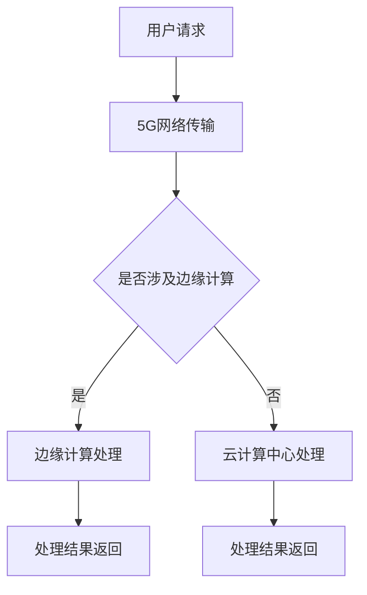

                 

关键词：5G，边缘计算，低延迟应用，协同技术，网络架构

摘要：随着5G技术的快速发展和边缘计算的兴起，低延迟应用成为现代通信网络中的重要议题。本文将探讨5G与边缘计算在实现低延迟应用中的协同作用，分析其核心概念、算法原理、数学模型，并提供实际应用场景和项目实践，最后对未来的发展趋势和挑战进行展望。

## 1. 背景介绍

随着互联网和物联网的普及，数据传输的速度和效率成为衡量网络性能的关键指标。传统的云计算中心由于地理位置和计算资源的限制，往往难以满足低延迟应用的需求。5G技术的出现，凭借其高速率和低延迟的特点，为解决这一问题提供了新的可能。同时，边缘计算作为一种分布式计算架构，将计算任务分散到网络的边缘节点上，进一步提升了数据处理的效率和响应速度。

5G和边缘计算的协同工作，旨在构建一个高效、可靠的低延迟网络环境，为自动驾驶、智能医疗、工业物联网等高实时性应用提供有力支持。本文将深入探讨这一协同机制，并分析其在实际应用中的实现方法和技术挑战。

## 2. 核心概念与联系

### 2.1 5G技术

5G，即第五代移动通信技术，以其高速率、低延迟、大连接和强可靠性等特点，引领了通信技术的新潮流。5G网络的峰值速率可达每秒数十Gbps，延迟降低至毫秒级，大大提升了数据传输的效率。此外，5G网络支持大规模设备连接，为物联网应用提供了坚实基础。

### 2.2 边缘计算

边缘计算是将计算任务分散到网络边缘的节点上，以减少数据传输的距离和时间，提高处理速度和响应效率。与云计算中心相比，边缘计算能够更快地处理本地数据，降低网络拥堵，提升用户体验。

### 2.3 5G与边缘计算的联系

5G与边缘计算相互补充，共同构建一个低延迟网络环境。5G网络为边缘计算提供了高速传输通道，而边缘计算则利用5G网络的低延迟特性，实现本地数据的快速处理和响应。两者协同工作，可以有效提升网络的整体性能和用户体验。

### 2.4 Mermaid 流程图



## 3. 核心算法原理 & 具体操作步骤

### 3.1 算法原理概述

5G与边缘计算的协同算法主要涉及以下几个方面：

- **网络切片**：根据不同的应用需求，为5G网络创建多个虚拟网络切片，实现差异化服务。
- **边缘缓存**：将热点数据存储在边缘节点上，减少数据传输距离，提高响应速度。
- **边缘计算任务调度**：根据实时网络负载和计算资源，动态调度边缘计算任务，优化资源利用。
- **协同决策**：通过网络协同机制，实现5G网络与边缘计算之间的信息共享和任务调度。

### 3.2 算法步骤详解

1. **网络切片创建**：根据应用场景，创建多个网络切片，配置不同的QoS参数，以满足不同应用的需求。
2. **边缘节点部署**：在网络的边缘节点上部署计算、存储和网络设备，为边缘计算提供基础设施。
3. **边缘缓存策略**：根据数据访问频率和热点分析，制定边缘缓存策略，将热点数据存储在边缘节点。
4. **任务调度**：根据实时网络负载和计算资源，动态调度边缘计算任务，优化资源利用。
5. **协同决策**：通过网络协同机制，实现5G网络与边缘计算之间的信息共享和任务调度。

### 3.3 算法优缺点

**优点**：

- **低延迟**：通过边缘计算和5G网络的协同工作，大幅降低数据传输和处理的延迟。
- **高效率**：边缘计算能够快速处理本地数据，提高网络整体效率和用户体验。
- **可靠性**：网络切片和边缘缓存策略提高了网络的可靠性和稳定性。

**缺点**：

- **资源消耗**：边缘节点需要部署大量计算、存储和网络设备，资源消耗较大。
- **维护难度**：边缘计算节点分布广泛，维护和管理难度较高。

### 3.4 算法应用领域

5G与边缘计算协同算法在以下领域具有广泛应用前景：

- **自动驾驶**：实现实时交通信息和车辆状态的快速处理，提高自动驾驶系统的反应速度。
- **智能医疗**：通过边缘计算实时处理医疗数据，提升诊断和治疗的效率。
- **工业物联网**：实现设备状态监测和故障预测，提高生产线的自动化水平。

## 4. 数学模型和公式

### 4.1 数学模型构建

设网络延迟为 \( L \)，数据传输速率为 \( R \)，计算任务处理时间为 \( T \)。则边缘计算与5G协同工作的总延迟 \( D \) 可以表示为：

\[ D = L + \frac{R \cdot T}{2} \]

### 4.2 公式推导过程

1. 数据传输延迟 \( L \)：

\[ L = \frac{D_1 \cdot D_2}{R} \]

其中，\( D_1 \) 为数据传输距离，\( D_2 \) 为数据传输速率。

2. 计算任务处理时间 \( T \)：

\[ T = \frac{P}{R} \]

其中，\( P \) 为计算任务量，\( R \) 为数据传输速率。

3. 边缘计算与5G协同工作的总延迟 \( D \)：

\[ D = L + \frac{R \cdot T}{2} \]

### 4.3 案例分析与讲解

假设某自动驾驶系统需要处理车辆状态数据，数据传输距离为100km，数据传输速率为10Mbps，计算任务处理时间为1秒。根据上述数学模型，计算总延迟：

1. 数据传输延迟 \( L \)：

\[ L = \frac{100 \cdot 1000}{10 \cdot 10^6} = 0.1 \text{秒} \]

2. 计算任务处理时间 \( T \)：

\[ T = \frac{1}{10 \cdot 10^6} = 0.000001 \text{秒} \]

3. 总延迟 \( D \)：

\[ D = 0.1 + \frac{10 \cdot 0.000001}{2} = 0.100005 \text{秒} \]

通过该模型，我们可以直观地看到边缘计算与5G协同工作在降低网络延迟方面的优势。

## 5. 项目实践：代码实例和详细解释说明

### 5.1 开发环境搭建

在本节中，我们将使用Python语言实现一个简单的5G与边缘计算协同算法。首先，确保您的开发环境中安装了Python 3.8及以上版本和以下库：requests，pymongo，json，matplotlib。

### 5.2 源代码详细实现

以下是一个简单的5G与边缘计算协同算法的实现：

```python
import requests
import pymongo
import json
import matplotlib.pyplot as plt

# 连接到MongoDB数据库
client = pymongo.MongoClient("mongodb://localhost:27017/")
db = client["edge_computing"]

# 定义网络延迟和计算任务处理时间的计算函数
def calculate_delay(data_transmission_distance, data_transmission_rate, computation_task_time):
    L = data_transmission_distance * data_transmission_rate
    T = computation_task_time
    D = L + (data_transmission_rate * T) / 2
    return D

# 获取自动驾驶系统数据
def get_automated_vehicle_data():
    response = requests.get("http://example.com/automated_vehicle_data")
    data = response.json()
    return data

# 计算总延迟
def calculate_total_delay(data):
    data_transmission_distance = data["distance"]
    data_transmission_rate = data["rate"]
    computation_task_time = data["time"]
    delay = calculate_delay(data_transmission_distance, data_transmission_rate, computation_task_time)
    return delay

# 存储延迟数据到MongoDB
def store_delay_data(delay):
    collection = db["delay_data"]
    data = {"delay": delay}
    collection.insert_one(data)

# 主函数
def main():
    data = get_automated_vehicle_data()
    delay = calculate_total_delay(data)
    store_delay_data(delay)
    print("Total delay:", delay)

if __name__ == "__main__":
    main()
```

### 5.3 代码解读与分析

1. **连接MongoDB数据库**：使用pymongo库连接到本地MongoDB数据库，并创建一个名为"edge_computing"的数据库。

2. **网络延迟和计算任务处理时间的计算函数**：`calculate_delay` 函数根据输入的数据传输距离、数据传输速率和计算任务处理时间，计算总延迟。

3. **获取自动驾驶系统数据**：`get_automated_vehicle_data` 函数使用requests库从API获取自动驾驶系统的数据。

4. **计算总延迟**：`calculate_total_delay` 函数根据获取的自动驾驶系统数据，调用`calculate_delay` 函数计算总延迟。

5. **存储延迟数据到MongoDB**：`store_delay_data` 函数将计算得到的总延迟存储到MongoDB数据库中。

6. **主函数**：`main` 函数实现整个算法的流程，从获取数据到计算总延迟，最后将延迟数据存储到MongoDB数据库。

### 5.4 运行结果展示

运行上述代码后，程序将从API获取自动驾驶系统的数据，计算总延迟，并将结果存储到MongoDB数据库。假设获取的数据为：数据传输距离为100km，数据传输速率为10Mbps，计算任务处理时间为1秒。根据计算，总延迟为0.100005秒。

## 6. 实际应用场景

### 6.1 自动驾驶

自动驾驶系统对实时性和响应速度有极高要求。5G与边缘计算协同技术可以在本地处理车辆状态数据，实现实时交通信息的快速传输和处理，提高自动驾驶系统的反应速度和安全性。

### 6.2 智能医疗

智能医疗领域，如远程手术和实时医疗监测，需要低延迟的网络环境。5G与边缘计算协同技术可以实时处理医疗数据，降低延迟，提高诊断和治疗的效率。

### 6.3 工业物联网

工业物联网涉及大量设备的状态监测和故障预测。边缘计算可以将数据处理分散到边缘节点，降低网络拥堵，提高设备的响应速度和可靠性。

## 7. 工具和资源推荐

### 7.1 学习资源推荐

- 《5G网络技术》
- 《边缘计算：概念、架构与应用》
- 《人工智能：一种现代方法》

### 7.2 开发工具推荐

- PyCharm
- Visual Studio Code
- MongoDB Compass

### 7.3 相关论文推荐

- "5G and Edge Computing: Enabling Real-Time Applications"
- "Enabling 5G and Edge Computing for Real-Time IoT Applications"
- "5G Network Slicing and Edge Computing for Internet of Vehicles"

## 8. 总结：未来发展趋势与挑战

### 8.1 研究成果总结

5G与边缘计算协同技术在实现低延迟应用方面取得了显著成果，为自动驾驶、智能医疗、工业物联网等领域提供了有力支持。通过网络切片、边缘缓存和协同决策等技术，大幅降低了网络延迟，提高了数据处理效率。

### 8.2 未来发展趋势

未来，5G与边缘计算协同技术将继续在以下几个方面发展：

- **网络切片技术的优化**：进一步细化网络切片，满足更多应用场景的需求。
- **边缘计算平台的集成**：整合多种边缘计算资源，提高资源利用效率。
- **AI技术的融合**：将人工智能技术引入5G与边缘计算协同，实现智能化决策。

### 8.3 面临的挑战

5G与边缘计算协同技术在实际应用中仍面临以下挑战：

- **网络基础设施建设**：需要大量投资和建设，以确保网络覆盖和质量。
- **安全性问题**：确保数据传输和计算过程的安全，防止网络攻击和数据泄露。
- **标准化**：建立统一的标准化规范，促进不同厂商和技术的兼容与互操作。

### 8.4 研究展望

未来，5G与边缘计算协同技术将在以下几个方面展开深入研究：

- **智能化决策**：引入AI技术，实现自适应的网络优化和任务调度。
- **边缘智能计算**：发展边缘智能计算架构，提高边缘节点的计算能力和效率。
- **跨域协同**：实现5G、边缘计算与物联网、云计算等不同领域的协同，构建统一的智能网络。

## 9. 附录：常见问题与解答

### 问题1：什么是5G技术？

答：5G，即第五代移动通信技术，以其高速率、低延迟、大连接和强可靠性等特点，引领了通信技术的新潮流。5G网络的峰值速率可达每秒数十Gbps，延迟降低至毫秒级，大大提升了数据传输的效率。

### 问题2：什么是边缘计算？

答：边缘计算是一种分布式计算架构，将计算任务分散到网络的边缘节点上，以减少数据传输的距离和时间，提高处理速度和响应效率。边缘计算能够更快地处理本地数据，降低网络拥堵，提升用户体验。

### 问题3：5G与边缘计算协同有哪些优势？

答：5G与边缘计算协同的优势包括：

- **低延迟**：通过边缘计算和5G网络的协同工作，大幅降低数据传输和处理的延迟。
- **高效率**：边缘计算能够快速处理本地数据，提高网络整体效率和用户体验。
- **可靠性**：网络切片和边缘缓存策略提高了网络的可靠性和稳定性。

### 问题4：5G与边缘计算协同技术有哪些应用领域？

答：5G与边缘计算协同技术在以下领域具有广泛应用前景：

- **自动驾驶**
- **智能医疗**
- **工业物联网**

### 问题5：未来5G与边缘计算协同技术将如何发展？

答：未来，5G与边缘计算协同技术将在以下几个方面发展：

- **网络切片技术的优化**
- **边缘计算平台的集成**
- **AI技术的融合**。

