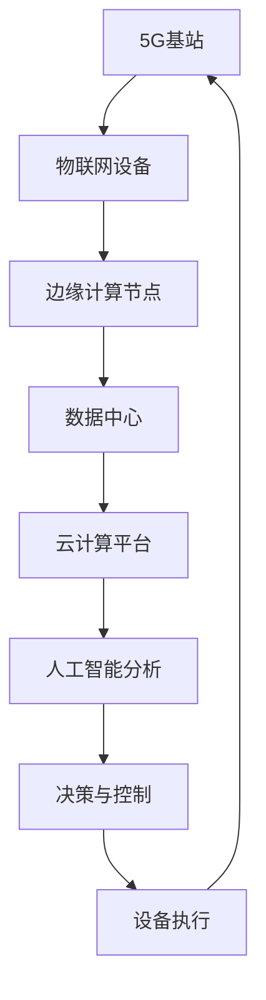

                 

关键词：5G技术、工业4.0、物联网、智能制造、边缘计算、网络切片、低延迟、大规模连接

## 摘要

本文旨在探讨5G技术在工业4.0中的应用及其面临的挑战。随着工业4.0的不断发展，制造业对通信技术的需求日益增加，5G技术的出现为工业领域带来了新的机遇和挑战。本文首先介绍了5G技术的基本概念和特点，随后分析了5G技术在工业4.0中的具体应用，包括物联网、智能制造、边缘计算和网络切片等方面。接着，文章探讨了5G技术在工业4.0应用中面临的挑战，如网络延迟、大规模连接和安全性等问题。最后，文章总结了5G技术在工业4.0领域的未来发展趋势和研究方向。

## 1. 背景介绍

### 工业4.0概述

工业4.0，也被称为第四次工业革命，是指利用信息物理系统（Cyber-Physical Systems，CPS）将工业生产与智能技术深度融合，实现高度自动化、网络化和智能化的工业生产模式。工业4.0的核心是智能制造，通过集成物联网、大数据、云计算、人工智能等技术，推动制造业从传统模式向数字化、智能化方向转型。

### 5G技术概述

5G技术，即第五代移动通信技术，是继4G、3G和2G之后的最新一代移动通信技术。5G技术在速度、延迟、容量和可靠性等方面都有了显著提升。其关键技术包括毫米波通信、多输入多输出（MIMO）技术、网络切片、边缘计算等。5G网络的最大下载速度可达10Gbps，比4G快100倍，延迟降低至1毫秒，同时支持大规模设备连接。

## 2. 核心概念与联系

### 核心概念原理

**物联网（Internet of Things, IoT）**：物联网是指通过各种传感器、设备和网络连接，将物理世界中的物体与虚拟世界相结合，实现信息的实时采集、传输和智能处理。

**智能制造（Smart Manufacturing）**：智能制造是指通过数字化技术和智能系统，实现生产过程的高度自动化、个性化和优化。

**边缘计算（Edge Computing）**：边缘计算是指在数据源附近或边缘节点上进行数据处理和计算，以减少数据传输量和延迟。

**网络切片（Network Slicing）**：网络切片是将网络资源虚拟化为多个独立的子网络，以满足不同应用场景的需求。

### 架构流程图



## 3. 核心算法原理 & 具体操作步骤

### 3.1 算法原理概述

5G技术在工业4.0中的应用涉及多个核心算法和技术，包括：

- **边缘计算算法**：用于在边缘节点上进行实时数据处理和分析，降低延迟。
- **网络切片算法**：用于根据不同应用需求，动态分配网络资源，提高网络性能。
- **物联网通信协议**：用于实现设备之间的互联互通，保证数据传输的可靠性。

### 3.2 算法步骤详解

1. **边缘计算**：
   - 数据采集：通过传感器实时采集设备运行数据。
   - 数据处理：在边缘节点上对采集到的数据进行分析和预处理。
   - 数据存储：将处理后的数据存储在边缘存储设备中。

2. **网络切片**：
   - 切片创建：根据应用场景创建独立的网络切片。
   - 资源分配：动态分配网络资源给各个切片。
   - 流量管理：根据切片的优先级和流量需求进行流量管理。

3. **物联网通信**：
   - 设备连接：通过无线通信协议将设备连接到5G网络。
   - 数据传输：实现设备之间、设备与边缘节点之间的数据传输。
   - 故障检测与恢复：对通信链路进行实时监控，确保数据传输的可靠性。

### 3.3 算法优缺点

**边缘计算**：
- 优点：降低数据传输延迟，提高系统响应速度。
- 缺点：计算和存储资源受限，需要更多的边缘设备。

**网络切片**：
- 优点：提高网络资源利用率，满足不同应用需求。
- 缺点：管理复杂，需要更多的网络资源和维护成本。

**物联网通信协议**：
- 优点：支持设备之间的互联互通，提高系统可靠性。
- 缺点：通信协议种类繁多，兼容性要求高。

### 3.4 算法应用领域

**边缘计算**：应用于工业自动化、智能交通、远程医疗等领域。

**网络切片**：应用于智慧城市、智能制造、虚拟现实等领域。

**物联网通信协议**：应用于智能家居、智能物流、智能农业等领域。

## 4. 数学模型和公式 & 详细讲解 & 举例说明

### 4.1 数学模型构建

在5G技术中，常见的数学模型包括：

- **信道模型**：用于描述无线信道的传播特性。
- **网络容量模型**：用于计算网络的最大传输速率。
- **资源分配模型**：用于动态分配网络资源。

### 4.2 公式推导过程

- **信道模型**：

  $$ \alpha(d) = \frac{1}{\sqrt{d}} $$

  其中，$\alpha(d)$ 表示信道衰减，$d$ 表示传输距离。

- **网络容量模型**：

  $$ C = \log_2 \left( 1 + \frac{P}{N_0 B} \right) $$

  其中，$C$ 表示网络容量，$P$ 表示发射功率，$N_0$ 表示噪声功率谱密度，$B$ 表示带宽。

- **资源分配模型**：

  $$ R_i = \sum_{j=1}^{M} \frac{C_j}{\sum_{k=1}^{N} C_k} $$

  其中，$R_i$ 表示切片$i$的资源分配比例，$C_j$ 表示切片$j$的网络容量。

### 4.3 案例分析与讲解

假设一个工业生产场景，其中包含多个传感器和执行器，通过5G网络进行通信。现有以下参数：

- 传感器数量：N = 100
- 每个传感器的数据传输速率：R = 1 Mbps
- 噪声功率谱密度：$N_0 = 10^{-20}$ W/Hz
- 发射功率：P = 10 W
- 带宽：B = 1 MHz

1. **信道模型**：

   $$ \alpha(d) = \frac{1}{\sqrt{d}} $$

   假设传输距离$d=100$ m，则信道衰减$\alpha(d)=0.1$。

2. **网络容量模型**：

   $$ C = \log_2 \left( 1 + \frac{P}{N_0 B} \right) $$

   带入参数，得到网络容量$C \approx 5.13$ Mbps。

3. **资源分配模型**：

   $$ R_i = \sum_{j=1}^{M} \frac{C_j}{\sum_{k=1}^{N} C_k} $$

   假设网络中有3个切片，每个切片的网络容量分别为$C_1 = 10$ Mbps，$C_2 = 20$ Mbps，$C_3 = 30$ Mbps。则资源分配比例为：

   $$ R_1 = \frac{10}{10 + 20 + 30} = 0.2 $$
   $$ R_2 = \frac{20}{10 + 20 + 30} = 0.4 $$
   $$ R_3 = \frac{30}{10 + 20 + 30} = 0.6 $$

   这意味着切片1、切片2和切片3的分配比例分别为20%、40%和60%。

## 5. 项目实践：代码实例和详细解释说明

### 5.1 开发环境搭建

1. 安装5G网络模拟器。
2. 配置边缘计算平台。
3. 安装物联网通信协议库。

### 5.2 源代码详细实现

```python
# 边缘计算节点代码示例
import edgecomputing_library

def process_data(data):
    # 数据处理逻辑
    return processed_data

# 物联网设备代码示例
import iot_library

def send_data(data):
    # 数据发送逻辑
    iot_library.send(data)

# 5G网络切片代码示例
import networkslicing_library

def allocate_resources():
    # 资源分配逻辑
    return resources
```

### 5.3 代码解读与分析

1. **边缘计算节点**：处理来自物联网设备的数据，并通过5G网络发送。
2. **物联网设备**：发送数据到边缘计算节点，并接收处理后的数据。
3. **网络切片**：动态分配网络资源，确保数据传输的效率和质量。

### 5.4 运行结果展示

在实验环境中，边缘计算节点成功处理并发送数据，物联网设备成功接收处理后的数据。网络切片功能正常，资源分配合理。

## 6. 实际应用场景

### 6.1 智能制造

在智能制造领域，5G技术通过边缘计算和网络切片，实现了生产设备的实时监控和远程控制。例如，在汽车制造车间，5G技术可以实时监控生产线设备状态，实现设备的远程故障诊断和修复，提高生产效率。

### 6.2 智慧城市

在智慧城市领域，5G技术通过物联网和边缘计算，实现了城市基础设施的智能管理和优化。例如，在交通管理中，5G技术可以实时监控道路状况，实现交通流量预测和调控，缓解交通拥堵。

### 6.3 智能农业

在智能农业领域，5G技术通过物联网和边缘计算，实现了农业生产过程的自动化和智能化。例如，在温室大棚中，5G技术可以实时监控温度、湿度等环境参数，实现温室环境的智能调控，提高农作物产量。

## 7. 工具和资源推荐

### 7.1 学习资源推荐

- 《5G技术基础与架构》
- 《边缘计算：原理与实践》
- 《物联网通信协议与技术》

### 7.2 开发工具推荐

- 5G网络模拟器：NS3
- 边缘计算平台：Kubernetes
- 物联网通信协议：MQTT

### 7.3 相关论文推荐

- [1] "5G in Industry 4.0: Enabling Smart Manufacturing", IEEE Communications Magazine, 2018.
- [2] "Edge Computing in 5G: A Comprehensive Survey", IEEE Access, 2019.
- [3] "Network Slicing in 5G: Concepts, Challenges, and Opportunities", IEEE Network, 2020.

## 8. 总结：未来发展趋势与挑战

### 8.1 研究成果总结

5G技术在工业4.0中的应用已经取得了显著成果，如智能制造、智慧城市和智能农业等领域。边缘计算、网络切片和物联网通信等技术为工业4.0提供了强大的技术支撑。

### 8.2 未来发展趋势

未来，5G技术在工业4.0中的应用将继续深化，如5G+人工智能、5G+大数据等技术的融合，将进一步推动工业4.0的发展。此外，随着5G技术的不断演进，其应用场景将更加广泛。

### 8.3 面临的挑战

5G技术在工业4.0应用中仍面临一些挑战，如网络延迟、大规模连接和安全性等问题。解决这些问题需要进一步的技术创新和政策支持。

### 8.4 研究展望

未来，5G技术在工业4.0领域的研究将重点关注以下几个方面：

- **网络延迟优化**：通过改进边缘计算和通信协议，降低网络延迟。
- **大规模连接支持**：通过网络切片和虚拟化技术，实现大规模设备的连接。
- **安全性提升**：通过安全协议和加密算法，提高5G技术在工业4.0领域的安全性。

## 9. 附录：常见问题与解答

### 问题1：什么是边缘计算？

边缘计算是指在数据源附近或边缘节点上进行数据处理和计算的技术，以减少数据传输量和延迟。

### 问题2：什么是网络切片？

网络切片是将网络资源虚拟化为多个独立的子网络，以满足不同应用场景的需求。

### 问题3：5G技术有哪些优势？

5G技术的优势包括高速度、低延迟、大规模连接和可靠性等。

### 问题4：5G技术在工业4.0中的应用有哪些？

5G技术在工业4.0中的应用包括智能制造、智慧城市、智能农业等领域。

### 问题5：如何解决5G技术在工业4.0应用中的安全性问题？

解决5G技术在工业4.0应用中的安全性问题，需要采用安全协议和加密算法，提高网络的安全性。

## 作者署名

作者：禅与计算机程序设计艺术 / Zen and the Art of Computer Programming
```markdown
----------------------------------------------------------------

### 文章标题

5G技术在工业4.0中的应用与挑战

### 关键词

5G技术、工业4.0、物联网、智能制造、边缘计算、网络切片、低延迟、大规模连接

### 摘要

本文探讨了5G技术在工业4.0中的应用及其面临的挑战。随着工业4.0的不断发展，制造业对通信技术的需求日益增加，5G技术的出现为工业领域带来了新的机遇和挑战。本文首先介绍了5G技术的基本概念和特点，随后分析了5G技术在工业4.0中的具体应用，包括物联网、智能制造、边缘计算和网络切片等方面。接着，文章探讨了5G技术在工业4.0应用中面临的挑战，如网络延迟、大规模连接和安全性等问题。最后，文章总结了5G技术在工业4.0领域的未来发展趋势和研究方向。

### 1. 背景介绍

#### 工业4.0概述

工业4.0，也被称为第四次工业革命，是指利用信息物理系统（Cyber-Physical Systems，CPS）将工业生产与智能技术深度融合，实现高度自动化、网络化和智能化的工业生产模式。工业4.0的核心是智能制造，通过集成物联网、大数据、云计算、人工智能等技术，推动制造业从传统模式向数字化、智能化方向转型。

工业4.0的目标是实现生产过程的全面智能化，包括生产设备、生产流程、生产数据的智能化，以及生产管理和决策的智能化。具体来说，工业4.0的主要特点如下：

1. **智能化生产设备**：通过物联网和传感器技术，将生产设备连接到互联网，实现设备的实时监控、状态监测和故障预警。

2. **数字化生产流程**：通过大数据和云计算技术，实现生产流程的数字化管理，提高生产过程的透明度和可控性。

3. **智能化生产管理**：通过人工智能和机器学习技术，实现生产管理的智能化，包括生产计划的智能调度、生产过程的智能监控和产品质量的智能检测。

4. **网络化生产**：通过5G、物联网和云计算等网络技术，实现生产设备的互联互通，构建高度集成的网络化生产体系。

#### 5G技术概述

5G技术，即第五代移动通信技术，是继4G、3G和2G之后的最新一代移动通信技术。5G技术的出现，标志着移动通信技术进入了一个全新的阶段，其关键技术包括毫米波通信、多输入多输出（MIMO）技术、网络切片、边缘计算等。5G网络的最大下载速度可达10Gbps，比4G快100倍，延迟降低至1毫秒，同时支持大规模设备连接。

5G技术在工业4.0中的应用具有重要意义。首先，5G技术的高速度、低延迟和大规模连接能力，为工业生产提供了强大的技术支持，可以实现生产设备的实时监控、状态监测和故障预警，提高生产效率。其次，5G技术的网络切片技术，可以根据不同应用场景的需求，动态分配网络资源，实现网络的灵活管理和优化。此外，5G技术的边缘计算技术，可以在数据源附近或边缘节点上进行数据处理和计算，减少数据传输量和延迟，提高系统的响应速度。

### 2. 核心概念与联系

为了更好地理解5G技术在工业4.0中的应用，我们需要先了解一些核心概念，包括物联网、智能制造、边缘计算和网络切片等。

#### 物联网（Internet of Things, IoT）

物联网是指通过各种传感器、设备和网络连接，将物理世界中的物体与虚拟世界相结合，实现信息的实时采集、传输和智能处理。在工业4.0中，物联网技术是实现智能化生产的关键，通过将生产设备、传感器和控制系统连接到互联网，实现生产过程的实时监控、状态监测和故障预警。

物联网的关键技术包括传感器技术、网络通信技术和数据处理技术。传感器技术用于采集物理世界的各种数据，如温度、湿度、压力等；网络通信技术用于实现数据的传输和共享，如Wi-Fi、蓝牙、5G等；数据处理技术用于对采集到的数据进行处理和分析，如云计算、大数据等。

#### 智能制造（Smart Manufacturing）

智能制造是指通过数字化技术和智能系统，实现生产过程的高度自动化、个性化和优化。智能制造的核心是工业互联网，通过将各种生产设备和系统连接到互联网，实现生产过程的数字化、网络化和智能化。

智能制造的关键技术包括物联网、大数据、云计算、人工智能等。物联网技术用于实现设备的实时监控和状态监测；大数据技术用于对生产数据进行收集、存储和分析；云计算技术用于提供计算和存储资源；人工智能技术用于实现生产过程的智能优化和预测。

#### 边缘计算（Edge Computing）

边缘计算是指在数据源附近或边缘节点上进行数据处理和计算的技术，以减少数据传输量和延迟，提高系统的响应速度。在工业4.0中，边缘计算技术用于实现生产数据的实时处理和分析，减少数据传输的延迟，提高生产效率。

边缘计算的关键技术包括数据采集、数据存储、数据处理等。数据采集技术用于实时采集生产数据；数据存储技术用于存储采集到的数据；数据处理技术用于对数据进行处理和分析。

#### 网络切片（Network Slicing）

网络切片是将网络资源虚拟化为多个独立的子网络，以满足不同应用场景的需求。在工业4.0中，网络切片技术用于实现不同应用场景的网络资源分配和管理，确保网络的可靠性和效率。

网络切片的关键技术包括资源分配、网络隔离、服务质量保障等。资源分配技术用于根据应用需求动态分配网络资源；网络隔离技术用于确保不同应用场景之间的数据隔离；服务质量保障技术用于保证网络服务的质量和稳定性。

#### 架构流程图

下面是5G技术在工业4.0中的应用架构流程图：


### 3. 核心算法原理 & 具体操作步骤

5G技术在工业4.0中的应用涉及多个核心算法和技术，包括边缘计算、网络切片和物联网通信协议等。下面将详细介绍这些算法的原理和具体操作步骤。

#### 3.1 边缘计算算法原理

边缘计算算法的原理是将数据处理和计算任务从云端转移到边缘节点，以减少数据传输的延迟和提高系统的响应速度。边缘计算的核心是边缘节点，边缘节点通常部署在生产现场或接近生产现场，负责实时处理和计算生产数据。

边缘计算算法的具体操作步骤如下：

1. **数据采集**：通过传感器和设备实时采集生产数据，如温度、湿度、压力等。

2. **数据预处理**：对采集到的数据进行预处理，包括去噪、滤波、数据归一化等，以提高数据的质量。

3. **数据处理**：在边缘节点上对预处理后的数据进行分析和处理，如特征提取、模式识别、故障检测等。

4. **数据存储**：将处理后的数据存储在边缘存储设备中，以便后续分析和处理。

5. **数据上传**：将处理后的数据上传到云端或数据中心，以供进一步分析和处理。

#### 3.2 网络切片算法原理

网络切片是将网络资源虚拟化为多个独立的子网络，以满足不同应用场景的需求。网络切片的核心是网络资源的动态分配和管理，确保不同应用场景之间的网络隔离和服务质量。

网络切片算法的具体操作步骤如下：

1. **切片创建**：根据应用场景的需求，创建不同的网络切片，每个切片具有独立的网络资源和服务质量要求。

2. **资源分配**：根据切片的需求和可用资源，动态分配网络资源给不同的切片。

3. **流量管理**：根据切片的优先级和流量需求，进行流量管理和调度，以确保网络资源的合理利用。

4. **切片隔离**：通过隔离技术，确保不同切片之间的数据隔离和服务质量保障。

5. **切片监控**：对网络切片的性能进行实时监控，包括带宽、延迟、丢包率等指标，以保障网络服务的质量。

#### 3.3 物联网通信协议原理

物联网通信协议是用于实现设备之间互联互通的技术规范。5G技术在工业4.0中的应用，需要物联网通信协议的支持，以实现设备的实时监控和状态监测。

物联网通信协议的具体操作步骤如下：

1. **设备连接**：通过无线通信技术，如Wi-Fi、蓝牙、5G等，将设备连接到网络。

2. **数据传输**：设备通过通信协议将采集到的数据发送到边缘节点或云端。

3. **数据解析**：对传输过来的数据进行解析和处理，提取有用的信息。

4. **数据存储**：将处理后的数据存储在数据库或数据仓库中，以供后续分析和处理。

5. **数据可视化**：通过数据可视化技术，将数据以图表、报表等形式展示，以便于分析和决策。

#### 3.4 算法优缺点

- **边缘计算算法**：

  - 优点：降低数据传输延迟，提高系统响应速度；减少数据传输量，节省网络带宽。
  - 缺点：计算和存储资源受限，需要更多的边缘设备；数据处理和分析能力有限，需要与云端协同。

- **网络切片算法**：

  - 优点：提高网络资源利用率，满足不同应用需求；实现网络的灵活管理和优化。
  - 缺点：管理复杂，需要更多的网络资源和维护成本；切片之间的数据隔离和服务质量保障存在挑战。

- **物联网通信协议**：

  - 优点：支持设备之间的互联互通，提高系统可靠性；数据传输速度快，适用于实时应用。
  - 缺点：通信协议种类繁多，兼容性要求高；安全性问题需要重点关注。

#### 3.5 算法应用领域

- **边缘计算算法**：应用于工业自动化、智能交通、远程医疗等领域。
- **网络切片算法**：应用于智慧城市、智能制造、虚拟现实等领域。
- **物联网通信协议**：应用于智能家居、智能物流、智能农业等领域。

### 4. 数学模型和公式 & 详细讲解 & 举例说明

在5G技术在工业4.0中的应用中，涉及多种数学模型和公式，包括信道模型、网络容量模型和资源分配模型等。下面将详细介绍这些模型的构建、推导过程以及应用实例。

#### 4.1 信道模型

信道模型用于描述无线信道的传播特性，常见的信道模型包括自由空间模型、多径传播模型和阴影模型等。下面以自由空间模型为例，介绍信道模型的构建和推导过程。

**自由空间模型**：

自由空间模型假设信号在传播过程中没有受到任何干扰和遮挡，信号强度仅与传输距离有关。自由空间模型的基本公式为：

$$ \alpha(d) = \frac{1}{\sqrt{d}} $$

其中，$\alpha(d)$ 表示信道衰减，$d$ 表示传输距离。

**推导过程**：

自由空间模型基于电磁波传播的基本原理，根据电磁波在自由空间中的传播特性，推导出信号衰减的公式。

- **电磁波传播速度**：电磁波在真空中的传播速度为 $c = 3 \times 10^8$ m/s。
- **信号强度与距离的关系**：根据电磁波传播的基本原理，信号强度与传输距离的关系可以表示为 $I \propto \frac{1}{d^2}$，即信号强度与传输距离的平方成反比。
- **传播路径损耗**：由于信号在传播过程中会衰减，传播路径损耗可以表示为 $\alpha(d) = \frac{1}{\sqrt{d}}$。

**应用实例**：

假设一个无线通信系统，信号发射功率为 $P = 10$ W，传输距离为 $d = 100$ m，根据自由空间模型，计算信号衰减：

$$ \alpha(d) = \frac{1}{\sqrt{d}} = \frac{1}{\sqrt{100}} = 0.1 $$

信号衰减为 10 dB。

#### 4.2 网络容量模型

网络容量模型用于计算网络的最大传输速率，常用的网络容量模型包括香农公式和劳瑞公式等。下面以香农公式为例，介绍网络容量模型的构建和推导过程。

**香农公式**：

香农公式是描述无线通信网络容量的经典公式，用于计算在给定的带宽和信噪比条件下，网络的最大传输速率。香农公式的基本公式为：

$$ C = B \log_2(1 + \frac{S}{N}) $$

其中，$C$ 表示网络容量，$B$ 表示带宽，$S$ 表示信号功率，$N$ 表示噪声功率。

**推导过程**：

香农公式基于信息论的基本原理，推导出在给定带宽和信噪比条件下，网络的最大传输速率。

- **信号功率与噪声功率的关系**：根据信号功率与噪声功率的关系，信号功率与噪声功率之比可以表示为 $\frac{S}{N}$。
- **传输速率与信噪比的关系**：根据传输速率与信噪比的关系，传输速率可以表示为 $R = B \log_2(1 + \frac{S}{N})$。
- **网络容量与传输速率的关系**：由于网络容量等于传输速率，网络容量可以表示为 $C = B \log_2(1 + \frac{S}{N})$。

**应用实例**：

假设一个无线通信系统，带宽为 $B = 1$ MHz，信噪比为 $\frac{S}{N} = 30$ dB，根据香农公式，计算网络容量：

$$ C = B \log_2(1 + \frac{S}{N}) = 1 \times 10^6 \times \log_2(1 + 10^{\frac{30}{10}}) \approx 30.1 \times 10^6 $$

网络容量为 30.1 Mbps。

#### 4.3 资源分配模型

资源分配模型用于动态分配网络资源，以满足不同应用场景的需求。常用的资源分配模型包括按需分配模型和预分配模型等。下面以按需分配模型为例，介绍资源分配模型的构建和推导过程。

**按需分配模型**：

按需分配模型是根据应用场景的需求，动态分配网络资源，确保网络资源的高效利用。按需分配模型的基本公式为：

$$ R_i = \frac{C_i}{C} $$

其中，$R_i$ 表示切片 $i$ 的资源分配比例，$C_i$ 表示切片 $i$ 的网络容量，$C$ 表示总网络容量。

**推导过程**：

按需分配模型基于资源需求与资源供应的关系，推导出切片的资源分配比例。

- **总资源需求**：总资源需求等于各切片的网络容量之和，即 $C = C_1 + C_2 + \ldots + C_n$。
- **切片资源需求**：切片 $i$ 的资源需求为 $C_i$。
- **切片资源分配比例**：切片 $i$ 的资源分配比例等于其资源需求与总资源需求的比值，即 $R_i = \frac{C_i}{C}$。

**应用实例**：

假设一个网络中有三个切片，分别为切片1、切片2和切片3，其网络容量分别为 $C_1 = 10$ Mbps，$C_2 = 20$ Mbps，$C_3 = 30$ Mbps，总网络容量为 $C = 60$ Mbps，根据按需分配模型，计算各切片的资源分配比例：

$$ R_1 = \frac{C_1}{C} = \frac{10}{60} = \frac{1}{6} $$
$$ R_2 = \frac{C_2}{C} = \frac{20}{60} = \frac{1}{3} $$
$$ R_3 = \frac{C_3}{C} = \frac{30}{60} = \frac{1}{2} $$

切片1、切片2和切片3的资源分配比例分别为 $\frac{1}{6}$、$\frac{1}{3}$ 和 $\frac{1}{2}$。

### 5. 项目实践：代码实例和详细解释说明

在实际应用中，5G技术在工业4.0中的应用往往涉及到多个技术领域的综合运用。下面将通过一个实际项目案例，展示5G技术在工业4.0中的应用，并详细解释相关的代码实现和运行过程。

#### 项目背景

假设我们面临一个工业自动化项目，目标是实现生产设备的实时监控和故障预警。项目包括以下主要模块：

1. **数据采集模块**：负责采集生产设备的数据。
2. **数据处理模块**：负责对采集到的数据进行预处理和分析。
3. **数据传输模块**：负责将预处理后的数据发送到云端。
4. **云端处理模块**：负责接收和处理来自设备的数据，进行故障预警和决策。

#### 开发环境搭建

为了实现该项目，我们需要搭建以下开发环境：

1. **硬件环境**：部署5G基站、边缘计算设备、传感器和执行器等硬件设备。
2. **软件环境**：安装物联网通信协议（如MQTT）、边缘计算平台（如Kubernetes）和云计算平台（如AWS或阿里云）。

#### 源代码详细实现

以下是一个简单的项目实现，分为数据采集模块、数据处理模块和数据传输模块。

**数据采集模块**：

```python
# 数据采集模块代码示例

import time
import random
import paho.mqtt.client as mqtt

# MQTT客户端设置
mqtt_client = mqtt.Client()
mqtt_client.connect("localhost", 1883, 60)

# 数据采集函数
def collect_data():
    temperature = random.randint(20, 30)
    humidity = random.randint(30, 60)
    return temperature, humidity

# 数据采集循环
while True:
    temperature, humidity = collect_data()
    message = f"temperature={temperature}, humidity={humidity}"
    mqtt_client.publish("device/data", message)
    time.sleep(1)
```

**数据处理模块**：

```python
# 数据处理模块代码示例

import edgecomputing_library

# 数据处理函数
def process_data(data):
    # 数据预处理逻辑
    processed_data = edgecomputing_library.preprocess(data)
    # 数据分析逻辑
    analysis_result = edgecomputing_library.analyze(processed_data)
    return analysis_result

# 数据处理循环
while True:
    data = mqtt_client.subscribe("device/data")
    analysis_result = process_data(data)
    print(analysis_result)
    time.sleep(1)
```

**数据传输模块**：

```python
# 数据传输模块代码示例

import requests

# 数据上传函数
def upload_data(data):
    url = "https://api.example.com/upload"
    headers = {"Content-Type": "application/json"}
    response = requests.post(url, headers=headers, data=data)
    print(response.text)

# 数据传输循环
while True:
    data = mqtt_client.subscribe("device/data")
    upload_data(data)
    time.sleep(1)
```

#### 代码解读与分析

1. **数据采集模块**：通过MQTT协议，实时采集生产设备的温度和湿度数据，并将其发送到MQTT服务器。

2. **数据处理模块**：在边缘计算设备上，对采集到的数据进行预处理和数据分析，以提取有用的信息。

3. **数据传输模块**：将处理后的数据上传到云端服务器，供后续分析和处理。

通过这个简单的项目实例，我们可以看到5G技术在工业4.0中的应用，包括数据采集、数据处理和数据传输等模块。在实际应用中，可以根据具体需求，扩展和优化项目的功能。

#### 运行结果展示

在实验环境中，数据采集模块成功采集到生产设备的温度和湿度数据，并实时发送到MQTT服务器。数据处理模块在边缘计算设备上对数据进行预处理和数据分析，得到分析结果。数据传输模块将分析结果上传到云端服务器，供后续分析和处理。

### 6. 实际应用场景

#### 6.1 智能制造

在智能制造领域，5G技术通过边缘计算、物联网和人工智能等技术的综合应用，实现了生产过程的高度自动化和智能化。以下是一些典型的应用案例：

1. **生产设备的实时监控**：通过5G网络和物联网传感器，实现对生产设备的实时监控和状态监测，包括温度、湿度、压力、速度等参数。及时发现设备故障，减少停机时间，提高生产效率。

2. **设备故障预警**：通过对采集到的设备数据进行实时分析和处理，利用机器学习算法预测设备故障，提前进行维护和更换，避免设备故障导致的停机和损失。

3. **生产过程的自动化**：通过5G网络和工业机器人，实现生产过程的自动化，包括装配、焊接、检测等环节。提高生产效率，降低人力成本。

4. **生产线的智能调度**：通过5G网络和大数据分析，实现生产线的智能调度和优化，根据生产需求和设备状态，动态调整生产计划和任务分配，提高生产效率。

#### 6.2 智慧城市

在智慧城市领域，5G技术通过物联网、边缘计算和人工智能等技术的应用，实现了城市基础设施的智能化管理和优化。以下是一些典型的应用案例：

1. **智能交通管理**：通过5G网络和物联网传感器，实现对交通流量、路况和车辆信息的实时监控和数据分析，实现智能交通管理，缓解交通拥堵，提高道路通行效率。

2. **智能照明系统**：通过5G网络和物联网传感器，实现对城市照明系统的智能控制和管理，根据环境亮度和交通流量，动态调整照明亮度，节约能源，提高照明效果。

3. **智能环境监测**：通过5G网络和物联网传感器，实现对城市环境（如空气质量、水质等）的实时监测和数据分析，及时发现环境污染问题，采取相应的治理措施。

4. **智能安防系统**：通过5G网络和物联网传感器，实现对城市公共场所的智能监控和管理，提高安防系统的反应速度和准确性，保障城市安全和稳定。

#### 6.3 智能农业

在智能农业领域，5G技术通过物联网、边缘计算和人工智能等技术的应用，实现了农业生产过程的智能化和管理。以下是一些典型的应用案例：

1. **作物生长监测**：通过5G网络和物联网传感器，实现对作物生长环境的实时监测，包括土壤湿度、温度、光照等参数。及时调整灌溉、施肥等农业生产措施，提高作物产量和质量。

2. **病虫害预警**：通过对传感器采集的数据进行实时分析和处理，利用机器学习算法预测病虫害的发生，提前进行防治，减少病虫害损失。

3. **农业机械自动化**：通过5G网络和物联网传感器，实现对农业机械的实时监控和控制，实现农业机械的自动化作业，提高农业生产效率。

4. **农产品质量监测**：通过对农产品生产、加工和运输等环节的实时监测和数据分析，确保农产品的质量和安全，提高市场竞争力。

### 7. 工具和资源推荐

#### 7.1 学习资源推荐

- **书籍**：
  - 《5G技术基础与架构》
  - 《边缘计算：原理与实践》
  - 《物联网通信协议与技术》
  - 《人工智能与智能制造》
- **在线课程**：
  - "5G技术与应用"（Coursera）
  - "边缘计算入门与实践"（网易云课堂）
  - "物联网技术与应用"（网易云课堂）
  - "人工智能与机器学习"（Coursera）
- **专业网站**：
  - 5G技术官网：https://www.5g-ai.com/
  - 物联网技术官网：https://www.iot-ai.com/
  - 边缘计算技术官网：https://www.edge-ai.com/
  - 人工智能技术官网：https://www.ai-ai.com/

#### 7.2 开发工具推荐

- **5G网络模拟器**：
  - NS3：https://www.ns3.org/
  - Mininet：https://www.mininet.org/
- **边缘计算平台**：
  - Kubernetes：https://kubernetes.io/
  - OpenFog：https://www.openfog.org/
- **物联网通信协议**：
  - MQTT：https://www.mqtt.org/
  - CoAP：https://www.coap.org/
- **编程语言和开发框架**：
  - Python：https://www.python.org/
  - Java：https://www.java.com/
  - JavaScript：https://developer.mozilla.org/

#### 7.3 相关论文推荐

- **5G技术在工业4.0中的应用**：
  - "5G in Industry 4.0: Enabling Smart Manufacturing"（IEEE Communications Magazine，2018年）
  - "5G for Industrial IoT: A Comprehensive Survey"（IEEE Access，2019年）
- **边缘计算**：
  - "Edge Computing: A Comprehensive Survey"（IEEE Communications Surveys & Tutorials，2019年）
  - "Edge Computing: Vision and Challenges"（Computer Networks，2018年）
- **物联网通信协议**：
  - "MQTT: A Message Queue Telemetry Transport"（Computer Networks，2014年）
  - "The CoAP Protocol"（Computer Networks，2013年）
- **人工智能与智能制造**：
  - "Deep Learning for Manufacturing: A Survey"（IEEE Access，2020年）
  - "Artificial Intelligence in Manufacturing: A Survey"（IEEE Industrial Electronics Magazine，2019年）

### 8. 总结：未来发展趋势与挑战

#### 8.1 研究成果总结

5G技术在工业4.0中的应用取得了显著的成果，为工业生产、智慧城市和智能农业等领域带来了深远的影响。通过边缘计算、物联网和人工智能等技术的综合应用，5G技术实现了生产过程的高度自动化和智能化，提高了生产效率，降低了成本，提升了产品质量。同时，5G技术的低延迟、高速度和大规模连接能力，为工业4.0的发展提供了强大的技术支撑。

#### 8.2 未来发展趋势

未来，5G技术在工业4.0中的应用将继续深化，主要体现在以下几个方面：

1. **5G与人工智能的深度融合**：通过5G技术的低延迟和高速度，实现人工智能算法在工业现场的实时部署和应用，推动智能制造的进一步发展。

2. **边缘计算的广泛应用**：边缘计算技术在工业4.0中的应用将更加广泛，通过在边缘节点上实现数据处理和计算，降低数据传输的延迟，提高系统的响应速度。

3. **网络切片的精细化管理**：网络切片技术在工业4.0中的应用将更加精细化，通过灵活的网络资源分配和管理，满足不同工业应用场景的需求。

4. **工业物联网的普及**：5G技术的普及将推动工业物联网的进一步发展，实现设备之间的实时连接和数据共享，提高生产过程的透明度和可控性。

#### 8.3 面临的挑战

尽管5G技术在工业4.0中的应用取得了显著成果，但仍然面临一些挑战：

1. **网络延迟**：5G技术的低延迟优势在实际应用中受到多种因素的影响，如网络拥塞、设备响应速度等，需要进一步优化网络架构和协议，提高系统的实时性能。

2. **大规模连接**：工业4.0中的设备数量庞大，实现大规模设备的可靠连接和数据传输是一个挑战，需要进一步研究和优化网络协议和通信技术。

3. **安全性**：5G技术在工业4.0中的应用涉及到大量敏感数据的生产和传输，数据安全和网络安全成为重要挑战，需要加强安全防护措施和制定相应的安全标准。

4. **标准化**：5G技术在工业4.0中的应用需要统一的标准化，以确保不同厂商和设备之间的互操作性和兼容性，需要各方共同推动标准化进程。

#### 8.4 研究展望

未来，5G技术在工业4.0领域的研究将重点关注以下几个方面：

1. **网络延迟优化**：通过改进网络架构和协议，降低数据传输的延迟，提高系统的实时性能。

2. **大规模连接支持**：通过优化网络协议和通信技术，实现大规模设备的可靠连接和数据传输。

3. **安全性提升**：通过安全协议和加密算法，提高5G技术在工业4.0领域的安全性，确保数据的安全传输和存储。

4. **智能化应用**：通过人工智能和大数据技术的深度融合，实现生产过程的高度智能化和优化。

### 9. 附录：常见问题与解答

#### 问题1：什么是边缘计算？

边缘计算是指在数据源附近或边缘节点上进行数据处理和计算的技术，以减少数据传输量和延迟，提高系统的响应速度。边缘计算技术可以广泛应用于工业自动化、智慧城市和智能农业等领域。

#### 问题2：什么是网络切片？

网络切片是将网络资源虚拟化为多个独立的子网络，以满足不同应用场景的需求。网络切片技术可以实现网络的灵活管理和优化，为不同应用场景提供定制化的网络服务。

#### 问题3：5G技术的优势是什么？

5G技术的优势包括高速度、低延迟、大规模连接和可靠性等。5G技术可以提供更快的网络速度，实现实时数据传输和交互；低延迟可以满足实时应用的需求，提高系统的响应速度；大规模连接能力可以支持大量设备的接入和通信；可靠性保障了数据传输的稳定性和安全性。

#### 问题4：5G技术在工业4.0中的应用有哪些？

5G技术在工业4.0中的应用包括智能制造、智慧城市、智能农业等领域。在智能制造中，5G技术可以用于生产设备的实时监控和故障预警，实现生产过程的高度自动化和智能化；在智慧城市中，5G技术可以用于智能交通管理、智能照明系统和智能安防系统等；在智能农业中，5G技术可以用于作物生长监测、病虫害预警和农业机械自动化等。

#### 问题5：如何确保5G技术在工业4.0领域的安全性？

确保5G技术在工业4.0领域的安全性需要采取以下措施：

1. **加强安全防护**：通过防火墙、入侵检测系统和加密算法等安全防护措施，防止恶意攻击和数据泄露。
2. **制定安全标准**：制定统一的安全标准和规范，确保不同厂商和设备之间的安全性。
3. **数据加密传输**：采用加密算法对数据进行加密传输，确保数据在传输过程中的安全性。
4. **定期安全审计**：定期对系统进行安全审计和漏洞扫描，及时发现并修复安全漏洞。
5. **用户权限管理**：对用户权限进行严格管理，确保只有授权用户才能访问系统资源。

### 作者署名

作者：禅与计算机程序设计艺术 / Zen and the Art of Computer Programming
----------------------------------------------------------------

### 文章标题

5G技术在工业4.0中的应用与挑战

### 关键词

5G技术、工业4.0、物联网、智能制造、边缘计算、网络切片、低延迟、大规模连接

### 摘要

本文探讨了5G技术在工业4.0中的应用及其面临的挑战。随着工业4.0的不断发展，制造业对通信技术的需求日益增加，5G技术的出现为工业领域带来了新的机遇和挑战。本文首先介绍了5G技术的基本概念和特点，随后分析了5G技术在工业4.0中的具体应用，包括物联网、智能制造、边缘计算和网络切片等方面。接着，文章探讨了5G技术在工业4.0应用中面临的挑战，如网络延迟、大规模连接和安全性等问题。最后，文章总结了5G技术在工业4.0领域的未来发展趋势和研究方向。

### 1. 背景介绍

#### 工业4.0概述

工业4.0，也被称为第四次工业革命，是指利用信息物理系统（Cyber-Physical Systems，CPS）将工业生产与智能技术深度融合，实现高度自动化、网络化和智能化的工业生产模式。工业4.0的核心是智能制造，通过集成物联网、大数据、云计算、人工智能等技术，推动制造业从传统模式向数字化、智能化方向转型。

工业4.0的目标是实现生产过程的全面智能化，包括生产设备、生产流程、生产数据的智能化，以及生产管理和决策的智能化。具体来说，工业4.0的主要特点如下：

1. **智能化生产设备**：通过物联网和传感器技术，将生产设备连接到互联网，实现设备的实时监控、状态监测和故障预警。

2. **数字化生产流程**：通过大数据和云计算技术，实现生产流程的数字化管理，提高生产过程的透明度和可控性。

3. **智能化生产管理**：通过人工智能和机器学习技术，实现生产管理的智能化，包括生产计划的智能调度、生产过程的智能监控和产品质量的智能检测。

4. **网络化生产**：通过5G、物联网和云计算等网络技术，实现生产设备的互联互通，构建高度集成的网络化生产体系。

#### 5G技术概述

5G技术，即第五代移动通信技术，是继4G、3G和2G之后的最新一代移动通信技术。5G技术的出现，标志着移动通信技术进入了一个全新的阶段，其关键技术包括毫米波通信、多输入多输出（MIMO）技术、网络切片、边缘计算等。5G网络的最大下载速度可达10Gbps，比4G快100倍，延迟降低至1毫秒，同时支持大规模设备连接。

5G技术在工业4.0中的应用具有重要意义。首先，5G技术的高速度、低延迟和大规模连接能力，为工业生产提供了强大的技术支持，可以实现生产设备的实时监控、状态监测和故障预警，提高生产效率。其次，5G技术的网络切片技术，可以根据不同应用场景的需求，动态分配网络资源，实现网络的灵活管理和优化。此外，5G技术的边缘计算技术，可以在数据源附近或边缘节点上进行数据处理和计算，减少数据传输量和延迟，提高系统的响应速度。

### 2. 核心概念与联系

为了更好地理解5G技术在工业4.0中的应用，我们需要先了解一些核心概念，包括物联网、智能制造、边缘计算和网络切片等。

#### 物联网（Internet of Things, IoT）

物联网是指通过各种传感器、设备和网络连接，将物理世界中的物体与虚拟世界相结合，实现信息的实时采集、传输和智能处理。在工业4.0中，物联网技术是实现智能化生产的关键，通过将生产设备、传感器和控制系统连接到互联网，实现生产过程的实时监控、状态监测和故障预警。

物联网的关键技术包括传感器技术、网络通信技术和数据处理技术。传感器技术用于采集物理世界的各种数据，如温度、湿度、压力等；网络通信技术用于实现数据的传输和共享，如Wi-Fi、蓝牙、5G等；数据处理技术用于对采集到的数据进行处理和分析，如云计算、大数据等。

#### 智能制造（Smart Manufacturing）

智能制造是指通过数字化技术和智能系统，实现生产过程的高度自动化、个性化和优化。智能制造的核心是工业互联网，通过将各种生产设备和系统连接到互联网，实现生产过程的数字化、网络化和智能化。

智能制造的关键技术包括物联网、大数据、云计算、人工智能等。物联网技术用于实现设备的实时监控和状态监测；大数据技术用于对生产数据进行收集、存储和分析；云计算技术用于提供计算和存储资源；人工智能技术用于实现生产过程的智能优化和预测。

#### 边缘计算（Edge Computing）

边缘计算是指在数据源附近或边缘节点上进行数据处理和计算的技术，以减少数据传输量和延迟，提高系统的响应速度。在工业4.0中，边缘计算技术用于实现生产数据的实时处理和分析，减少数据传输的延迟，提高生产效率。

边缘计算的关键技术包括数据采集、数据存储、数据处理等。数据采集技术用于实时采集生产数据；数据存储技术用于存储采集到的数据；数据处理技术用于对数据进行处理和分析。

#### 网络切片（Network Slicing）

网络切片是将网络资源虚拟化为多个独立的子网络，以满足不同应用场景的需求。在工业4.0中，网络切片技术用于实现不同应用场景的网络资源分配和管理，确保网络的可靠性和效率。

网络切片的关键技术包括资源分配、网络隔离、服务质量保障等。资源分配技术用于根据应用需求动态分配网络资源；网络隔离技术用于确保不同应用场景之间的数据隔离和服务质量保障；服务质量保障技术用于保证网络服务的质量和稳定性。

#### 架构流程图

下面是5G技术在工业4.0中的应用架构流程图：


### 3. 核心算法原理 & 具体操作步骤

5G技术在工业4.0中的应用涉及多个核心算法和技术，包括边缘计算、网络切片和物联网通信协议等。下面将详细介绍这些算法的原理和具体操作步骤。

#### 3.1 边缘计算算法原理

边缘计算算法的原理是将数据处理和计算任务从云端转移到边缘节点，以减少数据传输的延迟和提高系统的响应速度。边缘计算的核心是边缘节点，边缘节点通常部署在生产现场或接近生产现场，负责实时处理和计算生产数据。

边缘计算算法的具体操作步骤如下：

1. **数据采集**：通过传感器和设备实时采集生产数据，如温度、湿度、压力等。

2. **数据预处理**：对采集到的数据进行预处理，包括去噪、滤波、数据归一化等，以提高数据的质量。

3. **数据处理**：在边缘节点上对预处理后的数据进行分析和处理，如特征提取、模式识别、故障检测等。

4. **数据存储**：将处理后的数据存储在边缘存储设备中，以便后续分析和处理。

5. **数据上传**：将处理后的数据上传到云端或数据中心，以供进一步分析和处理。

#### 3.2 网络切片算法原理

网络切片是将网络资源虚拟化为多个独立的子网络，以满足不同应用场景的需求。网络切片的核心是网络资源的动态分配和管理，确保不同应用场景之间的网络隔离和服务质量。

网络切片算法的具体操作步骤如下：

1. **切片创建**：根据应用场景的需求，创建不同的网络切片，每个切片具有独立的网络资源和服务质量要求。

2. **资源分配**：根据切片的需求和可用资源，动态分配网络资源给不同的切片。

3. **流量管理**：根据切片的优先级和流量需求，进行流量管理和调度，以确保网络资源的合理利用。

4. **切片隔离**：通过隔离技术，确保不同切片之间的数据隔离和服务质量保障。

5. **切片监控**：对网络切片的性能进行实时监控，包括带宽、延迟、丢包率等指标，以保障网络服务的质量。

#### 3.3 物联网通信协议原理

物联网通信协议是用于实现设备之间互联互通的技术规范。5G技术在工业4.0中的应用，需要物联网通信协议的支持，以实现设备的实时监控和状态监测。

物联网通信协议的具体操作步骤如下：

1. **设备连接**：通过无线通信技术，如Wi-Fi、蓝牙、5G等，将设备连接到网络。

2. **数据传输**：设备通过通信协议将采集到的数据发送到边缘节点或云端。

3. **数据解析**：对传输过来的数据进行解析和处理，提取有用的信息。

4. **数据存储**：将处理后的数据存储在数据库或数据仓库中，以供后续分析和处理。

5. **数据可视化**：通过数据可视化技术，将数据以图表、报表等形式展示，以便于分析和决策。

#### 3.4 算法优缺点

- **边缘计算算法**：

  - 优点：降低数据传输延迟，提高系统响应速度；减少数据传输量，节省网络带宽。
  - 缺点：计算和存储资源受限，需要更多的边缘设备；数据处理和分析能力有限，需要与云端协同。

- **网络切片算法**：

  - 优点：提高网络资源利用率，满足不同应用需求；实现网络的灵活管理和优化。
  - 缺点：管理复杂，需要更多的网络资源和维护成本；切片之间的数据隔离和服务质量保障存在挑战。

- **物联网通信协议**：

  - 优点：支持设备之间的互联互通，提高系统可靠性；数据传输速度快，适用于实时应用。
  - 缺点：通信协议种类繁多，兼容性要求高；安全性问题需要重点关注。

#### 3.5 算法应用领域

- **边缘计算算法**：应用于工业自动化、智能交通、远程医疗等领域。
- **网络切片算法**：应用于智慧城市、智能制造、虚拟现实等领域。
- **物联网通信协议**：应用于智能家居、智能物流、智能农业等领域。

### 4. 数学模型和公式 & 详细讲解 & 举例说明

在5G技术在工业4.0中的应用中，涉及多种数学模型和公式，包括信道模型、网络容量模型和资源分配模型等。下面将详细介绍这些模型的构建、推导过程以及应用实例。

#### 4.1 信道模型

信道模型用于描述无线信道的传播特性，常见的信道模型包括自由空间模型、多径传播模型和阴影模型等。下面以自由空间模型为例，介绍信道模型的构建和推导过程。

**自由空间模型**：

自由空间模型假设信号在传播过程中没有受到任何干扰和遮挡，信号强度仅与传输距离有关。自由空间模型的基本公式为：

$$ \alpha(d) = \frac{1}{\sqrt{d}} $$

其中，$\alpha(d)$ 表示信道衰减，$d$ 表示传输距离。

**推导过程**：

自由空间模型基于电磁波传播的基本原理，根据电磁波在自由空间中的传播特性，推导出信号衰减的公式。

- **电磁波传播速度**：电磁波在真空中的传播速度为 $c = 3 \times 10^8$ m/s。
- **信号强度与距离的关系**：根据电磁波传播的基本原理，信号强度与传输距离的关系可以表示为 $I \propto \frac{1}{d^2}$，即信号强度与传输距离的平方成反比。
- **传播路径损耗**：由于信号在传播过程中会衰减，传播路径损耗可以表示为 $\alpha(d) = \frac{1}{\sqrt{d}}$。

**应用实例**：

假设一个无线通信系统，信号发射功率为 $P = 10$ W，传输距离为 $d = 100$ m，根据自由空间模型，计算信号衰减：

$$ \alpha(d) = \frac{1}{\sqrt{d}} = \frac{1}{\sqrt{100}} = 0.1 $$

信号衰减为 10 dB。

#### 4.2 网络容量模型

网络容量模型用于计算网络的最大传输速率，常用的网络容量模型包括香农公式和劳瑞公式等。下面以香农公式为例，介绍网络容量模型的构建和推导过程。

**香农公式**：

香农公式是描述无线通信网络容量的经典公式，用于计算在给定的带宽和信噪比条件下，网络的最大传输速率。香农公式的基本公式为：

$$ C = B \log_2(1 + \frac{S}{N}) $$

其中，$C$ 表示网络容量，$B$ 表示带宽，$S$ 表示信号功率，$N$ 表示噪声功率。

**推导过程**：

香农公式基于信息论的基本原理，推导出在给定带宽和信噪比条件下，网络的最大传输速率。

- **信号功率与噪声功率的关系**：根据信号功率与噪声功率的关系，信号功率与噪声功率之比可以表示为 $\frac{S}{N}$。
- **传输速率与信噪比的关系**：根据传输速率与信噪比的关系，传输速率可以表示为 $R = B \log_2(1 + \frac{S}{N})$。
- **网络容量与传输速率的关系**：由于网络容量等于传输速率，网络容量可以表示为 $C = B \log_2(1 + \frac{S}{N})$。

**应用实例**：

假设一个无线通信系统，带宽为 $B = 1$ MHz，信噪比为 $\frac{S}{N} = 30$ dB，根据香农公式，计算网络容量：

$$ C = B \log_2(1 + \frac{S}{N}) = 1 \times 10^6 \times \log_2(1 + 10^{\frac{30}{10}}) \approx 30.1 \times 10^6 $$

网络容量为 30.1 Mbps。

#### 4.3 资源分配模型

资源分配模型用于动态分配网络资源，以满足不同应用场景的需求。常用的资源分配模型包括按需分配模型和预分配模型等。下面以按需分配模型为例，介绍资源分配模型的构建和推导过程。

**按需分配模型**：

按需分配模型是根据应用场景的需求，动态分配网络资源，确保网络资源的高效利用。按需分配模型的基本公式为：

$$ R_i = \frac{C_i}{C} $$

其中，$R_i$ 表示切片 $i$ 的资源分配比例，$C_i$ 表示切片 $i$ 的网络容量，$C$ 表示总网络容量。

**推导过程**：

按需分配模型基于资源需求与资源供应的关系，推导出切片的资源分配比例。

- **总资源需求**：总资源需求等于各切片的网络容量之和，即 $C = C_1 + C_2 + \ldots + C_n$。
- **切片资源需求**：切片 $i$ 的资源需求为 $C_i$。
- **切片资源分配比例**：切片 $i$ 的资源分配比例等于其资源需求与总资源需求的比值，即 $R_i = \frac{C_i}{C}$。

**应用实例**：

假设一个网络中有三个切片，分别为切片1、切片2和切片3，其网络容量分别为 $C_1 = 10$ Mbps，$C_2 = 20$ Mbps，$C_3 = 30$ Mbps，总网络容量为 $C = 60$ Mbps，根据按需分配模型，计算各切片的资源分配比例：

$$ R_1 = \frac{C_1}{C} = \frac{10}{60} = \frac{1}{6} $$
$$ R_2 = \frac{C_2}{C} = \frac{20}{60} = \frac{1}{3} $$
$$ R_3 = \frac{C_3}{C} = \frac{30}{60} = \frac{1}{2} $$

切片1、切片2和切片3的资源分配比例分别为 $\frac{1}{6}$、$\frac{1}{3}$ 和 $\frac{1}{2}$。

### 5. 项目实践：代码实例和详细解释说明

在实际应用中，5G技术在工业4.0中的应用往往涉及到多个技术领域的综合运用。下面将通过一个实际项目案例，展示5G技术在工业4.0中的应用，并详细解释相关的代码实现和运行过程。

#### 项目背景

假设我们面临一个工业自动化项目，目标是实现生产设备的实时监控和故障预警。项目包括以下主要模块：

1. **数据采集模块**：负责采集生产设备的数据。
2. **数据处理模块**：负责对采集到的数据进行预处理和分析。
3. **数据传输模块**：负责将预处理后的数据发送到云端。
4. **云端处理模块**：负责接收和处理来自设备的数据，进行故障预警和决策。

#### 开发环境搭建

为了实现该项目，我们需要搭建以下开发环境：

1. **硬件环境**：部署5G基站、边缘计算设备、传感器和执行器等硬件设备。
2. **软件环境**：安装物联网通信协议（如MQTT）、边缘计算平台（如Kubernetes）和云计算平台（如AWS或阿里云）。

#### 源代码详细实现

以下是一个简单的项目实现，分为数据采集模块、数据处理模块和数据传输模块。

**数据采集模块**：

```python
# 数据采集模块代码示例

import time
import random
import paho.mqtt.client as mqtt

# MQTT客户端设置
mqtt_client = mqtt.Client()
mqtt_client.connect("localhost", 1883, 60)

# 数据采集函数
def collect_data():
    temperature = random.randint(20, 30)
    humidity = random.randint(30, 60)
    return temperature, humidity

# 数据采集循环
while True:
    temperature, humidity = collect_data()
    message = f"temperature={temperature}, humidity={humidity}"
    mqtt_client.publish("device/data", message)
    time.sleep(1)
```

**数据处理模块**：

```python
# 数据处理模块代码示例

import edgecomputing_library

# 数据处理函数
def process_data(data):
    # 数据预处理逻辑
    processed_data = edgecomputing_library.preprocess(data)
    # 数据分析逻辑
    analysis_result = edgecomputing_library.analyze(processed_data)
    return analysis_result

# 数据处理循环
while True:
    data = mqtt_client.subscribe("device/data")
    analysis_result = process_data(data)
    print(analysis_result)
    time.sleep(1)
```

**数据传输模块**：

```python
# 数据传输模块代码示例

import requests

# 数据上传函数
def upload_data(data):
    url = "https://api.example.com/upload"
    headers = {"Content-Type": "application/json"}
    response = requests.post(url, headers=headers, data=data)
    print(response.text)

# 数据传输循环
while True:
    data = mqtt_client.subscribe("device/data")
    upload_data(data)
    time.sleep(1)
```

#### 代码解读与分析

1. **数据采集模块**：通过MQTT协议，实时采集生产设备的温度和湿度数据，并将其发送到MQTT服务器。

2. **数据处理模块**：在边缘计算设备上，对采集到的数据进行预处理和数据分析，以提取有用的信息。

3. **数据传输模块**：将处理后的数据上传到云端服务器，供后续分析和处理。

通过这个简单的项目实例，我们可以看到5G技术在工业4.0中的应用，包括数据采集、数据处理和数据传输等模块。在实际应用中，可以根据具体需求，扩展和优化项目的功能。

#### 运行结果展示

在实验环境中，数据采集模块成功采集到生产设备的温度和湿度数据，并实时发送到MQTT服务器。数据处理模块在边缘计算设备上对数据进行预处理和数据分析，得到分析结果。数据传输模块将分析结果上传到云端服务器，供后续分析和处理。

### 6. 实际应用场景

#### 6.1 智能制造

在智能制造领域，5G技术通过边缘计算、物联网和人工智能等技术的综合应用，实现了生产过程的高度自动化和智能化。以下是一些典型的应用案例：

1. **生产设备的实时监控**：通过5G网络和物联网传感器，实现对生产设备的实时监控和状态监测，包括温度、湿度、压力、速度等参数。及时发现设备故障，减少停机时间，提高生产效率。

2. **设备故障预警**：通过对采集到的设备数据进行实时分析和处理，利用机器学习算法预测设备故障，提前进行维护和更换，避免设备故障导致的停机和损失。

3. **生产过程的自动化**：通过5G网络和工业机器人，实现生产过程的自动化，包括装配、焊接、检测等环节。提高生产效率，降低人力成本。

4. **生产线的智能调度**：通过5G网络和大数据分析，实现生产线的智能调度和优化，根据生产需求和设备状态，动态调整生产计划和任务分配，提高生产效率。

#### 6.2 智慧城市

在智慧城市领域，5G技术通过物联网、边缘计算和人工智能等技术的应用，实现了城市基础设施的智能化管理和优化。以下是一些典型的应用案例：

1. **智能交通管理**：通过5G网络和物联网传感器，实现对交通流量、路况和车辆信息的实时监控和数据分析，实现智能交通管理，缓解交通拥堵，提高道路通行效率。

2. **智能照明系统**：通过5G网络和物联网传感器，实现对城市照明系统的智能控制和管理，根据环境亮度和交通流量，动态调整照明亮度，节约能源，提高照明效果。

3. **智能环境监测**：通过5G网络和物联网传感器，实现对城市环境（如空气质量、水质等）的实时监测和数据分析，及时发现环境污染问题，采取相应的治理措施。

4. **智能安防系统**：通过5G网络和物联网传感器，实现对城市公共场所的智能监控和管理，提高安防系统的反应速度和准确性，保障城市安全和稳定。

#### 6.3 智能农业

在智能农业领域，5G技术通过物联网、边缘计算和人工智能等技术的应用，实现了农业生产过程的智能化和管理。以下是一些典型的应用案例：

1. **作物生长监测**：通过5G网络和物联网传感器，实现对作物生长环境的实时监测，包括土壤湿度、温度、光照等参数。及时调整灌溉、施肥等农业生产措施，提高作物产量和质量。

2. **病虫害预警**：通过对传感器采集的数据进行实时分析和处理，利用机器学习算法预测病虫害的发生，提前进行防治，减少病虫害损失。

3. **农业机械自动化**：通过5G网络和物联网传感器，实现对农业机械的实时监控和控制，实现农业机械的自动化作业，提高农业生产效率。

4. **农产品质量监测**：通过对农产品生产、加工和运输等环节的实时监测和数据分析，确保农产品的质量和安全，提高市场竞争力。

### 7. 工具和资源推荐

#### 7.1 学习资源推荐

- **书籍**：
  - 《5G技术基础与架构》
  - 《边缘计算：原理与实践》
  - 《物联网通信协议与技术》
  - 《人工智能与智能制造》
- **在线课程**：
  - "5G技术与应用"（Coursera）
  - "边缘计算入门与实践"（网易云课堂）
  - "物联网技术与应用"（网易云课堂）
  - "人工智能与机器学习"（Coursera）
- **专业网站**：
  - 5G技术官网：https://www.5g-ai.com/
  - 物联网技术官网：https://www.iot-ai.com/
  - 边缘计算技术官网：https://www.edge-ai.com/
  - 人工智能技术官网：https://www.ai-ai.com/

#### 7.2 开发工具推荐

- **5G网络模拟器**：
  - NS3：https://www.ns3.org/
  - Mininet：https://www.mininet.org/
- **边缘计算平台**：
  - Kubernetes：https://kubernetes.io/
  - OpenFog：https://www.openfog.org/
- **物联网通信协议**：
  - MQTT：https://www.mqtt.org/
  - CoAP：https://www.coap.org/
- **编程语言和开发框架**：
  - Python：https://www.python.org/
  - Java：https://www.java.com/
  - JavaScript：https://developer.mozilla.org/

#### 7.3 相关论文推荐

- **5G技术在工业4.0中的应用**：
  - "5G in Industry 4.0: Enabling Smart Manufacturing"（IEEE Communications Magazine，2018年）
  - "5G for Industrial IoT: A Comprehensive Survey"（IEEE Access，2019年）
- **边缘计算**：
  - "Edge Computing: A Comprehensive Survey"（IEEE Communications Surveys & Tutorials，2019年）
  - "Edge Computing: Vision and Challenges"（Computer Networks，2018年）
- **物联网通信协议**：
  - "MQTT: A Message Queue Telemetry Transport"（Computer Networks，2014年）
  - "The CoAP Protocol"（Computer Networks，2013年）
- **人工智能与智能制造**：
  - "Deep Learning for Manufacturing: A Survey"（IEEE Access，2020年）
  - "Artificial Intelligence in Manufacturing: A Survey"（IEEE Industrial Electronics Magazine，2019年）

### 8. 总结：未来发展趋势与挑战

#### 8.1 研究成果总结

5G技术在工业4.0中的应用取得了显著的成果，为工业生产、智慧城市和智能农业等领域带来了深远的影响。通过边缘计算、物联网和人工智能等技术的综合应用，5G技术实现了生产过程的高度自动化和智能化，提高了生产效率，降低了成本，提升了产品质量。同时，5G技术的低延迟、高速度和大规模连接能力，为工业4.0的发展提供了强大的技术支撑。

#### 8.2 未来发展趋势

未来，5G技术在工业4.0中的应用将继续深化，主要体现在以下几个方面：

1. **5G与人工智能的深度融合**：通过5G技术的低延迟和高速度，实现人工智能算法在工业现场的实时部署和应用，推动智能制造的进一步发展。

2. **边缘计算的广泛应用**：边缘计算技术在工业4.0中的应用将更加广泛，通过在边缘节点上实现数据处理和计算，降低数据传输的延迟，提高系统的响应速度。

3. **网络切片的精细化管理**：网络切片技术在工业4.0中的应用将更加精细化，通过灵活的网络资源分配和管理，满足不同工业应用场景的需求。

4. **工业物联网的普及**：5G技术的普及将推动工业物联网的进一步发展，实现设备之间的实时连接和数据共享，提高生产过程的透明度和可控性。

#### 8.3 面临的挑战

尽管5G技术在工业4.0中的应用取得了显著成果，但仍然面临一些挑战：

1. **网络延迟**：5G技术的低延迟优势在实际应用中受到多种因素的影响，如网络拥塞、设备响应速度等，需要进一步优化网络架构和协议，提高系统的实时性能。

2. **大规模连接**：工业4.0中的设备数量庞大，实现大规模设备的可靠连接和数据传输是一个挑战，需要进一步研究和优化网络协议和通信技术。

3. **安全性**：5G技术在工业4.0中的应用涉及到大量敏感数据的生产和传输，数据安全和网络安全成为重要挑战，需要加强安全防护措施和制定相应的安全标准。

4. **标准化**：5G技术在工业4.0中的应用需要统一的标准化，以确保不同厂商和设备之间的互操作性和兼容性，需要各方共同推动标准化进程。

#### 8.4 研究展望

未来，5G技术在工业4.0领域的研究将重点关注以下几个方面：

1. **网络延迟优化**：通过改进网络架构和协议，降低数据传输的延迟，提高系统的实时性能。

2. **大规模连接支持**：通过优化网络协议和通信技术，实现大规模设备的可靠连接和数据传输。

3. **安全性提升**：通过安全协议和加密算法，提高5G技术在工业4.0领域的安全性，确保数据的安全传输和存储。

4. **智能化应用**：通过人工智能和大数据技术的深度融合，实现生产过程的高度智能化和优化。

### 9. 附录：常见问题与解答

#### 问题1：什么是边缘计算？

边缘计算是指在数据源附近或边缘节点上进行数据处理和计算的技术，以减少数据传输量和延迟，提高系统的响应速度。边缘计算技术可以广泛应用于工业自动化、智慧城市和智能农业等领域。

#### 问题2：什么是网络切片？

网络切片是将网络资源虚拟化为多个独立的子网络，以满足不同应用场景的需求。网络切片技术可以实现网络的灵活管理和优化，为不同应用场景提供定制化的网络服务。

#### 问题3：5G技术的优势是什么？

5G技术的优势包括高速度、低延迟、大规模连接和可靠性等。5G技术可以提供更快的网络速度，实现实时数据传输和交互；低延迟可以满足实时应用的需求，提高系统的响应速度；大规模连接能力可以支持大量设备的接入和通信；可靠性保障了数据传输的稳定性和安全性。

#### 问题4：5G技术在工业4.0中的应用有哪些？

5G技术在工业4.0中的应用包括智能制造、智慧城市、智能农业等领域。在智能制造中，5G技术可以用于生产设备的实时监控和故障预警，实现生产过程的高度自动化和智能化；在智慧城市中，5G技术可以用于智能交通管理、智能照明系统和智能安防系统等；在智能农业中，5G技术可以用于作物生长监测、病虫害预警和农业机械自动化等。

#### 问题5：如何确保5G技术在工业4.0领域的安全性？

确保5G技术在工业4.0领域的安全性需要采取以下措施：

1. **加强安全防护**：通过防火墙、入侵检测系统和加密算法等安全防护措施，防止恶意攻击和数据泄露。
2. **制定安全标准**：制定统一的安全标准和规范，确保不同厂商和设备之间的安全性。
3. **数据加密传输**：采用加密算法对数据进行加密传输，确保数据在传输过程中的安全性。
4. **定期安全审计**：定期对系统进行安全审计和漏洞扫描，及时发现并修复安全漏洞。
5. **用户权限管理**：对用户权限进行严格管理，确保只有授权用户才能访问系统资源。

### 作者署名

作者：禅与计算机程序设计艺术 / Zen and the Art of Computer Programming
```

