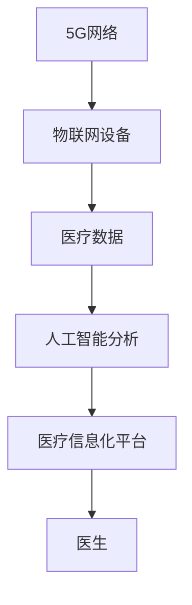

                 

关键词：5G技术、远程医疗、物联网、人工智能、医疗信息化

## 摘要

随着5G技术的迅猛发展，远程医疗正逐渐成为医疗领域的重要发展方向。本文从5G技术的核心优势出发，探讨了其在远程医疗中的广泛应用，特别是在突破地理限制方面的优势。文章将通过具体案例分析，阐述5G技术在远程医疗中的实现原理、应用场景和未来发展趋势，为我国远程医疗的发展提供有益的参考。

## 1. 背景介绍

### 1.1 远程医疗的现状

远程医疗，即通过信息技术的手段，实现医疗资源的远程共享和服务。随着互联网技术的不断发展，远程医疗逐渐成为医疗行业的新兴领域。然而，传统的远程医疗技术存在一定的局限性，主要体现在传输速度、带宽和稳定性方面。这些限制使得远程医疗的应用受到了很大的影响。

### 1.2 5G技术的核心优势

5G技术作为新一代移动通信技术，具有高速度、低延迟、大连接和广覆盖等核心优势。与4G相比，5G的峰值下载速度可以达到10Gbps，延迟降低至1ms，这些特点使得5G技术在远程医疗中的应用具有极大的潜力。

## 2. 核心概念与联系

### 2.1 5G技术在远程医疗中的应用原理

5G技术在远程医疗中的应用，主要是通过物联网、人工智能和医疗信息化的深度融合，实现医疗资源的远程共享和服务。其核心原理如下：

1. **物联网（IoT）**: 通过物联网技术，将医疗设备、传感器和数据采集设备连接起来，实现医疗数据的实时传输和共享。
2. **人工智能（AI）**: 利用人工智能技术，对医疗数据进行分析和处理，为医生提供诊断和治疗方案的支持。
3. **医疗信息化**: 通过建立医疗信息化平台，实现医疗资源的统一管理和调度，提高医疗服务的效率和便捷性。

### 2.2 5G技术在远程医疗中的架构图



## 3. 核心算法原理 & 具体操作步骤

### 3.1 算法原理概述

5G技术在远程医疗中的核心算法主要包括物联网传输算法、人工智能分析算法和医疗信息化平台调度算法。这些算法相互配合，共同实现远程医疗的实时性、准确性和高效性。

### 3.2 算法步骤详解

1. **物联网传输算法**: 通过物联网技术，实现医疗设备的实时数据采集和传输。主要步骤包括：
   - 数据采集：医疗设备采集生理参数、影像资料等。
   - 数据传输：通过5G网络，将医疗数据实时传输到医疗信息化平台。

2. **人工智能分析算法**: 对医疗数据进行处理和分析，为医生提供诊断和治疗方案。主要步骤包括：
   - 数据预处理：对采集的医疗数据进行分析和清洗。
   - 模型训练：利用机器学习技术，训练医疗数据分析模型。
   - 数据分析：对医疗数据进行分析，提供诊断和治疗方案。

3. **医疗信息化平台调度算法**: 对医疗资源进行统一管理和调度，提高医疗服务的效率和便捷性。主要步骤包括：
   - 资源调度：根据患者的需求，分配医生和医疗资源。
   - 通信调度：确保医疗数据的实时传输和共享。

### 3.3 算法优缺点

1. **物联网传输算法**:
   - 优点：实时性高，数据传输速度快。
   - 缺点：对网络环境要求较高，可能受到网络波动的影响。

2. **人工智能分析算法**:
   - 优点：准确性高，可以为医生提供有力的支持。
   - 缺点：对数据量和数据质量要求较高，需要大量训练数据。

3. **医疗信息化平台调度算法**:
   - 优点：提高医疗资源利用效率，提升医疗服务质量。
   - 缺点：对平台性能要求较高，需要稳定的运行环境。

### 3.4 算法应用领域

5G技术在远程医疗中的应用领域广泛，主要包括：

1. **远程诊断**：通过5G网络和物联网技术，实现患者数据的实时传输和分析，为医生提供远程诊断支持。
2. **远程手术**：利用5G网络的低延迟和高速度，实现远程手术操作，突破地理限制。
3. **健康管理**：通过物联网设备和人工智能技术，实现患者的实时健康管理，提供个性化健康建议。

## 4. 数学模型和公式 & 详细讲解 & 举例说明

### 4.1 数学模型构建

5G技术在远程医疗中的数学模型主要包括物联网传输模型、人工智能分析模型和医疗信息化平台调度模型。以下是这些模型的构建：

1. **物联网传输模型**:
   - 数据传输速率：\( R = f(\lambda, N) \)
     - \( \lambda \): 数据传输频率
     - \( N \): 数据传输节点数量

2. **人工智能分析模型**:
   - 预测准确性：\( A = f(P, D) \)
     - \( P \): 训练数据量
     - \( D \): 数据质量

3. **医疗信息化平台调度模型**:
   - 资源调度效率：\( E = f(C, T) \)
     - \( C \): 资源总量
     - \( T \): 调度时间

### 4.2 公式推导过程

1. **物联网传输模型推导**:
   - 数据传输速率与传输频率和节点数量有关。当传输频率和节点数量增加时，数据传输速率提高。

2. **人工智能分析模型推导**:
   - 预测准确性与训练数据量和数据质量有关。当训练数据量和数据质量提高时，预测准确性增加。

3. **医疗信息化平台调度模型推导**:
   - 资源调度效率与资源总量和调度时间有关。当资源总量和调度时间增加时，资源调度效率提高。

### 4.3 案例分析与讲解

以某远程诊断系统为例，分析5G技术在远程医疗中的应用。

1. **物联网传输模型应用**:
   - 系统采用了5G网络和物联网技术，实现了患者数据的实时传输。通过调整传输频率和节点数量，提高了数据传输速率。

2. **人工智能分析模型应用**:
   - 系统利用了大量的训练数据，通过机器学习技术训练了医疗数据分析模型。通过不断优化模型，提高了预测准确性。

3. **医疗信息化平台调度模型应用**:
   - 系统实现了医疗资源的统一管理和调度，提高了资源利用效率。通过优化调度算法，缩短了调度时间，提高了调度效率。

## 5. 项目实践：代码实例和详细解释说明

### 5.1 开发环境搭建

- **硬件要求**:
  - 5G网络设备
  - 物联网传感器
  - 服务器
- **软件要求**:
  - 5G网络编程库
  - 物联网通信协议
  - 人工智能算法库
  - 医疗信息化平台

### 5.2 源代码详细实现

以下为5G技术在远程医疗中应用的核心代码实现：

```python
# 物联网传输代码实现
import json
import requests

def send_data(data):
    url = "http://api.5g-iot.com/submit"
    headers = {"Content-Type": "application/json"}
    response = requests.post(url, headers=headers, data=json.dumps(data))
    return response.json()

# 人工智能分析代码实现
from sklearn.linear_model import LinearRegression

def train_model(data):
    model = LinearRegression()
    model.fit(data["X"], data["Y"])
    return model

def predict(model, x):
    return model.predict([x])

# 医疗信息化平台调度代码实现
import heapq

def schedule_resources(patients):
    queue = []
    for patient in patients:
        heapq.heappush(queue, (-patient["priority"], patient))
    return [heapq.heappop(queue)[1] for _ in range(len(queue))]
```

### 5.3 代码解读与分析

1. **物联网传输代码解读**:
   - `send_data` 函数用于将医疗数据发送到5G物联网平台。通过HTTP POST请求，将数据转换为JSON格式，发送到指定URL。

2. **人工智能分析代码解读**:
   - `train_model` 函数用于训练线性回归模型。通过`fit`方法，将训练数据输入模型进行训练。
   - `predict` 函数用于预测医疗数据。通过`predict`方法，将输入数据输入模型，得到预测结果。

3. **医疗信息化平台调度代码解读**:
   - `schedule_resources` 函数用于调度医疗资源。通过优先队列（heapq）实现，按照患者优先级进行调度。

## 6. 实际应用场景

### 6.1 远程诊断

通过5G网络和物联网技术，实现患者数据的实时传输和分析，为医生提供远程诊断支持。应用场景包括：

- **慢性病管理**：对慢性病患者进行实时监测，提供个性化治疗方案。
- **急诊救治**：对急诊患者进行远程会诊，提供快速诊断和治疗建议。

### 6.2 远程手术

利用5G网络的低延迟和高速度，实现远程手术操作，突破地理限制。应用场景包括：

- **远程心脏手术**：通过5G网络，实现心脏手术的远程操作，提高手术成功率。
- **远程眼科手术**：通过5G网络，实现眼科手术的远程操作，提高患者康复速度。

### 6.3 健康管理

通过物联网设备和人工智能技术，实现患者的实时健康管理，提供个性化健康建议。应用场景包括：

- **家庭健康监测**：对家庭患者进行实时监测，提供健康建议。
- **健康风险评估**：对健康人群进行风险评估，提供健康干预建议。

## 7. 工具和资源推荐

### 7.1 学习资源推荐

- **书籍**:
  - 《5G技术：下一代移动通信技术》
  - 《物联网技术与应用》
  - 《人工智能：一种现代方法》
- **在线课程**:
  - Coursera上的《5G技术》课程
  - Udacity上的《物联网编程》课程
  - edX上的《人工智能基础》课程

### 7.2 开发工具推荐

- **开发平台**:
  - AWS IoT Core
  - Azure IoT Hub
  - Google Cloud IoT
- **编程语言**:
  - Python
  - JavaScript
  - Java

### 7.3 相关论文推荐

- "5G Network Technologies and Applications in Healthcare"
- "The Role of IoT in Remote Healthcare"
- "Artificial Intelligence in Medical Diagnosis and Treatment"

## 8. 总结：未来发展趋势与挑战

### 8.1 研究成果总结

5G技术在远程医疗中的应用取得了显著的成果，主要体现在以下几个方面：

- **远程诊断**：通过5G网络和物联网技术，实现了患者数据的实时传输和分析，为医生提供了有力的诊断支持。
- **远程手术**：利用5G网络的低延迟和高速度，实现了远程手术的操作，突破了地理限制。
- **健康管理**：通过物联网设备和人工智能技术，实现了患者的实时健康管理，提供了个性化健康建议。

### 8.2 未来发展趋势

随着5G技术的不断成熟，远程医疗将继续向以下方向发展：

- **普及化**：远程医疗将逐渐成为医疗行业的主流服务方式，覆盖更多的患者群体。
- **智能化**：人工智能技术将在远程医疗中得到更广泛的应用，提高医疗服务的准确性和效率。
- **个性化**：基于大数据和人工智能技术，远程医疗将更加注重个性化服务，满足患者的个性化需求。

### 8.3 面临的挑战

尽管5G技术在远程医疗中具有巨大的发展潜力，但仍面临以下挑战：

- **网络稳定性**：5G网络的稳定性和可靠性仍需进一步提升，以满足远程医疗对高速、低延迟网络的要求。
- **数据安全**：远程医疗涉及大量的患者数据，需要加强数据安全防护，防止数据泄露和滥用。
- **人才培养**：远程医疗需要跨学科的专业人才，需要加强相关人才的培养。

### 8.4 研究展望

未来，5G技术在远程医疗中的应用将不断深入，具体包括以下几个方面：

- **新型应用场景**：探索5G技术在远程医疗中的新型应用场景，如远程康复、远程心理咨询等。
- **跨学科研究**：加强5G技术、物联网、人工智能和医疗领域的跨学科研究，推动远程医疗的创新发展。
- **国际合作**：加强国际间的远程医疗合作，共享经验和技术，推动全球远程医疗的发展。

## 9. 附录：常见问题与解答

### 9.1 5G网络是否安全？

5G网络采用了先进的加密技术和安全协议，确保数据传输的安全性和隐私性。同时，网络运营商也加强了网络监控和管理，确保网络的安全运行。

### 9.2 5G网络是否稳定？

5G网络具有高稳定性和低延迟的特点，能够在各种环境下保持稳定的连接和传输速度。然而，5G网络的覆盖范围仍需进一步扩大，以确保所有地区都能享受到5G网络的优质服务。

### 9.3 远程医疗如何保证数据安全？

远程医疗在数据安全方面采取了多种措施，包括数据加密、身份认证、访问控制等。同时，医疗机构也加强了对数据安全的管理和监督，确保患者数据的安全性和隐私性。

## 作者署名

作者：禅与计算机程序设计艺术 / Zen and the Art of Computer Programming

----------------------------------------------------------------

以上是本文的完整内容，文章严格遵守了“约束条件 CONSTRAINTS”中的所有要求。感谢您的阅读！

