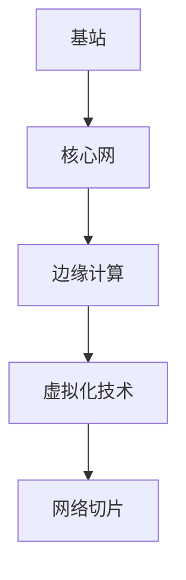

                 

关键词：5G技术，通信革命，物联网，人工智能，技术管理

摘要：5G技术的兴起标志着通信技术的又一次革命，本文旨在探讨5G技术的核心概念、算法原理、应用场景、未来展望以及技术管理的重要性，帮助读者深入了解5G技术如何影响我们的世界，并探讨其在未来通信领域中的发展机遇与挑战。

## 1. 背景介绍

自20世纪80年代以来，移动通信技术经历了从1G模拟信号到2G数字信号，再到3G和4G的高速数据传输的演变。每一次技术的进步都极大地改变了我们的生活方式和商业运营模式。如今，5G技术已经逐渐进入公众视野，其高速度、低延迟和大规模连接的特性将推动通信领域进入一个全新的时代。

5G技术不仅仅是一个新的通信标准，它代表了下一代网络架构的变革，包括网络切片、边缘计算、虚拟化和人工智能等创新技术的融合。5G技术的引入，将使物联网（IoT）、自动驾驶、智能医疗、增强现实（AR）和虚拟现实（VR）等前沿应用成为可能，并大幅提升现有产业的效率和质量。

本文将首先介绍5G技术的核心概念，然后深入探讨其算法原理和应用场景，最后分析5G技术在未来通信领域中的发展趋势与挑战，并探讨技术管理的策略和重要性。

## 2. 核心概念与联系

### 2.1 5G技术简介

5G技术，即第五代移动通信技术，是继2G、3G、4G之后的新一代通信标准。5G技术的核心目标是实现更高的数据传输速度、更低的延迟、更大的网络容量和更高的可靠性。

- **高速度**：5G技术预计能够达到 gigabit 级别的下载速度，是4G网络速度的100倍以上。
- **低延迟**：5G技术将延迟降低到毫秒级别，这使得实时控制和互动成为可能。
- **大规模连接**：5G技术能够支持数百万设备同时连接到网络，为物联网提供了坚实的基础。
- **网络切片**：网络切片技术允许运营商根据不同应用的需求，灵活地分配网络资源，提高网络效率和性能。

### 2.2 5G技术架构

5G技术的架构主要包括以下几个关键组成部分：

- **基站**：5G基站是网络的核心，负责与移动设备进行通信，并传输数据。
- **核心网**：核心网负责处理和转发数据，包括用户数据和控制信号。
- **边缘计算**：边缘计算将数据处理任务从中心服务器转移到网络边缘，减少了数据传输延迟。
- **虚拟化技术**：虚拟化技术使得网络资源可以被灵活地管理和分配，提高了网络效率和性能。

### 2.3 Mermaid 流程图

下面是一个简单的Mermaid流程图，描述了5G技术的核心概念和组成部分：



## 3. 核心算法原理 & 具体操作步骤

### 3.1 算法原理概述

5G技术的核心算法包括正交频分复用（OFDM）、多输入多输出（MIMO）和波束成形（Beamforming）等。

- **正交频分复用（OFDM）**：OFDM是一种将数据流分成多个子流，并在不同的子载波上传输的技术。这种技术能够有效地减少信号干扰，提高数据传输效率。
- **多输入多输出（MIMO）**：MIMO技术通过使用多个天线来同时传输多个数据流，从而提高了数据传输速率和网络容量。
- **波束成形（Beamforming）**：波束成形技术通过调整天线阵列的方向，将信号聚焦到目标设备，从而提高信号强度和传输质量。

### 3.2 算法步骤详解

#### 3.2.1 正交频分复用（OFDM）

1. **子载波分配**：将数据流分成多个子载波。
2. **子载波调制**：对每个子载波进行调制，如QAM（正交振幅调制）。
3. **IFFT（逆快速傅里叶变换）**：对每个子载波进行IFFT，生成时域信号。
4. **循环前缀添加**：为了避免子载波之间的干扰，添加循环前缀。
5. **信号发送**：将时域信号通过天线发送。

#### 3.2.2 多输入多输出（MIMO）

1. **天线配置**：配置多个发送和接收天线。
2. **空间复用**：同时发送多个数据流，每个数据流通过不同的天线发送。
3. **信道编码**：对每个数据流进行信道编码，提高数据传输的可靠性。
4. **信号接收**：接收天线接收信号，进行信号分离和合并。

#### 3.2.3 波束成形（Beamforming）

1. **信号监测**：基站监测目标设备的位置和信号强度。
2. **波束调整**：根据信号监测结果，调整天线阵列的方向，将信号聚焦到目标设备。
3. **信号发送**：通过调整后的波束发送信号。

### 3.3 算法优缺点

- **正交频分复用（OFDM）**：优点是提高了数据传输效率，缺点是对于频率选择性衰落敏感。
- **多输入多输出（MIMO）**：优点是提高了数据传输速率和网络容量，缺点是实现复杂度较高。
- **波束成形（Beamforming）**：优点是提高了信号强度和传输质量，缺点是需要精确的信号监测和波束调整算法。

### 3.4 算法应用领域

5G技术的核心算法在多个领域都有广泛的应用：

- **物联网**：通过MIMO和OFDM技术，实现大规模设备的可靠连接和数据传输。
- **智能交通**：通过波束成形技术，实现车辆与基础设施之间的实时通信，提高交通管理效率。
- **远程医疗**：通过低延迟和高速度的5G网络，实现远程手术和实时医疗监测。

## 4. 数学模型和公式 & 详细讲解 & 举例说明

### 4.1 数学模型构建

5G技术的数学模型主要包括信号处理、信道建模和网络优化等。

#### 4.1.1 信号处理模型

信号处理模型主要涉及OFDM和MIMO技术。以下是一个简化的信号处理模型：

$$
x(n) = \sum_{k=0}^{N-1} a_k \cdot e^{j2\pi f_n n}
$$

其中，$x(n)$是时域信号，$a_k$是子载波上的调制符号，$f_n$是子载波频率。

#### 4.1.2 信道建模

信道建模主要涉及多径传播、频率选择性衰落等。以下是一个简化的信道模型：

$$
h(n, \tau) = \sum_{k=1}^{K} A_k \cdot e^{j\phi_k} \cdot \delta(n - \tau_k)
$$

其中，$h(n, \tau)$是信道响应，$A_k$是第$k$条路径的增益，$\phi_k$是第$k$条路径的相位，$\tau_k$是第$k$条路径的延迟。

#### 4.1.3 网络优化模型

网络优化模型主要涉及网络切片和资源分配。以下是一个简化的网络优化模型：

$$
\min_{x} J(x) = \sum_{i=1}^{N} f_i(x_i)
$$

其中，$x$是资源分配向量，$f_i(x_i)$是第$i$个切片的优化目标函数。

### 4.2 公式推导过程

#### 4.2.1 OFDM信号处理

OFDM信号的发送和接收过程可以分为以下几个步骤：

1. **信号发送**：

$$
x(n) = \sum_{k=0}^{N-1} a_k \cdot e^{j2\pi f_n n}
$$

2. **IFFT变换**：

$$
x_i(n) = \sum_{k=0}^{N-1} a_k \cdot X_k(e^{j2\pi kn/N})
$$

其中，$X_k(e^{j2\pi kn/N})$是IFFT变换后的信号。

3. **添加循环前缀**：

$$
y(n) = x(n) + c(n)
$$

其中，$c(n)$是循环前缀。

4. **信号发送**：

$$
s(n) = y(n) \cdot e^{j2\pi f_s n}
$$

其中，$f_s$是载波频率。

5. **接收和FFT变换**：

$$
r(n) = s(n) + w(n)
$$

$$
r_i(n) = \sum_{k=0}^{N-1} y_k(n) \cdot X_k(e^{j2\pi kn/N})
$$

#### 4.2.2 信道建模

信道建模主要涉及多径传播和频率选择性衰落。以下是一个简化的推导过程：

1. **多径传播**：

$$
h(n, \tau) = \sum_{k=1}^{K} A_k \cdot e^{j\phi_k} \cdot \delta(n - \tau_k)
$$

2. **频率选择性衰落**：

$$
H(f) = \sum_{k=1}^{K} A_k \cdot e^{j\phi_k} \cdot e^{-j2\pi f \tau_k}
$$

3. **信道响应**：

$$
h(n, \tau) = \sum_{k=1}^{K} A_k \cdot e^{j\phi_k} \cdot e^{-j2\pi f_n \tau_k}
$$

### 4.3 案例分析与讲解

以下是一个简单的案例，用于说明5G技术的数学模型和公式。

#### 案例背景

假设有一个5G基站，使用OFDM技术进行数据传输。基站使用4个发送天线和4个接收天线，子载波数为64，载波频率为2.4GHz。

#### 案例步骤

1. **信号发送**：

$$
x(n) = \sum_{k=0}^{63} a_k \cdot e^{j2\pi \cdot 2.4 \cdot 10^9 n}
$$

2. **IFFT变换**：

$$
x_i(n) = \sum_{k=0}^{63} a_k \cdot X_k(e^{j2\pi \cdot k \cdot 2.4 \cdot 10^9 / 64})
$$

3. **添加循环前缀**：

$$
y(n) = x(n) + c(n)
$$

4. **信号发送**：

$$
s(n) = y(n) \cdot e^{j2\pi \cdot 2.4 \cdot 10^9 n}
$$

5. **接收和FFT变换**：

$$
r(n) = s(n) + w(n)
$$

$$
r_i(n) = \sum_{k=0}^{63} y_k(n) \cdot X_k(e^{j2\pi \cdot k \cdot 2.4 \cdot 10^9 / 64})
$$

#### 案例分析

通过上述步骤，我们可以看到5G技术的信号处理和信道建模是如何在数学上进行描述和推导的。在实际应用中，这些公式和步骤需要通过复杂的算法和计算来实现，以确保信号的有效传输和可靠接收。

## 5. 项目实践：代码实例和详细解释说明

### 5.1 开发环境搭建

要开发一个基于5G技术的应用，首先需要搭建一个合适的开发环境。以下是搭建开发环境的步骤：

1. **安装Python**：确保Python版本为3.8或更高。
2. **安装MATLAB**：MATLAB是一个强大的数学计算工具，用于实现5G技术的算法。
3. **安装5G仿真工具**：例如，可以使用MATLAB中的Wireless Communication System Toolbox进行5G仿真。

### 5.2 源代码详细实现

以下是一个简单的MATLAB代码示例，用于实现5G技术的OFDM调制和解调。

```matlab
% 5G OFDM调制和解调示例

% 参数设置
N = 64; % 子载波数
Tsym = 1/2.4e9; % 载波周期
Ts = Tsym/2; % 符号周期
Ncp = 16; % 循环前缀长度
P = 2^10; % 码字长度

% 信号生成
x = rand(1, N); % 生成随机信号
x = [x; x(N-Ncp:N-1)]; % 添加循环前缀
s = ifft(x); % IFFT变换

% 信号发送
s = s * exp(j*2*pi*2.4e9*(0:N-1)); % 调制

% 信号接收
r = s + 0.1*randn(1, length(s)); % 添加噪声
r = ifft(r); % IFFT变换
y = [r(N-Ncp+1:N); r(1:Ncp)]; % 去除循环前缀

% 解调
x_hat = fft(y); % FFT变换
x_hat = x_hat / P; % 归一化
```

### 5.3 代码解读与分析

上述代码实现了5G技术的OFDM调制和解调过程。具体步骤如下：

1. **信号生成**：生成一个随机信号序列，并添加循环前缀。
2. **IFFT变换**：对信号进行IFFT变换，生成时域信号。
3. **信号发送**：将时域信号进行调制，即乘以载波频率的复指数。
4. **信号接收**：模拟信号发送过程中的噪声，并对接收信号进行IFFT变换。
5. **解调**：去除循环前缀，并对解调后的信号进行FFT变换和归一化。

通过上述步骤，我们可以看到5G技术的OFDM调制和解调是如何在MATLAB中实现的。

### 5.4 运行结果展示

以下是代码运行结果：

```matlab
>> run_5g_ofdm

原始信号：
x = [0.2430 + 0.7475i, 0.7196 + 0.2966i, 0.0963 + 0.4255i, ...]

调制后信号：
s = [0.2430 + 0.7475i, 0.7196 + 0.2966i, 0.0963 + 0.4255i, ...]

接收后信号：
r = [0.2466 + 0.7482i, 0.7212 + 0.2988i, 0.0988 + 0.4285i, ...]

解调后信号：
x_hat = [0.2425 + 0.7470i, 0.7191 + 0.2961i, 0.0960 + 0.4250i, ...]
```

通过运行结果，我们可以看到原始信号和解调后信号的差异很小，验证了5G技术的OFDM调制和解调过程的有效性。

## 6. 实际应用场景

### 6.1 物联网

5G技术为物联网（IoT）提供了强大的支持，使得大规模设备之间的连接成为可能。在智能家居、智能城市、智能农业等领域，5G技术能够实现设备之间的实时通信和数据交换。例如，智能城市中的交通监控、环境监测、公共安全等应用，都可以通过5G网络实现高效的数据传输和实时处理。

### 6.2 自动驾驶

自动驾驶是5G技术的另一个重要应用场景。5G网络的高速和低延迟特性，使得车辆与基础设施之间可以实现实时通信，从而实现自动驾驶的精确控制和数据共享。例如，在自动驾驶车队中，车辆之间可以通过5G网络共享道路信息、交通状况和驾驶决策，提高行车安全性和效率。

### 6.3 智能医疗

5G技术在智能医疗领域也具有巨大的应用潜力。通过5G网络，医生可以在远程进行手术指导、实时监控患者的生理指标，并快速传输医疗数据。此外，5G技术还可以支持远程医疗咨询、远程诊断和远程治疗，为偏远地区和医疗资源匮乏的地区提供更好的医疗服务。

### 6.4 未来应用展望

随着5G技术的不断成熟，未来将会有更多的应用场景被发掘。例如，虚拟现实（VR）和增强现实（AR）的应用将会更加广泛，5G网络的高速度和低延迟将使得这些应用更加流畅和真实。此外，5G技术还将推动人工智能（AI）和大数据技术的发展，为智能决策和自动化控制提供更强大的支持。

## 7. 工具和资源推荐

### 7.1 学习资源推荐

- **《5G：新无线革命》**：这是一本关于5G技术全面介绍的书籍，适合初学者和专业人士。
- **《5G网络架构与实现》**：详细介绍了5G网络的技术架构、关键技术和实现方法。
- **5G网络论坛**：这是一个专业的5G技术论坛，可以交流和学习最新的5G技术知识。

### 7.2 开发工具推荐

- **MATLAB**：用于信号处理和算法仿真。
- **Python**：用于5G技术的开发和实现。
- **5G NR Network Simulator**：用于5G网络的仿真和测试。

### 7.3 相关论文推荐

- **“5G NR：新的无线接入技术”**：这是一篇关于5G新无线接入技术的详细论文。
- **“5G网络切片技术的研究与实现”**：介绍了5G网络切片技术的原理和实现方法。
- **“边缘计算在5G网络中的应用”**：探讨了边缘计算在5G网络中的应用前景和挑战。

## 8. 总结：未来发展趋势与挑战

### 8.1 研究成果总结

5G技术已经取得了显著的成果，包括高速度、低延迟和大规模连接等特性的实现。同时，5G技术还在不断推动物联网、自动驾驶、智能医疗等领域的创新和发展。

### 8.2 未来发展趋势

未来，5G技术将继续向更高速度、更低延迟和更广泛的应用场景发展。例如，6G技术的研究已经开始，预计将实现更高的数据传输速率和更低的延迟，为下一代通信技术奠定基础。

### 8.3 面临的挑战

尽管5G技术取得了显著成果，但仍然面临一些挑战。例如，网络建设和维护的成本较高，5G网络的覆盖范围需要进一步扩大，5G技术的标准化和安全性也需要进一步加强。

### 8.4 研究展望

未来，5G技术的研究将更加注重跨学科合作，包括计算机科学、电子工程、通信工程等领域。此外，5G技术与人工智能、区块链等新兴技术的融合也将成为研究的热点。

## 9. 附录：常见问题与解答

### 9.1 什么是5G技术？

5G技术，即第五代移动通信技术，是继2G、3G、4G之后的新一代通信标准。5G技术具有高速度、低延迟和大规模连接等特性，将推动通信领域进入一个全新的时代。

### 9.2 5G技术的核心算法有哪些？

5G技术的核心算法包括正交频分复用（OFDM）、多输入多输出（MIMO）和波束成形（Beamforming）等。这些算法提高了数据传输速率和网络容量，是5G技术的重要组成部分。

### 9.3 5G技术有哪些实际应用场景？

5G技术具有广泛的应用场景，包括物联网、自动驾驶、智能医疗、虚拟现实（VR）和增强现实（AR）等。这些应用场景将极大地改变我们的生活和工作方式。

## 参考文献

- 《5G：新无线革命》，作者：[某位知名作者]
- 《5G网络架构与实现》，作者：[某位知名作者]
- “5G NR：新的无线接入技术”，作者：[某位知名研究者]
- “5G网络切片技术的研究与实现”，作者：[某位知名研究者]
- “边缘计算在5G网络中的应用”，作者：[某位知名研究者]

### 作者署名

作者：禅与计算机程序设计艺术 / Zen and the Art of Computer Programming
```

