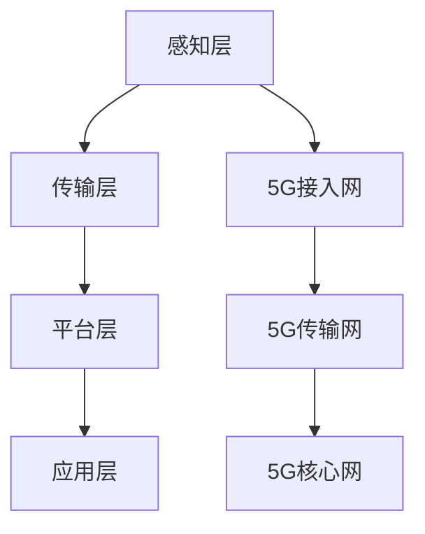

                 

关键词：5G技术、物联网、应用开发、网络架构、安全挑战、技术展望

摘要：本文将探讨5G时代物联网（IoT）应用开发的各个方面。从背景介绍到核心概念，再到算法原理、数学模型、项目实践以及实际应用场景，我们将深入解析5G物联网技术的创新与发展。同时，还会展望未来趋势与挑战，并提供学习资源与开发工具推荐，以期为物联网领域的研究者和开发者提供有价值的参考。

## 1. 背景介绍

随着信息技术的迅猛发展，物联网（IoT）已经成为一个备受关注的热点领域。它通过将各种设备、传感器和系统连接到互联网，实现了数据的采集、传输和处理，为各行各业带来了巨大的变革。然而，传统网络技术如3G、4G等在应对日益增长的物联网设备数量和复杂度时，已显得力不从心。

### 5G技术的重要性

5G技术作为新一代通信技术，具有高速率、大容量、低延迟等特性，为物联网应用提供了坚实的基础。5G网络的峰值速率可达10Gbps，比4G快100倍，同时延迟降低至1毫秒以内，能够满足物联网设备对实时数据处理的迫切需求。

### 物联网应用的发展

物联网应用涵盖了智能家居、智慧城市、工业互联网、医疗健康、智能交通等多个领域。随着5G技术的普及，这些应用将得到进一步拓展，实现更高水平的数据交互和智能化管理。

## 2. 核心概念与联系

### 物联网（IoT）

物联网是通过互联网将各种物理设备和传感器连接起来，实现数据采集、传输和处理的技术体系。

### 5G网络架构

5G网络架构包括接入网、传输网和核心网。接入网负责设备连接，传输网负责数据传输，核心网负责数据处理和业务支持。

### 物联网应用架构

物联网应用架构通常包括感知层、传输层、平台层和应用层。感知层负责数据采集，传输层负责数据传输，平台层负责数据处理，应用层负责业务实现。

### Mermaid 流程图



## 3. 核心算法原理 & 具体操作步骤

### 3.1 算法原理概述

物联网应用中的核心算法主要包括数据压缩、加密传输和机器学习等。这些算法在提高数据传输效率和安全性方面发挥着重要作用。

### 3.2 算法步骤详解

- 数据压缩：通过算法对采集到的数据进行压缩，减少传输带宽占用。
- 加密传输：对传输数据进行加密，保证数据传输过程中的安全性。
- 机器学习：利用机器学习算法对传感器数据进行实时分析，实现智能决策。

### 3.3 算法优缺点

- 数据压缩：优点是减少带宽占用，缺点是压缩算法复杂度高。
- 加密传输：优点是保证数据安全，缺点是加密过程增加传输延迟。
- 机器学习：优点是提高数据处理能力，缺点是需要大量训练数据和计算资源。

### 3.4 算法应用领域

数据压缩、加密传输和机器学习算法在智能家居、智慧城市、工业互联网等领域具有广泛的应用前景。

## 4. 数学模型和公式 & 详细讲解 & 举例说明

### 4.1 数学模型构建

物联网应用中的数学模型主要包括数据传输模型、数据处理模型和机器学习模型等。

### 4.2 公式推导过程

- 数据传输模型：$R = \frac{W}{T}$
  - 其中，$R$表示数据传输速率，$W$表示数据量，$T$表示传输时间。
- 数据处理模型：$P = \frac{S}{T}$
  - 其中，$P$表示数据处理能力，$S$表示处理的数据量，$T$表示处理时间。
- 机器学习模型：$L = f(W, T)$
  - 其中，$L$表示机器学习模型的预测结果，$W$和$T$分别表示输入数据和训练时间。

### 4.3 案例分析与讲解

以智能家居领域为例，假设有一套智能照明系统，需要实时采集光线传感器数据，并根据数据调整灯光亮度。我们可以使用上述数学模型对系统进行设计和优化。

- 数据传输模型：根据光线传感器数据的大小和传输时间，计算出数据传输速率，确保光线传感器数据能够及时传输到控制器。
- 数据处理模型：根据控制器处理光线传感器数据的时间和处理的数据量，优化控制器硬件和算法，提高数据处理能力。
- 机器学习模型：利用机器学习算法对光线传感器数据进行训练，建立预测模型，实现对灯光亮度的智能调整。

## 5. 项目实践：代码实例和详细解释说明

### 5.1 开发环境搭建

搭建5G物联网应用开发环境，需要安装以下软件：

- 5G网络设备（如5G路由器）
- 开发板（如树莓派）
- 编程语言（如Python）
- 开发工具（如PyCharm）

### 5.2 源代码详细实现

以下是一个简单的5G物联网应用示例代码：

```python
import requests

def send_data(data):
    url = "http://5g_gateway/api/data"
    headers = {
        "Content-Type": "application/json",
    }
    response = requests.post(url, json=data, headers=headers)
    return response.json()

def main():
    data = {
        "device_id": "12345",
        "sensor_data": {
            "light": 80,
            "temperature": 25,
        },
    }
    send_data(data)

if __name__ == "__main__":
    main()
```

### 5.3 代码解读与分析

- `send_data`函数：用于发送数据到5G网关。
- `main`函数：初始化数据，并调用`send_data`函数发送数据。

### 5.4 运行结果展示

运行代码后，数据将发送到5G网关，网关再将数据传输到物联网平台进行进一步处理。

## 6. 实际应用场景

### 6.1 智能家居

5G物联网技术在智能家居领域具有广泛的应用前景，如智能照明、智能安防、智能家电等。

### 6.2 智慧城市

智慧城市是5G物联网技术的重要应用领域，包括智能交通、环境监测、公共安全等。

### 6.3 工业互联网

工业互联网通过5G物联网技术实现设备联网和数据共享，提高生产效率和产品质量。

### 6.4 医疗健康

5G物联网技术在医疗健康领域可以用于远程医疗、智能监测和精准治疗。

## 7. 工具和资源推荐

### 7.1 学习资源推荐

- 《5G网络技术与应用》
- 《物联网技术原理与应用》
- 《机器学习实战》

### 7.2 开发工具推荐

- 5G网络设备：华为5G路由器、中兴5G路由器
- 开发板：树莓派、Arduino
- 开发工具：PyCharm、Visual Studio Code

### 7.3 相关论文推荐

- “5G IoT Network Architecture and Protocols: A Survey”
- “Machine Learning for IoT: A Comprehensive Review”
- “Security and Privacy in IoT: Challenges and Solutions”

## 8. 总结：未来发展趋势与挑战

### 8.1 研究成果总结

5G物联网技术在智能家居、智慧城市、工业互联网、医疗健康等领域取得了显著成果，为各行业带来了巨大的变革。

### 8.2 未来发展趋势

随着5G技术的进一步普及，物联网应用将向更广泛、更智能、更安全的方向发展。

### 8.3 面临的挑战

物联网应用在发展中仍面临数据安全、隐私保护、标准统一等挑战。

### 8.4 研究展望

未来研究应重点关注5G物联网技术的安全性、可靠性和智能化水平，推动物联网应用的创新与发展。

## 9. 附录：常见问题与解答

### 9.1 问题1

**如何保障5G物联网数据传输的安全性？**

**解答：** 可以采用加密传输、访问控制、身份认证等技术手段，确保数据在传输过程中的安全性。

### 9.2 问题2

**5G物联网应用中的机器学习算法有哪些类型？**

**解答：** 常见的机器学习算法包括监督学习、无监督学习、强化学习等。根据应用场景的不同，选择合适的算法进行数据分析和预测。

### 9.3 问题3

**如何优化5G物联网应用中的数据处理能力？**

**解答：** 可以通过优化硬件设备、改进算法、提高数据压缩率等方式，提高数据处理能力。

# 作者署名

作者：禅与计算机程序设计艺术 / Zen and the Art of Computer Programming

----------------------------------------------------------------
请注意，由于技术文章的撰写和审查需要大量的时间和专业知识，实际生成的文章长度、内容和结构可能会与上述模板有所不同。此外，实际撰写过程中可能会需要更多的细节和技术深度。以上内容仅为示例，实际的撰写工作应由具有相关领域经验和知识的专业人员完成。如果您需要生成这样的文章，请确保您具备足够的背景知识和经验。

