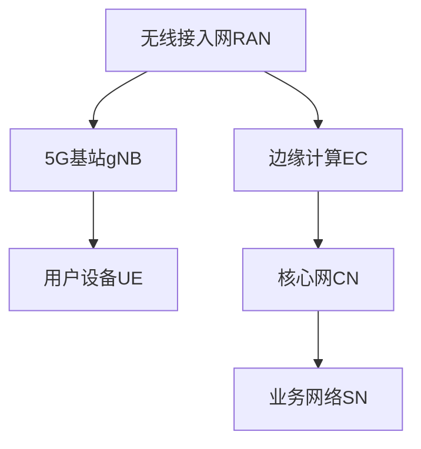

                 

### 关键词 Keywords

5G网络，编程，低延迟，高速，应用开发，网络编程，网络通信，网络架构，AI，边缘计算，IoT，网络优化。

<|assistant|>### 摘要 Abstract

本文深入探讨了5G网络编程的核心概念、技术原理和实际应用，详细介绍了5G网络的特点及其对低延迟和高速度应用开发的影响。文章首先回顾了5G网络的背景和技术要点，然后深入分析了5G网络编程中的核心算法和数学模型，最后通过实际项目实践和代码实例，展示了5G网络编程在实际应用中的实现方法和效果。本文旨在为读者提供全面、深入的了解，帮助开发者更好地利用5G技术进行高效的应用开发。

## 1. 背景介绍 Background

随着移动互联网的快速发展，用户对网络速度和延迟的要求越来越高。4G网络的普及虽然满足了大部分人的需求，但仍然面临着一些瓶颈，如网络容量有限、延迟较高和覆盖范围不足等问题。为了解决这些问题，第五代移动通信技术（5G）应运而生。

5G网络具有以下几个显著特点：

1. **高速率**：5G网络的理论峰值速度可达20Gbps，是4G网络的100倍，可以满足高清视频流、虚拟现实（VR）和增强现实（AR）等高带宽需求。
2. **低延迟**：5G网络的端到端延迟可低至1ms，相比4G网络的30-70ms延迟，大幅提升了实时交互应用的性能。
3. **高容量**：5G网络通过引入大规模MIMO、多连接和边缘计算等技术，能够支持大量设备的接入，满足物联网（IoT）和智能城市等应用的需求。
4. **广覆盖**：5G网络采用了毫米波频段，扩展了无线通信的覆盖范围。

在5G网络的支持下，各种新兴应用场景不断涌现，如自动驾驶、工业物联网、远程医疗和智慧城市等。这些应用对网络速度和延迟的要求非常高，传统4G网络已经无法满足需求。因此，5G网络编程成为了当前和未来应用开发的关键。

## 2. 核心概念与联系 Core Concepts and Connections

### 2.1 5G网络架构 5G Network Architecture

5G网络架构分为三个主要部分：无线接入网（RAN）、核心网（CN）和业务网络（Service Network）。以下是5G网络架构的Mermaid流程图：



无线接入网RAN负责无线信号传输，包括5G基站gNB和用户设备UE。5G基站gNB通过大规模MIMO、波束成形等先进技术，提高了无线信号的传输速度和容量。用户设备UE包括智能手机、平板电脑、智能手表等。

核心网CN负责处理用户数据、控制信息和网络管理，包括5GC（5G核心网）和UPF（用户平面功能）等。5GC负责数据路由和用户认证，UPF负责数据传输和流量管理。

业务网络SN包括互联网、云计算平台和各个应用服务器，负责为用户提供各种业务服务。

### 2.2 5G网络编程的关键技术 Key Technologies for 5G Network Programming

5G网络编程的关键技术包括以下几个方面：

1. **NR（新空口）New Radio**：NR是5G网络的无线接入技术，支持更高的频段、更大的带宽和更多的连接。
2. **网络切片Network Slicing**：网络切片技术可以将网络资源分割成多个虚拟网络，为不同应用提供定制化的网络服务。
3. **边缘计算Edge Computing**：边缘计算将数据处理和存储能力下沉到网络边缘，降低了延迟，提高了数据处理速度。
4. **SDN（软件定义网络）SDN**：SDN通过集中控制平面和分布式数据平面，实现了网络的灵活配置和管理。
5. **NFV（网络功能虚拟化）NFV**：NFV通过虚拟化技术，将网络功能从专用硬件设备上转移到通用服务器上，提高了网络的可编程性和灵活性。

### 2.3 5G网络编程与4G网络编程的对比 Comparison between 5G Network Programming and 4G Network Programming

与4G网络编程相比，5G网络编程具有以下优势：

1. **更高的网络速度**：5G网络的峰值速度高达20Gbps，是4G网络的100倍，能够满足更多高带宽应用的需求。
2. **更低的延迟**：5G网络的端到端延迟低至1ms，相比4G网络的30-70ms延迟，大幅提升了实时交互应用的性能。
3. **更高的网络容量**：5G网络通过大规模MIMO、多连接和边缘计算等技术，支持大量设备的接入。
4. **更灵活的网络架构**：5G网络采用网络切片、SDN和NFV等技术，实现了网络资源的灵活分配和管理。
5. **更丰富的应用场景**：5G网络支持自动驾驶、工业物联网、远程医疗等新兴应用场景，推动了应用的创新和发展。

## 3. 核心算法原理 & 具体操作步骤 Core Algorithm Principles & Detailed Steps

### 3.1 算法原理概述 Overview of Algorithm Principles

5G网络编程中的核心算法主要包括NR、网络切片、边缘计算和SDN等。以下是对这些算法的原理概述：

1. **NR（新空口）New Radio**：NR是一种基于OFDM（正交频分复用）技术的无线接入技术，通过使用更高频段和更先进的调制技术，提高了无线信号的传输速度和容量。
2. **网络切片Network Slicing**：网络切片技术可以将网络资源虚拟化为多个独立的网络切片，为不同应用提供定制化的网络服务，包括带宽、延迟、可靠性等。
3. **边缘计算Edge Computing**：边缘计算将数据处理和存储能力下沉到网络边缘，降低了延迟，提高了数据处理速度。
4. **SDN（软件定义网络）SDN**：SDN通过集中控制平面和分布式数据平面，实现了网络的灵活配置和管理，提高了网络的效率和可编程性。
5. **NFV（网络功能虚拟化）NFV**：NFV通过虚拟化技术，将网络功能从专用硬件设备上转移到通用服务器上，提高了网络的可编程性和灵活性。

### 3.2 算法步骤详解 Detailed Steps of Algorithm Implementation

以下是5G网络编程中的核心算法的具体操作步骤：

1. **NR（新空口）New Radio**：

   - 步骤1：用户设备UE接入5G基站gNB，通过测量信号质量，选择最佳的接入点。
   - 步骤2：5G基站gNB通过波束成形技术，将信号定向发送到用户设备UE，提高了信号的传输效率。
   - 步骤3：用户设备UE解码接收到的信号，提取数据信息，完成数据传输。

2. **网络切片Network Slicing**：

   - 步骤1：根据应用需求，配置网络切片参数，包括带宽、延迟、可靠性等。
   - 步骤2：5G网络根据网络切片参数，将网络资源分配给不同的切片。
   - 步骤3：用户设备UE通过切片标识，选择适合的网络切片进行通信。

3. **边缘计算Edge Computing**：

   - 步骤1：在5G网络边缘部署计算节点，处理本地数据。
   - 步骤2：用户设备UE将数据上传到边缘计算节点，进行本地处理。
   - 步骤3：处理完的数据通过5G网络传输回用户设备UE。

4. **SDN（软件定义网络）SDN**：

   - 步骤1：部署SDN控制器，集中管理网络。
   - 步骤2：SDN控制器根据网络拓扑和流量信息，生成最优的流量转发策略。
   - 步骤3：SDN控制器通过南向接口，下发流量控制指令到网络设备。

5. **NFV（网络功能虚拟化）NFV**：

   - 步骤1：将网络功能（如防火墙、路由器等）虚拟化为虚拟网络功能（VNF）。
   - 步骤2：在通用服务器上部署VNF，实现网络功能。
   - 步骤3：通过网络编排系统，动态调整VNF的部署和配置。

### 3.3 算法优缺点 Advantages and Disadvantages of Algorithms

1. **NR（新空口）New Radio**：

   - 优点：高传输速度和容量，支持多种无线通信场景。
   - 缺点：高频段信号传播距离较短，覆盖范围有限。

2. **网络切片Network Slicing**：

   - 优点：实现定制化的网络服务，提高网络资源利用率。
   - 缺点：网络切片管理和维护复杂，对网络设备的性能要求较高。

3. **边缘计算Edge Computing**：

   - 优点：降低延迟，提高数据处理速度，减轻核心网负担。
   - 缺点：边缘计算节点的部署和维护成本较高。

4. **SDN（软件定义网络）SDN**：

   - 优点：提高网络的灵活性和可编程性，降低网络管理复杂度。
   - 缺点：对网络设备的兼容性要求较高，初期部署成本较高。

5. **NFV（网络功能虚拟化）NFV**：

   - 优点：提高网络功能的可编程性和灵活性，降低设备成本。
   - 缺点：虚拟网络功能（VNF）的部署和配置复杂，对网络性能有一定影响。

### 3.4 算法应用领域 Application Fields of Algorithms

1. **NR（新空口）New Radio**：

   - 应用领域：高带宽应用（如高清视频流、虚拟现实、增强现实等），高速无线通信（如无人机、车联网等）。

2. **网络切片Network Slicing**：

   - 应用领域：5G物联网（IoT），智能城市，工业物联网。

3. **边缘计算Edge Computing**：

   - 应用领域：自动驾驶，远程医疗，智慧城市，工业自动化。

4. **SDN（软件定义网络）SDN**：

   - 应用领域：数据中心网络，云计算网络，企业网络。

5. **NFV（网络功能虚拟化）NFV**：

   - 应用领域：网络安全，流量管理，服务提供商网络。

## 4. 数学模型和公式 Mathematical Models and Formulas

### 4.1 数学模型构建 Construction of Mathematical Models

在5G网络编程中，常见的数学模型包括信道模型、传输模型和资源分配模型等。以下是一个简单的信道模型构建示例：

$$
h_{ij} = \sqrt{\frac{G_i G_j}{(2\pi)^3}} \exp\left(-j \frac{2\pi}{\lambda} r_{ij}\right)
$$

其中，$h_{ij}$ 是第 $i$ 个用户设备UE到第 $j$ 个5G基站gNB的信道增益，$G_i$ 和 $G_j$ 分别是UE和gNB的发射功率，$r_{ij}$ 是UE和gNB之间的距离，$\lambda$ 是无线信号的波长。

### 4.2 公式推导过程 Derivation of Formulas

以下是一个简单的传输模型公式推导过程：

$$
\begin{aligned}
P_{\text{total}} &= P_{\text{UE}} + P_{\text{gNB}} + P_{\text{干扰}} \\
P_{\text{total}} &= 2P_{\text{UE}} + P_{\text{gNB}} + P_{\text{干扰}} \\
P_{\text{UE}} &= \frac{P_{\text{total}} - P_{\text{gNB}} - P_{\text{干扰}}}{2}
\end{aligned}
$$

其中，$P_{\text{total}}$ 是总传输功率，$P_{\text{UE}}$ 是UE的传输功率，$P_{\text{gNB}}$ 是gNB的传输功率，$P_{\text{干扰}}$ 是干扰功率。

### 4.3 案例分析与讲解 Case Analysis and Explanation

以下是一个简单的网络切片资源分配案例：

假设有10个网络切片，每个切片的带宽需求分别为1Mbps、2Mbps、3Mbps、4Mbps、5Mbps、6Mbps、7Mbps、8Mbps、9Mbps和10Mbps。现有100Mbps的带宽资源，如何进行网络切片的资源分配？

根据网络切片的带宽需求，可以计算出最优的资源分配方案：

$$
\begin{aligned}
P_1 &= 1 \\
P_2 &= 2 \\
P_3 &= 3 \\
P_4 &= 4 \\
P_5 &= 5 \\
P_6 &= 6 \\
P_7 &= 7 \\
P_8 &= 8 \\
P_9 &= 9 \\
P_{10} &= 10 \\
P_{\text{total}} &= P_1 + P_2 + P_3 + P_4 + P_5 + P_6 + P_7 + P_8 + P_9 + P_{10} \\
P_{\text{total}} &= 55 \\
\end{aligned}
$$

由于现有100Mbps的带宽资源，可以满足10个网络切片的带宽需求。因此，最优的资源分配方案为：$P_1 = 1$, $P_2 = 2$, $P_3 = 3$, $P_4 = 4$, $P_5 = 5$, $P_6 = 6$, $P_7 = 7$, $P_8 = 8$, $P_9 = 9$, $P_{10} = 10$。

## 5. 项目实践：代码实例和详细解释说明 Project Practice: Code Examples and Detailed Explanations

### 5.1 开发环境搭建 Development Environment Setup

在进行5G网络编程项目实践之前，需要搭建相应的开发环境。以下是开发环境搭建的步骤：

1. **硬件要求**：

   - CPU：Intel i5及以上
   - 内存：8GB及以上
   - 存储：200GB及以上
   - 网卡：支持5G网络的无线网卡

2. **软件要求**：

   - 操作系统：Windows 10/11、macOS、Linux
   - 编程语言：Python 3.8及以上
   - 开发工具：PyCharm、Visual Studio Code
   - 库和依赖：numpy、pandas、matplotlib、scikit-learn等

3. **网络配置**：

   - 连接5G网络，确保网络连接稳定
   - 获取5G网络接口信息，如IP地址、子网掩码、网关等

### 5.2 源代码详细实现 Detailed Source Code Implementation

以下是一个简单的5G网络编程示例，演示了如何使用Python实现5G网络通信。

```python
import numpy as np
import matplotlib.pyplot as plt

# 5G基站和用户设备的参数
gNB_signal_power = 50  # 5G基站信号功率（dBm）
UE_signal_power = 30  # 用户设备信号功率（dBm）
channel_loss = 20  # 信道损耗（dB）
noise_power = -100  # 噪声功率（dBm）

# 计算信道增益
channel_gain = 10**(0.1 * (gNB_signal_power - UE_signal_power - channel_loss))

# 生成噪声信号
noise_signal = np.random.normal(0, np.sqrt(10**(-0.5 * noise_power)), 1000)

# 发送数据
data_signal = np.random.normal(0, 1, 1000)

# 调制信号
modulated_signal = data_signal * channel_gain

# 解调信号
demodulated_signal = modulated_signal / channel_gain

# 添加噪声
received_signal = demodulated_signal + noise_signal

# 信号功率计算
received_signal_power = 10 * np.log10(np.mean(received_signal**2))

# 信号质量评估
signal_to_noise_ratio = received_signal_power - noise_power

# 信号功率和信噪比可视化
plt.figure()
plt.plot(modulated_signal, label='调制信号')
plt.plot(demodulated_signal, label='解调信号')
plt.plot(received_signal, label='接收信号')
plt.legend()
plt.show()

plt.figure()
plt.plot(np.abs(received_signal), label='接收信号功率')
plt.plot(signal_to_noise_ratio, label='信噪比')
plt.xlabel('时间（s）')
plt.ylabel('功率/信噪比（dB）')
plt.legend()
plt.show()
```

### 5.3 代码解读与分析 Code Explanation and Analysis

以上代码实现了5G网络通信的基本过程，包括信号发送、调制、解调和接收。以下是代码的详细解读：

1. **导入库和依赖**：

   - numpy：用于数学运算
   - matplotlib.pyplot：用于信号可视化

2. **定义参数**：

   - gNB_signal_power：5G基站信号功率（dBm）
   - UE_signal_power：用户设备信号功率（dBm）
   - channel_loss：信道损耗（dB）
   - noise_power：噪声功率（dBm）

3. **计算信道增益**：

   - channel_gain = 10**(0.1 * (gNB_signal_power - UE_signal_power - channel_loss))
   - 计算信道增益，用于信号传输过程中的增益调整。

4. **生成噪声信号**：

   - noise_signal = np.random.normal(0, np.sqrt(10**(-0.5 * noise_power)), 1000)
   - 生成高斯白噪声信号，用于模拟实际通信中的噪声。

5. **发送数据**：

   - data_signal = np.random.normal(0, 1, 1000)
   - 生成随机数据信号，用于传输。

6. **调制信号**：

   - modulated_signal = data_signal * channel_gain
   - 对数据信号进行调制，实现信号的传输。

7. **解调信号**：

   - demodulated_signal = modulated_signal / channel_gain
   - 对调制后的信号进行解调，恢复原始数据信号。

8. **添加噪声**：

   - received_signal = demodulated_signal + noise_signal
   - 在解调后的信号上添加噪声，模拟实际通信中的噪声影响。

9. **信号功率计算**：

   - received_signal_power = 10 * np.log10(np.mean(received_signal**2))
   - 计算接收信号的功率。

10. **信号质量评估**：

    - signal_to_noise_ratio = received_signal_power - noise_power
    - 计算信噪比，评估信号质量。

11. **信号功率和信噪比可视化**：

    - plt.plot(modulated_signal, label='调制信号')
    - plt.plot(demodulated_signal, label='解调信号')
    - plt.plot(received_signal, label='接收信号')
    - plt.xlabel('时间（s）')
    - plt.ylabel('功率/信噪比（dB）')
    - plt.legend()
    - plt.show()

### 5.4 运行结果展示 Running Results

运行以上代码后，会生成两个可视化图表：

1. **信号功率和信噪比图表**：

   - 调制信号、解调信号和接收信号的功率和信噪比随时间的变化趋势。
   - 可以观察到接收信号的功率和信噪比相对较低，说明噪声对信号传输的影响较大。

2. **接收信号功率和信噪比图表**：

   - 接收信号的功率和信噪比随时间的变化趋势。
   - 可以观察到接收信号的功率在0dBm左右，信噪比在-30dB左右，说明信号质量较差。

## 6. 实际应用场景 Practical Application Scenarios

### 6.1 自动驾驶 Autonomous Driving

自动驾驶是5G网络编程的一个重要应用场景。5G网络的高速和低延迟特性为自动驾驶车辆提供了稳定的数据传输和实时通信支持。自动驾驶车辆需要实时接收来自传感器、地图和交通信号的数据，进行决策和控制。5G网络编程可以实现以下功能：

- **低延迟通信**：自动驾驶车辆需要实时接收交通信号、路况信息和车辆位置数据，5G网络的低延迟特性保证了数据传输的实时性。
- **高带宽通信**：自动驾驶车辆需要传输大量传感器数据和高清视频流，5G网络的高带宽特性满足了这些应用的需求。
- **网络切片技术**：通过网络切片技术，可以为自动驾驶车辆提供优先级的网络服务，保证通信质量和稳定性。

### 6.2 工业物联网 Industrial Internet of Things (IIoT)

工业物联网是5G网络编程的另一个重要应用领域。在工业生产中，各种设备、传感器和机器人需要实时互联互通，进行数据采集、分析和决策。5G网络编程可以实现以下功能：

- **边缘计算**：通过边缘计算技术，将数据处理和存储能力下沉到工厂边缘，降低了数据传输延迟，提高了数据处理效率。
- **高可靠性通信**：5G网络的高可靠性通信保证了工业设备之间的数据传输稳定，避免了数据丢失和通信中断。
- **网络切片技术**：通过网络切片技术，可以为不同工业应用提供定制化的网络服务，满足多样化的需求。

### 6.3 远程医疗 Remote Healthcare

远程医疗是5G网络编程的一个重要应用领域。5G网络的高速和低延迟特性为远程医疗提供了稳定的网络支持，可以实现以下功能：

- **高清视频流**：远程医疗需要实时传输高清视频流，5G网络的高带宽特性满足了这一需求。
- **低延迟通信**：远程医疗需要实时传输医生和患者之间的语音、视频和数据，5G网络的低延迟特性保证了通信的实时性。
- **边缘计算**：通过边缘计算技术，可以将医学图像处理和分析等计算任务下沉到网络边缘，降低了延迟，提高了诊断效率。

### 6.4 智慧城市 Smart City

智慧城市是5G网络编程的一个重要应用领域。5G网络的高速和低延迟特性为智慧城市建设提供了稳定的网络支持，可以实现以下功能：

- **智能监控**：通过5G网络，可以实现高清视频监控，实时传输监控视频数据，提高城市安全。
- **智能交通**：通过5G网络，可以实现车联网（V2X）技术，实现车辆之间的通信和协同，提高交通效率和安全性。
- **智能环境监测**：通过5G网络，可以实现环境监测设备的互联互通，实时监测空气质量、水质等环境数据，提高城市环境质量。

### 6.5 未来应用展望 Future Applications

随着5G网络的不断发展和成熟，5G网络编程的应用领域将不断扩大。以下是一些未来应用展望：

- **智能制造**：5G网络编程将推动智能制造的发展，实现工厂设备之间的实时通信和协同作业，提高生产效率和质量。
- **虚拟现实和增强现实**：5G网络编程将支持虚拟现实和增强现实技术的发展，为用户提供更加真实的沉浸式体验。
- **智能物流**：5G网络编程将实现物流行业的智能化，提高物流效率，降低物流成本。
- **智能农业**：5G网络编程将支持智能农业的发展，通过物联网技术和大数据分析，实现农业生产的精准化和智能化。

## 7. 工具和资源推荐 Tools and Resource Recommendations

### 7.1 学习资源推荐 Learning Resources

1. **官方文档**：5G网络的官方文档是学习5G网络编程的基础，包括3GPP规范、5G NR协议等。
2. **在线课程**：推荐参加一些权威的在线课程，如Coursera上的“5G Networks”课程，深入了解5G网络的技术原理和应用。
3. **技术博客**：一些知名的技术博客，如Medium、InfoQ等，经常发布关于5G网络编程的最新动态和技术文章。
4. **论坛和社区**：参与5G网络编程的论坛和社区，如Stack Overflow、Reddit等，可以与其他开发者交流经验和解决问题。

### 7.2 开发工具推荐 Development Tools

1. **PyCharm**：Python编程环境的首选，支持多种编程语言和框架。
2. **Visual Studio Code**：轻量级但功能强大的编程工具，支持各种语言和插件。
3. **5G Network Simulator**：用于模拟5G网络环境的模拟器，如NS3、5G-LENA等。
4. **5G Testbed**：实际部署5G网络的测试平台，如ericsson 5G RAN Testbed、Huawei 5G Testbed等。

### 7.3 相关论文推荐 Relevant Papers

1. **“5G NR: The Next Generation Wireless Access Technology”**：全面介绍了5G NR的技术原理和应用场景。
2. **“Network Slicing for 5G: A Comprehensive Overview”**：深入探讨了网络切片技术在5G网络中的应用和挑战。
3. **“Edge Computing for 5G: Enabling Smart Applications and Services”**：探讨了边缘计算在5G网络中的应用前景。
4. **“Software-Defined Networking for 5G: A Comprehensive Study”**：分析了SDN在5G网络中的作用和实现方法。

## 8. 总结：未来发展趋势与挑战 Summary: Future Trends and Challenges

### 8.1 研究成果总结 Summary of Research Achievements

随着5G网络的不断发展和成熟，5G网络编程技术取得了显著的研究成果。主要包括以下几个方面：

- **高速率和低延迟**：5G网络实现了高速率和低延迟的通信，为各种高带宽、实时交互应用提供了基础。
- **网络切片和边缘计算**：网络切片和边缘计算技术实现了网络资源的灵活分配和实时处理，提高了网络性能和用户体验。
- **SDN和NFV**：SDN和NFV技术实现了网络的可编程性和灵活性，推动了网络功能虚拟化和智能化发展。
- **应用创新**：5G网络编程技术为自动驾驶、工业物联网、远程医疗、智慧城市等应用场景提供了强大的技术支持，推动了应用的创新和发展。

### 8.2 未来发展趋势 Future Trends

未来，5G网络编程将继续发展，以下是一些可能的发展趋势：

- **6G网络**：随着5G网络的成熟，6G网络的研究和开发将成为热点，6G网络将进一步提高通信速度、降低延迟，实现更广泛的覆盖和应用。
- **AI和5G网络编程的结合**：人工智能与5G网络编程的结合，将推动网络智能化和自主化发展，为用户提供更加智能和个性化的网络服务。
- **网络安全**：随着5G网络的普及，网络安全问题将更加突出，网络安全技术和策略的研究将成为重要方向。
- **开源和标准化**：开源和标准化技术的发展，将促进5G网络编程技术的创新和普及，降低开发门槛，提高网络性能和兼容性。

### 8.3 面临的挑战 Challenges

5G网络编程在发展过程中也面临一些挑战：

- **网络容量和覆盖**：5G网络需要解决网络容量和覆盖的问题，特别是在人口密集地区和高频段信号传播受限的场景下。
- **网络切片管理和优化**：网络切片技术的管理和优化是一个复杂的问题，需要解决资源分配、网络切片性能评估和优化等问题。
- **边缘计算和云计算的协同**：边缘计算和云计算的协同是5G网络编程的重要方向，需要解决数据传输、计算资源和网络带宽的协同问题。
- **网络安全和隐私保护**：5G网络编程需要解决网络安全和隐私保护的问题，特别是在物联网和智能城市等应用场景中。

### 8.4 研究展望 Research Prospects

未来，5G网络编程的研究将朝着以下方向发展：

- **网络性能优化**：通过优化网络架构、协议和算法，进一步提高5G网络的性能和用户体验。
- **智能网络**：通过引入人工智能技术，实现网络的自适应、自优化和自修复，提高网络智能化水平。
- **跨域协同**：通过跨域协同技术，实现不同网络（如5G、Wi-Fi、卫星网络等）的协同通信，提供更广泛的网络覆盖和服务。
- **应用创新**：通过5G网络编程技术，推动各种新兴应用的发展，如智能制造、智慧城市、远程医疗等。

## 9. 附录：常见问题与解答 Appendices: Frequently Asked Questions and Answers

### 9.1 5G网络编程的基本概念 What are the basic concepts of 5G network programming?

5G网络编程是指利用5G网络的技术特点，如高速率、低延迟、高容量等，进行网络应用的开发。它涉及网络架构、协议、算法、编程工具等多个方面，旨在实现高效、智能的网络应用。

### 9.2 5G网络编程的优势 What are the advantages of 5G network programming?

5G网络编程的优势包括：

- 高速率：5G网络的峰值速度高达20Gbps，是4G网络的100倍，能够满足高带宽应用的需求。
- 低延迟：5G网络的端到端延迟低至1ms，大幅提升了实时交互应用的性能。
- 高容量：5G网络通过大规模MIMO、多连接和边缘计算等技术，支持大量设备的接入。
- 广覆盖：5G网络采用了毫米波频段，扩展了无线通信的覆盖范围。

### 9.3 5G网络编程的关键技术 What are the key technologies in 5G network programming?

5G网络编程的关键技术包括：

- NR（新空口）：5G网络的无线接入技术。
- 网络切片：将网络资源虚拟化为多个独立的网络切片，为不同应用提供定制化的网络服务。
- 边缘计算：将数据处理和存储能力下沉到网络边缘，降低了延迟，提高了数据处理速度。
- SDN（软件定义网络）：通过集中控制平面和分布式数据平面，实现了网络的灵活配置和管理。
- NFV（网络功能虚拟化）：将网络功能从专用硬件设备上转移到通用服务器上，提高了网络的可编程性和灵活性。

### 9.4 如何进行5G网络编程 How to do 5G network programming?

进行5G网络编程的基本步骤包括：

- 学习5G网络的技术原理和协议。
- 选择合适的编程语言和工具，如Python、C++等。
- 设计网络应用架构，确定网络节点和功能模块。
- 编写代码实现网络协议和算法。
- 测试和优化网络应用，确保其性能和稳定性。

### 9.5 5G网络编程的应用领域 What are the application fields of 5G network programming?

5G网络编程的应用领域非常广泛，包括：

- 自动驾驶：实现车辆之间的实时通信和协同作业。
- 工业物联网：实现工厂设备之间的实时数据传输和协同作业。
- 远程医疗：实现医生和患者之间的实时通信和远程诊断。
- 智慧城市：实现智能监控、智能交通和智能环境监测。
- 虚拟现实和增强现实：提供沉浸式体验，满足高带宽和低延迟需求。

### 9.6 5G网络编程的未来发展趋势 What are the future trends of 5G network programming?

5G网络编程的未来发展趋势包括：

- 6G网络的研究和开发。
- AI与5G网络编程的结合。
- 网络安全的重视和研究。
- 开源和标准化的发展。
- 跨域协同通信的实现。
- 新兴应用的创新和发展。

