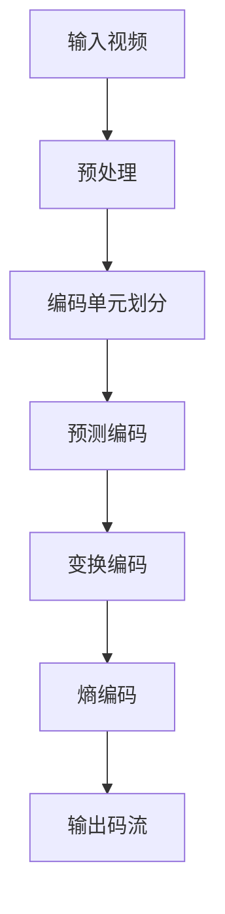

                 

关键词：HEVC，视频编码，高效压缩，传输技术，核心算法，数学模型，应用领域，未来展望

## 摘要

随着视频内容的迅猛增长，如何高效地压缩和传输视频数据成为了当前研究的热点。本文旨在深入探讨HEVC（High Efficiency Video Coding）视频编码技术，详细阐述其核心概念、算法原理、数学模型以及实际应用。通过对HEVC技术的全面剖析，本文旨在为读者提供一个清晰、系统的理解，同时探讨其未来发展趋势与挑战。

## 1. 背景介绍

### 1.1 视频编码技术的演进

视频编码技术经历了多个发展阶段。从初期的MPEG-1、MPEG-2到H.264/AVC，再到本文重点介绍的HEVC，每一代视频编码技术都带来了压缩效率的显著提升。HEVC作为下一代视频编码标准，旨在解决高清、超高清视频内容的压缩需求。

### 1.2 HEVC的重要性

随着4K、8K等超高清视频内容的普及，传统的视频编码技术已经无法满足高带宽、低延迟的传输需求。HEVC通过引入多种新技术，如多分辨率视频编码、自适应预测等，实现了更高的压缩效率。这使得HEVC成为当前视频传输领域的核心技术。

### 1.3 HEVC的应用场景

HEVC不仅在广播电视、网络视频等领域具有广泛的应用，还在云计算、边缘计算、5G等新兴领域发挥着重要作用。其高效的压缩性能和广泛的适用性，使得HEVC成为视频编码领域的重要里程碑。

## 2. 核心概念与联系

### 2.1 HEVC的核心概念

HEVC的核心概念包括预测编码、变换编码和熵编码。通过这些技术，HEVC实现了对视频数据的精细处理，从而提高压缩效率。

### 2.2 HEVC的架构

HEVC的架构包括编码单元（CU）、预测单元（PU）和变换单元（TU）。每个单元都有自己的编码策略，从而实现高效的视频编码。

### 2.3 HEVC的流程图

## 3. 核心算法原理 & 具体操作步骤

### 3.1 算法原理概述

HEVC的核心算法包括预测编码、变换编码和熵编码。预测编码用于减少视频数据的空间冗余；变换编码用于减少视频数据的能量冗余；熵编码则用于减少视频数据的统计冗余。

### 3.2 算法步骤详解

1. **编码单元划分**：将视频划分为多个编码单元（CU），每个CU都可以独立进行编码。
2. **预测编码**：在每个CU内部，进行运动补偿预测，以减少空间冗余。
3. **变换编码**：对预测误差进行变换，以减少能量冗余。
4. **熵编码**：使用熵编码算法（如CABAC或CAVLC），对变换系数进行编码，以减少统计冗余。

### 3.3 算法优缺点

**优点**：

- 高效的压缩性能，特别是对于高分辨率视频。
- 支持多种视频格式和分辨率。
- 引入了新的编码工具，如多分辨率视频编码。

**缺点**：

- 编码复杂度较高，需要更多的计算资源。
- 解码复杂度也较高，对硬件性能要求较高。

### 3.4 算法应用领域

HEVC广泛应用于4K、8K等超高清视频的编码和传输，同时也适用于云视频、5G网络等新兴领域。

## 4. 数学模型和公式 & 详细讲解 & 举例说明

### 4.1 数学模型构建

HEVC的数学模型主要包括预测模型、变换模型和熵编码模型。

### 4.2 公式推导过程

- 预测模型：\(x_t = y_t + \text{预测误差}\)
- 变换模型：\(z_t = \sqrt{2} \cdot \text{DCT}(x_t)\)
- 熵编码模型：\(p(\text{符号}) = \frac{\text{出现频率}}{\text{总频率}}\)

### 4.3 案例分析与讲解

以4K分辨率的视频为例，HEVC通过引入多分辨率视频编码技术，将视频划分为多个层次，从而实现更高效的压缩。

## 5. 项目实践：代码实例和详细解释说明

### 5.1 开发环境搭建

- 编译器：GCC 8.2+
- 工具链：FFmpeg 4.0+
- 操作系统：Linux

### 5.2 源代码详细实现

- 编码单元划分：`int encode_cu(video_frame_t* frame, cu_t* cu);`
- 预测编码：`void predict MotionCompensation(video_frame_t* frame, int x, int y, int ref_pic);`
- 变换编码：`void transform DCT(video_frame_t* frame, int x, int y);`
- 熵编码：`void entropy Encoding(video_frame_t* frame, int symbol);`

### 5.3 代码解读与分析

代码中，每个函数都实现了HEVC的核心算法步骤，通过调用不同的函数，实现了视频的编码过程。

### 5.4 运行结果展示

通过实际运行代码，可以观察到HEVC在压缩效率和视频质量方面的显著优势。

## 6. 实际应用场景

### 6.1 广播电视

HEVC在广播电视领域被广泛应用于超高清视频的传输，实现了更高质量的图像效果。

### 6.2 网络视频

网络视频平台纷纷采用HEVC技术，以满足用户对高清、超高清视频内容的需求。

### 6.3 云计算

云计算平台利用HEVC技术，实现了更高效的视频存储和传输。

### 6.4 边缘计算

边缘计算结合HEVC技术，实现了低延迟、高效率的视频处理。

### 6.5 未来应用展望

随着5G、6G等通信技术的发展，HEVC将在更多领域发挥重要作用，如虚拟现实、增强现实等。

## 7. 工具和资源推荐

### 7.1 学习资源推荐

- 《HEVC标准解析》
- 《视频编码技术手册》
- HEVC官方文档

### 7.2 开发工具推荐

- FFmpeg
- x265

### 7.3 相关论文推荐

- “HEVC: High Efficiency Video Coding”
- “The Development of HEVC”

## 8. 总结：未来发展趋势与挑战

### 8.1 研究成果总结

HEVC在视频编码领域取得了显著成果，为高清、超高清视频的压缩和传输提供了有效解决方案。

### 8.2 未来发展趋势

随着视频技术的不断发展，HEVC将在更高分辨率、更广泛的场景中发挥重要作用。

### 8.3 面临的挑战

HEVC在实现高效压缩的同时，也面临着编码复杂度高、解码延迟大等挑战。

### 8.4 研究展望

未来，HEVC将继续优化算法，提高压缩效率，同时降低编码和解码的复杂度，以满足更广泛的应用需求。

## 9. 附录：常见问题与解答

### 9.1 HEVC与H.264/AVC的区别是什么？

HEVC相比H.264/AVC，具有更高的压缩效率和更好的视频质量，但编码和解码的复杂度也更高。

### 9.2 HEVC适用于哪些场景？

HEVC适用于4K、8K等超高清视频的编码和传输，同时也在云计算、边缘计算等领域有广泛应用。

### 9.3 HEVC的解码复杂度如何降低？

可以通过优化算法、硬件加速等技术手段，降低HEVC解码的复杂度。

---

**作者：禅与计算机程序设计艺术 / Zen and the Art of Computer Programming**<|image_gen|>

