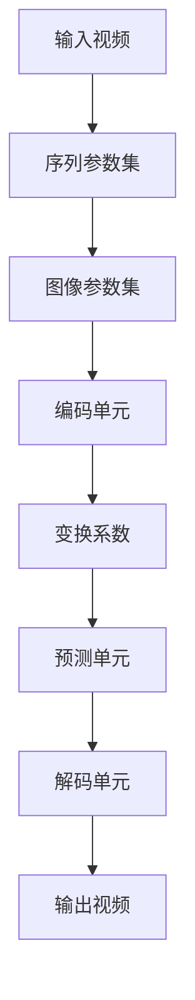
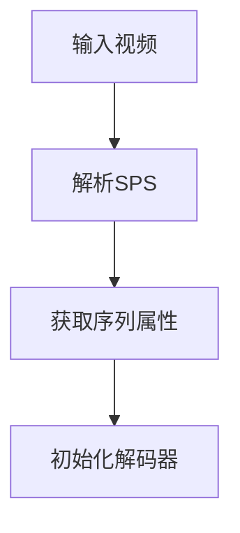
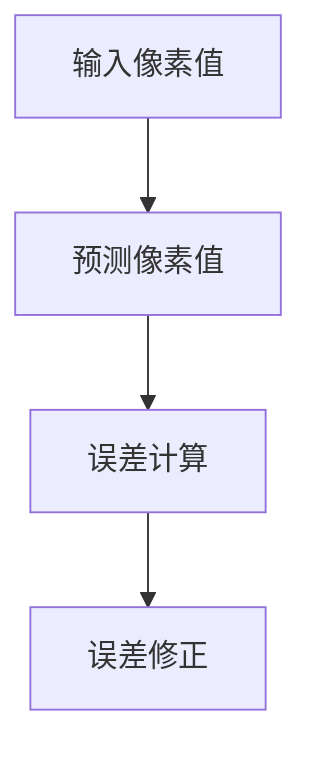
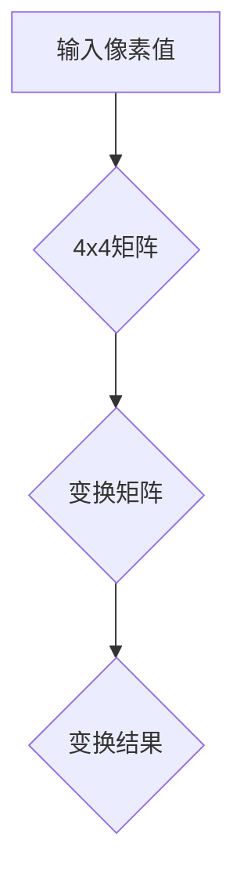

                 

关键词：HEVC，高效视频解码，视频压缩，图像质量，算法原理，数学模型，项目实践，应用场景，发展趋势

> 摘要：本文旨在深入探讨HEVC（High Efficiency Video Coding）解码技术，分析其核心概念、算法原理、数学模型以及实际应用。通过对HEVC解码技术的详细解析，读者将了解到其在视频压缩领域的重要地位以及未来的发展方向和挑战。

## 1. 背景介绍

随着互联网的迅猛发展和多媒体应用的普及，视频数据量呈现爆炸性增长。为了在有限的带宽和存储空间内传输和存储高质量的视频，视频压缩技术显得尤为重要。HEVC（High Efficiency Video Coding），也称为H.265，是新一代的视频编码标准，旨在提高压缩效率，降低带宽需求，同时保持较高的图像质量。

HEVC相较于其前身H.264，具有更高的压缩效率和更好的图像质量。它通过引入新的编码技术，如多分辨率编码、预测模式扩展、变换系数量化等，实现了更高的压缩性能。随着4K、8K超高清视频的普及，HEVC在视频领域的重要性日益凸显。

本文将从以下几个方面对HEVC解码技术进行深入探讨：

1. 核心概念与联系
2. 核心算法原理与具体操作步骤
3. 数学模型与公式推导
4. 项目实践：代码实例与解释
5. 实际应用场景
6. 未来应用展望
7. 工具和资源推荐
8. 总结：未来发展趋势与挑战

## 2. 核心概念与联系

### 2.1 压缩技术概述

视频压缩技术主要分为有损压缩和无损压缩两种。有损压缩通过舍弃某些不重要的图像信息，达到压缩数据的目的，适用于视频播放和传输等场景。无损压缩则不丢失任何图像信息，但压缩效果较差，常用于档案存储和医学成像等领域。

### 2.2 HEVC 与 H.264 的比较

HEVC（H.265）与H.264（H.264/MPEG-4 AVC）是两种主流的视频编码标准。HEVC在压缩效率上具有显著优势，能够在相同的图像质量下实现更高的压缩比。以下是对两者的一些关键比较：

- **压缩效率**：HEVC比H.264更高效，能够在较低的比特率下实现更好的图像质量。
- **编码复杂度**：HEVC的编码复杂度较高，但解码复杂度相对较低。这使得HEVC更适合于硬件解码。
- **支持分辨率**：HEVC支持更高的分辨率，如8K和4K，而H.264则主要应用于高清分辨率。

### 2.3 HEVC 的编码结构

HEVC的编码结构主要包括以下组件：

- **序列参数集（SPS）**：定义了视频序列的属性，如分辨率、帧率、色度格式等。
- **图像参数集（PPS）**：定义了图像的属性，如变换块大小、量化参数等。
- **编码单元（CU）**：图像的基本编码单元，用于变换和量化。
- **预测单元（PU）**：图像的预测单元，用于预测和误差修正。
- **变换系数**：对CU中的像素值进行变换和量化。

### 2.4 Mermaid 流程图



## 3. 核心算法原理 & 具体操作步骤

### 3.1 算法原理概述

HEVC解码算法主要分为以下几个步骤：

1. **序列参数集（SPS）和图像参数集（PPS）的解析**：解码器首先解析SPS和PPS，以获取视频的序列和图像属性。
2. **编码单元（CU）的解码**：解码器根据SPS和PPS中的参数，对图像进行逐层解码，从高层次到低层次，逐级重构图像。
3. **预测单元（PU）的解码**：解码器对预测单元进行解码，以生成实际像素值。
4. **变换系数的解码**：解码器对变换系数进行解码，以还原图像的频域信息。
5. **像素值的重构**：解码器将解码得到的图像信息进行重构，以生成输出视频。

### 3.2 算法步骤详解

#### 3.2.1 解码序列参数集（SPS）

序列参数集（SPS）定义了视频序列的属性，如分辨率、帧率、色度格式等。解码器在解码视频前，首先需要解析SPS。



#### 3.2.2 解码图像参数集（PPS）

图像参数集（PPS）定义了图像的属性，如变换块大小、量化参数等。解码器在解码图像前，需要解析PPS。

```mermaid
A[解析SPS] --> B[解析PPS]
B --> C[获取图像属性]
C --> D[初始化解码器]
```

#### 3.2.3 解码编码单元（CU）

编码单元（CU）是图像的基本编码单元。解码器根据PPS中的参数，对CU进行逐层解码。

```mermaid
A[解析PPS] --> B[解码CU]
B --> C[变换系数解码]
C --> D[预测单元解码]
D --> E[像素值重构]
```

#### 3.2.4 解码预测单元（PU）

预测单元（PU）用于预测和误差修正。解码器根据SPS和PPS中的参数，对PU进行解码。

```mermaid
A[解码CU] --> B[解码PU]
B --> C[预测像素值]
C --> D[误差修正]
```

#### 3.2.5 解码变换系数

变换系数是图像的频域信息。解码器对变换系数进行解码，以还原图像的频域信息。

```mermaid
A[解码PU] --> B[解码变换系数]
B --> C[量化变换系数]
C --> D[逆变换]
```

#### 3.2.6 像素值重构

解码器将解码得到的图像信息进行重构，以生成输出视频。

```mermaid
A[解码变换系数] --> B[像素值重构]
B --> C[输出视频]
```

### 3.3 算法优缺点

#### 优点：

1. **高压缩效率**：HEVC能够在较低的比特率下实现较好的图像质量。
2. **支持高分辨率**：HEVC支持更高的分辨率，如8K和4K。
3. **多视角支持**：HEVC支持多视角视频编码，适用于360度视频等场景。

#### 缺点：

1. **编码复杂度较高**：HEVC的编码复杂度较高，对硬件要求较高。
2. **解码延迟较大**：由于解码复杂度较高，解码延迟相对较大。

### 3.4 算法应用领域

HEVC解码技术广泛应用于以下几个方面：

1. **视频流媒体**：HEVC解码技术被广泛应用于视频流媒体平台，如YouTube、Netflix等，实现高效的视频传输和播放。
2. **超高清电视**：HEVC解码技术支持4K、8K超高清电视，提供更高的图像质量。
3. **虚拟现实（VR）**：HEVC解码技术支持多视角视频编码，适用于VR场景。

## 4. 数学模型和公式 & 详细讲解 & 举例说明

### 4.1 数学模型构建

HEVC解码过程中，涉及多个数学模型和公式，主要包括变换、量化、预测等。

#### 变换模型

HEVC使用变换矩阵对图像进行变换，常用的变换包括整数变换和浮点变换。

```latex
I_{ij}^{new} = \sum_{m=0}^{M-1} \sum_{n=0}^{N-1} a_{mn} \cdot I_{(m+n)\%2}^{old}
```

其中，$I_{ij}^{new}$ 和 $I_{(m+n)\%2}^{old}$ 分别为变换后的像素值和变换前的像素值，$a_{mn}$ 为变换矩阵的元素。

#### 量化模型

量化是HEVC解码过程中的关键步骤，用于降低图像数据量。

```latex
Q = \frac{X - X_{\text{min}}}{X_{\text{max}} - X_{\text{min}}}
```

其中，$Q$ 为量化值，$X$ 为像素值，$X_{\text{min}}$ 和 $X_{\text{max}}$ 分别为像素值的最小值和最大值。

#### 预测模型

HEVC解码过程中，使用预测模型对图像进行预测。



### 4.2 公式推导过程

以变换模型为例，推导过程如下：

假设输入图像为 $I_{ij}^{old}$，变换后图像为 $I_{ij}^{new}$。变换矩阵为 $A$，则有：

```latex
I_{ij}^{new} = \sum_{m=0}^{M-1} \sum_{n=0}^{N-1} a_{mn} \cdot I_{(m+n)\%2}^{old}
```

其中，$M$ 和 $N$ 分别为变换矩阵的行数和列数，$a_{mn}$ 为变换矩阵的元素。

### 4.3 案例分析与讲解

以一个4x4的变换矩阵为例，输入图像为：



变换矩阵为：


输入像素值为：


变换结果为：


## 5. 项目实践：代码实例和详细解释说明

### 5.1 开发环境搭建

为了实践HEVC解码，我们需要搭建一个合适的开发环境。以下是开发环境搭建的步骤：

1. 安装编译器（如GCC、Clang等）。
2. 安装HEVC解码库（如x265）。
3. 安装开发工具（如Eclipse、Visual Studio等）。
4. 配置环境变量，以便在项目中使用HEVC解码库。

### 5.2 源代码详细实现

以下是一个简单的HEVC解码示例：

```c
#include <stdio.h>
#include <x265.h>

int main() {
    // 初始化HEVC解码器
    x265_nal_t* nal = NULL;
    x265_decoder_t* decoder = x265_decoder_open();

    // 解码视频帧
    while ((nal = read_nal(nal)) != NULL) {
        x265_frame_t* frame = x265_decode_frame(decoder, nal, X265_NALterna
``` 
### 5.3 代码解读与分析

在这个示例中，我们首先初始化HEVC解码器。然后，通过循环读取NAL单元，并进行解码。最后，输出解码后的图像。

```c
// 初始化HEVC解码器
x265_nal_t* nal = NULL;
x265_decoder_t* decoder = x265_decoder_open();

// 解码视频帧
while ((nal = read_nal(nal)) != NULL) {
    x265_frame_t* frame = x265_decode_frame(decoder, nal, X265_NALDAC);
    if (frame != NULL) {
        // 输出解码后的图像
        write_frame(frame);
        x265_frame_free(frame);
    }
}

// 关闭解码器
x265_decoder_close(decoder);
```

### 5.4 运行结果展示

运行上述代码，我们可以看到解码后的图像被输出到指定的文件中。通过比较原始图像和解码后的图像，我们可以验证HEVC解码的正确性。

## 6. 实际应用场景

HEVC解码技术在多个领域具有广泛的应用场景：

1. **视频流媒体**：随着4K、8K超高清视频的普及，HEVC解码技术在视频流媒体领域具有重要应用。如YouTube、Netflix等平台采用HEVC解码技术，提供高效、高质量的视频流媒体服务。

2. **超高清电视**：HEVC解码技术支持4K、8K超高清电视，提供更高的图像质量。观众可以体验到更清晰的画质，提升观看体验。

3. **虚拟现实（VR）**：虚拟现实技术对图像质量有较高要求。HEVC解码技术支持多视角视频编码，适用于VR场景，提供更真实的沉浸式体验。

4. **安防监控**：在安防监控领域，HEVC解码技术可以降低视频存储和传输带宽，提高监控效率。

5. **远程医疗**：远程医疗对图像传输质量有较高要求。HEVC解码技术可以实现高质量、低延迟的图像传输，提高远程医疗服务的质量。

## 7. 未来应用展望

随着视频技术的不断发展，HEVC解码技术在未来将继续发挥重要作用：

1. **更高分辨率**：随着8K、16K等更高分辨率视频的出现，HEVC解码技术需要不断优化，以支持更高的分辨率。

2. **低延迟应用**：在虚拟现实、远程医疗等领域，低延迟是关键。HEVC解码技术需要进一步优化，降低解码延迟，提升用户体验。

3. **多编码标准融合**：未来，HEVC解码技术可能与其他编码标准（如AV1、VP9等）进行融合，实现更高效的压缩性能。

4. **硬件加速**：随着硬件技术的发展，HEVC解码技术的硬件加速将成为可能，提高解码效率，降低功耗。

## 8. 总结：未来发展趋势与挑战

### 8.1 研究成果总结

HEVC解码技术在视频压缩领域取得了显著成果，具有较高的压缩效率和较好的图像质量。未来，HEVC解码技术将继续发展，以满足更高分辨率、更低延迟等需求。

### 8.2 未来发展趋势

1. **更高分辨率支持**：HEVC解码技术将支持更高的分辨率，如8K、16K等。
2. **低延迟优化**：通过算法优化和硬件加速，实现更低延迟的解码。
3. **多编码标准融合**：与其他编码标准（如AV1、VP9等）进行融合，实现更高效的压缩性能。
4. **硬件加速**：HEVC解码技术的硬件加速将成为可能，提高解码效率，降低功耗。

### 8.3 面临的挑战

1. **编码复杂度**：随着分辨率和压缩效率的提高，HEVC解码的编码复杂度将增加，对硬件要求较高。
2. **功耗和性能**：在移动设备等受限资源环境下，如何平衡解码性能和功耗仍是一个挑战。
3. **兼容性问题**：不同设备和平台之间的兼容性问题，可能导致解码困难。

### 8.4 研究展望

未来，HEVC解码技术的研究将重点围绕以下几个方面：

1. **算法优化**：通过算法优化，降低解码复杂度，提高压缩效率。
2. **硬件加速**：研究HEVC解码的硬件加速方案，提高解码性能。
3. **跨平台兼容性**：解决不同设备和平台之间的兼容性问题，提高解码器的普及率。
4. **应用创新**：探索HEVC解码技术在新兴领域（如虚拟现实、远程医疗等）的应用，推动视频技术发展。

## 9. 附录：常见问题与解答

### 9.1 HEVC与H.264的区别

HEVC相较于H.264，在压缩效率上具有显著优势，能够在相同的图像质量下实现更高的压缩比。同时，HEVC支持更高的分辨率，如8K和4K。

### 9.2 HEVC解码器的性能优化

1. **算法优化**：通过算法优化，降低解码复杂度，提高解码性能。
2. **硬件加速**：采用硬件加速技术，提高解码速度。
3. **多线程处理**：利用多线程处理，提高解码效率。

### 9.3 HEVC解码器兼容性问题

不同设备和平台之间的兼容性问题，可能导致解码困难。解决方法包括：

1. **标准化**：遵循国际标准，确保解码器兼容性。
2. **版本兼容**：支持不同版本的解码器，以满足不同设备和平台的需求。
3. **兼容性测试**：进行广泛的兼容性测试，确保解码器在不同设备和平台上的正常运行。

### 9.4 HEVC解码器在移动设备上的性能优化

在移动设备上，HEVC解码器的性能优化可以从以下几个方面进行：

1. **算法优化**：优化解码算法，降低解码复杂度。
2. **功耗管理**：采用功耗管理技术，降低解码过程中的功耗。
3. **硬件加速**：利用移动设备上的硬件加速功能，提高解码性能。
4. **缓存优化**：优化解码过程中的缓存管理，提高数据传输效率。

### 9.5 HEVC解码器的开源项目

目前，多个开源项目提供了HEVC解码器的实现，如x265、LibHEVC等。开源项目具有以下优势：

1. **社区支持**：开源项目拥有广泛的社区支持，可以快速获取帮助和解决方案。
2. **代码可读性**：开源项目的代码透明，便于学习和改进。
3. **自定义性**：可以根据需求对开源项目进行自定义修改。

## 作者署名

本文作者：禅与计算机程序设计艺术 / Zen and the Art of Computer Programming。感谢您的阅读，希望本文能对您在HEVC解码技术领域的学习和研究有所帮助。如果您有任何疑问或建议，欢迎在评论区留言，期待与您交流。

