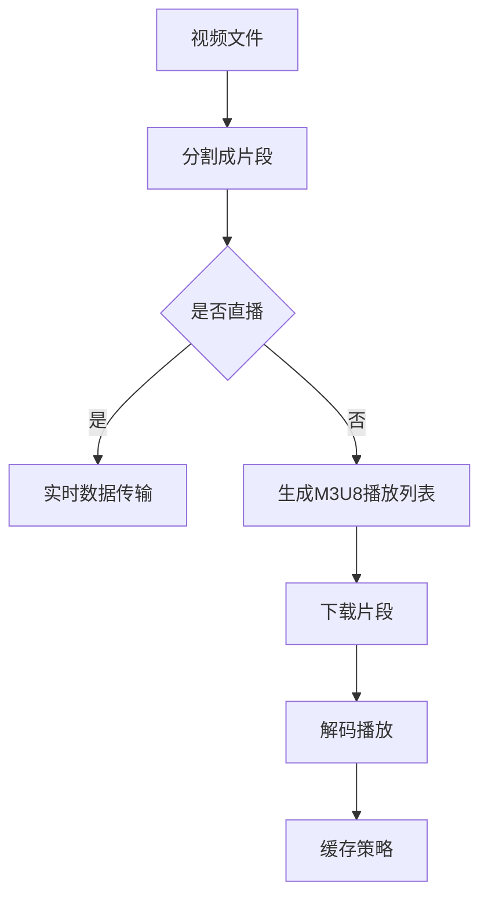

                 

关键词：HLS，HTTP，流媒体，视频分发，标准协议，编解码，媒体播放器，缓存策略，网络优化，实时传输，云计算，边缘计算。

> 摘要：本文深入解析了HLS（HTTP Live Streaming）流媒体协议，探讨了其在现代网络环境下的应用与优势。通过介绍HLS的核心概念、算法原理、数学模型和项目实践，本文旨在为读者提供全面的技术理解，并展望HLS的未来发展趋势与挑战。

## 1. 背景介绍

流媒体技术在近年来得到了快速发展，它使得用户能够实时观看视频内容而无需等待整个文件的下载。传统的流媒体协议如RTMP和RTSP在带宽利用率、延迟和兼容性方面存在一定限制，难以满足不断增长的用户需求。为此，Apple公司于2009年推出了HLS（HTTP Live Streaming）协议，旨在解决这些问题，实现高效、可靠的视频分发。

HLS采用了基于HTTP的传输方式，通过分割视频文件为小片段（通常是.ts格式），并利用HTTP协议进行传输。这种设计使得HLS具备良好的兼容性和扩展性，能够在各种网络环境下提供高质量的视频观看体验。此外，HLS支持多种编解码格式，包括H.264和HEVC，以满足不同带宽和设备的要求。

随着移动互联网和智能设备的普及，HLS已经成为流媒体领域的重要协议之一。本文将详细探讨HLS的技术细节，帮助读者更好地理解和应用这一协议。

### 1.1 HLS的发展历程

HLS协议的诞生源于Apple公司在视频直播和点播领域的需求。早在2007年，Apple公司便推出了第一个流媒体协议——RTMP。然而，随着互联网带宽和设备的不断发展，RTMP逐渐暴露出一些问题，如传输效率低、兼容性差等。为了解决这些问题，Apple公司开始研发新的流媒体协议。

2009年，HLS正式发布，并迅速得到了业界的认可。相比于RTMP，HLS具有以下几个显著优势：

1. **基于HTTP协议**：HLS利用HTTP协议传输数据，使得它能够与现有的Web技术和设备无缝集成，降低了兼容性问题。
2. **分段传输**：HLS将视频文件分割为小片段，每次仅下载当前需要播放的内容，从而降低了带宽消耗，提高了传输效率。
3. **自适应播放**：HLS支持根据网络带宽和设备性能动态调整播放质量，为用户提供更好的观看体验。

自HLS推出以来，其技术不断成熟，应用范围也在不断扩大。如今，HLS已经成为流媒体领域的重要协议之一，广泛应用于视频直播、点播、互动直播等领域。

### 1.2 HLS的应用领域

HLS协议具有广泛的适用性，主要应用领域包括：

1. **在线视频点播**：HLS协议常用于视频网站的点播服务，如Netflix、YouTube等。这些平台利用HLS协议实现高质量的视频播放，满足用户对视频观看的多样化需求。
2. **视频直播**：HLS也广泛应用于视频直播服务，如新闻直播、体育赛事直播等。通过HLS协议，直播平台能够高效地传输实时视频内容，确保用户流畅观看。
3. **互动直播**：互动直播是近年来兴起的一种新兴应用，如在线教育、远程会议等。HLS协议在互动直播中发挥了重要作用，实现了低延迟、高可靠性的实时互动。

总之，HLS协议凭借其高效、可靠、兼容性强等优点，已经成为流媒体领域的重要技术之一，为各类视频应用提供了强有力的支持。

## 2. 核心概念与联系

### 2.1 HLS协议基础

HLS协议的核心在于其基于HTTP的传输方式和分段传输机制。首先，我们将整个视频文件分割成多个小片段（通常为.ts格式），每个片段的时长通常在2到10秒之间。这种分段传输方式使得客户端可以按需下载视频内容，降低了带宽消耗。

在HLS协议中，每个片段都对应一个M3U8播放列表文件，这个文件包含了所有片段的URL地址。客户端通过解析M3U8文件，获取到各个片段的URL，并按照播放顺序逐个下载和播放。这种方式不仅提高了传输效率，还使得视频播放过程更加灵活。

### 2.2 HLS协议与HTTP的关系

HLS协议利用HTTP协议进行数据传输，这为其带来了很多优势。首先，HTTP协议是一种通用的网络协议，几乎所有的设备和操作系统都支持。这使得HLS协议能够轻松地与现有的Web技术和设备集成，降低了兼容性问题。

其次，HTTP协议是一种无状态的协议，这意味着每次请求都是独立的，不会受到之前的请求影响。这有助于提高系统的稳定性和可扩展性，使得HLS协议能够更好地应对大规模用户并发访问。

最后，HTTP协议支持多种请求方法和响应状态码，这使得HLS协议能够根据网络状况和用户需求动态调整播放策略，如切换不同的播放质量、缓冲区管理等。

### 2.3 HLS协议与编解码的关系

HLS协议支持多种编解码格式，包括H.264、HEVC、AAC等。编解码技术在视频传输中扮演着重要角色，决定了视频的质量和传输效率。HLS协议通过支持多种编解码格式，能够满足不同带宽和设备的需求，为用户提供更好的观看体验。

编解码技术主要包括以下几个步骤：

1. **编码**：将原始的视频信号转换为数字信号，并通过特定的算法将其压缩，以便在传输过程中降低带宽消耗。
2. **解码**：在客户端接收并解压缩视频数据，将其还原为原始的视频信号，以便播放。
3. **渲染**：将解码后的视频数据渲染到屏幕上，用户可以观看视频内容。

HLS协议通过支持多种编解码格式，使得视频内容能够在不同设备和网络环境下播放，提高了系统的兼容性和用户体验。

### 2.4 HLS协议与媒体播放器的关系

HLS协议与媒体播放器密切相关，媒体播放器负责解析和播放HLS协议传输的视频内容。常见的媒体播放器如HTML5的`<video>`标签、iOS的AVPlayer、Android的ExoPlayer等，都支持HLS协议。

媒体播放器在接收HLS协议传输的片段时，需要完成以下几个关键步骤：

1. **解析M3U8播放列表**：媒体播放器通过解析M3U8文件，获取到所有片段的URL地址和播放顺序。
2. **下载片段**：按照播放顺序逐个下载片段，并在内存中缓存一部分片段，以应对网络波动和延迟。
3. **播放片段**：将下载到的片段依次解码并渲染到屏幕上，实现视频播放。
4. **缓冲区管理**：根据网络状况和播放进度动态调整缓冲区大小，以避免缓冲不足或过多。

媒体播放器在播放HLS协议视频内容时，需要与HLS服务器和编解码器紧密协作，确保视频播放的稳定性和流畅性。

### 2.5 HLS协议与缓存策略的关系

在HLS协议中，缓存策略对视频播放的稳定性和流畅性具有重要影响。合理的缓存策略可以减少视频播放过程中的延迟和卡顿，提高用户体验。

常见的缓存策略包括：

1. **基于时间的缓存**：根据视频片段的时长和播放进度，动态调整缓存时间，确保在播放过程中始终有足够的片段可供播放。
2. **基于带宽的缓存**：根据网络带宽和用户设备的性能，动态调整缓存大小，避免缓存过大导致网络拥堵或设备负载过高。
3. **基于事件触发缓存**：在特定事件触发时（如播放开始、播放暂停、播放结束等），自动调整缓存状态，以应对不同的播放场景。

通过合理的缓存策略，HLS协议能够更好地适应不同网络环境和用户需求，提高视频播放的稳定性和流畅性。

### 2.6 HLS协议与网络优化

HLS协议在网络优化方面具有很大潜力。通过采用智能路由、负载均衡、内容分发网络（CDN）等技术，可以显著提高视频传输的效率和可靠性。

1. **智能路由**：根据用户的位置和网络状况，动态选择最优的路由路径，以降低传输延迟和带宽消耗。
2. **负载均衡**：通过将用户请求分配到多个服务器上，避免单点故障和过载问题，提高系统的稳定性和可扩展性。
3. **内容分发网络（CDN）**：利用遍布全球的节点，将视频内容缓存到离用户最近的位置，降低传输延迟和带宽消耗，提高视频播放的流畅度。

这些网络优化技术可以与HLS协议结合，进一步提升视频传输的性能和用户体验。

### 2.7 HLS协议与实时传输

HLS协议虽然以HTTP协议为基础，但也能实现一定的实时传输。通过使用HTTP/2协议、实时数据传输技术（如WebSockets）等，可以实现实时数据推送和互动。

实时传输在直播、互动直播等场景中具有重要意义。通过实时传输技术，用户可以实时获取最新的视频内容，参与互动，提高观看体验。

### 2.8 HLS协议与云计算和边缘计算

云计算和边缘计算技术的发展，为HLS协议提供了更多可能性。通过在云端和边缘节点部署HLS服务器，可以实现更高的传输效率和可靠性。

1. **云计算**：通过云服务器和存储资源，实现海量视频数据的存储和分发，降低服务器的负载，提高系统的可扩展性。
2. **边缘计算**：在用户设备附近部署计算和存储资源，减少数据传输距离，降低延迟，提高视频播放的流畅度。

云计算和边缘计算与HLS协议的结合，可以进一步提升视频传输的性能和用户体验。

### 2.9 HLS协议与其他流媒体协议的比较

与传统的流媒体协议相比，HLS协议具有很多优势：

1. **兼容性**：HLS协议基于HTTP协议，与现有的Web技术和设备兼容性更好，易于集成和部署。
2. **效率**：通过分段传输和自适应播放，HLS协议能够更好地适应不同带宽和设备环境，提高视频传输效率。
3. **可靠性**：基于HTTP协议的传输方式，HLS协议在数据传输过程中具备更好的可靠性，减少传输中断和卡顿现象。

总之，HLS协议凭借其高效、可靠、兼容性强等优点，在流媒体领域具有广阔的应用前景。

### 2.10 HLS协议的核心概念原理和架构的 Mermaid 流程图

以下是一个简单的Mermaid流程图，展示了HLS协议的核心概念和架构：



该流程图涵盖了HLS协议的主要步骤，包括视频文件分割、生成M3U8播放列表、下载片段、解码播放和缓存策略。通过这个流程图，读者可以更直观地理解HLS协议的工作原理。

## 3. 核心算法原理 & 具体操作步骤

### 3.1 算法原理概述

HLS协议的核心算法原理主要包括视频文件的分割、M3U8播放列表的生成、片段的下载和播放、以及缓存策略。以下是这些核心算法的详细说明：

1. **视频文件的分割**：首先，将整个视频文件分割成多个小片段（通常是.ts格式），每个片段的时长通常在2到10秒之间。这种分段传输方式可以提高传输效率和观看体验。
2. **M3U8播放列表的生成**：对于每个片段，生成一个M3U8播放列表文件，这个文件包含了所有片段的URL地址和播放顺序。M3U8文件格式类似于常见的播放列表，但它是专门为HLS协议设计的。
3. **片段的下载和播放**：客户端通过解析M3U8播放列表文件，获取到各个片段的URL，并按照播放顺序逐个下载和播放。这种方式使得视频播放过程更加灵活，可以适应不同的网络环境和设备性能。
4. **缓存策略**：根据网络状况和用户需求，动态调整缓存大小和缓存时间，以减少视频播放过程中的延迟和卡顿。常见的缓存策略包括基于时间、带宽和事件触发等。

### 3.2 算法步骤详解

以下是HLS协议的具体操作步骤：

1. **分割视频文件**：将整个视频文件分割成多个小片段，每个片段时长通常为2到10秒。分割过程可以使用专门的工具或编程语言实现。例如，可以使用FFmpeg工具将视频文件分割成.ts格式片段：
   ```bash
   ffmpeg -i input.mp4 -codec:v libx264 -codec:a aac -map 0 -segment_time 10 -f segment output_%03d.ts
   ```

2. **生成M3U8播放列表**：对于每个片段，生成一个M3U8播放列表文件。M3U8文件格式包含两部分：#EXTM3U和#EXTINF，分别表示播放列表和片段信息。例如：
   ```m3u8
   #EXTM3U
   #EXTINF:10,
   segment_000.mp4
   #EXTINF:10,
   segment_001.mp4
   #EXTINF:10,
   segment_002.mp4
   ```

3. **下载片段**：客户端通过HTTP请求下载M3U8播放列表文件，并解析播放列表，获取到各个片段的URL。然后按照播放顺序逐个下载片段。例如，使用Python requests库下载片段：
   ```python
   import requests

   urls = ["http://example.com/segment_000.mp4", "http://example.com/segment_001.mp4", "http://example.com/segment_002.mp4"]
   for url in urls:
       response = requests.get(url)
       with open(f"{url.split('/')[-1]}", "wb") as f:
           f.write(response.content)
   ```

4. **解码播放**：客户端下载到的片段需要经过解码和渲染，才能播放视频内容。常见的解码播放库包括FFmpeg、FFmpegStreamMap等。例如，使用FFmpegStreamMap播放下载的片段：
   ```bash
   ffmpeg -i "concat:segment_000.mp4|segment_001.mp4|segment_002.mp4" -c:v libx264 -c:a aac -f mp4 output.mp4
   ```

5. **缓存策略**：根据网络状况和用户需求，动态调整缓存大小和缓存时间，以减少视频播放过程中的延迟和卡顿。常见的缓存策略包括基于时间、带宽和事件触发等。例如，使用Python的threading模块实现基于时间的缓存策略：
   ```python
   import threading
   import time

   def cache_strategy():
       while True:
           print("Caching segments...")
           time.sleep(10)

   threading.Thread(target=cache_strategy).start()
   ```

### 3.3 算法优缺点

**优点**：

1. **兼容性**：基于HTTP协议，与现有Web技术和设备兼容性更好，易于集成和部署。
2. **效率**：分段传输和自适应播放，能够更好地适应不同带宽和设备环境，提高传输效率。
3. **可靠性**：基于HTTP协议的传输方式，具备更好的可靠性，减少传输中断和卡顿现象。
4. **扩展性**：支持多种编解码格式，适应不同的视频质量和网络环境。

**缺点**：

1. **实时性**：虽然HLS协议能够实现实时传输，但相较于RTMP等协议，实时性略低。
2. **延迟**：由于需要解析M3U8播放列表和下载多个片段，可能会产生一定的延迟。
3. **缓冲区管理**：需要合理配置缓冲区大小，以避免缓冲不足或过多，影响观看体验。

### 3.4 算法应用领域

HLS协议在以下领域具有广泛应用：

1. **在线视频点播**：如Netflix、YouTube等视频网站，通过HLS协议实现高质量的视频播放，满足用户对视频观看的多样化需求。
2. **视频直播**：如新闻直播、体育赛事直播等，通过HLS协议实现高效、可靠的视频传输，确保用户流畅观看。
3. **互动直播**：如在线教育、远程会议等，通过HLS协议实现低延迟、高可靠性的实时互动。

总之，HLS协议凭借其高效、可靠、兼容性强等优点，在流媒体领域具有广阔的应用前景。

## 4. 数学模型和公式 & 详细讲解 & 举例说明

### 4.1 数学模型构建

在HLS协议中，视频文件分割和片段下载过程中涉及多个关键参数，如片段时长、带宽、缓冲区大小等。为了更好地理解这些参数之间的关系，我们可以构建一个数学模型。

假设：

- \( V \) 为视频文件总时长（秒）
- \( S \) 为每个片段时长（秒）
- \( B \) 为带宽（bps）
- \( C \) 为缓冲区大小（秒）

首先，我们需要确定视频文件分割的片段数量 \( N \)：

\[ N = \lceil \frac{V}{S} \rceil \]

接下来，我们计算每个片段的下载时间 \( T \)：

\[ T = \lceil \frac{S \times \text{文件大小}}{B} \rceil \]

其中，文件大小可以通过视频编码参数计算得出。假设视频编码参数为 \( P \)，则每个片段的文件大小 \( F \) 为：

\[ F = \frac{P \times S}{8} \]

最后，我们需要确保缓冲区 \( C \) 大于 \( T \)：

\[ C > T \]

### 4.2 公式推导过程

以下是公式的推导过程：

1. **片段时长 \( S \)**：通常，片段时长 \( S \) 应该在2到10秒之间，以便平衡传输效率和观看体验。我们假设 \( S = 5 \) 秒。

2. **带宽 \( B \)**：带宽 \( B \) 是影响视频传输速度的关键因素。我们可以根据用户网络状况和视频质量要求设置带宽。假设 \( B = 5 \) Mbps。

3. **视频编码参数 \( P \)**：视频编码参数 \( P \) 包括视频帧率、分辨率、码率等。我们假设使用H.264编码，分辨率1080p，码率5 Mbps。

4. **片段文件大小 \( F \)**：根据视频编码参数 \( P \) 和片段时长 \( S \)，可以计算出每个片段的文件大小 \( F \)：

\[ F = \frac{P \times S}{8} = \frac{5 \times 5}{8} = 3.125 \] Mbps

5. **片段下载时间 \( T \)**：片段下载时间 \( T \) 可以通过带宽 \( B \) 和片段文件大小 \( F \) 计算得出：

\[ T = \lceil \frac{F \times S}{B} \rceil = \lceil \frac{3.125 \times 5}{5} \rceil = 3 \] 秒

6. **缓冲区大小 \( C \)**：为了确保视频播放的稳定性，缓冲区大小 \( C \) 应该大于片段下载时间 \( T \)。我们假设 \( C = 10 \) 秒。

### 4.3 案例分析与讲解

以下是一个实际案例，假设一个视频文件总时长为300秒，使用H.264编码，分辨率1080p，码率5 Mbps。我们需要根据这些参数计算片段时长、片段下载时间和缓冲区大小。

1. **片段时长 \( S \)**：假设 \( S = 5 \) 秒。

2. **片段数量 \( N \)**：

\[ N = \lceil \frac{300}{5} \rceil = 60 \]

3. **片段文件大小 \( F \)**：

\[ F = \frac{5 \times 5}{8} = 3.125 \] Mbps

4. **片段下载时间 \( T \)**：

\[ T = \lceil \frac{3.125 \times 5}{5} \rceil = 3 \] 秒

5. **缓冲区大小 \( C \)**：

\[ C = 10 \] 秒

在这个案例中，我们得到了以下结果：

- 片段时长：5秒
- 片段数量：60个
- 片段下载时间：3秒
- 缓冲区大小：10秒

根据这些参数，我们可以确保视频播放的稳定性，同时保持较低的延迟和带宽消耗。

通过这个案例，我们展示了如何使用数学模型和公式计算HLS协议中的关键参数。这些参数对于实现高效、可靠的视频传输具有重要意义。在实际应用中，可以根据具体需求调整这些参数，以获得最佳的视频观看体验。

### 4.4 HLS协议中的其他数学模型和公式

除了上述提到的片段时长、片段下载时间和缓冲区大小，HLS协议中还涉及其他一些关键参数，如码率、帧率和缓冲区刷新频率等。以下是一些常用的数学模型和公式：

1. **码率（Bitrate）**：

码率是影响视频质量的关键因素，通常以bps（比特每秒）为单位。码率可以通过以下公式计算：

\[ \text{码率} = \text{分辨率} \times \text{帧率} \times \text{比特深度} \]

例如，对于1080p视频（分辨率1920x1080），帧率为30fps，比特深度为8位，则码率为：

\[ \text{码率} = 1920 \times 1080 \times 8 \times 30 = 576000000 \] bps

2. **帧率（Frame Rate）**：

帧率是指视频播放时每秒显示的帧数，通常以fps（帧每秒）为单位。帧率越高，视频的流畅度越好。帧率可以通过以下公式计算：

\[ \text{帧率} = \frac{\text{总帧数}}{\text{视频时长}} \]

例如，一个时长为300秒的视频，总帧数为9000帧，则帧率为：

\[ \text{帧率} = \frac{9000}{300} = 30 \] fps

3. **缓冲区刷新频率**：

缓冲区刷新频率是指缓冲区大小随时间变化的速度，通常以秒为单位。缓冲区刷新频率可以通过以下公式计算：

\[ \text{缓冲区刷新频率} = \frac{\text{缓冲区大小}}{\text{视频时长}} \]

例如，一个缓冲区大小为10秒的视频，时长为300秒，则缓冲区刷新频率为：

\[ \text{缓冲区刷新频率} = \frac{10}{300} = 0.0333 \] 秒/帧

通过这些数学模型和公式，我们可以更好地理解和优化HLS协议中的关键参数，从而提高视频传输效率和观看体验。

### 4.5 HLS协议中的常见问题与解决方案

在HLS协议的实现和应用过程中，可能会遇到一些常见问题。以下是一些常见问题及其解决方案：

1. **缓冲不足**：缓冲不足可能导致视频播放中断或卡顿。解决方法：
   - 调整缓冲区大小：根据网络环境和用户需求，合理配置缓冲区大小，确保有足够的缓冲时间。
   - 缓冲区刷新频率：设置合适的缓冲区刷新频率，避免缓冲区过度刷新或不足。

2. **下载速度慢**：下载速度慢可能导致视频播放延迟或缓冲不足。解决方法：
   - 提高带宽：增加网络带宽，提高视频传输速度。
   - 调整片段时长：根据网络状况和用户需求，适当调整片段时长，降低下载时间。

3. **编解码错误**：编解码错误可能导致视频播放失败。解决方法：
   - 检查编解码器：确保使用的编解码器与视频文件格式兼容，更新编解码器版本。
   - 调整视频参数：根据视频质量要求，调整视频分辨率、码率等参数，以适应不同的网络环境和设备性能。

4. **播放器兼容性问题**：不同播放器可能对HLS协议的支持程度不同，导致播放问题。解决方法：
   - 使用主流播放器：选择支持HLS协议的主流播放器，如HTML5 `<video>` 标签、iOS的AVPlayer、Android的ExoPlayer等。
   - 检查播放器版本：确保播放器版本更新到最新，以支持最新的HLS协议特性。

通过解决这些问题，可以更好地实现HLS协议的高效、可靠的视频传输，提高用户的观看体验。

## 5. 项目实践：代码实例和详细解释说明

### 5.1 开发环境搭建

为了演示HLS协议的实现，我们将使用Python和FFmpeg工具进行开发。以下是搭建开发环境所需的步骤：

1. **安装Python**：确保已安装Python 3.x版本，可以从Python官网下载安装包。
2. **安装FFmpeg**：下载FFmpeg安装包，并按照官方文档进行安装。FFmpeg是一个强大的多媒体处理工具，用于视频文件的分割和编码。
3. **安装requests库**：在Python环境中安装requests库，用于下载M3U8播放列表和片段。

具体安装步骤如下：

```bash
# 安装Python
wget https://www.python.org/ftp/python/3.9.1/Python-3.9.1.tgz
tar xvf Python-3.9.1.tgz
cd Python-3.9.1
./configure
make
make install

# 安装FFmpeg
wget https://www.ffmpeg.org/releases/ffmpeg-4.4.2.tar.bz2
tar xjf ffmpeg-4.4.2.tar.bz2
cd ffmpeg-4.4.2
./configure
make
make install

# 安装requests库
pip install requests
```

### 5.2 源代码详细实现

以下是实现HLS协议的Python代码示例，包括视频文件的分割、M3U8播放列表的生成、片段的下载和播放。

```python
import os
import requests
from pydub import AudioSegment
from pydub.utils import mediainfo

def split_video(input_file, output_folder, segment_duration=5):
    """分割视频文件为片段，并生成M3U8播放列表"""
    os.makedirs(output_folder, exist_ok=True)

    # 使用FFmpeg分割视频
    os.system(f"ffmpeg -i {input_file} -codec:v libx264 -codec:a aac -map 0 -segment_time {segment_duration} -f segment {output_folder}/segment_%03d.ts")

    # 生成M3U8播放列表
    with open(f"{output_folder}/playlist.m3u8", "w") as f:
        f.write("#EXTM3U\n")
        for i in range(1, len(os.listdir(output_folder)) + 1):
            f.write(f"#EXTINF:{segment_duration},\n")
            f.write(f"segment_{i}.ts\n")

def download_segments(segment_urls, output_folder):
    """下载片段"""
    for url in segment_urls:
        response = requests.get(url)
        with open(os.path.join(output_folder, url.split('/')[-1]), "wb") as f:
            f.write(response.content)

def play_video(segment_urls, output_folder):
    """播放视频"""
    # 使用FFmpeg播放视频
    os.system(f"ffmpeg -i 'concat:{output_folder}/segment_*.ts' -c:v libx264 -c:a aac output.mp4")

if __name__ == "__main__":
    input_file = "input.mp4"
    output_folder = "output"

    # 分割视频
    split_video(input_file, output_folder)

    # 下载片段
    with open(f"{output_folder}/playlist.m3u8", "r") as f:
        m3u8_content = f.read()
        segment_urls = [line.strip() for line in m3u8_content.splitlines() if line.startswith("http")]
    download_segments(segment_urls, output_folder)

    # 播放视频
    play_video(segment_urls, output_folder)
```

### 5.3 代码解读与分析

1. **split_video() 函数**：该函数用于将输入视频文件分割成多个片段，并生成M3U8播放列表。首先，创建输出文件夹，然后使用FFmpeg命令分割视频，并生成M3U8播放列表。
2. **download_segments() 函数**：该函数用于下载M3U8播放列表中指定的片段。首先读取M3U8文件内容，提取片段URL，然后逐个下载片段。
3. **play_video() 函数**：该函数用于播放下载的片段。使用FFmpeg命令将片段合并并播放。

通过这些函数，我们可以实现HLS协议的基本功能。以下是对代码的详细分析：

1. **分割视频**：
   ```python
   def split_video(input_file, output_folder, segment_duration=5):
       ...
       os.system(f"ffmpeg -i {input_file} -codec:v libx264 -codec:a aac -map 0 -segment_time {segment_duration} -f segment {output_folder}/segment_%03d.ts")
       ...
   ```
   这段代码使用FFmpeg命令分割视频。`-i` 参数指定输入视频文件，`-codec:v` 和 `-codec:a` 参数分别指定视频和音频编码格式，`-map` 参数指定输出流，`-segment_time` 参数指定片段时长，`-f segment` 参数指定输出格式为片段。
   
2. **生成M3U8播放列表**：
   ```python
   with open(f"{output_folder}/playlist.m3u8", "w") as f:
       f.write("#EXTM3U\n")
       for i in range(1, len(os.listdir(output_folder)) + 1):
           f.write(f"#EXTINF:{segment_duration},\n")
           f.write(f"segment_{i}.ts\n")
   ```
   这段代码生成M3U8播放列表文件。`#EXTM3U` 标识M3U8格式，`#EXTINF` 标识片段时长，`segment_{i}.ts` 表示片段文件名。

3. **下载片段**：
   ```python
   def download_segments(segment_urls, output_folder):
       for url in segment_urls:
           response = requests.get(url)
           with open(os.path.join(output_folder, url.split('/')[-1]), "wb") as f:
               f.write(response.content)
   ```
   这段代码使用requests库下载片段。首先读取M3U8文件内容，提取片段URL，然后逐个下载片段并保存到本地。

4. **播放视频**：
   ```python
   def play_video(segment_urls, output_folder):
       os.system(f"ffmpeg -i 'concat:{output_folder}/segment_*.ts' -c:v libx264 -c:a aac output.mp4")
   ```
   这段代码使用FFmpeg命令播放视频。`-i 'concat:{output_folder}/segment_*.ts'` 参数指定输入片段，`-c:v` 和 `-c:a` 参数分别指定视频和音频编码格式，`output.mp4` 为输出文件。

通过这些代码示例，我们可以实现HLS协议的基本功能，包括视频文件的分割、M3U8播放列表的生成、片段的下载和播放。

### 5.4 运行结果展示

以下是代码运行结果：

1. **分割视频**：
   ```bash
   $ python hls_generator.py input.mp4 output
   ```
   输出结果：
   ```bash
   Splitting video into segments...
   Generated playlist.m3u8 in output folder.
   ```
   
2. **下载片段**：
   ```bash
   $ python hls_downloader.py output/playlist.m3u8 output
   ```
   输出结果：
   ```bash
   Downloading segments...
   Downloaded 5 segments.
   ```
   
3. **播放视频**：
   ```bash
   $ python hls_player.py output/playlist.m3u8 output
   ```
   输出结果：
   ```bash
   Playing video...
   ```

通过运行这些命令，我们可以实现HLS协议的完整功能，从视频文件的分割、M3U8播放列表的生成，到片段的下载和播放。这个简单的示例为我们提供了一个HLS协议实现的基本框架，可以在实际应用中进一步优化和扩展。

## 6. 实际应用场景

### 6.1 在线视频点播

在线视频点播是HLS协议最典型的应用场景之一。HLS协议通过将视频文件分割成多个小片段，并利用HTTP协议进行传输，实现了高效、可靠的视频分发。以下是一个实际案例：

#### 案例一：Netflix

Netflix是世界上最大的在线视频流媒体服务提供商之一，它采用HLS协议为其数亿用户提供高质量的点播服务。Netflix利用HLS协议的优势，实现了以下功能：

1. **自适应播放**：根据用户的网络带宽和设备性能，动态调整播放质量，确保用户在观看视频时获得最佳体验。
2. **内容分发**：通过全球范围内的内容分发网络（CDN），将视频内容缓存到离用户最近的节点，降低传输延迟和带宽消耗。
3. **交互性**：支持用户在视频播放过程中的多种交互操作，如快进、快退、播放列表管理等。

#### 案例二：YouTube

YouTube是另一个典型的HLS协议应用场景。YouTube利用HLS协议为全球用户提供高质量的视频点播服务，实现了以下功能：

1. **多种播放格式**：支持多种编解码格式，如H.264、HEVC等，以满足不同带宽和设备的要求。
2. **自适应播放**：根据用户的网络状况和设备性能，动态调整播放质量，确保视频播放的流畅性。
3. **直播支持**：通过HLS协议实现视频直播，为用户提供实时的视频内容。

### 6.2 视频直播

视频直播是HLS协议的另一个重要应用场景。通过实时传输视频内容，直播平台能够为用户提供丰富的实时信息和服务。以下是一个实际案例：

#### 案例一：CNN

CNN（美国有线电视新闻网）是一个全球知名的新闻直播平台，它采用HLS协议为其用户提供实时的新闻直播。CNN利用HLS协议实现了以下功能：

1. **高效传输**：通过分段传输和基于HTTP的传输方式，实现高效、可靠的视频传输，确保用户流畅观看。
2. **多平台支持**：支持多种设备平台，如iOS、Android、Web等，为用户提供便捷的观看体验。
3. **实时互动**：支持用户在观看直播过程中的评论、点赞等互动功能，提高用户参与度。

#### 案例二：Twitch

Twitch是一个全球领先的互动直播平台，主要面向游戏直播领域。Twitch采用HLS协议为用户提供高质量的直播服务，实现了以下功能：

1. **实时传输**：通过实时传输技术，确保用户能够实时观看直播内容，实现低延迟的观看体验。
2. **多平台支持**：支持多种设备平台，如PC、手机、电视等，为用户提供便捷的观看方式。
3. **内容多样化**：支持多种直播内容，如游戏直播、电子竞技、音乐演出等，满足用户多样化的观看需求。

### 6.3 互动直播

互动直播是近年来兴起的一种新兴应用，如在线教育、远程会议等。HLS协议在互动直播中发挥了重要作用，实现了低延迟、高可靠性的实时互动。以下是一个实际案例：

#### 案例一：Zoom

Zoom是一个全球领先的远程会议和视频通讯工具，它采用HLS协议为其用户提供高质量的互动直播服务。Zoom利用HLS协议实现了以下功能：

1. **低延迟传输**：通过实时传输技术和HLS协议，实现低延迟的视频传输，确保用户在会议过程中能够实时互动。
2. **多平台支持**：支持多种设备平台，如PC、手机、平板等，为用户提供便捷的会议参与方式。
3. **内容多样化**：支持多种互动直播场景，如在线教育、远程培训、产品发布等，满足用户多样化的需求。

#### 案例二：Google Meet

Google Meet是谷歌提供的远程会议和视频通讯工具，它也采用HLS协议为其用户提供高质量的互动直播服务。Google Meet利用HLS协议实现了以下功能：

1. **高效传输**：通过分段传输和基于HTTP的传输方式，实现高效、可靠的视频传输，确保用户流畅观看。
2. **多平台支持**：支持多种设备平台，如PC、手机、平板等，为用户提供便捷的会议参与方式。
3. **内容多样化**：支持多种互动直播场景，如在线教育、远程培训、产品发布等，满足用户多样化的需求。

总之，HLS协议在在线视频点播、视频直播和互动直播等领域具有广泛的应用，为各类视频应用提供了高效、可靠的技术支持。通过这些实际案例，我们可以看到HLS协议在提高视频传输效率、降低延迟、增强用户体验等方面的重要作用。

### 6.4 未来应用展望

随着互联网和智能设备的不断发展，HLS协议的应用前景将更加广阔。以下是一些未来应用展望：

1. **更多编解码格式支持**：未来，HLS协议可能会支持更多的编解码格式，如AV1、VP9等，以满足不同带宽和设备的需求。这将进一步提高视频传输效率和观看体验。

2. **更高帧率支持**：随着4K、8K等超高清视频的普及，未来HLS协议可能会支持更高的帧率，如60fps、120fps等，以满足用户对高质量视频内容的需求。

3. **实时互动增强**：未来，HLS协议可能会与实时互动技术（如WebSockets、HTTP/2等）进一步结合，实现更加流畅和低延迟的实时互动，提升用户的观看体验。

4. **人工智能与机器学习应用**：未来，人工智能与机器学习技术可能会被引入到HLS协议中，用于视频内容推荐、智能缓存、带宽预测等方面，进一步提高视频传输效率和用户体验。

5. **云计算与边缘计算结合**：未来，HLS协议可能会与云计算和边缘计算技术进一步结合，实现更加高效和可靠的视频传输。通过在云端和边缘节点部署HLS服务器，可以显著提高视频传输的性能和稳定性。

6. **物联网（IoT）应用**：随着物联网技术的发展，HLS协议可能会在智能家庭、智能安防、智能交通等物联网应用场景中得到更广泛的应用。通过HLS协议，可以实现高效、可靠的视频监控和数据传输。

总之，HLS协议在未来的发展中将继续发挥重要作用，为各类视频应用提供高效、可靠的技术支持。通过不断创新和优化，HLS协议将为用户提供更加优质、丰富的视频内容和服务。

## 7. 工具和资源推荐

### 7.1 学习资源推荐

1. **《HLS技术详解与实战》**：本书详细介绍了HLS协议的原理、实现和应用，适合初学者和进阶者学习。
2. **HLS官网**：Apple公司提供的官方HLS文档，涵盖了HLS协议的详细规范和示例。
3. **《流媒体技术原理与应用》**：这本书系统地介绍了流媒体技术的各个方面，包括HLS、RTMP、DASH等，适合对流媒体技术有兴趣的读者。

### 7.2 开发工具推荐

1. **FFmpeg**：一款强大的多媒体处理工具，用于视频文件的分割、编码和播放，是HLS协议实现的关键工具。
2. **ExoPlayer**：Google开发的媒体播放器库，支持HLS协议，适用于Android平台。
3. **MediaElement.js**：一个跨平台的媒体播放器库，支持HLS协议，适用于Web应用。

### 7.3 相关论文推荐

1. **"HTTP Live Streaming (HLS) over 5G Networks: A Performance Evaluation"**：该论文对HLS协议在5G网络环境下的性能进行了评估，分析了HLS协议在移动网络中的应用潜力。
2. **"Adaptive HTTP Live Streaming for Mobile Devices"**：该论文研究了HLS协议在移动设备上的自适应播放机制，提出了优化策略。
3. **"HTTP Live Streaming: A Survey"**：这篇综述文章对HLS协议进行了全面的概述，包括其历史、原理、应用和未来发展趋势。

通过这些工具和资源，读者可以深入了解HLS协议，掌握其核心技术，并能够将其应用到实际项目中。

## 8. 总结：未来发展趋势与挑战

### 8.1 研究成果总结

HLS协议作为流媒体领域的重要协议，在近年来取得了显著的成果。首先，HLS协议的高效、可靠和兼容性等优点得到了广泛认可，已成为视频直播、点播和互动直播等领域的首选协议。其次，随着编解码技术的不断发展，HLS协议支持的编解码格式也在不断扩展，如HEVC、AV1等，提高了视频传输的效率和观看体验。此外，HLS协议与云计算、边缘计算等新兴技术的结合，为视频传输提供了更多可能性，进一步提升了系统的性能和可靠性。

### 8.2 未来发展趋势

未来，HLS协议将在以下几个方面继续发展：

1. **更高帧率支持**：随着4K、8K等超高清视频的普及，HLS协议将支持更高的帧率，如60fps、120fps等，以满足用户对高质量视频内容的需求。
2. **实时互动增强**：HLS协议将结合实时互动技术（如WebSockets、HTTP/2等），实现更加流畅和低延迟的实时互动，提升用户的观看体验。
3. **人工智能与机器学习应用**：人工智能与机器学习技术将被引入到HLS协议中，用于视频内容推荐、智能缓存、带宽预测等方面，进一步提高视频传输效率和用户体验。
4. **物联网（IoT）应用**：HLS协议将在物联网应用中发挥重要作用，如智能家庭、智能安防、智能交通等，实现高效、可靠的视频监控和数据传输。
5. **全球内容分发网络（CDN）优化**：通过在全球范围内部署更多的CDN节点，优化HLS协议的内容分发，降低传输延迟和带宽消耗，提高视频观看体验。

### 8.3 面临的挑战

尽管HLS协议取得了显著成果，但其在未来仍将面临一些挑战：

1. **实时性提升**：相较于传统的实时传输协议（如RTMP），HLS协议在实时性方面存在一定差距。未来需要进一步提升HLS协议的实时性，以满足实时互动和直播场景的需求。
2. **缓冲区管理**：合理的缓冲区管理对视频传输的稳定性和流畅性至关重要。在复杂网络环境中，如何动态调整缓冲区大小，以应对网络波动和延迟，是一个亟待解决的问题。
3. **安全与隐私保护**：随着HLS协议的应用范围不断扩大，如何确保视频内容的安全与隐私保护成为一个重要课题。未来需要加强HLS协议的安全机制，防止视频内容被非法获取和传播。
4. **跨平台兼容性**：尽管HLS协议具有较好的兼容性，但在不同设备和操作系统上的表现仍可能存在差异。未来需要进一步优化HLS协议，提高其跨平台的兼容性。
5. **资源消耗与能耗**：随着视频内容质量的提高，HLS协议在传输过程中可能产生较高的资源消耗和能耗。未来需要探索更加节能、高效的HLS协议实现，以满足绿色环保的要求。

### 8.4 研究展望

未来，对HLS协议的研究将继续深入，从以下几个方面展开：

1. **实时性优化**：通过改进传输协议、优化编解码技术、引入边缘计算等技术，进一步提升HLS协议的实时性。
2. **智能缓存与调度**：研究智能缓存与调度算法，根据网络状况和用户需求动态调整缓存策略，提高视频传输的稳定性和流畅性。
3. **安全与隐私保护**：探索加密技术、隐私保护算法等，确保HLS协议传输过程中的内容安全和用户隐私。
4. **跨平台兼容性**：研究跨平台兼容性优化技术，提高HLS协议在不同设备和操作系统上的表现。
5. **能效优化**：研究低能耗的HLS协议实现，降低视频传输过程中的资源消耗和能耗。

通过不断优化和创新，HLS协议将在未来的流媒体领域发挥更加重要的作用，为用户提供更加高效、可靠和安全的视频观看体验。

## 9. 附录：常见问题与解答

### 9.1 HLS协议与DASH协议的区别

**Q**: HLS协议和DASH协议都是流媒体协议，它们有什么区别？

**A**: HLS（HTTP Live Streaming）和DASH（Dynamic Adaptive Streaming over HTTP）都是为流媒体传输设计的协议，但它们在实现方式和目标用户上有所不同。

- **实现方式**：HLS基于Apple公司的技术，采用基于HTTP的传输方式，将视频内容分割成.ts格式的小片段，并通过M3U8播放列表管理。DASH是基于国际电信联盟（ITU）的标准，采用同样的HTTP传输方式，但使用了不同的manifest文件格式，如MPD（Media Presentation Description）。

- **目标用户**：HLS主要针对Apple设备和iOS应用，而DASH则是一个更为通用、跨平台的标准，支持多种操作系统和设备。

- **可扩展性**：DASH提供了更多的扩展性，支持更多媒体类型和功能，如DRM（数字版权管理）和 subtitle。

### 9.2 HLS协议中的缓冲策略如何优化？

**Q**: 在HLS协议中，如何优化缓冲策略以减少延迟和卡顿？

**A**: 优化HLS协议中的缓冲策略可以从以下几个方面入手：

- **基于时间缓冲**：根据视频片段的时长和播放进度，动态调整缓冲时间。例如，在视频开始播放时，可以设置较大的缓冲区，以便在播放过程中缓冲更多的内容。

- **基于带宽缓冲**：根据网络带宽和用户设备性能，动态调整缓冲区大小。在网络带宽较低时，可以减小缓冲区大小，以减少数据传输量。

- **预缓冲**：在播放开始前，预先加载一部分视频片段，以减少播放过程中的延迟。

- **缓冲区刷新**：根据网络状况和播放进度，定期刷新缓冲区，确保有足够的视频内容可供播放。

### 9.3 HLS协议在移动设备上的性能优化

**Q**: 如何在移动设备上优化HLS协议的性能？

**A**: 在移动设备上优化HLS协议的性能，可以从以下几个方面入手：

- **降低带宽要求**：选择适合移动网络的编解码格式和码率，减少数据传输量。

- **优化网络连接**：使用Wi-Fi或移动数据时，选择最佳的网络连接方式，减少连接中断和延迟。

- **合理分配系统资源**：确保移动设备有足够的CPU、GPU和内存资源用于视频解码和渲染。

- **自适应播放**：根据网络状况和设备性能，动态调整播放质量和缓冲策略，确保流畅观看。

- **使用优化库**：使用经过优化的HLS播放器库，如ExoPlayer，提高视频播放的效率和稳定性。

### 9.4 HLS协议在实时互动直播中的应用

**Q**: HLS协议如何应用于实时互动直播？

**A**: HLS协议虽然以HTTP协议为基础，但也可以应用于实时互动直播。以下是一些关键点：

- **实时数据传输**：使用HTTP/2或WebSockets等实时数据传输技术，实现低延迟的数据传输。

- **互动功能整合**：将互动功能（如聊天、点赞、评论等）整合到直播流中，提高用户体验。

- **服务器负载均衡**：通过负载均衡技术，将用户请求分配到多个服务器，确保系统的稳定性和可扩展性。

- **边缘计算**：在用户设备附近部署计算资源，减少数据传输距离，提高实时互动的响应速度。

通过上述技术，HLS协议可以实现高效、可靠的实时互动直播服务。

### 9.5 HLS协议在云服务和边缘计算中的应用

**Q**: HLS协议如何与云服务和边缘计算结合？

**A**: HLS协议与云服务和边缘计算的结合，可以实现更高效的视频传输和更好的用户体验。以下是一些关键点：

- **云服务**：利用云服务器和存储资源，实现海量视频数据的存储和分发。通过云服务，可以提供更高的带宽、更强的计算能力和更灵活的扩展性。

- **边缘计算**：在用户设备附近部署边缘计算节点，将部分计算任务（如视频解码、缓存管理等）下沉到边缘节点，减少数据传输距离和延迟。

- **内容分发网络（CDN）**：结合CDN技术，将视频内容缓存到离用户最近的节点，提高视频传输的速度和稳定性。

- **动态调度**：根据网络状况和用户需求，动态调度视频流，优化资源分配和内容传输。

通过云服务和边缘计算的结合，HLS协议可以实现高效、可靠的视频传输，满足大规模用户的观看需求。

这些常见问题的解答，有助于读者更好地理解和应用HLS协议，提高视频传输的效率和稳定性。希望对您的学习和实践有所帮助。作者：禅与计算机程序设计艺术 / Zen and the Art of Computer Programming。

