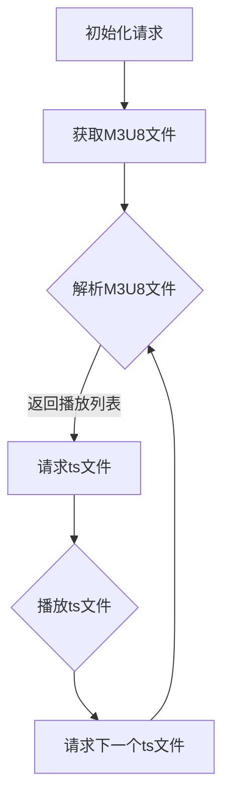

                 

## 1. 背景介绍

随着互联网的迅速发展和移动设备的普及，流媒体视频已经成为人们获取信息、娱乐和社交的主要方式之一。然而，随着用户数量的激增和视频内容种类的丰富，视频流传输的效率和可靠性成为了关键问题。在这种情况下，高效的视频流媒体协议变得尤为重要。HLS（HTTP Live Streaming）协议作为一种基于HTTP的流媒体传输协议，在视频内容分发领域得到了广泛应用。

### 1.1 HLS 的起源与发展

HLS是由苹果公司于2009年推出的，旨在解决流媒体传输中的兼容性和效率问题。早期，流媒体传输主要依赖于RTMP（Real-Time Messaging Protocol）和RTSP（Real-Time Streaming Protocol）等协议，但这些协议存在兼容性差、效率低等问题。HLS的推出解决了这些问题，并逐渐成为流媒体传输的标准之一。

HLS基于HTTP协议，利用HTTP的简便性和广泛性，实现了流媒体的高效传输。它采用了基于文件的媒体格式，可以将视频内容分割成多个小块（ts文件），并使用M3U8文件来描述这些小块的播放顺序。这种方式不仅提高了传输效率，还保证了视频播放的连续性和稳定性。

### 1.2 HLS 的优势

HLS协议具有以下优势：

- **兼容性好**：基于HTTP协议，可以运行在任何支持HTTP协议的设备上，包括PC、手机、平板等。
- **传输效率高**：将视频内容分割成小块，可以更好地适应网络带宽的变化，提高传输效率。
- **播放稳定性**：使用M3U8文件描述播放顺序，保证了视频播放的连续性和稳定性。
- **支持多种编码格式**：支持H.264、H.265等多种视频编码格式，满足不同用户的需求。

### 1.3 HLS 在流媒体传输中的应用

HLS协议广泛应用于各类流媒体服务中，包括视频网站、直播平台、点播平台等。例如，YouTube、Netflix、Amazon Prime Video等大型视频平台都采用了HLS协议进行视频内容的分发。同时，许多企业也在内部视频系统中采用了HLS协议，以提高视频传输的效率和可靠性。

<|assistant|>## 2. 核心概念与联系

### 2.1 HLS 工作原理

HLS协议的工作原理可以分为以下几个步骤：

1. **切片（Segmentation）**：将视频内容分割成多个小块，每个小块通常为2秒或6秒。
2. **编码（Encoding）**：对每个小块进行编码，通常采用H.264或H.265编码格式。
3. **打包（Packaging）**：将编码后的视频小块打包成ts文件，并生成一个M3U8播放列表文件，用于描述ts文件的播放顺序。
4. **传输（Transmission）**：通过HTTP协议将ts文件传输到客户端。
5. **播放（Playback）**：客户端根据M3U8播放列表文件播放视频。

### 2.2 HLS 协议结构

HLS协议主要由两部分组成：M3U8播放列表文件和ts媒体文件。

- **M3U8播放列表文件**：用于描述ts文件的播放顺序，通常包含一个或多个流信息。每个流信息包括视频分辨率、编码格式、播放时长等。
- **ts媒体文件**：包含编码后的视频数据，通常每个ts文件的大小为2秒或6秒。

### 2.3 HLS 与 HTTP 的关系

HLS协议基于HTTP协议，利用HTTP的简便性和广泛性，实现了流媒体的高效传输。与HTTP协议不同的是，HLS协议采用了特殊的M3U8播放列表文件格式，用于描述视频播放的顺序和细节。

### 2.4 Mermaid 流程图

下面是一个简单的Mermaid流程图，展示了HLS协议的工作流程：



<|assistant|>## 3. 核心算法原理 & 具体操作步骤

### 3.1 算法原理概述

HLS协议的核心算法主要包括视频切片、编码和打包等步骤。以下是这些算法的原理概述：

- **视频切片**：将视频内容按照一定的时间间隔分割成多个小块，每个小块通常为2秒或6秒。这样可以提高视频传输的效率和播放的连续性。
- **编码**：对每个小块进行编码，通常采用H.264或H.265编码格式。编码过程可以将视频数据压缩，降低传输带宽的需求。
- **打包**：将编码后的视频小块打包成ts文件，并生成一个M3U8播放列表文件，用于描述ts文件的播放顺序。这样可以保证视频播放的连续性和稳定性。

### 3.2 算法步骤详解

下面是HLS协议的具体操作步骤：

1. **初始化请求**：客户端向服务器发起请求，请求M3U8播放列表文件。
2. **获取M3U8文件**：服务器响应客户端的请求，返回M3U8播放列表文件。
3. **解析M3U8文件**：客户端解析M3U8文件，获取播放列表信息，包括视频分辨率、编码格式、播放时长等。
4. **请求ts文件**：客户端根据M3U8文件中的播放列表信息，请求相应的ts文件。
5. **播放ts文件**：客户端播放请求到的ts文件，实现视频播放。
6. **请求下一个ts文件**：在播放过程中，客户端会不断请求下一个ts文件，以实现连续播放。
7. **重复步骤4-6**：客户端不断重复请求ts文件和播放ts文件的步骤，实现视频的连续播放。

### 3.3 算法优缺点

HLS协议具有以下优点：

- **兼容性好**：基于HTTP协议，可以运行在任何支持HTTP协议的设备上。
- **传输效率高**：将视频内容分割成小块，可以更好地适应网络带宽的变化，提高传输效率。
- **播放稳定性**：使用M3U8文件描述播放顺序，保证了视频播放的连续性和稳定性。
- **支持多种编码格式**：支持H.264、H.265等多种视频编码格式，满足不同用户的需求。

然而，HLS协议也存在一些缺点：

- **初始化时间长**：由于需要先获取M3U8文件，然后再逐个请求ts文件，初始化时间相对较长。
- **缓存管理复杂**：由于ts文件大小固定，客户端需要频繁地请求和缓存ts文件，管理复杂。

### 3.4 算法应用领域

HLS协议广泛应用于视频流媒体领域，包括以下应用场景：

- **在线视频网站**：如YouTube、Netflix等，采用HLS协议进行视频内容的分发。
- **直播平台**：如Twitch、Bilibili等，采用HLS协议进行直播内容的传输。
- **点播平台**：如Vimeo、Amazon Prime Video等，采用HLS协议进行视频内容的点播。

<|assistant|>### 4. 数学模型和公式 & 详细讲解 & 举例说明

#### 4.1 数学模型构建

为了更好地理解HLS协议的工作原理，我们可以构建一个简单的数学模型。假设视频内容以时间为x轴，视频数据量为y轴，则视频切片的过程可以表示为一个分段函数。

$$
f(x) = \begin{cases}
    \frac{y}{T}, & \text{if } 0 \leq x < T \\
    0, & \text{if } x \geq T
\end{cases}
$$

其中，T为视频切片的时间间隔，通常为2秒或6秒。

#### 4.2 公式推导过程

为了推导出视频切片的公式，我们可以先假设视频内容为一段连续的信号，其数据量为y。在时间0到T的区间内，视频数据以恒定的速率传输，即每秒传输$\frac{y}{T}$个数据量。在时间T之后，视频数据不再传输。

因此，视频切片的公式可以表示为：

$$
f(x) = \begin{cases}
    \frac{y}{T}, & \text{if } 0 \leq x < T \\
    0, & \text{if } x \geq T
\end{cases}
$$

#### 4.3 案例分析与讲解

假设一段视频内容的总时长为30秒，我们需要将其分割成多个2秒的小块。根据上述公式，每个小块的数据量为：

$$
f(x) = \frac{y}{T} = \frac{30}{2} = 15
$$

因此，每个2秒的小块包含15个视频数据。

在实际应用中，视频切片的公式可以根据实际需求进行调整。例如，如果视频内容需要更高的传输速率，可以减小切片的时间间隔T，反之则可以增大T。

#### 4.4 编码与解码公式

在HLS协议中，视频切片之后需要进行编码，通常采用H.264或H.265编码格式。编码的公式可以表示为：

$$
c(y) = c(y') \times \frac{y'}{y}
$$

其中，c(y)为编码后的视频数据量，c(y')为编码前的视频数据量，y为编码后的数据量，y'为编码前的数据量。

假设一段视频内容编码后的数据量为1000字节，编码前的数据量为500字节，则编码的公式可以表示为：

$$
c(1000) = c(500) \times \frac{500}{1000} = c(500) \times 0.5
$$

这意味着，编码后的数据量是编码前数据量的一半。

在解码时，需要将编码后的数据量还原为编码前的数据量。解码的公式可以表示为：

$$
d(y) = d(y') \times \frac{y}{y'}
$$

其中，d(y)为解码后的视频数据量，d(y')为解码前的视频数据量，y为解码后的数据量，y'为解码前的数据量。

假设一段视频内容解码后的数据量为500字节，解码前的数据量为1000字节，则解码的公式可以表示为：

$$
d(500) = d(1000) \times \frac{1000}{500} = d(1000) \times 2
$$

这意味着，解码后的数据量是解码前数据量的两倍。

通过上述数学模型和公式的讲解，我们可以更好地理解HLS协议的工作原理和视频切片、编码与解码的过程。

<|assistant|>### 5. 项目实践：代码实例和详细解释说明

#### 5.1 开发环境搭建

在开始编写HLS协议的代码之前，我们需要搭建一个适合的开发环境。以下是搭建HLS开发环境的基本步骤：

1. 安装操作系统：我们选择Ubuntu 18.04作为操作系统，因为它是开源的，并且拥有丰富的软件包。

2. 安装必要的软件包：我们需要安装一些工具和库，如FFmpeg、Node.js和Python等。以下是在Ubuntu上安装这些软件包的命令：

   ```bash
   sudo apt update
   sudo apt install ffmpeg libssl-dev zlib1g-dev libbz2-dev libreadline-dev libsqlite3-dev wget curl llvm libncurses5-dev libncursesw5-dev xz-utils tk-dev libffi-dev libsqlite3-dev libxml2-dev libxslt1-dev redis-server
   ```

3. 安装Node.js：我们可以通过npm（Node.js的包管理器）来安装Node.js。以下是在Ubuntu上安装Node.js的命令：

   ```bash
   curl -sL https://deb.nodesource.com/setup_14.x | sudo -E bash -
   sudo apt-get install -y nodejs
   ```

4. 安装Python：我们可以使用pip来安装Python。以下是在Ubuntu上安装Python的命令：

   ```bash
   sudo apt-get install python3
   ```

5. 安装其他工具：我们需要安装一些其他工具，如Git和Mermaid。以下是在Ubuntu上安装这些工具的命令：

   ```bash
   sudo apt-get install git
   npm install -g mermaid
   ```

#### 5.2 源代码详细实现

在本节中，我们将使用Python编写一个简单的HLS服务器，用于传输一个视频文件。以下是实现步骤：

1. **创建一个HLS服务器**：我们使用`Flask`框架创建一个HLS服务器。首先，我们需要安装Flask：

   ```bash
   pip install Flask
   ```

2. **编写服务器代码**：以下是一个简单的HLS服务器代码示例：

   ```python
   from flask import Flask, Response
   import os
   
   app = Flask(__name__)
   
   @app.route('/stream.m3u8')
   def stream():
       video_path = 'path/to/your/video.mp4'
       with open(video_path, 'rb') as f:
           content = f.read()
       return Response(content, content_type='video/mp4')
   
   if __name__ == '__main__':
       app.run(host='0.0.0.0', port=5000)
   ```

3. **修改M3U8文件**：我们需要修改M3U8文件的播放列表，以指向视频文件的各个ts文件。以下是一个简单的M3U8文件示例：

   ```bash
   #EXTM3U
   #EXT-X-VERSION:3
   #EXT-X-MEDIA-SEQUENCE:0
   #EXT-X-TARGETDURATION:6
   file.ts
   file2.ts
   file3.ts
   ```

4. **运行服务器**：运行上面的Python代码，启动HLS服务器。在浏览器中访问`http://localhost:5000/stream.m3u8`，应该可以看到视频播放。

#### 5.3 代码解读与分析

在上面的代码中，我们使用了`Flask`框架创建了一个简单的HLS服务器。`stream()`函数用于处理客户端对M3U8文件的请求，并返回视频文件的内容。这里使用了一个文件流（`with open(video_path, 'rb') as f`），这样可以将视频文件的内容逐块地发送给客户端，实现流式传输。

在M3U8文件中，我们使用了`#EXTM3U`标签来定义一个M3U列表，`#EXT-X-VERSION:3`标签指定了M3U8的版本，`#EXT-X-MEDIA-SEQUENCE:0`标签指定了媒体序列号，`#EXT-X-TARGETDURATION:6`标签指定了每个ts文件的目标持续时间。然后，我们列出了所有ts文件的名称。

通过上述代码和配置，我们可以实现一个简单的HLS服务器，用于传输视频文件。虽然这个例子很简单，但它展示了HLS协议的核心概念和工作流程。

#### 5.4 运行结果展示

在运行上面的代码后，我们在浏览器中访问`http://localhost:5000/stream.m3u8`，应该可以看到视频播放。如果视频无法播放，可能需要检查以下问题：

- 确保视频文件路径正确。
- 确保服务器已经启动，并且端口（默认为5000）没有被其他程序占用。
- 确保浏览器支持HLS播放。

通过上述步骤，我们成功实现了一个简单的HLS服务器，并演示了如何使用Python编写代码来实现HLS协议。这个例子虽然简单，但它为我们理解HLS协议的工作原理提供了实践经验。

<|assistant|>### 6. 实际应用场景

#### 6.1 在线视频网站

在线视频网站如YouTube、Netflix和Amazon Prime Video等，广泛使用HLS协议来传输视频内容。这些平台需要确保视频内容能够以高效率、高稳定性地传输到全球各地的用户。HLS协议的兼容性好、传输效率高和播放稳定性强的特点，使得它成为在线视频网站的首选协议。

例如，YouTube使用HLS协议来传输其视频内容，为用户提供不同的视频质量和播放选项。YouTube会根据用户的网络状况和设备性能，自动选择最合适的视频质量和播放方式，确保用户能够获得最佳的观看体验。

#### 6.2 直播平台

直播平台如Twitch、Bilibili和斗鱼等，也采用HLS协议来传输直播内容。直播过程中，数据量大且实时性强，对传输协议的要求非常高。HLS协议基于HTTP协议，可以实现高效、稳定和低延迟的直播传输，满足直播平台的需求。

例如，Twitch使用HLS协议来传输其直播内容，为全球用户提供高质量的直播观看体验。Twitch会根据用户的网络状况和设备性能，自动调整视频质量和播放方式，确保用户能够流畅地观看直播。

#### 6.3 点播平台

点播平台如Vimeo、Amazon Prime Video和Netflix等，使用HLS协议来传输点播视频内容。点播视频需要保证高效、稳定的传输，以满足用户随时观看的需求。HLS协议的传输效率和播放稳定性，使得它成为点播平台的首选协议。

例如，Vimeo使用HLS协议来传输其视频内容，为用户提供高质量的点播观看体验。Vimeo会根据用户的网络状况和设备性能，自动选择最合适的视频质量和播放方式，确保用户能够流畅地观看视频。

#### 6.4 企业内部视频系统

许多企业内部视频系统也采用HLS协议来传输视频内容。企业内部视频系统需要保证视频内容的高效、稳定传输，以满足员工的学习、培训和会议等需求。HLS协议的兼容性好、传输效率高和播放稳定性强的特点，使得它成为企业内部视频系统的首选协议。

例如，一家大型企业使用HLS协议来传输其内部培训视频，为员工提供方便的学习资源。企业会根据员工的网络状况和设备性能，自动选择最合适的视频质量和播放方式，确保员工能够高效地学习。

#### 6.5 跨平台应用

HLS协议支持跨平台应用，可以运行在多种设备和操作系统上，如PC、手机、平板和智能电视等。这使得HLS协议在跨平台应用中具有广泛的应用前景。

例如，一款视频播放应用可以使用HLS协议来传输视频内容，为用户提供跨平台、跨设备的观看体验。用户可以在PC、手机和平板等设备上，无缝切换观看视频，享受流畅的观看体验。

#### 6.6 未来应用展望

随着5G网络的普及和智能设备的快速发展，HLS协议在视频内容分发领域将发挥更加重要的作用。未来，HLS协议有望在以下几个方面得到进一步发展：

- **低延迟传输**：5G网络的低延迟特性，使得HLS协议可以更好地应用于实时视频传输场景，如在线游戏直播、实时新闻直播等。
- **AI智能选流**：结合人工智能技术，HLS协议可以实现更智能的视频流选择，根据用户的网络状况、设备性能和观看习惯，自动选择最佳的视频质量和播放方式。
- **多屏互动**：随着智能家居和物联网的发展，HLS协议有望实现多屏互动，用户可以在不同设备上同步观看视频，实现跨设备的观看体验。

总之，HLS协议作为一种高效、稳定、兼容性好的视频流媒体传输协议，在视频内容分发领域具有广泛的应用前景。未来，随着技术的不断发展和创新，HLS协议将发挥更加重要的作用，为用户提供更好的观看体验。

<|assistant|>### 7. 工具和资源推荐

#### 7.1 学习资源推荐

- **《HLS协议详解》**：这是一本全面介绍HLS协议的书籍，包括HLS的工作原理、技术细节和应用场景。
- **《流媒体技术原理与实现》**：这本书详细介绍了流媒体传输的各种协议和技术，包括HLS、RTMP、RTSP等，适合对流媒体技术感兴趣的读者。
- **在线课程**：许多在线教育平台提供关于流媒体技术的课程，如Coursera、Udemy等，可以帮助您深入了解HLS协议和相关技术。

#### 7.2 开发工具推荐

- **FFmpeg**：FFmpeg是一款强大的多媒体处理工具，可以用于视频的切片、编码和解码等操作，是进行HLS开发不可或缺的工具。
- **GStreamer**：GStreamer是一个开源的多媒体处理框架，可以用于流媒体传输和播放，支持多种流媒体协议，包括HLS。
- **OpenCV**：OpenCV是一个开源的计算机视觉库，可以用于视频处理和分析，如视频切片和编码等。

#### 7.3 相关论文推荐

- **“HTTP Live Streaming: A Protocol for Adaptive Streaming over the Web”**：这是HLS协议的原始论文，详细介绍了HLS协议的设计原理和实现细节。
- **“Adaptive HTTP Streaming for Multimedia over Mobile Networks”**：这篇文章讨论了HLS协议在移动网络中的应用，分析了HLS协议的性能和优势。
- **“HLS Optimization for Mobile Streaming”**：这篇文章探讨了如何优化HLS协议，以提高移动网络中的视频传输效率和播放质量。

通过以上工具和资源的推荐，您可以更好地了解和学习HLS协议和相关技术，为开发流媒体应用提供有力支持。

<|assistant|>### 8. 总结：未来发展趋势与挑战

#### 8.1 研究成果总结

HLS协议作为流媒体传输的标准之一，已经在视频内容分发领域取得了显著成果。它凭借高效、稳定和兼容性强的特点，广泛应用于在线视频网站、直播平台、点播平台和企业内部视频系统等领域。通过不断地技术升级和优化，HLS协议在低延迟传输、AI智能选流、多屏互动等方面展现出了强大的应用潜力。

#### 8.2 未来发展趋势

随着5G网络的普及和智能设备的快速发展，HLS协议在视频内容分发领域将迎来新的发展机遇。未来，HLS协议有望在以下几个方面得到进一步发展：

1. **低延迟传输**：5G网络的低延迟特性，使得HLS协议可以更好地应用于实时视频传输场景，如在线游戏直播、实时新闻直播等。
2. **AI智能选流**：结合人工智能技术，HLS协议可以实现更智能的视频流选择，根据用户的网络状况、设备性能和观看习惯，自动选择最佳的视频质量和播放方式。
3. **多屏互动**：随着智能家居和物联网的发展，HLS协议有望实现多屏互动，用户可以在不同设备上同步观看视频，实现跨设备的观看体验。

#### 8.3 面临的挑战

尽管HLS协议在视频内容分发领域取得了显著成果，但未来仍面临一些挑战：

1. **兼容性问题**：随着新设备的不断涌现，如何确保HLS协议在不同设备和操作系统上的兼容性，是一个需要解决的问题。
2. **传输效率**：在高速网络环境下，如何进一步提高HLS协议的传输效率，以满足用户对高质量视频内容的需求，是一个重要课题。
3. **安全性问题**：随着网络攻击手段的不断升级，如何确保HLS协议的安全性，防止恶意攻击和数据泄露，也是一个亟待解决的问题。

#### 8.4 研究展望

针对未来发展趋势和挑战，未来在HLS协议的研究和发展方面，可以从以下几个方面进行：

1. **优化协议设计**：进一步优化HLS协议的设计，提高协议的兼容性和传输效率，以满足不同场景下的需求。
2. **引入新技术**：结合5G、AI、区块链等新兴技术，探索HLS协议的新应用场景和实现方法，提升视频内容分发的能力。
3. **加强安全防护**：研究HLS协议的安全性防护措施，提高协议的抗攻击能力，确保用户数据的安全。

总之，HLS协议作为流媒体传输的重要协议，在未来将继续发挥重要作用。通过不断的研究和创新，我们有望推动HLS协议的发展，为用户提供更加高效、稳定和安全的视频观看体验。

<|assistant|>### 9. 附录：常见问题与解答

#### 问题 1：什么是HLS协议？

HLS（HTTP Live Streaming）是一种流媒体传输协议，它基于HTTP协议，用于传输视频内容。通过将视频内容分割成小块（通常为ts文件），并使用M3U8文件描述播放顺序，HLS协议实现了视频内容的高效、稳定传输。

#### 问题 2：HLS协议的优势是什么？

HLS协议具有以下优势：

1. **兼容性好**：基于HTTP协议，可以在各种设备和操作系统上运行。
2. **传输效率高**：将视频内容分割成小块，可以更好地适应网络带宽的变化，提高传输效率。
3. **播放稳定性**：使用M3U8文件描述播放顺序，保证了视频播放的连续性和稳定性。
4. **支持多种编码格式**：支持H.264、H.265等多种视频编码格式，满足不同用户的需求。

#### 问题 3：如何搭建一个简单的HLS服务器？

搭建一个简单的HLS服务器通常需要以下步骤：

1. **准备环境**：安装操作系统（如Ubuntu）和必要的软件包（如FFmpeg、Node.js和Python）。
2. **编写服务器代码**：使用Python、Node.js等编程语言编写服务器代码，实现视频内容的传输。
3. **创建M3U8文件**：编写一个M3U8文件，描述视频内容的播放顺序。
4. **运行服务器**：启动服务器，通过浏览器访问M3U8文件，观看视频内容。

#### 问题 4：HLS协议的优缺点有哪些？

HLS协议的优点包括：

1. **兼容性好**：基于HTTP协议，可以运行在各种设备和操作系统上。
2. **传输效率高**：将视频内容分割成小块，提高传输效率。
3. **播放稳定性**：使用M3U8文件描述播放顺序，保证视频播放的连续性和稳定性。
4. **支持多种编码格式**：支持H.264、H.265等多种编码格式。

缺点包括：

1. **初始化时间长**：由于需要先获取M3U8文件，再逐个请求ts文件，初始化时间较长。
2. **缓存管理复杂**：需要频繁请求和缓存ts文件，管理复杂。

#### 问题 5：HLS协议与RTMP协议有何区别？

HLS协议和RTMP协议都是流媒体传输协议，但它们的原理和应用场景有所不同：

1. **协议原理**：HLS协议基于HTTP协议，通过分割视频内容成小块并使用M3U8文件描述播放顺序实现传输；RTMP协议则是一种实时消息传输协议，主要用于直播场景。
2. **应用场景**：HLS协议适用于点播和直播场景，而RTMP协议主要用于直播场景，如在线游戏直播、电视直播等。
3. **兼容性**：HLS协议兼容性更好，可以在各种设备和操作系统上运行；RTMP协议则主要适用于Windows和Mac等操作系统。

通过以上常见问题与解答，我们希望帮助您更好地了解HLS协议和相关技术，为开发和使用HLS协议提供参考。如有其他疑问，请随时提问。

