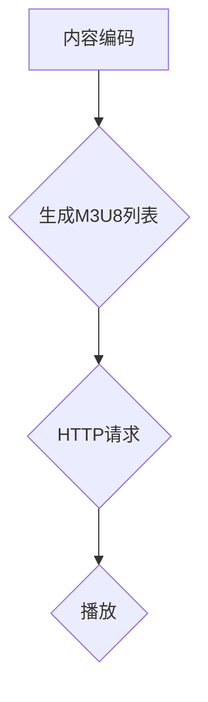

                 

关键词：HLS，流媒体协议，HTTP，视频内容分发，多媒体传输，网络优化，实时流媒体，碎片化内容，缓存机制，播放器兼容性。

## 摘要

本文深入探讨HLS（HTTP Live Streaming）流媒体协议的工作原理、优势、应用场景以及未来发展趋势。HLS作为一种基于HTTP协议的流媒体传输技术，能够有效地在网络上分发高质量的视频内容。文章首先介绍了HLS协议的背景和发展历程，接着详细讲解了HLS的核心概念和技术架构。随后，文章分析了HLS的核心算法原理，并举例说明了数学模型和公式。在项目实践部分，文章提供了一个代码实例，展示了如何实现HLS流媒体服务器和播放器。最后，文章探讨了HLS在实际应用中的具体场景，以及对其未来应用的展望。

## 1. 背景介绍

随着互联网技术的飞速发展，视频内容在互联网上的传播变得日益普及。视频流媒体技术的出现，使得用户能够随时随地在线观看视频内容，从而改变了人们获取信息的传统方式。流媒体技术的基本目标是实现实时、连续的视频播放，同时保证传输的稳定性和高效性。

### 流媒体技术的演变

流媒体技术的发展经历了几个关键阶段：

- **早期流媒体技术**：基于RTSP（Real Time Streaming Protocol）和RTP（Real-time Transport Protocol）的流媒体技术，这些协议需要专用的流媒体服务器和客户端，对网络带宽要求较高。
- **第二代流媒体技术**：基于HTTP协议的流媒体技术，如HLS和DASH（Dynamic Adaptive Streaming over HTTP），能够更好地适应不同网络环境和设备。
- **第三代流媒体技术**：利用人工智能和大数据分析，实现个性化的视频推荐和自适应流媒体传输。

### HLS协议的产生

HLS协议由Apple公司于2009年推出，旨在解决在iOS设备和Apple TV等设备上流媒体播放的问题。与传统流媒体协议不同，HLS采用基于HTTP的传输方式，这使得它能够更好地适应各种网络环境和设备。HLS的工作原理是将视频内容分割成多个小片段（通常为几秒钟），并通过HTTP请求进行传输。这种碎片化的内容传输方式，使得HLS具备以下优点：

- **兼容性好**：HLS协议不需要特定的播放器支持，只需要一个支持HTTP请求的浏览器或播放器即可播放。
- **传输效率高**：通过动态调整传输速率和内容片段大小，HLS能够更好地适应不同的网络带宽条件。
- **内容缓存**：由于采用HTTP请求，用户可以在本地缓存视频内容，从而提高播放效率。

## 2. 核心概念与联系

### HLS协议的工作原理

HLS协议的工作流程主要包括以下几个步骤：

1. **内容编码**：视频内容首先被编码为多个小的媒体文件（通常是.ts格式），每个文件对应一段视频内容。
2. **生成M3U8播放列表**：这些媒体文件被组织成M3U8播放列表，该列表包含了所有媒体文件的URL和播放顺序。
3. **HTTP请求**：播放器通过HTTP请求，从服务器获取M3U8播放列表和对应的媒体文件。
4. **播放**：播放器根据M3U8播放列表，逐个加载和播放媒体文件。

### Mermaid 流程图



### 核心概念

- **M3U8播放列表**：M3U8文件是一个文本文件，其中包含了视频内容的所有媒体文件的URL和播放顺序。播放器通过解析M3U8文件，获取视频片段的URL，并按照指定顺序进行播放。
- **切片文件**：每个视频片段被编码为.ts文件，这些文件是HLS流媒体的核心内容。
- **寻道请求**：播放器在播放过程中，会根据需要从服务器获取不同的视频片段。这个过程被称为寻道请求。

## 3. 核心算法原理 & 具体操作步骤

### 3.1 算法原理概述

HLS协议的核心算法是基于HTTP的动态自适应流媒体传输。其主要原理如下：

- **内容分割**：将原始视频内容分割成多个小的视频片段，每个片段通常持续几秒。
- **编码调整**：根据网络带宽和设备性能，对每个视频片段进行不同的编码，生成多个不同的质量版本。
- **自适应传输**：播放器根据网络带宽和设备性能，选择合适的质量版本进行播放。

### 3.2 算法步骤详解

1. **内容分割**：原始视频内容被分割成多个小的视频片段，每个片段通常持续几秒。
2. **编码调整**：对每个视频片段进行不同的编码，生成多个不同的质量版本。常见的编码格式包括H.264、H.265等。
3. **生成M3U8列表**：这些视频片段被组织成M3U8播放列表，该列表包含了所有视频片段的URL和播放顺序。
4. **HTTP请求**：播放器通过HTTP请求，从服务器获取M3U8播放列表和对应的视频片段。
5. **播放**：播放器根据M3U8播放列表，逐个加载和播放视频片段。

### 3.3 算法优缺点

- **优点**：
  - **兼容性好**：无需特定的播放器支持，只需支持HTTP请求的浏览器或播放器。
  - **传输效率高**：通过动态调整传输速率和内容片段大小，能够更好地适应不同的网络带宽条件。
  - **内容缓存**：用户可以在本地缓存视频内容，从而提高播放效率。

- **缺点**：
  - **延迟较高**：由于需要多次HTTP请求，播放延迟相对较高。
  - **带宽消耗较大**：对于大型视频内容，需要更多的带宽进行传输。

### 3.4 算法应用领域

HLS协议广泛应用于在线视频流媒体服务，如YouTube、Netflix等。此外，HLS也被广泛应用于物联网设备和智能家居领域，为用户提供高质量的实时视频内容。

## 4. 数学模型和公式 & 详细讲解 & 举例说明

### 4.1 数学模型构建

在HLS协议中，主要涉及以下数学模型：

- **比特率（Bitrate）**：视频内容的传输速率，通常以比特每秒（bps）为单位。
- **帧率（Frame Rate）**：视频播放的帧数每秒，通常以帧每秒（fps）为单位。
- **缓冲区大小（Buffer Size）**：播放器用于缓存视频内容的缓冲区大小，通常以秒为单位。

### 4.2 公式推导过程

假设视频内容的总时长为\( T \)秒，帧率为\( F \)fps，比特率为\( B \)bps，缓冲区大小为\( S \)秒。

1. **视频文件大小**：视频文件的大小可以通过以下公式计算：

\[ 
\text{File Size} = \frac{T \times F \times B}{8} 
\]

其中，8表示单位转换系数，即将比特率转换为字节率。

2. **缓冲区需求**：为了保证播放的连续性，缓冲区大小至少需要包含一段视频内容的时间长度：

\[ 
S \geq \frac{T}{F} 
\]

3. **带宽需求**：在播放视频内容时，需要考虑带宽的需求。带宽需求可以通过以下公式计算：

\[ 
\text{Bandwidth} = \frac{T \times F \times B}{8 \times 60} 
\]

其中，60表示将秒转换为分钟。

### 4.3 案例分析与讲解

假设我们有一个视频内容，总时长为10分钟，帧率为30fps，比特率为1Mbps。我们需要计算：

1. **视频文件大小**：

\[ 
\text{File Size} = \frac{10 \times 30 \times 1}{8} = 375 \text{MB} 
\]

2. **缓冲区需求**：

\[ 
S \geq \frac{10}{30} = 0.333 \text{秒} 
\]

因此，缓冲区至少需要0.333秒。

3. **带宽需求**：

\[ 
\text{Bandwidth} = \frac{10 \times 30 \times 1}{8 \times 60} = 0.625 \text{Mbps} 
\]

## 5. 项目实践：代码实例和详细解释说明

### 5.1 开发环境搭建

为了实现HLS流媒体传输，我们需要搭建一个HLS流媒体服务器。以下是搭建HLS流媒体服务器的基本步骤：

1. **安装FFmpeg**：FFmpeg是一款强大的多媒体处理工具，用于视频编码和流媒体传输。
2. **配置Nginx**：Nginx是一款高性能的Web服务器，用于提供HTTP服务。
3. **配置HLS**：在Nginx中配置HLS模块，使其支持HLS流媒体传输。

### 5.2 源代码详细实现

以下是使用FFmpeg实现HLS流媒体传输的基本命令：

```bash
# 编码视频内容为HLS流媒体
ffmpeg -i input.mp4 -stream_loop -1 -c:v libx264 -preset veryfast -c:a aac -f segment -segment_list playlist.m3u8 -segment_time 10 output.ts
```

这个命令将输入视频文件`input.mp4`编码为HLS流媒体，生成M3U8播放列表`playlist.m3u8`和一系列.ts文件`output.ts`。

### 5.3 代码解读与分析

以上FFmpeg命令的参数解析如下：

- `-i input.mp4`：指定输入视频文件。
- `-stream_loop -1`：无限循环播放视频流。
- `-c:v libx264`：使用H.264视频编码。
- `-preset veryfast`：使用非常快速的编码模式。
- `-c:a aac`：使用AAC音频编码。
- `-f segment`：将视频内容分割成片段。
- `-segment_list playlist.m3u8`：生成M3U8播放列表。
- `-segment_time 10`：每个视频片段持续10秒。

通过以上命令，我们可以将输入视频文件编码为HLS流媒体，并生成M3U8播放列表。接下来，我们需要配置Nginx服务器，使其能够提供HTTP服务，从而实现HLS流媒体传输。

### 5.4 运行结果展示

配置好Nginx服务器后，我们可以在浏览器中通过以下URL访问HLS流媒体：

```
http://your-server-ip/playlist.m3u8
```

在浏览器中，我们可以看到视频内容正在播放。通过调整网络带宽和设备性能，我们可以观察到HLS协议的动态自适应传输效果。

## 6. 实际应用场景

### 6.1 在线视频平台

HLS协议广泛应用于在线视频平台，如YouTube、Netflix等。这些平台通过HLS协议，能够为全球用户提供高质量的实时视频内容。HLS协议的动态自适应传输能力，使得用户能够在不同网络环境下，获得最佳的视频观看体验。

### 6.2 物联网设备

HLS协议也被广泛应用于物联网设备，如智能家居设备、智能穿戴设备等。这些设备通过HLS协议，能够实时传输视频内容，从而实现远程监控和控制。例如，智能门铃可以通过HLS协议，实时传输门口的监控视频，用户可以通过手机远程观看。

### 6.3 实时新闻直播

HLS协议在实时新闻直播中也发挥着重要作用。新闻机构可以通过HLS协议，实时传输新闻直播视频，用户可以在各种设备上观看。这种动态自适应传输方式，能够确保用户在不同网络环境下，获得最佳的视频观看体验。

## 7. 工具和资源推荐

### 7.1 学习资源推荐

- **官方文档**：HLS协议的官方文档是学习HLS的最佳资源。官方文档详细介绍了HLS协议的工作原理、使用方法和最佳实践。
- **技术博客**：许多技术博客和论坛提供了关于HLS协议的深入讲解和实际应用案例。通过阅读这些博客，可以更好地理解HLS协议。

### 7.2 开发工具推荐

- **FFmpeg**：FFmpeg是一款强大的多媒体处理工具，用于视频编码和流媒体传输。
- **Nginx**：Nginx是一款高性能的Web服务器，用于提供HTTP服务。
- **HLS Player**：各种HLS播放器，如IINA、VLC等，可用于测试和演示HLS流媒体。

### 7.3 相关论文推荐

- **《HLS：A Standard for Streaming Media on the Web》**：这篇论文详细介绍了HLS协议的背景、工作原理和应用场景。
- **《HTTP Live Streaming: A Comprehensive Overview and Performance Evaluation》**：这篇论文对HLS协议进行了全面的分析和性能评估。

## 8. 总结：未来发展趋势与挑战

### 8.1 研究成果总结

近年来，HLS协议在视频流媒体领域取得了显著成果。其动态自适应传输能力、兼容性和高效性，使得HLS成为全球各大视频平台的首选协议。同时，HLS协议在物联网设备和实时新闻直播等领域也得到了广泛应用。

### 8.2 未来发展趋势

随着5G网络的普及和人工智能技术的发展，HLS协议有望在未来实现以下发展趋势：

- **更低延迟**：通过优化传输协议和算法，实现更低延迟的视频播放。
- **更高清晰度**：支持更高清晰度的视频内容传输，满足用户对高质量视频的需求。
- **更多应用场景**：拓展HLS协议的应用场景，如虚拟现实、增强现实等。

### 8.3 面临的挑战

虽然HLS协议在视频流媒体领域取得了显著成果，但仍然面临以下挑战：

- **网络带宽消耗**：随着视频内容的增加，网络带宽消耗也将增大，对网络基础设施提出了更高要求。
- **设备兼容性**：不同设备和操作系统的兼容性，仍然是一个需要解决的问题。

### 8.4 研究展望

未来，HLS协议的研究方向包括：

- **优化传输算法**：通过改进传输算法，提高传输效率和降低延迟。
- **拓展应用场景**：探索HLS协议在更多应用领域的应用，如虚拟现实、增强现实等。

## 9. 附录：常见问题与解答

### Q：HLS协议与DASH协议有什么区别？

A：HLS协议和DASH协议都是基于HTTP的流媒体传输技术，但两者在传输策略和应用场景上有所不同。HLS协议更适用于实时流媒体传输，而DASH协议更适用于点播流媒体传输。HLS协议的优势在于兼容性好、传输效率高，而DASH协议的优势在于自适应性强、支持更广泛的视频格式。

### Q：如何确保HLS流媒体的播放质量？

A：确保HLS流媒体播放质量的关键在于以下几点：

- **网络带宽**：确保网络带宽足够，以支持高质量的视频传输。
- **编码优化**：对视频内容进行适当的编码优化，以减少带宽消耗。
- **缓冲策略**：合理设置缓冲区大小和缓冲策略，以避免播放中断。

### Q：如何实现HLS流媒体的多码率传输？

A：实现HLS流媒体的多码率传输，需要以下步骤：

- **视频内容分割**：将视频内容分割成多个小片段。
- **编码调整**：对每个视频片段进行不同的编码，生成多个不同的质量版本。
- **生成M3U8列表**：将不同的视频片段质量版本组织成M3U8播放列表。
- **HTTP请求**：播放器根据网络带宽和设备性能，选择合适的质量版本进行播放。

### Q：如何优化HLS流媒体的传输效率？

A：优化HLS流媒体的传输效率，可以从以下几个方面入手：

- **编码优化**：选择合适的编码格式和编码参数，以减少带宽消耗。
- **缓存策略**：合理设置缓存策略，提高播放效率。
- **负载均衡**：在服务器端实现负载均衡，以避免单点故障。

### Q：如何处理HLS流媒体播放过程中的错误？

A：在HLS流媒体播放过程中，可能会出现各种错误，如网络连接错误、视频播放错误等。以下是一些处理方法：

- **重试机制**：当出现网络连接错误时，播放器可以尝试重新连接。
- **错误提示**：在播放过程中，显示合适的错误提示，帮助用户解决问题。
- **日志记录**：记录播放过程中的错误日志，便于分析和定位问题。

# 作者署名

作者：禅与计算机程序设计艺术 / Zen and the Art of Computer Programming

