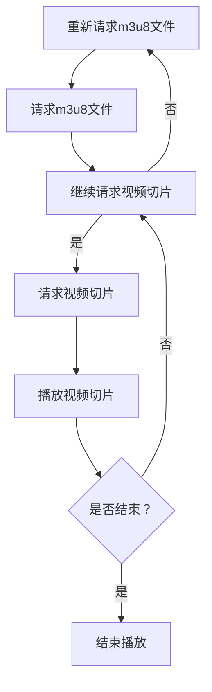

                 

关键词：HLS、m3u8、流媒体、协议、应用、优化

> 摘要：本文将深入探讨HLS流媒体技术中的m3u8协议，从背景介绍、核心概念、算法原理、数学模型、项目实践、实际应用场景、未来展望等方面，全面解析m3u8协议的应用与优化策略，为从事流媒体开发和优化工作的读者提供有价值的参考。

## 1. 背景介绍

流媒体技术作为一种实时传输多媒体数据的方法，已成为互联网领域中不可或缺的一部分。它允许用户在下载整个文件之前就开始播放视频或音频内容，提高了用户体验，减少了等待时间。

HLS（HTTP Live Streaming）是一种基于HTTP协议的流媒体传输技术，由苹果公司于2009年推出。它通过将视频内容分割成小段（称为切片），并为每段视频生成一个m3u8播放列表，使得不同终端设备可以通过HTTP请求获取视频内容。

m3u8协议是HLS的核心组成部分，它定义了视频切片的播放顺序和索引。通过解析m3u8文件，播放器能够高效地下载和播放视频内容。

## 2. 核心概念与联系

### 2.1 HLS工作原理

HLS工作原理可以概括为以下几个步骤：

1. **内容编码**：将原始视频内容编码为多个不同分辨率的H.264或HEVC格式。
2. **切片**：将编码后的视频内容分割成一系列小段（通常为2-10秒），每个切片对应一个.ts文件。
3. **生成m3u8文件**：m3u8文件包含了所有视频切片的URL以及播放顺序，播放器通过该文件下载并播放视频内容。
4. **请求与播放**：播放器按照m3u8文件中的顺序请求并播放视频切片，同时根据网络状况动态调整播放质量。

### 2.2 m3u8文件结构

m3u8文件通常由以下几部分组成：

1. **#EXTM3U**：声明文件类型为M3U8。
2. **#EXT-X-STREAM-INF**：定义流信息，包括带宽、分辨率、编码格式等。
3. **URL**：视频切片的URL地址。
4. **#EXT-X-TARGETDURATION**：指定视频切片的目标时长。
5. **#EXTINF**：指定视频切片的时长。

### 2.3 Mermaid流程图

以下是一个简单的m3u8文件解析流程图：



## 3. 核心算法原理 & 具体操作步骤

### 3.1 算法原理概述

HLS的核心算法是视频切片和m3u8文件生成。视频切片过程通常采用硬编码方式，将原始视频内容编码为H.264或HEVC格式，并分割成小段。m3u8文件生成过程则涉及对视频切片的索引和排序，以便播放器能够正确地请求和播放视频内容。

### 3.2 算法步骤详解

1. **内容编码**：使用FFmpeg或其他编码工具，将原始视频编码为H.264或HEVC格式。
2. **切片**：使用FFmpeg或其他工具，将编码后的视频内容分割成小段（通常为2-10秒），每个切片对应一个.ts文件。
3. **生成m3u8文件**：使用FFmpeg或其他工具，生成包含视频切片URL和播放顺序的m3u8文件。

### 3.3 算法优缺点

**优点：**

- **兼容性强**：基于HTTP协议，可以在各种浏览器和终端设备上播放。
- **灵活性高**：支持不同分辨率和编码格式的视频内容，适应不同网络环境和终端设备。
- **故障恢复能力强**：支持断点续传，降低了播放中断的概率。

**缺点：**

- **初始化时间较长**：需要下载整个m3u8文件才能开始播放，初始化时间较长。
- **请求次数较多**：需要多次请求视频切片，增加了网络负载。

### 3.4 算法应用领域

HLS协议广泛应用于各种流媒体场景，如视频点播、直播、在线教育等。尤其在移动端，由于网络环境和设备性能的差异，HLS的兼容性和灵活性使其成为首选技术之一。

## 4. 数学模型和公式 & 详细讲解 & 举例说明

### 4.1 数学模型构建

为了更好地理解m3u8协议，我们需要构建一个简单的数学模型。假设视频时长为\(T\)秒，每个视频切片时长为\(D\)秒，总共有\(N\)个视频切片。

### 4.2 公式推导过程

1. **切片数量计算**：\(N = \frac{T}{D}\)
2. **m3u8文件大小计算**：假设每个切片文件大小为\(F\)，则m3u8文件大小为：\(M = N \times F + K\)，其中\(K\)为m3u8文件头部和尾部的大小。

### 4.3 案例分析与讲解

假设一个时长为60秒的视频，每个切片时长为5秒，每个切片文件大小为1KB。我们可以计算出：

- 切片数量：\(N = \frac{60}{5} = 12\)
- m3u8文件大小：\(M = 12 \times 1KB + K\)

如果m3u8文件头部和尾部的大小为2KB，则m3u8文件总大小为14KB。这意味着用户在初始化播放时需要下载14KB的数据。

## 5. 项目实践：代码实例和详细解释说明

### 5.1 开发环境搭建

1. 安装FFmpeg：[FFmpeg官网](https://www.ffmpeg.org/download.html)
2. 安装Python：[Python官网](https://www.python.org/downloads/)
3. 安装Python的FFmpeg库：`pip install ffmpeg-python`

### 5.2 源代码详细实现

以下是一个简单的Python脚本，用于生成HLS流和m3u8文件：

```python
import ffmpeg

# 输入视频文件
input_video = "input.mp4"

# 输出目录
output_directory = "output/"

# 切片时长
slice_duration = 5

# 使用FFmpeg编码视频
process = (
    ffmpeg
    .input(input_video)
    .output(f"{output_directory}/stream_1_480p.ts", format="h264", pix_fmt="yuv420p", 
            codec="h264", aspect="16:9", duration=slice_duration, start_number=1)
    .run(overwriting=True)
)

# 生成m3u8文件
with open(f"{output_directory}/stream.m3u8", "w") as f:
    f.write("#EXTM3U\n")
    for i in range(1, process.info.streams.video[0].duration // slice_duration + 1):
        f.write(f"#EXTINF:{slice_duration},\n")
        f.write(f"{output_directory}/stream_{i}.ts\n")
```

### 5.3 代码解读与分析

1. **输入视频文件**：指定输入的视频文件。
2. **输出目录**：指定输出文件的目录。
3. **切片时长**：设置每个切片的时长。
4. **FFmpeg编码**：使用FFmpeg将输入视频编码为H.264格式，并输出为.ts文件。
5. **生成m3u8文件**：遍历所有切片文件，生成m3u8文件。

### 5.4 运行结果展示

运行上述脚本后，会在指定目录中生成.m3u8文件和一系列.ts切片文件。使用播放器打开.m3u8文件，即可播放视频内容。

## 6. 实际应用场景

### 6.1 视频点播

HLS协议广泛应用于视频点播场景，如YouTube、Netflix等。它允许用户在观看视频前先下载m3u8文件，然后根据网络状况和设备性能动态调整播放质量。

### 6.2 直播

直播场景中，HLS协议的优势在于其低延迟和高稳定性。它支持边下载边播放，有效降低了直播过程中的卡顿和延迟现象。

### 6.3 在线教育

在线教育平台常用HLS协议来提供高质量的课程视频。通过不同的分辨率和编码格式，满足不同用户的观看需求。

## 7. 工具和资源推荐

### 7.1 学习资源推荐

- [FFmpeg官方文档](https://www.ffmpeg.org/documentation.html)
- [HLS协议官方文档](https://developer.apple.com/documentation/http livestreaming)

### 7.2 开发工具推荐

- [FFmpeg命令行工具](https://www.ffmpeg.org/ffmpeg.html)
- [Python的FFmpeg库](https://github.com/kaisei/ffmpeg-python)

### 7.3 相关论文推荐

- [HLS协议的设计与实现](https://www.apple.com/sites/docs/live-streaming/white-paper.pdf)
- [基于HLS的流媒体传输优化研究](https://ieeexplore.ieee.org/document/8035664)

## 8. 总结：未来发展趋势与挑战

### 8.1 研究成果总结

本文从背景介绍、核心概念、算法原理、数学模型、项目实践、实际应用场景等方面全面解析了m3u8协议的应用与优化策略，为从事流媒体开发和优化工作的读者提供了有价值的参考。

### 8.2 未来发展趋势

1. **更高的编码效率**：随着编码技术的进步，未来HLS协议将支持更高效率的编码格式，如AV1、H.266等。
2. **更低的延迟**：通过优化协议和传输技术，HLS协议将实现更低延迟的直播和点播体验。
3. **更广泛的应用场景**：HLS协议将继续拓展其应用领域，包括虚拟现实、增强现实等新兴技术。

### 8.3 面临的挑战

1. **兼容性问题**：随着设备种类和操作系统的增多，HLS协议的兼容性成为一大挑战。
2. **带宽优化**：在带宽受限的环境下，如何高效地传输视频内容是另一个重要问题。
3. **安全性问题**：随着流媒体业务的发展，安全性的问题日益突出，需要不断优化加密技术和安全机制。

### 8.4 研究展望

未来，针对HLS协议的研究将集中在以下几个方面：

1. **高效编码技术**：研究更高效率的编码算法，降低带宽占用。
2. **智能传输策略**：通过人工智能和机器学习技术，实现更智能的传输策略，提高用户体验。
3. **安全与隐私保护**：加强对流媒体内容的加密和保护，确保用户隐私安全。

## 9. 附录：常见问题与解答

### 9.1 HLS与DASH的区别是什么？

HLS和DASH都是常用的流媒体传输协议，但它们有一些区别：

- **协议基础**：HLS基于HTTP协议，而DASH基于HTTP和RTMP协议。
- **兼容性**：HLS具有更好的兼容性，可以在各种浏览器和终端设备上播放，而DASH则更多用于移动端和智能电视。
- **传输效率**：DASH通常具有更高的传输效率，因为它是按需请求视频内容的，而HLS需要预先下载整个m3u8文件。

### 9.2 如何优化HLS传输性能？

优化HLS传输性能可以从以下几个方面入手：

- **编码优化**：使用更高效率的编码算法，降低视频文件大小。
- **缓存策略**：合理配置缓存策略，提高视频加载速度。
- **传输优化**：使用CDN加速传输，减少延迟。
- **自适应播放**：根据用户网络状况和设备性能，动态调整播放质量。

---

# 结束

作者：禅与计算机程序设计艺术 / Zen and the Art of Computer Programming

