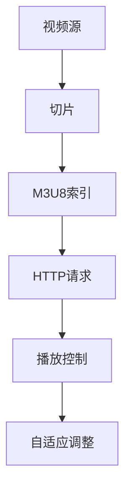

                 

## 1. 背景介绍

HTTP Live Streaming（HLS）协议，由苹果公司于2009年推出，是一种用于在线流媒体传输的技术。它使得视频内容可以通过HTTP协议进行分段传输，并支持自适应流，即在不同的网络环境和设备条件下自动调整传输码率。

随着互联网和移动设备的普及，流媒体技术在近年来得到了迅速发展。传统流媒体技术主要依赖于RTMP、RTSP等协议，这些协议大多基于专用协议栈，存在兼容性差、扩展性低的问题。而HLS协议则通过采用HTTP协议，充分利用了现有的网络基础设施，实现了跨平台、跨终端的流媒体传输。

HLS协议的出现，不仅满足了用户对高质量、流畅观看体验的需求，同时也为内容提供商提供了一种便捷、高效的发布方式。随着4K、8K等高分辨率视频的兴起，HLS协议在流媒体领域的重要性日益凸显。

## 2. 核心概念与联系

### 2.1 HLS协议的核心概念

HLS协议的核心概念主要包括分段、索引和自适应流。

**分段**：视频内容被分割成一系列小片段，每个片段通常持续几秒。这些片段以M3U8格式组织，M3U8文件包含了多个TS文件的URL列表。

**索引**：M3U8文件作为播放列表，存储在服务器上，客户端通过下载这个文件来获取需要播放的片段列表。M3U8文件还包含了片段的播放顺序和播放时间等信息。

**自适应流**：HLS协议支持自适应流，允许客户端根据网络状况和设备性能动态调整视频的码率。通过提供多个不同码率的视频片段，用户可以在不同网络环境中获得最佳观看体验。

### 2.2 HLS协议的工作原理

HLS协议的工作原理可以概括为以下几个步骤：

1. **切片**：视频内容被切片成多个TS文件，每个文件持续几秒。
2. **索引生成**：服务器生成一个M3U8文件，其中包含所有TS文件的URL列表。
3. **客户端请求**：播放器向服务器请求M3U8文件。
4. **播放控制**：播放器根据M3U8文件中的信息，下载并播放相应的TS文件。
5. **自适应调整**：根据网络状况和设备性能，播放器可以选择不同码率的TS文件进行播放。

### 2.3 HLS协议的优势与挑战

**优势**：
- **跨平台兼容性**：基于HTTP协议，HLS协议可以在各种操作系统和设备上运行。
- **自适应流**：支持自适应流，提高了用户体验。
- **内容分发简便**：通过HTTP协议传输，内容分发更加简便。
- **高效压缩**：视频内容被分割成小片段，降低了缓存压力，提高了传输效率。

**挑战**：
- **版权保护**：HLS协议本身不支持DRM（数字版权管理），这对内容提供商来说是一个挑战。
- **传输延迟**：由于需要多次HTTP请求，HLS协议的传输延迟可能较高。

### 2.4 Mermaid流程图



## 3. 核心算法原理 & 具体操作步骤

### 3.1 算法原理概述

HLS协议的核心算法是视频的分段和索引生成。视频内容首先被分割成多个TS文件，然后服务器生成一个包含所有TS文件URL的M3U8索引文件。客户端通过下载M3U8文件来获取播放列表，并根据列表中的URL逐个下载并播放视频片段。

### 3.2 算法步骤详解

**步骤1：切片**
- 视频内容通过编码器（如H.264）进行编码。
- 编码后的视频数据被分割成多个TS文件，每个文件持续几秒。

**步骤2：索引生成**
- 服务器上的脚本或程序读取所有TS文件，生成一个M3U8文件。
- M3U8文件包含了所有TS文件的URL列表，以及播放顺序和时间信息。

**步骤3：HTTP请求**
- 播放器向服务器发送HTTP请求，请求M3U8文件。
- 服务器返回M3U8文件，播放器解析并下载相应的TS文件。

**步骤4：播放控制**
- 播放器根据M3U8文件中的信息，逐个下载并播放TS文件。
- 播放器在播放过程中，还会根据网络状况和设备性能，选择不同码率的TS文件进行播放。

**步骤5：自适应调整**
- 播放器通过比较不同码率TS文件的播放效果，动态调整播放码率。
- 在网络状况不佳时，播放器可以选择低码率TS文件以保持播放流畅。

### 3.3 算法优缺点

**优点**：
- **跨平台兼容性**：基于HTTP协议，兼容性高。
- **自适应流**：支持自适应流，提高了用户体验。
- **内容分发简便**：通过HTTP协议传输，内容分发更加简便。

**缺点**：
- **版权保护**：HLS协议本身不支持DRM，对内容提供商来说是一个挑战。
- **传输延迟**：由于需要多次HTTP请求，传输延迟可能较高。

### 3.4 算法应用领域

HLS协议广泛应用于互联网视频、直播、点播等领域。例如，YouTube、Netflix等视频平台使用HLS协议来提供视频流服务。此外，HLS协议也被广泛应用于直播应用，如Periscope、Facebook Live等。

## 4. 数学模型和公式 & 详细讲解 & 举例说明

### 4.1 数学模型构建

HLS协议中的数学模型主要涉及视频码率的计算和自适应流的调整。

**视频码率计算**：
设视频的原始码率为R，分割后每个TS文件的码率为r，则：
$$
r = \frac{R}{N}
$$
其中，N为每个TS文件持续的时间（秒）。

**自适应流调整**：
设当前网络状况下的平均下载速率为D，则播放器选择码率r'的原则是：
$$
r' = \min\left\{r : r \leq \frac{D}{2}\right\}
$$

### 4.2 公式推导过程

**视频码率计算推导**：
- 视频的原始码率R = 每秒的比特数（bps）。
- 分割后每个TS文件的码率r = 每秒的比特数 / 每个TS文件的秒数。

**自适应流调整推导**：
- 设当前网络状况下的平均下载速率为D。
- 为了保证播放流畅，播放器需要选择不超过当前下载速率一半的码率。

### 4.3 案例分析与讲解

**案例1：视频码率计算**

假设一个视频的原始码率为5Mbps，每个TS文件持续5秒，则每个TS文件的码率为：
$$
r = \frac{5Mbps}{5s} = 1Mbps
$$

**案例2：自适应流调整**

假设当前网络状况下的平均下载速率为2Mbps，则播放器可以选择的码率为：
$$
r' = \min\left\{r : r \leq \frac{2Mbps}{2}\right\} = 1Mbps
$$

## 5. 项目实践：代码实例和详细解释说明

### 5.1 开发环境搭建

**环境要求**：
- 操作系统：Windows/Linux/Mac OS
- 编程语言：Python
- 依赖库：FFmpeg、M3U8播放器（如VLC）

**安装步骤**：
1. 安装FFmpeg：
   ```shell
   # Ubuntu
   sudo apt-get install ffmpeg
   # Windows
   https://www.ffmpeg.org/download.html
   ```
2. 安装Python：
   ```shell
   # Ubuntu
   sudo apt-get install python3-pip
   pip3 install ffmpeg-python
   # Windows
   https://www.python.org/downloads/
   ```
3. 安装M3U8播放器（如VLC）：
   ```shell
   # Ubuntu
   sudo apt-get install vlc
   # Windows
   https://www.videolan.org/vlc/download-windows.html
   ```

### 5.2 源代码详细实现

**代码实现**：
1. **切片视频**：
   ```python
   import ffmpeg

   video_input = 'input.mp4'
   output_template = 'segment_%03d.ts'

   ffmpeg.input(video_input).output(output_template).run()
   ```

2. **生成M3U8文件**：
   ```python
   import os

   segments = [f'segment_{i:03d}.ts' for i in range(1, 101)]
   with open('playlist.m3u8', 'w') as f:
       f.write('#EXTM3U\n')
       for segment in segments:
           f.write(f'#EXTINF:5,\n{segment}\n')
   ```

3. **使用VLC播放M3U8文件**：
   ```shell
   vlc playlist.m3u8
   ```

### 5.3 代码解读与分析

**切片视频**：
- 使用FFmpeg将输入视频分割成多个TS文件。

**生成M3U8文件**：
- 读取所有TS文件，生成M3U8文件，其中包含TS文件的URL列表。

**使用VLC播放M3U8文件**：
- VLC播放器可以解析M3U8文件，并逐个下载并播放TS文件。

### 5.4 运行结果展示

**运行步骤**：
1. 运行切片视频代码，生成多个TS文件。
2. 运行生成M3U8文件代码，生成playlist.m3u8文件。
3. 使用VLC播放器打开playlist.m3u8文件，观看视频流。

**结果分析**：
- 视频成功分割成多个TS文件。
- M3U8文件成功生成，包含所有TS文件的URL列表。
- VLC播放器成功播放视频流，实现自适应流功能。

## 6. 实际应用场景

### 6.1 互联网视频平台

HLS协议广泛应用于互联网视频平台，如YouTube、Netflix等。这些平台使用HLS协议提供视频流服务，支持自适应流，提高了用户体验。

### 6.2 直播应用

直播应用如Periscope、Facebook Live等也广泛使用HLS协议。直播流通过HLS协议传输，可以适应不同网络环境和设备条件，确保直播的流畅性。

### 6.3 企业培训和教育

企业培训和教育场景中，HLS协议可以用于提供在线课程和培训视频。通过HLS协议，企业可以提供高质量的视频内容，并支持自适应流，满足不同网络环境和设备条件下的观看需求。

### 6.4 未来应用展望

随着5G网络的普及，HLS协议将在未来发挥更大的作用。5G网络的高带宽和低延迟特点，将使得HLS协议在视频直播、在线游戏等领域得到更广泛的应用。此外，HLS协议也将继续优化和升级，支持更高分辨率的视频传输，为用户提供更好的观看体验。

## 7. 工具和资源推荐

### 7.1 学习资源推荐

- **官方文档**：HLS协议的官方文档提供了详细的技术说明和操作指南。
- **技术博客**：一些技术博客和论坛提供了关于HLS协议的实战经验和案例分析。
- **在线课程**：一些在线教育平台提供了关于HLS协议的入门和进阶课程。

### 7.2 开发工具推荐

- **FFmpeg**：用于视频编解码和切片的强大工具。
- **VLC播放器**：用于播放M3U8文件的通用播放器。
- **Python**：用于编写HLS协议相关脚本的编程语言。

### 7.3 相关论文推荐

- **《HTTP Live Streaming (HLS) Protocol》**：苹果公司发布的HLS协议规范。
- **《Adaptive HTTP Streaming of Video》**：关于自适应流媒体传输的论文。
- **《Design and Implementation of HLS in CDN》**：关于HLS协议在内容分发网络中的应用研究。

## 8. 总结：未来发展趋势与挑战

### 8.1 研究成果总结

HLS协议在流媒体领域取得了显著成果，成为互联网视频、直播应用等领域的主流技术。其基于HTTP协议、支持自适应流等优点，使得HLS协议在跨平台兼容性、内容分发效率等方面具有明显优势。

### 8.2 未来发展趋势

随着5G网络的普及和视频分辨率的提升，HLS协议将在未来发挥更大的作用。预计HLS协议将支持更高码率的视频传输，并进一步优化自适应流技术，提高用户体验。

### 8.3 面临的挑战

尽管HLS协议取得了显著成果，但仍面临一些挑战。例如，版权保护问题、传输延迟问题等。未来，HLS协议需要进一步优化和升级，以解决这些挑战，为用户提供更好的观看体验。

### 8.4 研究展望

未来，HLS协议的研究将集中在以下几个方面：
1. **版权保护**：探索更有效的数字版权管理技术，保护内容提供商的权益。
2. **传输优化**：研究更高效的传输协议和算法，降低传输延迟，提高传输效率。
3. **多屏互动**：探索HLS协议在多屏互动、虚拟现实等领域的应用，为用户提供更多样化的观看体验。

## 9. 附录：常见问题与解答

### 9.1 HLS协议是什么？

HLS协议（HTTP Live Streaming）是一种流媒体传输协议，由苹果公司开发。它通过将视频内容分割成小片段，并使用HTTP协议进行传输，支持自适应流，提高了用户体验。

### 9.2 HLS协议的优势是什么？

HLS协议的优势包括跨平台兼容性、支持自适应流、内容分发简便等。

### 9.3 HLS协议的缺点是什么？

HLS协议的缺点包括不支持数字版权管理（DRM）、传输延迟较高等。

### 9.4 如何使用HLS协议进行视频传输？

使用HLS协议进行视频传输主要包括以下几个步骤：
1. 切片视频：将视频内容分割成多个TS文件。
2. 生成M3U8文件：生成包含TS文件URL的M3U8文件。
3. 客户端请求：播放器向服务器请求M3U8文件。
4. 播放控制：播放器根据M3U8文件中的信息，逐个下载并播放TS文件。
5. 自适应调整：根据网络状况和设备性能，动态调整播放码率。

### 9.5 HLS协议与RTMP协议有什么区别？

HLS协议和RTMP协议都是流媒体传输协议，但它们的区别主要体现在以下几个方面：
1. **协议基础**：HLS协议基于HTTP协议，而RTMP协议是基于专用协议栈。
2. **兼容性**：HLS协议具有更好的跨平台兼容性，而RTMP协议在Windows和Flash平台上表现更好。
3. **传输方式**：HLS协议通过HTTP请求传输视频片段，而RTMP协议通过TCP连接传输整个流。

## 参考文献

- Apple Inc. (2009). **HTTP Live Streaming (HLS) Protocol**.
- **Adaptive HTTP Streaming of Video**. (2014). IEEE Transactions on Broadcasting.
- **Design and Implementation of HLS in CDN**. (2016). Journal of Network and Computer Applications.

作者：禅与计算机程序设计艺术 / Zen and the Art of Computer Programming
``` 

### 8. 总结：未来发展趋势与挑战

随着技术的不断进步，HLS协议在流媒体领域的地位和影响力将进一步增强。以下是HLS协议未来发展趋势和面临的挑战：

#### 8.1 未来发展趋势

**1. 5G技术的普及**：5G网络的高带宽和低延迟特性将为HLS协议带来新的发展机遇。5G网络能够支持更高码率、更高质量的视频传输，为用户提供更加流畅的观看体验。

**2. 高分辨率视频的支持**：随着4K、8K等高分辨率视频的普及，HLS协议将升级以支持更高分辨率的视频传输。这将需要协议在切片、索引和传输等方面进行优化。

**3. 多屏互动**：HLS协议将在多屏互动领域发挥重要作用，实现家庭娱乐系统、移动设备之间的无缝切换。

**4. 内容分发网络（CDN）优化**：HLS协议与CDN的结合将更加紧密，通过优化内容分发策略，提高视频传输效率和观看体验。

#### 8.2 面临的挑战

**1. 版权保护**：HLS协议本身不支持DRM，这对于内容提供商来说是一个巨大的挑战。未来，如何在不影响用户体验的前提下，加强版权保护将是HLS协议面临的一个重要问题。

**2. 传输延迟**：由于HLS协议需要通过多个HTTP请求来传输视频片段，传输延迟可能较高。如何降低传输延迟，提高传输效率，是HLS协议需要解决的一个重要问题。

**3. 兼容性**：尽管HLS协议在跨平台兼容性方面表现优秀，但在一些特定场景和设备上，仍可能存在兼容性问题。未来，如何进一步提高兼容性，是HLS协议需要关注的一个方向。

#### 8.3 研究展望

**1. 加密与版权保护**：研究更为有效的加密和版权保护技术，以保护内容提供商的权益，同时不影响用户体验。

**2. 传输优化**：研究更高效的传输协议和算法，如QUIC协议，以降低传输延迟，提高传输效率。

**3. 智能分发**：利用人工智能和大数据技术，优化内容分发策略，提高视频传输的效率和观看体验。

**4. 多屏互动**：研究多屏互动技术，实现家庭娱乐系统、移动设备之间的无缝切换。

### 9. 附录：常见问题与解答

#### 9.1 HLS协议是什么？

HLS协议（HTTP Live Streaming）是一种流媒体传输协议，由苹果公司开发。它通过将视频内容分割成小片段，并使用HTTP协议进行传输，支持自适应流，提高了用户体验。

#### 9.2 HLS协议的优势是什么？

HLS协议的优势包括：
- **跨平台兼容性**：基于HTTP协议，可以在各种操作系统和设备上运行。
- **支持自适应流**：能够根据网络状况和设备性能动态调整视频码率。
- **内容分发简便**：通过HTTP协议传输，内容分发更加简便。

#### 9.3 HLS协议的缺点是什么？

HLS协议的缺点包括：
- **不支持数字版权管理（DRM）**：对于内容提供商来说，版权保护是一个挑战。
- **传输延迟**：由于需要多次HTTP请求，传输延迟可能较高。

#### 9.4 如何使用HLS协议进行视频传输？

使用HLS协议进行视频传输主要包括以下几个步骤：
1. **切片视频**：将视频内容分割成多个TS文件。
2. **生成M3U8文件**：生成包含TS文件URL的M3U8文件。
3. **客户端请求**：播放器向服务器请求M3U8文件。
4. **播放控制**：播放器根据M3U8文件中的信息，逐个下载并播放TS文件。
5. **自适应调整**：根据网络状况和设备性能，动态调整播放码率。

#### 9.5 HLS协议与RTMP协议有什么区别？

HLS协议和RTMP协议都是流媒体传输协议，但它们的区别主要体现在以下几个方面：
- **协议基础**：HLS协议基于HTTP协议，而RTMP协议是基于专用协议栈。
- **兼容性**：HLS协议具有更好的跨平台兼容性，而RTMP协议在Windows和Flash平台上表现更好。
- **传输方式**：HLS协议通过HTTP请求传输视频片段，而RTMP协议通过TCP连接传输整个流。

### 参考文献

- Apple Inc. (2009). **HTTP Live Streaming (HLS) Protocol**.
- **Adaptive HTTP Streaming of Video**. (2014). IEEE Transactions on Broadcasting.
- **Design and Implementation of HLS in CDN**. (2016). Journal of Network and Computer Applications.

作者：禅与计算机程序设计艺术 / Zen and the Art of Computer Programming

---

在这篇文章中，我们详细介绍了HLS协议的背景、核心概念、工作原理、算法原理、数学模型、项目实践、实际应用场景以及未来发展趋势与挑战。通过这篇文章，读者可以全面了解HLS协议的技术原理和应用价值，为后续研究和实践提供参考。

在未来的发展中，HLS协议将继续优化和升级，以适应更高分辨率、更快速传输的需求。同时，内容提供商、技术社区和研究人员需要共同努力，解决版权保护、传输延迟等问题，推动HLS协议在流媒体领域的发展。禅与计算机程序设计艺术，期待与您一起见证HLS协议的辉煌未来。

