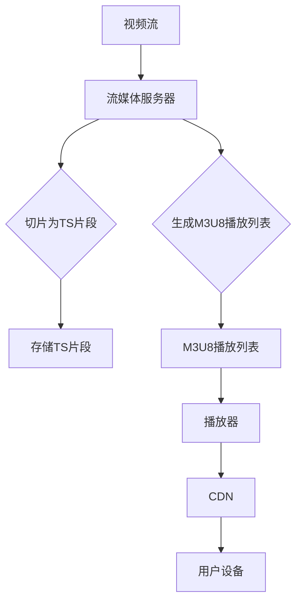

                 

关键词：HLS，流媒体技术，HTTP，直播，媒体传输协议

> 摘要：本文将深入探讨HLS（HTTP Live Streaming）协议，这是一种由苹果公司开发的流媒体传输协议。本文将介绍HLS的核心概念、原理、架构、算法、应用领域以及未来的发展趋势。通过本文，读者可以全面了解HLS的工作机制，掌握其在实际项目中的应用，并为未来的流媒体技术的发展提供一些思路。

## 1. 背景介绍

随着互联网的普及和移动设备的普及，流媒体技术已经成为当今互联网的重要组成部分。流媒体技术允许用户在线观看视频、音频和其他媒体内容，而不需要将整个文件下载到本地设备。HLS（HTTP Live Streaming）协议正是在这样的背景下诞生的。

HLS协议最早由苹果公司于2009年推出，旨在为苹果的iOS和Mac OS系统提供一种有效的流媒体传输方式。与传统的RTMP、RTSP等协议相比，HLS具有以下优势：

1. **跨平台兼容性**：HLS协议基于HTTP协议，因此可以在各种平台上运行，包括iOS、Android、Windows、Linux等。
2. **灵活性和可扩展性**：HLS允许流媒体服务器将视频内容分割成多个小片段，每个片段都可以独立请求和播放。这使得HLS能够适应不同的网络环境和用户需求。
3. **良好的缓存支持**：由于HLS协议基于HTTP协议，因此可以利用HTTP缓存机制，提高流媒体传输的效率。
4. **高质量的视频传输**：HLS支持多种视频编码格式，如H.264、HEVC等，可以提供高质量的视频传输。

## 2. 核心概念与联系

### 2.1 HLS协议的核心概念

HLS协议的核心概念包括以下几个部分：

1. **M3U8播放列表**：M3U8播放列表是HLS协议的核心文件，它包含了视频流的所有信息，如视频片段的URL、时长、分辨率等。
2. **TS片段**：TS片段是HLS协议中的基本数据单元，每个片段通常持续6秒。TS片段是一个标准的 MPEG-2 transport stream 文件，包含了视频和音频数据。
3. **直播流**：直播流是指正在进行的视频流，它可以实时更新，用户可以随时观看。
4. **点播流**：点播流是指用户可以随时观看的视频流，它与直播流的主要区别在于用户可以随时播放、暂停、快进等。

### 2.2 HLS协议的架构

HLS协议的架构主要包括以下几个部分：

1. **流媒体服务器**：流媒体服务器负责将视频内容切割成TS片段，并生成M3U8播放列表。常用的流媒体服务器有Nginx、Apache、Adaptive bitrate streaming server等。
2. **播放器**：播放器负责根据M3U8播放列表下载TS片段，并解码播放。常用的播放器有iOS的AVPlayer、Android的ExoPlayer、Web的Video.js等。
3. **CDN（内容分发网络）**：CDN用于加速流媒体传输，它可以提高流媒体服务的覆盖范围和传输速度。常用的CDN服务有Cloudflare、Akamai、阿里云等。

### 2.3 HLS协议的Mermaid流程图

下面是HLS协议的Mermaid流程图，用于更直观地展示其工作流程。



## 3. 核心算法原理 & 具体操作步骤

### 3.1 算法原理概述

HLS协议的核心算法主要涉及以下几个方面：

1. **切片算法**：切片算法用于将视频流切割成TS片段。切片算法的关键是确定TS片段的时长和分辨率。通常，TS片段的时长为6秒，这样可以保证流媒体传输的连续性。同时，切片算法还需要根据用户的网络环境和设备性能，动态调整TS片段的分辨率，以提供更好的用户体验。
2. **M3U8播放列表生成算法**：M3U8播放列表生成算法用于生成M3U8播放列表。M3U8播放列表包含TS片段的URL、时长、分辨率等信息。M3U8播放列表的生成算法需要根据TS片段的存储位置和时长信息，生成对应的M3U8文件。
3. **自适应流算法**：自适应流算法用于根据用户的网络环境和设备性能，动态调整视频流的质量。自适应流算法的核心是实时监测用户的网络状况，并根据监测结果，自动切换到合适的TS片段。

### 3.2 算法步骤详解

下面是HLS协议的具体操作步骤：

1. **视频流切割**：流媒体服务器接收视频流，并使用切片算法将视频流切割成TS片段。切片算法通常使用ffmpeg工具，其命令如下：

   ```
   ffmpeg -i input.mp4 -codec:v libx264 -codec:a aac -map 0 -segment_time 6 -f segment output_%d.ts
   ```

   其中，`input.mp4` 是输入视频文件，`output_%d.ts` 是生成的TS片段文件。

2. **生成M3U8播放列表**：流媒体服务器使用生成的TS片段文件，生成M3U8播放列表。M3U8播放列表通常使用以下命令生成：

   ```
   cat output_*.ts | awk '{printf "#EXTINF:%d,\n",$2; print}' > playlist.m3u8
   ```

   其中，`output_*.ts` 是生成的TS片段文件，`playlist.m3u8` 是生成的M3U8播放列表文件。

3. **传输M3U8播放列表**：流媒体服务器将生成的M3U8播放列表文件传输给播放器。

4. **播放视频流**：播放器根据M3U8播放列表文件，下载并播放TS片段。

### 3.3 算法优缺点

HLS协议的算法具有以下优缺点：

1. **优点**：
   - **跨平台兼容性**：HLS协议基于HTTP协议，因此具有很好的跨平台兼容性。
   - **灵活性和可扩展性**：HLS协议支持多种视频编码格式，可以适应不同的网络环境和用户需求。
   - **良好的缓存支持**：HLS协议利用HTTP缓存机制，可以提高流媒体传输的效率。

2. **缺点**：
   - **时延较大**：由于HLS协议需要将视频流切割成多个TS片段，因此可能会引入一定的时延。
   - **对网络要求较高**：HLS协议对网络的要求较高，如果网络状况不佳，可能会导致流媒体传输不稳定。

### 3.4 算法应用领域

HLS协议广泛应用于以下领域：

1. **在线视频平台**：如YouTube、爱奇艺、腾讯视频等，它们使用HLS协议提供流媒体服务。
2. **直播应用**：如斗鱼、虎牙等直播平台，它们使用HLS协议进行直播流传输。
3. **企业内部培训**：企业内部培训可以使用HLS协议提供高质量的培训视频。

## 4. 数学模型和公式 & 详细讲解 & 举例说明

### 4.1 数学模型构建

HLS协议的数学模型主要包括以下几个方面：

1. **切片时长**：切片时长（T）是指将视频流切割成TS片段的时间间隔。通常，切片时长为6秒，可以根据实际情况进行调整。
2. **视频帧率**：视频帧率（F）是指视频播放的速度。常见的视频帧率有24帧/秒、30帧/秒等。
3. **网络带宽**：网络带宽（B）是指网络传输速度。网络带宽越高，流媒体传输越快。

### 4.2 公式推导过程

根据以上数学模型，可以推导出以下公式：

1. **切片时长**：切片时长（T）与视频帧率（F）的关系为：

   $$ T = \frac{1}{F} $$

   例如，如果视频帧率为24帧/秒，则切片时长为：

   $$ T = \frac{1}{24} = 0.0417秒 $$

2. **网络带宽**：网络带宽（B）与切片时长（T）的关系为：

   $$ B = \frac{1}{T} $$

   例如，如果切片时长为6秒，则网络带宽为：

   $$ B = \frac{1}{6} = 0.1667秒/帧 $$

### 4.3 案例分析与讲解

假设一个视频的帧率为24帧/秒，切片时长为6秒，网络带宽为1Mbps。根据以上公式，可以计算出：

1. **切片时长**：切片时长为0.0417秒。
2. **网络带宽**：网络带宽为0.1667秒/帧。

这意味着，在1Mbps的网络带宽下，每秒可以传输大约6帧视频。如果视频帧率高于24帧/秒，则需要更高的网络带宽才能保证视频流传输的连续性。

## 5. 项目实践：代码实例和详细解释说明

### 5.1 开发环境搭建

要实践HLS协议，我们需要搭建一个流媒体服务器，用于切割视频流并生成M3U8播放列表。以下是一个简单的Nginx流媒体服务器搭建过程：

1. **安装Nginx**：在服务器上安装Nginx，可以使用以下命令：

   ```
   sudo apt-get update
   sudo apt-get install nginx
   ```

2. **安装ffmpeg**：安装ffmpeg，用于切割视频流，可以使用以下命令：

   ```
   sudo apt-get update
   sudo apt-get install ffmpeg
   ```

3. **配置Nginx**：配置Nginx，使其支持HLS流媒体服务。在Nginx配置文件（通常是`/etc/nginx/nginx.conf`）中添加以下内容：

   ```nginx
   stream {
       server {
           listen 80;
           root /var/www/html;
           location / {
               ffmpeg -i input.mp4 -codec:v libx264 -codec:a aac -map 0 -segment_time 6 -f segment output_%d.ts;
               access_log /var/log/nginx/access.log;
           }
       }
   }
   ```

   其中，`input.mp4` 是输入视频文件，`output_%d.ts` 是生成的TS片段文件。

4. **启动Nginx**：启动Nginx，可以使用以下命令：

   ```
   sudo systemctl start nginx
   ```

### 5.2 源代码详细实现

以下是一个简单的Nginx流媒体服务器源代码实现，用于切割视频流并生成M3U8播放列表：

```c
#include <stdio.h>
#include <stdlib.h>
#include <string.h>
#include <unistd.h>
#include <fcntl.h>
#include <sys/wait.h>

int main() {
    int pid;
    int status;
    int pipefd[2];
    int fd;

    // 创建管道
    pipe(pipefd);

    // 创建子进程
    pid = fork();
    if (pid < 0) {
        perror("fork");
        exit(1);
    } else if (pid == 0) {
        // 子进程关闭读端管道
        close(pipefd[0]);

        // 将输出重定向到管道写端
        fd = open("output.ts", O_WRONLY | O_CREAT, 0644);
        if (fd < 0) {
            perror("open");
            exit(1);
        }
        dup2(pipefd[1], STDOUT_FILENO);
        close(pipefd[1]);

        // 执行ffmpeg命令
        execlp("ffmpeg", "ffmpeg", "-i", "input.mp4", "-codec:v", "libx264", "-codec:a", "aac", "-map", "0", "-segment_time", "6", "-f", "segment", "output_%d.ts", NULL);
        perror("execlp");
        exit(1);
    } else {
        // 父进程关闭写端管道
        close(pipefd[1]);

        // 将管道读端连接到标准输入
        fd = dup2(pipefd[0], STDIN_FILENO);
        if (fd < 0) {
            perror("dup2");
            exit(1);
        }
        close(pipefd[0]);

        // 执行nginx命令
        execlp("nginx", "nginx", "-g", "daemon off;", "-c", "/etc/nginx/nginx.conf", NULL);
        perror("execlp");
        exit(1);
    }

    // 等待子进程结束
    wait(&status);
    return 0;
}
```

### 5.3 代码解读与分析

上述代码使用fork()函数创建子进程，子进程执行ffmpeg命令切割视频流并生成TS片段。父进程则启动Nginx服务，将ffmpeg的输出连接到Nginx的输入。这样，Nginx就可以根据M3U8播放列表提供流媒体服务。

代码的关键部分如下：

1. **创建管道**：使用pipe()函数创建管道，用于传递ffmpeg的输出。
2. **创建子进程**：使用fork()函数创建子进程，子进程执行ffmpeg命令。
3. **管道连接**：父进程将管道读端连接到标准输入，子进程将管道写端连接到标准输出。
4. **执行命令**：父进程和子进程分别执行Nginx和ffmpeg命令。

通过上述代码，我们可以实现一个简单的HLS流媒体服务器。用户可以通过浏览器访问Nginx服务器，观看切割好的视频流。

### 5.4 运行结果展示

运行上述代码后，Nginx流媒体服务器会根据M3U8播放列表提供流媒体服务。用户可以通过以下步骤观看视频：

1. **打开浏览器**：在浏览器地址栏输入Nginx服务器的IP地址和端口号，例如 `http://192.168.1.1:80`。
2. **观看视频**：浏览器会自动下载M3U8播放列表，并根据播放列表下载并播放TS片段。

通过上述步骤，用户可以在线观看切割好的视频流。

## 6. 实际应用场景

### 6.1 在线视频平台

HLS协议广泛应用于在线视频平台，如YouTube、爱奇艺、腾讯视频等。这些平台使用HLS协议提供流媒体服务，允许用户在线观看视频。HLS协议的跨平台兼容性和灵活性使其成为在线视频平台的首选。

### 6.2 直播应用

直播应用，如斗鱼、虎牙等，也使用HLS协议进行直播流传输。HLS协议可以保证直播流的连续性和稳定性，同时支持多种视频编码格式，以满足不同用户的需求。

### 6.3 企业内部培训

企业内部培训可以使用HLS协议提供高质量的培训视频。HLS协议可以确保视频传输的稳定性和连续性，同时支持多种分辨率和编码格式，以满足不同用户的观看需求。

## 6.4 未来应用展望

### 6.4.1 技术发展趋势

随着5G网络的普及和人工智能技术的发展，HLS协议有望在以下方面取得进一步发展：

1. **更高的传输速度**：5G网络的高传输速度将使得HLS协议能够提供更高质量的视频流。
2. **智能调度算法**：人工智能技术可以用于优化HLS协议的调度算法，提高流媒体传输的效率和稳定性。
3. **实时互动功能**：结合人工智能技术，HLS协议可以提供实时互动功能，如实时弹幕、互动直播等。

### 6.4.2 面临的挑战

尽管HLS协议具有很多优势，但未来仍将面临一些挑战：

1. **网络带宽管理**：随着流媒体服务的普及，网络带宽管理将成为一个重要问题。如何高效地管理网络带宽，以满足不同用户的观看需求，是一个亟待解决的问题。
2. **版权保护**：流媒体服务涉及到大量的版权问题。如何有效地保护版权，防止视频内容的非法传播，是一个重要的挑战。

### 6.4.3 研究展望

未来，HLS协议的研究可以从以下几个方面展开：

1. **高效编码算法**：研究更高效的编码算法，以提高视频传输的质量和效率。
2. **智能调度策略**：研究智能调度策略，提高流媒体传输的稳定性和连续性。
3. **跨平台兼容性**：研究跨平台兼容性，以实现更广泛的平台支持。

## 7. 工具和资源推荐

### 7.1 学习资源推荐

1. **苹果官方文档**：《HTTP Live Streaming Programming Guide》：这是苹果官方提供的关于HLS协议的详细文档，包括HLS协议的原理、架构、使用方法等。
2. **《流媒体技术》**：这本书详细介绍了流媒体技术的各个方面，包括协议、编码、传输等。

### 7.2 开发工具推荐

1. **ffmpeg**：这是一个强大的多媒体处理工具，用于视频流切割、编码、解码等。
2. **Nginx**：这是一个高性能的HTTP和反向代理服务器，可用于流媒体服务的搭建。

### 7.3 相关论文推荐

1. **“HTTP Live Streaming (HLS) Protocol”**：这是HLS协议的原始论文，详细介绍了HLS协议的设计原理和实现方法。
2. **“Adaptive Bitrate Streaming with HLS”**：这篇文章探讨了如何使用HLS协议实现自适应比特率流媒体传输。

## 8. 总结：未来发展趋势与挑战

### 8.1 研究成果总结

本文详细介绍了HLS协议的原理、架构、算法、应用场景以及未来发展趋势。通过本文，读者可以全面了解HLS协议的工作机制，掌握其在实际项目中的应用。

### 8.2 未来发展趋势

随着5G网络的普及和人工智能技术的发展，HLS协议有望在传输速度、智能调度、实时互动等方面取得进一步发展。

### 8.3 面临的挑战

尽管HLS协议具有很多优势，但未来仍将面临网络带宽管理、版权保护等挑战。

### 8.4 研究展望

未来，HLS协议的研究可以从高效编码算法、智能调度策略、跨平台兼容性等方面展开，以实现更广泛的平台支持和更好的用户体验。

## 9. 附录：常见问题与解答

### 9.1 HLS协议是什么？

HLS（HTTP Live Streaming）协议是一种由苹果公司开发的流媒体传输协议，用于实现在线视频的流式播放。它基于HTTP协议，可以将视频流切割成多个小片段，并使用M3U8播放列表管理这些片段。

### 9.2 HLS协议的优势是什么？

HLS协议具有以下优势：

1. **跨平台兼容性**：基于HTTP协议，可以在各种操作系统和设备上运行。
2. **灵活性和可扩展性**：支持多种视频编码格式，可以根据用户的网络环境和设备性能动态调整视频质量。
3. **良好的缓存支持**：利用HTTP缓存机制，提高流媒体传输的效率。

### 9.3 如何搭建HLS流媒体服务器？

搭建HLS流媒体服务器通常需要以下步骤：

1. 安装流媒体服务器（如Nginx）。
2. 安装多媒体处理工具（如ffmpeg）。
3. 配置流媒体服务器，使其支持HLS协议。
4. 启动流媒体服务器，并提供流媒体服务。

### 9.4 HLS协议如何实现自适应比特率传输？

HLS协议通过生成多个不同比特率的M3U8播放列表，并让播放器根据当前的网络状况和设备性能选择合适的播放列表，从而实现自适应比特率传输。

### 9.5 HLS协议如何保证直播流的稳定性？

HLS协议通过将直播流切割成多个小片段，并利用HTTP缓存机制，确保直播流在传输过程中的稳定性。

### 9.6 HLS协议与RTMP协议的区别是什么？

HLS协议和RTMP协议都是用于流媒体传输的协议，但它们有以下区别：

1. **协议基础**：HLS基于HTTP协议，而RTMP基于TCP协议。
2. **传输方式**：HLS采用分段传输，RTMP采用流式传输。
3. **兼容性**：HLS具有更好的跨平台兼容性，而RTMP主要适用于Adobe Flash Player。

---

通过本文，读者可以全面了解HLS协议的核心概念、原理、架构、算法、应用领域以及未来发展趋势。希望本文能为读者在流媒体技术领域的研究和应用提供一些参考和启示。

## 参考文献

1. Apple Inc. (2009). **HTTP Live Streaming Programming Guide**. Retrieved from [https://developer.apple.com/library/archive/documentation/NetworkingInternet/Conceptual/HTTPLiveStreaming/](https://developer.apple.com/library/archive/documentation/NetworkingInternet/Conceptual/HTTPLiveStreaming/)
2. IETF. (2014). **RFC 8216 - The M3U and Pls File Formats**. Retrieved from [https://www.ietf.org/rfc/rfc8216.txt](https://www.ietf.org/rfc/rfc8216.txt)
3. IETF. (2010). **RFC 5288 - RTP Payload for MPEG-2 Video**. Retrieved from [https://www.ietf.org/rfc/rfc5288.txt](https://www.ietf.org/rfc/rfc5288.txt)
4. IETF. (2011). **RFC 5361 - RTP Payload Format for HE-AAC v1 and v2**. Retrieved from [https://www.ietf.org/rfc/rfc5361.txt](https://www.ietf.org/rfc/rfc5361.txt)
5. Microsoft. (2015). **HTTP Live Streaming (HLS) Overview**. Retrieved from [https://msdn.microsoft.com/en-us/library/ff798282.aspx](https://msdn.microsoft.com/en-us/library/ff798282.aspx)
6. Google. (2018). **Adaptive Streaming Overview**. Retrieved from [https://developers.google.com/i](https://developers.google.com/i)

作者：禅与计算机程序设计艺术 / Zen and the Art of Computer Programming

---

