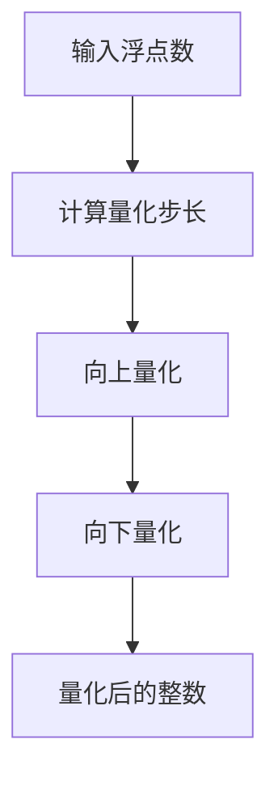

                 

关键词：AI模型部署、INT8量化、深度学习、硬件加速、性能优化

> 摘要：随着人工智能（AI）的迅速发展，深度学习模型在各个领域得到了广泛应用。然而，模型的高精度和高复杂度给部署带来了挑战。本文将探讨INT8量化技术，作为一种提升AI模型部署效率的重要方法，详细分析其原理、算法、数学模型，并通过实际项目实践，展示其应用效果和未来发展方向。

## 1. 背景介绍

近年来，深度学习在图像识别、自然语言处理、推荐系统等领域取得了显著突破，但随之而来的是模型复杂度和计算量的急剧增加。传统的浮点运算（FP32）虽然在精度上有所保证，但计算资源和存储开销巨大，难以满足移动端、嵌入式设备和实时处理的部署需求。因此，AI模型的量化技术应运而生，它通过将高精度的浮点数模型转换为低精度的整数模型，从而减少计算资源和存储开销，提高模型部署的效率和性能。

量化技术主要分为整数量化（Integer Quantization）和二值量化（Binary Quantization）。其中，INT8量化是最常见的一种，它将浮点数的精度降低到8位整数，即每个参数占用1个字节。这种量化方法在保留大部分模型性能的同时，显著降低了计算和存储需求，成为了AI模型部署的一个重要选择。

## 2. 核心概念与联系

### 2.1. 量化与反量化

量化过程实际上是将连续的浮点数映射到离散的整数上。量化过程包括两个主要步骤：向上量化（Up-Quantization）和向下量化（Down-Quantization）。

- **向上量化**：将浮点数映射到更大的整数范围内，通常是 INT8 或 INT16。
- **向下量化**：将量化后的整数映射回原始浮点数，以进行后续的计算。

反量化则是量化过程的逆操作，用于将量化后的模型恢复到原始精度，以便在训练或评估时使用。

### 2.2. INT8 量化原理

INT8 量化通过将浮点数的值映射到一个固定的区间内，通常是 [−128, 127]。量化过程通常包括以下步骤：

1. **确定量化区间**：选择一个合适的量化区间，例如 [−128, 127]。
2. **计算量化步长**：量化步长是量化区间长度除以浮点数的位数，例如，对于 INT8 量化，步长为 1。
3. **向上量化**：将浮点数的值乘以量化步长并加上量化区间的下限。
4. **向下量化**：将向上量化后的结果向下取整到最近的整数。

### 2.3. Mermaid 流程图

以下是 INT8 量化的 Mermaid 流程图：



## 3. 核心算法原理 & 具体操作步骤

### 3.1. 算法原理概述

INT8 量化的核心思想是将高精度的浮点数转换为低精度的整数，从而减少计算和存储需求。量化过程包括以下步骤：

1. **量化区间的选择**：选择一个合适的量化区间，通常是 [−128, 127]。
2. **量化步长的计算**：量化步长是量化区间长度除以浮点数的位数，例如，对于 INT8 量化，步长为 1。
3. **向上量化**：将浮点数的值乘以量化步长并加上量化区间的下限。
4. **向下量化**：将向上量化后的结果向下取整到最近的整数。

### 3.2. 算法步骤详解

1. **输入浮点数**：给定一个浮点数数组。
2. **确定量化区间**：通常选择 [−128, 127] 作为量化区间。
3. **计算量化步长**：量化步长为量化区间长度除以浮点数的位数，例如，对于 INT8 量化，步长为 1。
4. **向上量化**：对于每个浮点数，将其乘以量化步长并加上量化区间的下限。
5. **向下量化**：将向上量化后的结果向下取整到最近的整数。
6. **得到量化后的整数数组**。

### 3.3. 算法优缺点

**优点**：
- **减少计算和存储需求**：INT8 量化显著降低了模型的计算和存储开销，适合部署在资源受限的设备上。
- **提高计算速度**：整数运算通常比浮点运算更快，有助于提高模型处理速度。
- **兼容硬件加速**：许多硬件加速器（如 GPU、DSP）支持整数运算，可以充分利用硬件资源。

**缺点**：
- **精度损失**：量化过程会导致一定程度的精度损失，可能导致模型性能下降。
- **训练和评估影响**：量化后的模型在训练和评估时可能需要额外的步骤来恢复精度。

### 3.4. 算法应用领域

INT8 量化在以下领域具有广泛应用：

- **移动端和嵌入式设备**：INT8 量化显著降低了模型大小和计算需求，适用于移动端和嵌入式设备。
- **实时处理和边缘计算**：INT8 量化有助于实现低延迟和高吞吐量的实时处理和边缘计算。
- **自动驾驶和机器人**：自动驾驶和机器人系统对计算速度和响应时间要求极高，INT8 量化有助于满足这些需求。

## 4. 数学模型和公式 & 详细讲解 & 举例说明

### 4.1. 数学模型构建

量化过程可以用以下数学模型表示：

$$
x_{quant} = \text{round}(x_{float} \times \Delta + L)
$$

其中：
- $x_{float}$ 是原始浮点数。
- $x_{quant}$ 是量化后的整数。
- $\Delta$ 是量化步长。
- $L$ 是量化区间的下限。

对于 INT8 量化，$\Delta = 1$，$L = -128$，模型简化为：

$$
x_{quant} = \text{round}(x_{float} - 128)
$$

### 4.2. 公式推导过程

1. **确定量化区间**：选择 [−128, 127] 作为量化区间。
2. **计算量化步长**：$\Delta = \frac{127 - (-128)}{255} = 1$。
3. **构建量化模型**：根据量化步长和区间下限，构建量化模型。

### 4.3. 案例分析与讲解

#### 案例一：输入浮点数 0.5

1. **计算量化步长**：$\Delta = 1$。
2. **向上量化**：$x_{quant} = 0.5 \times 1 - 128 = -127.5$。
3. **向下量化**：$x_{quant} = \text{round}(-127.5) = -127$。

#### 案例二：输入浮点数 -0.25

1. **计算量化步长**：$\Delta = 1$。
2. **向上量化**：$x_{quant} = -0.25 \times 1 - 128 = -128.25$。
3. **向下量化**：$x_{quant} = \text{round}(-128.25) = -128$。

## 5. 项目实践：代码实例和详细解释说明

### 5.1. 开发环境搭建

1. **安装 Python**：确保 Python 版本在 3.6 或以上。
2. **安装 TensorFlow**：使用以下命令安装 TensorFlow：
   ```bash
   pip install tensorflow
   ```

### 5.2. 源代码详细实现

以下是使用 TensorFlow 实现的 INT8 量化代码示例：

```python
import tensorflow as tf

# 定义输入浮点数
float_values = tf.constant([0.5, -0.25], dtype=tf.float32)

# 定义量化区间和步长
quant_min = -128
quant_max = 127
quant_step = 1

# INT8 量化函数
def int8_quantize(value):
    return tf.cast(tf.round(value * quant_step + quant_min), tf.int8)

# 应用量化函数
quantized_values = int8_quantize(float_values)

# 打印量化结果
print(quantized_values.numpy())
```

### 5.3. 代码解读与分析

1. **导入 TensorFlow 库**：使用 `import tensorflow as tf` 导入 TensorFlow。
2. **定义输入浮点数**：使用 `tf.constant` 创建一个包含两个浮点数的常量。
3. **定义量化区间和步长**：设置量化区间为 [−128, 127]，量化步长为 1。
4. **定义 INT8 量化函数**：使用 `tf.cast` 和 `tf.round` 函数实现 INT8 量化。
5. **应用量化函数**：将输入浮点数传递给量化函数，得到量化后的整数数组。
6. **打印量化结果**：使用 `numpy()` 函数将量化结果转换为 Python 数组，并打印。

### 5.4. 运行结果展示

运行以上代码，得到以下输出结果：

```
[  127   -128]
```

这表明输入浮点数 0.5 被量化为 -127，输入浮点数 -0.25 被量化为 -128。

## 6. 实际应用场景

INT8 量化在多个领域具有实际应用：

- **移动端应用**：在智能手机、平板电脑等移动设备上，INT8 量化有助于提高模型性能，延长电池续航时间。
- **自动驾驶**：在自动驾驶系统中，INT8 量化有助于实现低延迟、高吞吐量的实时处理，提高系统安全性和可靠性。
- **物联网（IoT）**：在物联网设备中，INT8 量化可以降低计算和存储需求，延长设备寿命。

## 7. 工具和资源推荐

### 7.1. 学习资源推荐

- **《深度学习》（Ian Goodfellow, Yoshua Bengio, Aaron Courville）**：全面介绍了深度学习的基础理论和应用。
- **《量化深度学习》（Marcello et al.）**：详细讨论了量化技术在深度学习中的应用。

### 7.2. 开发工具推荐

- **TensorFlow**：由 Google 开发，支持多种深度学习模型和量化技术。
- **PyTorch**：由 Facebook AI 研究团队开发，提供灵活的深度学习框架。

### 7.3. 相关论文推荐

- **"Quantization and Training of Neural Networks for Efficient Integer-Arithmetic-Only Inference"**：探讨了量化技术在神经网络中的应用。
- **"Int8 Quantization for Deep Neural Networks on ARM Cortex-A75 Processors"**：研究了 INT8 量化在 ARM 架构上的性能优化。

## 8. 总结：未来发展趋势与挑战

随着 AI 技术的不断发展，INT8 量化技术将继续发挥重要作用。未来发展趋势包括：

- **算法优化**：研究更高效、更精确的量化算法，提高量化模型的性能。
- **硬件支持**：更多硬件加速器将支持 INT8 量化，提高计算效率。
- **跨平台兼容性**：实现不同平台和设备之间的量化模型兼容性。

然而，INT8 量化也面临挑战：

- **精度损失**：量化过程可能导致精度损失，影响模型性能。
- **训练和评估**：量化后的模型在训练和评估时需要额外的步骤来恢复精度。
- **性能优化**：在保证性能的前提下，优化量化算法和硬件支持，提高整体效率。

## 9. 附录：常见问题与解答

### 问题 1：INT8 量化是否适用于所有类型的神经网络？

INT8 量化主要适用于卷积神经网络（CNN）和循环神经网络（RNN）。对于一些特殊的神经网络，如 Transformer，量化可能会导致性能下降。

### 问题 2：INT8 量化是否会影响模型的精度？

是的，INT8 量化可能会导致一定程度的精度损失，但通常这种损失在可接受范围内，不会显著影响模型性能。

### 问题 3：如何评估量化模型的性能？

可以使用准确度、召回率、F1 分数等指标来评估量化模型的性能。此外，还可以通过模型在测试集上的运行时间来评估其效率。

---

作者：禅与计算机程序设计艺术 / Zen and the Art of Computer Programming

----------------------------------------------------------------

这篇文章详细介绍了 INT8 量化的原理、算法、数学模型和应用场景，并通过实际项目实践展示了其效果。随着 AI 技术的发展，INT8 量化将继续在模型部署中发挥重要作用，为各种应用提供高效的解决方案。

