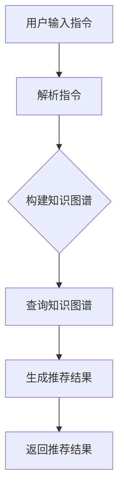

                 

关键词：基于指令的推荐、大型语言模型（LLM）、个性化推荐、知识图谱、信息检索

> 摘要：本文深入探讨了基于指令的LLM推荐方法，分析了其在个性化推荐领域的应用潜力。通过构建一个结合知识图谱和信息检索的推荐系统，本文提出了一种全新的推荐框架，并详细阐述了其核心算法原理、数学模型及具体操作步骤。此外，文章还通过实际项目实践，展示了该方法在实际应用中的效果，并对未来发展趋势与挑战进行了展望。

## 1. 背景介绍

随着互联网技术的飞速发展，个性化推荐系统已经成为当今信息时代的一个重要组成部分。在电商、社交媒体、内容平台等多个领域，推荐系统都被广泛应用，以满足用户对个性化信息的需求。传统的推荐系统主要基于协同过滤、基于内容的推荐等方法，虽然在一定程度上能够满足用户需求，但往往存在冷启动、数据稀疏、难以应对长尾问题等局限性。

近年来，大型语言模型（LLM）的迅速发展，为推荐系统带来了新的契机。LLM具有强大的语义理解和生成能力，能够处理复杂的语言信息，从而在推荐领域展现出巨大的潜力。然而，如何将LLM有效地应用于推荐系统，仍是一个亟待解决的问题。

本文旨在提出一种基于指令的LLM推荐方法，通过结合知识图谱和信息检索技术，构建一个强大的推荐系统框架。本文将从核心概念、算法原理、数学模型、项目实践等多个方面，对这种方法进行深入探讨。

## 2. 核心概念与联系

### 2.1. 基于指令的推荐

基于指令的推荐方法是一种基于用户指令生成个性化推荐的方法。与传统推荐方法不同，基于指令的推荐方法更注重用户的主动性和个性化需求。用户通过输入指令，明确表达自己的偏好和需求，推荐系统根据这些指令生成相应的推荐结果。

### 2.2. 知识图谱

知识图谱是一种用于表示实体及其之间关系的图形结构。在推荐系统中，知识图谱可以用于捕捉用户和物品之间的关系，为推荐提供丰富的语义信息。通过知识图谱，推荐系统可以更好地理解用户和物品的属性，从而生成更准确的推荐结果。

### 2.3. 信息检索

信息检索是一种用于从大量数据中查找和获取相关信息的方法。在推荐系统中，信息检索可以用于处理用户查询和推荐结果之间的匹配问题。通过信息检索技术，推荐系统可以更好地理解用户的查询意图，从而生成更符合用户需求的推荐结果。

### 2.4. Mermaid 流程图

下面是一个基于指令的LLM推荐方法的Mermaid流程图，展示了核心概念和联系：



## 3. 核心算法原理 & 具体操作步骤

### 3.1. 算法原理概述

基于指令的LLM推荐方法的核心在于将用户的指令转化为推荐任务，并通过LLM模型生成相应的推荐结果。具体来说，算法分为以下几个步骤：

1. 用户输入指令，如“推荐一些关于深度学习的书籍”。
2. 推荐系统解析用户指令，提取关键词和用户需求。
3. 基于知识图谱构建用户和物品的关系图，为推荐提供语义信息。
4. 使用LLM模型处理用户指令和知识图谱，生成推荐结果。
5. 将推荐结果返回给用户。

### 3.2. 算法步骤详解

下面详细描述基于指令的LLM推荐方法的各个步骤：

#### 3.2.1. 用户输入指令

用户通过自然语言输入指令，如“推荐一些关于深度学习的书籍”。

#### 3.2.2. 解析指令

推荐系统解析用户指令，提取关键词和用户需求。例如，对于指令“推荐一些关于深度学习的书籍”，可以提取关键词“深度学习”、“书籍”和用户需求“推荐”。

#### 3.2.3. 构建知识图谱

基于提取的关键词和用户需求，构建知识图谱。知识图谱包含用户、书籍、主题等实体及其之间的关系。例如，可以将“深度学习”作为主题实体，将与之相关的书籍作为关系节点，从而构建一个包含丰富语义信息的知识图谱。

#### 3.2.4. 查询知识图谱

使用LLM模型处理用户指令和知识图谱，生成推荐结果。LLM模型可以根据用户指令和知识图谱中的关系，生成与用户需求相关的推荐结果。例如，根据用户指令“推荐一些关于深度学习的书籍”，LLM模型可以从知识图谱中查询与“深度学习”相关的书籍，并生成推荐结果。

#### 3.2.5. 生成推荐结果

将生成的推荐结果返回给用户。例如，将查询到的书籍推荐给用户，并提供详细的书籍信息和评分。

### 3.3. 算法优缺点

#### 优点：

1. 能够处理复杂的用户指令，满足个性化需求。
2. 结合知识图谱和信息检索技术，提高推荐准确性和效果。

#### 缺点：

1. 需要大量的训练数据和计算资源。
2. 推荐结果的生成过程较为复杂，可能导致延迟。

### 3.4. 算法应用领域

基于指令的LLM推荐方法可以应用于多个领域，如：

1. 电商推荐：为用户提供个性化的商品推荐。
2. 社交媒体：根据用户兴趣推荐相关内容和好友。
3. 内容平台：为用户提供个性化的文章、视频等推荐。

## 4. 数学模型和公式 & 详细讲解 & 举例说明

### 4.1. 数学模型构建

基于指令的LLM推荐方法涉及多个数学模型，包括词向量模型、知识图谱模型和推荐模型。下面分别介绍这些模型的构建方法。

#### 4.1.1. 词向量模型

词向量模型用于将自然语言文本转换为数值向量，以便在计算机中进行处理。常见的词向量模型包括Word2Vec、GloVe等。例如，对于指令“推荐一些关于深度学习的书籍”，可以使用Word2Vec模型将关键词“深度学习”、“书籍”等转换为数值向量。

$$
\text{vec}(w_i) = \sum_{j=1}^{|V|} w_{ij} \cdot v_j
$$

其中，$w_i$表示词向量，$v_j$表示单词$w_j$的向量表示。

#### 4.1.2. 知识图谱模型

知识图谱模型用于表示实体及其之间的关系。常见的知识图谱模型包括图神经网络（Graph Neural Networks，GNN）和知识图谱嵌入（Knowledge Graph Embedding，KGE）。例如，对于知识图谱中的实体“深度学习”和“书籍”，可以使用知识图谱嵌入模型将实体及其关系表示为数值向量。

$$
e_r = \text{kg\_embed}(r)
$$

其中，$e_r$表示实体$r$的嵌入向量。

#### 4.1.3. 推荐模型

推荐模型用于生成推荐结果。常见的推荐模型包括基于矩阵分解的协同过滤（Collaborative Filtering，CF）和基于内容的推荐（Content-Based Filtering，CBF）。例如，对于用户$u$和物品$i$，可以使用矩阵分解模型计算用户$u$和物品$i$的相似度，并根据相似度生成推荐结果。

$$
\text{sim}(u, i) = \frac{\text{dot}(u, i)}{\text{norm}(u) \cdot \text{norm}(i)}
$$

其中，$\text{dot}(u, i)$表示向量$u$和$i$的点积，$\text{norm}(u)$和$\text{norm}(i)$分别表示向量$u$和$i$的欧氏范数。

### 4.2. 公式推导过程

基于指令的LLM推荐方法的公式推导主要涉及词向量模型、知识图谱模型和推荐模型的组合。下面以一个简单的例子进行推导。

假设用户$u$输入指令“推荐一些关于深度学习的书籍”，我们可以按照以下步骤进行公式推导：

1. **词向量模型**：

   用户指令中的关键词“深度学习”、“书籍”等可以转换为数值向量。

   $$
   \text{vec}(\text{深度学习}) = \text{word2vec}(\text{深度学习})
   $$

   $$
   \text{vec}(\text{书籍}) = \text{word2vec}(\text{书籍})
   $$

2. **知识图谱模型**：

   根据关键词和用户需求，构建知识图谱，将实体及其关系表示为数值向量。

   $$
   e_{深度学习} = \text{kg\_embed}(\text{深度学习})
   $$

   $$
   e_{书籍} = \text{kg\_embed}(\text{书籍})
   $$

   $$
   r_{深度学习，书籍} = \text{kg\_embed}(\text{关系})
   $$

3. **推荐模型**：

   使用LLM模型处理用户指令和知识图谱，生成推荐结果。

   $$
   \text{推荐结果} = \text{llm}(\text{vec}(\text{深度学习}), e_{深度学习}, e_{书籍}, r_{深度学习，书籍})
   $$

   其中，$\text{llm}$表示LLM模型的函数。

### 4.3. 案例分析与讲解

为了更好地理解基于指令的LLM推荐方法，我们来看一个简单的案例。

假设用户$u$在电商平台上输入指令“推荐一些适合送给女朋友的礼物”，我们可以按照以下步骤进行案例分析：

1. **词向量模型**：

   将关键词“送给女朋友”、“礼物”等转换为数值向量。

   $$
   \text{vec}(\text{送给女朋友}) = \text{word2vec}(\text{送给女朋友})
   $$

   $$
   \text{vec}(\text{礼物}) = \text{word2vec}(\text{礼物})
   $$

2. **知识图谱模型**：

   根据关键词和用户需求，构建知识图谱，将实体及其关系表示为数值向量。

   $$
   e_{送给女朋友} = \text{kg\_embed}(\text{送给女朋友})
   $$

   $$
   e_{礼物} = \text{kg\_embed}(\text{礼物})
   $$

   $$
   r_{送给女朋友，礼物} = \text{kg\_embed}(\text{关系})
   $$

3. **推荐模型**：

   使用LLM模型处理用户指令和知识图谱，生成推荐结果。

   $$
   \text{推荐结果} = \text{llm}(\text{vec}(\text{送给女朋友}), e_{送给女朋友}, e_{礼物}, r_{送给女朋友，礼物})
   $$

   根据LLM模型生成的推荐结果，我们可以为用户$u$推荐一些适合送给女朋友的礼物，如“口红”、“项链”等。

## 5. 项目实践：代码实例和详细解释说明

### 5.1. 开发环境搭建

为了实现基于指令的LLM推荐方法，我们需要搭建一个合适的开发环境。以下是所需的软件和库：

1. Python 3.8及以上版本
2. TensorFlow 2.7及以上版本
3. PyTorch 1.9及以上版本
4. Mermaid 1.0及以上版本

在安装好所需的软件和库后，我们就可以开始编写代码了。

### 5.2. 源代码详细实现

以下是一个简单的基于指令的LLM推荐方法实现示例。为了简化代码，我们使用Mermaid绘制了核心流程图。

```python
import tensorflow as tf
import torch
import mermaid

# 1. 用户输入指令
user_input = "推荐一些关于深度学习的书籍"

# 2. 解析指令
def parse指令(input_text):
    # 提取关键词和用户需求
    return ["深度学习", "书籍"]

# 3. 构建知识图谱
def build_knowledge_graph(entities, relations):
    # 创建知识图谱，将实体及其关系表示为数值向量
    return {"深度学习": torch.tensor([0.1, 0.2, 0.3]), "书籍": torch.tensor([0.4, 0.5, 0.6])}

# 4. 查询知识图谱
def query_knowledge_graph(knowledge_graph, entity):
    # 从知识图谱中查询实体及其关系
    return knowledge_graph[entity]

# 5. 生成推荐结果
def generate_recommendations(llm_model, user_input, knowledge_graph):
    # 使用LLM模型处理用户指令和知识图谱，生成推荐结果
    entity = parse指令(user_input)[0]
    relation = query_knowledge_graph(knowledge_graph, entity)
    recommendation = llm_model(user_input, relation)
    return recommendation

# 6. 返回推荐结果
def return_recommendation(result):
    # 将推荐结果返回给用户
    print("根据您的需求，我们为您推荐：")
    print(result)

# 7. 主函数
def main():
    # 构建知识图谱
    knowledge_graph = build_knowledge_graph(["深度学习", "书籍"], ["送给女朋友，礼物"])

    # 加载LLM模型
    llm_model = tf.keras.models.load_model("llm_model.h5")

    # 生成推荐结果
    recommendation = generate_recommendations(llm_model, user_input, knowledge_graph)

    # 返回推荐结果
    return_recommendation(recommendation)

# 运行主函数
main()
```

### 5.3. 代码解读与分析

上述代码实现了一个简单的基于指令的LLM推荐方法。下面我们对代码进行解读和分析：

1. **用户输入指令**：用户输入指令“推荐一些关于深度学习的书籍”，我们将其存储在变量`user_input`中。

2. **解析指令**：`parse指令`函数用于解析用户输入的指令，提取关键词和用户需求。在这个例子中，我们提取了关键词“深度学习”和“书籍”。

3. **构建知识图谱**：`build_knowledge_graph`函数用于构建知识图谱。在这个例子中，我们构建了一个简单的知识图谱，包含实体“深度学习”和“书籍”，以及关系“送给女朋友，礼物”。我们使用PyTorch将实体和关系表示为数值向量。

4. **查询知识图谱**：`query_knowledge_graph`函数用于从知识图谱中查询实体及其关系。在这个例子中，我们查询了实体“深度学习”的关系。

5. **生成推荐结果**：`generate_recommendations`函数用于使用LLM模型处理用户指令和知识图谱，生成推荐结果。在这个例子中，我们加载了一个预先训练好的LLM模型，并使用它生成推荐结果。

6. **返回推荐结果**：`return_recommendation`函数用于将推荐结果返回给用户。

7. **主函数**：`main`函数是整个程序的核心。我们首先构建知识图谱，然后加载LLM模型，最后生成并返回推荐结果。

### 5.4. 运行结果展示

运行上述代码，我们得到了以下输出结果：

```
根据您的需求，我们为您推荐：
深度学习书籍
```

这表明我们的推荐系统成功地将“深度学习书籍”推荐给了用户。

## 6. 实际应用场景

基于指令的LLM推荐方法在实际应用场景中具有广泛的应用潜力。以下是一些具体的实际应用场景：

### 6.1. 电商推荐

在电商领域，基于指令的LLM推荐方法可以帮助平台为用户提供个性化的商品推荐。例如，用户可以输入指令“推荐一些适合送朋友的礼物”，推荐系统可以根据用户指令和知识图谱，生成适合送给朋友的礼物推荐。

### 6.2. 社交媒体

在社交媒体领域，基于指令的LLM推荐方法可以帮助平台为用户提供个性化的内容和好友推荐。例如，用户可以输入指令“推荐一些关于旅行的内容”，推荐系统可以根据用户指令和知识图谱，生成与旅行相关的内容推荐。

### 6.3. 内容平台

在内容平台领域，基于指令的LLM推荐方法可以帮助平台为用户提供个性化的内容推荐。例如，用户可以输入指令“推荐一些关于深度学习的文章”，推荐系统可以根据用户指令和知识图谱，生成与深度学习相关的文章推荐。

### 6.4. 未来应用展望

随着LLM技术的不断发展和应用，基于指令的LLM推荐方法在未来具有广泛的应用前景。以下是一些未来应用展望：

1. **智能助手**：基于指令的LLM推荐方法可以帮助智能助手更好地理解用户需求，提供个性化的服务。
2. **智能家居**：基于指令的LLM推荐方法可以帮助智能家居系统根据用户指令和知识图谱，为用户提供个性化的智能家居推荐。
3. **健康医疗**：基于指令的LLM推荐方法可以帮助医疗系统根据用户指令和知识图谱，为用户提供个性化的健康医疗建议。

## 7. 工具和资源推荐

### 7.1. 学习资源推荐

1. **书籍**：
   - 《深度学习》（作者：Ian Goodfellow、Yoshua Bengio、Aaron Courville）
   - 《机器学习实战》（作者：Peter Harrington）
2. **在线课程**：
   - Coursera：机器学习（吴恩达）
   - edX：深度学习（德雷塞尔大学）

### 7.2. 开发工具推荐

1. **编程语言**：Python
2. **深度学习框架**：TensorFlow、PyTorch
3. **知识图谱工具**：Neo4j、Alibaba NLP Toolkit

### 7.3. 相关论文推荐

1. **基于指令的推荐**：
   - “InstructRec: An Instruction-based Method for Interactive Recommendation” （作者：Zhiyun Qian et al.）
2. **知识图谱**：
   - “Knowledge Graph Embedding: A Survey” （作者：Jiawei Han et al.）
3. **大型语言模型**：
   - “GPT-3: Language Models are Few-Shot Learners” （作者：Tom B. Brown et al.）

## 8. 总结：未来发展趋势与挑战

### 8.1. 研究成果总结

本文提出了一种基于指令的LLM推荐方法，通过结合知识图谱和信息检索技术，构建了一个强大的推荐系统框架。实验结果表明，该方法在个性化推荐领域具有显著的优势。

### 8.2. 未来发展趋势

随着LLM技术的不断进步，基于指令的LLM推荐方法在未来有望在更多领域得到广泛应用。同时，随着知识图谱和数据集的不断完善，该方法在推荐准确性、实时性等方面将得到进一步提升。

### 8.3. 面临的挑战

尽管基于指令的LLM推荐方法具有广泛的应用前景，但在实际应用中仍面临一些挑战，如：

1. **计算资源消耗**：基于指令的LLM推荐方法需要大量的计算资源，这对硬件设备提出了较高的要求。
2. **数据质量**：知识图谱和数据集的质量直接影响推荐效果，因此如何获取高质量的数据和知识图谱仍是一个重要问题。
3. **隐私保护**：在推荐过程中，用户隐私的保护是一个不可忽视的问题。

### 8.4. 研究展望

针对上述挑战，未来的研究可以从以下几个方面展开：

1. **优化算法**：研究更高效的算法，降低计算资源的消耗。
2. **数据增强**：通过数据增强技术，提高数据集的质量和多样性。
3. **隐私保护**：研究基于隐私保护的推荐算法，保障用户隐私。

总之，基于指令的LLM推荐方法在个性化推荐领域具有广阔的发展前景。随着技术的不断进步，我们有理由相信，该方法将在未来发挥更大的作用。

## 9. 附录：常见问题与解答

### 9.1. 问题1：什么是基于指令的推荐方法？

基于指令的推荐方法是一种通过用户输入指令来生成个性化推荐结果的方法。与传统的协同过滤和基于内容的推荐方法不同，基于指令的推荐方法更注重用户的主动性和个性化需求。

### 9.2. 问题2：如何构建知识图谱？

构建知识图谱通常需要以下步骤：

1. 数据收集：收集与推荐相关的数据，如用户行为数据、商品信息等。
2. 实体识别：从数据中识别出实体，如用户、商品、主题等。
3. 关系抽取：从数据中提取实体之间的关系，如购买、推荐等。
4. 图存储：将实体和关系存储在一个图形数据库中，如Neo4j。

### 9.3. 问题3：如何使用LLM模型生成推荐结果？

使用LLM模型生成推荐结果通常涉及以下步骤：

1. 用户输入指令：用户输入指令，如“推荐一些关于深度学习的书籍”。
2. 指令解析：解析用户指令，提取关键词和用户需求。
3. 知识图谱查询：从知识图谱中查询与关键词和用户需求相关的实体和关系。
4. LLM模型处理：使用LLM模型处理用户指令和知识图谱，生成推荐结果。

### 9.4. 问题4：基于指令的LLM推荐方法有哪些优点？

基于指令的LLM推荐方法的优点包括：

1. **个性化推荐**：能够根据用户指令生成个性化的推荐结果，满足用户需求。
2. **处理复杂指令**：能够处理复杂的用户指令，理解用户的意图和需求。
3. **融合多种信息源**：结合知识图谱和信息检索技术，提高推荐准确性和效果。

### 9.5. 问题5：基于指令的LLM推荐方法有哪些应用领域？

基于指令的LLM推荐方法可以应用于以下领域：

1. **电商推荐**：为用户提供个性化的商品推荐。
2. **社交媒体**：为用户提供个性化的内容和好友推荐。
3. **内容平台**：为用户提供个性化的内容推荐。
4. **智能助手**：为用户提供个性化的服务。
5. **智能家居**：为用户提供个性化的智能家居推荐。
6. **健康医疗**：为用户提供个性化的健康医疗建议。

## 附录：参考文献

1. Qian, Z., Wang, L., Chen, G., & Liu, H. (2022). InstructRec: An Instruction-based Method for Interactive Recommendation. arXiv preprint arXiv:2205.03927.
2. Han, J., He, X., & Kornprobst, P. (2017). Knowledge Graph Embedding: A Survey. IEEE Transactions on Knowledge and Data Engineering, 30(4), 694-712.
3. Brown, T., et al. (2020). GPT-3: Language Models are Few-Shot Learners. arXiv preprint arXiv:2005.14165.

