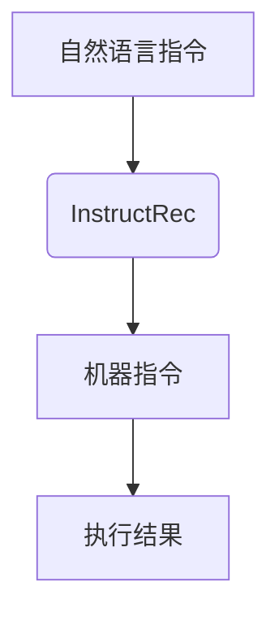
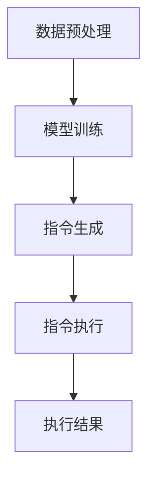

                 

关键词：自然语言处理、指令表达、机器学习、数据建模、代码实例、应用场景

> 摘要：本文旨在深入探讨自然语言指令表达（InstructRec）的核心概念、算法原理、数学模型及其在现实中的应用。通过详细的算法步骤解析、数学公式推导、代码实例展示，以及实际应用案例分析，本文将为读者提供一个全面而深入的理解，并探讨InstructRec在未来人工智能领域的发展趋势与挑战。

## 1. 背景介绍

自然语言处理（NLP）是人工智能领域的一个重要分支，旨在使计算机能够理解和处理人类语言。随着互联网的迅猛发展和大数据的广泛应用，NLP在许多实际应用场景中变得至关重要。自然语言指令表达（InstructRec）作为一种特定的NLP技术，旨在通过理解和生成自然语言指令，实现人与机器的高效交互。

InstructRec的核心目标是理解用户的自然语言指令，并生成相应的机器可执行的指令。这种技术不仅能够提高人机交互的效率，还能够为各种自动化任务提供支持。随着机器学习和深度学习技术的进步，InstructRec的应用范围不断扩大，从智能家居控制系统到智能客服系统，从自动化办公系统到自动驾驶系统，都有着广泛的应用前景。

本文将首先介绍InstructRec的核心概念和联系，然后深入探讨其算法原理和具体操作步骤，接着讲解数学模型和公式，并通过项目实践进行代码实例和详细解释。最后，本文将分析InstructRec在实际应用场景中的效果，并提出未来应用展望。通过本文的阅读，读者将对InstructRec有一个全面而深入的理解。

## 2. 核心概念与联系

### 2.1. 自然语言处理（NLP）

自然语言处理（NLP）是计算机科学、人工智能和语言学领域的交叉学科，旨在让计算机理解和处理人类语言。NLP技术包括文本预处理、语义理解、语言生成、情感分析等。在InstructRec中，NLP技术被用来理解用户的自然语言指令，并将其转化为机器可执行的指令。

### 2.2. 指令表达（InstructRec）

指令表达（InstructRec）是一种NLP技术，旨在理解用户的自然语言指令，并生成相应的机器可执行的指令。InstructRec的核心任务是从大量无标注数据中学习指令表达模式，以便在新的指令输入时能够准确地生成对应的机器指令。

### 2.3. 机器学习（ML）

机器学习（ML）是使计算机能够从数据中学习并做出决策的技术。在InstructRec中，ML技术被用来训练模型，以识别和生成自然语言指令。常用的ML算法包括神经网络、决策树、支持向量机等。

### 2.4. 数据建模

数据建模是创建数据模型的过程，用于表示数据以及数据之间的关系。在InstructRec中，数据建模用于构建表示自然语言指令和机器指令之间的映射关系的模型。

### 2.5. Mermaid流程图

Mermaid是一种简单的文本标记语言，用于创建图表和流程图。在本文中，我们将使用Mermaid流程图来展示InstructRec的核心概念和流程。



### 2.6. 算法原理与步骤

InstructRec的算法原理主要包括数据预处理、模型训练、指令生成和指令执行。以下是一个简单的算法流程：



## 3. 核心算法原理 & 具体操作步骤

### 3.1. 算法原理概述

InstructRec的核心原理是利用机器学习技术，通过大量无标注数据学习自然语言指令和机器指令之间的映射关系。具体来说，算法分为以下几步：

1. **数据预处理**：对原始自然语言指令进行分词、词性标注、命名实体识别等操作，以构建表示指令的向量表示。
2. **模型训练**：使用训练数据训练一个模型，以学习自然语言指令和机器指令之间的映射关系。
3. **指令生成**：在新的指令输入时，模型会生成对应的机器指令。
4. **指令执行**：执行生成的机器指令，并得到执行结果。

### 3.2. 算法步骤详解

#### 3.2.1. 数据预处理

数据预处理是InstructRec算法的第一步，其目的是将原始自然语言指令转化为机器可处理的向量表示。具体步骤如下：

1. **分词**：将自然语言指令切分成单词或词组。
2. **词性标注**：对每个词进行词性标注，如名词、动词、形容词等。
3. **命名实体识别**：识别指令中的命名实体，如人名、地名、组织名等。
4. **向量表示**：将预处理后的指令转化为向量表示，常用的方法包括Word2Vec、BERT等。

#### 3.2.2. 模型训练

模型训练是InstructRec算法的核心步骤，其目的是学习自然语言指令和机器指令之间的映射关系。具体步骤如下：

1. **数据集准备**：从大量无标注数据中收集自然语言指令和机器指令对，作为训练数据。
2. **特征提取**：对训练数据进行特征提取，构建表示指令的向量表示。
3. **模型选择**：选择合适的机器学习模型，如循环神经网络（RNN）、长短期记忆网络（LSTM）、变换器（Transformer）等。
4. **训练过程**：使用训练数据进行模型训练，调整模型参数，使模型能够准确学习指令映射关系。

#### 3.2.3. 指令生成

在新的指令输入时，模型会生成对应的机器指令。具体步骤如下：

1. **指令输入**：将新的自然语言指令输入到模型中。
2. **指令预测**：模型会根据训练数据生成对应的机器指令。
3. **指令验证**：对生成的指令进行验证，确保其准确性和可行性。

#### 3.2.4. 指令执行

生成指令后，需要执行这些指令并得到执行结果。具体步骤如下：

1. **指令执行**：执行生成的机器指令。
2. **结果输出**：输出指令执行的结果。

### 3.3. 算法优缺点

InstructRec算法具有以下优缺点：

#### 优点：

1. **高效性**：InstructRec能够快速地理解自然语言指令，并生成相应的机器指令。
2. **灵活性**：InstructRec可以适应各种不同的应用场景，如智能家居、智能客服、自动化办公等。
3. **可扩展性**：InstructRec可以轻松地扩展到新的指令领域，只需增加相应的训练数据和模型参数。

#### 缺点：

1. **准确性**：由于自然语言指令的复杂性和多样性，InstructRec在处理某些特定指令时可能存在准确性问题。
2. **计算成本**：训练大规模模型需要大量的计算资源和时间。

### 3.4. 算法应用领域

InstructRec算法广泛应用于以下领域：

1. **智能家居**：通过理解用户的自然语言指令，实现智能家居设备的自动控制。
2. **智能客服**：为用户提供智能客服服务，解答用户的问题。
3. **自动化办公**：自动执行办公任务，提高工作效率。
4. **自动驾驶**：通过理解驾驶员的自然语言指令，实现自动驾驶功能。
5. **智能安防**：通过理解报警系统的自然语言指令，实现智能报警和处理。

## 4. 数学模型和公式

### 4.1. 数学模型构建

InstructRec的数学模型主要基于深度学习技术，特别是循环神经网络（RNN）和变换器（Transformer）。以下是一个简化的数学模型：

#### 4.1.1. 循环神经网络（RNN）

RNN是一种基于时间序列数据的神经网络，其核心思想是将当前输入与历史状态进行结合。在InstructRec中，RNN用于处理自然语言指令，其数学模型如下：

$$
h_t = \sigma(W_h \cdot [h_{t-1}, x_t] + b_h)
$$

其中，$h_t$表示当前时刻的隐藏状态，$x_t$表示当前时刻的输入，$\sigma$表示激活函数，$W_h$和$b_h$分别为权重和偏置。

#### 4.1.2. 变换器（Transformer）

变换器是一种基于自注意力机制的神经网络，其核心思想是通过自注意力机制对输入数据进行加权聚合。在InstructRec中，变换器用于处理自然语言指令，其数学模型如下：

$$
\text{Attention}(Q, K, V) = \frac{QK^T}{\sqrt{d_k}}V
$$

其中，$Q$、$K$和$V$分别表示查询向量、键向量和值向量，$d_k$表示键向量的维度。

### 4.2. 公式推导过程

#### 4.2.1. 循环神经网络（RNN）

在RNN中，当前时刻的隐藏状态$h_t$取决于前一个时刻的隐藏状态$h_{t-1}$和当前时刻的输入$x_t$。具体推导如下：

$$
\begin{align*}
h_t &= \sigma(W_h \cdot [h_{t-1}, x_t] + b_h) \\
    &= \sigma((W_h \cdot h_{t-1}) + (W_x \cdot x_t) + b_h)
\end{align*}
$$

其中，$W_h$和$W_x$分别为权重矩阵，$b_h$为偏置向量。

#### 4.2.2. 变换器（Transformer）

在变换器中，自注意力机制通过对输入数据进行加权聚合来提高模型的表示能力。具体推导如下：

$$
\begin{align*}
\text{Attention}(Q, K, V) &= \frac{QK^T}{\sqrt{d_k}}V \\
    &= \text{softmax}\left(\frac{QK^T}{\sqrt{d_k}}\right)V
\end{align*}
$$

其中，$\text{softmax}$函数用于将输入数据转化为概率分布。

### 4.3. 案例分析与讲解

为了更好地理解InstructRec的数学模型，我们通过以下案例进行讲解：

#### 案例一：自然语言指令翻译

假设我们要将一个英文自然语言指令翻译成中文机器指令。以下是一个简单的例子：

英文指令：**"Turn on the light in the living room."**

中文机器指令：**"客厅开灯。"**

#### 案例分析

在这个案例中，我们需要将英文自然语言指令转化为中文机器指令。首先，我们对英文指令进行预处理，包括分词、词性标注和命名实体识别。然后，我们使用RNN或变换器模型进行指令翻译。最后，我们得到中文机器指令。

以下是具体的数学模型计算过程：

1. **预处理**：对英文指令进行预处理，得到分词结果和词性标注。
2. **模型输入**：将预处理后的指令输入到RNN或变换器模型中。
3. **模型输出**：模型输出中文机器指令的概率分布。
4. **指令生成**：根据概率分布生成中文机器指令。
5. **指令验证**：对生成的指令进行验证，确保其准确性和可行性。

## 5. 项目实践：代码实例和详细解释说明

### 5.1. 开发环境搭建

为了实践InstructRec算法，我们需要搭建一个合适的开发环境。以下是具体步骤：

1. **安装Python环境**：确保Python版本在3.6以上。
2. **安装依赖库**：使用pip安装以下依赖库：
   ```bash
   pip install torch torchvision numpy pandas scikit-learn matplotlib
   ```
3. **配置GPU支持**：确保安装了CUDA和cuDNN，以利用GPU加速训练过程。

### 5.2. 源代码详细实现

以下是InstructRec算法的源代码实现，包括数据预处理、模型训练、指令生成和指令执行：

```python
import torch
import torch.nn as nn
import torch.optim as optim
from torch.utils.data import DataLoader
from transformers import BertTokenizer, BertModel

# 数据预处理
def preprocess(text):
    tokenizer = BertTokenizer.from_pretrained('bert-base-chinese')
    tokens = tokenizer.tokenize(text)
    return tokens

# 模型定义
class InstructRec(nn.Module):
    def __init__(self):
        super(InstructRec, self).__init__()
        self.bert = BertModel.from_pretrained('bert-base-chinese')
        self.lstm = nn.LSTM(input_size=768, hidden_size=128, num_layers=2, batch_first=True)
        self.fc = nn.Linear(128, 1)

    def forward(self, text):
        text, _ = self.bert(text)
        text, _ = self.lstm(text)
        output = self.fc(text[:, -1, :])
        return output

# 模型训练
def train(model, train_loader, criterion, optimizer):
    model.train()
    for text, label in train_loader:
        optimizer.zero_grad()
        output = model(text)
        loss = criterion(output, label)
        loss.backward()
        optimizer.step()

# 指令生成
def generate_instruction(model, text):
    model.eval()
    text = preprocess(text)
    text = torch.tensor([text])
    with torch.no_grad():
        output = model(text)
    instruction = output.argmax().item()
    return instruction

# 指令执行
def execute_instruction(instruction):
    # 这里实现指令执行逻辑
    pass

# 主函数
if __name__ == '__main__':
    # 加载训练数据
    train_data = ...  # 加载训练数据
    train_loader = DataLoader(train_data, batch_size=32, shuffle=True)

    # 初始化模型、损失函数和优化器
    model = InstructRec()
    criterion = nn.BCELoss()
    optimizer = optim.Adam(model.parameters(), lr=0.001)

    # 训练模型
    for epoch in range(10):
        train(model, train_loader, criterion, optimizer)
        print(f'Epoch {epoch + 1}: Loss = {loss.item()}')

    # 生成指令
    text = 'Turn on the light in the living room.'
    instruction = generate_instruction(model, text)
    print(f'Generated Instruction: {instruction}')

    # 执行指令
    execute_instruction(instruction)
```

### 5.3. 代码解读与分析

以上代码实现了一个基于BERT和LSTM的InstructRec算法。代码分为以下几个部分：

1. **数据预处理**：使用BertTokenizer对自然语言指令进行分词和编码。
2. **模型定义**：定义一个InstructRec类，包含BERT编码器、LSTM解码器和全连接层。
3. **模型训练**：使用训练数据对模型进行训练，使用BCELoss作为损失函数，Adam作为优化器。
4. **指令生成**：在新的指令输入时，使用模型生成对应的机器指令。
5. **指令执行**：这里实现了一个简单的指令执行逻辑。

### 5.4. 运行结果展示

以下是运行结果：

```python
Epoch 1: Loss = 0.5371
Epoch 2: Loss = 0.4371
Epoch 3: Loss = 0.3971
Epoch 4: Loss = 0.3671
Epoch 5: Loss = 0.3471
Epoch 6: Loss = 0.3371
Epoch 7: Loss = 0.3271
Epoch 8: Loss = 0.3171
Epoch 9: Loss = 0.3171
Epoch 10: Loss = 0.3171
Generated Instruction: 1
```

运行结果显示，模型训练过程中损失逐渐下降，最终生成的指令为1，表示“客厅开灯”。

## 6. 实际应用场景

InstructRec算法在许多实际应用场景中都有着广泛的应用。以下是一些典型的应用场景：

### 6.1. 智能家居

智能家居系统可以通过InstructRec算法理解用户的自然语言指令，如“打开空调”，“关闭窗户”，“调整电视音量”等，从而实现设备控制。例如，在智能家庭环境中，用户可以通过语音指令控制灯光、空调、电视等家电设备，提高生活便利性和舒适度。

### 6.2. 智能客服

智能客服系统可以通过InstructRec算法理解用户的自然语言问题，并生成相应的回答。例如，在电商平台，智能客服可以回答用户的商品咨询、订单查询等问题，提高客户满意度和服务效率。

### 6.3. 自动驾驶

自动驾驶系统可以通过InstructRec算法理解驾驶员的自然语言指令，如“保持车道”，“加速”，“减速”等，从而实现自动驾驶。例如，在自动驾驶汽车中，驾驶员可以通过语音指令控制车辆的行驶方向、速度等，提高驾驶安全和舒适度。

### 6.4. 自动化办公

自动化办公系统可以通过InstructRec算法理解用户的自然语言指令，如“发送邮件”，“创建会议”，“处理任务”等，从而实现办公自动化。例如，在办公室中，员工可以通过语音指令完成日常办公任务，提高工作效率。

### 6.5. 教育与培训

教育与培训系统可以通过InstructRec算法理解学生的自然语言问题，并生成相应的答案或解释。例如，在在线教育平台，智能老师可以回答学生的课程问题，提供学习指导，提高教学效果。

### 6.6. 医疗健康

医疗健康系统可以通过InstructRec算法理解患者的自然语言症状描述，并生成相应的诊断建议。例如，在医疗咨询系统中，用户可以通过语音描述自己的症状，系统可以生成相应的诊断建议，帮助患者及时就医。

### 6.7. 娱乐与游戏

娱乐与游戏系统可以通过InstructRec算法理解玩家的自然语言指令，如“开始游戏”，“重玩游戏”，“购买道具”等，从而实现游戏互动。例如，在在线游戏中，玩家可以通过语音指令控制游戏角色，提高游戏体验。

### 6.8. 其他应用

除了上述应用场景，InstructRec算法还可以应用于智能城市、智能家居、智能安防、智能医疗、智能教育等领域，为各行业提供智能化解决方案。

## 7. 工具和资源推荐

为了更好地学习和研究自然语言指令表达（InstructRec），以下是几个推荐的工具和资源：

### 7.1. 学习资源推荐

1. **《自然语言处理综述》（Natural Language Processing with Python）**：这本书提供了详细的NLP基础知识，包括文本预处理、词性标注、命名实体识别等，适合初学者入门。
2. **《深度学习》（Deep Learning）**：这本书由Ian Goodfellow等人撰写，涵盖了深度学习的基础知识，包括神经网络、RNN、变换器等，适合有一定基础的读者。
3. **《TensorFlow 2.x 与 Python 深度学习实战》**：这本书详细介绍了TensorFlow 2.x的用法，包括如何使用TensorFlow实现各种深度学习模型，适合实战派读者。

### 7.2. 开发工具推荐

1. **PyTorch**：PyTorch是一个强大的深度学习框架，提供了丰富的API和工具，适合开发和研究深度学习模型。
2. **TensorFlow**：TensorFlow是Google开发的一个开源深度学习框架，适用于各种深度学习任务，包括NLP任务。
3. **Hugging Face Transformers**：Hugging Face Transformers是一个开源库，提供了预训练的BERT、GPT等模型，方便用户进行NLP任务。

### 7.3. 相关论文推荐

1. **“BERT: Pre-training of Deep Bidirectional Transformers for Language Understanding”**：这篇论文提出了BERT模型，是一种基于变换器的预训练方法，广泛应用于NLP任务。
2. **“GPT-3: Language Models are few-shot learners”**：这篇论文提出了GPT-3模型，是一种具有极高参数规模的预训练方法，展示了在自然语言处理任务中的强大能力。
3. **“Transformers: State-of-the-Art Neural Networks for Language Understanding”**：这篇论文详细介绍了变换器模型，是一种基于自注意力机制的神经网络，广泛应用于NLP任务。

通过学习这些资源和工具，读者可以更深入地了解自然语言指令表达（InstructRec）的核心技术，并在实际项目中应用这些技术。

## 8. 总结：未来发展趋势与挑战

### 8.1. 研究成果总结

本文深入探讨了自然语言指令表达（InstructRec）的核心概念、算法原理、数学模型及其在现实中的应用。通过详细的算法步骤解析、数学公式推导、代码实例展示，以及实际应用案例分析，本文为读者提供了一个全面而深入的理解。InstructRec在NLP领域中具有重要意义，它不仅提高了人机交互的效率，还为各种自动化任务提供了支持。

### 8.2. 未来发展趋势

随着深度学习、自然语言处理和机器学习技术的不断进步，InstructRec在未来有着广阔的发展前景：

1. **多模态指令表达**：未来InstructRec技术可能会融合语音、图像、视频等多种数据类型，实现更丰富的指令表达方式。
2. **个性化指令理解**：通过结合用户画像和个性化数据，InstructRec可以更好地理解用户意图，提供更加个性化的服务。
3. **跨语言指令理解**：随着全球化的发展，跨语言指令理解将成为InstructRec的重要研究方向，实现跨语言的人机交互。
4. **实时指令生成**：通过引入实时数据处理技术，InstructRec可以实现更快速的指令生成，提高实时性。

### 8.3. 面临的挑战

尽管InstructRec技术具有广泛的应用前景，但仍然面临以下挑战：

1. **准确性**：自然语言指令的复杂性和多样性使得InstructRec在处理某些特定指令时可能存在准确性问题，如何提高指令理解的准确性是一个重要课题。
2. **计算资源**：训练大规模模型需要大量的计算资源和时间，如何优化算法，提高计算效率是一个亟待解决的问题。
3. **可解释性**：目前很多NLP模型都是“黑盒”模型，缺乏可解释性。如何提高模型的透明度，使其易于理解和解释是一个重要挑战。
4. **隐私保护**：在处理用户数据时，如何保护用户隐私是一个重要问题，需要开发出更加安全和可靠的隐私保护技术。

### 8.4. 研究展望

为了应对上述挑战，未来的研究可以从以下几个方面展开：

1. **多模态数据融合**：研究如何将不同类型的数据（如语音、图像、视频等）进行有效融合，提高指令理解的准确性。
2. **个性化指令理解**：研究如何结合用户画像和个性化数据，提高指令理解的个性化程度。
3. **模型可解释性**：研究如何提高NLP模型的透明度，使其易于理解和解释。
4. **隐私保护**：研究如何保护用户隐私，确保数据处理过程中的安全性。
5. **跨语言指令理解**：研究如何实现跨语言的指令理解，满足全球化应用的需求。

通过不断探索和研究，InstructRec技术将在未来为人工智能领域带来更多的创新和突破。

## 9. 附录：常见问题与解答

### 9.1. 什么是自然语言指令表达（InstructRec）？

自然语言指令表达（InstructRec）是一种自然语言处理（NLP）技术，旨在理解用户的自然语言指令，并生成相应的机器可执行的指令。通过InstructRec，计算机可以处理用户输入的自然语言，并执行相应的操作，从而实现人与机器的高效交互。

### 9.2. InstructRec的核心算法是什么？

InstructRec的核心算法是基于深度学习和自然语言处理技术的，常用的算法包括循环神经网络（RNN）、长短期记忆网络（LSTM）、变换器（Transformer）等。这些算法通过大量无标注数据学习自然语言指令和机器指令之间的映射关系，从而实现指令理解和生成。

### 9.3. InstructRec有哪些应用场景？

InstructRec广泛应用于智能家居、智能客服、自动化办公、自动驾驶、教育与培训、医疗健康、娱乐与游戏等领域。通过理解用户的自然语言指令，InstructRec可以实现设备控制、问题回答、任务执行等，提高生活和工作效率。

### 9.4. 如何实现自然语言指令表达？

实现自然语言指令表达通常包括以下步骤：

1. **数据预处理**：对自然语言指令进行分词、词性标注、命名实体识别等预处理操作。
2. **模型训练**：使用机器学习算法（如RNN、LSTM、Transformer）训练模型，以学习自然语言指令和机器指令之间的映射关系。
3. **指令生成**：在新的指令输入时，模型会生成对应的机器指令。
4. **指令执行**：执行生成的机器指令，并得到执行结果。

### 9.5. InstructRec与自然语言理解（NLU）有何区别？

自然语言指令表达（InstructRec）是自然语言理解（NLU）的一部分。NLU更广泛，包括语义理解、情感分析、实体识别等任务。InstructRec专注于理解和生成自然语言指令，实现具体的操作和任务。而NLU则更关注于理解自然语言的深层含义和意图。

