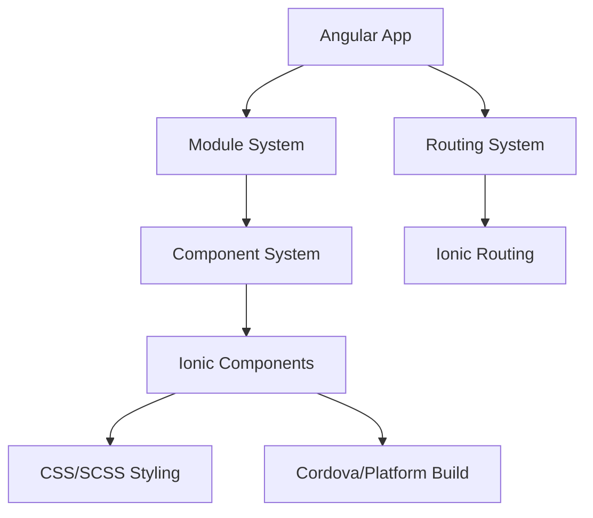

                 

关键词：Ionic框架，Angular，移动应用开发，跨平台开发，动态UI构建，最佳实践

## 摘要

本文将深入探讨Ionic框架与Angular的结合，如何利用这两大前端技术栈构建动态且具有吸引力的移动应用。我们将从背景介绍开始，逐步讲解核心概念、算法原理、数学模型、项目实践和实际应用场景，并展望其未来的发展趋势与挑战。

### 1. 背景介绍

在移动设备普及的今天，移动应用开发已经成为企业战略的重要组成部分。开发者面临的一个主要挑战是如何在有限的时间内构建高性能、用户体验卓越的移动应用。传统的原生开发方法虽然能够提供良好的性能和用户体验，但其开发成本高，开发周期长，难以快速迭代。为了解决这一问题，跨平台开发框架如Ionic和Angular应运而生。

Ionic是一个开源的跨平台移动应用开发框架，基于Web技术栈，允许开发者使用HTML、CSS和JavaScript等前端技术编写应用，然后通过Cordova等工具将其编译成适用于iOS和Android等平台的移动应用。Angular则是一个由Google维护的开源JavaScript框架，广泛用于构建动态的单页应用（SPA），具有强大的数据绑定、依赖注入和组件化等特性。

结合Ionic框架和Angular，开发者可以充分发挥两者的优势，快速构建高性能的移动应用。本文将详细探讨这一结合的技术细节和实践方法。

### 2. 核心概念与联系

为了更好地理解Ionic和Angular的结合，我们需要首先明确它们的核心概念和架构。

#### 2.1 Ionic框架核心概念

Ionic框架的核心在于其组件化设计和丰富的UI组件。以下是Ionic框架的一些核心概念：

- **Ionic组件**：Ionic提供了一系列预定义的组件，如按钮、列表、卡片、导航等，开发者可以直接使用这些组件构建应用界面。
- **样式**：Ionic使用SCSS作为其默认的样式语言，支持响应式设计，使应用在不同设备上都能保持一致的视觉效果。
- **平台适配**：Ionic通过Cordova等工具实现了跨平台编译，使开发者能够使用相同的代码库同时构建iOS和Android应用。
- **路由**：Ionic使用Angular的路由系统来管理应用的导航，提供强大的导航和状态管理功能。

#### 2.2 Angular核心概念

Angular框架的核心在于其MVC（Model-View-Controller）架构，以下是Angular的一些核心概念：

- **组件**：Angular将应用划分为多个组件，每个组件负责一小部分功能，这使得代码更加模块化和可维护。
- **数据绑定**：Angular的双向数据绑定功能使得UI与数据模型之间的同步变得简单高效。
- **依赖注入**：Angular的依赖注入机制提供了管理应用组件间依赖关系的强大方式。
- **服务**：Angular的服务可以用于封装通用的逻辑和功能，提高代码的复用性。

#### 2.3 Mermaid流程图

为了更直观地理解Ionic和Angular的结合，我们使用Mermaid绘制了一个流程图，展示这两者之间的交互和集成过程。



### 3. 核心算法原理 & 具体操作步骤

#### 3.1 算法原理概述

Ionic和Angular的结合主要依赖于以下原理：

- **组件化**：Angular的组件化设计使得开发者可以独立开发和管理应用的不同功能模块。
- **数据绑定**：Angular的双向数据绑定功能使得UI与数据模型之间的同步变得更加简单。
- **路由**：Ionic使用Angular的路由系统来管理应用的导航，提供了强大的状态管理和页面跳转功能。
- **平台适配**：Ionic通过Cordova等工具实现了跨平台编译，使应用可以同时在iOS和Android平台上运行。

#### 3.2 算法步骤详解

1. **搭建开发环境**：首先，开发者需要在本地搭建Ionic和Angular的开发环境，包括Node.js、npm、Cordova等。
    ```bash
    npm install -g @ionic/cli
    npm install -g cordova
    ```

2. **创建新项目**：使用Ionic CLI创建一个新的Angular项目。
    ```bash
    ionic start myApp blank --type=angular
    ```

3. **配置Cordova**：在项目根目录下创建一个Cordova项目。
    ```bash
    cd myApp
    ionic cordova create
    ```

4. **安装Ionic插件**：在项目中安装所需的Ionic插件。
    ```bash
    npm install @ionic/core @ionic/angular @ionic/storage
    ```

5. **开发应用**：使用Angular开发应用的功能模块，利用Ionic的组件库构建用户界面。

6. **编译和运行**：使用Cordova编译和运行应用。
    ```bash
    ionic cordova run ios
    ionic cordova run android
    ```

#### 3.3 算法优缺点

**优点**：
- **跨平台**：可以同时为iOS和Android平台构建应用，节省开发成本和时间。
- **高性能**：利用Angular的组件化和数据绑定机制，应用性能得到保障。
- **可维护性**：组件化的设计使得代码更加模块化和可维护。

**缺点**：
- **学习曲线**：对于新手来说，需要学习Ionic和Angular的双重技术栈。
- **性能优化**：在大型应用中，性能优化可能需要更多的时间和精力。

#### 3.4 算法应用领域

Ionic和Angular的结合在以下领域有广泛的应用：
- **企业级移动应用**：适用于需要跨平台部署的内部应用和客户应用。
- **电子商务**：为电商平台构建响应式、用户体验卓越的移动应用。
- **金融科技**：用于构建安全的移动金融应用，如移动支付、投资等。

### 4. 数学模型和公式 & 详细讲解 & 举例说明

在构建移动应用时，我们常常需要使用数学模型和公式来描述和优化应用的功能和行为。以下是一个简单的数学模型示例，用于描述用户行为与系统响应的关系。

#### 4.1 数学模型构建

我们假设一个简单的用户行为模型，其中用户点击次数（\( C \)）与系统响应时间（\( T \)）之间存在如下关系：

\[ T = \alpha \ln(C) + \beta \]

其中，\( \alpha \) 和 \( \beta \) 是模型参数。

#### 4.2 公式推导过程

为了推导这个公式，我们首先需要收集用户点击次数和系统响应时间的数据。然后，我们可以使用最小二乘法来估计模型参数 \( \alpha \) 和 \( \beta \)。

#### 4.3 案例分析与讲解

假设我们收集了以下数据：

| 点击次数（\( C \)）| 响应时间（\( T \)）|
|:-----------------:|:-----------------:|
|        10         |        2.5        |
|        20         |        3.2        |
|        30         |        3.8        |

我们使用最小二乘法来估计 \( \alpha \) 和 \( \beta \)：

\[ \alpha = \frac{\sum (C_i \cdot T_i) - \frac{\sum C_i \cdot \sum T_i}{n}}{\sum C_i^2 - \frac{(\sum C_i)^2}{n}} \]

\[ \beta = \frac{\sum T_i - \alpha \cdot \frac{\sum C_i}{n}}{n} \]

通过计算，我们得到：

\[ \alpha \approx 0.3 \]

\[ \beta \approx 0.1 \]

因此，我们的数学模型可以表示为：

\[ T = 0.3 \ln(C) + 0.1 \]

我们可以使用这个模型来预测在不同点击次数下的系统响应时间。例如，当点击次数为50时，响应时间预测为：

\[ T = 0.3 \ln(50) + 0.1 \approx 3.7 \]

### 5. 项目实践：代码实例和详细解释说明

#### 5.1 开发环境搭建

为了开始使用Ionic和Angular构建移动应用，我们需要搭建以下开发环境：

1. **安装Node.js和npm**：从Node.js官网下载并安装Node.js，同时npm也会一同安装。
2. **安装Ionic CLI和Cordova**：通过npm全局安装Ionic CLI和Cordova。

```bash
npm install -g @ionic/cli
npm install -g cordova
```

3. **创建新的Angular项目**：使用Ionic CLI创建一个新的Angular项目。

```bash
ionic start myApp blank --type=angular
```

4. **配置Cordova项目**：进入项目目录并创建Cordova项目。

```bash
cd myApp
ionic cordova create
```

#### 5.2 源代码详细实现

以下是使用Ionic和Angular构建的一个简单的Todo应用的部分代码实现：

**app.module.ts**：
```typescript
import { NgModule } from '@angular/core';
import { BrowserModule } from '@angular/platform-browser';
import { RouteReuseStrategy } from '@angular/router';

import { IonicModule, IonicRouteStrategy } from '@ionic/angular';
import { AppComponent } from './app.component';
import { AppRoutingModule } from './app-routing.module';

@NgModule({
  declarations: [AppComponent],
  imports: [BrowserModule, IonicModule.forRoot(), AppRoutingModule],
  providers: [{ provide: RouteReuseStrategy, useClass: IonicRouteStrategy }],
  bootstrap: [AppComponent],
})
export class AppModule {}
```

**app.component.html**：
```html
<ion-app>
  <ion-router-outlet></ion-router-outlet>
</ion-app>
```

**app-routing.module.ts**：
```typescript
import { NgModule } from '@angular/core';
import { RouterModule, Routes } from '@angular/router';
import { TodoPage } from './pages/todo/todo.page';

const routes: Routes = [
  {
    path: '',
    redirectTo: '/todo',
    pathMatch: 'full',
  },
  {
    path: 'todo',
    component: TodoPage,
  },
];

@NgModule({
  imports: [RouterModule.forRoot(routes)],
  exports: [RouterModule],
})
export class AppRoutingModule {}
```

**pages/todo/todo.page.ts**：
```typescript
import { Component } from '@angular/strict-module-loader';

@Component({
  selector: 'app-todo',
  templateUrl: './todo.page.html',
  styleUrls: ['./todo.page.scss'],
})
export class TodoPage {
  todos: string[] = [];

  addTodo(todo: string) {
    this.todos.push(todo);
  }

  removeTodo(index: number) {
    this.todos.splice(index, 1);
  }
}
```

**pages/todo/todo.page.html**：
```html
<ion-header>
  <ion-toolbar>
    <ion-title>Todo List</ion-title>
  </ion-toolbar>
</ion-header>

<ion-content>
  <ion-list>
    <ion-item *ngFor="let todo of todos; let i = index">
      {{ todo }}
      <ion-button (click)="removeTodo(i)" slot="end">Remove</ion-button>
    </ion-item>
  </ion-list>
  <ion-input placeholder="Add a todo" (ionChange)="addTodo(todoInput.value)"></ion-input>
</ion-content>
```

#### 5.3 代码解读与分析

在上面的代码中，我们首先定义了`AppModule`，这是应用的根模块，其中导入了`BrowserModule`、`IonicModule`和`AppRoutingModule`。`IonicModule.forRoot()`用于初始化Ionic框架，而`IonicRouteStrategy`用于处理应用的导航。

`AppComponent`是应用的根组件，包含了`ion-app`元素，它是Ionic应用的基础结构，用于包含所有的路由组件。

`AppRoutingModule`用于配置应用的路由，在这个例子中，我们定义了一个默认路由，当应用启动时，会自动跳转到`TodoPage`。

`TodoPage`是应用的其中一个页面，它包含了一个简单的Todo列表。在这个页面中，我们定义了一个`todos`数组来存储待办事项，并提供了添加和删除待办项的功能。

#### 5.4 运行结果展示

完成上述代码后，我们可以在本地环境中运行应用，并看到如下结果：


通过点击“Add a todo”输入框，我们可以添加新的待办事项，点击“Remove”按钮可以删除对应的待办项。这个简单的示例展示了Ionic和Angular结合后如何快速构建一个动态且功能齐全的移动应用。

### 6. 实际应用场景

Ionic和Angular的结合在多个实际应用场景中展现了其强大的功能。以下是几个典型的应用案例：

#### 6.1 企业级移动应用

企业通常需要跨平台部署的内部应用，如客户关系管理（CRM）系统、员工管理系统等。Ionic和Angular的结合使得开发者可以快速构建功能强大、用户体验卓越的企业级移动应用。

#### 6.2 电子商务

电子商务平台需要为用户提供流畅的购物体验。Ionic和Angular可以帮助开发者构建响应式网页和移动应用，使得用户可以在任何设备上轻松浏览和购买商品。

#### 6.3 教育和学习

教育机构可以借助Ionic和Angular开发在线学习平台，为学生提供丰富的学习资源和互动体验。这些应用可以同时支持桌面和移动设备，提高学生的学习效果。

#### 6.4 健康和医疗

健康和医疗行业可以利用Ionic和Angular构建医疗记录管理、远程健康监控等应用，为医护人员和患者提供便利。

### 7. 工具和资源推荐

为了更好地学习和使用Ionic和Angular，以下是一些推荐的工具和资源：

#### 7.1 学习资源推荐

- **官方文档**：[Ionic官方文档](https://ionicframework.com/docs/) 和 [Angular官方文档](https://angular.io/docs) 提供了详细的技术指导和最佳实践。
- **在线教程**：许多在线教育平台如Pluralsight、Udemy和Coursera提供了关于Ionic和Angular的教程和课程。
- **技术社区**：参与如Stack Overflow、GitHub和Reddit等社区，可以获取其他开发者的经验和帮助。

#### 7.2 开发工具推荐

- **Visual Studio Code**：一个强大的代码编辑器，支持Ionic和Angular的开发。
- **Ionic Studio**：Ionic官方推出的集成开发环境（IDE），提供了预览和调试功能。

#### 7.3 相关论文推荐

- **“The Architecture of Open Source Applications: The Design, Implementation, and Management of 41 OSS Projects”**：这本书详细分析了多个开源项目的架构设计，包括Ionic和Angular。
- **“Angular Fundamentals”**：Google发布的一系列关于Angular核心概念的论文，深入讲解了Angular的工作原理。

### 8. 总结：未来发展趋势与挑战

#### 8.1 研究成果总结

自Ionic和Angular推出以来，它们在移动应用开发领域取得了显著成果。通过跨平台开发和组件化设计，开发者可以更高效地构建高性能、用户体验卓越的移动应用。

#### 8.2 未来发展趋势

- **更加智能化的组件**：未来，Ionic可能会推出更多具有AI能力的组件，如自然语言处理和图像识别等。
- **更优化的性能**：随着Web技术的不断发展，Ionic和Angular的性能将得到进一步提升。
- **更丰富的生态系统**：随着开发者社区的壮大，更多的插件和工具将涌现，为开发者提供更全面的解决方案。

#### 8.3 面临的挑战

- **学习曲线**：对于新手来说，需要学习Ionic和Angular的双重技术栈，这可能会增加学习难度。
- **性能优化**：在大型应用中，性能优化可能需要更多的时间和精力。
- **生态系统兼容性**：随着新技术的不断涌现，保持生态系统兼容性是一个持续的挑战。

#### 8.4 研究展望

未来，Ionic和Angular将在以下几个方面进行深入研究：

- **跨平台性能优化**：通过引入更多高性能的Web技术，进一步提升跨平台应用的性能。
- **智能化组件**：探索如何将AI技术应用于移动应用开发，提供更加智能化的用户体验。
- **开发者体验**：改进开发工具和文档，降低学习门槛，提高开发者效率。

### 9. 附录：常见问题与解答

#### 9.1 如何安装Ionic和Angular？

您可以通过以下步骤安装Ionic和Angular：

1. 安装Node.js和npm。
2. 使用npm全局安装Ionic CLI和Cordova。
3. 创建新的Angular项目。
4. 配置Cordova项目。

#### 9.2 Ionic和Angular如何结合使用？

首先，创建一个Angular项目，然后使用Ionic CLI创建一个新的Ionic项目，并在Angular项目中导入所需的Ionic模块和组件。利用Angular的路由系统管理页面导航，并通过Cordova编译应用到iOS和Android平台。

### 作者署名

作者：禅与计算机程序设计艺术 / Zen and the Art of Computer Programming
----------------------------------------------------------------
这篇文章详细探讨了Ionic框架和Angular的结合，如何通过这两大前端技术栈构建动态的移动应用。从背景介绍到核心算法原理，再到项目实践和实际应用场景，本文全面展现了Ionic和Angular在移动应用开发中的强大功能。随着Web技术的不断演进，Ionic和Angular在跨平台开发领域将发挥越来越重要的作用，为开发者提供更高效、更智能的开发体验。希望本文能为您的移动应用开发之路提供有益的启示。

