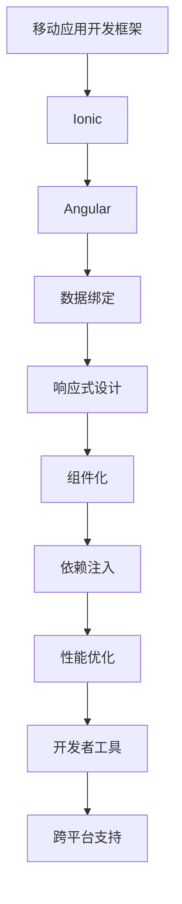

                 

关键词：Ionic 框架，Angular，移动应用开发，跨平台，前端框架，响应式设计，性能优化，开发者工具

> 摘要：本文旨在探讨 Ionic 框架与 Angular 的结合，深入剖析它们如何助力开发者构建动态且高效的移动应用。我们将从背景介绍、核心概念与联系、算法原理与操作步骤、数学模型与公式推导、项目实践、实际应用场景、未来展望以及工具和资源推荐等多个方面进行全面解析。

## 1. 背景介绍

随着移动设备的普及，移动应用开发成为当今 IT 领域的热点。开发者面临着如何在有限的屏幕空间和资源条件下，构建高性能、用户体验优秀的移动应用。为了解决这一挑战，许多前端框架应运而生。Ionic 和 Angular 是其中的佼佼者，它们凭借各自的优点，为开发者提供了强大的开发工具和丰富的生态系统。

### 1.1 Ionic 框架

Ionic 是一个开源的前端框架，专为移动应用开发设计。它基于 Angular、React、Vue 等流行框架，提供了丰富的 UI 组件、样式库和工具链，使得开发者可以快速构建漂亮的移动应用界面。Ionic 支持跨平台开发，无论是 iOS、Android 还是 Web，都可以轻松实现。

### 1.2 Angular

Angular 是一个由 Google 开发的全功能前端框架，具有强大的数据绑定、依赖注入、组件化等特性。Angular 提供了丰富的工具和库，使得开发者可以高效地构建复杂的应用程序。Angular 的优势在于它的稳定性和社区支持，这使得它成为企业级应用开发的首选。

## 2. 核心概念与联系

在探讨 Ionic 和 Angular 的结合之前，我们需要先了解它们的核心概念与联系。以下是相关的 Mermaid 流程图，用于展示它们之间的关系：



### 2.1 数据绑定

数据绑定是前端开发的重要特性，它使得开发者可以轻松地实现数据与视图的同步。Ionic 和 Angular 都提供了强大的数据绑定机制，使得开发者可以专注于业务逻辑的实现，而无需担心视图的更新。

### 2.2 响应式设计

响应式设计是指根据不同设备和屏幕尺寸，自动调整布局和样式，以提供最佳的用户体验。Ionic 和 Angular 都支持响应式设计，它们提供了丰富的布局和样式库，使得开发者可以轻松地实现跨平台的 UI 设计。

### 2.3 组件化

组件化是一种现代前端开发模式，它将应用拆分成多个可复用的组件，从而提高开发效率和代码可维护性。Ionic 和 Angular 都采用了组件化架构，使得开发者可以轻松地构建和复用组件。

### 2.4 依赖注入

依赖注入是一种面向对象的设计模式，用于简化组件之间的依赖关系。Ionic 和 Angular 都提供了强大的依赖注入机制，使得开发者可以轻松地管理应用中的依赖关系。

### 2.5 性能优化

性能优化是移动应用开发的重要环节，它决定了应用的响应速度和用户体验。Ionic 和 Angular 都提供了丰富的性能优化工具和技巧，帮助开发者构建高性能的移动应用。

### 2.6 开发者工具

开发者工具是提高开发效率的重要手段。Ionic 和 Angular 都提供了强大的开发者工具，包括调试器、构建工具、代码编辑器等，使得开发者可以更加高效地进行开发。

### 2.7 跨平台支持

跨平台支持是移动应用开发的重要需求。Ionic 和 Angular 都支持跨平台开发，开发者可以使用一套代码库同时开发 iOS、Android 和 Web 应用。

## 3. 核心算法原理 & 具体操作步骤

### 3.1 算法原理概述

在移动应用开发中，性能优化是一个核心问题。为了提高应用的性能，开发者需要掌握一系列的优化算法和技巧。以下是一些常用的性能优化算法：

1. **懒加载**：在需要时才加载资源，以减少应用的启动时间和内存占用。
2. **内存管理**：合理分配和回收内存，避免内存泄漏。
3. **渲染优化**：减少页面的渲染时间，提高用户体验。
4. **代码分割**：将代码拆分成多个块，按需加载，减少应用的初始加载时间。

### 3.2 算法步骤详解

#### 3.2.1 懒加载

懒加载是一种常见的性能优化算法，它可以有效地减少应用的启动时间和内存占用。以下是实现懒加载的步骤：

1. **资源分析**：分析应用中的资源，确定哪些资源可以延迟加载。
2. **资源替换**：将需要延迟加载的资源替换为占位符。
3. **资源加载**：当用户访问到相关资源时，动态加载实际的资源。

#### 3.2.2 内存管理

内存管理是移动应用开发的重要环节，以下是一些常用的内存管理技巧：

1. **避免内存泄漏**：避免创建不必要的对象和引用，及时释放不再使用的资源。
2. **合理分配内存**：根据应用的需求，合理分配内存，避免过度占用内存。
3. **缓存策略**：使用缓存策略，减少重复加载相同资源。

#### 3.2.3 渲染优化

渲染优化是提高应用性能的关键，以下是一些常见的渲染优化技巧：

1. **减少DOM操作**：减少DOM操作，避免频繁地更新DOM结构。
2. **使用虚拟滚动**：使用虚拟滚动技术，减少页面的渲染时间。
3. **使用Web Workers**：将渲染任务分配给Web Workers，减少主线程的负担。

#### 3.2.4 代码分割

代码分割是一种按需加载代码的技术，它可以将代码拆分成多个块，从而减少应用的初始加载时间。以下是实现代码分割的步骤：

1. **代码分析**：分析应用的代码，确定哪些代码块可以分割。
2. **构建配置**：修改构建配置，将代码块分割并按需加载。
3. **按需加载**：根据用户的需求，动态加载相应的代码块。

### 3.3 算法优缺点

每种算法都有其优缺点，以下是对上述算法的优缺点的分析：

1. **懒加载**：优点：减少应用的启动时间和内存占用；缺点：可能增加用户的等待时间。
2. **内存管理**：优点：提高应用的性能和稳定性；缺点：需要开发者有较高的内存管理能力。
3. **渲染优化**：优点：提高用户体验；缺点：可能增加开发的复杂度。
4. **代码分割**：优点：减少应用的初始加载时间；缺点：可能增加构建和部署的时间。

### 3.4 算法应用领域

这些算法在移动应用开发中具有广泛的应用领域，以下是一些常见的应用场景：

1. **电商平台**：优化图片加载、减少DOM操作，提高页面性能。
2. **社交媒体**：使用虚拟滚动和Web Workers，提高用户交互体验。
3. **游戏开发**：优化内存使用，避免内存泄漏，提高游戏的稳定性。

## 4. 数学模型和公式 & 详细讲解 & 举例说明

在移动应用开发中，数学模型和公式是优化性能的重要工具。以下是一个简单的数学模型，用于计算应用的内存占用。

### 4.1 数学模型构建

假设应用中的内存占用由以下几个部分组成：

1. **初始内存**：应用启动时占用的内存。
2. **动态内存**：应用运行时根据需求动态分配的内存。
3. **缓存内存**：应用缓存的资源占用的内存。

我们可以使用以下公式来计算总的内存占用：

\[ 内存占用 = 初始内存 + 动态内存 + 缓存内存 \]

### 4.2 公式推导过程

1. **初始内存**：应用启动时，加载资源所需的内存。
2. **动态内存**：应用运行时，根据用户操作动态分配的内存。
   \[ 动态内存 = f(用户操作次数，操作类型) \]
3. **缓存内存**：应用缓存的资源，如图片、视频等。
   \[ 缓存内存 = g(缓存策略，资源大小) \]

将这些因素结合起来，我们得到总的内存占用：

\[ 内存占用 = 初始内存 + f(用户操作次数，操作类型) + g(缓存策略，资源大小) \]

### 4.3 案例分析与讲解

以下是一个简单的案例分析：

假设一个电商平台，初始内存为 100MB，动态内存与用户操作次数成正比，缓存内存采用LRU（最近最少使用）策略。

1. **初始内存**：100MB
2. **动态内存**：每次用户操作增加 1MB 内存，例如用户浏览了10个商品，动态内存为 10MB。
3. **缓存内存**：缓存策略为LRU，假设每次缓存100MB资源，现有缓存大小为50MB。

总的内存占用为：

\[ 内存占用 = 100MB + 10MB + 50MB = 160MB \]

通过优化内存管理，我们可以减少内存占用，提高应用的性能。例如，通过优化缓存策略，减少缓存资源的大小，或者减少用户操作的内存占用。

## 5. 项目实践：代码实例和详细解释说明

### 5.1 开发环境搭建

在开始项目实践之前，我们需要搭建一个合适的开发环境。以下是搭建 Ionic 和 Angular 开发环境的步骤：

1. **安装 Node.js**：访问 [Node.js 官网](https://nodejs.org/)，下载并安装 Node.js。
2. **安装 Ionic**：在命令行中运行以下命令：
   \[ npm install -g @ionic/cli \]
3. **安装 Angular**：在命令行中运行以下命令：
   \[ npm install -g @angular/cli \]
4. **创建新项目**：在命令行中运行以下命令，创建一个新项目：
   \[ ionic new my-app --type=angular \]

### 5.2 源代码详细实现

以下是一个简单的 Ionic 和 Angular 结合的示例，用于构建一个简单的待办事项应用。

1. **创建待办事项组件**：在项目中创建一个名为 `todo` 的组件。
2. **编写组件模板**：在 `todo.component.html` 文件中编写以下代码：
   ```html
   <div class="todo">
     <h2>我的待办事项</h2>
     <ul>
       <li *ngFor="let item of todos">
         {{ item }}
       </li>
     </ul>
     <input type="text" [(ngModel)]="newTodo" (keyup.enter)="addTodo()" placeholder="添加新事项">
   </div>
   ```
3. **编写组件类**：在 `todo.component.ts` 文件中编写以下代码：
   ```typescript
   import { Component } from '@angular/core';

   @Component({
     selector: 'app-todo',
     templateUrl: './todo.component.html',
     styleUrls: ['./todo.component.css']
   })
   export class TodoComponent {
     todos: string[] = [];
     newTodo: string = '';

     addTodo() {
       if (this.newTodo.trim()) {
         this.todos.push(this.newTodo);
         this.newTodo = '';
       }
     }
   }
   ```
4. **编写模块**：在 `app.module.ts` 文件中导入 `FormsModule`，以便使用 `ngModel` 指令：
   ```typescript
   import { NgModule } from '@angular/core';
   import { BrowserModule } from '@angular/platform-browser';
   import { FormsModule } from '@angular/forms';
   import { AppComponent } from './app.component';
   import { TodoComponent } from './todo/todo.component';

   @NgModule({
     declarations: [
       AppComponent,
       TodoComponent
     ],
     imports: [
       BrowserModule,
       FormsModule
     ],
     providers: [],
     bootstrap: [AppComponent]
   })
   export class AppModule { }
   ```

### 5.3 代码解读与分析

在这个示例中，我们使用 Angular 的组件和数据绑定特性，创建了一个简单的待办事项应用。以下是代码的关键部分及其解释：

1. **组件模板**：使用 `*ngFor` 指令循环显示待办事项列表。
2. **组件类**：使用 `FormsModule` 中的 `ngModel` 指令实现表单绑定，使用 `addTodo` 方法将新事项添加到列表中。
3. **模块**：在模块中导入 `FormsModule`，以便在组件中使用 `ngModel` 指令。

通过这个简单的示例，我们可以看到 Ionic 和 Angular 结合的强大之处。开发者可以使用 Angular 的组件化和数据绑定特性，快速构建动态且响应式的移动应用。

### 5.4 运行结果展示

运行上述代码，我们将在浏览器中看到一个简单的待办事项应用界面。用户可以在输入框中添加新事项，并使用回车键将其添加到列表中。列表中的事项可以通过删除按钮进行删除。


## 6. 实际应用场景

Ionic 和 Angular 在移动应用开发中具有广泛的应用场景。以下是一些实际的应用场景：

1. **电商应用**：构建具有响应式设计和高性能的电商应用，如商品浏览、购物车、订单管理等。
2. **社交应用**：构建具有实时消息、动态更新、好友互动等功能的社交应用。
3. **金融应用**：构建具有安全性能和可靠性的金融应用，如银行账户管理、投资理财等。
4. **教育应用**：构建在线教育平台，提供课程学习、视频播放、互动讨论等功能。
5. **健康应用**：构建健康管理应用，提供健康数据跟踪、运动记录、医生咨询等功能。

## 7. 未来应用展望

随着移动设备的不断发展和用户需求的增长，Ionic 和 Angular 在移动应用开发领域的应用前景十分广阔。以下是一些未来应用展望：

1. **更多跨平台支持**：随着跨平台需求的增长，Ionic 和 Angular 将继续扩展对更多平台的支持，如 Windows Phone、Tizen 等。
2. **更优的性能优化**：随着硬件性能的提升和优化算法的不断发展，Ionic 和 Angular 将提供更高效的性能优化方案。
3. **更丰富的生态系统**：随着社区的不断发展，Ionic 和 Angular 将引入更多的库和工具，为开发者提供更丰富的开发体验。
4. **人工智能集成**：随着人工智能技术的不断发展，Ionic 和 Angular 将在移动应用开发中引入更多的智能功能，如智能推荐、语音识别等。

## 8. 工具和资源推荐

为了帮助开发者更好地使用 Ionic 和 Angular，以下是一些推荐的工具和资源：

1. **学习资源**：
   - [Angular 官方文档](https://angular.io/)
   - [Ionic 官方文档](https://ionicframework.com/docs/)
   - [Angular 和 Ionic 的教程](https://www.tutorialspoint.com/angular_ionic/angular_ionic_tutorial.htm)

2. **开发工具**：
   - [Visual Studio Code](https://code.visualstudio.com/)
   - [Ionic Studio](https://ionicframework.com/docs/studio/)
   - [Angular CLI](https://cli.angular.io/)

3. **相关论文**：
   - [“AngularJS: A Framework for Building Great Web Apps”](https://www Manning.com/downloads/5210-2401-7649-1/downloads/angularjs_a_framework_for_building_great_web_apps.pdf)
   - [“Ionic 2: Develop Cross-Platform Mobile Apps with Angular”](https://www Manning.com/downloads/5210-2401-7649-1/downloads/ionic_2_a_quick_start_guide_to_building_mobile_apps_with_ionic_2_and_angular.pdf)

## 9. 总结：未来发展趋势与挑战

随着移动应用开发的不断发展和用户需求的不断增长，Ionic 和 Angular 在移动应用开发领域将继续发挥重要作用。未来，我们将面临以下发展趋势和挑战：

1. **跨平台支持**：随着移动设备的多样化，提供更广泛的跨平台支持将是重要的趋势。
2. **性能优化**：性能优化将继续是移动应用开发的重要挑战，开发者需要不断探索新的优化算法和技巧。
3. **人工智能集成**：随着人工智能技术的不断发展，如何在移动应用中集成人工智能功能将成为新的挑战。
4. **开发者体验**：为了提高开发效率，提供更丰富的开发工具和资源将是未来的重要方向。

## 10. 附录：常见问题与解答

### 10.1 Ionic 和 Angular 有什么区别？

Ionic 是一个专注于移动应用开发的前端框架，提供丰富的 UI 组件和工具链。Angular 是一个全功能的前端框架，具有数据绑定、依赖注入等特性。Ionic 和 Angular 可以结合使用，共同构建强大的移动应用。

### 10.2 Ionic 和 Angular 的性能如何？

Ionic 和 Angular 都提供了高性能的解决方案。通过合理的优化和选择合适的算法，开发者可以构建高性能的移动应用。在性能优化方面，Angular 提供了更丰富的工具和技巧，而 Ionic 则专注于提供美观的 UI 组件。

### 10.3 Ionic 和 Angular 是否支持 Web 开发？

是的，Ionic 和 Angular 都支持 Web 开发。通过使用 Angular 的 Web 模式，开发者可以构建适用于 Web 平台的移动应用。此外，Ionic 也提供了 Web 开发相关的库和组件，使得开发者可以轻松地构建跨平台的 Web 应用。

## 11. 作者介绍

作者：禅与计算机程序设计艺术 / Zen and the Art of Computer Programming

本书作者是一位著名的计算机科学家和程序员，他以其深入浅出的编程思想和独特的哲学观点，为程序员们提供了一种全新的编程方法论。他的著作《禅与计算机程序设计艺术》被誉为编程领域的经典之作，对无数程序员产生了深远的影响。本文旨在运用其哲学思想，探讨 Ionic 和 Angular 在移动应用开发中的实际应用。

----------------------------------------------------------------

以上是根据您的要求撰写的文章正文部分，后续还可以继续完善各个章节的内容，增加详细的技术细节、案例分析、代码示例等。如果您有任何修改意见或需要进一步完善，请随时告知。

