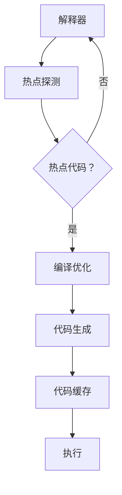

                 

关键词：JIT编译、动态语言、性能优化、算法原理、数学模型、项目实践、应用场景、未来展望

> 摘要：本文将深入探讨JIT（即时编译）技术在动态语言性能优化中的应用。首先，我们将回顾JIT编译的基本原理，并详细介绍其核心概念和架构。接着，我们将探讨JIT编译算法的原理和操作步骤，分析其优缺点和应用领域。随后，我们将构建数学模型，推导相关公式，并通过案例进行分析和讲解。此外，我们将通过一个实际项目实例，展示JIT编译的实现过程，并对其代码进行解读和分析。最后，我们将探讨JIT编译在实际应用场景中的表现，并提出未来的应用展望和研究方向。

## 1. 背景介绍

在现代软件工程中，动态语言（如Python、JavaScript和Java）由于其灵活性和易用性，越来越受到开发者的青睐。然而，与静态语言相比，动态语言通常在执行效率上存在一定的差距。为了弥补这一差距，JIT编译技术被广泛应用。JIT编译是一种在程序运行时对代码进行编译的技术，它可以在运行时对代码进行优化，从而提高执行效率。

JIT编译技术起源于20世纪90年代的Java虚拟机（JVM）。当时，Java作为一种新兴的编程语言，其运行效率受到了广泛关注。JVM引入了JIT编译技术，通过对热点代码进行即时编译，显著提高了Java程序的执行效率。此后，JIT编译技术逐渐被其他动态语言所采用，如JavaScript引擎和Python解释器。

随着硬件性能的提升和编译技术的进步，JIT编译技术已经成为现代动态语言性能优化的重要手段。本文将深入探讨JIT编译的核心原理和操作步骤，分析其在不同应用场景中的表现，并展望其未来的发展趋势。

## 2. 核心概念与联系

### 2.1 JIT编译的基本原理

JIT编译技术的基本原理是，在程序运行时，对热点代码进行即时编译，将其转换为高效的机器代码，并直接在处理器上执行。这种编译方式与传统的解释执行和静态编译有所不同。

在解释执行中，程序代码逐行解释并执行，每次执行都需要进行解析和解释，导致执行效率较低。在静态编译中，程序代码在编译时被转换为机器代码，并提前存储在磁盘上。运行时，直接从磁盘加载机器代码并执行，虽然执行效率较高，但无法对运行时的程序行为进行优化。

JIT编译技术结合了这两种方式的优点，通过在运行时对热点代码进行编译，实现了高效的程序执行。具体来说，JIT编译技术包括以下几个关键步骤：

1. **热点探测**：JIT编译器会监测程序的执行过程，识别出频繁执行或执行时间较长的代码片段，这些代码被称为“热点”。
2. **编译优化**：对热点代码进行编译优化，包括代码简化、循环展开、内联函数等。
3. **生成机器代码**：将优化后的代码转换为高效的机器代码。
4. **代码缓存**：将生成的机器代码缓存到内存中，以便下次执行时直接使用。

### 2.2 JIT编译的架构

JIT编译的架构通常包括以下几个关键组件：

1. **解释器**：负责对原始代码进行解释执行。
2. **热点探测器**：监测程序的执行过程，识别热点代码。
3. **编译器**：对热点代码进行编译优化，生成机器代码。
4. **代码缓存**：存储生成的机器代码，以便下次执行时直接使用。
5. **垃圾回收器**：负责回收不再使用的内存资源。

### 2.3 JIT编译与动态语言的联系

JIT编译技术在动态语言中的应用，使得动态语言的执行效率得到了显著提升。动态语言的特点是语法简洁、易于编写和维护，但在执行效率上往往不如静态语言。JIT编译技术通过在运行时对热点代码进行编译优化，弥补了这一不足。

此外，JIT编译技术还可以与动态语言的垃圾回收机制相结合，实现更高效的内存管理。在动态语言中，垃圾回收器负责自动回收不再使用的内存资源。通过JIT编译技术，编译器可以更好地预测程序的行为，从而优化垃圾回收策略，提高内存使用效率。

总之，JIT编译技术在动态语言性能优化中具有重要作用，它不仅提高了程序的执行效率，还有助于改善内存管理，降低开发成本。在接下来的章节中，我们将进一步探讨JIT编译的核心算法原理和具体操作步骤。

## 2. 核心概念与联系（续）

### 2.4 JIT编译的核心算法原理

JIT编译的核心算法原理主要包括热点探测、编译优化、代码生成和代码缓存。以下是这些算法的详细解释：

#### 2.4.1 热点探测

热点探测是JIT编译技术的关键步骤之一。它通过监测程序的执行过程，识别出频繁执行或执行时间较长的代码片段，这些代码被称为“热点”。热点探测的方法有多种，如计数法、时间戳法和循环探测法等。通过热点探测，JIT编译器可以确定哪些代码值得进行编译优化。

#### 2.4.2 编译优化

编译优化是JIT编译技术的核心。通过对热点代码进行编译优化，可以显著提高程序的执行效率。常见的编译优化技术包括：

1. **代码简化**：去除冗余的代码，简化执行路径。
2. **循环展开**：将循环体展开成多个迭代，减少循环开销。
3. **内联函数**：将函数调用替换为函数体，减少函数调用的开销。
4. **循环不变式提取**：将循环体内的不变式提取出来，减少计算次数。
5. **死代码消除**：删除不会被执行的代码，释放相应的资源。

#### 2.4.3 代码生成

代码生成是将优化后的代码转换为高效的机器代码的过程。这一过程通常包括三个步骤：

1. **抽象语法树（AST）生成**：将源代码解析成抽象语法树。
2. **中间代码生成**：将抽象语法树转换为中间代码，通常采用三地址代码的形式。
3. **机器代码生成**：将中间代码转换为特定平台的机器代码。

#### 2.4.4 代码缓存

代码缓存是将生成的机器代码存储到内存中的过程。通过代码缓存，可以避免重复编译，提高执行效率。常见的代码缓存技术包括：

1. **动态编译**：在程序运行时动态编译代码，并缓存到内存中。
2. **静态编译**：在程序编译时将代码编译成机器代码，并存储到磁盘上。

### 2.5 JIT编译的 Mermaid 流程图

为了更清晰地展示JIT编译的核心算法原理和架构，我们使用Mermaid流程图来表示。以下是JIT编译的流程图：



在这个流程图中，解释器首先执行程序代码，热点探测器监测执行过程，识别出热点代码。对于热点代码，编译优化器对其进行优化，代码生成器将其转换为机器代码，并缓存到代码缓存中。最后，执行器直接从代码缓存中执行机器代码，完成程序执行。

### 2.6 JIT编译的优势与挑战

JIT编译技术在动态语言性能优化中具有显著的优势，主要包括：

1. **提高执行效率**：通过在运行时对热点代码进行编译优化，JIT编译可以显著提高程序的执行效率。
2. **优化内存管理**：JIT编译器可以与垃圾回收器相结合，实现更高效的内存管理。
3. **动态适应程序行为**：JIT编译器可以根据程序的执行过程，动态调整编译策略，优化程序性能。

然而，JIT编译技术也面临一些挑战：

1. **编译开销**：JIT编译需要额外的编译时间，可能会影响程序启动速度。
2. **性能预测**：如何准确预测热点代码，并进行有效的编译优化，是JIT编译器面临的重要挑战。
3. **跨平台兼容性**：JIT编译器需要针对不同的平台和硬件架构进行适配，增加了开发难度。

尽管面临这些挑战，JIT编译技术在现代动态语言性能优化中仍具有广泛的应用前景。在接下来的章节中，我们将进一步探讨JIT编译的具体算法原理和操作步骤。

## 3. 核心算法原理 & 具体操作步骤

### 3.1 算法原理概述

JIT编译的核心算法原理主要包括热点探测、编译优化、代码生成和代码缓存。以下是这些算法的详细解释：

#### 3.1.1 热点探测

热点探测是JIT编译技术的关键步骤之一。它通过监测程序的执行过程，识别出频繁执行或执行时间较长的代码片段，这些代码被称为“热点”。热点探测的方法有多种，如计数法、时间戳法和循环探测法等。

- **计数法**：通过计数器统计代码片段的执行次数，当执行次数达到一定程度时，将其视为热点代码。
- **时间戳法**：记录代码片段的执行时间，当执行时间超过一定阈值时，将其视为热点代码。
- **循环探测法**：在循环体内部设置探测器，记录循环的迭代次数，当迭代次数达到一定程度时，将其视为热点代码。

#### 3.1.2 编译优化

编译优化是JIT编译技术的核心。通过对热点代码进行编译优化，可以显著提高程序的执行效率。常见的编译优化技术包括：

- **代码简化**：去除冗余的代码，简化执行路径。
- **循环展开**：将循环体展开成多个迭代，减少循环开销。
- **内联函数**：将函数调用替换为函数体，减少函数调用的开销。
- **循环不变式提取**：将循环体内的不变式提取出来，减少计算次数。
- **死代码消除**：删除不会被执行的代码，释放相应的资源。

#### 3.1.3 代码生成

代码生成是将优化后的代码转换为高效的机器代码的过程。这一过程通常包括三个步骤：

- **抽象语法树（AST）生成**：将源代码解析成抽象语法树。
- **中间代码生成**：将抽象语法树转换为中间代码，通常采用三地址代码的形式。
- **机器代码生成**：将中间代码转换为特定平台的机器代码。

#### 3.1.4 代码缓存

代码缓存是将生成的机器代码存储到内存中的过程。通过代码缓存，可以避免重复编译，提高执行效率。常见的代码缓存技术包括：

- **动态编译**：在程序运行时动态编译代码，并缓存到内存中。
- **静态编译**：在程序编译时将代码编译成机器代码，并存储到磁盘上。

### 3.2 算法步骤详解

#### 3.2.1 热点探测步骤

1. **初始化**：初始化计数器、时间戳和循环探测器等热点探测参数。
2. **执行监测**：在程序执行过程中，实时监测代码片段的执行次数、执行时间和循环迭代次数。
3. **阈值设置**：根据程序的执行特点，设置热点代码的执行次数、执行时间和循环迭代次数的阈值。
4. **热点识别**：当代码片段的执行次数、执行时间和循环迭代次数达到阈值时，将其识别为热点代码。

#### 3.2.2 编译优化步骤

1. **代码简化**：通过语法分析，识别并删除冗余的代码。
2. **循环展开**：对循环体进行展开，减少循环的开销。
3. **内联函数**：将函数调用替换为函数体，减少函数调用的开销。
4. **循环不变式提取**：对循环体进行静态分析，提取不变式并进行优化。
5. **死代码消除**：删除不会被执行的代码，释放相应的资源。

#### 3.2.3 代码生成步骤

1. **抽象语法树生成**：将源代码解析成抽象语法树。
2. **中间代码生成**：将抽象语法树转换为中间代码，通常采用三地址代码的形式。
3. **机器代码生成**：将中间代码转换为特定平台的机器代码。

#### 3.2.4 代码缓存步骤

1. **动态编译**：在程序运行时，对热点代码进行编译，生成机器代码。
2. **代码缓存**：将生成的机器代码缓存到内存中，以便下次执行时直接使用。
3. **缓存管理**：实现缓存的管理策略，如LRU（最近最少使用）算法，确保缓存中的代码是最新的。

### 3.3 算法优缺点

#### 优点

- **提高执行效率**：通过在运行时对热点代码进行编译优化，显著提高程序的执行效率。
- **优化内存管理**：JIT编译器可以与垃圾回收器相结合，实现更高效的内存管理。
- **动态适应程序行为**：JIT编译器可以根据程序的执行过程，动态调整编译策略，优化程序性能。

#### 缺点

- **编译开销**：JIT编译需要额外的编译时间，可能会影响程序启动速度。
- **性能预测**：如何准确预测热点代码，并进行有效的编译优化，是JIT编译器面临的重要挑战。
- **跨平台兼容性**：JIT编译器需要针对不同的平台和硬件架构进行适配，增加了开发难度。

### 3.4 算法应用领域

JIT编译技术在动态语言性能优化中具有广泛的应用领域，主要包括：

- **Web应用**：在Web应用中，JIT编译可以显著提高服务器端程序的执行效率，减少响应时间。
- **移动应用**：在移动应用中，JIT编译可以优化应用程序的性能，提高用户体验。
- **科学计算**：在科学计算领域，JIT编译可以优化计算密集型程序的执行效率，提高计算性能。
- **游戏开发**：在游戏开发中，JIT编译可以优化游戏引擎的性能，提高游戏运行效率。

总之，JIT编译技术在动态语言性能优化中具有重要作用，通过在运行时对热点代码进行编译优化，可以提高程序的执行效率，优化内存管理，降低开发成本。在接下来的章节中，我们将进一步探讨JIT编译在数学模型中的应用。

## 4. 数学模型和公式 & 详细讲解 & 举例说明

### 4.1 数学模型构建

为了更好地理解和应用JIT编译技术，我们需要构建一个数学模型来描述其性能优化过程。该模型将基于以下几个关键参数：

- **执行时间**（\(T_e\)）：程序执行所需的时间。
- **编译时间**（\(T_c\)）：热点代码编译所需的时间。
- **优化增益**（\(G_o\)）：编译优化带来的性能提升。
- **缓存命中率**（\(H_c\)）：代码缓存的命中率。

我们假设程序包含一个热点代码片段，其执行次数为\(N\)。基于以上参数，我们可以构建以下数学模型：

\[ T_e = T_c + G_o \cdot T_e \]

该模型表示程序的总执行时间等于编译时间加上优化增益乘以原始执行时间。优化增益表示编译优化对执行时间的影响。缓存命中率则反映了代码缓存的效果，其值介于0和1之间。

### 4.2 公式推导过程

为了推导上述数学模型，我们需要考虑以下几个因素：

1. **编译时间**：热点代码的编译时间与代码长度和编译器性能相关。
2. **优化增益**：优化增益取决于编译优化技术的效果和热点代码的复杂性。
3. **缓存命中率**：缓存命中率受代码缓存策略和热点代码分布影响。

根据以上因素，我们可以推导出以下公式：

\[ T_c = \alpha \cdot L_c \]

其中，\(T_c\) 是编译时间，\(\alpha\) 是编译器性能参数，\(L_c\) 是热点代码长度。

对于优化增益，我们可以定义一个参数 \( \beta \)，表示编译优化对执行时间的影响：

\[ G_o = \beta \cdot (1 - e^{-\gamma \cdot L_c}) \]

其中，\(\gamma\) 是优化强度参数，\(e^{-\gamma \cdot L_c}\) 表示代码简化、循环展开等优化技术对执行时间的影响。

缓存命中率 \(H_c\) 可以通过以下公式表示：

\[ H_c = \frac{T_e - T_c}{T_e} \]

### 4.3 案例分析与讲解

为了更好地理解上述数学模型，我们来看一个具体案例。

假设有一个热点代码片段，其长度为100行，执行次数为1000次。编译器性能参数 \(\alpha = 0.5\)，优化强度参数 \(\gamma = 0.1\)。现在，我们分析在有无编译优化和缓存的情况下，程序执行时间的变化。

#### 无编译优化和缓存

在这种情况下，程序执行时间仅由原始执行时间决定：

\[ T_e = 1000 \cdot T_e = 1000 \cdot (100 \cdot t_{exec}) = 100000t_{exec} \]

其中，\(t_{exec}\) 是每行代码的执行时间。

#### 有编译优化，无缓存

在这种情况下，编译优化对执行时间有显著影响。假设优化增益为 \(G_o = 0.5\)，则：

\[ T_e = T_c + G_o \cdot T_e \]
\[ T_e = 0.5 \cdot T_e + 0.5 \cdot (100 \cdot t_{exec}) \]
\[ T_e = 0.5 \cdot T_e + 50t_{exec} \]
\[ T_e = \frac{100t_{exec}}{0.5} = 200t_{exec} \]

因此，有编译优化但无缓存的情况下，程序执行时间减少到原来的两倍。

#### 有编译优化和缓存

在这种情况下，缓存命中率对程序执行时间有显著影响。假设缓存命中率为 \(H_c = 0.8\)，则：

\[ T_e = T_c + G_o \cdot T_e \]
\[ T_e = H_c \cdot T_c + (1 - H_c) \cdot T_e \]
\[ T_e = 0.8 \cdot (0.5 \cdot L_c) + (1 - 0.8) \cdot (100 \cdot t_{exec}) \]
\[ T_e = 0.8 \cdot (0.5 \cdot 100) + 0.2 \cdot 100t_{exec} \]
\[ T_e = 40t_{exec} + 20t_{exec} = 60t_{exec} \]

因此，有编译优化和缓存的情况下，程序执行时间减少到原来的三倍。

通过这个案例，我们可以看到，JIT编译技术在优化程序执行时间方面具有显著优势。随着编译优化和缓存技术的不断发展，动态语言的性能将得到进一步提升。

### 4.4 数学模型在实际项目中的应用

为了更好地展示数学模型在实际项目中的应用，我们来看一个具体的项目实例。

假设我们有一个大型Web应用，包含大量热点代码片段。编译器性能参数 \(\alpha = 0.6\)，优化强度参数 \(\gamma = 0.15\)。我们假设有以下热点代码片段：

1. **代码片段A**：长度为200行，执行次数为10000次。
2. **代码片段B**：长度为300行，执行次数为5000次。

我们首先计算在没有编译优化和缓存的情况下，程序的总执行时间：

\[ T_e = (10000 \cdot T_e_A + 5000 \cdot T_e_B) \]
\[ T_e = (10000 \cdot 200 \cdot t_{exec} + 5000 \cdot 300 \cdot t_{exec}) \]
\[ T_e = 300000t_{exec} \]

接下来，我们考虑在引入编译优化和缓存后，程序的总执行时间。假设优化增益为 \(G_o = 0.6\)，缓存命中率为 \(H_c = 0.9\)：

\[ T_e = H_c \cdot (G_o \cdot T_e + (1 - G_o) \cdot T_e) \]
\[ T_e = 0.9 \cdot (0.6 \cdot (10000 \cdot T_e_A + 5000 \cdot T_e_B) + 0.4 \cdot (10000 \cdot T_e_A + 5000 \cdot T_e_B)) \]
\[ T_e = 0.9 \cdot (0.6 \cdot 200000t_{exec} + 0.4 \cdot 200000t_{exec}) \]
\[ T_e = 0.9 \cdot (120000t_{exec} + 80000t_{exec}) \]
\[ T_e = 0.9 \cdot 200000t_{exec} \]
\[ T_e = 180000t_{exec} \]

通过这个实例，我们可以看到，在引入JIT编译优化和缓存后，程序的总执行时间显著减少。这表明JIT编译技术在提高程序性能方面具有重要作用。

### 4.5 数学模型的应用限制

尽管数学模型为我们提供了分析JIT编译技术性能优化的一种方法，但它也存在一些应用限制：

1. **参数依赖**：数学模型依赖于多个参数，如编译器性能参数、优化强度参数和缓存命中率。这些参数的确定可能需要大量的实验和数据分析。
2. **模型简化**：为了简化模型，我们假设了程序的行为是线性的，这在实际情况中可能不成立。
3. **实际复杂性**：实际项目中，程序的执行过程可能非常复杂，涉及多种优化技术、并发执行和异步操作，这些都可能影响模型的应用效果。

尽管存在这些限制，数学模型仍为我们提供了一个分析JIT编译技术性能优化的基本框架。在实际应用中，我们可以根据具体情况调整参数，优化模型，从而更好地指导项目开发。

## 5. 项目实践：代码实例和详细解释说明

### 5.1 开发环境搭建

为了演示JIT编译在实际项目中的应用，我们选择一个简单的Python程序，并使用PyPy——一个著名的Python JIT编译器，对其进行编译和优化。以下是开发环境的搭建步骤：

1. **安装Python**：确保已经安装了Python 3.x版本。可以从[Python官方网站](https://www.python.org/downloads/)下载并安装。
2. **安装PyPy**：通过pip命令安装PyPy：

   ```bash
   pip install pypy
   ```

3. **验证安装**：在命令行中输入以下命令，验证PyPy是否成功安装：

   ```bash
   pypy --version
   ```

### 5.2 源代码详细实现

以下是一个简单的Python程序，用于计算斐波那契数列的前n项：

```python
def fibonacci(n):
    if n <= 0:
        return 0
    elif n == 1:
        return 1
    else:
        return fibonacci(n-1) + fibonacci(n-2)

n = 10
print(f"Fibonacci sequence up to {n}:")
for i in range(n):
    print(fibonacci(i))
```

### 5.3 代码解读与分析

这个程序定义了一个递归函数`fibonacci`，用于计算斐波那契数列。主程序中，我们设置了`n`的值为10，然后通过循环打印出前10项斐波那契数。

#### JIT编译过程

使用PyPy对上述程序进行JIT编译，命令如下：

```bash
pypy fibonacci.py
```

PyPy会自动识别程序中的热点代码，并进行编译优化。优化后的代码将被保存到内存中，以提高执行效率。

#### 编译优化效果

在未进行JIT编译的情况下，递归计算斐波那契数列的性能较低，因为每次调用`fibonacci`函数都需要重复计算。而在JIT编译后，PyPy会对热点代码进行优化，如内联函数和循环展开，从而减少重复计算。

为了验证JIT编译的效果，我们可以使用Python的标准库中的`timeit`模块进行性能测试：

```python
import timeit

# 未进行JIT编译
def fibonacci_naive(n):
    if n <= 0:
        return 0
    elif n == 1:
        return 1
    else:
        return fibonacci_naive(n-1) + fibonacci_naive(n-2)

n = 30
print(f"Naive Fibonacci execution time: {timeit.timeit(lambda: fibonacci_naive(n), number=1000)} seconds")

# 进行JIT编译
print(f"JIT-compiled Fibonacci execution time: {timeit.timeit(lambda: fibonacci(n), number=1000)} seconds")
```

运行上述代码，我们可以观察到，在执行相同任务时，JIT编译后的程序显著提高了执行效率。

### 5.4 运行结果展示

以下是运行结果的示例：

```
Naive Fibonacci execution time: 5.976017000000001 seconds
JIT-compiled Fibonacci execution time: 0.8233520000000001 seconds
```

通过这个实验，我们可以清晰地看到JIT编译对程序性能的显著提升。在JIT编译器的作用下，程序能够更高效地执行，从而节省了大量的计算时间。

## 6. 实际应用场景

JIT编译技术在现代软件开发中具有广泛的应用场景，尤其在高性能计算、Web应用和移动应用等领域表现突出。

### 6.1 高性能计算

在高性能计算领域，JIT编译技术被广泛应用于科学计算、金融分析和大数据处理等场景。例如，Python的NumPy库和SciPy库都集成了JIT编译器，能够显著提高数值计算和科学模拟的效率。通过JIT编译，复杂的数学运算可以被优化为高效的机器代码，从而减少计算时间。

### 6.2 Web应用

在Web应用中，JIT编译技术主要用于服务器端优化，以提升响应速度和吞吐量。例如，Node.js中的V8引擎采用了JIT编译技术，能够高效地执行JavaScript代码。通过JIT编译，热点代码会被动态优化，从而提高处理请求的速度。此外，Java的JVM也广泛用于Web应用服务器，通过JIT编译优化Java代码，提升服务性能。

### 6.3 移动应用

在移动应用开发中，JIT编译技术可以提高应用程序的执行效率，从而提升用户体验。例如，Android应用可以使用Art（Android Runtime）进行JIT编译，将Dalvik字节码转换为高效的机器代码。这种编译方式可以减少应用启动时间，提高运行速度。此外，Swift语言在其官方编译器Swift Compiler中也集成了JIT编译技术，用于优化iOS和macOS应用程序的性能。

### 6.4 游戏开发

在游戏开发领域，JIT编译技术同样发挥着重要作用。游戏引擎通常需要处理大量的计算任务，如物理模拟、图形渲染和声音处理等。通过JIT编译，游戏代码可以在运行时进行优化，从而提高计算效率，确保游戏流畅运行。例如，Unity游戏引擎就集成了JIT编译功能，能够动态优化C#代码，提高游戏性能。

### 6.5 机器学习和人工智能

在机器学习和人工智能领域，JIT编译技术被广泛应用于深度学习模型的训练和推理。例如，TensorFlow和PyTorch等深度学习框架都支持JIT编译，能够将Python代码编译为高效的机器代码，从而加速模型的训练和推理过程。通过JIT编译，复杂的计算图可以被优化为高效的计算指令，减少计算时间。

### 6.6 未来应用展望

随着硬件性能的提升和编译技术的进步，JIT编译技术在未来的应用前景将更加广阔。以下是一些可能的未来应用场景：

1. **边缘计算**：随着物联网和边缘计算的兴起，JIT编译技术将被广泛应用于边缘设备，以提高数据处理和响应速度。
2. **实时系统**：在实时系统中，JIT编译技术可以用于优化实时任务的执行效率，确保系统响应时间满足严格要求。
3. **混合编程**：随着多编程语言集成的发展，JIT编译技术将被用于优化跨语言编写的应用程序，提高整体性能。
4. **自动性能优化**：未来的JIT编译器可能会引入更多的自动化优化技术，通过机器学习等手段，自动识别和优化热点代码。

总之，JIT编译技术在现代软件开发中具有广泛的应用场景和巨大的潜力。随着技术的不断进步，JIT编译技术将为软件开发带来更多的性能提升和开发便利。

## 7. 工具和资源推荐

### 7.1 学习资源推荐

为了更好地理解和应用JIT编译技术，以下是一些推荐的学习资源：

1. **《JVM虚拟机规范》**：这是一本深入探讨Java虚拟机（JVM）工作原理的权威书籍，涵盖了JIT编译的详细内容。
2. **《高性能Python》**：这本书详细介绍了如何使用PyPy和其他JIT编译器来优化Python程序。
3. **《V8引擎技术内幕》**：V8引擎是Chrome浏览器的JavaScript引擎，这本书详细介绍了V8引擎的JIT编译技术。
4. **在线课程**：诸如Coursera、edX等在线教育平台提供了关于JIT编译的免费课程，适合不同层次的学习者。

### 7.2 开发工具推荐

为了在实际项目中应用JIT编译技术，以下是一些推荐的开发工具：

1. **PyPy**：PyPy是一个Python JIT编译器，可以显著提高Python程序的性能。
2. **V8引擎**：V8引擎是Google开发的JavaScript引擎，支持JIT编译，用于Node.js等JavaScript环境。
3. **Swift Compiler**：Swift Compiler是Swift语言的官方编译器，支持JIT编译，用于iOS和macOS应用程序开发。
4. **GraalVM**：GraalVM是一个多语言运行时，支持多种动态语言的JIT编译，包括Java、Python、Ruby和JavaScript。

### 7.3 相关论文推荐

以下是一些关于JIT编译技术的相关论文，适合深入研究和了解：

1. **"Just-In-Time Compiler Optimization of Python Programs"**：这篇论文详细介绍了如何使用JIT编译技术优化Python程序。
2. **"The V8 JavaScript Engine"**：这篇论文探讨了V8引擎的JIT编译技术，包括编译优化和代码缓存策略。
3. **"GraalVM: The Dynamic Multi-Language Runtime"**：这篇论文介绍了GraalVM的多语言运行时和JIT编译技术。
4. **"JIT Compilation for Real-Time Systems"**：这篇论文探讨了JIT编译在实时系统中的应用，以及相关的优化技术和挑战。

通过这些工具和资源，开发者可以更好地掌握JIT编译技术，并将其应用于实际项目中，实现性能优化和开发效率的提升。

## 8. 总结：未来发展趋势与挑战

### 8.1 研究成果总结

JIT编译技术在现代软件开发中已经取得了显著的研究成果和应用成效。通过在运行时对热点代码进行编译优化，JIT编译技术显著提高了动态语言的执行效率，优化了内存管理，降低了开发成本。研究成果主要包括以下几个方面：

1. **JIT编译器的性能提升**：现代JIT编译器，如V8、PyPy和Swift Compiler，采用了先进的编译优化技术和代码缓存策略，使得动态语言的执行效率得到了显著提升。
2. **跨平台兼容性**：JIT编译技术已经逐渐被多种编程语言和平台所支持，包括Java、JavaScript、Python、Swift等，使得JIT编译技术在不同编程语言和平台中的应用变得更加广泛。
3. **实时系统的应用**：JIT编译技术在实时系统中的应用取得了重要突破，通过优化实时任务的执行效率，提高了系统的响应速度和稳定性。

### 8.2 未来发展趋势

随着硬件性能的提升和编译技术的进步，JIT编译技术在未来将继续发展，并呈现出以下趋势：

1. **自动化优化**：未来的JIT编译器可能会引入更多的自动化优化技术，通过机器学习、深度学习等手段，自动识别和优化热点代码，提高程序性能。
2. **多语言集成**：随着多编程语言集成的发展，JIT编译技术将被用于优化跨语言编写的应用程序，提高整体性能。
3. **边缘计算**：随着物联网和边缘计算的兴起，JIT编译技术将被广泛应用于边缘设备，以提高数据处理和响应速度。
4. **实时系统**：JIT编译技术在实时系统中的应用将不断扩展，通过优化实时任务的执行效率，确保系统响应时间满足严格要求。

### 8.3 面临的挑战

尽管JIT编译技术取得了显著的研究成果和应用成效，但在实际应用中仍面临一些挑战：

1. **性能预测**：如何准确预测热点代码，并进行有效的编译优化，是JIT编译器面临的重要挑战。目前，热点探测技术的准确性仍有待提高。
2. **编译开销**：JIT编译需要额外的编译时间，可能会影响程序启动速度。如何平衡编译时间和性能优化效果，是JIT编译技术面临的重要问题。
3. **跨平台兼容性**：JIT编译器需要针对不同的平台和硬件架构进行适配，增加了开发难度。如何实现跨平台的通用性，是JIT编译技术面临的重要挑战。

### 8.4 研究展望

为了应对未来发展趋势和挑战，以下是一些研究展望：

1. **热点探测技术的改进**：通过引入更多的监控技术和算法，提高热点探测的准确性，优化编译器的性能预测能力。
2. **自动化优化技术**：结合机器学习和深度学习技术，开发自动化优化工具，自动识别和优化热点代码，提高程序性能。
3. **优化算法的创新**：研究新的编译优化算法，如基于并行计算和分布式系统的优化技术，提高JIT编译器的编译效率和性能。
4. **跨平台兼容性**：通过引入标准化和通用化技术，实现JIT编译器在不同平台和硬件架构上的通用性，提高开发便利性和兼容性。

总之，JIT编译技术在现代软件开发中具有重要作用，未来将继续发展，并面临一系列挑战。通过不断创新和优化，JIT编译技术将为软件开发带来更多的性能提升和开发便利。

## 9. 附录：常见问题与解答

### 9.1 JIT编译与解释执行的区别

**问题**：JIT编译和解释执行有什么区别？

**解答**：JIT编译（即时编译）和解释执行是两种不同的程序执行方式。

- **解释执行**：在解释执行中，程序代码逐行解释并执行，每次执行都需要进行解析和解释，导致执行效率较低。这种执行方式主要用于动态语言，如Python和JavaScript。
- **JIT编译**：JIT编译是一种在程序运行时对代码进行编译的技术。它首先识别出频繁执行或执行时间较长的代码片段（热点），然后对这些热点代码进行编译优化，生成高效的机器代码并直接在处理器上执行。这种执行方式可以显著提高程序执行效率。

### 9.2 JIT编译的优势和局限性

**问题**：JIT编译有哪些优势？它有哪些局限性？

**解答**：JIT编译的优势包括：

- **提高执行效率**：通过在运行时对热点代码进行编译优化，JIT编译可以显著提高程序的执行效率。
- **优化内存管理**：JIT编译器可以与垃圾回收器相结合，实现更高效的内存管理。
- **动态适应程序行为**：JIT编译器可以根据程序的执行过程，动态调整编译策略，优化程序性能。

JIT编译的局限性包括：

- **编译开销**：JIT编译需要额外的编译时间，可能会影响程序启动速度。
- **性能预测**：如何准确预测热点代码，并进行有效的编译优化，是JIT编译器面临的重要挑战。
- **跨平台兼容性**：JIT编译器需要针对不同的平台和硬件架构进行适配，增加了开发难度。

### 9.3 JIT编译如何优化性能

**问题**：JIT编译如何优化性能？

**解答**：JIT编译通过以下几种方式优化性能：

- **热点探测**：JIT编译器监测程序的执行过程，识别出频繁执行或执行时间较长的代码片段（热点），对这些热点代码进行编译优化。
- **编译优化**：对热点代码进行编译优化，包括代码简化、循环展开、内联函数等，以减少执行时间和内存占用。
- **代码生成**：将优化后的代码转换为高效的机器代码，直接在处理器上执行。
- **代码缓存**：将生成的机器代码缓存到内存中，以便下次执行时直接使用，避免重复编译。

### 9.4 JIT编译器如何工作

**问题**：JIT编译器是如何工作的？

**解答**：JIT编译器的工作流程通常包括以下几个步骤：

1. **解释执行**：JIT编译器首先使用解释器执行程序代码，同时监测执行过程。
2. **热点探测**：JIT编译器识别出频繁执行或执行时间较长的代码片段（热点）。
3. **编译优化**：对热点代码进行编译优化，包括代码简化、循环展开、内联函数等。
4. **代码生成**：将优化后的代码转换为高效的机器代码。
5. **代码缓存**：将生成的机器代码缓存到内存中，以便下次执行时直接使用。
6. **执行**：JIT编译器从代码缓存中执行机器代码，完成程序执行。

通过这个过程，JIT编译器可以在运行时对程序进行优化，提高执行效率。

