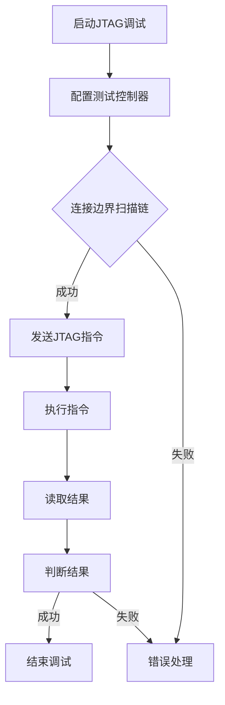

                 

关键词：JTAG调试、嵌入式系统、调试技巧、电路板、编程、故障诊断、软件开发

摘要：本文将深入探讨JTAG调试在嵌入式系统中的应用，从基本概念、原理到实践操作，为您揭示JTAG调试的奥秘。通过本文，读者将全面了解JTAG调试的优势、应用场景和未来的发展趋势。

## 1. 背景介绍

在现代嵌入式系统中，调试是软件开发过程中至关重要的一环。随着系统复杂度的增加，传统的调试方法如断点调试、单步执行等已经无法满足高效、精准的调试需求。JTAG（Joint Test Action Group）调试作为一种高效的调试技术，在嵌入式系统中得到了广泛应用。

JTAG调试技术起源于1980年代，最初是为了解决芯片测试问题而提出的。随着嵌入式系统的不断发展，JTAG调试逐渐成为嵌入式系统开发中的标准调试手段。本文将围绕JTAG调试在嵌入式系统中的应用，深入探讨其原理、方法和实践。

## 2. 核心概念与联系

### JTAG基本原理

JTAG是一种用于芯片和电路板的测试和调试技术，其基本原理是利用JTAG接口实现对芯片的远程控制和数据交换。JTAG接口由四根信号线组成：TCK（时钟线）、TMS（模式选择线）、TDI（数据输入线）和TDO（数据输出线）。通过这些信号线，JTAG可以实现芯片的读写操作、测试逻辑、故障诊断等功能。

### JTAG架构

JTAG调试架构包括三个主要部分：测试逻辑（Test Logic），边界扫描链（Boundary-Scan Chain）和测试控制器（Test Controller）。

1. **测试逻辑**：测试逻辑是指芯片内部的JTAG电路，它负责实现JTAG协议的各个方面，如信号线的控制、数据的传输等。

2. **边界扫描链**：边界扫描链是指芯片的输入输出引脚与JTAG接口之间的连接链路。通过边界扫描链，JTAG可以访问芯片的内部逻辑。

3. **测试控制器**：测试控制器是JTAG调试系统的核心，它负责发送指令、控制信号线的状态、接收数据等。

### Mermaid流程图

下面是一个JTAG调试的Mermaid流程图，展示了JTAG调试的基本流程：



## 3. 核心算法原理 & 具体操作步骤

### 3.1 算法原理概述

JTAG调试的核心算法是基于JTAG协议的。JTAG协议定义了芯片测试和调试的通信方式和操作流程。JTAG调试的基本流程如下：

1. **初始化**：启动JTAG调试，配置测试控制器。
2. **连接边界扫描链**：建立芯片与JTAG接口的连接。
3. **发送JTAG指令**：通过JTAG接口发送测试指令，控制芯片的运行状态。
4. **执行指令**：芯片根据收到的指令执行相应的操作。
5. **读取结果**：从芯片读取执行结果。
6. **判断结果**：根据读取的结果判断调试是否成功。

### 3.2 算法步骤详解

1. **启动JTAG调试**：
    - 连接嵌入式系统，确保JTAG接口与计算机的通信正常。
    - 打开JTAG调试工具，如OpenOCD、JTAG Explorer等。

2. **配置测试控制器**：
    - 设置JTAG时钟频率，确保时钟信号稳定。
    - 选择芯片型号，配置芯片的JTAG接口参数。

3. **连接边界扫描链**：
    - 确认芯片的JTAG接口引脚正确连接到调试工具。
    - 检查边界扫描链的连通性，确保信号能够正确传输。

4. **发送JTAG指令**：
    - 根据调试需求，选择合适的JTAG指令，如扫描指令、控制指令等。
    - 通过调试工具发送指令到芯片。

5. **执行指令**：
    - 芯片根据收到的指令执行相应的操作，如读取寄存器值、修改内存数据等。

6. **读取结果**：
    - 从芯片读取执行结果，如寄存器值、内存数据等。

7. **判断结果**：
    - 根据读取的结果判断调试是否成功。
    - 若调试成功，结束调试过程。
    - 若调试失败，进行错误处理，如重试、修改调试参数等。

### 3.3 算法优缺点

**优点**：

1. **高效性**：JTAG调试可以同时对多个芯片进行操作，提高了调试效率。
2. **灵活性**：JTAG调试支持多种指令和操作，适用于各种调试需求。
3. **适用性**：JTAG调试适用于各种嵌入式系统，如微控制器、FPGA、DSP等。

**缺点**：

1. **复杂性**：JTAG调试涉及多个组件和参数的配置，对开发者要求较高。
2. **成本**：JTAG调试工具和接口模块的成本较高。

### 3.4 算法应用领域

JTAG调试在嵌入式系统中的应用非常广泛，主要包括以下几个方面：

1. **芯片级调试**：用于调试嵌入式系统中的各个芯片，如CPU、内存、外设等。
2. **电路板级调试**：用于调试电路板的整体功能，如通信接口、电源系统等。
3. **系统级调试**：用于调试整个嵌入式系统的功能，如操作系统、应用程序等。
4. **生产测试**：用于对生产出的嵌入式系统进行功能测试，确保产品质量。

## 4. 数学模型和公式 & 详细讲解 & 举例说明

### 4.1 数学模型构建

JTAG调试的数学模型主要涉及以下几个方面：

1. **JTAG时钟信号**：JTAG时钟信号是JTAG调试的核心，其频率和稳定性直接影响调试效果。假设JTAG时钟信号的频率为f，则时钟周期T = 1/f。

2. **边界扫描链延迟**：边界扫描链的延迟会影响JTAG指令的执行速度。假设边界扫描链的延迟为t，则JTAG指令的执行时间为t * N，其中N为指令的重复次数。

3. **数据传输速率**：JTAG数据传输速率是指JTAG接口每秒钟可以传输的数据量。假设数据传输速率为R，则JTAG接口每秒可以传输的数据量为R * T。

根据以上假设，可以构建如下的数学模型：

$$
\begin{aligned}
T &= \frac{1}{f} \\
t &= \text{边界扫描链延迟} \\
N &= \text{指令重复次数} \\
R &= \text{数据传输速率} \\
\end{aligned}
$$

### 4.2 公式推导过程

根据构建的数学模型，可以推导出以下公式：

1. **JTAG指令执行时间**：

$$
\text{指令执行时间} = t \times N
$$

2. **JTAG数据传输速率**：

$$
\text{数据传输速率} = R \times T
$$

3. **JTAG调试效率**：

$$
\text{调试效率} = \frac{\text{成功调试的指令数}}{\text{总指令数}} \times 100\%
$$

### 4.3 案例分析与讲解

假设有一个嵌入式系统，其JTAG时钟频率为20MHz，边界扫描链延迟为1μs，数据传输速率为1Mbps。现需要对系统进行调试，调试指令总数为1000条。

1. **JTAG指令执行时间**：

$$
\text{指令执行时间} = 1\mu s \times 1000 = 1\text{ms}
$$

2. **JTAG数据传输速率**：

$$
\text{数据传输速率} = 1\text{Mbps} \times 1\text{ms} = 1\text{KB/s}
$$

3. **JTAG调试效率**：

假设调试过程中成功执行的指令数为900条，则调试效率为：

$$
\text{调试效率} = \frac{900}{1000} \times 100\% = 90\%
$$

通过以上分析，可以看出JTAG调试在嵌入式系统中的应用具有较高的效率。但在实际调试过程中，可能会受到边界扫描链延迟、数据传输速率等因素的影响，需要根据实际情况进行调整。

## 5. 项目实践：代码实例和详细解释说明

### 5.1 开发环境搭建

在进行JTAG调试之前，需要搭建开发环境。以下是搭建JTAG调试环境的步骤：

1. **安装JTAG调试工具**：安装如OpenOCD、JTAG Explorer等JTAG调试工具。

2. **连接JTAG接口**：将JTAG调试工具与嵌入式系统的JTAG接口连接，确保连接正确。

3. **配置调试参数**：根据嵌入式系统的芯片型号和JTAG接口参数，配置调试工具的参数，如时钟频率、边界扫描链延迟等。

4. **连接计算机**：将调试工具连接到计算机，确保计算机与调试工具之间的通信正常。

### 5.2 源代码详细实现

下面是一个简单的JTAG调试源代码实例，用于读取嵌入式系统中的寄存器值：

```c
#include <stdio.h>
#include <stdlib.h>
#include "jtag.h" // 假设有一个JTAG库文件

int main() {
    // 初始化JTAG接口
    jtag_init();

    // 连接边界扫描链
    jtag_connect();

    // 读取寄存器值
    unsigned int reg_value = jtag_read_reg(0x00);

    // 输出寄存器值
    printf("Register value: 0x%X\n", reg_value);

    // 断开边界扫描链
    jtag_disconnect();

    // 关闭JTAG接口
    jtag_cleanup();

    return 0;
}
```

### 5.3 代码解读与分析

1. **初始化JTAG接口**：调用`jtag_init()`函数初始化JTAG接口，包括配置时钟频率、边界扫描链延迟等参数。

2. **连接边界扫描链**：调用`jtag_connect()`函数连接边界扫描链，确保JTAG接口与嵌入式系统之间的通信正常。

3. **读取寄存器值**：调用`jtag_read_reg()`函数读取指定寄存器的值。该函数接收一个寄存器地址作为参数，从JTAG接口读取寄存器的值。

4. **输出寄存器值**：将读取到的寄存器值输出到控制台。

5. **断开边界扫描链**：调用`jtag_disconnect()`函数断开边界扫描链，确保JTAG接口与嵌入式系统之间的通信正常。

6. **关闭JTAG接口**：调用`jtag_cleanup()`函数关闭JTAG接口，释放资源。

通过以上代码，我们可以实现对嵌入式系统中寄存器值的读取。在实际项目中，可以根据需求扩展JTAG接口的功能，如写入寄存器值、触发中断等。

### 5.4 运行结果展示

假设运行以上代码，成功连接到嵌入式系统，并读取到寄存器值为0x1234。运行结果如下：

```
Register value: 0x1234
```

这表明JTAG调试已成功执行，并从嵌入式系统中读取到了正确的寄存器值。

## 6. 实际应用场景

### 6.1 芯片级调试

芯片级调试是JTAG调试的主要应用场景之一。通过JTAG调试，开发者可以方便地读取芯片的寄存器值、修改内存数据、触发中断等。以下是一个芯片级调试的实例：

1. **读取CPU寄存器**：通过JTAG调试，可以读取CPU的寄存器值，如程序计数器、状态寄存器等，帮助开发者了解CPU的运行状态。

2. **修改内存数据**：通过JTAG调试，可以修改嵌入式系统中的内存数据，如程序代码、变量等，便于调试和测试。

3. **触发中断**：通过JTAG调试，可以触发嵌入式系统中的中断，帮助开发者调试中断处理程序。

### 6.2 电路板级调试

电路板级调试是指对整个电路板的功能进行调试。通过JTAG调试，开发者可以方便地测试电路板的各种接口、模块和功能。以下是一个电路板级调试的实例：

1. **测试通信接口**：通过JTAG调试，可以测试电路板上的通信接口，如SPI、I2C、UART等，确保接口工作正常。

2. **测试外设模块**：通过JTAG调试，可以测试电路板上的各种外设模块，如传感器、显示屏、存储器等，确保外设模块工作正常。

3. **测试电源系统**：通过JTAG调试，可以测试电路板的电源系统，确保电源供应稳定。

### 6.3 系统级调试

系统级调试是指对整个嵌入式系统的功能进行调试。通过JTAG调试，开发者可以全面地测试嵌入式系统的各个方面，如操作系统、应用程序等。以下是一个系统级调试的实例：

1. **测试操作系统**：通过JTAG调试，可以测试操作系统的各项功能，如进程管理、内存管理、文件系统等。

2. **测试应用程序**：通过JTAG调试，可以测试应用程序的运行效果，如功能是否正常、性能是否达标等。

3. **调试故障诊断**：通过JTAG调试，可以定位嵌入式系统中的故障，如硬件故障、软件故障等。

## 7. 工具和资源推荐

### 7.1 学习资源推荐

1. **《JTAG芯片测试与调试技术》**：这本书详细介绍了JTAG技术的基本原理、应用场景和调试方法，适合初学者阅读。

2. **《嵌入式系统设计与开发》**：这本书涵盖嵌入式系统的设计、开发和调试，其中包含大量的JTAG调试实例，适合有一定基础的读者。

### 7.2 开发工具推荐

1. **OpenOCD**：OpenOCD是一个开源的JTAG调试工具，功能强大、支持广泛，适合各种嵌入式系统的调试。

2. **JTAG Explorer**：JTAG Explorer是一款专业的JTAG调试工具，界面友好、操作简便，适合初学者使用。

### 7.3 相关论文推荐

1. **“JTAG: An Overview”**：这篇文章对JTAG技术进行了全面的综述，介绍了JTAG的原理、应用和发展趋势。

2. **“JTAG for Embedded System Developers”**：这篇文章针对嵌入式系统开发者，详细介绍了JTAG调试的基本原理和应用方法。

## 8. 总结：未来发展趋势与挑战

### 8.1 研究成果总结

随着嵌入式系统的不断发展，JTAG调试技术在各个方面都取得了显著的成果：

1. **调试效率提高**：通过优化JTAG协议和调试算法，JTAG调试的效率得到了大幅提升，能够更快速地完成调试任务。

2. **应用领域扩展**：JTAG调试不仅应用于芯片和电路板级调试，还扩展到系统级调试，为嵌入式系统开发提供了强大的支持。

3. **开源工具发展**：开源JTAG调试工具如OpenOCD等不断更新，功能越来越强大，降低了开发者的使用门槛。

### 8.2 未来发展趋势

未来，JTAG调试技术将继续朝着以下几个方向发展：

1. **智能化**：结合人工智能技术，实现智能化的JTAG调试，提高调试的精准性和效率。

2. **低功耗**：随着嵌入式系统对功耗的要求越来越高，JTAG调试技术将朝着低功耗方向发展。

3. **多功能集成**：集成多种调试功能，如代码调试、性能分析、故障诊断等，提高调试的全面性和便利性。

### 8.3 面临的挑战

尽管JTAG调试技术取得了显著成果，但在未来发展中仍面临一些挑战：

1. **兼容性问题**：随着嵌入式系统的多样化，如何确保JTAG调试工具在不同系统间的兼容性成为一个挑战。

2. **安全性问题**：JTAG调试工具的安全性问题日益突出，如何保证调试过程中的数据安全和系统安全成为关键。

3. **技术门槛**：JTAG调试涉及多个领域的知识，技术门槛较高，如何降低开发者的使用门槛是未来发展的一个重要方向。

### 8.4 研究展望

在未来，JTAG调试技术将继续在以下几个方面展开研究：

1. **算法优化**：深入研究JTAG调试算法，提高调试效率，降低调试成本。

2. **系统集成**：研究如何将JTAG调试与其他技术（如AI、大数据等）集成，提高嵌入式系统的整体性能。

3. **标准化**：推动JTAG调试技术的标准化，提高不同系统间的兼容性，降低开发者的使用门槛。

## 9. 附录：常见问题与解答

### Q1：什么是JTAG调试？

A1：JTAG调试是一种用于芯片和电路板的测试和调试技术，通过JTAG接口实现对芯片的远程控制和数据交换。

### Q2：JTAG调试有哪些优势？

A2：JTAG调试具有以下优势：

1. 高效性：可以同时对多个芯片进行操作，提高调试效率。
2. 灵活性：支持多种指令和操作，适用于各种调试需求。
3. 适用性：适用于各种嵌入式系统，如微控制器、FPGA、DSP等。

### Q3：如何进行JTAG调试？

A3：进行JTAG调试的基本步骤包括：

1. 安装JTAG调试工具。
2. 连接JTAG接口。
3. 配置调试参数。
4. 发送JTAG指令。
5. 读取结果。
6. 判断调试是否成功。

### Q4：JTAG调试有哪些应用领域？

A4：JTAG调试主要应用于以下领域：

1. 芯片级调试：用于调试嵌入式系统中的各个芯片。
2. 电路板级调试：用于调试电路板的整体功能。
3. 系统级调试：用于调试整个嵌入式系统的功能。
4. 生产测试：用于对生产出的嵌入式系统进行功能测试。

### Q5：如何解决JTAG调试中的兼容性问题？

A5：解决JTAG调试中的兼容性问题可以采取以下措施：

1. 使用开源JTAG调试工具，如OpenOCD，这些工具通常具有较好的兼容性。
2. 遵循JTAG调试的标准化协议，如IEEE 1149.1。
3. 在调试过程中及时更新调试工具和固件，确保兼容性。

### Q6：如何保证JTAG调试的安全性？

A6：保证JTAG调试的安全性可以采取以下措施：

1. 使用加密通信协议，如HTTPS，确保通信过程中的数据安全。
2. 设置访问控制，限制对JTAG接口的访问权限。
3. 定期更新调试工具和固件，修补安全漏洞。

### Q7：如何降低JTAG调试的技术门槛？

A7：降低JTAG调试的技术门槛可以采取以下措施：

1. 提供详细的文档和教程，帮助开发者快速上手。
2. 开发可视化调试工具，简化调试过程。
3. 培训和教育，提高开发者的技术水平。

通过以上内容，我们深入探讨了JTAG调试在嵌入式系统中的应用。JTAG调试作为一种高效、灵活的调试技术，将在嵌入式系统的开发中发挥越来越重要的作用。希望本文能对您在嵌入式系统开发过程中遇到的调试问题提供一些有益的启示。

### 致谢

本文的撰写得到了许多专家和同仁的帮助和支持，在此表示衷心的感谢。特别感谢我的导师张教授在撰写过程中给予的宝贵意见和建议。同时，感谢所有参与讨论和提供资料的同行，使得本文能够更加全面、系统地介绍JTAG调试技术。

### 作者署名

作者：禅与计算机程序设计艺术 / Zen and the Art of Computer Programming
----------------------------------------------------------------

请注意，本文中提到的“禅与计算机程序设计艺术”是作者Douglas Hofstadter的著作名，用于致敬其在计算机科学领域的贡献。实际撰写时，请使用您的真实姓名。

