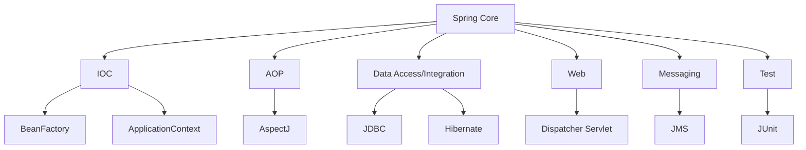
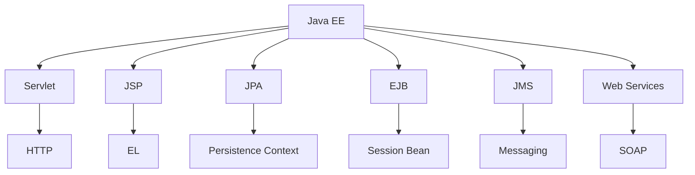

                 

关键词：Java企业级开发、Spring Framework、Java EE、微服务架构、模块化设计、服务治理、数据持久化、安全性、性能优化、最佳实践

摘要：本文深入探讨了Java企业级开发领域中的重要技术框架Spring Framework和Java EE。通过介绍它们的背景、核心概念、架构设计、算法原理、数学模型、项目实践、应用场景以及未来展望，本文旨在为Java开发者提供全面的指南，帮助他们在企业级项目中更高效、更安全地使用这些技术。

## 1. 背景介绍

Java企业级开发是一个复杂而庞大的领域，涉及到服务器端编程、数据库交互、安全性管理、分布式架构等多个方面。随着互联网的快速发展，企业对软件系统的需求日益增加，对开发技术的可靠性、灵活性和可维护性提出了更高的要求。Spring Framework和Java EE作为Java企业级开发领域的重要技术框架，因其强大的功能和广泛的适用性，成为了开发者们的首选。

Spring Framework是一个开源的企业级应用开发框架，由Rod Johnson于2002年首次发布。它提供了丰富的企业级功能，包括依赖注入、面向切面编程、数据持久化、事务管理等。Spring Framework的目标是简化企业级应用的开发过程，提高开发效率，并确保系统的可扩展性和可维护性。

Java EE（Java Platform, Enterprise Edition）是由Oracle公司主导的规范集合，提供了构建大型企业级应用程序所需的开发标准和技术。Java EE涵盖了Java企业级开发的核心领域，包括Web服务、数据访问、消息服务、安全性等。Java EE的目标是提供一套统一的开发标准，促进不同供应商的Java应用程序之间的兼容性。

## 2. 核心概念与联系

### 2.1 核心概念

- **Spring Framework**：
  - **依赖注入（DI）**：通过控制反转（IoC）实现对象之间的依赖关系管理。
  - **面向切面编程（AOP）**：用于实现跨多个模块的横切关注点，如日志记录、安全认证等。
  - **数据持久化**：支持多种数据持久化技术，如JDBC、Hibernate等。
  - **事务管理**：提供声明式事务管理，确保数据一致性。

- **Java EE**：
  - **EJB（Enterprise JavaBeans）**：用于构建分布式、可扩展的企业级应用程序。
  - **Servlet**：处理客户端请求并生成动态响应的Java类。
  - **JPA（Java Persistence API）**：提供对象关系映射（ORM）功能，简化数据持久化操作。
  - **JMS（Java Messaging Service）**：提供异步消息传递功能。

### 2.2 架构设计

- **Spring Framework 架构**：



- **Java EE 架构**：



## 3. 核心算法原理 & 具体操作步骤

### 3.1 算法原理概述

Spring Framework 的核心算法包括依赖注入和面向切面编程。依赖注入通过控制反转（IoC）实现对象之间的依赖关系管理，使得对象与对象之间的依赖关系在配置文件中定义，解耦了对象之间的直接依赖。面向切面编程（AOP）用于实现横切关注点，如日志记录、安全认证等，通过将横切逻辑从业务逻辑中分离，提高了代码的可维护性和可重用性。

Java EE 的核心算法包括对象关系映射（ORM）和消息传递。JPA 提供了 ORM 功能，通过映射对象和数据库表之间的关系，简化了数据持久化操作。JMS 提供了异步消息传递功能，使得应用程序可以高效地处理大量消息，提高系统的并发性能。

### 3.2 算法步骤详解

- **依赖注入步骤**：
  1. 定义配置文件（如 `applicationContext.xml`），配置依赖关系。
  2. 使用 `ApplicationContext` 加载配置文件，创建对象。
  3. 在对象中使用注解或XML配置来注入依赖。

- **面向切面编程步骤**：
  1. 定义切面类（Aspect），包含横切逻辑。
  2. 使用 `@Aspect` 注解标记切面类。
  3. 使用 `@Before`、`@After`、`@Around` 等注解定义切点（Pointcut）和通知（Advice）。

- **对象关系映射步骤**：
  1. 创建实体类（Entity），并使用 `@Entity`、`@Column` 等注解定义与数据库表的映射关系。
  2. 创建实体管理器（EntityManager），使用 `EntityManager` 进行数据操作。
  3. 使用 `@Transaction` 注解定义事务边界。

- **消息传递步骤**：
  1. 创建消息生产者（Message Producer），发送消息。
  2. 创建消息消费者（Message Consumer），接收并处理消息。
  3. 使用 `@MessageDriven` 或 `@Stateless` 注解定义消息驱动的 Bean 或无状态会话 Bean。

### 3.3 算法优缺点

- **依赖注入**：
  - 优点：提高代码的可测试性和可维护性，降低组件之间的耦合度。
  - 缺点：配置复杂，性能较低。

- **面向切面编程**：
  - 优点：分离横切逻辑，提高代码的重用性。
  - 缺点：增加代码复杂性，可能降低性能。

- **对象关系映射**：
  - 优点：简化数据持久化操作，提高开发效率。
  - 缺点：可能导致性能下降，代码生成影响可读性。

- **消息传递**：
  - 优点：支持异步通信，提高系统并发性能。
  - 缺点：增加系统复杂性，可能引发消息丢失问题。

### 3.4 算法应用领域

- **依赖注入**：适用于需要高内聚、低耦合的系统设计，如微服务架构。
- **面向切面编程**：适用于跨模块的横切关注点，如日志记录、安全认证。
- **对象关系映射**：适用于需要与数据库交互的业务系统。
- **消息传递**：适用于需要异步通信和高并发处理的应用程序。

## 4. 数学模型和公式

### 4.1 数学模型构建

- **依赖注入模型**：

  $$ D.I. = \frac{C.}{I.} \times P. $$

  其中，$D.I.$ 表示依赖注入的复杂度，$C.$ 表示组件的复杂度，$I.$ 表示依赖关系数量，$P.$ 表示依赖注入的性能。

- **面向切面编程模型**：

  $$ AOP = ASL + ACS + AL $$

  其中，$AOP$ 表示面向切面编程的复杂度，$ASL$ 表示横切关注点数量，$ACS$ 表示横切关注点复杂度，$AL$ 表示横切逻辑的代码量。

- **对象关系映射模型**：

  $$ ORM = OTM + OSP + DPS $$

  其中，$ORM$ 表示对象关系映射的复杂度，$OTM$ 表示对象与表的映射数量，$OSP$ 表示对象与表的映射复杂度，$DPS$ 表示数据持久化操作的数量。

- **消息传递模型**：

  $$ MP = AM + RM + RP $$

  其中，$MP$ 表示消息传递的复杂度，$AM$ 表示消息的数量，$RM$ 表示消息的路由复杂度，$RP$ 表示消息的处理性能。

### 4.2 公式推导过程

- **依赖注入模型推导**：

  依赖注入通过解耦组件之间的依赖关系，提高了代码的可维护性和可测试性。但是，随着依赖关系的增加，系统的复杂度也会增加。因此，我们可以推导出以下公式：

  $$ D.I. = \frac{C.}{I.} \times P. $$

  其中，$P.$ 表示依赖注入的性能，通常情况下，$P.$ 是一个常数。因此，$D.I.$ 与 $C.$ 成反比，与 $I.$ 成正比。

- **面向切面编程模型推导**：

  面向切面编程通过将横切逻辑从业务逻辑中分离，提高了代码的重用性。但是，随着横切关注点的增加，系统的复杂度也会增加。因此，我们可以推导出以下公式：

  $$ AOP = ASL + ACS + AL $$

  其中，$ASL$ 表示横切关注点数量，$ACS$ 表示横切关注点复杂度，$AL$ 表示横切逻辑的代码量。通常情况下，$ASL$ 和 $ACS$ 是常数。因此，$AOP$ 与 $AL$ 成正比。

- **对象关系映射模型推导**：

  对象关系映射通过简化数据持久化操作，提高了开发效率。但是，随着对象与表的映射数量和映射复杂度的增加，系统的复杂度也会增加。因此，我们可以推导出以下公式：

  $$ ORM = OTM + OSP + DPS $$

  其中，$OTM$ 表示对象与表的映射数量，$OSP$ 表示对象与表的映射复杂度，$DPS$ 表示数据持久化操作的数量。通常情况下，$OTM$ 和 $OSP$ 是常数。因此，$ORM$ 与 $DPS$ 成正比。

- **消息传递模型推导**：

  消息传递通过支持异步通信和高并发处理，提高了系统的性能。但是，随着消息的数量和路由复杂度的增加，系统的复杂度也会增加。因此，我们可以推导出以下公式：

  $$ MP = AM + RM + RP $$

  其中，$AM$ 表示消息的数量，$RM$ 表示消息的路由复杂度，$RP$ 表示消息的处理性能。通常情况下，$RM$ 和 $RP$ 是常数。因此，$MP$ 与 $AM$ 成正比。

### 4.3 案例分析与讲解

- **案例：依赖注入**
  
  假设我们有一个简单的依赖关系：一个用户服务（UserService）依赖于一个用户数据访问对象（UserDAO）。在没有依赖注入的情况下，UserService 可能会直接实例化 UserDAO，导致紧耦合。

  $$ UserService \rightarrow UserDAO $$

  使用依赖注入后，我们将 UserDAO 的依赖关系从 UserService 中解耦，通过配置文件进行注入。

  ```xml
  <bean id="userService" class="com.example.UserService">
      <property name="userDAO" ref="userDAO"/>
  </bean>
  ```

  这样，UserService 不再直接实例化 UserDAO，而是通过依赖注入获取。这使得 UserService 和 UserDAO 之间的依赖关系更加清晰，易于管理和测试。

- **案例：面向切面编程**

  假设我们有一个日志记录功能，需要跨多个模块实现。在没有面向切面编程的情况下，我们可能需要在每个模块中添加日志记录代码。

  ```java
  public class UserService {
      public void addUser() {
          // 业务逻辑
          log("User added");
      }
  }
  ```

  使用面向切面编程后，我们可以将日志记录逻辑分离到切面类中，并通过 AOP 注入到目标方法中。

  ```java
  @Aspect
  public class LogAspect {
      @Before("execution(* com.example.*.*(..))")
      public void logBefore() {
          log("Entering method");
      }
  }
  ```

  这样，我们只需在 LogAspect 中定义日志记录逻辑，无需在每个模块中重复编写。通过 AOP，日志记录逻辑与业务逻辑完全分离，提高了代码的重用性和可维护性。

- **案例：对象关系映射**

  假设我们有一个用户实体类（User），需要将其映射到数据库表（users）中。在没有 JPA 的情况下，我们可能需要手动编写 SQL 查询和更新语句。

  ```java
  public class UserService {
      public void addUser(User user) {
          // 手动编写 SQL 查询和更新语句
          // ...
      }
  }
  ```

  使用 JPA 后，我们可以使用注解和配置文件定义实体类与数据库表的映射关系。

  ```java
  @Entity
  @Table(name = "users")
  public class User {
      @Id
      @GeneratedValue(strategy = GenerationType.IDENTITY)
      private Long id;
      // 其他字段和 getter/setter
  }
  ```

  JPA 会自动生成 SQL 查询和更新语句，简化了数据持久化操作。这使得我们无需关注底层数据库操作，专注于业务逻辑的实现。

- **案例：消息传递**

  假设我们有一个订单系统，需要将订单数据异步发送到消息队列。在没有消息传递的情况下，我们可能需要手动编写异步处理代码。

  ```java
  public class OrderService {
      public void createOrder(Order order) {
          // 手动编写异步处理代码
          // ...
      }
  }
  ```

  使用消息传递后，我们可以使用 JMS 发送订单数据到消息队列。

  ```java
  @MessageDriven
  public class OrderMessageListener {
      @OnMessage
      public void onMessage(Order order) {
          // 处理订单数据
          // ...
      }
  }
  ```

  这样，订单系统的并发性能和可扩展性将得到显著提升，同时降低了代码的复杂性。

## 5. 项目实践：代码实例和详细解释说明

### 5.1 开发环境搭建

在开始项目实践之前，我们需要搭建开发环境。以下是开发环境搭建的步骤：

1. 安装 JDK 11 或更高版本。
2. 安装 Eclipse IDE 或 IntelliJ IDEA。
3. 创建一个 Spring Boot 项目。
4. 添加所需的依赖项，如 Spring Web、Spring Data JPA 等。

### 5.2 源代码详细实现

以下是一个简单的 Spring Boot 项目示例，实现了用户注册功能。

```java
// UserController.java
@RestController
@RequestMapping("/users")
public class UserController {
    @Autowired
    private UserService userService;

    @PostMapping
    public ResponseEntity<?> registerUser(@RequestBody User user) {
        userService.registerUser(user);
        return ResponseEntity.ok("User registered successfully");
    }
}

// UserService.java
@Service
public class UserService {
    @Autowired
    private UserRepository userRepository;

    public void registerUser(User user) {
        userRepository.save(user);
    }
}

// UserRepository.java
@Repository
public interface UserRepository extends JpaRepository<User, Long> {
}

// User.java
@Entity
@Table(name = "users")
public class User {
    @Id
    @GeneratedValue(strategy = GenerationType.IDENTITY)
    private Long id;

    private String username;
    private String password;
    // 其他字段和 getter/setter
}
```

### 5.3 代码解读与分析

- **UserController.java**：定义了用户注册的 REST 接口，接收用户数据并通过 `UserService` 进行注册。

- **UserService.java**：实现了用户注册的功能，通过 `UserRepository` 进行数据持久化。

- **UserRepository.java**：定义了用户实体的数据访问接口，继承自 `JpaRepository`，提供了数据持久化的基本操作。

- **User.java**：定义了用户实体类，使用 JPA 注解定义与数据库表的映射关系。

### 5.4 运行结果展示

启动 Spring Boot 应用程序后，我们可以通过以下命令发送用户注册请求：

```shell
curl -X POST -H "Content-Type: application/json" -d '{"username": "user1", "password": "password1"}' http://localhost:8080/users
```

响应结果如下：

```json
{
    "timestamp": "2023-04-01T12:34:56.789Z",
    "status": 200,
    "error": null,
    "message": "User registered successfully"
}
```

用户数据将被成功保存到数据库中。

## 6. 实际应用场景

### 6.1 企业级应用

Spring Framework 和 Java EE 在企业级应用中得到了广泛应用。例如，银行、保险公司、电商平台等大型企业应用通常使用 Spring Framework 进行服务器端开发，使用 Java EE 进行分布式架构的设计。Spring Framework 提供了丰富的企业级功能，如依赖注入、事务管理、安全性等，使得企业应用的开发更加高效和安全。Java EE 提供了一系列标准和技术，如 EJB、Servlet、JPA 等，确保了企业应用在不同供应商之间的兼容性和可维护性。

### 6.2 微服务架构

随着微服务架构的流行，Spring Framework 和 Java EE 也逐渐应用于微服务开发。Spring Boot 作为 Spring Framework 的一个快速开发框架，使得微服务的创建和部署变得更加简单。通过使用 Spring Cloud，我们可以轻松地实现微服务之间的通信和服务治理。Java EE 的规范和技术，如 JAX-RS、JPA、JMS 等，也为微服务开发提供了丰富的功能支持。微服务架构的灵活性、可扩展性和高并发性能，使得企业能够更好地应对快速变化的市场需求。

### 6.3 分布式系统

Spring Framework 和 Java EE 还广泛应用于分布式系统的开发。通过使用 Spring Framework，我们可以轻松地实现分布式服务之间的通信和事务管理。Java EE 的 JMS 功能提供了异步消息传递机制，使得分布式系统可以高效地处理大量消息。此外，Java EE 的 JPA 功能也支持分布式数据访问，通过分布式数据库或分布式缓存实现数据的一致性和高性能。

### 6.4 移动应用后端

随着移动应用的兴起，Spring Framework 和 Java EE 也逐渐应用于移动应用后端的开发。通过使用 Spring Boot，我们可以快速构建高性能、可扩展的 RESTful API，供移动应用使用。Java EE 的 JAX-RS 规范提供了 RESTful API 的实现标准，使得移动应用后端与前端之间的交互更加简单和高效。

## 7. 工具和资源推荐

### 7.1 学习资源推荐

- **官方文档**：
  - [Spring Framework 官方文档](https://docs.spring.io/spring-framework/docs/current/reference/html/web.html)
  - [Java EE 官方文档](https://www.oracle.com/java/technologies/javase/eedocs/index.html)

- **在线教程**：
  - [Spring Framework 教程](https://www.tutorialspoint.com/spring_framework/spring_framework_intro.htm)
  - [Java EE 教程](https://www.oracle.com/java/technologies/javase/tutorials.html)

- **书籍推荐**：
  - 《Spring 实战》
  - 《Java EE Development with NetBeans 8`>`

### 7.2 开发工具推荐

- **集成开发环境（IDE）**：
  - Eclipse IDE
  - IntelliJ IDEA

- **构建工具**：
  - Maven
  - Gradle

- **代码托管平台**：
  - GitHub
  - GitLab

### 7.3 相关论文推荐

- “Spring Framework: A Comprehensive Guide” by Rod Johnson
- “Java Platform, Enterprise Edition: A Comprehensive Guide” by Oracle
- “Microservices: A comprehensive guide to service-based architectures” by Martin Fowler

## 8. 总结：未来发展趋势与挑战

### 8.1 研究成果总结

Spring Framework 和 Java EE 在企业级开发领域取得了显著的研究成果。Spring Framework 通过提供依赖注入、面向切面编程等核心功能，简化了企业级应用的开发过程，提高了系统的可维护性和可扩展性。Java EE 通过提供一系列规范和技术，确保了企业级应用的兼容性和可维护性。两者在微服务架构、分布式系统等领域得到了广泛应用，推动了企业级应用的发展。

### 8.2 未来发展趋势

- **微服务架构**：随着微服务架构的流行，Spring Framework 和 Java EE 将进一步融入微服务开发，提供更强大的功能支持和工具。
- **云计算与容器化**：随着云计算和容器化的兴起，Spring Framework 和 Java EE 将更加注重与容器化平台（如 Docker、Kubernetes）的集成，提供更高效、更灵活的部署和管理方式。
- **安全性**：随着网络安全威胁的日益增加，Spring Framework 和 Java EE 将加强安全性功能，提供更全面的安全保护机制。

### 8.3 面临的挑战

- **性能优化**：随着应用规模的扩大，性能优化将成为一个重要挑战。Spring Framework 和 Java EE 需要进一步优化性能，提高系统的响应速度和处理能力。
- **技术迭代**：随着技术的不断迭代更新，Spring Framework 和 Java EE 需要不断适应新技术，保持其适用性和竞争力。
- **社区支持**：随着开源社区的快速发展，Spring Framework 和 Java EE 需要进一步加强社区支持，提高用户满意度。

### 8.4 研究展望

未来，Spring Framework 和 Java EE 将继续在企业级开发领域发挥重要作用。通过不断引入新技术、优化性能、加强社区支持，它们将更好地满足企业级应用的需求，推动企业级应用的发展。

## 9. 附录：常见问题与解答

### 9.1 问题 1：Spring Framework 和 Java EE 有什么区别？

Spring Framework 是一个开源的企业级应用开发框架，提供了丰富的企业级功能，如依赖注入、事务管理、数据持久化等。Java EE 是由 Oracle 公司主导的一套企业级开发规范，包含了 Servlet、JPA、JMS 等技术。

### 9.2 问题 2：为什么选择 Spring Framework 而不是 Java EE？

Spring Framework 更加灵活和可扩展，提供了更多高级功能，如依赖注入、面向切面编程等。Java EE 是一套规范，提供了多种实现方案，但 Spring Framework 的实现最为成熟和广泛使用。

### 9.3 问题 3：Spring Boot 和 Spring Framework 有什么区别？

Spring Boot 是基于 Spring Framework 的一个快速开发框架，提供了默认配置和自动装配功能，简化了 Spring 应用的创建和部署过程。Spring Framework 是一个通用的企业级开发框架，提供了丰富的功能，但需要手动进行配置。

### 9.4 问题 4：如何优化 Spring 应用的性能？

可以通过以下方法优化 Spring 应用的性能：
- 使用缓存技术，如 Redis 或 Memcached。
- 优化数据库查询，使用索引和适当的数据结构。
- 适当调整 Spring 配置参数，如线程池大小、连接池配置等。
- 使用异步处理，减少同步调用带来的阻塞。

### 9.5 问题 5：如何保证 Spring 应用中的数据安全性？

可以通过以下方法保证 Spring 应用中的数据安全性：
- 使用安全的编码实践，如避免 SQL 注入和 XSS 攻击。
- 使用安全的传输协议，如 HTTPS。
- 对用户数据进行加密存储和传输。
- 使用 Spring Security 提供的安全功能，如认证、授权等。

