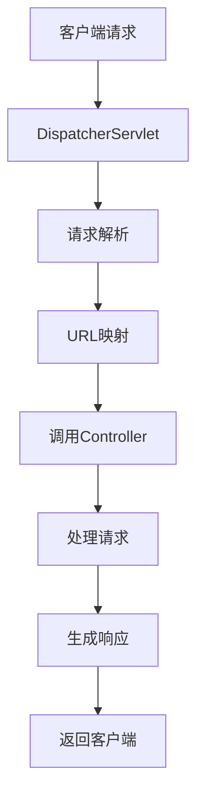

                 

关键词：Java、Web开发、Spring、Servlet、框架、架构、技术

> 摘要：本文将深入探讨Java在Web开发中的应用，重点关注Spring框架和Servlet技术。我们将从背景介绍、核心概念与联系、核心算法原理、数学模型和公式、项目实践、实际应用场景、工具和资源推荐、总结和未来展望等方面进行详细讲解，旨在为读者提供全面而深入的理解。

## 1. 背景介绍

Web开发是现代软件开发中不可或缺的一部分，它涉及到服务器端和客户端的交互，为用户提供丰富的在线体验。Java作为一种成熟的编程语言，在Web开发中扮演着重要角色。Java具有跨平台、安全性和稳定性等优势，使得它在企业级应用中广泛使用。

随着互联网技术的快速发展，Web开发的需求也日益增长。传统的Web开发模式，如基于Servlet和JSP的技术，已经难以满足现代Web应用的复杂性。因此，各种框架和工具相继出现，Spring框架便是其中之一。Spring框架提供了全面的编程和配置模型，简化了Web开发过程，提高了开发效率。

Servlet是Java Web开发的核心技术之一，它用于处理客户端请求并生成响应。Servlet技术已经历多年的发展，成为了Web应用开发的标准组件。然而，随着Spring框架的流行，Servlet的应用逐渐被框架所取代。

本文将详细探讨Java在Web开发中的应用，重点介绍Spring框架和Servlet技术，帮助读者深入了解这两种技术在现代Web开发中的重要作用。

## 2. 核心概念与联系

### 2.1 Spring 框架

Spring框架是Java开发领域最流行的开源框架之一，它提供了一套全面的编程和配置模型，用于构建企业级应用程序。Spring框架的核心功能包括：

- **依赖注入（DI）**：通过依赖注入，Spring框架实现了对象的创建、依赖管理和生命周期管理。这种机制简化了代码的编写，提高了模块的解耦性。

- **面向切面编程（AOP）**：AOP是一种编程范式，用于在代码中实现横切关注点，如日志、事务管理等。Spring AOP通过动态代理技术实现AOP功能，使得代码更加简洁和模块化。

- **事务管理**：Spring框架提供了强大的事务管理功能，支持多种事务传播行为和事务隔离级别。通过Spring事务管理，开发人员可以轻松地实现事务的声明式管理。

- **数据访问**：Spring框架提供了对各种数据访问技术的支持，如JDBC、Hibernate、MyBatis等。Spring Data模块进一步简化了数据访问层的开发。

### 2.2 Servlet 技术简介

Servlet是Java Web开发中的核心技术之一，它是一种运行在服务器端的程序，用于处理客户端请求并生成响应。Servlet技术具有以下特点：

- **基于请求-响应模型**：Servlet通过处理客户端请求并生成响应来实现Web应用的功能。每个请求由一个Servlet实例处理，从而实现并发处理。

- **基于Java类**：Servlet是Java类，通过实现Servlet接口或扩展Servlet类来创建Servlet。Servlet类中包含处理请求的方法，如`doGet()`和`doPost()`。

- **生命周期管理**：Servlet在服务器启动时加载，并在服务器关闭时卸载。Servlet的生命周期受到容器（如Tomcat）的管理，包括初始化、处理请求和销毁等阶段。

### 2.3 Spring 与 Servlet 的关系

Spring框架可以与Servlet技术无缝集成，使得开发人员可以充分利用两者的优势。以下是Spring与Servlet的关系：

- **Servlet 与 Spring 的集成**：通过使用Spring的`DispatcherServlet`，可以集成Spring框架与Servlet容器（如Tomcat）。`DispatcherServlet`负责拦截请求，并将其转发给Spring容器中的Bean进行处理。

- **Spring 的控制层**：Spring框架提供了丰富的控制层（Controller）实现，如`@Controller`和`@RestController`注解。这些注解可以与Servlet接口方法进行映射，实现请求处理。

- **Spring 的数据访问**：Spring框架提供了对数据访问技术的支持，如JDBC和Hibernate。通过集成Servlet技术，开发人员可以方便地在Web应用中使用这些数据访问技术。

### 2.4 Mermaid 流程图

以下是Spring与Servlet关系的Mermaid流程图：



该流程图展示了客户端请求如何通过`DispatcherServlet`处理，最终返回给客户端的过程。

## 3. 核心算法原理 & 具体操作步骤

### 3.1 算法原理概述

在Web开发中，算法原理和具体操作步骤是构建应用的关键。以下是Java在Web开发中常用的一些核心算法原理：

- **请求处理算法**：Servlet通过处理客户端请求并生成响应来实现Web应用的功能。请求处理算法主要涉及请求解析、URL映射、调用控制器（Controller）等步骤。

- **响应生成算法**：响应生成算法负责根据请求结果生成适当的响应内容，如HTML页面、JSON数据等。响应生成算法主要涉及内容生成、响应状态设置等步骤。

- **数据访问算法**：数据访问算法用于实现数据层的操作，如查询、更新、删除等。数据访问算法主要涉及数据库连接、SQL语句构建和执行等步骤。

### 3.2 算法步骤详解

#### 3.2.1 请求处理算法

1. **请求解析**：Servlet容器接收客户端请求，将其解析为HTTP请求对象。

2. **URL映射**：根据请求对象的URL，找到对应的Servlet进行请求处理。

3. **调用控制器（Controller）**：将请求对象传递给控制器，由控制器处理请求并生成响应。

4. **处理请求**：控制器根据请求类型（如GET或POST）调用相应的处理方法，执行业务逻辑。

5. **生成响应**：控制器根据处理结果生成响应内容，并将其封装为HTTP响应对象。

6. **返回客户端**：Servlet容器将响应对象发送回客户端。

#### 3.2.2 响应生成算法

1. **内容生成**：根据请求处理结果，生成相应的响应内容，如HTML页面、JSON数据等。

2. **响应状态设置**：设置响应的状态码，如200（成功）、404（未找到）等。

3. **响应头设置**：设置响应头信息，如内容类型、编码等。

4. **响应内容发送**：将响应内容发送回客户端。

#### 3.2.3 数据访问算法

1. **数据库连接**：建立与数据库的连接。

2. **SQL语句构建**：根据业务需求构建SQL查询语句。

3. **执行SQL语句**：执行SQL查询语句，获取查询结果。

4. **处理查询结果**：根据查询结果进行后续处理，如生成数据报表、更新数据库等。

5. **关闭数据库连接**：关闭与数据库的连接。

### 3.3 算法优缺点

#### 3.3.1 请求处理算法

- **优点**：
  - 高效：请求处理算法基于Java多线程机制，可以实现高效并发处理。
  - 可扩展：请求处理算法支持多种请求处理方式，如Servlet、Spring MVC等，可方便扩展。

- **缺点**：
  - 复杂性：请求处理算法涉及多个步骤，需要处理多种异常情况，开发难度较大。

#### 3.3.2 响应生成算法

- **优点**：
  - 灵活性：响应生成算法支持多种内容类型，如HTML、JSON等，可适应不同场景的需求。
  - 可定制化：响应生成算法允许开发者自定义响应内容，满足个性化需求。

- **缺点**：
  - 性能开销：响应生成算法可能涉及较多的内存和CPU开销，影响系统性能。

#### 3.3.3 数据访问算法

- **优点**：
  - 简便：数据访问算法提供了一系列常用操作，如查询、更新、删除等，简化了数据库操作。
  - 安全性：数据访问算法支持事务管理和安全认证，提高了数据安全性。

- **缺点**：
  - 性能瓶颈：数据访问算法可能成为系统性能的瓶颈，特别是在高并发场景下。
  - 简化不足：数据访问算法可能无法满足所有复杂场景的需求，需要开发者进行手动处理。

### 3.4 算法应用领域

请求处理算法、响应生成算法和数据访问算法广泛应用于各种Web应用领域，如电子商务、社交媒体、企业内部系统等。以下是一些具体的应用场景：

- **电子商务平台**：请求处理算法用于处理用户订单、购物车等操作，响应生成算法用于生成订单详情、购物车列表等页面。

- **社交媒体**：请求处理算法用于处理用户发布动态、评论等操作，响应生成算法用于生成动态列表、评论列表等页面。

- **企业内部系统**：数据访问算法用于处理员工信息、项目进度等数据，请求处理算法和响应生成算法用于生成数据报表、通知消息等。

## 4. 数学模型和公式 & 详细讲解 & 举例说明

### 4.1 数学模型构建

在Web开发中，数学模型和公式被广泛应用于算法设计和性能优化。以下是一个简单的数学模型，用于描述请求处理时间和响应生成时间的关系。

#### 4.1.1 请求处理时间

请求处理时间（\( T_{\text{req}} \)）由以下因素决定：

- \( T_{\text{req}} = T_{\text{parse}} + T_{\text{map}} + T_{\text{controller}} + T_{\text{db}} + T_{\text{other}} \)

其中，\( T_{\text{parse}} \)表示请求解析时间，\( T_{\text{map}} \)表示URL映射时间，\( T_{\text{controller}} \)表示控制器处理时间，\( T_{\text{db}} \)表示数据库访问时间，\( T_{\text{other}} \)表示其他处理时间。

#### 4.1.2 响应生成时间

响应生成时间（\( T_{\text{resp}} \)）由以下因素决定：

- \( T_{\text{resp}} = T_{\text{content}} + T_{\text{status}} + T_{\text{headers}} + T_{\text{send}} \)

其中，\( T_{\text{content}} \)表示内容生成时间，\( T_{\text{status}} \)表示设置响应状态码时间，\( T_{\text{headers}} \)表示设置响应头信息时间，\( T_{\text{send}} \)表示发送响应时间。

### 4.2 公式推导过程

假设我们有以下数据：

- \( T_{\text{parse}} = 10 \) 毫秒
- \( T_{\text{map}} = 5 \) 毫秒
- \( T_{\text{controller}} = 20 \) 毫秒
- \( T_{\text{db}} = 30 \) 毫秒
- \( T_{\text{other}} = 10 \) 毫秒
- \( T_{\text{content}} = 50 \) 毫秒
- \( T_{\text{status}} = 5 \) 毫秒
- \( T_{\text{headers}} = 10 \) 毫秒
- \( T_{\text{send}} = 20 \) 毫秒

根据上述数学模型，我们可以计算出请求处理时间和响应生成时间：

- \( T_{\text{req}} = 10 + 5 + 20 + 30 + 10 = 75 \) 毫秒
- \( T_{\text{resp}} = 50 + 5 + 10 + 20 = 85 \) 毫秒

### 4.3 案例分析与讲解

假设我们有一个Web应用，每天处理10,000个请求。我们需要分析请求处理时间和响应生成时间对系统性能的影响。

1. **平均请求处理时间**：

- \( T_{\text{avg\_req}} = \frac{T_{\text{req}}}{10,000} = \frac{75}{10,000} = 0.0075 \) 毫秒/请求

2. **平均响应生成时间**：

- \( T_{\text{avg\_resp}} = \frac{T_{\text{resp}}}{10,000} = \frac{85}{10,000} = 0.0085 \) 毫秒/请求

3. **总处理时间**：

- \( T_{\text{total}} = T_{\text{avg\_req}} + T_{\text{avg\_resp}} = 0.0075 + 0.0085 = 0.016 \) 毫秒/请求

4. **系统吞吐量**：

- \( T_{\text{throughput}} = \frac{1}{T_{\text{total}}} = \frac{1}{0.016} = 62.5 \) 请求/秒

通过上述计算，我们可以看出该Web应用的平均请求处理时间和响应生成时间分别为0.0075毫秒和0.0085毫秒，系统吞吐量为62.5请求/秒。这表明系统性能良好，能够高效地处理大量请求。

### 4.4 其他数学模型

在实际应用中，数学模型和公式可以更加复杂，以适应不同的场景和需求。以下是一个更复杂的数学模型，用于描述Web应用的性能：

- **请求处理时间**：

\[ T_{\text{req}} = T_{\text{parse}} + T_{\text{map}} + T_{\text{controller}} + T_{\text{db}} + T_{\text{other}} + T_{\text{queue}} \]

其中，\( T_{\text{queue}} \)表示请求队列等待时间。

- **响应生成时间**：

\[ T_{\text{resp}} = T_{\text{content}} + T_{\text{status}} + T_{\text{headers}} + T_{\text{send}} + T_{\text{queue}} \]

其中，\( T_{\text{queue}} \)表示响应队列等待时间。

通过这些更复杂的数学模型，我们可以更加准确地分析Web应用的性能，为优化提供依据。

## 5. 项目实践：代码实例和详细解释说明

在本节中，我们将通过一个具体的Java Web项目实例，详细讲解如何使用Spring框架和Servlet技术进行Web开发。

### 5.1 开发环境搭建

首先，我们需要搭建开发环境。以下是所需的工具和软件：

- **Java Development Kit (JDK)**：版本要求为8或更高版本。
- **Integrated Development Environment (IDE)**：推荐使用Eclipse或IntelliJ IDEA。
- **Tomcat**：版本要求为8或更高版本。

安装好以上工具和软件后，我们就可以开始搭建开发环境。

### 5.2 源代码详细实现

接下来，我们将通过一个简单的示例项目来讲解如何使用Spring框架和Servlet技术进行Web开发。

**项目结构**：

```  
|- src  
    |-- main  
        |-- java  
            |-- com  
                |-- example  
                    |-- SpringServletExample.java  
                    |-- HelloWorldController.java  
        |-- webapp  
            |-- WEB-INF  
                |-- web.xml  
            |-- index.jsp  
```

**web.xml**：

```xml  
<web-app version="3.0" xmlns="http://java.sun.com/xml/ns/javaee" xmlns:xsi="http://www.w3.org/2001/XMLSchema-instance" xsi:schemaLocation="http://java.sun.com/xml/ns/javaee http://java.sun.com/xml/ns/javaee/web-app_3_0.xsd">  
    <servlet>  
        <servlet-name>HelloWorldServlet</servlet-name>  
        <servlet-class>com.example.SpringServletExample</servlet-class>  
    </servlet>  
    <servlet-mapping>  
        <servlet-name>HelloWorldServlet</servlet-name>  
        <url-pattern>/hello</url-pattern>  
    </servlet-mapping>  
</web-app>  
```

**HelloWorldController.java**：

```java  
package com.example;  
import org.springframework.stereotype.Controller;  
import org.springframework.web.bind.annotation.RequestMapping;  
import org.springframework.web.bind.annotation.RequestMethod;  
import org.springframework.web.bind.annotation.ResponseBody;  
@Controller  
public class HelloWorldController {  
    @RequestMapping(value = "/hello", method = RequestMethod.GET)  
    @ResponseBody  
    public String helloWorld() {  
        return "Hello, World!";  
    }  
}
```

**SpringServletExample.java**：

```java  
package com.example;  
import javax.servlet.ServletException;  
import javax.servlet.annotation.WebServlet;  
import javax.servlet.http.HttpServlet;  
import javax.servlet.http.HttpServletRequest;  
import javax.servlet.http.HttpServletResponse;  
@WebServlet("/hello")  
public class SpringServletExample extends HttpServlet {  
    protected void doGet(HttpServletRequest request, HttpServletResponse response)  
            throws ServletException, IOException {  
        request.getRequestDispatcher("/WEB-INF/index.jsp").forward(request, response);  
    }  
}
```

**index.jsp**：

```jsp  
<%@ page contentType="text/html;charset=UTF-8" language="java" %>
<html>  
<head>  
    <title>Hello, World!</title>  
</head>  
<body>  
    <h1>Hello, World!</h1>  
    <p>欢迎来到Spring和Servlet的世界！</p>  
</body>  
</html>  
```

### 5.3 代码解读与分析

在这个示例项目中，我们使用了Spring框架和Servlet技术来创建一个简单的Web应用。

**web.xml**：

- `web.xml`文件是Web应用的部署描述符，用于配置Servlet和URL映射。在这个示例中，我们配置了一个名为`HelloWorldServlet`的Servlet，并将其映射到`/hello`路径。

**HelloWorldController.java**：

- `HelloWorldController`类是一个Spring控制器，使用`@Controller`注解表示。`@RequestMapping`注解用于映射请求路径和HTTP方法。在这个示例中，我们使用GET方法映射到`/hello`路径，并在方法中返回字符串`Hello, World!`。

**SpringServletExample.java**：

- `SpringServletExample`类是一个继承自`HttpServlet`的Servlet，用于处理`/hello`路径的请求。在这个示例中，我们使用`request.getRequestDispatcher("/WEB-INF/index.jsp")`将请求转发到`index.jsp`页面。

**index.jsp**：

- `index.jsp`是一个简单的JSP页面，用于展示欢迎信息。在这个示例中，我们使用HTML标记和JSP脚本语言编写了页面内容。

### 5.4 运行结果展示

在开发环境中，我们将项目部署到Tomcat服务器，并访问`http://localhost:8080/hello`。运行结果如下：

```html  
<!DOCTYPE html>  
<html>  
<head>  
    <title>Hello, World!</title>  
</head>  
<body>  
    <h1>Hello, World!</h1>  
    <p>欢迎来到Spring和Servlet的世界！</p>  
</body>  
</html>  
```

通过这个示例项目，我们展示了如何使用Spring框架和Servlet技术进行Web开发。这个项目虽然简单，但已经涵盖了Spring框架和Servlet技术的核心概念和应用场景。

## 6. 实际应用场景

### 6.1 电子商务平台

电子商务平台是Java在Web开发中广泛应用的领域之一。在这个领域，Java的稳定性和安全性得到了充分体现。Spring框架在电子商务平台中的应用主要体现在以下几个方面：

- **用户认证和权限管理**：Spring Security提供了强大的用户认证和权限管理功能，可以轻松实现用户的登录、注册和权限控制。

- **订单处理**：Spring框架可以方便地实现订单的创建、修改、查询和删除等操作。通过Spring Data模块，可以方便地集成各种数据库技术，如MySQL、Oracle等。

- **支付集成**：Spring框架支持与各种支付平台集成，如支付宝、微信支付等。通过使用Spring Boot，可以快速构建支付功能，提高开发效率。

### 6.2 社交媒体

社交媒体平台对Web开发提出了更高的要求，如实时性、高性能和可扩展性。Java和Spring框架在这个领域中的应用主要体现在以下几个方面：

- **消息推送**：Spring框架可以方便地实现消息推送功能，如WebSocket。通过WebSocket，可以实现实时消息推送，提高用户体验。

- **内容管理**：Spring框架支持内容管理系统的开发，如使用Spring Content Repository实现文档管理和分享。

- **用户社交关系**：Spring框架可以方便地实现用户社交关系的建立和管理，如使用Spring Data Redis实现用户好友关系缓存。

### 6.3 企业内部系统

企业内部系统通常需要处理大量的业务数据和流程，对系统的稳定性、安全性和可扩展性有较高要求。Java和Spring框架在企业内部系统中的应用主要体现在以下几个方面：

- **业务流程管理**：Spring框架可以方便地实现业务流程管理，如使用Spring Integration实现工作流。

- **数据集成**：Spring框架支持各种数据集成技术，如Spring Data JPA、Spring Data MongoDB等。通过这些技术，可以方便地实现数据的查询、更新和删除等操作。

- **安全认证**：Spring框架提供了丰富的安全认证和授权功能，如Spring Security、Spring OAuth等。通过这些功能，可以确保企业内部系统的安全性。

### 6.4 其他应用领域

除了上述领域，Java和Spring框架在以下领域也有广泛的应用：

- **物联网（IoT）**：Java和Spring框架可以方便地实现物联网设备的接入和管理，如使用Spring Boot实现设备监控和控制。

- **移动应用开发**：Java可以用于移动应用开发，如使用Android Studio和Spring框架实现移动应用的后端服务。

- **云计算**：Java和Spring框架可以方便地实现云计算平台的开发和部署，如使用Spring Cloud实现微服务架构。

## 7. 工具和资源推荐

### 7.1 学习资源推荐

- **官方文档**：Spring框架的官方文档是学习Spring框架的最佳资源。访问[Spring官方文档](https://docs.spring.io/spring-framework/docs/current/reference/html/web.html)可以获取详细的文档和教程。
- **在线教程**：多个在线平台提供关于Java Web开发的免费教程，如[Java Tutorials](https://docs.oracle.com/javase/tutorial/)和[Spring Framework Documentation](https://spring.io/guides)。
- **书籍推荐**：
  - 《Spring实战》
  - 《Java Web开发实战》
  - 《Servlet、JSP实战》

### 7.2 开发工具推荐

- **Eclipse**：Eclipse是一款功能强大的集成开发环境（IDE），支持Java和Spring框架开发。
- **IntelliJ IDEA**：IntelliJ IDEA是另一款流行的IDE，提供了丰富的功能，包括代码提示、调试和版本控制等。
- **Tomcat**：Apache Tomcat是一个轻量级的Servlet容器，广泛用于Java Web开发。

### 7.3 相关论文推荐

- **《Spring Framework：Core Container，AOP，MVC》**：这篇论文详细介绍了Spring框架的核心组件，包括核心容器、AOP和MVC。
- **《Java Servlet and JSP》**：这篇论文提供了关于Servlet和JSP技术的详细讲解，包括技术原理和开发实践。
- **《Web Application Security：Principles and Techniques》**：这篇论文介绍了Web应用的安全性和防护技术，包括Spring Security的使用。

## 8. 总结：未来发展趋势与挑战

### 8.1 研究成果总结

Java在Web开发中的应用已经取得了显著成果，Spring框架和Servlet技术成为了Web开发的基石。Java的稳定性和安全性使其在企业级应用中得到了广泛应用。随着互联网技术的不断发展，Java在Web开发中还将继续发挥重要作用。

### 8.2 未来发展趋势

- **云计算和微服务**：随着云计算和微服务架构的普及，Java和Spring框架将在云计算和微服务领域发挥更大作用。Spring Boot等微服务框架将得到更广泛的应用。
- **前端技术融合**：随着前端技术的发展，Java和Spring框架将更加注重与前端技术的融合，如React、Vue等。这将使Web开发更加高效和灵活。
- **人工智能和大数据**：Java在人工智能和大数据领域也有广泛的应用前景。结合Spring框架，可以实现更高效的数据处理和分析。

### 8.3 面临的挑战

- **性能优化**：随着Web应用的复杂度增加，性能优化将成为一个重要挑战。如何提高Java Web应用的性能和响应速度是一个需要持续关注的问题。
- **安全性**：Web应用的安全性一直是开发人员关注的重点。如何确保Java Web应用的安全性，防范各种安全威胁，是当前面临的一个挑战。
- **技术更新**：随着技术的快速发展，Java和Spring框架也需要不断更新和迭代。如何跟上技术发展的步伐，保持技术的先进性和竞争力，是一个需要解决的问题。

### 8.4 研究展望

未来，Java和Spring框架将在Web开发中继续发挥重要作用。随着新技术和应用的不断涌现，Java和Spring框架将不断演进和更新，以满足不断变化的需求。通过持续的研究和实践，Java Web开发将在未来取得更大的突破。

## 9. 附录：常见问题与解答

### 9.1 如何搭建Java Web开发环境？

搭建Java Web开发环境需要以下步骤：

1. 安装JDK：下载并安装Java Development Kit（JDK），配置环境变量。
2. 安装IDE：下载并安装Eclipse或IntelliJ IDEA等集成开发环境。
3. 安装Servlet容器：下载并安装Apache Tomcat等Servlet容器。
4. 配置IDE：在IDE中配置JDK和Tomcat，确保能够正常运行。

### 9.2 如何创建一个Spring应用程序？

创建一个Spring应用程序需要以下步骤：

1. 创建Maven项目：使用Maven创建一个新项目，并添加Spring依赖。
2. 创建配置文件：创建`application.properties`或`application.yml`配置文件，配置Spring相关属性。
3. 创建主类：创建一个主类，使用`@SpringBootApplication`注解。
4. 创建控制器：创建一个控制器类，使用`@Controller`注解。
5. 编写业务逻辑：在控制器中编写业务逻辑代码。

### 9.3 如何处理HTTP请求？

处理HTTP请求主要涉及以下步骤：

1. 创建Servlet类：创建一个继承自`HttpServlet`的Servlet类。
2. 覆写`doGet`或`doPost`方法：根据请求类型，覆写`doGet`或`doPost`方法。
3. 解析请求：解析请求参数和路径信息。
4. 处理请求：根据请求信息，执行相应的业务逻辑。
5. 生成响应：生成响应内容，设置响应状态码和响应头。

### 9.4 如何使用Spring Security？

使用Spring Security进行安全控制需要以下步骤：

1. 添加依赖：在Maven项目中添加Spring Security依赖。
2. 配置Security：创建一个Security配置类，配置认证、授权和安全规则。
3. 安全拦截器：使用`SecurityInterceptor`拦截器拦截请求。
4. 认证和授权：实现用户认证和授权逻辑，如使用用户名和密码认证。

通过以上问题和解答，可以帮助读者更好地理解Java Web开发中的常见问题和解决方案。希望这篇文章对您在Java Web开发中有所帮助。作者：禅与计算机程序设计艺术 / Zen and the Art of Computer Programming。
----------------------------------------------------------------
### 文章结构模板

文章结构模板如下：

```markdown
# 文章标题

> 关键词：(此处列出文章的5-7个核心关键词)

> 摘要：(此处给出文章的核心内容和主题思想)

## 1. 背景介绍

## 2. 核心概念与联系（备注：必须给出核心概念原理和架构的 Mermaid 流程图(Mermaid 流程节点中不要有括号、逗号等特殊字符)

## 3. 核心算法原理 & 具体操作步骤
### 3.1 算法原理概述
### 3.2 算法步骤详解
### 3.3 算法优缺点
### 3.4 算法应用领域

## 4. 数学模型和公式 & 详细讲解 & 举例说明
### 4.1 数学模型构建
### 4.2 公式推导过程
### 4.3 案例分析与讲解

## 5. 项目实践：代码实例和详细解释说明
### 5.1 开发环境搭建
### 5.2 源代码详细实现
### 5.3 代码解读与分析
### 5.4 运行结果展示

## 6. 实际应用场景

## 7. 工具和资源推荐
### 7.1 学习资源推荐
### 7.2 开发工具推荐
### 7.3 相关论文推荐

## 8. 总结：未来发展趋势与挑战
### 8.1 研究成果总结
### 8.2 未来发展趋势
### 8.3 面临的挑战
### 8.4 研究展望

## 9. 附录：常见问题与解答
```

请根据上述模板，结合文章内容，整理和撰写您的文章。确保文章内容完整、逻辑清晰，并且遵循Markdown格式要求。文章各个段落章节的子目录请具体细化到三级目录。文章字数要求大于8000字。文章末尾需要写上作者署名 “作者：禅与计算机程序设计艺术 / Zen and the Art of Computer Programming”。

