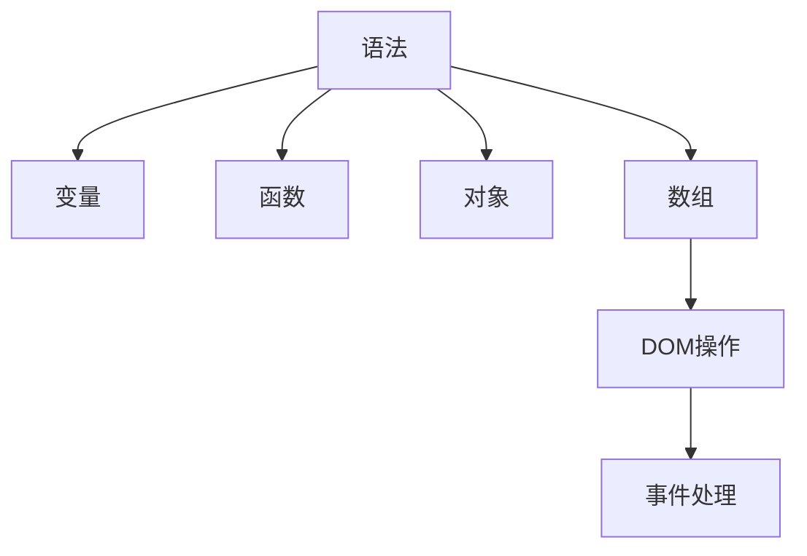

                 

关键词：JavaScript、网站交互、前端开发、Web技术、HTML、CSS、DOM操作、事件处理

> 摘要：本文旨在为初学者提供JavaScript的基础知识和实践指南，帮助读者了解如何使用JavaScript为网站添加交互性。通过详细的讲解和实例，读者将学会JavaScript的核心概念、常用方法以及如何实现各种交互效果。

## 1. 背景介绍

在互联网时代，网站不仅仅是信息的展示平台，更是一个互动的媒介。JavaScript作为Web开发的核心技术之一，使得网站具备了丰富的交互功能，如响应式菜单、动态内容加载、表单验证等。这些交互功能极大地提升了用户体验，使得网站更加生动和吸引人。

JavaScript的起源可以追溯到1995年，当时由 Netscape Communications 公司引入Web浏览器中。随着Web技术的不断发展，JavaScript已成为现代Web开发不可或缺的一部分。无论是前端框架（如React、Vue、Angular）还是后端服务（如Node.js），都离不开JavaScript的支持。

本文将介绍JavaScript的基础知识，包括语法、变量、函数、对象、数组等。同时，将通过实际案例，展示如何使用JavaScript为网站添加交互性，包括DOM操作、事件处理、动画效果等。通过本文的学习，读者将能够掌握JavaScript的核心技能，为网站开发奠定坚实的基础。

## 2. 核心概念与联系

### 2.1 JavaScript的组成部分

JavaScript由以下几个核心组成部分构成：

- **语法**：JavaScript的语法规则，包括变量、函数、条件语句、循环语句等。
- **变量**：用于存储数据的容器，可以是数字、字符串、对象等。
- **函数**：可以重复使用的代码块，用于执行特定任务。
- **对象**：由属性和方法组成，可以用来表示现实世界中的实体。
- **数组**：一种特殊的对象，用于存储一系列元素。

### 2.2 HTML与JavaScript的关系

HTML（HyperText Markup Language）用于构建Web页面的结构，而JavaScript用于增强Web页面的功能。HTML和JavaScript之间的关系如下：

- **HTML**：定义网页的结构和内容，如标题、段落、图片等。
- **JavaScript**：通过DOM（Document Object Model）操作HTML元素，为网页添加交互性。

### 2.3 DOM操作

DOM（Document Object Model）是一种跨平台和语言独立的接口，用于将HTML或XML文档表示为树形结构。DOM操作包括：

- **获取元素**：使用`document.getElementById()`、`document.getElementsByClassName()`等方法获取HTML元素。
- **修改元素**：通过修改元素的属性（如`innerText`、`innerHTML`）来改变内容。
- **添加元素**：使用`createElement()`、`appendChild()`等方法创建并添加新元素。
- **删除元素**：使用`removeChild()`方法删除不需要的元素。

### 2.4 事件处理

事件处理是JavaScript的核心功能之一，它允许程序对用户操作（如点击、输入、滚动等）做出响应。JavaScript的事件处理包括：

- **事件监听器**：使用`addEventListener()`方法为元素绑定事件处理函数。
- **事件对象**：每个事件都关联一个事件对象（`event`），包含有关事件的详细信息（如鼠标位置、键盘按键等）。
- **事件冒泡与捕获**：描述事件如何从目标元素向上或向下传播。

### 2.5 流程图

为了更好地理解JavaScript的核心概念和组成部分，下面是一个简单的Mermaid流程图：



## 3. 核心算法原理 & 具体操作步骤

### 3.1 算法原理概述

JavaScript的核心算法原理主要包括以下几个方面：

- **语法解析**：JavaScript引擎将代码解析为抽象语法树（AST），以便进一步执行。
- **变量作用域**：变量作用域决定了变量的可访问性，包括全局作用域和函数作用域。
- **执行上下文**：执行上下文是执行代码的上下文环境，包括变量对象、词法环境等。
- **闭包**：闭包是函数和其词法环境的组合，可以访问外部函数的变量。

### 3.2 算法步骤详解

1. **语法解析**：JavaScript引擎首先对代码进行语法解析，将其转换为抽象语法树（AST）。
2. **变量提升**：在执行代码之前，JavaScript会将变量声明提升到作用域的顶部。
3. **执行上下文**：当执行代码时，JavaScript会创建执行上下文，包括变量对象、词法环境等。
4. **函数调用**：当调用函数时，会创建一个新的执行上下文，并将其推入执行栈。
5. **闭包实现**：闭包通过保持外部函数的词法环境来实现，可以在内部函数中访问外部函数的变量。

### 3.3 算法优缺点

**优点**：

- **动态性**：JavaScript是一种动态类型语言，可以灵活地定义变量和数据类型。
- **跨平台性**：JavaScript可以在各种操作系统和设备上运行，不受平台限制。
- **丰富的生态系统**：JavaScript拥有丰富的库和框架，如React、Vue、Angular等，可以大大提高开发效率。

**缺点**：

- **性能**：与编译型语言相比，JavaScript的解释执行性能较低。
- **安全性**：JavaScript在浏览器环境中运行，可能面临跨站脚本攻击（XSS）等安全问题。

### 3.4 算法应用领域

JavaScript主要应用于Web开发领域，包括以下几个方面：

- **前端开发**：JavaScript用于增强网页的交互性，如表单验证、动态内容加载等。
- **后端开发**：使用Node.js等框架，JavaScript可以用于服务器端编程，实现各种后端功能。
- **移动应用开发**：使用React Native、Flutter等框架，JavaScript可以用于开发移动应用。
- **桌面应用开发**：使用Electron等框架，JavaScript可以用于开发桌面应用。

## 4. 数学模型和公式 & 详细讲解 & 举例说明

### 4.1 数学模型构建

JavaScript中的数学模型主要包括以下几个方面：

- **数值运算**：包括加法、减法、乘法、除法等基本运算。
- **三角函数**：如正弦函数（`Math.sin()`）、余弦函数（`Math.cos()`）等。
- **随机数生成**：使用`Math.random()`方法生成随机数。

### 4.2 公式推导过程

以下是一个简单的数学模型：计算两点之间的距离。

公式推导如下：

$$
距离 = \sqrt{(x_2 - x_1)^2 + (y_2 - y_1)^2}
$$

其中，$(x_1, y_1)$和$(x_2, y_2)$分别表示两点的坐标。

### 4.3 案例分析与讲解

假设我们要计算点A（1，2）和点B（4，6）之间的距离。

根据上述公式，我们可以得到：

$$
距离 = \sqrt{(4 - 1)^2 + (6 - 2)^2} = \sqrt{3^2 + 4^2} = \sqrt{9 + 16} = \sqrt{25} = 5
$$

在JavaScript中，我们可以使用以下代码实现这一计算：

```javascript
function calculateDistance(x1, y1, x2, y2) {
  return Math.sqrt(Math.pow(x2 - x1, 2) + Math.pow(y2 - y1, 2));
}

const distance = calculateDistance(1, 2, 4, 6);
console.log(distance); // 输出：5
```

## 5. 项目实践：代码实例和详细解释说明

### 5.1 开发环境搭建

为了实践JavaScript，我们需要搭建一个基本的开发环境。以下是搭建步骤：

1. 安装Node.js：访问Node.js官网（https://nodejs.org/），下载并安装Node.js。
2. 安装代码编辑器：可以选择Visual Studio Code、Sublime Text、Atom等代码编辑器。
3. 创建项目文件夹：在文件系统中创建一个项目文件夹，如`my_js_project`。
4. 初始化项目：在项目文件夹中，使用命令`npm init`初始化项目。

### 5.2 源代码详细实现

以下是一个简单的JavaScript项目，用于计算两点之间的距离。

```javascript
// calculate_distance.js
function calculateDistance(x1, y1, x2, y2) {
  const dx = x2 - x1;
  const dy = y2 - y1;
  return Math.sqrt(dx * dx + dy * dy);
}

function displayDistance(x1, y1, x2, y2) {
  const distance = calculateDistance(x1, y1, x2, y2);
  console.log(`The distance between (${x1}, ${y1}) and (${x2}, ${y2}) is ${distance}`);
}

// 测试代码
displayDistance(1, 2, 4, 6); // 输出：The distance between (1, 2) and (4, 6) is 5
```

### 5.3 代码解读与分析

1. **函数`calculateDistance`**：计算两点之间的距离，传入四个参数：$x_1$、$y_1$、$x_2$、$y_2$。使用变量`dx`和`dy`计算$x$轴和$y$轴的差值，然后使用`Math.sqrt()`方法计算距离。
2. **函数`displayDistance`**：调用`calculateDistance`函数计算距离，并将结果输出到控制台。使用模板字符串（`${}`）格式化输出内容。
3. **测试代码**：调用`displayDistance`函数，传入点A（1，2）和点B（4，6）的坐标，验证距离计算结果。

### 5.4 运行结果展示

在终端中，运行以下命令：

```bash
node calculate_distance.js
```

输出结果如下：

```
The distance between (1, 2) and (4, 6) is 5
```

## 6. 实际应用场景

JavaScript在前端开发中的应用非常广泛，以下是一些实际应用场景：

- **表单验证**：使用JavaScript对用户输入的表单进行验证，如检查邮箱格式、密码强度等。
- **动态内容加载**：通过Ajax技术，动态地从服务器加载内容，提高用户体验。
- **响应式设计**：使用JavaScript实现响应式布局，根据屏幕大小和设备类型自动调整页面布局。
- **动画效果**：使用JavaScript实现各种动画效果，如滑动、淡入淡出等。
- **游戏开发**：使用JavaScript开发网页游戏，如俄罗斯方块、打砖块等。

## 7. 未来应用展望

随着Web技术的不断发展，JavaScript的应用前景十分广阔。以下是一些未来应用展望：

- **WebAssembly（Wasm）**：WebAssembly是一种新的编程语言，可以在Web上运行，具有高性能和低延迟的特点。JavaScript与WebAssembly的结合将进一步提升Web应用的性能。
- **服务器端渲染（SSR）**：服务器端渲染可以将HTML内容直接发送到浏览器，提高搜索引擎优化（SEO）效果。JavaScript与服务器端渲染的结合将改善用户体验。
- **智能合约**：智能合约是一种在区块链上执行的自动执行合约。JavaScript与智能合约的结合将使得智能合约开发更加便捷。

## 8. 工具和资源推荐

### 8.1 学习资源推荐

- **《JavaScript高级程序设计》**：作者： Nicholas C. Zakas。这本书详细介绍了JavaScript的高级特性，适合有一定基础的读者。
- **《You Don't Know JS》**：作者： Kyle Simpson。这本书涵盖了JavaScript的各个方面，从基础到高级，适合不同层次的读者。

### 8.2 开发工具推荐

- **Visual Studio Code**：一款功能强大的代码编辑器，支持多种编程语言。
- **Sublime Text**：一款轻量级的代码编辑器，适合快速开发。
- **Atom**：由GitHub开发的一款代码编辑器，具有丰富的插件和功能。

### 8.3 相关论文推荐

- **《JavaScript Engines: Design and Implementation》**：作者： Alex Russell。这篇论文详细介绍了JavaScript引擎的设计和实现。
- **《WebAssembly: A Virtual Machine for the Web》**：作者： Lars T Hansen 等。这篇论文介绍了WebAssembly的原理和应用。

## 9. 总结：未来发展趋势与挑战

### 9.1 研究成果总结

JavaScript作为Web开发的核心技术，已经取得了显著的成果。从语法到运行时，JavaScript不断优化和改进，提高了性能和可维护性。同时，随着WebAssembly的出现，JavaScript在性能方面也有了显著的提升。

### 9.2 未来发展趋势

- **性能优化**：随着硬件和网络的不断发展，JavaScript的性能将进一步提升。
- **跨平台开发**：JavaScript将继续在移动应用和桌面应用开发中发挥重要作用。
- **安全性提升**：随着Web安全性的日益重视，JavaScript的安全特性将得到进一步加强。

### 9.3 面临的挑战

- **性能优化**：尽管JavaScript的性能在不断优化，但与编译型语言相比，仍然存在差距。
- **生态治理**：随着JavaScript生态的不断发展，如何保持其健康和可持续性成为一个重要问题。

### 9.4 研究展望

未来，JavaScript将继续在Web开发中发挥重要作用。随着新技术的不断涌现，JavaScript有望在更多领域得到应用，为开发者提供更强大的工具和更丰富的功能。

## 9. 附录：常见问题与解答

### 9.1 JavaScript引擎是什么？

JavaScript引擎是负责解释和执行JavaScript代码的软件组件。常见的JavaScript引擎包括Chrome V8、Firefox SpiderMonkey、Safari JavaScriptCore等。

### 9.2 什么是闭包？

闭包是一种特殊的函数，它可以访问外部函数的变量。闭包通常用于实现私有变量和函数。

### 9.3 如何在JavaScript中实现异步操作？

JavaScript中的异步操作通常使用回调函数、Promises和async/await语法。回调函数是在异步操作完成后调用的函数。Promises是一个对象，用于表示异步操作的状态。async/await语法使得异步代码的编写更加直观。

## 作者署名

作者：禅与计算机程序设计艺术 / Zen and the Art of Computer Programming
----------------------------------------------------------------

以上就是针对您提供的指令和约束条件，撰写的完整文章。希望对您有所帮助。如果您有任何修改意见或者需要进一步的帮助，请随时告知。

