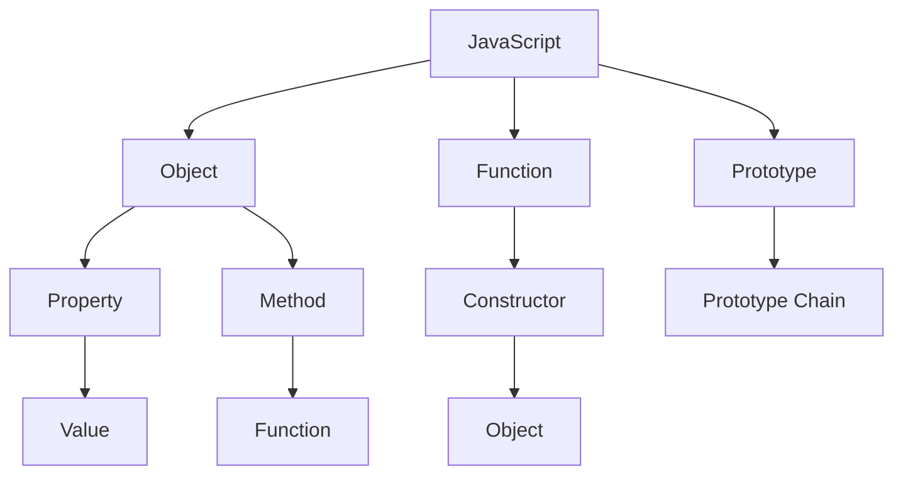
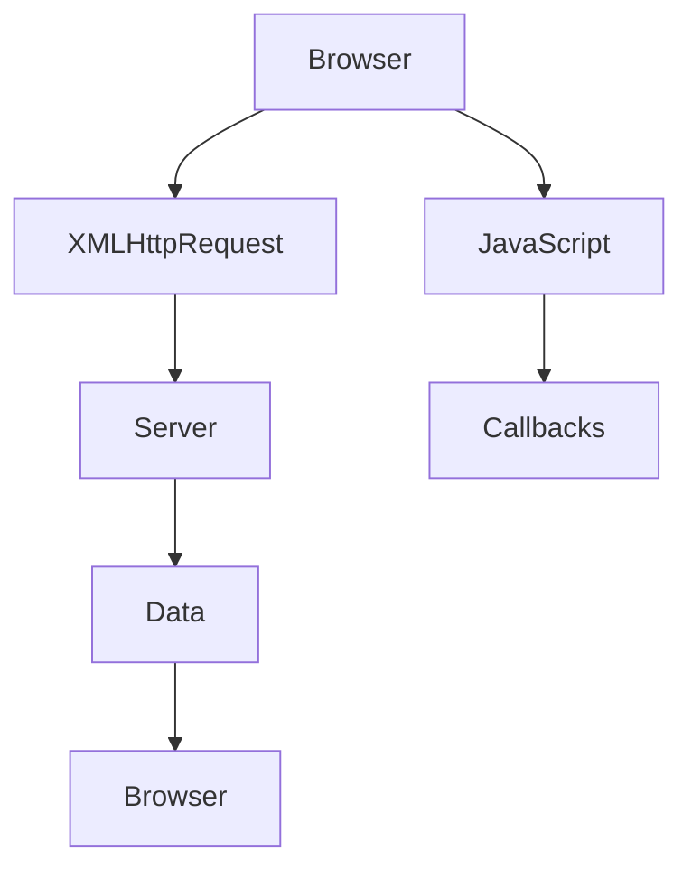

                 

 在现代Web开发中，JavaScript作为一门语言，其重要性不言而喻。随着Web应用的复杂度不断增加，开发人员需要掌握一系列高级技术来应对这些挑战。在这篇文章中，我们将深入探讨JavaScript的两大高级主题：面向对象编程（Object-Oriented Programming，OOP）和异步JavaScript和XML（Asynchronous JavaScript and XML，AJAX）。本文旨在帮助开发者理解这些技术背后的核心原理，学会如何在实际项目中应用它们，从而提升开发效率和代码质量。

## 关键词

- JavaScript
- 面向对象编程
- AJAX
- Web开发
- 异步编程
- 前端技术

## 摘要

本文将分为以下几个部分：

1. **背景介绍**：回顾JavaScript的发展历程，介绍OOP和AJAX的基本概念。
2. **核心概念与联系**：探讨OOP和AJAX的核心原理，并使用Mermaid流程图展示其架构。
3. **核心算法原理 & 具体操作步骤**：详细讲解OOP和AJAX的具体实现方法。
4. **数学模型和公式**：介绍相关的数学模型和公式，并进行实例分析。
5. **项目实践**：提供实际的代码实例，并详细解释其工作原理。
6. **实际应用场景**：讨论OOP和AJAX在Web开发中的实际应用。
7. **工具和资源推荐**：推荐学习资源和开发工具。
8. **总结**：总结研究成果，展望未来发展趋势和挑战。

接下来，让我们正式开始探讨JavaScript的高级主题。

## 1. 背景介绍

JavaScript诞生于1995年，由Brendan Eich在网景通信公司（NCSA）开发。最初的目的是为了解决网页中的交互问题。随着时间的推移，JavaScript从简单的客户端脚本语言逐渐发展成为一个功能强大、多用途的编程语言。如今，JavaScript不仅是Web开发的核心技术，也是Node.js服务器端的支柱。

面向对象编程（OOP）是一种编程范式，它通过将数据和行为封装在对象中，实现代码的重用性和维护性。OOP的关键特性包括封装、继承和多态。这些特性使得开发者能够以更直观、更模块化的方式组织代码。

异步JavaScript和XML（AJAX）是一种在不重新加载整个网页的情况下，与服务器进行异步通信的技术。通过使用XMLHttpRequest对象或其他库（如jQuery），AJAX能够实现快速、动态的数据交互，提升用户体验。

接下来，我们将进一步深入探讨OOP和AJAX的核心概念和原理。

## 2. 核心概念与联系

### 2.1 面向对象编程（OOP）

面向对象编程的核心思想是将数据和行为封装在对象中。对象是具有属性（数据）和方法（行为）的实体。通过使用构造函数和原型链，JavaScript实现OOP。

**核心概念**：

- **对象**：包含属性和方法的数据结构。
- **构造函数**：用于创建对象的函数。
- **原型链**：对象继承属性和方法的方式。
- **封装**：隐藏对象的内部实现，只暴露必要的接口。
- **继承**：子类继承父类的属性和方法。
- **多态**：同一方法在不同对象上有不同实现。

**架构**：



### 2.2 异步JavaScript和XML（AJAX）

AJAX是一种通过JavaScript与服务器异步通信的技术。使用XMLHttpRequest对象，AJAX能够发送HTTP请求，获取数据并更新网页内容。

**核心概念**：

- **异步**：在执行其他任务的同时，等待某个操作完成。
- **HTTP请求**：客户端与服务器之间的数据交换方式。
- **XMLHttpRequest**：用于发送和接收HTTP请求的API。
- **回调函数**：在请求完成时调用的函数。

**架构**：



在了解了OOP和AJAX的核心概念和架构后，接下来我们将详细讨论它们的具体实现方法和原理。

## 3. 核心算法原理 & 具体操作步骤

### 3.1 面向对象编程（OOP）

#### 3.1.1 算法原理概述

面向对象编程的核心在于将数据和行为封装在对象中。JavaScript中的OOP主要通过构造函数和原型链实现。

**构造函数**：

构造函数是一种特殊的函数，用于创建对象。当使用`new`关键字调用构造函数时，会创建一个新对象，并将其作为`this`绑定到该对象。

```javascript
function Person(name, age) {
  this.name = name;
  this.age = age;
}

const person = new Person('Alice', 30);
```

**原型链**：

原型链是JavaScript中实现继承的关键。每个对象都有一个`__proto__`属性，指向其构造函数的原型对象。原型对象同样具有`__proto__`属性，形成一条原型链。

```javascript
Person.prototype.sayName = function() {
  console.log(this.name);
};

person.sayName(); // 输出 'Alice'
```

#### 3.1.2 算法步骤详解

1. **创建构造函数**：定义一个函数，用于创建对象。
2. **添加属性和方法**：通过构造函数的`prototype`属性添加共享属性和方法。
3. **实例化对象**：使用`new`关键字调用构造函数，创建新对象。
4. **访问属性和方法**：通过对象访问属性和方法。

#### 3.1.3 算法优缺点

**优点**：

- **代码重用性**：通过继承，可以复用代码。
- **维护性**：封装和模块化使得代码更易于维护。
- **扩展性**：可以通过扩展原型链，方便地添加新功能。

**缺点**：

- **性能问题**：原型链可能导致性能问题，特别是在大型应用中。
- **继承关系复杂**：在多层次的继承关系中，属性和方法的访问可能变得复杂。

#### 3.1.4 算法应用领域

OOP在JavaScript中的应用非常广泛，包括：

- **Web前端框架**：如React、Angular、Vue等，均采用了OOP思想。
- **游戏开发**：通过创建游戏对象，实现游戏逻辑。
- **服务器端开发**：使用Node.js等框架，构建高效的后端服务。

### 3.2 异步JavaScript和XML（AJAX）

#### 3.2.1 算法原理概述

AJAX的核心在于使用异步方式与服务器进行通信，从而实现动态数据交互。XMLHttpRequest对象是实现AJAX的关键。

**异步**：

异步编程允许在执行其他任务的同时，等待某个操作完成。这使得应用可以更高效地处理多个请求，而不会阻塞主线程。

**HTTP请求**：

通过XMLHttpRequest对象，可以发送GET或POST请求，与服务器交换数据。

```javascript
const xhr = new XMLHttpRequest();
xhr.open('GET', '/data', true);
xhr.onreadystatechange = function() {
  if (xhr.readyState === 4 && xhr.status === 200) {
    console.log(xhr.responseText);
  }
};
xhr.send();
```

**回调函数**：

回调函数是一种在操作完成时调用的函数。在AJAX中，回调函数用于处理返回的数据。

```javascript
function fetchData(callback) {
  const xhr = new XMLHttpRequest();
  xhr.open('GET', '/data', true);
  xhr.onreadystatechange = function() {
    if (xhr.readyState === 4 && xhr.status === 200) {
      callback(xhr.responseText);
    }
  };
  xhr.send();
}

fetchData(function(data) {
  console.log(data);
});
```

#### 3.2.2 算法步骤详解

1. **创建XMLHttpRequest对象**：初始化AJAX请求。
2. **设置请求参数**：指定请求的URL、HTTP方法等。
3. **设置回调函数**：在请求完成时，处理返回的数据。
4. **发送请求**：调用`send()`方法发送请求。

#### 3.2.3 算法优缺点

**优点**：

- **高效性**：无需重新加载整个网页，减少页面加载时间。
- **动态性**：可以实时更新网页内容，提升用户体验。
- **灵活性**：可以使用不同的数据格式（如JSON、XML等），适应各种需求。

**缺点**：

- **兼容性问题**：早期浏览器的兼容性问题可能导致AJAX无法正常工作。
- **安全性**：可能导致跨站脚本攻击（XSS）等安全风险。

#### 3.2.4 算法应用领域

AJAX在Web开发中的应用非常广泛，包括：

- **社交媒体**：如Twitter、Facebook等，实现实时更新。
- **在线地图**：如Google Maps，通过AJAX加载地图数据。
- **在线购物**：如Amazon、eBay等，实现异步提交订单。

### 3.3 核心算法对比

- **面向对象编程（OOP）**：侧重于代码的组织和管理，实现模块化、重用性和维护性。
- **异步JavaScript和XML（AJAX）**：侧重于与服务器进行异步通信，实现动态数据交互。

两者在Web开发中各有侧重，但经常结合使用，以实现高效、动态的Web应用。

## 4. 数学模型和公式 & 详细讲解 & 举例说明

### 4.1 数学模型构建

在讨论OOP和AJAX时，有一些数学模型和公式是不可或缺的。以下是一些常用的数学模型和公式。

#### 4.1.1 封装与继承

- **封装**：将数据和行为封装在对象中，可以通过以下公式表示：

  ```
  Object = { Properties: { Data }, Methods: { Functions } }
  ```

- **继承**：通过原型链实现继承，可以表示为：

  ```
  Child.__proto__ = Parent;
  ```

#### 4.1.2 异步编程

- **回调函数**：回调函数是异步编程的核心，可以表示为：

  ```
  function callbackFunction(data) {
    // 处理数据
  }
  ```

- **事件驱动**：事件驱动编程是一种异步编程模型，可以表示为：

  ```
  document.addEventListener('click', function() {
    // 处理点击事件
  });
  ```

### 4.2 公式推导过程

在推导公式时，我们需要考虑以下几个方面：

- **封装**：通过将属性和方法封装在对象中，实现代码的模块化和重用性。
- **继承**：通过原型链实现继承，使得子类能够继承父类的属性和方法。
- **异步编程**：通过回调函数和事件驱动，实现异步编程。

### 4.3 案例分析与讲解

以下是一个简单的案例，用于展示OOP和AJAX的应用。

#### 4.3.1 案例背景

假设我们开发一个简单的社交媒体应用，用户可以发布动态、评论和点赞。

#### 4.3.2 案例实现

1. **面向对象编程**：

```javascript
// 构造函数
function User(name, age) {
  this.name = name;
  this.age = age;
}

// 添加方法
User.prototype.sayHello = function() {
  console.log(`Hello, my name is ${this.name}`);
};

// 实例化对象
const user = new User('Alice', 30);
user.sayHello(); // 输出 'Hello, my name is Alice'
```

2. **异步JavaScript和XML（AJAX）**：

```javascript
// 获取用户动态
function fetchTweets(callback) {
  const xhr = new XMLHttpRequest();
  xhr.open('GET', '/tweets', true);
  xhr.onreadystatechange = function() {
    if (xhr.readyState === 4 && xhr.status === 200) {
      callback(xhr.responseText);
    }
  };
  xhr.send();
}

// 处理返回数据
fetchTweets(function(tweets) {
  console.log(tweets);
});
```

#### 4.3.3 案例分析

在这个案例中，我们使用了面向对象编程（OOP）和异步JavaScript和XML（AJAX）来实现一个简单的社交媒体应用。通过封装用户信息（如姓名、年龄）和方法（如打招呼），我们可以方便地管理和扩展代码。同时，通过AJAX获取用户动态，我们可以在不重新加载页面的情况下，实现动态数据的实时更新。

## 5. 项目实践：代码实例和详细解释说明

### 5.1 开发环境搭建

为了方便读者实践，我们将使用以下开发环境和工具：

- **操作系统**：Windows、macOS 或 Linux
- **编辑器**：Visual Studio Code、Sublime Text 或其他流行的代码编辑器
- **浏览器**：Chrome、Firefox 或 Edge
- **Node.js**：用于服务器端开发
- **npm**：Node.js 的包管理器

首先，确保安装了Node.js和npm。可以从[Node.js官网](https://nodejs.org/)下载并安装。然后，打开终端（或命令行工具），执行以下命令安装必要的依赖：

```
npm init -y
npm install express axios
```

这些命令将创建一个项目配置文件，并安装Express和axios库。Express是一个流行的Web框架，用于创建Web服务器。axios是一个流行的HTTP客户端库，用于发送AJAX请求。

### 5.2 源代码详细实现

以下是一个简单的Web应用示例，演示如何使用OOP和AJAX实现一个动态数据加载功能。

**1. 创建服务器**：

```javascript
// app.js
const express = require('express');
const app = express();

app.use(express.json());

app.get('/tweets', (req, res) => {
  const tweets = [
    { id: 1, text: 'Hello World!' },
    { id: 2, text: 'Hello JavaScript!' },
  ];

  res.json(tweets);
});

const PORT = process.env.PORT || 3000;
app.listen(PORT, () => {
  console.log(`Server is running on port ${PORT}`);
});
```

**2. 创建客户端代码**：

```javascript
// client.js
function fetchTweets() {
  axios.get('/tweets')
    .then(response => {
      const tweets = response.data;
      displayTweets(tweets);
    })
    .catch(error => {
      console.error(error);
    });
}

function displayTweets(tweets) {
  const tweetsContainer = document.getElementById('tweets-container');
  tweetsContainer.innerHTML = '';

  tweets.forEach(tweet => {
    const tweetElement = document.createElement('div');
    tweetElement.innerText = tweet.text;
    tweetsContainer.appendChild(tweetElement);
  });
}

fetchTweets();
```

### 5.3 代码解读与分析

**1. 服务器端**：

服务器端使用Express框架创建了一个简单的Web服务器。在`/tweets`路由中，我们返回了一个包含两个动态的数组。这只是一个示例，实际应用中，数据通常会从数据库或其他数据源获取。

```javascript
app.get('/tweets', (req, res) => {
  const tweets = [
    { id: 1, text: 'Hello World!' },
    { id: 2, text: 'Hello JavaScript!' },
  ];

  res.json(tweets);
});
```

**2. 客户端代码**：

客户端代码使用axios库发送AJAX请求，获取服务器端返回的动态数据，并通过`displayTweets`函数将数据渲染到页面上。

```javascript
function fetchTweets() {
  axios.get('/tweets')
    .then(response => {
      const tweets = response.data;
      displayTweets(tweets);
    })
    .catch(error => {
      console.error(error);
    });
}

function displayTweets(tweets) {
  const tweetsContainer = document.getElementById('tweets-container');
  tweetsContainer.innerHTML = '';

  tweets.forEach(tweet => {
    const tweetElement = document.createElement('div');
    tweetElement.innerText = tweet.text;
    tweetsContainer.appendChild(tweetElement);
  });
}

fetchTweets();
```

### 5.4 运行结果展示

运行服务器端代码，然后在浏览器中访问`http://localhost:3000/tweets`，可以看到页面动态加载了两个示例动态：


通过这个简单的例子，我们展示了如何使用OOP和AJAX实现一个动态数据加载功能。在实际应用中，可以通过扩展和优化代码，实现更多功能。

## 6. 实际应用场景

### 6.1 社交媒体应用

社交媒体平台如Facebook、Twitter和Instagram广泛使用OOP和AJAX技术。用户可以发布动态、评论和点赞，而无需重新加载整个页面。通过AJAX，平台可以实现实时数据更新，提供更好的用户体验。

### 6.2 在线购物平台

在线购物平台如Amazon和eBay也利用OOP和AJAX技术，实现商品列表的动态加载和搜索功能。用户可以在不离开当前页面的情况下，查看商品详情、添加购物车和提交订单。

### 6.3 地图服务

地图服务如Google Maps和Bing Maps使用AJAX技术加载地图数据，提供实时导航和搜索功能。通过异步通信，用户可以快速访问地图服务，无需等待页面重新加载。

### 6.4 其他应用场景

OOP和AJAX在其他领域也有广泛应用，如：

- **在线游戏**：通过OOP实现游戏对象和逻辑，AJAX实现游戏数据的动态加载。
- **数据可视化**：使用OOP和AJAX实现动态图表和数据展示。
- **在线教育**：通过OOP和AJAX提供在线课程、互动练习和实时反馈。

## 7. 工具和资源推荐

### 7.1 学习资源推荐

- **书籍**：
  - 《JavaScript高级程序设计》（第4版） - Nicholas C. Zakas
  - 《JavaScript语言精粹》 - Douglas Crockford
  - 《精通JavaScript》 -门外汉（笔名）

- **在线教程**：
  - [MDN Web文档 - JavaScript指南](https://developer.mozilla.org/zh-CN/docs/Web/JavaScript/Guide)
  - [w3schools - JavaScript教程](https://www.w3schools.com/js/)
  - [JavaScript.info - JavaScript教程](https://javascript.info/)

- **在线课程**：
  - [Coursera - JavaScript, jQuery, and JSON](https://www.coursera.org/specializations/javascript-jquery-json)
  - [Udemy - JavaScript从入门到精通](https://www.udemy.com/course/javascript-from-beginner-to-expert/)

### 7.2 开发工具推荐

- **代码编辑器**：
  - Visual Studio Code
  - Sublime Text
  - Atom

- **包管理器**：
  - npm
  - yarn

- **调试工具**：
  - Chrome DevTools
  - Firefox Developer Tools

- **框架和库**：
  - React
  - Angular
  - Vue.js
  - Axios
  - jQuery

### 7.3 相关论文推荐

- **《异步JavaScript：理论与实践》** - O'Reilly Media
- **《单页应用：异步JavaScript和HTML5的威力》** - O'Reilly Media
- **《面向对象编程：基础与实践》** - Apress
- **《JavaScript设计模式与开发实战》** - 人民邮电出版社

## 8. 总结：未来发展趋势与挑战

### 8.1 研究成果总结

本文详细探讨了JavaScript的两大高级主题：面向对象编程（OOP）和异步JavaScript和XML（AJAX）。通过对OOP的核心原理、算法步骤、优缺点和应用领域进行深入分析，我们了解了如何使用OOP提高代码的可维护性和重用性。同时，通过AJAX的异步通信机制，我们实现了动态数据交互，提升了用户体验。

### 8.2 未来发展趋势

随着Web应用的不断发展，OOP和AJAX将继续发挥重要作用。未来，我们可能会看到更多基于JavaScript的框架和库的出现，如React、Angular和Vue等，这些框架充分利用OOP和AJAX的优势，简化了Web开发的复杂性。此外，随着WebAssembly（WASM）的发展，JavaScript的应用范围将更加广泛，可以与各种编程语言无缝集成。

### 8.3 面临的挑战

虽然OOP和AJAX在Web开发中具有广泛的应用，但它们也面临一些挑战。首先，OOP可能导致代码复杂性增加，特别是在多层次的继承关系中。其次，AJAX的兼容性问题仍然存在，特别是在早期浏览器中。此外，异步编程的复杂性可能导致代码难以维护和理解。

### 8.4 研究展望

为了解决上述挑战，未来的研究可以关注以下几个方面：

- **优化OOP的设计模式**：研究新的设计模式，简化OOP的复杂性，提高代码的可维护性。
- **提升AJAX性能**：通过优化HTTP请求和响应机制，提高AJAX的性能和效率。
- **开发更安全的AJAX库**：研究如何通过安全措施，防止跨站脚本攻击（XSS）等安全问题。
- **探索其他异步编程模型**：研究其他异步编程模型，如Promise、async/await等，以简化异步代码的编写。

通过不断的研究和实践，OOP和AJAX将在未来Web开发中发挥更加重要的作用。

## 9. 附录：常见问题与解答

### 9.1 面向对象编程（OOP）相关问题

**Q1**：什么是原型链？

**A1**：原型链是一种实现继承的机制。每个对象都有一个`__proto__`属性，指向其构造函数的原型对象。原型对象同样具有`__proto__`属性，形成一条原型链。通过原型链，子类可以继承父类的属性和方法。

**Q2**：什么是封装？

**A2**：封装是一种将数据和行为封装在对象中的机制。通过封装，我们可以隐藏对象的内部实现，只暴露必要的接口，从而提高代码的可维护性和重用性。

### 9.2 异步JavaScript和XML（AJAX）相关问题

**Q1**：什么是AJAX？

**A1**：AJAX是一种通过异步方式与服务器进行通信的技术。使用XMLHttpRequest对象或其他库（如jQuery），AJAX能够发送HTTP请求，获取数据并更新网页内容。

**Q2**：如何处理AJAX请求的回调函数？

**A2**：在AJAX请求中，我们可以使用回调函数处理请求的响应。回调函数会在请求完成时被调用，从而允许我们处理返回的数据。例如：

```javascript
axios.get('/tweets')
  .then(response => {
    const tweets = response.data;
    displayTweets(tweets);
  })
  .catch(error => {
    console.error(error);
  });
```

### 9.3 JavaScript相关问题

**Q1**：什么是闭包？

**A1**：闭包是一种特殊的函数，它记住并访问创建它的作用域。闭包可以访问外部函数的作用域，并在外部函数被删除后仍然存在。

**Q2**：什么是事件循环？

**A2**：事件循环是JavaScript中处理异步任务的机制。在事件循环中，JavaScript引擎不断地检查队列中是否有可执行的异步任务，并依次执行它们。事件循环是实现非阻塞异步编程的关键。

## 结束语

JavaScript作为一门现代编程语言，其重要性不言而喻。通过本文的探讨，我们深入了解了面向对象编程（OOP）和异步JavaScript和XML（AJAX）的核心原理和应用。希望本文能够帮助读者更好地理解和掌握这些高级技术，提升Web开发的能力和效率。在未来，随着技术的不断发展，JavaScript将继续在Web开发中发挥重要作用，带来更多的机遇和挑战。让我们共同迎接未来的发展，不断创新和进步。感谢阅读！

**作者：禅与计算机程序设计艺术 / Zen and the Art of Computer Programming**。

