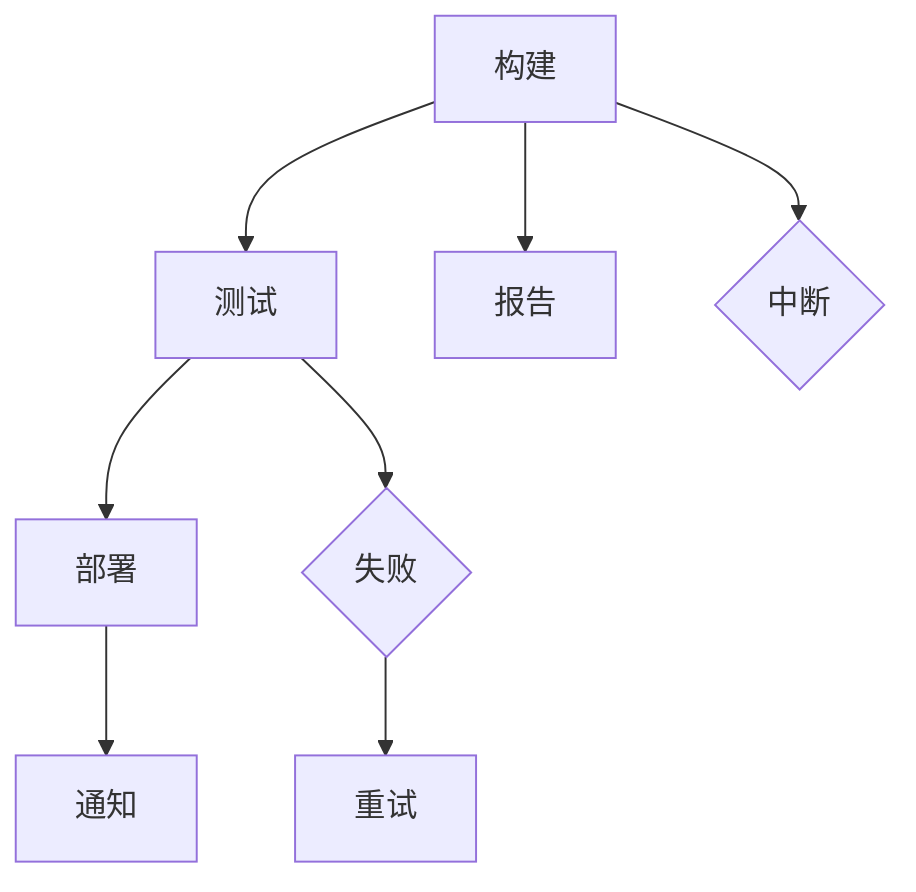

                 

 关键词：Jenkins, Pipeline, 脚本开发, CI/CD, DevOps, 软件构建, 持续集成

> 摘要：本文将深入探讨Jenkins Pipeline脚本的开发与应用，旨在为开发者提供一套清晰、高效、易于理解的指南。我们将从背景介绍、核心概念、算法原理、数学模型、项目实践、应用场景、未来展望等多个角度进行全面解析，帮助您更好地理解和掌握Jenkins Pipeline脚本开发的技巧与艺术。

## 1. 背景介绍

Jenkins是一种流行的开源自动化工具，被广泛应用于持续集成（Continuous Integration，CI）和持续交付（Continuous Delivery，CD）过程中。Jenkins的Pipeline插件是其生态系统中的重要组成部分，它提供了一种声明式的方式，使得开发者能够通过简单的脚本定义和自动化复杂的工作流程。

Pipeline插件的出现，使得Jenkins在持续集成和持续交付领域变得更加灵活和强大。通过Pipeline，我们可以定义一系列构建、测试和部署任务，并将它们组织成一个连贯的流水线，从而实现自动化和高效的软件交付。

### 1.1 持续集成（CI）与持续交付（CD）

持续集成和持续交付是现代软件开发中至关重要的概念。持续集成（CI）强调通过频繁的代码提交和自动化测试，确保代码库始终处于可部署状态。而持续交付（CD）则进一步扩展了CI的理念，通过自动化部署流程，实现从开发到生产环境的无缝过渡。

Jenkins作为CI/CD工具的代表，其核心价值在于通过自动化，减少手动操作，提高开发效率，并确保软件质量。而Pipeline插件则使得这一过程变得更加简便和高效。

### 1.2 Jenkins与Pipeline的关系

Jenkins本身是一款功能强大的自动化服务器，通过安装各种插件，可以实现几乎任何自动化任务。而Pipeline插件则是Jenkins生态系统中的一个重要组成部分，它提供了如下优势：

- **声明式语法**：Pipeline使用一种类似于英语的声明式语法，使得定义自动化流程变得直观和易读。
- **灵活性**：Pipeline支持多种触发方式和并行执行，使得工作流程更加灵活。
- **集成性**：Pipeline可以与Jenkins的其他插件无缝集成，如Git、Docker等，实现更复杂的自动化流程。

## 2. 核心概念与联系

在深入探讨Jenkins Pipeline脚本开发之前，我们需要了解一些核心概念和它们之间的关系。以下是一个简化的Mermaid流程图，展示了这些概念的基本架构：



### 2.1 关键概念

- **构建（Build）**：构建是将源代码编译、打包成可执行文件的过程。
- **测试（Test）**：测试是验证构建结果的正确性和稳定性的过程。
- **部署（Deploy）**：部署是将构建后的软件部署到生产环境的过程。
- **报告（Report）**：报告是记录构建、测试和部署过程的结果。
- **通知（Notify）**：通知是在构建、测试或部署过程中，将结果通知给相关人员。

### 2.2 工作流程

以上概念组成了Jenkins Pipeline的基本工作流程：

1. **构建**：源代码通过Jenkins从版本控制系统（如Git）检出，并进行编译和打包。
2. **测试**：构建后的软件包会被一系列自动化测试所验证。
3. **部署**：测试通过后，软件包会被部署到预生产或生产环境。
4. **报告**：构建、测试和部署的结果会被记录并生成报告。
5. **通知**：相关人员会根据报告结果收到通知。

### 2.3 失败与重试

在某些情况下，构建、测试或部署可能会失败。为了确保软件的可靠性，Pipeline支持失败后的重试机制：

- **失败**：如果构建、测试或部署失败，流程会中断。
- **重试**：可以通过设置重试次数和间隔时间，自动尝试恢复失败的任务。

### 2.4 中断与异常处理

在某些情况下，可能需要提前终止Pipeline流程。此外，Pipeline还提供了异常处理机制，以便在遇到不可预见的错误时，能够优雅地处理并恢复流程。

## 3. 核心算法原理 & 具体操作步骤

### 3.1 算法原理概述

Jenkins Pipeline的核心算法原理是基于声明式语法，通过一系列步骤（Steps）定义工作流程。每个步骤都可以包含命令、参数、脚本等，从而实现复杂的自动化任务。

### 3.2 算法步骤详解

#### 3.2.1 定义Pipeline

首先，我们需要定义一个Pipeline，它可以是自由的，也可以被触发：

```groovy
pipeline {
    // Pipeline定义的内容
}
```

#### 3.2.2 设置环境变量

在Pipeline中，我们可以设置环境变量，以便在后续步骤中使用：

```groovy
environment {
    MY_ENV_VAR = 'value'
}
```

#### 3.2.3 定义步骤

步骤是Pipeline中最基本的组成部分，可以是简单的命令，也可以是复杂的脚本：

```groovy
steps {
    sh 'echo $MY_ENV_VAR'
}
```

#### 3.2.4 使用参数化步骤

参数化步骤使得我们可以通过参数动态地传递值：

```groovy
steps {
    script {
        def param = params['MY_PARAM']
        echo param
    }
}
```

#### 3.2.5 流控制

Jenkins Pipeline支持多种流控制结构，如条件语句、循环等：

```groovy
when {
    expression {
        sh 'echo "条件满足"'
    }
    change {
        sh 'echo "代码变更"'
    }
}
```

#### 3.2.6 并行执行

Pipeline支持并行执行，允许我们在同一时间运行多个步骤：

```groovy
parallel {
    node('master1') {
        // 在master1节点上运行的步骤
    }
    node('master2') {
        // 在master2节点上运行的步骤
    }
}
```

### 3.3 算法优缺点

#### 优点

- **易读性**：声明式语法使得Pipeline脚本易于阅读和理解。
- **灵活性**：支持多种触发方式和并行执行，满足不同场景的需求。
- **集成性**：与Jenkins的其他插件无缝集成，扩展性强大。

#### 缺点

- **性能开销**：由于声明式语法，Pipeline在解析和执行时可能有一定的性能开销。
- **调试难度**：相较于命令式脚本，Pipeline的调试可能较为复杂。

### 3.4 算法应用领域

Jenkins Pipeline广泛应用于以下领域：

- **持续集成**：通过自动化构建、测试和部署，确保代码库始终处于可部署状态。
- **持续交付**：实现从开发到生产环境的无缝过渡，提高软件交付速度。
- **自动化测试**：自动化测试脚本，提高测试效率。
- **部署管理**：自动化部署到不同的环境和云平台。

## 4. 数学模型和公式 & 详细讲解 & 举例说明

### 4.1 数学模型构建

在Jenkins Pipeline中，我们可以使用数学模型来优化工作流程。以下是一个简化的数学模型，用于计算构建时间：

$$
\text{构建时间} = \sum_{i=1}^{n} t_i + \text{等待时间}
$$

其中，\( t_i \) 表示第 \( i \) 个步骤的执行时间，等待时间为步骤间的空闲时间。

### 4.2 公式推导过程

假设有 \( n \) 个步骤，每个步骤的执行时间分别为 \( t_1, t_2, \ldots, t_n \)。我们可以将构建时间表示为：

$$
\text{构建时间} = t_1 + t_2 + \ldots + t_n + \text{等待时间}
$$

等待时间取决于步骤之间的依赖关系。如果步骤 \( i \) 在步骤 \( j \) 完成后开始，等待时间即为 \( t_j \)。因此，我们可以将等待时间表示为：

$$
\text{等待时间} = t_1 + t_2 + \ldots + t_{i-1}
$$

将等待时间代入构建时间公式，得到：

$$
\text{构建时间} = t_1 + t_2 + \ldots + t_n + (t_1 + t_2 + \ldots + t_{i-1})
$$

简化后，得到：

$$
\text{构建时间} = \sum_{i=1}^{n} t_i + \text{等待时间}
$$

### 4.3 案例分析与讲解

假设一个简单的Pipeline包含三个步骤，执行时间分别为 \( t_1 = 10 \) 分钟，\( t_2 = 20 \) 分钟，\( t_3 = 30 \) 分钟。步骤之间的依赖关系如下：

- 步骤1完成后开始步骤2
- 步骤2完成后开始步骤3

根据上述数学模型，我们可以计算构建时间：

$$
\text{构建时间} = t_1 + t_2 + t_3 + \text{等待时间}
$$

等待时间 \( \text{等待时间} = t_1 + t_2 = 10 + 20 = 30 \) 分钟

因此，构建时间为：

$$
\text{构建时间} = 10 + 20 + 30 + 30 = 100 \text{分钟}
$$

通过调整步骤之间的依赖关系和并行执行，我们可以优化构建时间。例如，如果步骤2和步骤3可以并行执行，构建时间将减少：

$$
\text{构建时间} = t_1 + t_2 + t_3 = 10 + 20 + 30 = 60 \text{分钟}
$$

## 5. 项目实践：代码实例和详细解释说明

### 5.1 开发环境搭建

在开始编写Jenkins Pipeline脚本之前，我们需要搭建一个开发环境。以下是一个简单的步骤：

1. 安装Jenkins服务器。
2. 安装Jenkins的Pipeline插件。
3. 安装必要的开发工具，如Git、Docker等。

### 5.2 源代码详细实现

以下是一个简单的Jenkins Pipeline脚本示例：

```groovy
pipeline {
    agent any

    stages {
        stage('构建') {
            steps {
                sh 'git clone https://github.com/user/repo.git'
                sh 'mvn clean install'
            }
        }

        stage('测试') {
            steps {
                sh 'mvn test'
            }
        }

        stage('部署') {
            steps {
                sh 'docker build -t myapp .'
                sh 'docker run --name myapp -p 8080:8080 myapp'
            }
        }
    }
}
```

### 5.3 代码解读与分析

以上脚本定义了一个名为“my-pipeline”的Pipeline，包含三个阶段：构建、测试和部署。

- **构建阶段**：从Git仓库检出代码，并执行Maven构建命令。
- **测试阶段**：执行Maven测试命令，验证构建结果。
- **部署阶段**：构建Docker镜像，并运行容器。

通过这种方式，我们可以自动化整个软件开发和部署过程，提高开发效率。

### 5.4 运行结果展示

运行以上Pipeline脚本，Jenkins会自动执行以下任务：

1. 从Git仓库检出代码。
2. 执行Maven构建命令。
3. 执行Maven测试命令。
4. 构建Docker镜像。
5. 运行Docker容器。

在Jenkins的界面中，我们可以看到每个阶段的执行结果和日志。

## 6. 实际应用场景

Jenkins Pipeline在众多实际应用场景中发挥着重要作用，以下是一些典型的应用场景：

### 6.1 持续集成服务器

Jenkins Pipeline可以作为持续集成服务器的一部分，实现自动化构建、测试和部署。通过配置Pipeline脚本，我们可以确保每次代码提交后，Jenkins都会自动执行相应的任务，确保代码库始终处于可部署状态。

### 6.2 自动化测试

Jenkins Pipeline支持自动化测试，通过配置测试脚本，我们可以实现自动化的功能测试、性能测试等。这有助于提高测试效率，减少手动测试的工作量。

### 6.3 部署管理

Jenkins Pipeline可以帮助我们自动化部署到不同的环境和云平台。通过配置相应的部署脚本，我们可以实现从开发环境到生产环境的无缝过渡，提高软件交付速度。

### 6.4 跨团队协作

Jenkins Pipeline可以帮助跨团队协作，通过定义统一的Pipeline脚本，确保每个团队成员遵循相同的流程和规范。这有助于提高团队协作效率，减少沟通成本。

## 7. 工具和资源推荐

### 7.1 学习资源推荐

- 《Jenkins Pipeline官方文档》：最权威的Jenkins Pipeline学习资源。
- 《Jenkins Pipeline实战》：一本全面讲解Jenkins Pipeline实战技巧的图书。
- 《Jenkins Cookbook》：涵盖Jenkins各个方面的实用技巧和解决方案。

### 7.2 开发工具推荐

- IntelliJ IDEA：一款功能强大的Java IDE，支持Jenkins插件。
- Visual Studio Code：一款轻量级开源IDE，支持多种编程语言和Jenkins插件。

### 7.3 相关论文推荐

- "Pipeline as Code: automating continuous delivery"：介绍Jenkins Pipeline的原始论文。
- "The Impact of Continuous Integration on Software Development"：探讨持续集成对软件开发的影响。

## 8. 总结：未来发展趋势与挑战

### 8.1 研究成果总结

Jenkins Pipeline作为Jenkins生态系统中的重要组成部分，已经在持续集成和持续交付领域取得了显著的成果。通过声明式语法和灵活的工作流程，Jenkins Pipeline为开发者提供了高效、易用的自动化解决方案。

### 8.2 未来发展趋势

- **更加智能的Pipeline**：未来，Jenkins Pipeline可能会引入更多智能化的元素，如机器学习、自然语言处理等，提高自动化水平。
- **跨平台支持**：Jenkins Pipeline将继续扩展其跨平台支持，涵盖更多编程语言和开发工具。
- **更丰富的插件生态**：随着Jenkins Plugin Center的不断发展，Jenkins Pipeline将拥有更丰富的插件生态，满足不同场景的需求。

### 8.3 面临的挑战

- **性能优化**：由于声明式语法，Jenkins Pipeline在性能方面可能面临挑战。未来，需要进一步优化Pipeline的解析和执行效率。
- **调试和诊断**：相较于命令式脚本，Jenkins Pipeline的调试和诊断可能更为复杂。如何提供更好的调试和诊断工具，是一个亟待解决的问题。

### 8.4 研究展望

Jenkins Pipeline作为自动化领域的重要工具，未来将继续在持续集成和持续交付领域发挥重要作用。通过不断创新和优化，Jenkins Pipeline有望成为开发者不可或缺的自动化利器。

## 9. 附录：常见问题与解答

### 9.1 如何调试Jenkins Pipeline脚本？

- **查看日志**：在Jenkins的界面中，可以查看每个步骤的日志，了解脚本执行的情况。
- **断点调试**：使用IDE（如IntelliJ IDEA）进行断点调试，逐步执行脚本。
- **使用shell脚本**：将Jenkins Pipeline脚本转换成shell脚本，使用常用的调试工具（如`bash -x`）进行调试。

### 9.2 如何优化Jenkins Pipeline的性能？

- **减少步骤**：尽量减少步骤的数量，避免不必要的重复任务。
- **并行执行**：合理利用并行执行，提高任务执行速度。
- **缓存结果**：利用Jenkins的缓存功能，减少重复计算。

### 9.3 如何处理Jenkins Pipeline中的异常？

- **使用try-catch**：在脚本中使用try-catch结构，捕获并处理异常。
- **重试机制**：设置重试次数和间隔时间，自动重试失败的步骤。
- **通知机制**：在异常发生时，通知相关人员，以便及时处理。

---

本文以《Jenkins Pipeline脚本开发》为题，详细探讨了Jenkins Pipeline的核心概念、算法原理、数学模型、项目实践、应用场景和未来展望。通过这篇文章，希望读者能够对Jenkins Pipeline有更深入的了解，并能够将其应用于实际项目中。作者：禅与计算机程序设计艺术 / Zen and the Art of Computer Programming。

