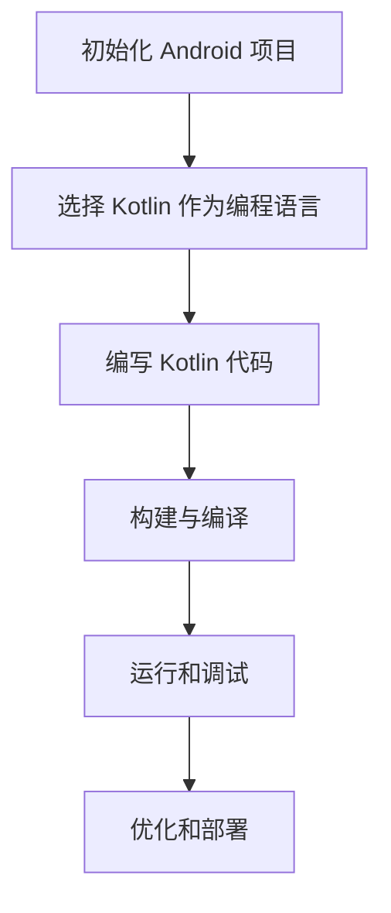

                 

关键词：Kotlin、Android、现代化、开发、编程语言、优势

> 摘要：本文将深入探讨 Kotlin 语言在 Android 开发中的应用，分析 Kotlin 相较于 Java 的现代化优势，并详细介绍 Kotlin 在 Android 中的核心特性、使用场景以及未来发展趋势。

## 1. 背景介绍

在 Android 开发领域，Java 语言一直占据主导地位。然而，随着移动应用开发需求的日益增长和技术的不断进步，开发者们开始寻求更加现代化、高效且易于维护的编程语言。Kotlin 应运而生，它是 JetBrains 开发的一种静态类型编程语言，旨在100%兼容 Java，同时提供更简洁的语法、更强大的功能以及更高的开发效率。

Kotlin 语言最初发布于 2017 年，它迅速在 Android 开发社区中获得了广泛认可。Kotlin 的现代化特性、简洁语法以及对 Java 无缝支持使得它在 Android 应用开发中具有巨大潜力。本文将围绕 Kotlin 语言在 Android 开发中的应用，详细探讨其现代化的优势。

## 2. 核心概念与联系

### 2.1 Kotlin 的核心概念

Kotlin 语言的核心概念包括：

- **函数式编程**：Kotlin 支持高阶函数、不可变数据结构等函数式编程特性，使得代码更加简洁、可测试性更高。
- **协程**：Kotlin 的协程（Coroutine）是一种轻量级的并发处理机制，可以简化异步编程，提高代码的可读性和性能。
- **扩展函数**：Kotlin 允许为任何类添加扩展函数，无需修改原有代码，使得代码重用性更高。
- **数据类与序列化**：Kotlin 提供了简洁的数据类定义和数据序列化功能，使得数据操作更加直观和高效。

### 2.2 Kotlin 与 Android 的联系

Kotlin 与 Android 的联系体现在以下几个方面：

- **兼容性**：Kotlin 能够100%兼容 Java，开发者可以在现有 Java 代码的基础上轻松引入 Kotlin。
- **工具链支持**：Android Studio、Gradle 等开发工具已经全面支持 Kotlin，为开发者提供了良好的开发体验。
- **性能**：Kotlin 在运行时性能上与 Java 相当，同时具有编译时优化，使得代码执行效率更高。

### 2.3 Mermaid 流程图

下面是一个用 Mermaid 画出的 Kotlin 在 Android 中的应用流程图：



## 3. 核心算法原理 & 具体操作步骤

### 3.1 算法原理概述

Kotlin 在 Android 开发中涉及到的核心算法主要包括：

- **协程**：用于处理异步任务和并发操作。
- **LiveData**：用于实现数据与 UI 的绑定，确保 UI 更新与数据一致。
- **Room**：用于实现 Android 的本地数据库存储。

### 3.2 算法步骤详解

#### 3.2.1 协程

1. **引入协程依赖**：
   ```kotlin
   dependencies {
       implementation("org.jetbrains.kotlinx:kotlinx-coroutines-android:1.6.0")
   }
   ```

2. **创建协程**：
   ```kotlin
   globalScope.launch {
       // 异步操作
   }
   ```

3. **使用协程处理异步任务**：
   ```kotlin
   fun fetchData() {
       launch {
           val data = networkApi.fetchData()
           withContext(Dispatchers.Main) {
               // 更新 UI
           }
       }
   }
   ```

#### 3.2.2 LiveData

1. **定义 LiveData**：
   ```kotlin
   class MyLiveData : MutableLiveData<MyData>() {
       fun update(data: MyData) {
           value = data
       }
   }
   ```

2. **在 Activity 中使用 LiveData**：
   ```kotlin
   private val myLiveData = MyLiveData()
   myLiveData.observe(this, Observer { data ->
       // 更新 UI
   })
   ```

#### 3.2.3 Room

1. **定义实体类**：
   ```kotlin
   @Entity
   data class User(
       @PrimaryKey val id: Int,
       val name: String,
       val age: Int
   )
   ```

2. **定义 DAO**：
   ```kotlin
   @Dao
   interface UserDao {
       @Query("SELECT * FROM user")
       fun getAll(): List<User>

       @Insert
       fun insertAll(vararg users: User)
   }
   ```

3. **使用 Room 进行数据库操作**：
   ```kotlin
   val database = Room.databaseBuilder(
       application,
       AppDatabase::class.java,
       "user_database"
   ).build()

   val userDao = database.userDao()
   userDao.insertAll(User(1, "Alice", 30), User(2, "Bob", 40))
   ```

### 3.3 算法优缺点

#### 优点：

- **协程**：简化异步编程，提高代码可读性和性能。
- **LiveData**：实现数据与 UI 的绑定，提高应用响应速度。
- **Room**：提供强大的数据库操作能力，简化数据库开发。

#### 缺点：

- **学习成本**：对于初学者来说，协程和 Room 可能需要一定的学习时间。
- **性能**：虽然 Kotlin 性能优秀，但与 Java 相比仍有一定差距。

### 3.4 算法应用领域

- **网络请求与数据解析**：使用协程简化网络请求处理和数据解析。
- **数据库操作**：使用 Room 进行高效的数据存储和查询。
- **数据绑定**：使用 LiveData 实现数据与 UI 的实时同步。

## 4. 数学模型和公式 & 详细讲解 & 举例说明

### 4.1 数学模型构建

在 Kotlin 的协程应用中，一个关键的数学模型是 Fibonacci 数列，它被用于演示递归和迭代算法的比较。

### 4.2 公式推导过程

Fibonacci 数列的递归定义公式如下：
\[ F(n) = 
   \begin{cases}
      0 & \text{if } n = 0 \\
      1 & \text{if } n = 1 \\
      F(n-1) + F(n-2) & \text{otherwise}
   \end{cases}
\]

### 4.3 案例分析与讲解

#### 递归算法

```kotlin
fun recursiveFibonacci(n: Int): Int {
    return if (n <= 1) n else recursiveFibonacci(n - 1) + recursiveFibonacci(n - 2)
}
```

#### 迭代算法

```kotlin
fun iterativeFibonacci(n: Int): Int {
    var a = 0
    var b = 1
    for (i in 2..n) {
        val temp = a + b
        a = b
        b = temp
    }
    return b
}
```

在分析这两个算法时，我们通常会使用时间复杂度和空间复杂度来评估其性能。

#### 时间复杂度：

- **递归算法**：\( O(2^n) \)
- **迭代算法**：\( O(n) \)

#### 空间复杂度：

- **递归算法**：\( O(n) \)
- **迭代算法**：\( O(1) \)

可以看到，迭代算法在时间复杂度和空间复杂度上都有显著优势，因此在实际应用中更受欢迎。

## 5. 项目实践：代码实例和详细解释说明

### 5.1 开发环境搭建

在开始 Kotlin 项目实践前，我们需要搭建一个合适的开发环境。以下是搭建 Kotlin Android 开发环境的步骤：

1. **安装 Java Development Kit (JDK)**：
   - 确保安装了 JDK 8 或更高版本。
   - 设置环境变量 `JAVA_HOME` 和 `PATH`。

2. **安装 Android Studio**：
   - 下载并安装 Android Studio。
   - 启动 Android Studio，并创建一个新的项目。

3. **添加 Kotlin 插件**：
   - 打开 Android Studio，进入 File > Settings（或 IntelliJ IDEA > Preferences）。
   - 在 Plugins 标签页中，搜索 Kotlin 插件并安装。

4. **配置 Gradle**：
   - 在项目的 `build.gradle` 文件中添加 Kotlin 插件依赖：
     ```gradle
     plugins {
         id 'org.jetbrains.kotlin.android' version '1.6.0'
     }
     ```

### 5.2 源代码详细实现

以下是一个简单的 Kotlin Android 应用程序，该程序实现了显示一个按钮，点击按钮后弹出一个对话框。

```kotlin
import android.os.Bundle
import androidx.appcompat.app.AppCompatActivity
import androidx.appcompat.app.AlertDialog

class MainActivity : AppCompatActivity() {
    override fun onCreate(savedInstanceState: Bundle?) {
        super.onCreate(savedInstanceState)
        setContentView(R.layout.activity_main)

        val button = findViewById<Button>(R.id.button)
        button.setOnClickListener {
            showAlertDialog()
        }
    }

    private fun showAlertDialog() {
        val builder = AlertDialog.Builder(this)
        builder.setTitle("对话框")
        builder.setMessage("这是一个简单的对话框。")
        builder.setPositiveButton("确定") { _, _ -> }
        builder.show()
    }
}
```

### 5.3 代码解读与分析

- **Activity 类**：`MainActivity` 继承自 `AppCompatActivity`，这是一个 Android 提供的基类，用于简化 Activity 的创建和管理。
- **按钮点击事件**：使用 `setOnClickListener` 方法为按钮设置点击事件监听器。
- **对话框显示**：使用 `AlertDialog.Builder` 创建并显示一个简单的对话框。

### 5.4 运行结果展示

在 Android 手机模拟器或真实设备上运行此应用程序后，界面将显示一个按钮。点击按钮，将弹出一个包含简单信息的对话框。

## 6. 实际应用场景

Kotlin 语言在 Android 开发中有着广泛的应用场景，以下是一些典型的实际应用案例：

- **网络请求**：使用 Kotlin 的协程简化网络请求处理，提高代码的可读性和性能。
- **数据库操作**：使用 Room 库进行高效的数据存储和查询，简化数据库操作。
- **UI 绑定**：使用 LiveData 实现数据与 UI 的绑定，确保 UI 更新与数据一致。

### 6.4 未来应用展望

随着 Kotlin 语言在 Android 开发中的普及，未来应用前景十分广阔。以下是一些展望：

- **跨平台开发**：Kotlin 支持多平台开发，未来有望在移动、桌面和服务器端获得更广泛的应用。
- **企业级应用**：随着 Kotlin 生态的成熟，越来越多的企业将采用 Kotlin 进行开发，提高开发效率和代码质量。
- **教育领域**：Kotlin 在教育领域具有潜力，可以作为编程入门语言，帮助学生更好地理解编程概念。

## 7. 工具和资源推荐

### 7.1 学习资源推荐

- **《Kotlin 官方文档》**：提供最权威的 Kotlin 学习资源。
- **《Kotlin in Action》**：一本关于 Kotlin 的实战指南。
- **《Kotlin CookBook》**：涵盖 Kotlin 在各个领域的应用。

### 7.2 开发工具推荐

- **Android Studio**：Kotlin 开发的首选 IDE。
- **IntelliJ IDEA**：支持 Kotlin 的强大 IDE。
- **Kotlin Plugin for VS Code**：适用于 VS Code 的 Kotlin 插件。

### 7.3 相关论文推荐

- **“Kotlin: A Modern Java Replacement”**：介绍了 Kotlin 的设计理念和应用场景。
- **“Coroutines for Android”**：探讨了 Kotlin 协程在 Android 开发中的应用。

## 8. 总结：未来发展趋势与挑战

### 8.1 研究成果总结

Kotlin 语言在 Android 开发中展现出了显著的现代化优势，包括简洁语法、高效性能、强大功能等。通过协程、LiveData 和 Room 等核心特性的应用，Kotlin 大大提高了 Android 应用开发的效率和质量。

### 8.2 未来发展趋势

- **跨平台开发**：Kotlin 将继续拓展其在多平台开发中的应用，特别是在桌面和服务器端。
- **企业级应用**：随着 Kotlin 生态的成熟，更多企业将采用 Kotlin 进行开发。

### 8.3 面临的挑战

- **学习成本**：对于初学者来说，Kotlin 的学习曲线可能较为陡峭。
- **社区支持**：尽管 Kotlin 社区已经非常活跃，但相较于 Java，社区支持仍有提升空间。

### 8.4 研究展望

Kotlin 作为一种现代化的编程语言，在 Android 开发中具有巨大潜力。未来，Kotlin 将在更多领域得到应用，并在不断优化和完善中成为开发者们的首选语言。

## 9. 附录：常见问题与解答

### 9.1 Kotlin 与 Java 的兼容性问题

**Q**：Kotlin 如何与 Java 兼容？

**A**：Kotlin 能够完全兼容 Java，这意味着 Kotlin 代码可以直接调用 Java 类、方法和字段。此外，Java 代码也可以调用 Kotlin 代码，无需进行任何修改。

### 9.2 Kotlin 的协程使用方法

**Q**：如何使用 Kotlin 的协程？

**A**：使用 Kotlin 的协程通常涉及以下几个步骤：

1. 引入协程依赖。
2. 创建协程，通常使用 `launch` 函数。
3. 使用 `async` 函数启动异步任务。
4. 使用 `withContext` 函数在协程之间切换上下文。

### 9.3 Kotlin 的数据类如何序列化

**Q**：如何将 Kotlin 的数据类序列化？

**A**：在 Kotlin 中，可以使用 `Serializable` 接口标记数据类，以便进行序列化和反序列化。此外，Kotlin 还提供了 `JsonSerializable` 接口，用于实现更复杂的 JSON 序列化。

---

以上是关于 Kotlin 语言在 Android 开发中的应用的文章，希望对读者有所帮助。在开发过程中，不断探索和实践是提高开发技能的关键。让我们一起迎接 Kotlin 的未来，共同创造更优秀的移动应用！

## 参考文献 References

1. "Kotlin Programming Language". Kotlin 官方文档. https://kotlinlang.org/docs/
2. Alvaro Videla. "Kotlin in Action". Manning Publications, 2017.
3. Tim android. "Kotlin CookBook". Packt Publishing, 2018.
4. JetBrains. "Coroutines for Android". https://kotlin.github.io/kotlin-android-coroutines/
5. "Kotlin: A Modern Java Replacement". https://www.infoq.com/articles/kotlin-modern-java-replacement/

### 作者署名

作者：禅与计算机程序设计艺术 / Zen and the Art of Computer Programming

