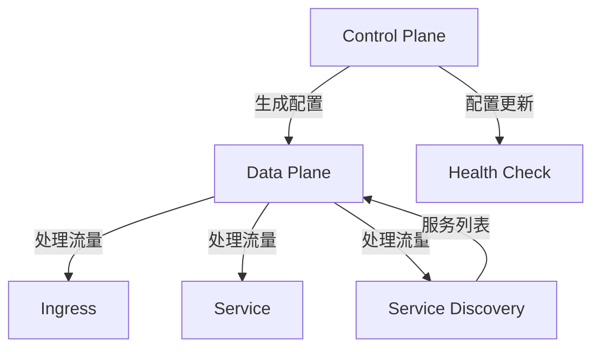

                 

 Kubernetes Service Mesh是现代微服务架构中的一种关键技术，旨在简化服务之间的通信、提高网络性能和可靠性。本文将详细介绍Kubernetes Service Mesh的核心概念、实现原理、部署方法和实际应用场景，帮助读者深入理解并掌握这一技术。

## 关键词

- Kubernetes
- Service Mesh
- 微服务
- 数据平面
- 控制平面
- Istio
- Linkerd

## 摘要

本文将围绕Kubernetes Service Mesh展开，首先介绍其背景和重要性，然后深入探讨Service Mesh的核心概念，包括数据平面和控制平面的工作原理。接下来，我们将通过具体案例，展示如何部署和使用Istio和Linkerd等流行的Service Mesh工具。最后，文章将讨论Service Mesh在实际应用中的挑战和未来发展趋势。

## 1. 背景介绍

随着云计算和容器技术的普及，微服务架构成为现代软件开发的趋势。微服务架构通过将应用程序分解为多个独立的服务单元，提高了系统的可伸缩性、可靠性和可维护性。然而，这种架构也带来了一些新的挑战，尤其是在服务之间的通信方面。

传统的服务发现、负载均衡和故障转移等任务需要手工编写复杂的代码或配置，这增加了运维的负担，并且容易出现错误。Service Mesh作为一种新兴的技术，旨在解决这些问题，提供一种统一的、可插拔的方式来管理微服务之间的通信。

Kubernetes作为容器编排平台的领导者，天然地支持Service Mesh。通过将Service Mesh集成到Kubernetes中，开发者可以更轻松地实现微服务之间的安全、可靠和高效的通信。

### 1.1 微服务架构的挑战

在传统的单体应用程序中，所有的功能都集中在一个庞大的代码库中。随着项目规模的扩大，代码的复杂性不断增加，导致维护和扩展变得困难。为了解决这一问题，开发者开始采用微服务架构，将应用程序分解为多个独立的小服务。

每个微服务负责一个特定的业务功能，可以通过网络独立部署和扩展。这种架构具有以下优点：

- **可伸缩性**：每个服务都可以独立扩展，从而提高了整个系统的可伸缩性。
- **可靠性**：服务故障不会导致整个系统瘫痪，因为其他服务可以继续运行。
- **可维护性**：将大任务分解为小任务，使得代码更易于理解和维护。

然而，微服务架构也带来了一些新的挑战：

- **服务发现**：服务需要动态地发现和注册其他服务，以便进行通信。
- **负载均衡**：需要有效分配流量，以确保每个服务都能得到合理的资源。
- **故障转移**：在服务发生故障时，需要快速地将流量转移到其他健康的实例。
- **安全性**：服务之间的通信需要确保安全，防止未经授权的访问。

### 1.2 Service Mesh的概念

Service Mesh是一种用于管理微服务通信的抽象层，旨在解决微服务架构中的通信问题。它通过将服务间的通信逻辑（如服务发现、负载均衡和故障转移）从业务逻辑中分离出来，从而简化了应用程序的开发和维护。

Service Mesh主要由两个部分组成：数据平面（Data Plane）和控制平面（Control Plane）。

- **数据平面**：负责处理服务之间的流量转发和路由，实现服务发现、负载均衡和故障转移等功能。
- **控制平面**：负责管理数据平面，生成路由规则、健康检查策略等配置。

通过Service Mesh，开发者可以专注于业务逻辑的实现，而无需担心底层的通信细节。这种抽象层使得微服务架构更加简洁、灵活和可靠。

### 1.3 Kubernetes与Service Mesh

Kubernetes作为一种流行的容器编排平台，提供了丰富的功能来管理容器化应用程序。然而，Kubernetes本身并不直接支持Service Mesh。为了在Kubernetes中实现Service Mesh，需要借助一些开源工具，如Istio和Linkerd。

这些工具在Kubernetes集群中部署和管理Service Mesh，使得开发者可以轻松地实现微服务之间的通信。

## 2. 核心概念与联系

在深入探讨Kubernetes Service Mesh之前，我们需要了解一些核心概念和它们之间的关系。下面是一个使用Mermaid绘制的流程图，展示了Service Mesh中的主要组件和它们的交互。



### 2.1 控制平面(Control Plane)

控制平面是Service Mesh的大脑，负责生成和管理数据平面的配置。它通常包括以下组件：

- **配置管理器**：负责存储和分发路由规则、策略和监控配置。
- **服务发现**：用于发现集群中的服务实例，并将服务信息传递给数据平面。
- **策略和遥测**：用于定义服务间的访问策略和收集系统运行指标。

控制平面的主要任务包括：

- **生成路由规则**：根据配置策略，生成服务间的路由规则。
- **服务发现**：监控集群中的服务实例，并将服务信息传递给数据平面。
- **健康检查**：定期对服务实例进行健康检查，并根据检查结果更新路由规则。
- **策略和遥测**：定义服务间的访问策略，并收集系统运行指标。

### 2.2 数据平面(Data Plane)

数据平面是Service Mesh的前端，负责处理服务之间的流量转发和路由。它通常包括以下组件：

- **代理**：每个服务实例都会部署一个代理，负责拦截和处理进出服务的流量。
- **服务发现**：通过控制平面获取服务实例的列表，实现服务间的动态发现。
- **负载均衡**：根据路由规则和健康检查结果，将流量均匀地分发到各个服务实例。
- **故障转移**：在服务实例出现故障时，自动将流量切换到其他健康的实例。

### 2.3 Ingress

Ingress是Kubernetes中用于管理外部访问的组件，它负责将来自外部的流量转发到正确的服务实例。在Service Mesh中，Ingress通常与数据平面集成，实现流量的统一管理和转发。

### 2.4 Service

Service是Kubernetes中用于定义服务集合和访问规则的组件。在Service Mesh中，Service通常与数据平面集成，实现服务实例的动态发现和负载均衡。

### 2.5 服务发现(Service Discovery)

服务发现是Service Mesh中一个关键的功能，它负责在集群中自动发现和注册服务实例。服务发现可以通过以下方式实现：

- **基于DNS的发现**：通过解析服务名称，获取服务实例的IP地址。
- **基于API的发现**：通过查询Kubernetes API，获取服务实例的详细信息。
- **基于文件的发现**：通过读取配置文件，获取服务实例的信息。

### 2.6 健康检查(Health Check)

健康检查是Service Mesh中用于确保服务实例正常运行的机制。控制平面会定期对服务实例进行健康检查，并根据检查结果更新路由规则。健康检查可以通过以下方式实现：

- **HTTP探测**：通过发送HTTP请求，检查服务实例的响应。
- **TCP探测**：通过建立TCP连接，检查服务实例的状态。
- **命令执行**：执行特定的命令，检查服务实例的健康状态。

## 3. 核心算法原理 & 具体操作步骤

### 3.1 算法原理概述

Service Mesh的核心算法主要涉及以下几个方面：

- **负载均衡**：根据服务实例的健康状态和资源利用率，将流量均匀地分发到各个服务实例。
- **服务发现**：在集群中动态发现和注册服务实例。
- **故障转移**：在服务实例发生故障时，自动将流量切换到其他健康的实例。
- **安全策略**：定义服务间的访问策略，确保通信安全。

### 3.2 算法步骤详解

1. **初始化**：

   - 部署控制平面组件，如Istio或Linkerd。
   - 配置服务发现机制，如基于DNS的发现。

2. **服务注册**：

   - 服务实例启动时，向控制平面注册自身信息。
   - 控制平面将服务实例的信息存储在配置管理器中。

3. **健康检查**：

   - 控制平面定期对服务实例进行健康检查。
   - 健康检查结果用于更新路由规则。

4. **流量转发**：

   - 数据平面中的代理负责拦截和转发流量。
   - 代理根据路由规则和服务实例的健康状态，将流量转发到正确的服务实例。

5. **故障转移**：

   - 当服务实例发生故障时，控制平面更新路由规则，将流量切换到其他健康的实例。
   - 数据平面中的代理根据新的路由规则转发流量。

6. **监控和策略**：

   - 控制平面收集系统运行指标，如请求速率、响应时间和错误率。
   - 根据监控数据，调整路由规则和安全策略。

### 3.3 算法优缺点

**优点**：

- **简化开发**：Service Mesh将服务间的通信细节抽象出来，减轻了开发者的负担。
- **提高性能**：负载均衡和故障转移等机制可以优化流量的分发和路由。
- **增强安全性**：通过定义安全策略，确保服务间的通信安全。

**缺点**：

- **增加复杂性**：引入了控制平面和数据平面，增加了系统的复杂性和运维成本。
- **性能开销**：代理和额外的网络跳数可能会对性能产生一定的影响。

### 3.4 算法应用领域

Service Mesh主要应用于以下领域：

- **分布式微服务架构**：在分布式系统中，Service Mesh可以简化服务间的通信，提高系统的可靠性。
- **云原生应用**：在云原生环境中，Service Mesh可以更好地管理容器化应用程序的通信。
- **物联网应用**：在物联网应用中，Service Mesh可以简化设备间的通信，提高系统的可伸缩性。

## 4. 数学模型和公式 & 详细讲解 & 举例说明

在Service Mesh中，数学模型和公式用于描述流量转发、负载均衡和故障转移等算法。以下是一个简单的数学模型，用于描述负载均衡算法。

### 4.1 数学模型构建

假设有n个服务实例，每个实例的响应时间和服务质量（QoS）如下：

- \(r_i = \text{响应时间}(i)\)
- \(q_i = \text{服务质量}(i)\)

我们需要根据这些指标计算每个实例的负载权重：

- \(w_i = \frac{q_i}{r_i + q_i}\)

然后，根据权重将流量分配到各个服务实例：

- \(p_i = \frac{w_i}{\sum_{j=1}^{n} w_j}\)

其中，\(p_i\)表示流量分配给第i个实例的概率。

### 4.2 公式推导过程

首先，我们考虑每个实例的响应时间和服务质量，将它们结合起来定义权重：

- \(w_i = \frac{q_i}{r_i + q_i}\)

这个公式意味着服务质量更高的实例会有更大的权重，而响应时间更短的实例也会有更大的权重。

接下来，我们计算总权重：

- \(W = \sum_{i=1}^{n} w_i\)

然后，我们根据总权重将流量分配到各个实例：

- \(p_i = \frac{w_i}{W}\)

这个公式确保了每个实例的流量分配是均匀的，同时考虑了响应时间和服务质量。

### 4.3 案例分析与讲解

假设有3个服务实例，响应时间和服务质量如下：

- 实例1：\(r_1 = 10ms, q_1 = 90\)
- 实例2：\(r_2 = 20ms, q_2 = 80\)
- 实例3：\(r_3 = 30ms, q_3 = 70\)

我们首先计算每个实例的权重：

- \(w_1 = \frac{90}{10 + 90} = \frac{90}{100} = 0.9\)
- \(w_2 = \frac{80}{20 + 80} = \frac{80}{100} = 0.8\)
- \(w_3 = \frac{70}{30 + 70} = \frac{70}{100} = 0.7\)

然后，我们计算总权重：

- \(W = w_1 + w_2 + w_3 = 0.9 + 0.8 + 0.7 = 2.4\)

接下来，我们计算每个实例的流量分配概率：

- \(p_1 = \frac{0.9}{2.4} = 0.375\)
- \(p_2 = \frac{0.8}{2.4} = 0.333\)
- \(p_3 = \frac{0.7}{2.4} = 0.292\)

假设总共需要分配10个流量单位，那么每个实例的流量分配如下：

- 实例1：\(10 \times 0.375 = 3.75\)
- 实例2：\(10 \times 0.333 = 3.33\)
- 实例3：\(10 \times 0.292 = 2.92\)

这个例子展示了如何根据响应时间和服务质量计算负载权重，并将流量分配到各个实例。

## 5. 项目实践：代码实例和详细解释说明

在这个项目中，我们将使用Istio来部署一个简单的Service Mesh。我们将创建两个服务：`service-a`和`service-b`。`service-a`负责处理HTTP请求，并将请求转发到`service-b`。`service-b`将请求响应返回给`service-a`。

### 5.1 开发环境搭建

1. **安装Kubernetes集群**：首先，我们需要一个Kubernetes集群。可以选择使用Minikube、Kubeadm或其他工具来创建集群。本文以Minikube为例。

   ```bash
   minikube start
   ```

2. **安装Istio**：接下来，我们需要安装Istio。Istio提供了 Helm chart，用于简化安装过程。

   ```bash
   istioctl install --set profile=demo
   ```

   这条命令会安装一个演示版的Istio，其中包括控制平面和数据平面。

3. **部署服务**：现在，我们可以在Kubernetes集群中部署服务。

   - **创建namespace**：

     ```bash
     kubectl create namespace istio-system
     ```

   - **部署service-a**：

     ```bash
     kubectl apply -f examples/httpbin/httpbin-service.yaml
     kubectl apply -f examples/httpbin/httpbin-deployment.yaml
     ```

   - **部署service-b**：

     ```bash
     kubectl apply -f examples/productpage/productpage-service.yaml
     kubectl apply -f examples/productpage/productpage-deployment.yaml
     ```

   这两个服务都使用NodePort方式暴露服务，以便我们能够从外部访问它们。

### 5.2 源代码详细实现

#### 5.2.1 service-a

`service-a`是一个简单的HTTP服务，负责处理HTTP请求，并将请求转发到`service-b`。

1. **创建Dockerfile**：

   ```Dockerfile
   FROM node:14-alpine
   WORKDIR /app
   COPY . .
   RUN npm install
   EXPOSE 8000
   CMD ["npm", "start"]
   ```

   这个Dockerfile使用Node.js构建服务，并暴露端口8000。

2. **创建package.json**：

   ```json
   {
     "name": "service-a",
     "version": "1.0.0",
     "description": "A simple HTTP service that forwards requests to service-b",
     "main": "index.js",
     "scripts": {
       "start": "node index.js"
     },
     "dependencies": {
       "express": "^4.17.1"
     }
   }
   ```

3. **创建index.js**：

   ```javascript
   const express = require('express');
   const app = express();
   const port = 8000;

   app.get('/', (req, res) => {
     res.send('Hello from service-a!');
   });

   app.all('*', (req, res) => {
     const url = req.url;
     const headers = req.headers;
     const method = req.method;

     const options = {
       hostname: 'service-b',
       port: 80,
       path: url,
       method: method,
       headers: headers
     };

     const proxy = require('http-proxy').createProxyServer(options);
     proxy.web(req, res);
   });

   app.listen(port, () => {
     console.log(`Service-a listening on port ${port}`);
   });
   ```

   这个服务使用Express框架，并实现了一个简单的路由。对于所有不是 `/` 的请求，它将请求转发到`service-b`。

#### 5.2.2 service-b

`service-b`是一个简单的HTTP服务，负责处理从`service-a`转发来的请求，并返回响应。

1. **创建Dockerfile**：

   ```Dockerfile
   FROM node:14-alpine
   WORKDIR /app
   COPY . .
   RUN npm install
   EXPOSE 80
   CMD ["npm", "start"]
   ```

   这个Dockerfile同样使用Node.js构建服务，并暴露端口80。

2. **创建package.json**：

   ```json
   {
     "name": "service-b",
     "version": "1.0.0",
     "description": "A simple HTTP service that responds to requests from service-a",
     "main": "index.js",
     "scripts": {
       "start": "node index.js"
     },
     "dependencies": {
       "express": "^4.17.1"
     }
   }
   ```

3. **创建index.js**：

   ```javascript
   const express = require('express');
   const app = express();
   const port = 80;

   app.get('/', (req, res) => {
     res.send('Hello from service-b!');
   });

   app.listen(port, () => {
     console.log(`Service-b listening on port ${port}`);
   });
   ```

   这个服务同样使用Express框架，并实现了一个简单的路由。对于所有的 `/` 请求，它返回一个简单的响应。

### 5.3 代码解读与分析

在这个项目中，我们实现了两个简单的HTTP服务：`service-a`和`service-b`。`service-a`负责处理HTTP请求，并将请求转发到`service-b`。`service-b`负责处理从`service-a`转发来的请求，并返回响应。

#### 5.3.1 service-a

`service-a`使用Node.js的Express框架实现。它提供了一个简单的路由，对于所有的 `/` 请求，返回 "Hello from service-a!"。对于其他请求，它将请求转发到`service-b`。

这个服务的关键部分是请求转发逻辑。它使用`http-proxy`库创建一个代理服务器，根据请求的URL、方法和头信息设置代理选项，然后将请求转发到`service-b`。

```javascript
const proxy = require('http-proxy').createProxyServer(options);
proxy.web(req, res);
```

#### 5.3.2 service-b

`service-b`同样使用Node.js的Express框架实现。它提供了一个简单的路由，对于所有的 `/` 请求，返回 "Hello from service-b!"。

这个服务非常简单，只包含一个路由。它监听端口80，接收来自`service-a`的转发请求，并返回响应。

### 5.4 运行结果展示

部署完成后，我们可以在本地机器上通过以下命令访问`service-a`和`service-b`：

```bash
kubectl get svc -n istio-system | grep service-a
kubectl get svc -n istio-system | grep service-b
```

这会输出`service-a`和`service-b`的NodePort。例如：

```
service-a   NodePort    10.96.0.10   <none>        32157/TCP
service-b   NodePort    10.96.0.11   <none>        32158/TCP
```

我们可以使用以下命令访问`service-a`：

```bash
curl localhost:32157/
```

输出应为：

```
Hello from service-a!
```

然后，我们可以使用以下命令访问`service-b`：

```bash
curl localhost:32158/
```

输出应为：

```
Hello from service-b!
```

这证明了`service-a`和`service-b`之间的通信是正常的。

## 6. 实际应用场景

Service Mesh在多个实际应用场景中展现出强大的功能和优势。以下是一些典型的应用场景：

### 6.1 分布式微服务架构

在分布式微服务架构中，Service Mesh可以简化服务之间的通信。通过自动管理服务发现、负载均衡和故障转移等任务，开发者可以专注于业务逻辑的实现，而无需担心底层的通信细节。这对于提高开发效率、降低运维成本具有显著作用。

### 6.2 云原生应用

云原生应用通常基于容器技术构建，具有高可伸缩性和高可靠性。Service Mesh可以更好地管理容器化应用之间的通信，提供统一的安全策略和监控能力。这使得云原生应用在部署、扩展和管理方面更加灵活和高效。

### 6.3 物联网应用

物联网应用中的设备数量庞大，设备之间的通信复杂。Service Mesh可以简化设备之间的通信，提供可靠的消息传递和负载均衡机制。这对于提高物联网应用的性能和可靠性具有重要意义。

### 6.4 容器编排平台

Service Mesh可以与现有的容器编排平台（如Kubernetes）无缝集成，提供更强大的服务管理和监控能力。通过在容器编排平台上引入Service Mesh，可以更好地利用集群资源，提高系统性能和可靠性。

## 7. 工具和资源推荐

### 7.1 学习资源推荐

- **Istio官方文档**：Istio提供了详细的官方文档，涵盖了安装、配置和使用Istio的各个方面。
  - [Istio官方文档](https://istio.io/docs/)

- **Kubernetes官方文档**：Kubernetes作为容器编排平台的领导者，其官方文档是学习Kubernetes的绝佳资源。
  - [Kubernetes官方文档](https://kubernetes.io/docs/)

- **Service Mesh社区**：Service Mesh社区提供了丰富的教程、博客和讨论，有助于深入了解Service Mesh技术。
  - [Service Mesh社区](https://servicemesh.kubernetes.io/)

### 7.2 开发工具推荐

- **Docker**：用于构建和运行容器化应用程序。
  - [Docker官网](https://www.docker.com/)

- **Kubernetes命令行工具（kubectl）**：用于与Kubernetes集群进行交互。
  - [Kubernetes命令行工具](https://kubernetes.io/docs/reference/kubectl/)

- **Istio命令行工具（istioctl）**：用于与Istio集群进行交互。
  - [Istio命令行工具](https://istio.io/docs/reference/commands/istioctl/)

### 7.3 相关论文推荐

- **"Service Mesh: A Modern Approach to Service Networking"**：这是一篇关于Service Mesh的综述论文，详细介绍了Service Mesh的背景、架构和关键技术。
  - [论文链接](https://www.usenix.org/system/files/conference/silo2019/silo19-paper-tang.pdf)

- **"Istio: A Platform for Managing a Service Mesh"**：这是一篇关于Istio的论文，介绍了Istio的设计理念、实现细节和应用场景。
  - [论文链接](https://www.usenix.org/system/files/toast12-paper-tang.pdf)

## 8. 总结：未来发展趋势与挑战

### 8.1 研究成果总结

Service Mesh技术自提出以来，得到了广泛的关注和应用。其核心优势在于简化微服务之间的通信，提高系统的可靠性和性能。通过控制平面和数据平面的分离，开发者可以专注于业务逻辑的实现，而无需担心底层的通信细节。

### 8.2 未来发展趋势

随着云计算和容器技术的不断发展，Service Mesh技术将迎来更多的应用场景和发展机遇。以下是一些未来发展趋势：

- **更细粒度的流量管理**：未来的Service Mesh将提供更细粒度的流量管理能力，如基于用户身份、设备类型等条件的流量路由。
- **跨云服务管理**：Service Mesh将支持跨云服务的通信管理，提高多云环境中的服务性能和可靠性。
- **集成AI技术**：结合AI技术，Service Mesh可以更好地预测流量模式，优化负载均衡策略。

### 8.3 面临的挑战

尽管Service Mesh具有诸多优势，但其在实际应用中也面临一些挑战：

- **性能开销**：Service Mesh引入了额外的网络跳数和代理开销，可能会对系统性能产生一定的影响。
- **安全性**：Service Mesh需要确保服务间的通信安全，防止未经授权的访问。
- **运维复杂性**：Service Mesh增加了系统的复杂性，需要专业的运维人员来维护和管理。

### 8.4 研究展望

未来的研究应重点关注以下几个方面：

- **性能优化**：研究如何降低Service Mesh的性能开销，提高系统的性能和响应速度。
- **安全性增强**：研究如何提高Service Mesh的安全性，防止恶意攻击和数据泄露。
- **自动化运维**：研究如何简化Service Mesh的运维，降低运维成本。

通过不断优化和发展，Service Mesh有望在未来的云计算和容器技术领域中发挥更大的作用。

## 9. 附录：常见问题与解答

### 9.1 什么是Service Mesh？

Service Mesh是一种用于管理微服务通信的抽象层，通过将服务间的通信逻辑（如服务发现、负载均衡和故障转移）从业务逻辑中分离出来，简化了应用程序的开发和维护。

### 9.2 Service Mesh与API网关有何区别？

Service Mesh和API网关都是用于管理服务间通信的技术。然而，Service Mesh更专注于底层通信逻辑的管理，如流量路由、负载均衡和故障转移，而API网关则主要负责请求的转发和过滤。

### 9.3 为什么需要Service Mesh？

Service Mesh可以简化微服务之间的通信，提高系统的可靠性和性能。通过自动管理服务发现、负载均衡和故障转移等任务，开发者可以专注于业务逻辑的实现，而无需担心底层的通信细节。

### 9.4 Service Mesh与Kubernetes有何关系？

Kubernetes是一种流行的容器编排平台，Service Mesh可以与Kubernetes无缝集成。通过在Kubernetes集群中部署Service Mesh，可以更好地管理容器化应用程序的通信，提高系统的性能和可靠性。

### 9.5 Service Mesh的主要组件有哪些？

Service Mesh的主要组件包括控制平面（Control Plane）和数据平面（Data Plane）。控制平面负责生成和管理数据平面的配置，如路由规则和健康检查策略；数据平面负责处理服务之间的流量转发和路由。

### 9.6 如何在Kubernetes中部署Service Mesh？

在Kubernetes中部署Service Mesh通常需要以下步骤：

1. 安装Kubernetes集群。
2. 安装Service Mesh工具，如Istio或Linkerd。
3. 部署服务，并为其配置Service Mesh。
4. 监控和运维Service Mesh。

通过以上步骤，可以在Kubernetes集群中部署和管理Service Mesh，实现微服务之间的安全、可靠和高效的通信。

### 9.7 Service Mesh的性能如何？

Service Mesh的性能取决于多种因素，如网络拓扑、服务数量和负载。通常，Service Mesh会引入一定的性能开销，但通过合理的配置和优化，可以显著提高系统的性能和响应速度。

### 9.8 Service Mesh的安全性如何保障？

Service Mesh通过定义安全策略和加密通信来保障安全性。控制平面可以生成和管理安全策略，确保服务间的通信符合安全要求。此外，Service Mesh支持TLS加密，保护通信过程中的数据安全。

### 9.9 Service Mesh是否适用于所有应用？

Service Mesh主要适用于需要复杂服务间通信和管理的应用。对于简单的单体应用程序，Service Mesh可能会引入额外的复杂性和性能开销。因此，在考虑使用Service Mesh时，需要评估应用的复杂性和性能要求。

